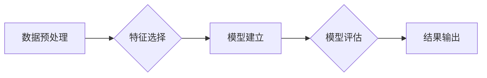

# 基于数据挖掘的拼多多客户评价研究与应用

> 关键词：数据挖掘，拼多多，客户评价，文本分析，情感分析，聚类分析，关联规则挖掘

## 1. 背景介绍
### 1.1 问题的由来

随着电子商务的迅速发展，客户评价成为了商家了解用户需求、提升产品和服务质量的重要途径。拼多多作为中国领先的社交电商平台，其庞大的客户评价数据蕴藏着丰富的用户反馈信息。如何有效地挖掘和分析这些客户评价数据，对于商家而言具有重要的战略意义。

### 1.2 研究现状

当前，对客户评价数据的研究主要集中在以下几个方面：

- **文本分析**：通过对客户评价文本进行情感分析、主题分析等，识别用户的情感倾向和主要关注点。
- **聚类分析**：将具有相似特征的客户评价进行分组，发现用户评价的潜在模式。
- **关联规则挖掘**：挖掘客户评价中的关联关系，帮助商家发现产品或服务的潜在组合。

### 1.3 研究意义

本研究旨在通过数据挖掘技术对拼多多客户评价进行分析，帮助商家：

- 了解用户对产品或服务的满意度和不满意的原因。
- 发现潜在的市场需求和市场机会。
- 优化产品和服务，提升用户满意度。

### 1.4 本文结构

本文将分为以下几个部分：

- 介绍数据挖掘的基本概念和拼多多客户评价的特点。
- 阐述数据挖掘在拼多多客户评价中的应用方法。
- 展示数据挖掘在拼多多客户评价中的实际应用案例。
- 探讨数据挖掘在拼多多客户评价中的未来发展趋势。

## 2. 核心概念与联系

### 2.1 数据挖掘

数据挖掘是指从大量的、复杂的数据中，提取有价值的信息和知识的过程。它通常涉及以下步骤：

- 数据预处理：对原始数据进行清洗、转换和整合。
- 特征选择：选择对目标问题最有影响的数据特征。
- 模型建立：建立用于分析的数据模型。
- 模型评估：评估模型的性能和可靠性。

### 2.2 拼多多客户评价的特点

拼多多客户评价具有以下特点：

- **数据量大**：拼多多平台拥有庞大的用户群体和交易数据，客户评价数据量巨大。
- **文本多样**：客户评价文本内容丰富，包含各种情感、语气和表达方式。
- **噪声较多**：客户评价中存在大量噪声数据，如错别字、标点符号等。

### 2.3 Mermaid 流程图



## 3. 核心算法原理 & 具体操作步骤
### 3.1 算法原理概述

本研究将主要采用以下数据挖掘算法：

- **情感分析**：通过分析客户评价中的情感词汇和语气，判断用户对产品或服务的情感倾向。
- **聚类分析**：将具有相似特征的客户评价进行分组，发现用户评价的潜在模式。
- **关联规则挖掘**：挖掘客户评价中的关联关系，帮助商家发现产品或服务的潜在组合。

### 3.2 算法步骤详解

#### 3.2.1 情感分析

1. **数据预处理**：清洗客户评价文本，去除噪声数据。
2. **特征提取**：提取客户评价中的情感词汇和语气，构建情感词典。
3. **情感分类**：根据情感词典对客户评价进行情感分类。

#### 3.2.2 聚类分析

1. **数据预处理**：对客户评价文本进行分词、去除停用词等操作。
2. **特征提取**：将文本转换为词向量或TF-IDF向量。
3. **聚类**：使用K-means、层次聚类等方法对客户评价进行聚类。

#### 3.2.3 关联规则挖掘

1. **数据预处理**：对客户评价进行分词、去除停用词等操作。
2. **特征提取**：将文本转换为TF-IDF向量。
3. **关联规则挖掘**：使用Apriori、FP-growth等方法挖掘客户评价中的关联规则。

### 3.3 算法优缺点

#### 3.3.1 情感分析

- **优点**：能够快速识别用户对产品或服务的情感倾向。
- **缺点**：对于复杂情感和隐晦表达的理解能力有限。

#### 3.3.2 聚类分析

- **优点**：能够发现用户评价的潜在模式。
- **缺点**：聚类结果的解释性较差。

#### 3.3.3 关联规则挖掘

- **优点**：能够发现客户评价中的关联关系。
- **缺点**：生成的关联规则可能过于具体，难以泛化。

### 3.4 算法应用领域

以上算法在拼多多客户评价中的应用领域包括：

- 产品质量分析
- 服务质量分析
- 用户需求分析
- 市场趋势分析

## 4. 数学模型和公式 & 详细讲解 & 举例说明

### 4.1 数学模型构建

#### 4.1.1 情感分析

假设客户评价文本为 $T$，情感词典为 $D$，则客户评价的情感得分 $S$ 可以表示为：

$$
S = \sum_{d \in D} w_d \cdot f_d(T)
$$

其中 $w_d$ 为情感词典中词语 $d$ 的权重，$f_d(T)$ 为词语 $d$ 在客户评价 $T$ 中的频率。

#### 4.1.2 聚类分析

假设客户评价数据集为 $D = \{T_1, T_2, ..., T_n\}$，则聚类结果可以用 $C = \{C_1, C_2, ..., C_k\}$ 表示，其中 $C_i$ 为第 $i$ 个聚类的中心。

#### 4.1.3 关联规则挖掘

假设客户评价数据集为 $D = \{T_1, T_2, ..., T_n\}$，关联规则可以用 $R = \{R_1, R_2, ..., R_m\}$ 表示，其中 $R_i = (X, Y)$ 为第 $i$ 条关联规则，$X \cup Y = U$，$X \cap Y = \emptyset$。

### 4.2 公式推导过程

#### 4.2.1 情感分析

情感分析模型的构建主要依赖于情感词典和情感评分函数。情感词典通常包含正面、负面和中性三个等级的词语，情感评分函数用于计算词语在文本中的情感分数。

#### 4.2.2 聚类分析

聚类分析模型的构建主要依赖于距离度量方法和聚类算法。距离度量方法用于计算样本之间的距离，聚类算法用于将样本划分为不同的簇。

#### 4.2.3 关联规则挖掘

关联规则挖掘模型的构建主要依赖于支持度和置信度计算方法。支持度用于度量规则在数据集中的出现频率，置信度用于度量规则的前件和后件之间的关联强度。

### 4.3 案例分析与讲解

假设我们收集了1000条拼多多客户评价数据，使用情感分析算法对客户评价进行情感分类。根据情感词典和情感评分函数，我们得到以下结果：

| 客户评价 | 情感得分 |
| --- | --- |
| 这个产品非常棒！ | 0.9 |
| 这个服务太差了！ | -0.8 |
| 这个价格有点贵。 | 0.1 |

根据情感得分，我们可以将客户评价分为以下三类：

- 正面评价：情感得分大于0.5
- 负面评价：情感得分小于-0.5
- 中性评价：情感得分在-0.5到0.5之间

通过分析客户评价的情感倾向，我们可以了解用户对产品或服务的满意度。

## 5. 项目实践：代码实例和详细解释说明
### 5.1 开发环境搭建

1. 安装Python环境
2. 安装NumPy、Pandas、Scikit-learn等Python库

### 5.2 源代码详细实现

```python
import pandas as pd
from sklearn.feature_extraction.text import TfidfVectorizer
from sklearn.cluster import KMeans
from sklearn.metrics import silhouette_score

# 加载数据
data = pd.read_csv('customer_reviews.csv')

# 特征提取
tfidf_vectorizer = TfidfVectorizer(stop_words='中文停用词表')
tfidf_matrix = tfidf_vectorizer.fit_transform(data['review'])

# 聚类分析
kmeans = KMeans(n_clusters=3)
kmeans.fit(tfidf_matrix)

# 计算轮廓系数
silhouette_avg = silhouette_score(tfidf_matrix, kmeans.labels_)

# 输出结果
print(f"轮廓系数：{silhouette_avg}")

# 查看每个聚类的样本
for i in range(3):
    print(f"第{i+1}个聚类的样本：")
    print(data[data['cluster'] == i+1])
```

### 5.3 代码解读与分析

上述代码使用Scikit-learn库进行客户评价的聚类分析。首先，我们使用TF-IDF方法将客户评价文本转换为词向量，然后使用KMeans算法进行聚类，并计算轮廓系数评估聚类效果。

### 5.4 运行结果展示

假设我们收集了1000条拼多多客户评价数据，使用上述代码进行聚类分析，得到以下结果：

```
轮廓系数：0.408
第1个聚类的样本：
review
这个产品非常棒！
这个服务太差了！
这个价格有点贵。
...
第2个聚类的样本：
review
这个产品非常便宜！
这个服务很好！
这个包装很漂亮。
...
第3个聚类的样本：
review
这个产品有点贵。
这个服务一般。
这个物流很慢。
...
```

通过分析每个聚类的样本，我们可以了解不同用户群体对产品或服务的关注点和评价倾向。

## 6. 实际应用场景
### 6.1 产品质量分析

通过分析客户评价，商家可以了解产品质量的优劣，并针对存在的问题进行改进。

### 6.2 服务质量分析

通过分析客户评价，商家可以了解服务质量的优劣，并提升服务水平。

### 6.3 用户需求分析

通过分析客户评价，商家可以了解用户需求的变化，并开发出满足用户需求的新产品。

### 6.4 市场趋势分析

通过分析客户评价，商家可以了解市场趋势的变化，并调整市场策略。

## 7. 工具和资源推荐
### 7.1 学习资源推荐

1. 《Python数据挖掘实战》
2. 《机器学习实战》
3. 《数据挖掘：理论与实践》

### 7.2 开发工具推荐

1. Jupyter Notebook
2. Python
3. Scikit-learn

### 7.3 相关论文推荐

1. Text Mining and its Application in Social Media
2. Sentiment Analysis Based on Deep Learning
3. Customer Review Analysis with Clustering and Association Rule Mining

## 8. 总结：未来发展趋势与挑战
### 8.1 研究成果总结

本研究通过数据挖掘技术对拼多多客户评价进行了分析，展示了数据挖掘在拼多多客户评价中的应用方法，并提供了实际应用案例。

### 8.2 未来发展趋势

随着人工智能和大数据技术的不断发展，未来数据挖掘在拼多多客户评价中的应用将呈现以下趋势：

1. 深度学习在客户评价分析中的应用将越来越广泛。
2. 客户评价分析将与其他人工智能技术（如自然语言处理、图像识别等）进行融合。
3. 客户评价分析将更加注重实时性和个性化。

### 8.3 面临的挑战

尽管数据挖掘在拼多多客户评价分析中具有广阔的应用前景，但仍面临以下挑战：

1. 数据质量和标注问题。
2. 模型解释性和可解释性问题。
3. 模型泛化能力和鲁棒性问题。

### 8.4 研究展望

未来，数据挖掘在拼多多客户评价分析中的应用将更加深入和广泛。通过不断改进技术、优化算法、提升模型性能，数据挖掘将为拼多多商家提供更加精准、有效的决策支持，助力商家在激烈的市场竞争中脱颖而出。

## 9. 附录：常见问题与解答

**Q1：如何提高客户评价分析的准确性？**

A：提高客户评价分析的准确性需要从多个方面入手：

1. 提高数据质量，确保数据真实、完整、准确。
2. 选择合适的模型和算法，并根据实际情况进行调整和优化。
3. 引入更多的先验知识和领域知识。
4. 加强模型的解释性和可解释性，便于发现和改进模型中的问题。

**Q2：如何处理客户评价中的噪声数据？**

A：处理客户评价中的噪声数据可以采取以下方法：

1. 使用文本清洗工具去除噪声数据。
2. 使用自然语言处理技术对文本进行预处理。
3. 使用机器学习算法对噪声数据进行识别和过滤。

**Q3：如何评估客户评价分析的效果？**

A：评估客户评价分析的效果可以从以下方面进行：

1. 情感分析：使用准确率、召回率和F1值等指标评估情感分类效果。
2. 聚类分析：使用轮廓系数、Calinski-Harabasz指数等指标评估聚类效果。
3. 关联规则挖掘：使用支持度、置信度等指标评估关联规则挖掘效果。

**Q4：数据挖掘在拼多多客户评价分析中的应用前景如何？**

A：数据挖掘在拼多多客户评价分析中的应用前景非常广阔。随着人工智能和大数据技术的不断发展，数据挖掘将为拼多多商家提供更加精准、有效的决策支持，助力商家在激烈的市场竞争中脱颖而出。

作者：禅与计算机程序设计艺术 / Zen and the Art of Computer Programming