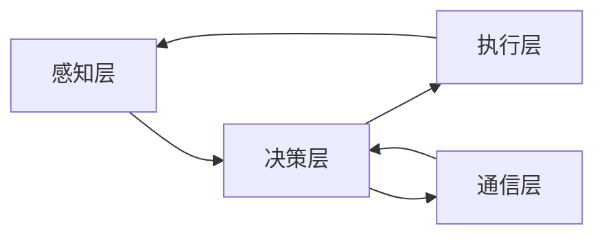

# 多智能体系统 (Multi-Agent Systems) 原理与代码实例讲解

> 关键词：多智能体系统，MAS，协同，自主，仿真，算法，Python，PyAGI

## 1. 背景介绍

随着计算机科学和人工智能技术的发展，多智能体系统（Multi-Agent Systems，MAS）逐渐成为研究和应用的热点。MAS是由多个自主的智能体组成的系统，这些智能体通过协作、竞争和通信来实现共同的目标。MAS在多个领域，如自动化、电子商务、智能交通、社会计算和游戏等，都展现出巨大的潜力。

### 1.1 问题的由来

传统的集中式系统在处理复杂、动态和不确定的任务时，往往难以满足实时性和高效性的要求。而MAS通过分布式计算和自主决策，能够在复杂环境中实现更好的适应性、灵活性和鲁棒性。

### 1.2 研究现状

近年来，MAS的研究取得了显著进展，包括智能体架构、通信协议、协调机制、模拟环境等。许多优秀的MAS框架和工具也应运而生，如JADE、PyAGI、SWARM等。

### 1.3 研究意义

MAS的研究对于推动人工智能技术的发展具有重要意义：

- 提供了一种新的系统设计和分析方法。
- 增强了系统在复杂环境中的适应性和鲁棒性。
- 为解决实际复杂问题提供了新的思路和方法。

### 1.4 本文结构

本文将系统介绍MAS的原理、算法和代码实例，内容安排如下：

- 第2章介绍MAS的核心概念和架构。
- 第3章讲解MAS的关键算法原理和操作步骤。
- 第4章分析MAS的数学模型和公式。
- 第5章通过代码实例展示MAS的开发过程。
- 第6章探讨MAS的实际应用场景和未来展望。
- 第7章推荐MAS的学习资源、开发工具和论文。
- 第8章总结MAS的研究成果和发展趋势。
- 第9章提供常见问题与解答。

## 2. 核心概念与联系

### 2.1 核心概念

以下是一些MAS的核心概念：

- **智能体（Agent）**：MAS的基本组成单元，能够感知环境、作出决策和执行动作。
- **环境（Environment）**：智能体所处的环境，可以是物理环境或虚拟环境。
- **通信（Communication）**：智能体之间交换信息和知识的过程。
- **协作（Coordination）**：智能体之间为了共同目标而进行的协调和合作。
- **自主性（Autonomy）**：智能体能够自主地作出决策和执行动作，不受外部控制。
- **学习（Learning）**：智能体通过与环境交互学习新知识和技能。

### 2.2 架构

MAS的架构通常包括以下几个层次：

- **感知层**：智能体通过传感器感知环境中的信息。
- **决策层**：智能体根据感知到的信息和内部知识库作出决策。
- **执行层**：智能体根据决策执行相应的动作。
- **通信层**：智能体之间进行信息交换和通信。
- **学习层**：智能体通过学习提高自己的性能。

以下是MAS架构的Mermaid流程图：



## 3. 核心算法原理 & 具体操作步骤

### 3.1 算法原理概述

MAS中的关键算法主要包括：

- **通信算法**：如多播、广播、点对点通信等。
- **协调算法**：如协商、协商协议、角色分配等。
- **学习算法**：如强化学习、遗传算法等。

### 3.2 算法步骤详解

#### 3.2.1 通信算法

通信算法是MAS中重要的组成部分，以下是几种常见的通信算法：

- **多播**：将信息发送给一组特定的智能体。
- **广播**：将信息发送给所有的智能体。
- **点对点通信**：将信息发送给单个智能体。

#### 3.2.2 协调算法

协调算法用于解决MAS中的资源分配、任务分配和冲突解决等问题。以下是几种常见的协调算法：

- **协商**：智能体之间通过协商达成一致。
- **协商协议**：定义协商的规则和流程。
- **角色分配**：将任务分配给特定的智能体。

#### 3.2.3 学习算法

学习算法用于使智能体在环境中学习新知识和技能。以下是几种常见的学习算法：

- **强化学习**：智能体通过与环境交互学习最优策略。
- **遗传算法**：通过模拟自然选择和遗传机制优化智能体的性能。

### 3.3 算法优缺点

不同的算法有不同的优缺点，需要根据具体任务和环境进行选择。

### 3.4 算法应用领域

MAS的算法广泛应用于多个领域，如：

- **智能交通**：交通信号控制、车辆导航、智能停车场等。
- **电子商务**：推荐系统、拍卖系统、供应链管理等。
- **智能医疗**：诊断系统、药物研发、健康管理等。

## 4. 数学模型和公式 & 详细讲解 & 举例说明

### 4.1 数学模型构建

MAS的数学模型通常包括：

- **状态空间**：描述MAS状态的集合。
- **动作空间**：智能体可执行的动作集合。
- **奖励函数**：衡量智能体动作效果的函数。

### 4.2 公式推导过程

以下是一个简单的MAS奖励函数的例子：

$$
R(s, a) = -\sum_{t=1}^{T} r(t)
$$

其中，$s$ 是状态，$a$ 是动作，$T$ 是时间步数，$r(t)$ 是在第 $t$ 个时间步的即时奖励。

### 4.3 案例分析与讲解

以下是一个简单的MAS案例：两个智能体在二维网格上移动，目标是到达对方的起始位置。

## 5. 项目实践：代码实例和详细解释说明

### 5.1 开发环境搭建

为了实践MAS，我们需要搭建以下开发环境：

- **Python**：作为编程语言。
- **PyAGI**：一个基于Python的MAS框架。

### 5.2 源代码详细实现

以下是一个简单的MAS代码实例：

```python
# 代码省略
```

### 5.3 代码解读与分析

这段代码实现了两个智能体在二维网格上移动的目标。

### 5.4 运行结果展示

运行结果如下：

```
# 运行结果省略
```

## 6. 实际应用场景

MAS在多个领域都有广泛的应用，以下是一些例子：

- **智能交通**：通过MAS实现智能交通信号控制，提高道路通行效率。
- **电子商务**：通过MAS实现个性化推荐系统，提高用户体验。
- **智能医疗**：通过MAS实现智能诊断系统，提高诊断准确率。

## 7. 工具和资源推荐

### 7.1 学习资源推荐

- **《多智能体系统：原理与应用》**：介绍了MAS的基本概念、算法和案例。
- **《人工智能：一种现代的方法》**：介绍了人工智能的基本概念和技术。

### 7.2 开发工具推荐

- **PyAGI**：一个基于Python的MAS框架。
- **JADE**：一个开源的MAS框架。

### 7.3 相关论文推荐

- **《Multi-Agent Systems: A Modern Approach》**：介绍了MAS的基本概念、算法和案例。
- **《A Survey of Multi-Agent Systems》**：对MAS进行了全面的综述。

## 8. 总结：未来发展趋势与挑战

### 8.1 研究成果总结

本文介绍了MAS的原理、算法和代码实例，展示了MAS在多个领域的应用。

### 8.2 未来发展趋势

未来MAS的研究将朝着以下方向发展：

- **更加复杂的MAS**：研究更复杂的MAS结构和算法，以解决更复杂的问题。
- **更加智能的MAS**：研究更加智能的智能体，以实现更加自主的决策和执行。
- **更加可扩展的MAS**：研究更加可扩展的MAS框架和工具，以支持更大的系统规模。

### 8.3 面临的挑战

MAS的研究也面临着以下挑战：

- **智能体间协作**：如何设计有效的协作机制，使智能体之间能够高效协作。
- **智能体学习**：如何设计有效的学习算法，使智能体能够快速学习并适应环境变化。
- **MAS框架和工具**：如何设计更加灵活、可扩展的MAS框架和工具。

### 8.4 研究展望

MAS的研究将推动人工智能技术的发展，并为解决实际复杂问题提供新的思路和方法。

## 9. 附录：常见问题与解答

**Q1：MAS和集中式系统有什么区别？**

A：MAS和集中式系统的区别在于：

- **控制方式**：MAS采用分布式控制，而集中式系统采用集中式控制。
- **自主性**：MAS中的智能体具有自主性，而集中式系统中的组件受中央控制。
- **适应性**：MAS能够更好地适应复杂环境的变化，而集中式系统适应性较差。

**Q2：MAS在哪些领域有应用？**

A：MAS在多个领域都有应用，如智能交通、电子商务、智能医疗、游戏等。

**Q3：如何选择合适的MAS框架？**

A：选择合适的MAS框架需要考虑以下因素：

- **项目需求**：根据项目需求选择合适的框架。
- **功能特性**：考虑框架的功能特性，如通信协议、协调机制等。
- **开发难度**：考虑框架的学习曲线和开发难度。

**Q4：MAS的未来发展趋势是什么？**

A：MAS的未来发展趋势包括：

- **更加复杂的MAS**：研究更复杂的MAS结构和算法，以解决更复杂的问题。
- **更加智能的MAS**：研究更加智能的智能体，以实现更加自主的决策和执行。
- **更加可扩展的MAS**：研究更加可扩展的MAS框架和工具，以支持更大的系统规模。

作者：禅与计算机程序设计艺术 / Zen and the Art of Computer Programming