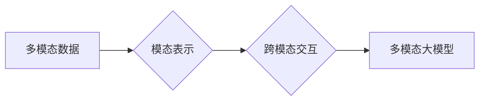

# 多模态大模型：技术原理与实战 方法论介绍

> 关键词：多模态大模型，跨模态学习，预训练，微调，融合策略，应用场景，AI

---

## 1. 背景介绍

随着人工智能技术的迅猛发展，单模态（如文本、图像、语音）的智能处理已经取得了显著的成果。然而，真实世界中的信息往往以多模态形式呈现，如何有效地融合多种模态信息，构建多模态智能系统，成为了人工智能领域的一个热点研究方向。多模态大模型（Multimodal Large Models）应运而生，它结合了深度学习、自然语言处理、计算机视觉等多个领域的技术，旨在实现对多模态数据的全面理解和智能处理。

### 1.1 问题的由来

在许多实际应用中，单一模态的信息往往不足以完整地表达复杂场景。例如，在医疗影像诊断中，仅凭CT或MRI图像可能无法准确判断病情，而将图像与患者病史、症状等文本信息结合，则可以大大提高诊断的准确率。再如，在自动驾驶领域，仅依赖视觉信息难以应对复杂多变的道路环境，而结合雷达、激光雷达等多模态感知信息，则可以显著提升系统的安全性和可靠性。

### 1.2 研究现状

近年来，多模态大模型的研究取得了长足的进步，主要研究方向包括：

- **多模态预训练**：在多个模态的数据上进行预训练，学习到通用的模态表示和跨模态交互能力。
- **跨模态融合**：研究不同模态之间的融合策略，将多模态信息有效整合，提升模型的整体性能。
- **多模态任务**：针对特定任务设计多模态模型，如多模态分类、多模态检索、多模态生成等。

### 1.3 研究意义

多模态大模型的研究具有重要的理论意义和实际应用价值：

- **理论意义**：推动人工智能领域跨学科融合，促进对多模态信息处理机制的理解。
- **应用价值**：应用于医疗、教育、交通、娱乐等多个领域，提高系统智能化水平，改善用户体验。

### 1.4 本文结构

本文将系统地介绍多模态大模型的技术原理与实战方法论，内容包括：

- 核心概念与联系
- 核心算法原理与具体操作步骤
- 数学模型与公式
- 项目实践
- 实际应用场景
- 工具和资源推荐
- 未来发展趋势与挑战

---

## 2. 核心概念与联系

### 2.1 核心概念

**多模态数据**：指包含两种或两种以上模态信息的数据，如文本、图像、视频、音频等。

**模态表示**：指对特定模态数据进行的抽象表示，如文本的词向量、图像的视觉特征等。

**跨模态交互**：指不同模态之间进行信息交换和融合的过程。

**多模态大模型**：指能够处理多种模态数据的深度学习模型。

### 2.2 联系

多模态大模型的研究涉及多个领域，其核心概念之间的联系如下：



多模态数据通过模态表示进行抽象，再通过跨模态交互实现信息融合，最终构建多模态大模型，实现对多模态数据的智能处理。

---

## 3. 核心算法原理 & 具体操作步骤

### 3.1 算法原理概述

多模态大模型通常采用以下步骤进行构建：

1. **数据预处理**：将不同模态的数据进行预处理，如文本分词、图像分割、音频转文字等。
2. **模态表示学习**：使用深度学习模型学习不同模态的表示。
3. **跨模态交互**：设计跨模态交互模块，实现不同模态之间的信息融合。
4. **模型训练**：使用标注数据对模型进行训练，优化模型参数。
5. **模型评估**：使用测试数据评估模型性能。

### 3.2 算法步骤详解

**步骤1：数据预处理**

数据预处理是构建多模态大模型的基础工作。根据不同模态数据的特性，采取相应的预处理方法，如：

- **文本**：分词、去除停用词、词性标注等。
- **图像**：图像裁剪、缩放、归一化等。
- **音频**：语音识别、提取音频特征等。

**步骤2：模态表示学习**

使用深度学习模型学习不同模态的表示，常见的模型包括：

- **文本**：词嵌入、BERT、GPT等。
- **图像**：卷积神经网络（CNN）、Vision Transformer（ViT）等。
- **音频**：循环神经网络（RNN）、长短时记忆网络（LSTM）等。

**步骤3：跨模态交互**

设计跨模态交互模块，实现不同模态之间的信息融合。常见的跨模态交互方法包括：

- **基于特征融合的方法**：将不同模态的特征进行拼接、加权或融合。
- **基于关系建模的方法**：建立不同模态之间的关系图，进行信息传递和融合。
- **基于注意力机制的方法**：使用注意力机制关注不同模态的重要信息，进行融合。

**步骤4：模型训练**

使用标注数据对模型进行训练，优化模型参数。训练过程中，需要关注以下问题：

- **损失函数**：选择合适的损失函数，如交叉熵损失、均方误差等。
- **优化器**：选择合适的优化器，如Adam、SGD等。
- **正则化**：防止过拟合，如L1正则化、Dropout等。

**步骤5：模型评估**

使用测试数据评估模型性能，常见的评估指标包括：

- **准确率**：模型预测正确的样本比例。
- **召回率**：模型预测正确的正样本比例。
- **F1分数**：准确率和召回率的调和平均值。

---

## 4. 数学模型和公式 & 详细讲解 & 举例说明

### 4.1 数学模型构建

多模态大模型的数学模型通常包含以下几个部分：

- **模态表示**：$f_{\text{modal}}(x_{\text{modal}})$，其中 $x_{\text{modal}}$ 为模态数据，$f_{\text{modal}}$ 为模态表示函数。
- **跨模态交互**：$g_{\text{cross-modal}}(f_{\text{modal1}}, f_{\text{modal2}})$，其中 $f_{\text{modal1}}$ 和 $f_{\text{modal2}}$ 为两个模态的表示，$g_{\text{cross-modal}}$ 为跨模态交互函数。
- **最终输出**：$h_{\text{output}}(g_{\text{cross-modal}}(f_{\text{modal1}}, f_{\text{modal2}}))$，其中 $h_{\text{output}}$ 为最终输出函数。

### 4.2 公式推导过程

以文本和图像融合为例，介绍多模态大模型的公式推导过程。

假设文本表示为 $f_{\text{text}}(x_{\text{text}})$，图像表示为 $f_{\text{image}}(x_{\text{image}})$，跨模态交互函数为 $g_{\text{cross-modal}}(f_{\text{text}}, f_{\text{image}})$，最终输出函数为 $h_{\text{output}}(g_{\text{cross-modal}}(f_{\text{text}}, f_{\text{image}}))$。

则多模态大模型的输出为：

$$
y = h_{\text{output}}(g_{\text{cross-modal}}(f_{\text{text}}, f_{\text{image}}))
$$

其中，$f_{\text{text}}$ 和 $f_{\text{image}}$ 分别为文本和图像的表示，$g_{\text{cross-modal}}$ 为跨模态交互函数，$h_{\text{output}}$ 为最终输出函数。

### 4.3 案例分析与讲解

以下以多模态问答系统为例，介绍多模态大模型的应用。

**问题描述**：给定一个文本问题和一个图像，要求回答与图像相关的问题。

**解决方案**：

1. 使用预训练的BERT模型对文本问题进行编码，得到文本表示 $f_{\text{text}}(x_{\text{text}})$。
2. 使用预训练的ViT模型对图像进行编码，得到图像表示 $f_{\text{image}}(x_{\text{image}})$。
3. 使用交叉注意力机制进行跨模态交互，得到融合表示 $g_{\text{cross-modal}}(f_{\text{text}}, f_{\text{image}})$。
4. 使用微调后的BERT模型对融合表示进行解码，得到最终答案。

---

## 5. 项目实践：代码实例和详细解释说明

### 5.1 开发环境搭建

为了方便读者进行项目实践，以下列出开发环境搭建的步骤：

1. 安装Python 3.8及以上版本。
2. 安装PyTorch、Transformers库等依赖库。
3. 下载预训练的BERT和ViT模型。

### 5.2 源代码详细实现

以下以Python代码为例，展示如何构建一个简单的多模态问答系统。

```python
from transformers import BertTokenizer, BertModel, ViTFeatureExtractor, ViTForQuestionAnswering
from PIL import Image

# 初始化预训练模型和分词器
tokenizer_text = BertTokenizer.from_pretrained('bert-base-uncased')
model_text = BertModel.from_pretrained('bert-base-uncased')
tokenizer_image = ViTFeatureExtractor.from_pretrained('google/vit-base-patch16-224')
model_image = ViTForQuestionAnswering.from_pretrained('google/vit-base-patch16-224')

# 加载图像和文本
image = Image.open('path/to/image.jpg')
text = "What is in the image?"

# 图像预处理
inputs_image = tokenizer_image(images=image, return_tensors="pt")

# 文本预处理
inputs_text = tokenizer_text(text, return_tensors="pt")

# 图像问答
outputs_image = model_image(**inputs_image)
answer_image = outputs_image.start_logits[0].argmax(-1).item()

# 文本问答
outputs_text = model_text(**inputs_text)
answer_text = tokenizer_text.decode(outputs_text.logits.argmax(-1)[0])

# 输出答案
print("Image Q&A Answer:", answer_image)
print("Text Q&A Answer:", answer_text)
```

### 5.3 代码解读与分析

上述代码展示了如何使用PyTorch和Transformers库构建一个简单的多模态问答系统。首先，加载预训练的BERT和ViT模型，然后分别对图像和文本进行预处理。接着，使用ViT模型进行图像问答，使用BERT模型进行文本问答，最后输出两种问答系统的答案。

---

## 6. 实际应用场景

多模态大模型在多个领域具有广泛的应用前景，以下列举一些典型的应用场景：

### 6.1 医疗诊断

多模态大模型可以结合医学影像、患者病历、症状描述等信息，进行疾病诊断和预后评估。

### 6.2 智能问答

多模态大模型可以结合文本和图像信息，构建智能问答系统，为用户提供更加直观、准确的回答。

### 6.3 智能驾驶

多模态大模型可以结合视觉、雷达、激光雷达等多模态感知信息，进行环境感知、路径规划、决策控制等。

### 6.4 智能教育

多模态大模型可以结合文本、图像、视频等多模态信息，构建个性化教育平台，提高教学效果。

---

## 7. 工具和资源推荐

### 7.1 学习资源推荐

- 《Deep Learning for Computer Vision with PyTorch》
- 《Deep Learning for Natural Language Processing》
- 《Introduction to Deep Learning》

### 7.2 开发工具推荐

- PyTorch
- Transformers库
- HuggingFace
- OpenCV

### 7.3 相关论文推荐

- Multimodal Fusion for Visual Question Answering
- Multimodal Fusion Learning for Visual Question Answering with Hierarchical Attention
- Multimodal Fusion for Visual Question Answering with Multi-Head Self-Attention

---

## 8. 总结：未来发展趋势与挑战

### 8.1 研究成果总结

多模态大模型的研究取得了显著的成果，为多模态信息处理提供了新的思路和方法。然而，仍存在一些挑战需要克服。

### 8.2 未来发展趋势

- **多模态预训练模型**：开发更加强大的多模态预训练模型，提高模型的表达能力和泛化能力。
- **跨模态交互机制**：研究更加有效的跨模态交互机制，实现不同模态之间的信息融合。
- **多模态任务泛化**：提高模型在不同模态任务上的泛化能力，减少对特定模态数据的依赖。
- **多模态知识表示**：研究更加有效的多模态知识表示方法，提高模型对复杂场景的理解能力。

### 8.3 面临的挑战

- **计算资源瓶颈**：多模态大模型通常需要大量的计算资源，如何降低计算成本是一个重要的挑战。
- **数据标注成本**：多模态数据标注成本较高，如何利用无监督或半监督学习方法降低标注成本是一个重要的研究方向。
- **模型可解释性**：多模态大模型的决策过程通常难以解释，如何提高模型的可解释性是一个重要的挑战。

### 8.4 研究展望

未来，多模态大模型的研究将朝着以下方向发展：

- **跨学科融合**：将多模态大模型与其他人工智能技术，如知识图谱、因果推理等进行融合，构建更加智能的系统。
- **跨领域应用**：将多模态大模型应用于更多领域，如金融、教育、医疗等，提升人类生活质量。
- **伦理道德规范**：制定相应的伦理道德规范，确保多模态大模型的应用不会对社会造成负面影响。

---

## 9. 附录：常见问题与解答

**Q1：多模态大模型与单模态大模型有什么区别？**

A：多模态大模型可以处理多种模态的数据，而单模态大模型只能处理单一模态的数据。多模态大模型可以更好地理解复杂场景，提高模型的性能。

**Q2：如何评估多模态大模型的效果？**

A：评估多模态大模型的效果，可以采用多种指标，如准确率、召回率、F1分数等。此外，还可以结合实际应用场景进行评估，如用户满意度、错误率等。

**Q3：多模态大模型的应用前景如何？**

A：多模态大模型具有广泛的应用前景，可以应用于医疗、教育、交通、娱乐等多个领域，为人类生活带来便利。

**Q4：如何解决多模态大模型的计算资源瓶颈？**

A：可以通过以下方法解决多模态大模型的计算资源瓶颈：

- **模型压缩**：通过模型压缩技术，减小模型尺寸，降低计算成本。
- **硬件加速**：使用GPU、TPU等高性能硬件加速模型推理。
- **分布式训练**：使用分布式训练技术，将模型训练任务分发到多个机器上。

**Q5：如何解决多模态大模型的数据标注成本问题？**

A：可以通过以下方法解决多模态大模型的数据标注成本问题：

- **无监督学习**：利用无监督学习方法，减少对标注数据的依赖。
- **半监督学习**：利用少量标注数据和大量未标注数据，提高标注数据的利用效率。
- **数据增强**：通过数据增强技术，扩充数据集，降低对标注数据的依赖。

---

作者：禅与计算机程序设计艺术 / Zen and the Art of Computer Programming