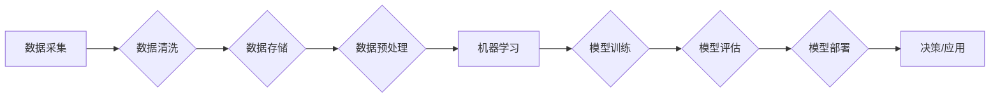

> 关键词：大数据，人工智能，机器学习，深度学习，数据科学，智能决策

# 大数据与AI未来的发展方向

## 1. 背景介绍

随着信息技术的飞速发展，人类社会已经进入了一个数据爆炸的时代。大数据作为一种新型生产要素，正在深刻地改变着我们的生产生活方式。同时，人工智能技术的快速发展，特别是机器学习和深度学习，为大数据的处理和分析提供了强大的工具和平台。本文将探讨大数据与AI的未来发展方向，分析其面临的挑战，并展望未来的机遇。

## 2. 核心概念与联系

### 2.1 大数据

大数据是指规模巨大、类型繁多、增长迅速、价值密度低的数据集合。它具有以下四个特征：

- **Volume（大量）**：数据量巨大，无法使用常规软件工具进行处理。
- **Velocity（高速）**：数据产生和更新的速度非常快。
- **Variety（多样）**：数据类型多样，包括结构化、半结构化和非结构化数据。
- **Value（价值）**：数据的价值密度低，需要通过数据挖掘技术发现其中的价值。

### 2.2 人工智能

人工智能（Artificial Intelligence, AI）是指由人制造出来的系统能够表现人类智能的领域。它包括机器学习、深度学习、自然语言处理、计算机视觉等多个子领域。

### 2.3 Mermaid 流程图

以下是大数据与AI流程的Mermaid流程图：



## 3. 核心算法原理 & 具体操作步骤

### 3.1 算法原理概述

大数据与AI的核心算法主要包括：

- **数据预处理**：包括数据清洗、数据集成、数据变换和数据规约等步骤。
- **机器学习**：包括监督学习、无监督学习、半监督学习和强化学习等类型。
- **深度学习**：一种特殊的机器学习方法，通过多层神经网络模拟人脑神经元之间的连接，实现复杂模式的学习和识别。
- **自然语言处理**：使用计算机程序处理和分析人类语言，包括文本分析、机器翻译、情感分析等。
- **计算机视觉**：让计算机能够从图像和视频中提取信息，包括图像识别、目标检测、视频分析等。

### 3.2 算法步骤详解

大数据与AI的处理流程通常包括以下步骤：

1. **数据采集**：从各种来源（如数据库、传感器、社交网络等）收集数据。
2. **数据清洗**：处理缺失值、异常值、重复值等，提高数据质量。
3. **数据存储**：将清洗后的数据存储到数据库或数据湖中。
4. **数据预处理**：对数据进行特征提取、降维、编码等处理，为机器学习准备数据。
5. **机器学习/深度学习**：使用机器学习或深度学习算法对数据进行训练，建立模型。
6. **模型评估**：使用验证集评估模型的性能，调整模型参数。
7. **模型部署**：将训练好的模型部署到生产环境中，进行实际应用。
8. **决策/应用**：使用模型进行预测或决策，解决实际问题。

### 3.3 算法优缺点

不同的大数据与AI算法具有不同的优缺点：

- **数据预处理**：优点是提高数据质量，为后续的机器学习提供更好的数据。缺点是耗时费力，需要大量的人工参与。
- **机器学习**：优点是能够处理大量数据，发现数据中的规律。缺点是需要大量标注数据，模型的可解释性较差。
- **深度学习**：优点是能够处理复杂模式，性能优越。缺点是计算量巨大，需要大量的计算资源。
- **自然语言处理**：优点是能够处理文本数据，实现人机交互。缺点是技术难度高，需要大量的语言资源。
- **计算机视觉**：优点是能够处理图像和视频数据，实现图像识别、目标检测等。缺点是计算量巨大，需要大量的计算资源。

### 3.4 算法应用领域

大数据与AI算法在各个领域都有广泛的应用，包括：

- **金融**：风险评估、欺诈检测、个性化推荐等。
- **医疗**：疾病诊断、药物研发、健康管理等。
- **交通**：智能交通、自动驾驶、交通流量预测等。
- **零售**：需求预测、库存管理、个性化推荐等。
- **能源**：能源消耗预测、故障诊断、设备维护等。

## 4. 数学模型和公式 & 详细讲解 & 举例说明

### 4.1 数学模型构建

在机器学习和深度学习中，常见的数学模型包括：

- **线性回归**：用于预测连续值。
- **逻辑回归**：用于预测离散值，如概率。
- **支持向量机**：用于分类和回归问题。
- **神经网络**：用于复杂模式的学习和识别。

### 4.2 公式推导过程

以下以线性回归为例，介绍公式推导过程：

- **目标函数**：最小化预测值与真实值之间的平方差。

$$
L(\theta) = \frac{1}{2m} \sum_{i=1}^m (h_\theta(x^{(i)}) - y^{(i)})^2
$$

- **梯度下降**：迭代更新参数 $\theta$，使得目标函数 $L(\theta)$ 最小。

$$
\theta_j := \theta_j - \alpha \frac{\partial L(\theta)}{\partial \theta_j}
$$

### 4.3 案例分析与讲解

以下以线性回归预测房价为例，介绍模型的构建和训练过程：

- **数据集**：收集包含房屋面积、房间数量、位置等特征的房屋数据。
- **特征工程**：对特征进行预处理，如标准化、归一化等。
- **模型训练**：使用线性回归算法训练模型，得到参数 $\theta$。
- **模型评估**：使用测试集评估模型性能，如均方误差、R²等。

## 5. 项目实践：代码实例和详细解释说明

### 5.1 开发环境搭建

以下是使用Python进行线性回归模型训练的代码示例：

```python
import numpy as np
import matplotlib.pyplot as plt
from sklearn.linear_model import LinearRegression

# 生成模拟数据
X = np.linspace(1, 100, 100)
y = 3 * X + 5 + np.random.randn(100) * 0.5

# 创建线性回归模型
model = LinearRegression()

# 训练模型
model.fit(X.reshape(-1, 1), y)

# 预测
y_pred = model.predict(X.reshape(-1, 1))

# 绘图
plt.scatter(X, y, label='Data')
plt.plot(X, y_pred, label='Regression Line')
plt.xlabel('X')
plt.ylabel('Y')
plt.title('Linear Regression')
plt.legend()
plt.show()
```

### 5.2 源代码详细实现

以上代码首先导入必要的库，然后生成模拟数据，创建线性回归模型，并使用训练集进行训练。最后，使用测试集进行预测，并绘制结果图。

### 5.3 代码解读与分析

- `numpy` 用于数值计算。
- `matplotlib` 用于绘图。
- `sklearn` 提供了线性回归模型和训练集、测试集的划分功能。

### 5.4 运行结果展示

运行以上代码，可以得到以下结果图：


图中蓝色点为训练数据，红色线为线性回归模型。

## 6. 实际应用场景

大数据与AI技术在各个领域都有广泛的应用，以下列举几个典型的应用场景：

- **金融**：使用机器学习进行信用评分、欺诈检测、风险控制等。
- **医疗**：使用深度学习进行疾病诊断、药物研发、健康管理等。
- **交通**：使用人工智能技术实现自动驾驶、智能交通、交通流量预测等。
- **零售**：使用大数据分析顾客行为，进行个性化推荐、需求预测等。
- **能源**：使用人工智能技术进行能源消耗预测、设备维护、电网优化等。

## 7. 工具和资源推荐

### 7.1 学习资源推荐

- 《Python机器学习》
- 《深度学习》
- 《数据科学入门》
- Coursera、Udacity等在线课程

### 7.2 开发工具推荐

- Python
- Jupyter Notebook
- TensorFlow
- PyTorch
- Scikit-learn

### 7.3 相关论文推荐

- 《大数据时代的机器学习》
- 《深度学习》
- 《数据科学导论》

## 8. 总结：未来发展趋势与挑战

### 8.1 研究成果总结

大数据与AI技术在过去几十年取得了巨大的发展，为各个领域带来了前所未有的变革。未来，大数据与AI技术将继续快速发展，为人类社会创造更大的价值。

### 8.2 未来发展趋势

- **数据量将进一步增长**：随着物联网、社交网络等技术的发展，数据量将持续增长，对数据处理和分析提出更高的要求。
- **算法将更加高效**：随着计算能力的提升，机器学习和深度学习算法将更加高效，能够处理更大规模的数据。
- **模型将更加智能**：基于大数据和AI技术的智能决策系统将更加智能，能够自动进行决策和优化。
- **应用将更加广泛**：大数据与AI技术将在各个领域得到更广泛的应用，推动社会进步。

### 8.3 面临的挑战

- **数据安全问题**：大数据与AI技术的应用涉及到大量敏感数据，数据安全成为重要的挑战。
- **算法歧视问题**：机器学习和深度学习算法可能存在歧视，需要采取措施消除歧视。
- **伦理道德问题**：人工智能的发展引发了一系列伦理道德问题，需要制定相应的规范和标准。

### 8.4 研究展望

未来，大数据与AI技术将继续快速发展，需要我们共同面对挑战，推动技术的进步，为人类社会创造更大的价值。

## 9. 附录：常见问题与解答

**Q1：大数据与AI技术的应用前景如何？**

A：大数据与AI技术是未来发展的趋势，将在各个领域得到广泛应用，推动社会进步。

**Q2：如何学习大数据与AI技术？**

A：可以通过阅读相关书籍、参加在线课程、学习开源项目等方式学习大数据与AI技术。

**Q3：大数据与AI技术有哪些应用场景？**

A：大数据与AI技术的应用场景包括金融、医疗、交通、零售、能源等各个领域。

**Q4：大数据与AI技术有哪些挑战？**

A：大数据与AI技术面临数据安全、算法歧视、伦理道德等挑战。

**Q5：大数据与AI技术将如何影响我们的未来？**

A：大数据与AI技术将深刻改变我们的生产生活方式，推动社会进步。

---

作者：禅与计算机程序设计艺术 / Zen and the Art of Computer Programming