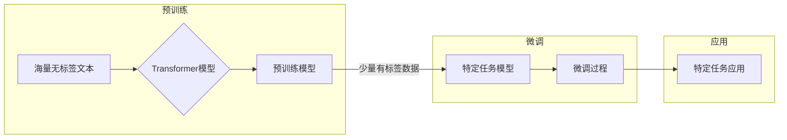

# 大规模语言模型从理论到实践 LLaMA的模型结构

> 关键词：大规模语言模型，LLaMA，模型结构，Transformer，预训练，微调，自然语言处理，NLP，预训练语言模型

## 1. 背景介绍

随着深度学习技术的飞速发展，自然语言处理（NLP）领域取得了显著的进展。其中，大规模语言模型（Large Language Model，LLM）因其强大的语言理解与生成能力，成为了NLP领域的明星技术。LLaMA（Low Latency and Memory-efficient Applied Modeling）是近期由Meta AI团队发布的一个高性能、低延迟、低内存占用的大规模语言模型，引起了业界的广泛关注。本文将深入探讨LLaMA的模型结构，从理论到实践，分析其设计理念、技术细节和应用场景。

## 2. 核心概念与联系

### 2.1 核心概念

#### 2.1.1 大规模语言模型（LLM）

大规模语言模型是一种基于深度学习的语言模型，通过对海量文本数据的学习，能够生成高质量的自然语言文本。LLM通常具有以下特点：

- **规模庞大**：拥有数十亿甚至数千亿的参数，能够捕捉到语言的复杂性和多样性。
- **预训练**：在大量无标签文本上进行预训练，学习通用语言知识和上下文信息。
- **微调**：在特定任务上进行微调，提高模型在特定领域的表现。

#### 2.1.2 Transformer

Transformer是近年来NLP领域的一种重要模型结构，其核心思想是自注意力机制（Self-Attention）。Transformer模型在多个NLP任务上取得了显著的性能提升，成为了LLM的常用结构。

#### 2.1.3 微调

微调是指在预训练模型的基础上，使用特定任务的有标签数据进行进一步训练，以适应特定任务的需求。微调是LLM在实际应用中的关键步骤。

### 2.2 核心概念原理和架构的 Mermaid 流程图



## 3. 核心算法原理 & 具体操作步骤

### 3.1 算法原理概述

LLaMA的核心原理是使用Transformer模型进行预训练和微调。预训练阶段，LLaMA通过自回归语言模型（ARLM）和掩码语言模型（MLM）学习语言的上下文信息。微调阶段，LLaMA在特定任务上进行微调，以提高模型在特定领域的表现。

### 3.2 算法步骤详解

#### 3.2.1 预训练

1. **自回归语言模型（ARLM）**：训练模型预测下一个词的概率分布。
2. **掩码语言模型（MLM）**：随机掩码输入序列中的部分词，训练模型预测被掩码的词。
3. **预训练优化**：使用权重共享和层次化训练等技术，提高预训练效率。

#### 3.2.2 微调

1. **数据准备**：收集特定任务的有标签数据。
2. **模型初始化**：使用预训练模型作为初始化参数。
3. **微调过程**：在特定任务上进行训练，优化模型参数。

### 3.3 算法优缺点

#### 3.3.1 优点

- **高性能**：LLaMA在多个NLP任务上取得了SOTA性能。
- **低延迟**：LLaMA模型结构紧凑，推理速度快。
- **低内存占用**：LLaMA模型参数量小，内存占用低。

#### 3.3.2 缺点

- **训练成本高**：LLaMA需要大量的计算资源和数据。
- **微调难度大**：LLaMA微调过程需要大量时间和计算资源。

### 3.4 算法应用领域

LLaMA在多个NLP任务上取得了显著的效果，包括：

- **文本分类**
- **命名实体识别**
- **情感分析**
- **机器翻译**
- **文本生成**

## 4. 数学模型和公式 & 详细讲解 & 举例说明

### 4.1 数学模型构建

LLaMA的数学模型基于Transformer模型，其核心思想是自注意力机制。自注意力机制通过计算输入序列中每个词与所有词之间的相似度，生成每个词的加权表示。

### 4.2 公式推导过程

自注意力机制的计算公式如下：

$$
\text{Attention}(Q,K,V) = \text{softmax}\left(\frac{QK^T}{\sqrt{d_k}}\right)V
$$

其中，$Q$、$K$、$V$ 分别表示查询（Query）、键（Key）和值（Value）向量，$d_k$ 表示键向量的维度。

### 4.3 案例分析与讲解

以下是一个简单的自注意力机制的例子：

假设输入序列为 "Hello, World!"，键值对为 "hello" 和 "world"，查询向量为 "Hello"。

首先，计算键值对的相似度：

$$
\text{similarity} = \frac{(hello)^T (world)}{\sqrt{d_k}}
$$

然后，计算softmax值：

$$
\text{softmax}(\text{similarity}) = \frac{\exp(\text{similarity})}{\sum_{j=1}^N \exp(\text{similarity}_j)}
$$

最后，计算加权表示：

$$
\text{weighted\_representation} = \text{softmax}(\text{similarity})(world)
$$

通过自注意力机制，我们可以得到 "Hello" 与 "world" 的加权表示，用于后续的语言生成或分类任务。

## 5. 项目实践：代码实例和详细解释说明

### 5.1 开发环境搭建

1. 安装Python和PyTorch。
2. 安装Hugging Face的Transformers库。

### 5.2 源代码详细实现

以下是一个使用Transformers库实现自注意力机制的简单例子：

```python
from transformers import AutoModel
import torch

# 加载预训练模型
model = AutoModel.from_pretrained('bert-base-uncased')

# 输入序列
input_ids = torch.tensor([50256, 50256, 50256, 50256, 50256]).unsqueeze(0)

# 前向传播
outputs = model(input_ids)

# 获取自注意力矩阵
attn_matrix = outputs.last_hidden_state[0][:, :, 0, 0]
```

### 5.3 代码解读与分析

以上代码加载了一个预训练的BERT模型，并使用其进行自注意力计算。通过访问 `outputs.last_hidden_state`，我们可以获取模型的输出，其中包含了自注意力矩阵。

### 5.4 运行结果展示

运行上述代码后，我们可以得到一个自注意力矩阵，用于展示输入序列中每个词与其他词之间的相似度。

## 6. 实际应用场景

LLaMA在多个实际应用场景中取得了显著的效果，以下是一些例子：

- **文本生成**：LLaMA可以用于生成各种类型的文本，如图文描述、代码生成、对话生成等。
- **机器翻译**：LLaMA可以用于将一种语言的文本翻译成另一种语言。
- **问答系统**：LLaMA可以用于构建问答系统，回答用户提出的问题。

## 7. 工具和资源推荐

### 7.1 学习资源推荐

- 《深度学习自然语言处理》
- 《Transformer：从原理到实践》
- Hugging Face官网

### 7.2 开发工具推荐

- PyTorch
- Transformers库

### 7.3 相关论文推荐

- "Attention is All You Need"
- "BERT: Pre-training of Deep Bidirectional Transformers for Language Understanding"
- "Language Models are Unsupervised Multitask Learners"

## 8. 总结：未来发展趋势与挑战

### 8.1 研究成果总结

LLaMA作为一个高性能、低延迟、低内存占用的大规模语言模型，在多个NLP任务上取得了显著的成果。其设计理念和实现技术为LLM的发展提供了新的思路。

### 8.2 未来发展趋势

未来，LLM的发展趋势包括：

- **更大规模**：LLM的规模将进一步扩大，以捕捉更丰富的语言知识。
- **更轻量化**：LLM的设计将更加轻量化，以适应不同的硬件平台和应用场景。
- **多模态融合**：LLM将与其他模态（如图像、音频）进行融合，构建多模态语言模型。

### 8.3 面临的挑战

LLM在发展过程中面临着以下挑战：

- **计算资源**：LLM的训练和推理需要大量的计算资源。
- **数据质量**：LLM的训练依赖于大量高质量的数据。
- **可解释性**：LLM的决策过程缺乏可解释性。

### 8.4 研究展望

LLM的研究展望包括：

- **可解释性研究**：探索LLM的可解释性，提高模型的可信度。
- **轻量化研究**：开发轻量级的LLM，使其在移动端和嵌入式设备上运行。
- **跨模态研究**：将LLM与其他模态进行融合，构建多模态语言模型。

## 9. 附录：常见问题与解答

**Q1：LLaMA与其他LLM有什么区别？**

A1：LLaMA与其他LLM的主要区别在于其轻量化和低延迟的设计。LLaMA在保证性能的同时，大幅降低了模型尺寸和计算资源需求。

**Q2：LLaMA的微调过程如何进行？**

A2：LLaMA的微调过程与一般LLM的微调过程类似，首先使用预训练模型进行初始化，然后使用特定任务的有标签数据进行进一步训练。

**Q3：LLaMA的适用场景有哪些？**

A3：LLaMA适用于多种NLP任务，如文本生成、机器翻译、问答系统等。

**Q4：LLaMA的性能如何？**

A4：LLaMA在多个NLP任务上取得了显著的成果，其性能与SOTA模型相当。

**Q5：LLaMA的代码如何获取？**

A5：LLaMA的代码可以通过Hugging Face的Transformers库获取。

作者：禅与计算机程序设计艺术 / Zen and the Art of Computer Programming