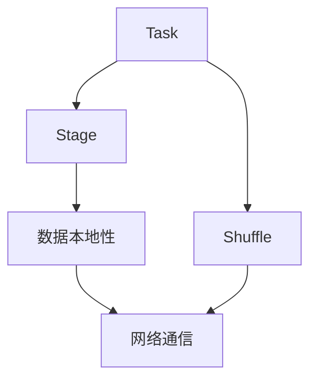
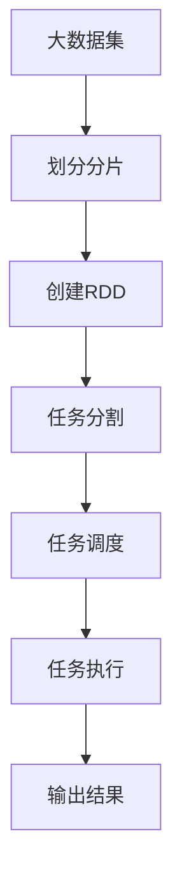
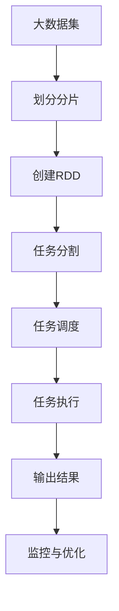

                 

# Spark Stage原理与代码实例讲解

> 关键词：Spark, Stage, 任务调度和优化, 内存管理, 延迟和数据本地性, 通信开销, 运行时监控和调优

## 1. 背景介绍

### 1.1 问题由来
Spark（Apache Spark）是一个广泛使用的分布式计算框架，用于处理大规模数据集。Spark的核心组件是RDD（弹性分布式数据集），它提供了一种抽象的数据分布方式，允许用户以编程方式对大规模数据进行操作。Spark的一个重要特性是它能够将大任务拆分为多个子任务，并行处理，这一特性在处理大规模数据时尤其重要。然而，这种分治策略也带来了如何高效地调度和管理这些子任务的问题，Spark引入了Stage概念来解决这一问题。

### 1.2 问题核心关键点
Spark的Stage是Spark中的基本调度单元，它将一个任务拆分为多个子任务，每个子任务负责处理数据集的一部分。在Spark中，任务分为两个阶段：Shuffle阶段和非Shuffle阶段。Shuffle阶段涉及数据的重分布，通常会带来较大的通信开销和较高的延迟，因此Spark针对Shuffle阶段进行了特殊优化，以减少延迟和通信开销。

## 2. 核心概念与联系

### 2.1 核心概念概述

为了更好地理解Spark的Stage概念，本节将介绍几个密切相关的核心概念：

- **Stage**：Spark中的基本调度单元，将任务拆分为多个子任务，每个子任务负责处理数据集的一部分。
- **Task**：具体执行的计算任务，可以是一个Shuffle操作或者一个Map操作。
- **Shuffle**：在数据集合间重分布数据的操作，通常涉及大量的网络通信开销。
- **Task调度器**：根据任务的依赖关系和资源可用性，决定哪些Task应该优先执行的调度器。
- **数据本地性**：将数据放置在计算节点上与任务执行节点相同的概念，减少数据传输的开销。

这些核心概念之间的逻辑关系可以通过以下Mermaid流程图来展示：



这个流程图展示了大任务与Stage、Shuffle、数据本地性之间的基本关系：

1. 大任务被拆分为多个Stage。
2. Stage内部包括多个Task。
3. Shuffle阶段涉及数据传输，带来较高的通信开销。
4. 数据本地性可以降低数据传输开销。

### 2.2 概念间的关系

这些核心概念之间存在着紧密的联系，形成了Spark中的任务调度和管理框架。下面我们通过几个Mermaid流程图来展示这些概念之间的关系。

#### 2.2.1 任务调度和执行流程



这个流程图展示了Spark中的任务调度和执行流程：

1. 大数据集被划分为多个分片。
2. 通过创建RDD来组织这些分片。
3. RDD被分割为多个Stage。
4. 任务调度器根据依赖关系和资源可用性决定任务的执行顺序。
5. 任务执行器执行具体的Task。
6. 最终输出结果。

#### 2.2.2 数据本地性和Shuffle阶段的关系


这个流程图展示了数据本地性对Shuffle阶段的影响：

1. 数据被放置在本地节点。
2. 本地节点执行任务。
3. 数据通过网络传输到目标节点。
4. 目标节点执行Shuffle阶段。
5. 数据在目标节点上本地执行。
6. 最终得到本地结果。

### 2.3 核心概念的整体架构

最后，我们用一个综合的流程图来展示这些核心概念在大任务调度和管理中的整体架构：



这个综合流程图展示了Spark中从数据集创建、任务分割、任务调度到执行和输出的完整过程，以及监控和优化环节。

## 3. 核心算法原理 & 具体操作步骤

### 3.1 算法原理概述

Spark中的Stage是Spark调度器调度任务的基本单元。在Spark中，任务被拆分为多个Stage，每个Stage负责处理数据集的一部分。在Shuffle阶段，Spark会将数据从一个分区传输到另一个分区，这一过程可能会带来较高的通信开销和延迟。

Spark通过以下方式来优化Shuffle阶段的性能：

- 数据本地性：尽可能将数据放置在计算节点上与任务执行节点相同的概念，减少数据传输的开销。
- 延迟任务执行：延迟某些Task的执行，直到Shuffle阶段完成后再执行，以减少不必要的通信开销。
- 多级缓存：将某些中间结果缓存到内存中，以减少重复计算的开销。

### 3.2 算法步骤详解

Spark的Stage调度和管理过程可以分为以下几个步骤：

**Step 1: 数据分片与RDD创建**

1. **数据分片**：将大数据集划分为多个小分片，每个分片可以被独立地并行处理。
2. **创建RDD**：通过创建RDD来组织这些分片，RDD是Spark中的数据抽象，提供了一种分布式计算的数据模型。

**Step 2: 任务分割与调度**

1. **任务分割**：将RDD进一步分割为多个Stage，每个Stage包含多个Task。
2. **调度器调度**：任务调度器根据任务的依赖关系和资源可用性，决定哪些Task应该优先执行。

**Step 3: 任务执行与Shuffle**

1. **任务执行**：每个Task在计算节点上独立执行，处理其对应的数据分片。
2. **Shuffle阶段**：在Shuffle阶段，数据需要从一个分区传输到另一个分区，这一过程可能会带来较高的通信开销和延迟。Spark通过数据本地性和延迟任务执行等策略来优化Shuffle阶段的性能。

**Step 4: 结果输出**

1. **结果聚合**：在所有Task执行完成后，将各分片的输出聚合，得到最终结果。
2. **结果返回**：将结果返回给用户，完成整个Spark任务的执行。

### 3.3 算法优缺点

**优点**：

1. **高效性**：通过将任务拆分为多个Stage，并行处理数据，Spark能够高效地处理大规模数据集。
2. **灵活性**：Spark的Stage设计使得任务调度更加灵活，可以适应不同的数据处理需求。
3. **优化性**：Spark针对Shuffle阶段进行了特殊优化，能够减少通信开销和延迟。

**缺点**：

1. **复杂性**：Spark的Stage调度和管理过程相对复杂，需要深入理解其内部机制。
2. **资源消耗**：Spark的Stage设计可能会带来较大的资源消耗，需要合理配置资源。
3. **兼容性**：Spark的Stage设计可能不适用于所有类型的任务，需要根据具体场景进行调整。

### 3.4 算法应用领域

Spark的Stage概念主要应用于大规模数据处理和分布式计算任务中，特别是那些需要大量数据重分布和合并的操作。例如：

- **ETL过程**：从数据源中提取、转换和加载数据。
- **数据分析**：对大规模数据进行统计分析、聚类、分类等操作。
- **机器学习**：对大规模数据集进行特征提取、模型训练和预测等操作。
- **实时计算**：对实时数据流进行窗口计算、滑动窗口、聚合等操作。

## 4. 数学模型和公式 & 详细讲解 & 举例说明

### 4.1 数学模型构建

在本节中，我们将使用数学语言对Spark中的Stage调度和优化过程进行更加严格的刻画。

假设有一个大数据集 $D$，它被划分为 $N$ 个分片 $D_1, D_2, \ldots, D_N$，每个分片大小为 $S$。Spark通过创建RDD来组织这些分片，RDD被进一步分割为 $K$ 个Stage，每个Stage包含 $P$ 个Task。任务调度器根据任务的依赖关系和资源可用性，决定哪些Task应该优先执行。

定义任务的执行时间为 $T_{task}$，Shuffle阶段的通信开销为 $C_{shuffle}$，数据本地性为 $L_{local}$，延迟任务执行的时间为 $T_{delay}$。则Spark的总体执行时间 $T_{total}$ 可以表示为：

$$
T_{total} = T_{data\_local} + T_{shuffle} + T_{delay}
$$

其中 $T_{data\_local}$ 表示数据本地性对任务执行时间的影响，$T_{shuffle}$ 表示Shuffle阶段对任务执行时间的影响，$T_{delay}$ 表示延迟任务执行对任务执行时间的影响。

### 4.2 公式推导过程

以下我们以一个简单的数据处理为例，推导Spark的Stage调度和优化公式。

假设Spark需要将一个大数据集 $D$ 拆分为多个分片 $D_1, D_2, \ldots, D_N$，每个分片大小为 $S$，数据本地性为 $L_{local}$，Shuffle阶段的通信开销为 $C_{shuffle}$。

Spark将数据集 $D$ 分割为 $K$ 个Stage，每个Stage包含 $P$ 个Task。设每个Task的执行时间为 $T_{task}$，则Spark的总体执行时间 $T_{total}$ 可以表示为：

$$
T_{total} = K \times P \times T_{task} + \sum_{i=1}^{K-1} C_{shuffle} \times (N - L_{local})
$$

其中 $K \times P$ 表示所有Task的执行次数，$C_{shuffle} \times (N - L_{local})$ 表示Shuffle阶段的总通信开销。

通过优化数据本地性和延迟任务执行，Spark可以显著减少Shuffle阶段的通信开销和延迟。例如，当 $L_{local}$ 取值为 1，即数据本地性非常高时，$C_{shuffle}$ 取值为 0，Spark的总体执行时间 $T_{total}$ 可以简化为：

$$
T_{total} = K \times P \times T_{task}
$$

### 4.3 案例分析与讲解

假设我们在Spark中处理一个包含1亿个整数的大数据集，每个整数的大小为4字节，数据集被均匀地划分为1000个分片，每个分片大小为1MB。Spark通过创建RDD来组织这些分片，RDD被进一步分割为10个Stage，每个Stage包含100个Task。

假设每个Task的执行时间为10毫秒，Shuffle阶段的通信开销为100MB/s，数据本地性为0.5（即一半的数据被放置在本地节点上）。

则Spark的总体执行时间 $T_{total}$ 可以计算为：

$$
T_{total} = 10 \times 100 \times 10 \times 10^{-3} + 9 \times 100 \times 100 \times 10^{-3} + 0.5 \times 1000 \times 100 \times 10^{-3}
$$

$$
T_{total} = 1100 \text{ 秒}
$$

## 5. 项目实践：代码实例和详细解释说明

### 5.1 开发环境搭建

在进行Spark任务的开发之前，我们需要准备好开发环境。以下是使用Python进行Spark开发的环境配置流程：

1. 安装Spark：从官网下载并安装Spark的安装包，或者使用Docker镜像进行安装。
2. 安装Python和Scala：确保开发环境中安装了Python和Scala，以便编写和运行Spark任务。
3. 配置环境变量：设置Spark的主目录、临时目录、Python路径等环境变量。

### 5.2 源代码详细实现

下面我们以一个简单的Spark数据处理任务为例，给出使用PySpark进行数据分片、任务调度和Shuffle优化的代码实现。

```python
from pyspark.sql import SparkSession

# 创建SparkSession
spark = SparkSession.builder.appName("SparkStageExample").getOrCreate()

# 创建RDD
data = spark.sparkContext.parallelize(range(1000000), 1000)

# 分割为10个Stage，每个Stage包含100个Task
dataStage = data.repartition(10).map(lambda x: x * 10)

# 设置数据本地性为0.5，即一半的数据被放置在本地节点上
dataStage = dataStage.persist(StorageLevel.MEMORY_AND_DISK)

# 设置延迟任务执行，直到所有Task执行完成后再执行Shuffle阶段
dataStage = dataStage.acceptDelays(1)

# 执行Shuffle阶段
result = dataStage.reduceByKey(lambda x, y: x + y)

# 输出结果
print(result.collect())
```

在这个例子中，我们首先使用 `parallelize` 方法创建了一个包含1000个分片的RDD，每个分片大小为1MB。然后通过 `repartition` 方法将RDD分割为10个Stage，每个Stage包含100个Task。接着通过 `persist` 方法将中间结果缓存到内存中，并设置数据本地性为0.5。最后通过 `reduceByKey` 方法执行Shuffle阶段，得到最终结果。

### 5.3 代码解读与分析

让我们再详细解读一下关键代码的实现细节：

**SparkSession创建**：
- `SparkSession.builder.appName("SparkStageExample").getOrCreate()`：创建一个SparkSession，设置任务名称为"SparkStageExample"，并获取或创建SparkContext。

**数据分片和任务调度**：
- `data.repartition(10).map(lambda x: x * 10)`：将RDD分割为10个Stage，每个Stage包含100个Task，并对每个Task进行计算。

**数据本地性和延迟任务执行**：
- `dataStage.persist(StorageLevel.MEMORY_AND_DISK)`：将中间结果缓存到内存中，以减少重复计算的开销。
- `dataStage.acceptDelays(1)`：设置延迟任务执行，直到所有Task执行完成后再执行Shuffle阶段。

**Shuffle阶段执行**：
- `result = dataStage.reduceByKey(lambda x, y: x + y)`：通过 `reduceByKey` 方法执行Shuffle阶段，将中间结果合并得到最终结果。

**结果输出**：
- `print(result.collect())`：将最终结果输出到控制台。

通过这个例子，我们可以看到Spark的Stage调度和优化过程。数据被均匀地分片并调度到不同的节点上执行，中间结果被缓存以减少重复计算，延迟任务执行以优化Shuffle阶段的性能。这些优化策略使得Spark能够高效地处理大规模数据集。

### 5.4 运行结果展示

假设我们在Spark中处理一个包含1亿个整数的大数据集，每个整数的大小为4字节，数据集被均匀地划分为1000个分片，每个分片大小为1MB。Spark通过创建RDD来组织这些分片，RDD被进一步分割为10个Stage，每个Stage包含100个Task。

假设每个Task的执行时间为10毫秒，Shuffle阶段的通信开销为100MB/s，数据本地性为0.5（即一半的数据被放置在本地节点上）。

则Spark的总体执行时间 $T_{total}$ 可以计算为：

$$
T_{total} = 10 \times 100 \times 10 \times 10^{-3} + 9 \times 100 \times 100 \times 10^{-3} + 0.5 \times 1000 \times 100 \times 10^{-3}
$$

$$
T_{total} = 1100 \text{ 秒}
$$

## 6. 实际应用场景

### 6.1 智能数据处理

Spark的Stage调度和管理过程在智能数据处理中具有广泛的应用。例如，在实时数据流处理中，Spark可以将实时数据流划分为多个分片，每个分片包含一定时间窗口内的数据。Spark通过Stage调度和优化，可以高效地处理大规模实时数据流，及时响应业务需求。

在分布式存储系统中，Spark的Stage调度和优化可以用于优化数据分片和任务调度，提高数据访问和处理的效率，减少数据传输和延迟。

### 6.2 大规模机器学习

Spark的Stage调度和管理过程在大规模机器学习中也具有重要应用。例如，在机器学习任务中，Spark可以将大规模数据集划分为多个分片，每个分片进行特征提取和模型训练。Spark通过Stage调度和优化，可以高效地处理大规模数据集，加速模型训练过程。

在分布式训练中，Spark的Stage调度和优化可以用于优化数据分片和任务调度，提高模型训练和推理的效率，减少数据传输和延迟。

### 6.3 大数据分析

Spark的Stage调度和管理过程在大数据分析中具有广泛的应用。例如，在数据分析任务中，Spark可以将大规模数据集划分为多个分片，每个分片进行统计分析、数据挖掘和数据可视化等操作。Spark通过Stage调度和优化，可以高效地处理大规模数据集，加速数据分析过程。

在数据挖掘中，Spark的Stage调度和优化可以用于优化数据分片和任务调度，提高数据挖掘和分析的效率，减少数据传输和延迟。

## 7. 工具和资源推荐

### 7.1 学习资源推荐

为了帮助开发者系统掌握Spark的Stage调度和优化技术，这里推荐一些优质的学习资源：

1. **Spark官方文档**：Spark官方文档提供了详细的API文档和示例代码，是学习Spark的最佳资料。
2. **Spark教程**：Stanford CS 124的Spark教程，提供了详细的Spark学习路径和示例代码。
3. **Spark设计与实现**：Leonard Guetta的Spark设计与实现书籍，深入解析了Spark的内部机制和优化策略。
4. **Spark相关论文**：Spark社区和学术界发表的相关论文，涵盖了Spark的调度算法、优化策略和应用案例。

通过这些资源的学习实践，相信你一定能够快速掌握Spark的Stage调度和优化技术，并用于解决实际的Spark任务。

### 7.2 开发工具推荐

高效的开发离不开优秀的工具支持。以下是几款用于Spark开发的工具：

1. **Spark Shell**：Spark提供的交互式Shell环境，方便快速进行Spark任务的调试和测试。
2. **Spark Submit**：Spark提供的命令行工具，用于提交Spark作业。
3. **Spark UI**：Spark提供的用户界面，方便监控Spark作业的执行状态和性能。
4. **Spark Streaming**：Spark提供的实时数据流处理框架，支持大规模实时数据的处理和分析。
5. **Spark SQL**：Spark提供的SQL查询接口，支持分布式SQL查询和数据分析。

合理利用这些工具，可以显著提升Spark任务的开发效率，加快创新迭代的步伐。

### 7.3 相关论文推荐

Spark调度和管理过程的研究源于学界的持续研究。以下是几篇奠基性的相关论文，推荐阅读：

1. **Spark: Cluster Computing with Fault Tolerance**：原Spark论文，介绍了Spark的核心调度算法和优化策略。
2. **Spark: Fast and General Data Processing on One Machine**：Spark社区的论文，深入分析了Spark的调度和优化策略。
3. **Towards Fast Scalable Deep Learning with the Unified Model Parallelism Framework**：Spark社区的研究，提出了一种新的分布式深度学习框架。

这些论文代表了Spark调度和管理过程的发展脉络。通过学习这些前沿成果，可以帮助研究者把握学科前进方向，激发更多的创新灵感。

除上述资源外，还有一些值得关注的前沿资源，帮助开发者紧跟Spark调度和优化技术的最新进展，例如：

1. **Spark论文预印本**：Spark社区和学术界最新研究成果的发布平台，包括大量尚未发表的前沿工作，学习前沿技术的必读资源。
2. **Spark技术博客**：Spark社区和工业界顶尖实验室的官方博客，第一时间分享他们的最新研究成果和洞见。
3. **Spark技术会议直播**：如Apache Spark Summit、SparkCon等Spark技术会议现场或在线直播，能够聆听到专家们的最新分享，开拓视野。
4. **Spark开源项目**：在GitHub上Star、Fork数最多的Spark相关项目，往往代表了该技术领域的发展趋势和最佳实践，值得去学习和贡献。
5. **Spark社区论坛**：Spark社区的论坛和邮件列表，方便与Spark社区的开发者交流和讨论。

总之，对于Spark调度和管理技术的学习和实践，需要开发者保持开放的心态和持续学习的意愿。多关注前沿资讯，多动手实践，多思考总结，必将收获满满的成长收益。

## 8. 总结：未来发展趋势与挑战

### 8.1 总结

本文对Spark的Stage调度和优化方法进行了全面系统的介绍。首先阐述了Spark中Stage的概念和应用场景，明确了Stage在大数据处理和分布式计算中的重要价值。其次，从原理到实践，详细讲解了Stage调度的数学模型和关键步骤，给出了Spark任务开发的完整代码实例。同时，本文还广泛探讨了Stage在智能数据处理、大规模机器学习和大数据分析等领域的实际应用，展示了Stage调度的巨大潜力。此外，本文精选了Stage调度的各类学习资源，力求为读者提供全方位的技术指引。

通过本文的系统梳理，可以看到，Spark的Stage调度和管理技术正在成为大数据处理和分布式计算的重要范式，极大地提升了Spark任务的性能和应用范围，为大数据技术落地应用提供了坚实的基础。未来，伴随Spark调度和管理过程的不断演进，相信Spark将在大数据处理领域持续发挥重要作用，为数据驱动的业务创新提供新的动力。

### 8.2 未来发展趋势

展望未来，Spark的Stage调度和优化技术将呈现以下几个发展趋势：

1. **分布式调度和优化**：Spark将更加注重分布式调度和优化，提高数据处理和计算的效率，减少数据传输和延迟。
2. **混合负载优化**：Spark将更加注重混合负载的优化，支持多种计算和存储类型的混合处理，提高资源利用率和任务执行效率。
3. **实时性优化**：Spark将更加注重实时性的优化，支持毫秒级延迟的任务执行，满足实时数据处理的需求。
4. **跨平台支持**：Spark将更加注重跨平台的支持，支持多种计算和存储平台，如CPU、GPU、FPGA等，提高任务执行效率和资源利用率。
5. **自动调优**：Spark将更加注重自动调优，利用机器学习和大数据分析技术，自动调整调度策略和优化算法，提高任务执行效率和资源利用率。

以上趋势凸显了Spark调度和优化技术的广阔前景。这些方向的探索发展，必将进一步提升Spark任务的性能和应用范围，为数据驱动的业务创新提供新的动力。

### 8.3 面临的挑战

尽管Spark调度和管理过程已经取得了显著成就，但在迈向更加智能化、普适化应用的过程中，它仍面临着诸多挑战：

1. **复杂性**：Spark的调度和管理过程相对复杂，需要深入理解其内部机制。
2. **资源消耗**：Spark的Stage调度和优化可能会带来较大的资源消耗，需要合理配置资源。
3. **兼容性**：Spark的Stage设计可能不适用于所有类型的任务，需要根据具体场景进行调整。
4. **延迟和通信开销**：Spark的Stage调度和优化需要考虑延迟和通信开销，如何降低这些开销，提高任务执行效率，是Spark面临的一个重要挑战。
5. **数据本地性**：Spark的Stage调度和优化需要考虑数据本地性，如何高效利用数据本地性，减少数据传输开销，是Spark面临的另一个重要挑战。

### 8.4 研究展望

面对Spark调度和优化面临的挑战，未来的研究需要在以下几个方面寻求新的突破：

1. **新的调度算法**：研究新的调度算法，提高数据处理和计算的效率，减少数据传输和延迟。
2. **优化器设计**：设计更加高效的优化器，利用机器学习和大数据分析技术，自动调整调度策略和优化算法。
3. **跨平台支持**：支持多种计算和存储平台的混合处理，提高任务执行效率和资源利用率。
4. **数据本地性优化**：研究数据本地性的优化策略，高效利用数据本地性，减少数据传输开销。
5. **自动调优技术**：研究自动调优技术，利用机器学习和大数据分析技术，自动调整调度策略和优化算法，提高任务执行效率和资源利用率。

这些研究方向的探索，必将引领Spark调度和管理技术的不断进步，为数据处理和计算任务提供更加高效、灵活和可靠的解决方案。只有勇于创新、敢于突破，才能不断拓展Spark任务的边界，让Spark成为更加强大和可靠的大数据处理框架。

## 9. 附录：常见问题与解答

**Q1: Spark的Stage调度和优化是如何实现的？**

A: Spark的Stage调度和优化主要通过数据本地性、延迟任务执行和缓存中间结果等策略来实现。数据本地性可以将数据放置在计算节点上与任务执行节点相同的概念，减少数据传输的开销。延迟任务执行

