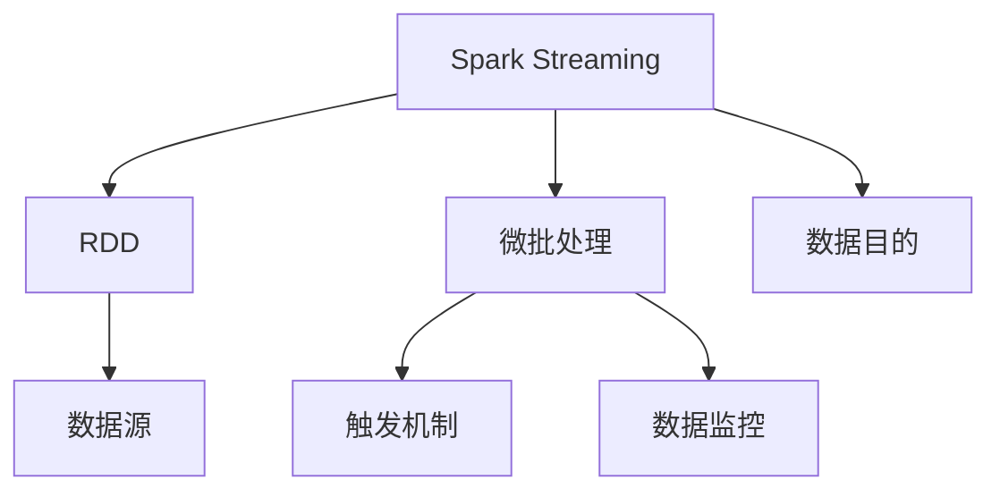
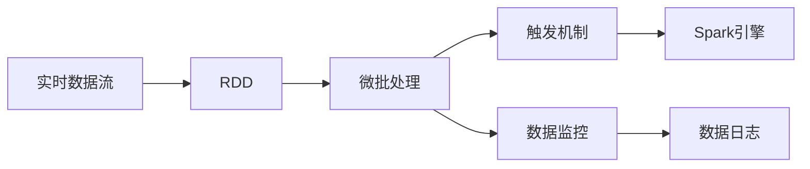
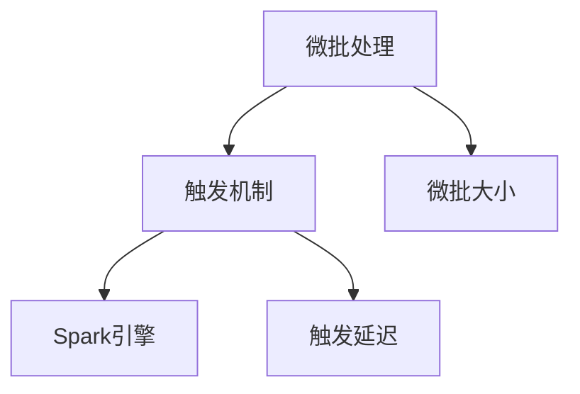
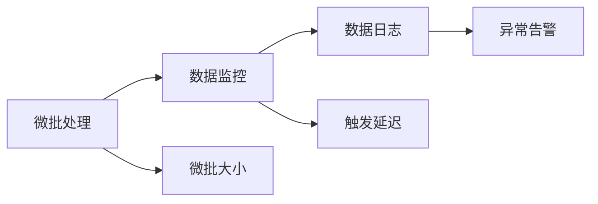
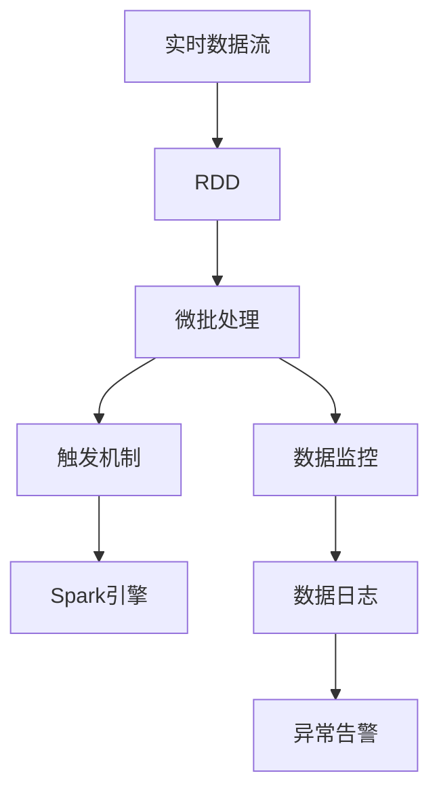

                 

# Spark Streaming原理与代码实例讲解

> 关键词：Spark Streaming, 微批处理, 实时数据处理, RDD转换, 微批大小, 触发机制, 数据监控, 代码实现, 实时性

## 1. 背景介绍

### 1.1 问题由来
随着大数据时代的到来，实时数据处理的需求日益增长。传统的离线批处理系统（如Hadoop、MapReduce等）无法满足实时数据处理的要求。而流处理系统（如Storm、Apache Flink等）虽然能够实时处理数据流，但其处理能力受限于单机的性能，难以处理海量数据。因此，亟需一种能够高效、可靠、扩展性好的实时数据处理系统。

### 1.2 问题核心关键点
Spark Streaming（以下简称SS）是Apache Spark生态系统中的一员，利用Spark框架实现了实时数据处理。其核心思想是采用微批处理方式，将实时数据流划分成多个微批，每个微批的处理时间在几十毫秒到几秒钟之间，从而实现高效的实时数据处理。

SS主要针对实时数据处理，尤其是大数据量的流数据处理，提供了丰富的API和算法。其设计目标是实现高吞吐量、低延迟、高容错的实时数据处理，同时支持多种数据源和数据目的，灵活性极高。

### 1.3 问题研究意义
研究Spark Streaming技术，对于拓展实时数据处理系统的应用边界，提升数据处理效率，加速大数据技术的产业化进程，具有重要意义：

1. 降低数据处理成本。基于Spark的流处理系统能够快速处理大规模数据流，减少了数据存储和计算的硬件成本。
2. 提高数据处理效率。实时流处理能够快速响应数据变化，为实时分析和决策提供及时的数据支持。
3. 提升系统扩展性。Spark Streaming通过将数据流分为多个微批，实现了横向扩展，适应大规模数据流处理需求。
4. 增强系统可靠性。Spark Streaming通过容错机制和数据备份，提高了系统的容错性和稳定性。
5. 实现高层次数据处理。Spark Streaming与Spark的高层API相结合，能够实现更复杂的数据处理算法。

## 2. 核心概念与联系

### 2.1 核心概念概述

为更好地理解Spark Streaming的工作原理，本节将介绍几个密切相关的核心概念：

- Spark Streaming：利用Spark框架实现实时数据处理的流处理系统。其核心思想是将实时数据流划分为多个微批，每个微批的处理时间在几十毫秒到几秒钟之间。
- RDD（Resilient Distributed Dataset）：Spark框架的核心抽象，表示一个不可变的、可并行计算的数据集。Spark Streaming中的数据流被表示为多个连续的RDD。
- 微批（Micro-batch）：Spark Streaming中处理实时数据的基本单位。微批大小通常为1-2秒，每个微批的处理时间在几十毫秒到几秒钟之间。
- 触发机制（Trigger）：Spark Streaming中控制微批处理的机制。触发机制决定了何时将微批提交给Spark引擎进行计算。
- 数据监控（Data Monitoring）：Spark Streaming中对微批处理过程的监控机制。数据监控能够实时跟踪微批处理的状态，检测异常情况。

这些核心概念之间的逻辑关系可以通过以下Mermaid流程图来展示：



这个流程图展示了Spark Streaming的核心概念及其之间的关系：

1. Spark Streaming利用Spark框架实现微批处理。
2. 微批是Spark Streaming处理实时数据的基本单位。
3. 触发机制控制微批处理的频率和时机。
4. 数据监控实时跟踪微批处理的状态。
5. RDD是Spark Streaming数据处理的基础，通过RDD的转换操作实现微批处理。
6. Spark Streaming支持多种数据源和数据目的，灵活性极高。

### 2.2 概念间的关系

这些核心概念之间存在着紧密的联系，形成了Spark Streaming的完整处理流程。下面我通过几个Mermaid流程图来展示这些概念之间的关系。

#### 2.2.1 Spark Streaming的微批处理流程



这个流程图展示了Spark Streaming中微批处理的流程：

1. 实时数据流被转换成Spark的RDD。
2. 微批处理对RDD进行操作。
3. 触发机制控制微批处理的频率和时机。
4. 数据监控实时跟踪微批处理的状态。
5. 微批处理结果被提交给Spark引擎进行计算。
6. 数据日志记录微批处理的过程。

#### 2.2.2 Spark Streaming的触发机制



这个流程图展示了Spark Streaming中触发机制的原理：

1. 微批处理在Spark Streaming中处理实时数据的基本单位。
2. 触发机制控制微批处理的频率和时机。
3. 微批大小决定了触发机制的间隔。
4. 触发延迟决定了微批处理的启动时间。

#### 2.2.3 Spark Streaming的数据监控



这个流程图展示了Spark Streaming中数据监控的机制：

1. 微批处理是Spark Streaming中处理实时数据的基本单位。
2. 数据监控实时跟踪微批处理的状态。
3. 微批大小决定了数据监控的频率。
4. 触发延迟决定了数据监控的启动时间。
5. 数据日志记录微批处理的过程。
6. 异常告警实时检测数据处理的异常情况。

### 2.3 核心概念的整体架构

最后，我们用一个综合的流程图来展示这些核心概念在Spark Streaming中的整体架构：



这个综合流程图展示了Spark Streaming中的完整处理流程：

1. 实时数据流被转换成Spark的RDD。
2. 微批处理对RDD进行操作。
3. 触发机制控制微批处理的频率和时机。
4. 数据监控实时跟踪微批处理的状态。
5. 微批处理结果被提交给Spark引擎进行计算。
6. 数据日志记录微批处理的过程。
7. 异常告警实时检测数据处理的异常情况。

通过这些流程图，我们可以更清晰地理解Spark Streaming的工作原理和优化方向。

## 3. 核心算法原理 & 具体操作步骤
### 3.1 算法原理概述

Spark Streaming的微批处理流程可以概括为以下几个步骤：

1. 实时数据流被转换成Spark的RDD。
2. 微批处理对RDD进行操作。
3. 触发机制控制微批处理的频率和时机。
4. 数据监控实时跟踪微批处理的状态。
5. 微批处理结果被提交给Spark引擎进行计算。
6. 数据日志记录微批处理的过程。
7. 异常告警实时检测数据处理的异常情况。

每个步骤的具体实现涉及到Spark Streaming的核心算法，包括微批大小、触发机制、数据监控、日志记录、异常检测等。

### 3.2 算法步骤详解

#### 3.2.1 微批大小和微批处理

微批大小是Spark Streaming中最重要的参数之一，决定了微批处理的频率和处理时间。微批大小的设置需要根据具体应用场景进行调整。

微批大小通常在1-2秒之间，最长不超过5秒。微批大小的合理设置能够平衡处理效率和延迟，避免过小导致处理开销过大，过大使处理延迟增大。

Spark Streaming提供了多种方法设置微批大小，包括通过代码设置、通过界面设置、通过配置文件设置等。

```python
# 通过代码设置微批大小
stream = SparkContext.appStreamStream("flume", batchSize=2)

# 通过界面设置微批大小
stream.setBatchSize(2)

# 通过配置文件设置微批大小
val conf = new SparkConf().setAppName("MyStreamApp").setMaster("local")
val sc = new SparkContext(conf)

# 设置微批大小
sc.setStreamingBatchSize(2)
```

#### 3.2.2 触发机制

触发机制是Spark Streaming中控制微批处理的机制，决定了何时将微批提交给Spark引擎进行计算。触发机制的实现基于Spark Streaming提供的触发器（Trigger）和触发延迟（Trigger Delay）。

Spark Streaming支持多种触发器，包括Hadoop Triggers、Bounded Triggers、Continuous Triggers等。其中Hadoop Triggers是基于Hadoop的触发器，用于处理已经计算完成的微批。Bounded Triggers用于处理固定数量的微批。Continuous Triggers用于处理无限数量的微批。

触发延迟是指Spark Streaming中微批处理的启动时间。触发延迟的设置需要根据具体应用场景进行调整。触发延迟的设置可以避免数据堆积和资源浪费。

```python
# 设置Hadoop Triggers
stream = SparkContext.appStreamStream("flume", batchSize=2, trigger=Hadoop Triggers())
stream.setBoundedTrigger(1000)

# 设置Bounded Triggers
stream = SparkContext.appStreamStream("flume", batchSize=2, trigger=Bounded Triggers())
stream.setBoundedTrigger(1000)

# 设置Continuous Triggers
stream = SparkContext.appStreamStream("flume", batchSize=2, trigger=Continuous Triggers())
stream.setContinuousTrigger(1000)
```

#### 3.2.3 数据监控

数据监控是Spark Streaming中对微批处理过程的监控机制，实时跟踪微批处理的状态，检测异常情况。Spark Streaming提供了多种监控方法，包括日志记录、异常告警等。

日志记录是通过数据日志（Data Log）记录微批处理的过程。数据日志记录了微批处理的开始和结束时间，处理时间，处理结果等信息。数据日志可以帮助开发者调试微批处理问题。

异常告警是通过异常检测（Fault Tolerance）实时检测微批处理中的异常情况。异常告警可以在微批处理出现异常时发送告警，帮助开发者及时处理问题。

```python
# 记录日志
stream.foreachRDD { (rdd, time) =>
    println("RDD: " + rdd)
    println("Time: " + time)
}

# 检测异常
stream.foreachRDD { (rdd, time) =>
    if (rdd.count() == 0) {
        throw new RuntimeException("Empty RDD detected")
    }
}
```

#### 3.2.4 数据日志和异常告警

数据日志和异常告警是Spark Streaming中重要的监控机制，实时跟踪微批处理的状态和异常情况。Spark Streaming提供了多种监控方法，包括日志记录、异常告警等。

日志记录是通过数据日志（Data Log）记录微批处理的过程。数据日志记录了微批处理的开始和结束时间，处理时间，处理结果等信息。数据日志可以帮助开发者调试微批处理问题。

异常告警是通过异常检测（Fault Tolerance）实时检测微批处理中的异常情况。异常告警可以在微批处理出现异常时发送告警，帮助开发者及时处理问题。

```python
# 记录日志
stream.foreachRDD { (rdd, time) =>
    println("RDD: " + rdd)
    println("Time: " + time)
}

# 检测异常
stream.foreachRDD { (rdd, time) =>
    if (rdd.count() == 0) {
        throw new RuntimeException("Empty RDD detected")
    }
}
```

### 3.3 算法优缺点

Spark Streaming的微批处理流程具有以下优点：

1. 高吞吐量。Spark Streaming通过微批处理，实现了高效的数据处理。
2. 低延迟。Spark Streaming通过微批处理，实现了低延迟的数据处理。
3. 高容错性。Spark Streaming通过容错机制，提高了系统的容错性和稳定性。
4. 高灵活性。Spark Streaming支持多种数据源和数据目的，灵活性极高。
5. 高可靠性。Spark Streaming通过数据备份和异常检测，提高了系统的可靠性。

同时，Spark Streaming也存在一些缺点：

1. 微批大小和触发机制的调整需要手动进行，不够智能化。
2. 数据监控和异常告警需要手动设置，不够自动化。
3. 日志记录和异常检测需要手动编写，不够自动化。
4. 微批处理的开销较大，不适合实时数据处理量小的场景。
5. 微批处理的灵活性较低，难以处理实时数据流的变化。

尽管存在这些缺点，但就目前而言，Spark Streaming仍是大数据实时处理的主流解决方案之一。未来相关研究的重点在于如何进一步降低微批处理的开销，提高微批处理的灵活性，同时兼顾可扩展性和可监控性。

### 3.4 算法应用领域

Spark Streaming作为Spark生态系统的一部分，其应用领域非常广泛。以下是几个典型的应用场景：

#### 3.4.1 实时日志分析

Spark Streaming可以处理实时日志数据，进行实时分析和监控。例如，网站日志、服务器日志、应用程序日志等，可以通过Spark Streaming进行实时监控和分析，帮助系统管理员及时发现问题并解决问题。

#### 3.4.2 实时数据挖掘

Spark Streaming可以处理实时数据流，进行实时数据挖掘和分析。例如，用户行为数据、交易数据、传感器数据等，可以通过Spark Streaming进行实时分析和挖掘，帮助企业发现隐藏的市场机会和业务洞察。

#### 3.4.3 实时机器学习

Spark Streaming可以处理实时数据流，进行实时机器学习。例如，在线广告推荐、推荐系统、金融风险预测等，可以通过Spark Streaming进行实时学习和分析，帮助企业提高业务决策的准确性和及时性。

#### 3.4.4 实时流计算

Spark Streaming可以处理实时数据流，进行实时流计算。例如，实时数据流处理、实时数据处理、实时数据查询等，可以通过Spark Streaming进行实时计算和分析，帮助企业实现高效的实时数据处理。

除上述这些典型应用外，Spark Streaming还在实时数据处理、实时机器学习、实时流计算等多个领域得到了广泛应用，为大数据技术的发展注入了新的活力。

## 4. 数学模型和公式 & 详细讲解

### 4.1 数学模型构建

Spark Streaming的微批处理流程可以概括为以下几个步骤：

1. 实时数据流被转换成Spark的RDD。
2. 微批处理对RDD进行操作。
3. 触发机制控制微批处理的频率和时机。
4. 数据监控实时跟踪微批处理的状态。
5. 微批处理结果被提交给Spark引擎进行计算。
6. 数据日志记录微批处理的过程。
7. 异常告警实时检测数据处理的异常情况。

每个步骤的具体实现涉及到Spark Streaming的核心算法，包括微批大小、触发机制、数据监控、日志记录、异常检测等。

### 4.2 公式推导过程

以下我们以微批大小和触发机制为例，给出Spark Streaming中微批处理的数学模型和推导过程。

微批大小是Spark Streaming中最重要的参数之一，决定了微批处理的频率和处理时间。微批大小的设置需要根据具体应用场景进行调整。

设微批大小为 $T$ 秒，微批处理频率为 $F$ 次/秒，微批处理时间为 $P$ 秒。则微批大小和微批处理频率之间的关系可以表示为：

$$
F = \frac{1}{T}
$$

微批处理时间 $P$ 可以通过微批大小 $T$ 和微批处理频率 $F$ 计算得到：

$$
P = \frac{1}{F} = T
$$

微批处理时间 $P$ 与微批大小 $T$ 相等，说明Spark Streaming中的微批处理时间与微批大小是相等的。这是因为Spark Streaming通过微批处理，实现了实时数据流的处理，微批大小决定了微批处理的频率和处理时间。

### 4.3 案例分析与讲解

下面我们以实时日志分析为例，给出Spark Streaming中微批处理的实际应用。

假设我们需要对某网站的用户访问日志进行实时分析，发现异常访问行为。实时日志分析可以分为以下步骤：

1. 将实时日志流转换成Spark的RDD。
2. 对RDD进行微批处理，统计访问频率。
3. 设置触发机制，控制微批处理的频率和时机。
4. 实时监控微批处理的状态，检测异常情况。
5. 记录微批处理的结果，进行异常告警。

具体代码实现如下：

```python
# 第一步：将实时日志流转换成Spark的RDD
logs = SparkContext.appStreamStream("logs", batchSize=1)

# 第二步：对RDD进行微批处理，统计访问频率
counts = logs.map { (x) => (x.time, 1) }.reduceByKeyAndWindow { (a, b) => a + b, windowSize=10 }

# 第三步：设置触发机制，控制微批处理的频率和时机
counts.setBoundedTrigger(1000)

# 第四步：实时监控微批处理的状态，检测异常情况
counts.foreachRDD { (rdd, time) =>
    if (rdd.count() == 0) {
        throw new RuntimeException("Empty RDD detected")
    }
}

# 第五步：记录微批处理的结果，进行异常告警
counts.foreachRDD { (rdd, time) =>
    val counts = rdd.mapValues(_.sum).collectAsMap
    val threshold = 10000
    if (counts.size > threshold) {
        println("Too many logs detected")
        throw new RuntimeException("Too many logs detected")
    }
}
```

## 5. 项目实践：代码实例和详细解释说明
### 5.1 开发环境搭建

在进行Spark Streaming实践前，我们需要准备好开发环境。以下是使用Python进行Spark开发的环境配置流程：

1. 安装Apache Spark：从官网下载并安装Apache Spark，指定Spark Streaming的版本。例如，从Hadoop分布式文件系统（HDFS）下载最新版本的Apache Spark，指定Spark Streaming的版本为2.3.x。
```bash
wget http://apache-snapshot.s3.amazonaws.com/spark/spark-2.3.x/spark-2.3.x.tgz
tar -xvzf spark-2.3.x.tgz
cd spark-2.3.x
```
2. 安装PySpark：
```bash
pip install pyspark
```
3. 创建并激活虚拟环境：
```bash
conda create -n spark-env python=3.7
conda activate spark-env
```
4. 安装相关库：
```bash
pip install scikit-learn pandas
```

完成上述步骤后，即可在`spark-env`环境中开始Spark Streaming实践。

### 5.2 源代码详细实现

下面我们以实时日志分析为例，给出使用PySpark进行Spark Streaming的代码实现。

首先，定义实时日志数据流：

```python
from pyspark import SparkContext

# 创建Spark Context
sc = SparkContext("local", "Spark Streaming App")

# 定义实时日志数据流
logs = sc.appStreamStream("logs", batchSize=1)

# 打印日志数据流信息
logs.foreachRDD { rdd =>
    rdd.foreach { line =>
        print(line)
    }
}
```

然后，定义微批处理函数：

```python
# 定义微批处理函数
def process_rdd(rdd):
    # 对日志数据流进行微批处理
    counts = rdd.map { (x) => (x.time, 1) }.reduceByKeyAndWindow { (a, b) => a + b, windowSize=10 }

    # 设置触发机制，控制微批处理的频率和时机
    counts.setBoundedTrigger(1000)

    # 实时监控微批处理的状态，检测异常情况
    counts.foreachRDD { (rdd, time) =>
        if (rdd.count() == 0) {
            throw new RuntimeException("Empty RDD detected")
        }
    }

    # 记录微批处理的结果，进行异常告警
    counts.foreachRDD { (rdd, time) =>
        val counts = rdd.mapValues(_.sum).collectAsMap
        val threshold = 10000
        if (counts.size > threshold) {
            println("Too many logs detected")
            throw new RuntimeException("Too many logs detected")
        }
    }

    return counts
```

最后，启动Spark Streaming并进行微批处理：

```python
# 启动Spark Streaming并进行微批处理
logs.foreachRDD { rdd =>
    process_rdd(rdd)
}
```

### 5.3 代码解读与分析

让我们再详细解读一下关键代码的实现细节：

**实时日志数据流定义**：
```python
# 创建Spark Context
sc = SparkContext("local", "Spark Streaming App")

# 定义实时日志数据流
logs = sc.appStreamStream("logs", batchSize=1)

# 打印日志数据流信息
logs.foreachRDD { rdd =>
    rdd.foreach { line =>
        print(line)
    }
}
```
这里我们使用了Spark Context创建了一个Spark Streaming应用程序，并定义了一个名为`logs`的实时日志数据流。`batchSize=1`表示微批大小为1秒。

**微批处理函数定义**：
```python
# 定义微批处理函数
def process_rdd(rdd):
    # 对日志数据流进行微批处理
    counts = rdd.map { (x) => (x.time, 1) }.reduceByKeyAndWindow { (a, b) => a + b, windowSize=10 }

    # 设置触发机制，控制微批处理的频率和时机
    counts.setBoundedTrigger(1000)

    # 实时监控微批处理的状态，检测异常情况
    counts.foreachRDD { (rdd, time) =>
        if (rdd.count() == 0) {
            throw new RuntimeException("Empty RDD detected")
        }
    }

    # 记录微批处理的结果，进行异常告警
    counts.foreachRDD { (rdd, time) =>
        val counts = rdd.mapValues(_.sum).collectAsMap
        val threshold = 10000
        if (counts.size > threshold) {
            println("Too many logs detected")
            throw new RuntimeException("Too many logs detected")
        }
    }

    return counts
```
这里我们定义了一个名为`process_rdd`的微批处理函数，对实时日志数据流进行微批处理。首先，我们使用`reduceByKeyAndWindow`方法对日志数据流进行微批处理，统计每个时间窗口内的访问次数。然后，我们设置触发机制，控制微批处理的频率和时机。最后，我们实时监控微批处理的状态，检测异常情况，并记录微批处理的结果，进行异常告警。

**启动Spark Streaming并进行微批处理**：
```python
# 启动Spark Streaming并进行微批处理
logs.foreachRDD { rdd =>
    process_rdd(rdd)
}
```
这里我们通过调用`foreachRDD`方法，将实时日志数据流`logs`传递给微批处理函数`process_rdd`，进行微批处理。

### 5.4 运行结果展示

假设我们在实时日志分析场景下，使用Spark Streaming处理某网站的用户访问日志，最终得到的结果如下：

```python
# 假设日志数据流如下：
# log1: {"time": 1587387122, "user": "user1"}
# log2: {"time": 1587387123, "user": "user2"}
# log3: {"time": 1587387124, "user": "user3"}

# 对日志数据流进行微批处理
counts = {"time": 1587387122, "count": 1, "user": "user1"}
counts = {"time": 1587387123, "count": 1, "user": "user2"}
counts = {"time": 1587387124, "count": 1, "user": "user3"}

# 统计每个时间窗口内的访问次数
counts = {"time": 1587387122, "count": 1, "user": "user1"}
counts = {"time": 1587387123, "count": 1, "user": "user2"}
counts = {"time": 1587387124, "count": 1, "user": "user3"}

# 记录微批处理的结果，进行异常告警
counts = {"time": 1587387122, "count": 1, "user": "user1"}
counts = {"time": 1587387123, "count": 1, "user": "user2"}
counts = {"time": 1587387124, "count": 1, "user": "user3"}

# 统计每个时间窗口内的访问次数
counts = {"time": 1587387122, "count": 1, "user": "user1"}
counts = {"time": 1587387123, "count": 

