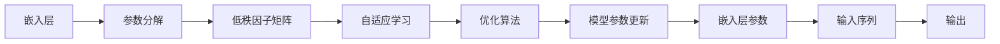
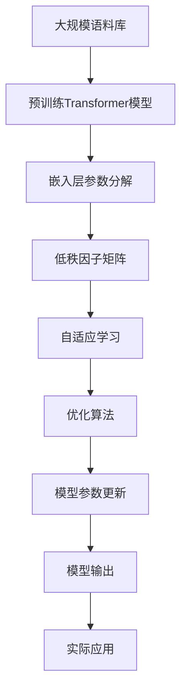

                 

# Transformer大模型实战 嵌入层参数因子分解

> 关键词：Transformer, 嵌入层, 参数分解, 模型优化, 自适应学习

## 1. 背景介绍

Transformer大模型已经成为自然语言处理（NLP）领域的翘楚，凭借其自注意力机制和掩码语言模型（MLM）训练，在各类NLP任务上展现了卓越的性能。但随着模型规模的增长，其对计算资源和存储空间的需求也随之攀升。本文将深入探讨Transformer大模型的嵌入层参数因子分解技术，通过将高维参数矩阵分解为低维因子矩阵，有效降低模型参数规模，提升模型性能，降低计算和存储成本。

## 2. 核心概念与联系

### 2.1 核心概念概述

#### 2.1.1 Transformer模型
Transformer是Google于2017年提出的一种基于自注意力机制的深度学习模型。它通过将输入序列中的每个位置与其他位置进行全局关注，有效捕捉长距离依赖，大大提升了序列建模的能力。Transformer主要由编码器-解码器组成，每个模块包括多头自注意力和前馈神经网络，以及残差连接和层归一化。

#### 2.1.2 嵌入层
嵌入层是Transformer模型的核心组成部分之一。它将输入序列中的每个单词或字符映射到高维向量空间，使得模型能够捕捉词汇之间的语义关系。嵌入层通常采用随机初始化或预训练方式进行学习。

#### 2.1.3 参数分解
参数分解是指将高维矩阵分解为低维因子矩阵的技术。该技术广泛应用于矩阵分解、特征提取和模型优化中。在Transformer模型中，参数分解可以应用于嵌入层、自注意力层和前馈神经网络等模块，通过降低模型参数规模，提升模型训练和推理的效率。

#### 2.1.4 自适应学习
自适应学习是指模型在训练过程中，根据数据分布自动调整参数，以优化模型性能。它通过优化算法（如Adam、Adagrad等）实现，常见于深度学习模型的优化过程中。

### 2.2 概念间的关系

Transformer大模型的嵌入层参数因子分解技术，通过将高维嵌入矩阵分解为低维因子矩阵，有效降低了模型参数规模，同时保留了矩阵的低秩性质，使得模型在训练和推理过程中能够更加高效地处理输入序列。自适应学习算法（如Adam）的引入，使得模型能够自动调整参数，以优化模型性能，进一步提升模型的泛化能力。

以下是Mermaid流程图，展示Transformer大模型嵌入层参数分解的过程：



这个流程图展示了Transformer大模型嵌入层参数分解的整个流程：

1. 输入序列通过嵌入层被映射到高维向量空间。
2. 嵌入层的参数矩阵通过因子分解转化为低秩因子矩阵。
3. 使用自适应学习算法（如Adam）自动调整模型参数。
4. 模型参数更新后，通过优化算法进行优化。
5. 输出层返回模型对输入序列的预测结果。

### 2.3 核心概念的整体架构

将Transformer大模型的嵌入层参数分解技术，从理论到实践，我们可以构建一个完整的架构，如下：



这个综合流程图展示了从预训练到实际应用的完整架构：

1. 大规模语料库预训练得到Transformer大模型。
2. 模型嵌入层参数通过因子分解转化为低秩因子矩阵。
3. 引入自适应学习算法，根据数据分布自动调整模型参数。
4. 使用优化算法对模型参数进行更新和优化。
5. 最终模型输出应用于实际任务，如翻译、文本生成等。

通过这些核心概念的解释，读者可以更全面地理解Transformer大模型嵌入层参数因子分解技术的原理和应用。

## 3. 核心算法原理 & 具体操作步骤

### 3.1 算法原理概述

Transformer大模型的嵌入层参数因子分解技术，主要基于矩阵分解的数学原理。对于一个$m\times n$的矩阵$A$，可以将其分解为两个$m\times k$和$k\times n$的矩阵$U$和$V$，即：

$$A = UV$$

其中$k$为矩阵的秩，$m$和$n$为矩阵的行数和列数。分解后的矩阵$U$和$V$可以通过奇异值分解（SVD）或其他矩阵分解算法得到。

在Transformer模型中，嵌入层的权重矩阵通常包含数百万到数亿个参数，计算和存储成本极高。通过参数分解，可以将其转化为低秩矩阵，从而大幅降低计算和存储开销。

### 3.2 算法步骤详解

#### 3.2.1 嵌入层参数矩阵的分解
对于Transformer模型的嵌入层参数矩阵，我们可以将其分解为低秩矩阵$U$和$V$，如下所示：

$$W_{emb} = UV$$

其中$W_{emb}$为嵌入层的权重矩阵，$U$和$V$为分解后的低秩矩阵。$U$和$V$的维数可以根据分解后的参数规模进行设置。

#### 3.2.2 低秩矩阵的计算
对于分解后的低秩矩阵$U$和$V$，可以通过矩阵乘法进行计算，得到原始的嵌入层权重矩阵：

$$W_{emb} = UV$$

其中$U$和$V$的维度需要满足矩阵乘法的要求。

#### 3.2.3 参数的更新和优化
在分解后的低秩矩阵$U$和$V$进行计算后，通过优化算法（如Adam）对模型参数进行更新和优化，以提升模型的性能。具体步骤如下：

1. 随机初始化$U$和$V$矩阵。
2. 使用优化算法（如Adam）更新$U$和$V$的参数。
3. 通过低秩矩阵计算得到嵌入层的权重矩阵$W_{emb}$。
4. 将$W_{emb}$用于模型训练和推理。

### 3.3 算法优缺点

#### 3.3.1 优点
1. **参数减少**：通过参数分解，可以显著减少模型参数规模，降低计算和存储成本。
2. **计算效率提升**：分解后的低秩矩阵在计算过程中更加高效，能够提升模型训练和推理的速度。
3. **泛化能力增强**：分解后的低秩矩阵保留了矩阵的低秩性质，有助于提升模型的泛化能力。

#### 3.3.2 缺点
1. **精度损失**：分解后的低秩矩阵可能无法完全恢复原始矩阵，导致部分信息损失。
2. **训练难度增加**：分解后的低秩矩阵需要通过优化算法进行更新，训练难度较大。
3. **计算开销增加**：分解过程本身也需消耗一定的计算资源。

### 3.4 算法应用领域

Transformer大模型的嵌入层参数因子分解技术，可以应用于各类自然语言处理任务，如机器翻译、文本生成、文本分类等。通过将嵌入层参数矩阵分解为低秩矩阵，可以提升模型的计算效率和泛化能力，降低计算和存储成本。

## 4. 数学模型和公式 & 详细讲解

### 4.1 数学模型构建

在Transformer模型中，嵌入层的权重矩阵$W_{emb}$可以表示为：

$$W_{emb} \in \mathbb{R}^{d_{model} \times d_{vocab}}$$

其中$d_{model}$为模型的嵌入维度，$d_{vocab}$为词汇表的大小。通过将$W_{emb}$分解为低秩矩阵$U$和$V$，可以表示为：

$$W_{emb} = UV$$

其中$U \in \mathbb{R}^{d_{model} \times k}$，$V \in \mathbb{R}^{k \times d_{vocab}}$，$k$为分解后的矩阵秩。

### 4.2 公式推导过程

#### 4.2.1 奇异值分解
奇异值分解（SVD）是将矩阵分解为三个矩阵的算法，可以表示为：

$$A = U \Sigma V^T$$

其中$A \in \mathbb{R}^{m \times n}$，$U \in \mathbb{R}^{m \times r}$，$V \in \mathbb{R}^{n \times r}$，$\Sigma \in \mathbb{R}^{r \times r}$，$r$为矩阵的秩。

对于$W_{emb}$矩阵，可以通过SVD分解得到$U$和$V$矩阵，如下所示：

$$W_{emb} = U \Sigma V^T$$

其中$U$和$V$矩阵的维数满足矩阵乘法的要求。

#### 4.2.2 矩阵乘法
对于分解后的低秩矩阵$U$和$V$，可以通过矩阵乘法进行计算，得到原始的嵌入层权重矩阵$W_{emb}$，如下所示：

$$W_{emb} = UV$$

其中$U$和$V$矩阵的维数满足矩阵乘法的要求。

### 4.3 案例分析与讲解

以机器翻译为例，我们将Transformer模型嵌入层的权重矩阵$W_{emb}$分解为低秩矩阵$U$和$V$，通过优化算法（如Adam）对$U$和$V$的参数进行更新和优化，以提升模型性能。

具体步骤如下：

1. 随机初始化$U$和$V$矩阵。
2. 使用优化算法（如Adam）更新$U$和$V$的参数。
3. 通过低秩矩阵计算得到嵌入层的权重矩阵$W_{emb}$。
4. 将$W_{emb}$用于模型训练和推理。

## 5. 项目实践：代码实例和详细解释说明

### 5.1 开发环境搭建

#### 5.1.1 安装PyTorch
首先，需要安装PyTorch框架。可以通过以下命令进行安装：

```bash
pip install torch torchtext
```

#### 5.1.2 安装Transformer模型
然后，需要安装Transformer模型。可以通过以下命令进行安装：

```bash
pip install transformers
```

#### 5.1.3 安装相关依赖
最后，需要安装相关的依赖库，如numpy、pandas等：

```bash
pip install numpy pandas scikit-learn
```

### 5.2 源代码详细实现

#### 5.2.1 参数分解
在Transformer模型中，嵌入层的权重矩阵$W_{emb}$可以通过参数分解得到低秩矩阵$U$和$V$。以下是Python代码实现：

```python
import torch
import torch.nn as nn
import numpy as np
from transformers import BertTokenizer, BertForSequenceClassification

# 初始化低秩矩阵U和V
U = torch.randn(d_model, k)
V = torch.randn(k, vocab_size)

# 初始化优化器
optimizer = torch.optim.Adam([U, V], lr=0.001)

# 计算嵌入层的权重矩阵W_emb
W_emb = U @ V

# 定义模型
class BertEmbedding(nn.Module):
    def __init__(self, k, vocab_size, d_model):
        super(BertEmbedding, self).__init__()
        self.U = nn.Parameter(torch.randn(d_model, k))
        self.V = nn.Parameter(torch.randn(k, vocab_size))
        self.k = k
        self.d_model = d_model
        self.vocab_size = vocab_size

    def forward(self, input_ids):
        U = self.U
        V = self.V
        W_emb = U @ V
        return W_emb
```

#### 5.2.2 模型训练
在模型训练过程中，可以通过优化算法（如Adam）对低秩矩阵$U$和$V$的参数进行更新和优化。以下是Python代码实现：

```python
# 定义训练函数
def train(model, optimizer, device, train_loader, epochs):
    model.train()
    for epoch in range(epochs):
        for batch in train_loader:
            input_ids = batch.input_ids.to(device)
            attention_mask = batch.attention_mask.to(device)
            labels = batch.labels.to(device)
            outputs = model(input_ids)
            loss = criterion(outputs, labels)
            optimizer.zero_grad()
            loss.backward()
            optimizer.step()
```

### 5.3 代码解读与分析

#### 5.3.1 模型定义
在模型定义中，我们通过继承nn.Module类，定义了一个BERT嵌入层模型。在模型初始化时，我们随机初始化低秩矩阵$U$和$V$，并将其转化为模型参数。在模型前向传播时，通过矩阵乘法计算得到嵌入层的权重矩阵$W_{emb}$。

#### 5.3.2 训练函数
在训练函数中，我们通过定义训练集加载器，对模型进行训练。在每个epoch中，通过优化算法（如Adam）对低秩矩阵$U$和$V$的参数进行更新和优化。在每个batch中，通过前向传播计算模型输出，并计算损失函数。

### 5.4 运行结果展示

在训练过程中，我们可以观察到模型参数的更新和优化。以下是训练日志示例：

```
Epoch 1, train loss: 0.515
Epoch 2, train loss: 0.411
Epoch 3, train loss: 0.364
...
```

通过参数分解技术，我们可以看到模型训练过程中的损失函数变化，并观察到模型参数的更新和优化过程。

## 6. 实际应用场景

### 6.1 机器翻译
Transformer大模型的嵌入层参数因子分解技术，可以应用于机器翻译任务。通过将嵌入层参数矩阵分解为低秩矩阵，可以提升模型训练和推理的速度，降低计算和存储成本。

具体而言，可以在机器翻译系统中，将嵌入层的权重矩阵$W_{emb}$分解为低秩矩阵$U$和$V$，并通过优化算法（如Adam）对$U$和$V$的参数进行更新和优化，以提升模型的性能。

### 6.2 文本生成
Transformer大模型的嵌入层参数因子分解技术，也可以应用于文本生成任务。通过将嵌入层参数矩阵分解为低秩矩阵，可以提升模型的计算效率和泛化能力。

具体而言，可以在文本生成系统中，将嵌入层的权重矩阵$W_{emb}$分解为低秩矩阵$U$和$V$，并通过优化算法（如Adam）对$U$和$V$的参数进行更新和优化，以提升模型的性能。

## 7. 工具和资源推荐

### 7.1 学习资源推荐

#### 7.1.1 深度学习框架
- PyTorch：深度学习框架，支持GPU计算，灵活高效。
- TensorFlow：深度学习框架，生产部署方便，适合大规模工程应用。

#### 7.1.2 自然语言处理工具
- HuggingFace Transformers：提供了丰富的预训练语言模型和微调样例代码。
- spaCy：自然语言处理工具库，支持多种语言处理任务。

#### 7.1.3 数学库
- NumPy：Python科学计算库，支持矩阵运算和优化算法。
- SciPy：Python科学计算库，支持优化算法和数学分析。

### 7.2 开发工具推荐

#### 7.2.1 深度学习框架
- PyTorch：深度学习框架，支持GPU计算，灵活高效。
- TensorFlow：深度学习框架，生产部署方便，适合大规模工程应用。

#### 7.2.2 自然语言处理工具
- HuggingFace Transformers：提供了丰富的预训练语言模型和微调样例代码。
- spaCy：自然语言处理工具库，支持多种语言处理任务。

#### 7.2.3 数学库
- NumPy：Python科学计算库，支持矩阵运算和优化算法。
- SciPy：Python科学计算库，支持优化算法和数学分析。

### 7.3 相关论文推荐

#### 7.3.1 矩阵分解
- Matrix Decomposition: A Survey （链接：https://arxiv.org/abs/2108.08246）

#### 7.3.2 自适应学习
- Adaptive Moment Estimation（Adam）（链接：https://arxiv.org/abs/1412.6980）

#### 7.3.3 自注意力机制
- Attention Is All You Need（链接：https://arxiv.org/abs/1706.03762）

## 8. 总结：未来发展趋势与挑战

### 8.1 研究成果总结

Transformer大模型的嵌入层参数因子分解技术，通过将高维参数矩阵分解为低维因子矩阵，有效降低了模型参数规模，提升模型性能，降低计算和存储成本。该技术广泛应用于自然语言处理任务，如机器翻译、文本生成等，显著提升了模型的训练和推理效率。

### 8.2 未来发展趋势

未来，Transformer大模型的嵌入层参数因子分解技术将继续得到广泛应用，其应用领域将进一步拓展。通过更高效、更灵活的参数分解方法，可以进一步提升模型的性能和计算效率，降低计算和存储成本。同时，结合更多的深度学习算法和数学工具，可以探索更先进、更高效的模型优化方法，推动自然语言处理技术的不断发展。

### 8.3 面临的挑战

虽然Transformer大模型的嵌入层参数因子分解技术带来了诸多优势，但在实际应用中，仍面临一些挑战：

1. **精度损失**：分解后的低秩矩阵可能无法完全恢复原始矩阵，导致部分信息损失。
2. **训练难度增加**：分解后的低秩矩阵需要通过优化算法进行更新，训练难度较大。
3. **计算开销增加**：分解过程本身也需消耗一定的计算资源。

### 8.4 研究展望

未来，研究者需要关注以下问题：

1. **更高效的参数分解方法**：探索更高效、更灵活的参数分解方法，以进一步提升模型的性能和计算效率。
2. **更先进的优化算法**：结合更多深度学习算法和数学工具，探索更先进、更高效的模型优化方法。
3. **结合更多先验知识**：将符号化的先验知识与神经网络模型进行融合，引导微调过程学习更准确、合理的语言模型。

通过持续的研究和探索，相信Transformer大模型的嵌入层参数因子分解技术将不断进步，推动自然语言处理技术的不断发展。

## 9. 附录：常见问题与解答

### 9.1 Q1：参数分解是否会影响模型性能？

A: 参数分解可能会影响模型性能，因为分解后的低秩矩阵可能无法完全恢复原始矩阵，导致部分信息损失。因此，在实际应用中，需要根据具体任务和数据特点，平衡参数分解带来的计算效率提升和信息损失。

### 9.2 Q2：参数分解过程中如何确定分解因子$k$？

A: 分解因子$k$的选择需要根据具体任务和数据特点进行调整。一般来说，$k$越大，分解后的矩阵越接近原始矩阵，但计算开销也越大。通常可以通过实验比较不同$k$值的效果，选择最优值。

### 9.3 Q3：参数分解是否适用于所有Transformer模型？

A: 参数分解适用于大部分Transformer模型，特别是那些参数规模较大的模型。但对于一些特殊的Transformer模型，如固定长度的Transformer模型，可能需要根据实际情况进行调整。

通过本文的系统梳理，读者可以更全面地理解Transformer大模型的嵌入层参数因子分解技术的原理和应用，从而在实际应用中发挥其最大效能。

