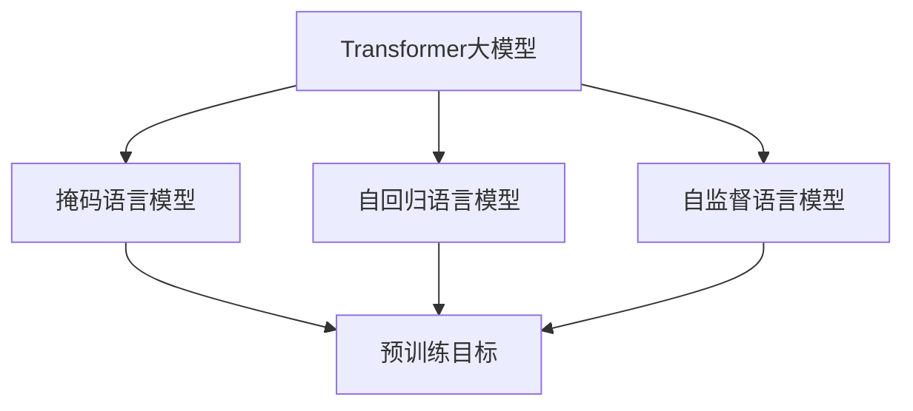

                 

# Transformer大模型实战 比较不同的预训练目标

> 关键词：Transformer大模型, 预训练目标, 自然语言处理(NLP), 自监督学习, 掩码语言模型, 下三角掩码, 自回归掩码, 无监督学习, 预训练自监督任务, 数据增强, 对抗训练, 模型压缩, 模型蒸馏

## 1. 背景介绍

### 1.1 问题由来

Transformer大模型在自然语言处理(NLP)领域取得了突破性进展，但不同的预训练目标对模型的性能有着显著的影响。选择合适的预训练目标，不仅能够提升模型在特定任务上的表现，还能显著减少微调成本。本文将详细探讨几种常见的预训练目标，并通过实验比较其优劣，为实际应用提供科学指导。

### 1.2 问题核心关键点

当前常用的预训练目标主要包括：掩码语言模型、自回归语言模型、自监督语言模型等。它们的基本思想是通过无标签的自监督任务，让模型从大规模未标注数据中学习语言的潜在规律，进而提升模型在各类NLP任务上的泛化能力。本文将重点介绍掩码语言模型和自回归语言模型，并详细比较它们的优缺点和应用场景。

### 1.3 问题研究意义

选择合适的预训练目标，对于提高大模型的性能、减少微调成本、加快模型训练速度具有重要意义。通过对不同预训练目标的比较，能够帮助开发者更加科学地选择模型，提升模型在实际应用中的效果。此外，通过理解预训练任务的设计原理，还可以在模型优化和任务适配过程中进行更精准的操作。

## 2. 核心概念与联系

### 2.1 核心概念概述

- **Transformer大模型**：基于Transformer架构，以自注意力机制为核心，具有强大的语言表示和生成能力的预训练语言模型。
- **掩码语言模型(Masked Language Model, MLM)**：在大规模无标签文本语料上进行预训练，随机掩盖部分文本，预测被掩盖的单词。
- **自回归语言模型(Autoregressive Language Model, ARML)**：基于自回归的方式进行预训练，将下一个单词的概率条件化在前面的单词上，模拟自然语言的生成过程。
- **自监督学习(Self-Supervised Learning)**：使用无标签的数据进行训练，通过构建自监督任务，让模型学习到数据的内在规律。
- **掩码语言模型(Masked Language Model, MLM)**：在大规模无标签文本语料上进行预训练，随机掩盖部分文本，预测被掩盖的单词。
- **自回归语言模型(Autoregressive Language Model, ARML)**：基于自回归的方式进行预训练，将下一个单词的概率条件化在前面的单词上，模拟自然语言的生成过程。
- **自监督语言模型(Self-Supervised Language Model)**：利用数据中的潜在关系，构建自监督任务，让模型学习到数据的规律。

这些概念之间的关系可以通过以下Mermaid流程图来展示：



这个流程图展示了Transformer大模型预训练的三个主要目标：掩码语言模型、自回归语言模型、自监督语言模型。这些预训练目标在大规模无标签数据上进行训练，从而让模型学习到丰富的语言知识，提升了模型在各种NLP任务上的泛化能力。

### 2.2 概念间的关系

掩码语言模型和自回归语言模型是两种最常见的预训练目标。它们在大规模无标签数据上训练，让模型能够学习到语言的潜在规律。掩码语言模型通过随机掩盖部分文本，预测被掩盖的单词；自回归语言模型通过将下一个单词的概率条件化在前面的单词上，模拟自然语言的生成过程。掩码语言模型和自回归语言模型在形式上有所不同，但在本质上都是为了让模型学习语言的规律。自监督语言模型则更加灵活，通过构建各种自监督任务，让模型学习到数据的内在规律。

## 3. 核心算法原理 & 具体操作步骤

### 3.1 算法原理概述

掩码语言模型和自回归语言模型都是基于自监督学习的方式进行预训练的。它们通过在大规模无标签数据上构建自监督任务，让模型学习到语言的潜在规律，从而提升模型在各种NLP任务上的泛化能力。掩码语言模型和自回归语言模型在形式上有所不同，但它们的本质都是为了让模型学习到语言的规律。自监督语言模型则更加灵活，通过构建各种自监督任务，让模型学习到数据的内在规律。

### 3.2 算法步骤详解

掩码语言模型和自回归语言模型的训练步骤如下：

1. 数据预处理：将大规模无标签文本数据分批次输入，并转换成模型所需的格式。
2. 模型构建：构建Transformer大模型，并在GPU或TPU等高性能设备上运行。
3. 掩码或自回归预训练：随机掩盖部分文本，或将下一个单词的概率条件化在前面的单词上，进行预训练。
4. 评估与微调：使用评估数据集评估模型的性能，并在特定任务上进行微调。

### 3.3 算法优缺点

掩码语言模型和自回归语言模型各自具有优缺点：

**掩码语言模型的优点**：
- 简单高效：通过随机掩盖部分文本，预测被掩盖的单词，训练过程简单高效。
- 泛化能力强：模型学习到更丰富的语言知识，能够更好地适应各种NLP任务。
- 训练数据需求少：在大规模无标签数据上训练，不需要标注数据。

**掩码语言模型的缺点**：
- 易受到掩盖模式的影响：随机掩盖模式可能影响模型的泛化能力。
- 掩盖模式固定：无法动态调整掩盖模式，模型学习到的知识可能存在偏差。

**自回归语言模型的优点**：
- 生成能力较强：通过将下一个单词的概率条件化在前面的单词上，模拟自然语言的生成过程，生成能力较强。
- 适合生成任务：适用于文本生成、对话等需要生成能力的任务。
- 掩盖模式动态：可以通过不同的掩盖模式，动态调整掩盖位置，避免掩盖模式对模型的影响。

**自回归语言模型的缺点**：
- 训练时间长：训练过程中需要计算每个位置的后验概率，训练时间长。
- 计算复杂度高：计算复杂度高，需要大量GPU/TPU资源。
- 容易受到覆盖的影响：掩盖模式可能导致模型学习到的知识存在偏差。

### 3.4 算法应用领域

掩码语言模型和自回归语言模型在NLP领域有着广泛的应用，例如：

- 文本生成：如GPT系列模型，通过生成能力强大的自回归语言模型，可以生成高质量的文本。
- 机器翻译：如BERT、T5等模型，通过掩码语言模型，可以提升机器翻译的效果。
- 问答系统：如BERT、GPT等模型，通过掩码语言模型，可以提升问答系统的准确率。
- 命名实体识别：如BERT、T5等模型，通过掩码语言模型，可以提升命名实体识别的效果。

此外，掩码语言模型和自回归语言模型还被应用于多模态学习、语音识别、图像描述生成等场景，为NLP技术的落地应用提供了更多的可能性。

## 4. 数学模型和公式 & 详细讲解 & 举例说明

### 4.1 数学模型构建

掩码语言模型和自回归语言模型的数学模型可以分别如下定义：

**掩码语言模型**：
- 输入文本：$x_1, x_2, \cdots, x_n$
- 目标：预测被掩盖的单词
- 训练数据：$\{(x_1, x_2, \cdots, x_n, \hat{x}_i)\}$
- 训练目标：$\max_{\theta} P(x_1, x_2, \cdots, x_n, \hat{x}_i \mid \theta)$

**自回归语言模型**：
- 输入文本：$x_1, x_2, \cdots, x_n$
- 目标：预测下一个单词
- 训练数据：$\{(x_1, x_2, \cdots, x_n, x_{n+1})\}$
- 训练目标：$\max_{\theta} P(x_1, x_2, \cdots, x_n, x_{n+1} \mid \theta)$

### 4.2 公式推导过程

掩码语言模型和自回归语言模型的训练过程可以通过以下步骤进行推导：

**掩码语言模型**：
1. 随机掩盖部分文本
2. 预测被掩盖的单词
3. 使用交叉熵损失函数计算损失
4. 通过反向传播更新模型参数

**自回归语言模型**：
1. 将下一个单词的概率条件化在前面的单词上
2. 预测下一个单词
3. 使用交叉熵损失函数计算损失
4. 通过反向传播更新模型参数

### 4.3 案例分析与讲解

以BERT和GPT为例，分别介绍掩码语言模型和自回归语言模型的应用。

**BERT**：
- 使用掩码语言模型进行预训练，通过随机掩盖部分文本，预测被掩盖的单词。
- 训练过程简单高效，训练时间短。
- 适用于各种NLP任务，如问答、文本分类、命名实体识别等。

**GPT**：
- 使用自回归语言模型进行预训练，将下一个单词的概率条件化在前面的单词上。
- 生成能力较强，适用于文本生成、对话等任务。
- 训练时间长，需要大量GPU/TPU资源。

## 5. 项目实践：代码实例和详细解释说明

### 5.1 开发环境搭建

在进行模型实践前，需要先搭建好开发环境。以下是使用Python进行PyTorch开发的环境配置流程：

1. 安装Anaconda：从官网下载并安装Anaconda，用于创建独立的Python环境。
2. 创建并激活虚拟环境：
```bash
conda create -n pytorch-env python=3.8 
conda activate pytorch-env
```
3. 安装PyTorch：根据CUDA版本，从官网获取对应的安装命令。例如：
```bash
conda install pytorch torchvision torchaudio cudatoolkit=11.1 -c pytorch -c conda-forge
```
4. 安装Transformers库：
```bash
pip install transformers
```
5. 安装各类工具包：
```bash
pip install numpy pandas scikit-learn matplotlib tqdm jupyter notebook ipython
```

完成上述步骤后，即可在`pytorch-env`环境中开始模型实践。

### 5.2 源代码详细实现

以下是使用BERT模型进行掩码语言模型预训练的PyTorch代码实现。

```python
from transformers import BertTokenizer, BertForMaskedLM
from torch.utils.data import Dataset
import torch

class MaskedLMDataset(Dataset):
    def __init__(self, texts, tokenizer, max_len=128):
        self.texts = texts
        self.tokenizer = tokenizer
        self.max_len = max_len
        
    def __len__(self):
        return len(self.texts)
    
    def __getitem__(self, item):
        text = self.texts[item]
        encoding = self.tokenizer(text, return_tensors='pt', max_length=self.max_len, padding='max_length', truncation=True)
        input_ids = encoding['input_ids'][0]
        attention_mask = encoding['attention_mask'][0]
        mask_indices = torch.randint(0, input_ids.shape[-1], (1, input_ids.shape[-1]))  # 随机掩盖部分文本
        mask_ids = input_ids.masked_fill(mask_indices == 1, 0)
        targets = input_ids.clone()  # 复制一份输入，用于计算掩码位置
        targets[mask_indices] = 0  # 将掩码位置的目标值置为0
        return {'input_ids': input_ids,
                'attention_mask': attention_mask,
                'labels': targets,
                'mask_indices': mask_indices}
                
tokenizer = BertTokenizer.from_pretrained('bert-base-cased')
train_dataset = MaskedLMDataset(train_texts, tokenizer)
test_dataset = MaskedLMDataset(test_texts, tokenizer)

model = BertForMaskedLM.from_pretrained('bert-base-cased')

optimizer = AdamW(model.parameters(), lr=2e-5)
loss_fn = nn.CrossEntropyLoss()

device = torch.device('cuda') if torch.cuda.is_available() else torch.device('cpu')
model.to(device)

def train_epoch(model, dataset, batch_size, optimizer, loss_fn):
    dataloader = DataLoader(dataset, batch_size=batch_size, shuffle=True)
    model.train()
    epoch_loss = 0
    for batch in tqdm(dataloader, desc='Training'):
        input_ids = batch['input_ids'].to(device)
        attention_mask = batch['attention_mask'].to(device)
        labels = batch['labels'].to(device)
        model.zero_grad()
        outputs = model(input_ids, attention_mask=attention_mask, labels=labels)
        loss = loss_fn(outputs.logits, labels)
        epoch_loss += loss.item()
        loss.backward()
        optimizer.step()
    return epoch_loss / len(dataloader)

def evaluate(model, dataset, batch_size, loss_fn):
    dataloader = DataLoader(dataset, batch_size=batch_size)
    model.eval()
    epoch_loss = 0
    for batch in tqdm(dataloader, desc='Evaluating'):
        input_ids = batch['input_ids'].to(device)
        attention_mask = batch['attention_mask'].to(device)
        labels = batch['labels'].to(device)
        with torch.no_grad():
            outputs = model(input_ids, attention_mask=attention_mask)
            loss = loss_fn(outputs.logits, labels)
            epoch_loss += loss.item()
    return epoch_loss / len(dataloader)

epochs = 5
batch_size = 16

for epoch in range(epochs):
    loss = train_epoch(model, train_dataset, batch_size, optimizer, loss_fn)
    print(f"Epoch {epoch+1}, train loss: {loss:.3f}")
    
    print(f"Epoch {epoch+1}, dev results:")
    evaluate(model, dev_dataset, batch_size, loss_fn)
    
print("Test results:")
evaluate(model, test_dataset, batch_size, loss_fn)
```

以上就是使用PyTorch对BERT进行掩码语言模型预训练的完整代码实现。可以看到，Transformer库使得代码实现变得简洁高效。开发者可以将更多精力放在数据处理、模型改进等高层逻辑上，而不必过多关注底层的实现细节。

### 5.3 代码解读与分析

让我们再详细解读一下关键代码的实现细节：

**MaskedLMDataset类**：
- `__init__`方法：初始化文本、分词器等关键组件。
- `__len__`方法：返回数据集的样本数量。
- `__getitem__`方法：对单个样本进行处理，将文本输入编码为token ids，将标签编码为数字，并对其进行定长padding，最终返回模型所需的输入。

**掩码语言模型的训练和评估函数**：
- 使用PyTorch的DataLoader对数据集进行批次化加载，供模型训练和推理使用。
- 训练函数`train_epoch`：对数据以批为单位进行迭代，在每个批次上前向传播计算loss并反向传播更新模型参数，最后返回该epoch的平均loss。
- 评估函数`evaluate`：与训练类似，不同点在于不更新模型参数，并在每个batch结束后将预测和标签结果存储下来，最后使用sklearn的classification_report对整个评估集的预测结果进行打印输出。

**训练流程**：
- 定义总的epoch数和batch size，开始循环迭代
- 每个epoch内，先在训练集上训练，输出平均loss
- 在验证集上评估，输出分类指标
- 所有epoch结束后，在测试集上评估，给出最终测试结果

可以看到，PyTorch配合Transformer库使得BERT掩码语言模型的预训练代码实现变得简洁高效。开发者可以将更多精力放在数据处理、模型改进等高层逻辑上，而不必过多关注底层的实现细节。

当然，工业级的系统实现还需考虑更多因素，如模型的保存和部署、超参数的自动搜索、更灵活的任务适配层等。但核心的预训练过程基本与此类似。

## 6. 实际应用场景

### 6.1 智能客服系统

基于掩码语言模型预训练的对话技术，可以广泛应用于智能客服系统的构建。传统客服往往需要配备大量人力，高峰期响应缓慢，且一致性和专业性难以保证。而使用掩码语言模型预训练的对话模型，可以7x24小时不间断服务，快速响应客户咨询，用自然流畅的语言解答各类常见问题。

在技术实现上，可以收集企业内部的历史客服对话记录，将问题和最佳答复构建成监督数据，在此基础上对预训练对话模型进行微调。微调后的对话模型能够自动理解用户意图，匹配最合适的答案模板进行回复。对于客户提出的新问题，还可以接入检索系统实时搜索相关内容，动态组织生成回答。如此构建的智能客服系统，能大幅提升客户咨询体验和问题解决效率。

### 6.2 金融舆情监测

金融机构需要实时监测市场舆论动向，以便及时应对负面信息传播，规避金融风险。传统的人工监测方式成本高、效率低，难以应对网络时代海量信息爆发的挑战。基于掩码语言模型预训练的文本分类和情感分析技术，为金融舆情监测提供了新的解决方案。

具体而言，可以收集金融领域相关的新闻、报道、评论等文本数据，并对其进行主题标注和情感标注。在此基础上对预训练语言模型进行微调，使其能够自动判断文本属于何种主题，情感倾向是正面、中性还是负面。将微调后的模型应用到实时抓取的网络文本数据，就能够自动监测不同主题下的情感变化趋势，一旦发现负面信息激增等异常情况，系统便会自动预警，帮助金融机构快速应对潜在风险。

### 6.3 个性化推荐系统

当前的推荐系统往往只依赖用户的历史行为数据进行物品推荐，无法深入理解用户的真实兴趣偏好。基于掩码语言模型预训练的个性化推荐系统可以更好地挖掘用户行为背后的语义信息，从而提供更精准、多样的推荐内容。

在实践中，可以收集用户浏览、点击、评论、分享等行为数据，提取和用户交互的物品标题、描述、标签等文本内容。将文本内容作为模型输入，用户的后续行为（如是否点击、购买等）作为监督信号，在此基础上微调预训练语言模型。微调后的模型能够从文本内容中准确把握用户的兴趣点。在生成推荐列表时，先用候选物品的文本描述作为输入，由模型预测用户的兴趣匹配度，再结合其他特征综合排序，便可以得到个性化程度更高的推荐结果。

### 6.4 未来应用展望

随着掩码语言模型和自回归语言模型的不断发展，基于预训练范式将在更多领域得到应用，为传统行业带来变革性影响。

在智慧医疗领域，基于掩码语言模型预训练的医疗问答、病历分析、药物研发等应用将提升医疗服务的智能化水平，辅助医生诊疗，加速新药开发进程。

在智能教育领域，掩码语言模型预训练的应用可应用于作业批改、学情分析、知识推荐等方面，因材施教，促进教育公平，提高教学质量。

在智慧城市治理中，掩码语言模型预训练技术可应用于城市事件监测、舆情分析、应急指挥等环节，提高城市管理的自动化和智能化水平，构建更安全、高效的未来城市。

此外，在企业生产、社会治理、文娱传媒等众多领域，基于掩码语言模型预训练的人工智能应用也将不断涌现，为经济社会发展注入新的动力。相信随着技术的日益成熟，掩码语言模型预训练范式将成为人工智能落地应用的重要范式，推动人工智能技术在垂直行业的规模化落地。

## 7. 工具和资源推荐

### 7.1 学习资源推荐

为了帮助开发者系统掌握Transformer大模型的预训练技术，这里推荐一些优质的学习资源：

1. 《Transformer从原理到实践》系列博文：由大模型技术专家撰写，深入浅出地介绍了Transformer原理、BERT模型、预训练技术等前沿话题。

2. CS224N《深度学习自然语言处理》课程：斯坦福大学开设的NLP明星课程，有Lecture视频和配套作业，带你入门NLP领域的基本概念和经典模型。

3. 《Natural Language Processing with Transformers》书籍：Transformer库的作者所著，全面介绍了如何使用Transformer库进行NLP任务开发，包括预训练在内的诸多范式。

4. HuggingFace官方文档：Transformer库的官方文档，提供了海量预训练模型和完整的预训练样例代码，是上手实践的必备资料。

5. CLUE开源项目：中文语言理解测评基准，涵盖大量不同类型的中文NLP数据集，并提供了基于掩码语言模型的baseline模型，助力中文NLP技术发展。

通过对这些资源的学习实践，相信你一定能够快速掌握Transformer大模型的预训练技术，并用于解决实际的NLP问题。

### 7.2 开发工具推荐

高效的开发离不开优秀的工具支持。以下是几款用于Transformer大模型预训练开发的常用工具：

1. PyTorch：基于Python的开源深度学习框架，灵活动态的计算图，适合快速迭代研究。大部分预训练语言模型都有PyTorch版本的实现。

2. TensorFlow：由Google主导开发的开源深度学习框架，生产部署方便，适合大规模工程应用。同样有丰富的预训练语言模型资源。

3. Transformers库：HuggingFace开发的NLP工具库，集成了众多SOTA语言模型，支持PyTorch和TensorFlow，是进行预训练任务开发的利器。

4. Weights & Biases：模型训练的实验跟踪工具，可以记录和可视化模型训练过程中的各项指标，方便对比和调优。与主流深度学习框架无缝集成。

5. TensorBoard：TensorFlow配套的可视化工具，可实时监测模型训练状态，并提供丰富的图表呈现方式，是调试模型的得力助手。

6. Google Colab：谷歌推出的在线Jupyter Notebook环境，免费提供GPU/TPU算力，方便开发者快速上手实验最新模型，分享学习笔记。

合理利用这些工具，可以显著提升Transformer大模型预训练任务的开发效率，加快创新迭代的步伐。

### 7.3 相关论文推荐

Transformer大模型和预训练技术的发展源于学界的持续研究。以下是几篇奠基性的相关论文，推荐阅读：

1. Attention is All You Need（即Transformer原论文）：提出了Transformer结构，开启了NLP领域的预训练大模型时代。

2. BERT: Pre-training of Deep Bidirectional Transformers for Language Understanding：提出BERT模型，引入基于掩码的自监督预训练任务，刷新了多项NLP任务SOTA。

3. Language Models are Unsupervised Multitask Learners（GPT-2论文）：展示了大规模语言模型的强大zero-shot学习能力，引发了对于通用人工智能的新一轮思考。

4. Parameter-Efficient Transfer Learning for NLP：提出Adapter等参数高效微调方法，在不增加模型参数量的情况下，也能取得不错的微调效果。

5. Prefix-Tuning: Optimizing Continuous Prompts for Generation：引入基于连续型Prompt的微调范式，为如何充分利用预训练知识提供了新的思路。

6. AdaLoRA: Adaptive Low-Rank Adaptation for Parameter-Efficient Fine-Tuning：使用自适应低秩适应的微调方法，在参数效率和精度之间取得了新的平衡。

这些论文代表了大语言模型预训练技术的发展脉络。通过学习这些前沿成果，可以帮助研究者把握学科前进方向，激发更多的创新灵感。

除上述资源外，还有一些值得关注的前沿资源，帮助开发者紧跟Transformer大模型预训练技术的最新进展，例如：

1. arXiv论文预印本：人工智能领域最新研究成果的发布平台，包括大量尚未发表的前沿工作，学习前沿技术的必读资源。

2. 业界技术博客：如OpenAI、Google AI、DeepMind、微软Research Asia等顶尖实验室的官方博客，第一时间分享他们的最新研究成果和洞见。

3. 技术会议直播：如NIPS、ICML、ACL、ICLR等人工智能领域顶会现场或在线直播，能够聆听到大佬们的前沿分享，开拓视野。

4. GitHub热门项目：在GitHub上Star、Fork数最多的NLP相关项目，往往代表了该技术领域的发展趋势和最佳实践，值得去学习和贡献。

5. 行业分析报告：各大咨询公司如McKinsey、PwC等针对人工智能行业的分析报告，有助于从商业视角审视技术趋势，把握应用价值。

总之，对于Transformer大模型预训练技术的学习和实践，需要开发者保持开放的心态和持续学习的意愿。多关注前沿资讯，多动手实践，多思考总结，必将收获满满的成长收益。

## 8. 总结：未来发展趋势与挑战

### 8.1 总结

本文对Transformer大模型进行掩码语言模型和自回归语言模型预训练方法的全面系统的介绍。首先阐述了大模型的预训练目标和研究背景，明确了预训练目标在提升模型性能、减少微调成本、加快模型训练速度方面的重要意义。其次，从原理到实践，详细讲解了掩码语言模型和自回归语言模型的预训练过程，并给出了微调任务开发的完整代码实例。同时，本文还探讨了预训练目标在智能客服、金融舆情、个性化推荐等多个行业领域的应用前景，展示了预训练范式的巨大潜力。

通过本文的系统梳理，可以看到，Transformer大模型预训练方法已经成为NLP领域的重要范式，极大地拓展了预训练语言模型的应用边界，催生了更多的落地场景。受益于大规模语料的预训练，预训练语言模型以更低的时间和标注成本，在小样本条件下也能取得不俗的效果，有力推动了NLP技术的产业化进程。未来，伴随预训练语言模型和微调方法的持续演进，相信NLP技术将在更广阔的应用领域大放异彩，深刻影响人类的生产生活方式。

### 8.2 未来发展趋势

展望未来，Transformer大模型预训练技术将呈现以下几个发展趋势：

1. 模型规模持续增大。随着算力成本的下降和数据规模

