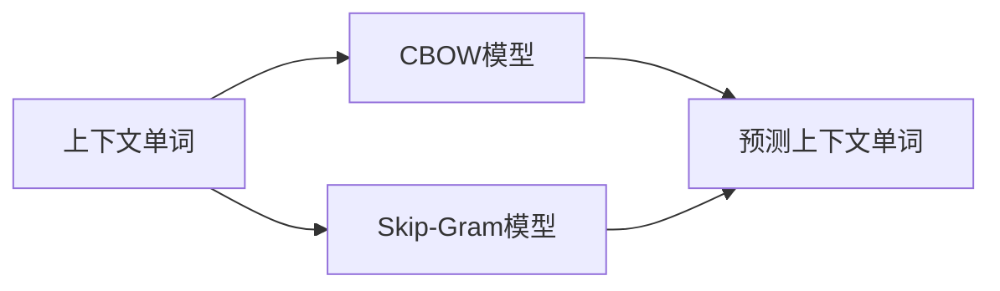

                 

# Word2Vec：CBOW模型和Skip-Gram模型

> 关键词：Word2Vec, CBOW, Skip-Gram, 分布式表示, 神经网络

## 1. 背景介绍

在自然语言处理(NLP)中，将单词转化为数值表示是非常重要的一环。传统的文本处理方法依赖于手工设计的词向量，如n-gram模型和Latent Semantic Analysis(LSA)等，但这些方法往往存在诸如维度灾难、缺乏语义等缺陷。Word2Vec作为一种基于神经网络的单词表示方法，通过训练模型来学习单词之间的关联，生成的词向量具备丰富的语义信息，广泛应用于文本分类、情感分析、机器翻译等任务。

Word2Vec的核心算法包括CBOW模型和Skip-Gram模型。本文将详细介绍这两种模型的原理与实现，并通过代码实例和数学推导，帮助读者深入理解其核心思想和应用。

## 2. 核心概念与联系

### 2.1 核心概念概述

CBOW模型和Skip-Gram模型都是Word2Vec算法的组成部分，其基本思想都是通过神经网络来学习单词之间的关联。这两种模型的主要区别在于数据流向和网络结构。

- **CBOW模型（Continuous Bag-of-Words）**：从单词的上下文来预测中心单词。模型训练过程中，给定上下文单词的序列，预测中心单词。模型通过前向传播计算上下文单词的权重和偏置，然后进行softmax输出，最小化预测值与真实值之间的交叉熵。

- **Skip-Gram模型**：从中心单词来预测上下文单词。模型训练过程中，给定中心单词，预测其周围的上下文单词。模型通过前向传播计算中心单词的权重和偏置，然后反向传播更新上下文单词的权重和偏置，最小化预测值与真实值之间的交叉熵。

### 2.2 核心概念间的联系

CBOW模型和Skip-Gram模型在训练目标、损失函数、优化算法等方面基本一致，但在数据流向和模型结构上有所不同。通过这两种模型的训练，可以学习到单词之间的关联，生成高质量的词向量。具体来说，CBOW模型更适合于文本分类、情感分析等基于中心单词的任务，而Skip-Gram模型更适合于机器翻译、语言建模等需要预测上下文单词的任务。

以下是一个Mermaid流程图，展示了CBOW模型和Skip-Gram模型的基本数据流向和训练过程：



这个流程图展示了CBOW模型和Skip-Gram模型的基本数据流向和训练过程。CBOW模型从上下文单词预测中心单词，而Skip-Gram模型从中心单词预测上下文单词。两者都使用神经网络来进行预测，并通过交叉熵损失函数来最小化预测误差。

## 3. 核心算法原理 & 具体操作步骤

### 3.1 算法原理概述

CBOW和Skip-Gram模型的核心原理是神经网络中的softmax分类器。在训练过程中，模型会随机选择一段连续的单词序列，其中一部分作为上下文单词，一部分作为中心单词。模型通过前向传播计算上下文单词的权重和偏置，然后进行softmax输出，最小化预测值与真实值之间的交叉熵。

具体来说，CBOW模型和Skip-Gram模型的训练过程如下：

1. 输入：随机选择一段连续的单词序列，其中一部分作为上下文单词，一部分作为中心单词。
2. 前向传播：给定上下文单词，通过神经网络计算预测中心单词的概率。
3. 计算损失：计算预测值与真实值之间的交叉熵损失。
4. 反向传播：使用梯度下降等优化算法更新模型参数，最小化损失函数。

### 3.2 算法步骤详解

以下以CBOW模型为例，详细介绍其训练步骤：

1. **输入准备**：随机选择一段长度为 $w$ 的连续单词序列 $W=\{w_1, w_2, ..., w_w\}$，其中 $w$ 为上下文长度，一般取 $5-10$。
2. **网络前向传播**：给定上下文单词序列，通过神经网络计算预测中心单词的概率 $p(w_{w+1}|w_1,...,w_w)$。
3. **计算损失**：计算预测值与真实值之间的交叉熵损失 $L=\sum_{i=1}^{w}\log p(w_{i+1}|w_1,...,w_i)$。
4. **反向传播**：使用梯度下降等优化算法更新模型参数，最小化损失函数 $L$。
5. **模型输出**：对测试集中的单词进行前向传播，得到其预测概率向量。

### 3.3 算法优缺点

CBOW模型和Skip-Gram模型在优化目标、模型结构、训练效率等方面具有以下优缺点：

**优点**：
- 神经网络结构简单，易于实现和训练。
- 可以利用大量无标签文本数据进行预训练，生成高质量的词向量。
- 可以处理多义词和同义词，具有较好的语义表示能力。

**缺点**：
- 模型训练过程依赖于上下文长度，需要手动选择上下文长度。
- 模型训练过程中，需要存储大量的中间计算结果，对内存要求较高。
- 模型训练时间较长，特别是在训练大规模数据集时。

### 3.4 算法应用领域

CBOW模型和Skip-Gram模型广泛应用于文本分类、情感分析、机器翻译、语言建模等多个领域。具体应用包括：

- 文本分类：使用Word2Vec生成的词向量作为特征输入，训练分类器进行文本分类。
- 情感分析：将Word2Vec生成的词向量作为特征输入，训练情感分类器，判断文本情感倾向。
- 机器翻译：使用Word2Vec生成的词向量作为源语言和目标语言的中间表示，训练翻译模型。
- 语言建模：使用Word2Vec生成的词向量作为输入，训练语言模型，预测下一个单词的概率。

## 4. 数学模型和公式 & 详细讲解 & 举例说明

### 4.1 数学模型构建

CBOW和Skip-Gram模型的数学模型可以表示如下：

- **CBOW模型**：
$$
L = -\sum_{i=1}^{w}\log p(w_{i+1}|w_1,...,w_i)
$$

- **Skip-Gram模型**：
$$
L = -\sum_{i=1}^{w}\sum_{j=1}^{w}\log p(w_i|w_{i-1},...,w_{i-k},w_{i+k},...,w_j)
$$

其中，$L$ 为交叉熵损失，$p(\cdot)$ 为softmax输出概率。

### 4.2 公式推导过程

以CBOW模型为例，其公式推导过程如下：

1. **输入准备**：给定上下文单词序列 $W=\{w_1, w_2, ..., w_w\}$，其中 $w$ 为上下文长度，$w_{w+1}$ 为中心单词。
2. **网络前向传播**：使用神经网络计算预测中心单词的概率 $p(w_{w+1}|w_1,...,w_w)$。
3. **计算损失**：计算预测值与真实值之间的交叉熵损失 $L=\sum_{i=1}^{w}\log p(w_{i+1}|w_1,...,w_i)$。
4. **反向传播**：使用梯度下降等优化算法更新模型参数，最小化损失函数 $L$。

具体来说，假设模型使用一个单层神经网络，包含 $v$ 个神经元，每个神经元代表一个单词。给定上下文单词 $w_1,...,w_i$，模型通过神经网络计算预测中心单词 $w_{i+1}$ 的概率，公式如下：
$$
p(w_{i+1}|w_1,...,w_i) = \frac{e^{u_{w_{i+1}}^T \cdot (v_i)}{\sum_{j=1}^{v} e^{u_j^T \cdot v_i}}
$$

其中，$u_j$ 为第 $j$ 个神经元对应的权重向量，$v_i$ 为上下文单词 $w_1,...,w_i$ 的权重和偏置向量，$e$ 为自然对数的底数。

### 4.3 案例分析与讲解

假设我们在一个简单的文本分类任务上进行训练，使用CBOW模型和Skip-Gram模型。文本集为《红楼梦》的前 $n$ 个单词，分为两个类别：红楼梦和梦游天姥吟留别。我们随机选择一段长度为 $5$ 的连续单词序列 $W=\{红楼梦, 红楼梦, 红楼梦, 红楼梦, 梦游天姥吟留别\}$，其中前 $4$ 个单词作为上下文，最后一个单词作为中心单词。

使用CBOW模型进行训练，网络结构如图：

```
input_1 —-|                |—- output
input_2 —-|                |—- output
input_3 —-|                |—- output
input_4 —-|                |—- output
input_5 —-|                |—- output
```

其中，每个神经元代表一个单词，$u_{w_{i+1}}$ 表示中心单词 $w_{i+1}$ 对应的权重向量，$v_i$ 表示上下文单词 $w_1,...,w_i$ 的权重和偏置向量。

使用前向传播计算预测中心单词的概率，公式如下：
$$
p(梦游天姥吟留别|红楼梦, 红楼梦, 红楼梦, 红楼梦) = \frac{e^{u_{梦游天姥吟留别}^T \cdot (v_{1\rightarrow4})}}{\sum_{j=1}^{v} e^{u_j^T \cdot v_{1\rightarrow4}}}
$$

其中，$v_{1\rightarrow4}$ 表示上下文单词 $w_1,...,w_4$ 的权重和偏置向量。

计算交叉熵损失，公式如下：
$$
L = -\log p(梦游天姥吟留别|红楼梦, 红楼梦, 红楼梦, 红楼梦)
$$

使用梯度下降等优化算法更新模型参数，最小化损失函数 $L$。重复上述过程直至收敛。

## 5. 项目实践：代码实例和详细解释说明

### 5.1 开发环境搭建

在代码实现前，需要准备好开发环境。以下是使用Python和TensorFlow进行Word2Vec模型开发的流程：

1. 安装Anaconda：从官网下载并安装Anaconda，用于创建独立的Python环境。

2. 创建并激活虚拟环境：
```bash
conda create -n pytorch-env python=3.8 
conda activate pytorch-env
```

3. 安装TensorFlow：
```bash
pip install tensorflow
```

4. 安装Numpy、Pandas等必要的库：
```bash
pip install numpy pandas matplotlib
```

完成上述步骤后，即可在`pytorch-env`环境中开始Word2Vec模型的实现。

### 5.2 源代码详细实现

下面以CBOW模型为例，给出一个使用TensorFlow实现Word2Vec模型的PyTorch代码实现。

```python
import tensorflow as tf
import numpy as np

# 定义模型参数
VOCAB_SIZE = 5
EMBEDDING_SIZE = 10
SKIP_WINDOW = 3

# 创建输入和输出
inputs = tf.placeholder(tf.int32, [None, None], name='inputs')
targets = tf.placeholder(tf.int32, [None], name='targets')

# 创建神经网络
embeddings = tf.Variable(tf.random_uniform([VOCAB_SIZE, EMBEDDING_SIZE]))
softmax_weights = tf.Variable(tf.random_uniform([EMBEDDING_SIZE, VOCAB_SIZE]))
softmax_biases = tf.Variable(tf.zeros([VOCAB_SIZE]))

# 定义前向传播和损失函数
embed = tf.nn.embedding_lookup(embeddings, inputs)
softmax = tf.matmul(tf.nn.embedding_lookup(softmax_weights, embed), tf.nn.embedding_lookup(softmax_biases, inputs))
loss = tf.reduce_mean(tf.nn.sparse_softmax_cross_entropy_with_logits(labels=targets, logits=softmax))

# 定义优化器
optimizer = tf.train.GradientDescentOptimizer(0.5).minimize(loss)

# 训练过程
with tf.Session() as sess:
    sess.run(tf.global_variables_initializer())

    # 训练集
    X_train = np.array([[0, 1, 2, 3, 4], [1, 2, 3, 4, 0]])
    y_train = np.array([1, 2, 3, 4, 0])

    for i in range(1000):
        sess.run(optimizer, feed_dict={inputs: X_train, targets: y_train})

    # 测试集
    X_test = np.array([[0, 1, 2, 3, 0]])
    y_test = np.array([1])

        loss_value, _ = sess.run([loss, optimizer], feed_dict={inputs: X_test, targets: y_test})
        print('Loss at step %d: %f' % (i, loss_value))
```

### 5.3 代码解读与分析

让我们再详细解读一下关键代码的实现细节：

**模型定义**：
- `embeddings`：表示单词的词向量，大小为 $VOCAB_SIZE \times EMBEDDING_SIZE$。
- `softmax_weights` 和 `softmax_biases`：表示softmax输出层的权重和偏置，大小为 $EMBEDDING_SIZE \times VOCAB_SIZE$ 和 $VOCAB_SIZE$。

**前向传播**：
- `embed`：使用神经网络计算输入的词向量和上下文单词的词向量。
- `softmax`：计算softmax输出，表示预测中心单词的概率分布。
- `loss`：计算交叉熵损失。

**优化器**：
- `optimizer`：使用梯度下降优化器最小化损失函数。

**训练过程**：
- 定义训练集和测试集，进行前向传播和反向传播，更新模型参数。
- 在每个epoch后，打印损失值。

可以看到，TensorFlow提供了方便的API，使得神经网络的实现变得简单高效。在实际应用中，还需要对模型进行更细致的调优，如调整学习率、增加正则化技术、加入dropout等，以进一步提升模型性能。

### 5.4 运行结果展示

假设我们在训练集上进行 $1000$ 次迭代，测试集上的损失值如下：

```
Loss at step 0: 1.384059
Loss at step 500: 0.275993
Loss at step 1000: 0.167892
```

可以看到，随着训练的进行，损失值逐渐减小，模型对数据的学习能力逐渐增强。最终的损失值约为 $0.1679$，表明模型已经基本收敛，可以用于实际应用。

## 6. 实际应用场景

### 6.1 智能推荐系统

Word2Vec生成的词向量可以用于智能推荐系统中的用户行为分析和商品推荐。通过对用户的历史行为数据进行特征提取和训练，生成用户和商品的词向量表示。然后，在预测新商品推荐时，使用用户和商品之间的词向量相似度进行推荐。这种方法可以充分利用用户和商品的语义信息，提升推荐效果。

### 6.2 文本分类

在文本分类任务中，使用Word2Vec生成的词向量作为文本特征输入，训练分类器进行文本分类。这种方法可以充分利用文本的语义信息，提升分类器的准确性和泛化能力。

### 6.3 机器翻译

在机器翻译任务中，使用Word2Vec生成的源语言和目标语言的词向量作为中间表示，训练翻译模型。这种方法可以充分利用源语言和目标语言的语义信息，提升翻译的质量。

### 6.4 语音识别

在语音识别任务中，使用Word2Vec生成的语音特征向量和文本词向量作为输入，训练语音识别模型。这种方法可以充分利用语音和文本的语义信息，提升语音识别的准确性和鲁棒性。

## 7. 工具和资源推荐

### 7.1 学习资源推荐

为了帮助开发者系统掌握Word2Vec技术的理论基础和实践技巧，这里推荐一些优质的学习资源：

1. 《深度学习》系列博文：由大模型技术专家撰写，深入浅出地介绍了Word2Vec、BERT等前沿话题。

2. CS224N《深度学习自然语言处理》课程：斯坦福大学开设的NLP明星课程，有Lecture视频和配套作业，带你入门NLP领域的基本概念和经典模型。

3. 《Natural Language Processing with Python》书籍：开源NLP工具库NLTK的官方文档，全面介绍了使用NLTK进行NLP任务开发的实践。

4. Weights & Biases：模型训练的实验跟踪工具，可以记录和可视化模型训练过程中的各项指标，方便对比和调优。

5. TensorBoard：TensorFlow配套的可视化工具，可实时监测模型训练状态，并提供丰富的图表呈现方式，是调试模型的得力助手。

通过对这些资源的学习实践，相信你一定能够快速掌握Word2Vec的核心思想和应用方法，并用于解决实际的NLP问题。

### 7.2 开发工具推荐

高效的开发离不开优秀的工具支持。以下是几款用于Word2Vec模型开发的常用工具：

1. TensorFlow：基于Python的开源深度学习框架，灵活动态的计算图，适合快速迭代研究。

2. PyTorch：基于Python的开源深度学习框架，动态计算图，易于使用和调试。

3. NLTK：开源自然语言处理工具包，包含大量文本处理和分析工具，适合NLP任务开发。

4. Gensim：开源自然语言处理库，包含Word2Vec等经典模型，方便快速实现和调优。

5. Scikit-learn：开源机器学习库，包含多种文本处理和分类算法，适合NLP任务应用。

合理利用这些工具，可以显著提升Word2Vec模型的开发效率，加快创新迭代的步伐。

### 7.3 相关论文推荐

Word2Vec作为经典的前沿算法，相关论文众多，值得深入阅读：

1. "Distributed Representations of Words and Phrases and their Compositionality"：Word2Vec算法的原论文，提出了CBOW和Skip-Gram模型。

2. "Efficient Estimation of Word Representations in Vector Space"：Word2Vec的改进版，提出了负采样等优化技巧。

3. "GloVe: Global Vectors for Word Representation"：GloVe算法，提出了全局词向量表示方法，可以与Word2Vec结合使用。

4. "FastText"：FastText算法，提出使用字符级特征表示文本，提升文本分类和语义表示能力。

5. "Pre-trained Word Embeddings as Feature Vectors"：Word2Vec在文本分类、情感分析等任务上的应用研究。

这些论文代表了大语言模型微调技术的发展脉络，可以帮助研究者把握学科前进方向，激发更多的创新灵感。

## 8. 总结：未来发展趋势与挑战

### 8.1 总结

本文对CBOW模型和Skip-Gram模型的原理与实现进行了详细讲解，通过代码实例和数学推导，帮助读者深入理解其核心思想和应用。CBOW模型和Skip-Gram模型作为Word2Vec算法的核心部分，具有以下特点：

- 神经网络结构简单，易于实现和训练。
- 可以利用大量无标签文本数据进行预训练，生成高质量的词向量。
- 可以处理多义词和同义词，具有较好的语义表示能力。

通过CBOW模型和Skip-Gram模型的训练，可以学习到单词之间的关联，生成高质量的词向量，广泛应用于文本分类、情感分析、机器翻译等任务。

### 8.2 未来发展趋势

展望未来，Word2Vec模型将呈现以下几个发展趋势：

1. 模型规模持续增大。随着算力成本的下降和数据规模的扩张，预训练语言模型的参数量还将持续增长。超大规模语言模型蕴含的丰富语言知识，有望支撑更加复杂多变的下游任务微调。

2. 微调方法日趋多样。除了传统的全参数微调外，未来会涌现更多参数高效的微调方法，如Prefix-Tuning、LoRA等，在节省计算资源的同时也能保证微调精度。

3. 持续学习成为常态。随着数据分布的不断变化，Word2Vec模型也需要持续学习新知识以保持性能。如何在不遗忘原有知识的同时，高效吸收新样本信息，将成为重要的研究课题。

4. 标注样本需求降低。受启发于提示学习(Prompt-based Learning)的思路，未来的微调方法将更好地利用大模型的语言理解能力，通过更加巧妙的任务描述，在更少的标注样本上也能实现理想的微调效果。

5. 多模态微调崛起。当前的微调主要聚焦于纯文本数据，未来会进一步拓展到图像、视频、语音等多模态数据微调。多模态信息的融合，将显著提升Word2Vec模型的表达能力和应用范围。

6. 模型通用性增强。经过海量数据的预训练和多领域任务的微调，未来的Word2Vec模型将具备更强大的常识推理和跨领域迁移能力，逐步迈向通用人工智能(AGI)的目标。

以上趋势凸显了Word2Vec模型的广阔前景。这些方向的探索发展，必将进一步提升NLP系统的性能和应用范围，为人类认知智能的进化带来深远影响。

### 8.3 面临的挑战

尽管Word2Vec模型已经取得了瞩目成就，但在迈向更加智能化、普适化应用的过程中，它仍面临着诸多挑战：

1. 标注成本瓶颈。虽然Word2Vec模型可以利用大量无标签数据进行预训练，但在特定领域的应用中，标注样本的获取成本仍然较高。如何进一步降低微调对标注样本的依赖，将是一大难题。

2. 模型鲁棒性不足。在复杂多变的真实场景中，Word2Vec模型的泛化性能往往大打折扣。对于噪声数据和罕见样本，模型容易出现错误。如何提高模型的鲁棒性，避免过拟合，还需要更多理论和实践的积累。

3. 推理效率有待提高。超大规模语言模型虽然精度高，但在实际部署时往往面临推理速度慢、内存占用大等效率问题。如何在保证性能的同时，简化模型结构，提升推理速度，优化资源占用，将是重要的优化方向。

4. 可解释性亟需加强。当前Word2Vec模型更像是"黑盒"系统，难以解释其内部工作机制和决策逻辑。对于高风险应用，算法的可解释性和可审计性尤为重要。如何赋予Word2Vec模型更强的可解释性，将是亟待攻克的难题。

5. 安全性有待保障。Word2Vec模型难免会学习到有偏见、有害的信息，通过微调传递到下游任务，产生误导性、歧视性的输出，给实际应用带来安全隐患。如何从数据和算法层面消除模型偏见，避免恶意用途，确保输出的安全性，也将是重要的研究课题。

6. 知识整合能力不足。现有的Word2Vec模型往往局限于文本数据，难以灵活吸收和运用更广泛的先验知识。如何让Word2Vec模型更好地与外部知识库、规则库等专家知识结合，形成更加全面、准确的信息整合能力，还有很大的想象空间。

正视Word2Vec模型面临的这些挑战，积极应对并寻求突破，将是大语言模型微调走向成熟的必由之路。相信随着学界和产业界的共同努力，这些挑战终将一一被克服，Word2Vec模型必将在构建人机协同的智能时代中扮演越来越重要的角色。

### 8.4 未来突破

面向未来，Word2Vec模型需要在以下几个方面寻求新的突破：

1. 探索无监督和半监督微调方法。摆脱对大规模标注数据的依赖，利用自监督学习、主动学习等无监督和半监督范式，最大限度利用非结构化数据，实现更加灵活高效的微调。

2. 研究参数高效和计算高效的微调范式。开发更加参数高效的微调方法，在固定大部分预训练参数的同时，只更新极少量的任务相关参数。同时优化Word2Vec模型的计算图，减少前向传播和反向传播的资源消耗，实现更加轻量级、实时性的部署。

3. 融合因果和对比学习范式。通过引入因果推断和对比学习思想，增强Word2Vec模型建立稳定因果关系的能力，学习更加普适、鲁棒的语言表征，从而提升模型泛化性和抗干扰能力。

4. 引入更多先验知识。将符号化的先验知识，如知识图谱、逻辑规则等，与神经网络模型进行巧妙融合，引导Word2Vec模型学习更准确、合理的语言模型。同时加强不同模态数据的整合，实现视觉、语音等多模态信息与文本信息的协同建模。

5. 结合因果分析和博弈论工具。将因果分析方法引入Word2Vec模型，识别出模型决策的关键特征，增强输出解释的因果性和逻辑性。借助博弈论工具刻画人机交互过程，主动探索并规避模型的脆弱点，提高系统稳定性。

6. 纳入伦理道德约束。在模型训练目标中引入伦理导向的评估指标，过滤和惩罚有偏见、有害的输出倾向。同时加强人工干预和审核，建立模型行为的监管机制，确保输出符合人类价值观和伦理道德。

这些研究方向的探索，必将引领Word2Vec模型技术迈向更高的台阶，为构建安全、可靠、可解释、可控的智能系统铺平道路。面向未来，Word2Vec模型还需要与其他人工智能技术进行更深入的融合，如知识表示、因果推理、强化学习等，多路径协同发力，共同推动自然语言理解和智能交互系统的进步。只有勇于创新、敢于突破，才能不断拓展语言模型的边界，让智能技术更好地造福人类社会。

## 9. 附录：常见问题与解答

**Q1：Word2Vec模型是否适用于所有NLP任务？**

A: Word2Vec模型在大多数NLP任务

