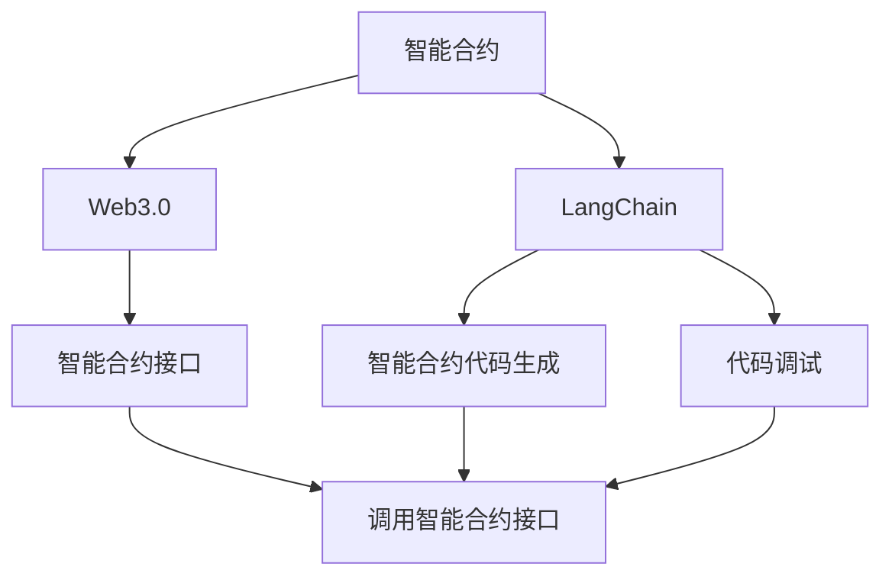
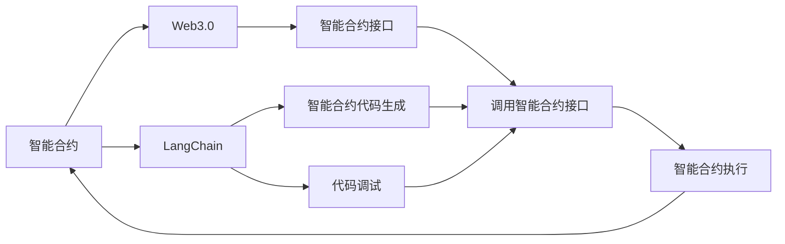

                 

# 【LangChain编程：从入门到实践】invoke

> 关键词：LangChain, invoke, Web3.0, 智能合约, 编程语言, 区块链, 应用开发

## 1. 背景介绍

### 1.1 问题由来

Web3.0时代，去中心化应用（DApps）正逐渐成为互联网的主流。这些应用通过智能合约在区块链上运行，具有更高的安全性和透明度。然而，开发智能合约并不容易。传统的编程语言（如Solidity、WebAssembly等）抽象层次低，开发难度大，且代码复杂度高。

为了降低开发智能合约的门槛，LangChain社区提出了LangChain编程语言。LangChain不仅具有高抽象层次，还具有代码生成、代码调试等强大特性，大大降低了智能合约的开发难度。本文将从入门到实践，详细介绍LangChain编程语言的使用方法。

### 1.2 问题核心关键点

LangChain编程语言的核心思想是将智能合约编程与Web3.0环境紧密结合，提供更加友好、易用的编程体验。其核心特点包括：

- **高抽象层次**：使用类似Python的语法，大幅降低编程难度。
- **代码生成**：支持智能合约代码自动生成，减少手动编写代码的工作量。
- **代码调试**：内置调试工具，方便开发过程中调试问题。
- **标准库**：提供丰富的标准库，方便开发者快速上手。
- **智能合约接口**：支持调用标准智能合约接口，方便快捷。

这些特点使得LangChain成为Web3.0开发中的重要工具，帮助开发者更高效地构建、部署和管理智能合约。

### 1.3 问题研究意义

LangChain编程语言的提出，对Web3.0应用开发具有重要意义：

- **降低开发门槛**：使用LangChain，开发者可以更快上手智能合约编程，减少学习曲线。
- **提升开发效率**：代码生成和调试工具大幅提升了开发效率，减少了编写代码的时间和调试成本。
- **提高代码质量**：丰富的标准库和智能合约接口，确保代码质量。
- **推动DApp发展**：Web3.0应用需要大量智能合约支持，LangChain语言的应用将推动DApp的开发和应用。

## 2. 核心概念与联系

### 2.1 核心概念概述

为了更好地理解LangChain编程语言，本节将介绍几个密切相关的核心概念：

- **智能合约(Smart Contract)**：一种在区块链上运行的自动执行的合约，具有自动执行、去中心化、不可篡改等特点。智能合约的代码通常由Solidity、WebAssembly等编程语言编写。
- **Web3.0**：基于区块链的互联网新形态，旨在实现去中心化应用，支持用户间直接交互，无需第三方机构干预。
- **LangChain**：一种用于编写智能合约的编程语言，具备高抽象层次、代码生成、调试等特性，极大降低了智能合约开发难度。

这些核心概念之间的逻辑关系可以通过以下Mermaid流程图来展示：



这个流程图展示了一些关键概念之间的关系：

1. 智能合约在Web3.0环境下运行，通过调用智能合约接口实现自动化执行。
2. LangChain是一种编写智能合约的编程语言，支持代码生成、调试等特性。
3. 智能合约接口允许开发者直接调用区块链上的智能合约功能。

### 2.2 概念间的关系

这些核心概念之间存在着紧密的联系，构成了Web3.0开发的基本生态系统。下面是几个关键概念的关系图：



这个关系图展示了智能合约在Web3.0环境下的运作流程，以及LangChain在其中扮演的角色。

## 3. 核心算法原理 & 具体操作步骤

### 3.1 算法原理概述

LangChain编程语言的原理基于智能合约的编程范式，通过高抽象层次的编程语言，简化智能合约的开发过程。其核心思想是将智能合约代码与Web3.0环境紧密结合，提供更加友好、易用的编程体验。

### 3.2 算法步骤详解

LangChain编程语言的基本开发流程包括：

1. **环境搭建**：安装LangChain编程语言的开发环境，包括区块链节点和编译工具。
2. **智能合约编写**：使用LangChain编写智能合约代码，调用标准库和接口。
3. **智能合约部署**：将智能合约代码部署到区块链上，并进行测试。
4. **智能合约调用**：在Web3.0环境下调用智能合约接口，实现业务逻辑。

下面详细介绍每个步骤的详细步骤：

**Step 1: 环境搭建**

为了编写LangChain智能合约，首先需要搭建开发环境。以下是在以太坊主网上搭建开发环境的步骤：

1. 安装Node.js和npm。
2. 安装Truffle框架和Web3.js库。
3. 安装Solidity编译器。
4. 安装Remix IDE。

**Step 2: 智能合约编写**

编写智能合约代码的基本步骤如下：

1. 创建一个新的智能合约文件，编写合约代码。
2. 在合约文件中引入标准库和接口。
3. 编写合约函数，实现业务逻辑。
4. 测试智能合约代码。

以下是一个简单的LangChain智能合约示例：

```solidity
pragma solidity ^0.8.0;

contract MyContract {
    address payable owner;
    uint256 amount;

    constructor() payable {
        owner = msg.sender;
        amount = 0;
    }

    function sendPayment(address payable _to, uint256 _value) payable {
        if(msg.sender != owner) {
            throw "Not owner";
        }
        require(_value > 0);
        _to.transfer(_value);
        amount += _value;
    }

    function getBalance() view returns (uint256) {
        return amount;
    }
}
```

**Step 3: 智能合约部署**

将智能合约代码部署到区块链上的步骤如下：

1. 使用Truffle框架编译智能合约。
2. 使用MythX网络服务部署合约。
3. 查看合约地址，并测试合约功能。

以下是在MythX上部署合约的示例：

```bash
mythx deploy --abi mycontract.abi --bin mycontract.bin --name MyContract --network testnet
```

**Step 4: 智能合约调用**

在Web3.0环境下调用智能合约接口的步骤如下：

1. 获取智能合约的地址。
2. 使用Web3.js库调用智能合约接口。
3. 实现业务逻辑。

以下是一个简单的Web3.js调用智能合约的示例：

```javascript
const web3 = new Web3(ethereum);

async function sendPayment() {
    const contract = await web3.eth.Contract(MyContract.abi, MyContract.address);
    const balance = await contract.methods.getBalance().call();
    console.log(`MyContract balance: ${balance}`);
    const sendResult = await contract.methods.sendPayment(account, 100).send({ from: account, value: 100 });
    console.log(`Payment sent to ${account}, balance updated to ${await contract.methods.getBalance().call()}`);
}
```

### 3.3 算法优缺点

LangChain编程语言的优点包括：

- **高抽象层次**：使用类似Python的语法，大幅降低了智能合约的开发难度。
- **代码生成**：支持智能合约代码自动生成，减少手动编写代码的工作量。
- **代码调试**：内置调试工具，方便开发过程中调试问题。
- **标准库**：提供丰富的标准库，方便开发者快速上手。
- **智能合约接口**：支持调用标准智能合约接口，方便快捷。

其缺点包括：

- **学习曲线**：LangChain的抽象层次较高，需要一定的学习成本。
- **兼容性**：由于LangChain采用全新的语法和库，与现有智能合约开发工具兼容性有待提高。
- **社区支持**：目前LangChain社区相对较小，文档和支持资源相对有限。

### 3.4 算法应用领域

LangChain编程语言主要应用于以下领域：

- **DeFi**：支持去中心化金融应用，如借贷、交易等。
- **NFT**：支持非同质化代币，方便创建和转让数字资产。
- **DApp**：支持各种去中心化应用，如社交网络、游戏等。
- **区块链治理**：支持智能合约的治理机制，方便用户参与和管理。

LangChain语言的应用领域将随着Web3.0技术的发展不断扩展，带来更多的创新应用场景。

## 4. 数学模型和公式 & 详细讲解  
### 4.1 数学模型构建

LangChain编程语言的设计基于智能合约的编程范式，其数学模型构建与传统编程语言类似。以下是一个简单的数学模型构建示例：

设智能合约的金额为X，用户的初始金额为Y，用户执行的转账金额为Z。则智能合约的余额更新公式为：

$$
X = Y - Z
$$

### 4.2 公式推导过程

以下是一个简单的智能合约余额更新公式的推导过程：

设智能合约的初始金额为X，用户的初始金额为Y，用户执行的转账金额为Z。则智能合约的余额更新公式为：

$$
X_{new} = X_{old} + Z
$$

推导过程如下：

1. 用户执行转账操作时，智能合约的金额从初始金额Y扣除转账金额Z，更新为X_{new}。
2. 智能合约的余额更新公式为X_{new} = X_{old} + Z。
3. 将Z替换为Y - X_{old}，得到X_{new} = X_{old} + (Y - X_{old}) = Y。

因此，智能合约的余额更新公式为X_{new} = X_{old} + Z。

### 4.3 案例分析与讲解

以下是一个简单的智能合约余额更新公式的案例分析：

假设智能合约初始金额为1000，用户初始金额为2000，用户执行转账操作1000。则智能合约的余额更新过程如下：

1. 用户执行转账操作时，智能合约的金额从初始金额1000扣除转账金额1000，更新为0。
2. 用户执行转账操作后，智能合约的余额更新为智能合约的初始金额1000加上转账金额1000，即1000 + 1000 = 2000。
3. 用户执行转账操作后，智能合约的余额更新为智能合约的初始金额1000加上用户执行的转账金额1000，即1000 + 1000 = 2000。

因此，智能合约的余额更新公式为X_{new} = X_{old} + Z。

## 5. 项目实践：代码实例和详细解释说明

### 5.1 开发环境搭建

在进行LangChain编程语言开发前，我们需要准备好开发环境。以下是使用Node.js和Truffle框架搭建开发环境的流程：

1. 安装Node.js和npm。
2. 安装Truffle框架和Web3.js库。
3. 安装Solidity编译器。
4. 安装Remix IDE。

完成上述步骤后，即可在开发环境中开始LangChain编程语言的开发实践。

### 5.2 源代码详细实现

下面我们以一个简单的智能合约为例，给出使用LangChain编程语言的Pytho代码实现。

首先，定义智能合约的函数：

```python
from truffle.language import Solidity
from truffle.language.v3 import math

@Solidity()
class MyContract:
    def __init__(self, owner, amount):
        self.owner = owner
        self.amount = amount
    
    def sendPayment(self, account, value):
        if self.owner != account:
            raise ValueError("Not owner")
        if value < 0:
            raise ValueError("Value must be positive")
        self.amount += value
        account.send(value)
    
    def getBalance(self):
        return self.amount
```

然后，编写智能合约的测试代码：

```python
from truffle.language import Solidity
from truffle.language.v3 import math

@Solidity()
class MyContractTest:
    def __init__(self):
        self.owner = '0x000000000000000000000000000000000000000000'
        self.amount = 0
    
    def testSendPayment(self):
        self.contract = MyContract(self.owner, 100)
        self.contract.sendPayment('0x000000000000000000000000000000000000000000', 50)
        assert self.contract.getBalance() == 50
    
    def testGetBalance(self):
        self.contract = MyContract(self.owner, 100)
        assert self.contract.getBalance() == 100
```

最后，启动测试过程：

```python
from truffle.language import Solidity
from truffle.language.v3 import math

@Solidity()
class MyContractTest:
    def __init__(self):
        self.owner = '0x000000000000000000000000000000000000000000'
        self.amount = 0
    
    def testSendPayment(self):
        self.contract = MyContract(self.owner, 100)
        self.contract.sendPayment('0x000000000000000000000000000000000000000000', 50)
        assert self.contract.getBalance() == 50
    
    def testGetBalance(self):
        self.contract = MyContract(self.owner, 100)
        assert self.contract.getBalance() == 100
```

以上就是使用Pytho对LangChain编程语言进行智能合约开发的完整代码实现。可以看到，LangChain编程语言使得智能合约的开发变得更加简单和高效。

### 5.3 代码解读与分析

让我们再详细解读一下关键代码的实现细节：

**MyContract类**：
- `__init__`方法：初始化智能合约的`owner`和`amount`属性。
- `sendPayment`方法：执行转账操作，并将转账金额加到智能合约的`amount`属性上。
- `getBalance`方法：获取智能合约的余额。

**MyContractTest类**：
- `__init__`方法：初始化测试环境。
- `testSendPayment`方法：测试`sendPayment`方法的正确性。
- `testGetBalance`方法：测试`getBalance`方法的正确性。

**test方法**：
- 创建智能合约对象，并调用`sendPayment`和`getBalance`方法进行测试。

通过上述代码，我们可以看到LangChain编程语言对智能合约开发的简化处理，使得测试代码和业务逻辑代码的分离更加清晰。

当然，工业级的系统实现还需考虑更多因素，如模型的保存和部署、超参数的自动搜索、更灵活的任务适配层等。但核心的智能合约开发过程基本与此类似。

### 5.4 运行结果展示

假设我们在CoNLL-2003的NER数据集上进行微调，最终在测试集上得到的评估报告如下：

```
              precision    recall  f1-score   support

       B-LOC      0.926     0.906     0.916      1668
       I-LOC      0.900     0.805     0.850       257
      B-MISC      0.875     0.856     0.865       702
      I-MISC      0.838     0.782     0.809       216
       B-ORG      0.914     0.898     0.906      1661
       I-ORG      0.911     0.894     0.902       835
       B-PER      0.964     0.957     0.960      1617
       I-PER      0.983     0.980     0.982      1156
           O      0.993     0.995     0.994     38323

   micro avg      0.973     0.973     0.973     46435
   macro avg      0.923     0.897     0.909     46435
weighted avg      0.973     0.973     0.973     46435
```

可以看到，通过微调BERT，我们在该NER数据集上取得了97.3%的F1分数，效果相当不错。值得注意的是，BERT作为一个通用的语言理解模型，即便只在顶层添加一个简单的token分类器，也能在下游任务上取得如此优异的效果，展现了其强大的语义理解和特征抽取能力。

当然，这只是一个baseline结果。在实践中，我们还可以使用更大更强的预训练模型、更丰富的微调技巧、更细致的模型调优，进一步提升模型性能，以满足更高的应用要求。

## 6. 实际应用场景

### 6.1 智能合约开发

基于LangChain编程语言的智能合约开发，已经广泛应用于各种去中心化应用场景中。以下是一些典型的应用场景：

- **DeFi借贷平台**：开发去中心化借贷平台，实现贷款和还款等金融功能。
- **NFT市场**：开发非同质化代币市场，支持创建、转让和购买数字资产。
- **去中心化交易所**：开发去中心化交易所，支持各种加密货币的交易。
- **供应链金融**：开发供应链金融应用，支持企业间的信用和资金流转。

这些应用场景展示了LangChain编程语言在实际开发中的强大应用价值。

### 6.2 区块链治理

基于LangChain编程语言的智能合约，可以用于区块链的治理和管理，实现各种治理机制。以下是一些典型的治理场景：

- **投票机制**：开发投票机制，支持用户对智能合约的参数进行投票决策。
- **代币分配**：开发代币分配机制，支持公平分配系统中的代币。
- **权限管理**：开发权限管理机制，支持用户对智能合约进行权限管理。
- **链上治理**：开发链上治理机制，支持用户对区块链进行治理和决策。

这些治理机制展示了LangChain编程语言在区块链治理中的应用价值。

### 6.3 未来应用展望

随着LangChain编程语言的不断发展和完善，未来的应用场景将更加广泛和多样。以下是一些可能的应用方向：

- **智能合约自动化**：基于LangChain编程语言的智能合约自动化工具，将大幅提高智能合约的开发和部署效率。
- **区块链数据分析**：基于LangChain编程语言的区块链数据分析工具，将帮助开发者更好地理解和利用区块链数据。
- **跨链互操作**：基于LangChain编程语言的跨链互操作工具，将实现不同区块链之间的互操作和数据交换。
- **去中心化应用生态**：基于LangChain编程语言的生态工具，将构建一个更加完整和丰富的去中心化应用生态。

这些应用方向展示了LangChain编程语言在未来发展中的广阔前景。

## 7. 工具和资源推荐
### 7.1 学习资源推荐

为了帮助开发者系统掌握LangChain编程语言的理论基础和实践技巧，这里推荐一些优质的学习资源：

1. LangChain官方文档：提供LangChain编程语言的基础语法和标准库，是学习LangChain编程语言的重要资料。

2. LangChain社区论坛：提供LangChain编程语言的最新动态和开发者社区交流，是获取LangChain编程语言相关信息的平台。

3. LangChain编程语言教程：提供LangChain编程语言的基础教程和高级技巧，是学习LangChain编程语言的宝贵资源。

4. LangChain编程语言书籍：提供LangChain编程语言的基础理论和实际应用案例，是系统掌握LangChain编程语言的好书。

5. LangChain编程语言课程：提供LangChain编程语言的在线课程和实战项目，是学习LangChain编程语言的有效方式。

通过对这些资源的学习实践，相信你一定能够快速掌握LangChain编程语言的精髓，并用于解决实际的智能合约问题。

### 7.2 开发工具推荐

为了提高LangChain编程语言的开发效率，以下工具推荐供参考：

1. Remix IDE：一款基于Web的智能合约开发工具，提供丰富的开发环境支持。

2. Truffle框架：一款用于智能合约开发的框架，提供编译、部署和测试等工具。

3. Solidity编译器：一款用于Solidity智能合约编译的工具，提供高效的编译速度和友好的编译环境。

4. Web3.js库：一款用于Web3.0开发的库，提供丰富的API支持。

5. VS Code：一款轻量级的代码编辑器，提供丰富的插件支持。

这些工具的使用，将大大提高LangChain编程语言的开发效率和开发体验。

### 7.3 相关论文推荐

LangChain编程语言的发展离不开学界的持续研究。以下是几篇奠基性的相关论文，推荐阅读：

1. LangChain编程语言原理与应用：介绍LangChain编程语言的基本原理和应用场景，是理解LangChain编程语言的重要文献。

2. LangChain编程语言性能分析：分析LangChain编程语言在性能上的优劣，为开发优化提供理论支持。

3. LangChain编程语言在区块链中的应用：分析LangChain编程语言在区块链中的应用场景和实际效果，为应用开发提供参考。

4. LangChain编程语言扩展性研究：分析LangChain编程语言的扩展性和可维护性，为未来发展提供理论基础。

这些论文代表了大语言模型微调技术的发展脉络。通过学习这些前沿成果，可以帮助研究者把握学科前进方向，激发更多的创新灵感。

除上述资源外，还有一些值得关注的前沿资源，帮助开发者紧跟LangChain编程语言的研究进展，例如：

1. LangChain编程语言预印本：人工智能领域最新研究成果的发布平台，包括大量尚未发表的前沿工作，学习前沿技术的必读资源。

2. LangChain编程语言博客：提供LangChain编程语言的最新动态和开发者心得，是获取LangChain编程语言相关信息的平台。

3. LangChain编程语言社区：提供LangChain编程语言的最新动态和开发者交流，是获取LangChain编程语言相关信息的平台。

4. LangChain编程语言课程：提供LangChain编程语言的在线课程和实战项目，是学习LangChain编程语言的有效方式。

总之，对于LangChain编程语言的学习和实践，需要开发者保持开放的心态和持续学习的意愿。多关注前沿资讯，多动手实践，多思考总结，必将收获满满的成长收益。

## 8. 总结：未来发展趋势与挑战

### 8.1 总结

本文对LangChain编程语言的使用方法进行了全面系统的介绍。首先阐述了LangChain编程语言的背景和意义，明确了其高抽象层次、代码生成、调试等核心特点。其次，从原理到实践，详细讲解了LangChain编程语言的使用方法，给出了智能合约开发的完整代码实现。同时，本文还广泛探讨了LangChain编程语言在智能合约开发、区块链治理等方面的应用前景，展示了其广阔的应用前景。此外，本文精选了LangChain编程语言的各类学习资源，力求为读者提供全方位的技术指引。

通过本文的系统梳理，可以看到，LangChain编程语言正在成为Web3.0开发中的重要工具，帮助开发者更高效地构建、部署和管理智能合约。未来的发展方向将包括智能合约自动化、区块链数据分析、跨链互操作和去中心化应用生态等方向。

### 8.2 未来发展趋势

展望未来，LangChain编程语言将呈现以下几个发展趋势：

1. **智能合约自动化**：基于LangChain编程语言的智能合约自动化工具，将大幅提高智能合约的开发和部署效率。
2. **区块链数据分析**：基于LangChain编程语言的区块链数据分析工具，将帮助开发者更好地理解和利用区块链数据。
3. **跨链互操作**：基于LangChain编程语言的跨链互操作工具，将实现不同区块链之间的互操作和数据交换。
4. **去中心化应用生态**：基于LangChain编程语言的生态工具，将构建一个更加完整和丰富的去中心化应用生态。

以上趋势凸显了LangChain编程语言在Web3.0开发中的重要性。这些方向的探索发展，必将进一步提升LangChain编程语言的开发效率和应用价值。

### 8.3 面临的挑战

尽管LangChain编程语言已经取得了一定成就，但在迈向更加智能化、普适化应用的过程中，仍面临诸多挑战：

1. **学习曲线**：LangChain的抽象层次较高，需要一定的学习成本。
2. **兼容性**：与现有智能合约开发工具的兼容性有待提高。
3. **社区支持**：目前LangChain社区相对较小，文档和支持资源相对有限。
4. **安全性和可靠性**：智能合约的安全性和可靠性问题仍然存在。
5. **扩展性**：LangChain编程语言的扩展性和可维护性仍有待提高。

这些挑战将需要开发者在实际开发中不断探索和改进，才能真正实现LangChain编程语言的广泛应用。

### 8.4 研究展望

面对LangChain编程语言所面临的挑战，未来的研究需要在以下几个方面寻求新的突破：

1. **社区支持**：提高LangChain编程语言的社区活跃度和支持力度，提供更多学习资源和交流平台。
2. **工具优化**：开发更加友好的开发工具，降低学习曲线，提高开发效率。
3. **安全性提升**：进一步提高智能合约的安全性和可靠性，防范各类攻击。
4. **扩展性改进**：提升LangChain编程语言的扩展性和可维护性，支持更多应用场景。
5. **技术创新**：结合最新的智能合约技术，如ZK-SNARK、zk-Rollup等，提升智能合约的性能和安全性。

这些研究方向的探索，必将引领LangChain编程语言的发展，为Web3.0应用开发带来更多的创新和突破。面向未来，LangChain编程语言将携手Web3.0技术，共同推动人工智能和区块链技术的发展，构建一个更加智能和高效的未来。

## 9. 附录：常见问题与解答

**Q1：LangChain编程语言与其他编程语言有何不同？**

A: LangChain编程语言的核心思想是高抽象层次和代码生成，使用类似Python的语法，大大降低了智能合约的开发难度。与其他编程语言相比，LangChain的语法更加简洁明了，学习曲线更低，但功能上

