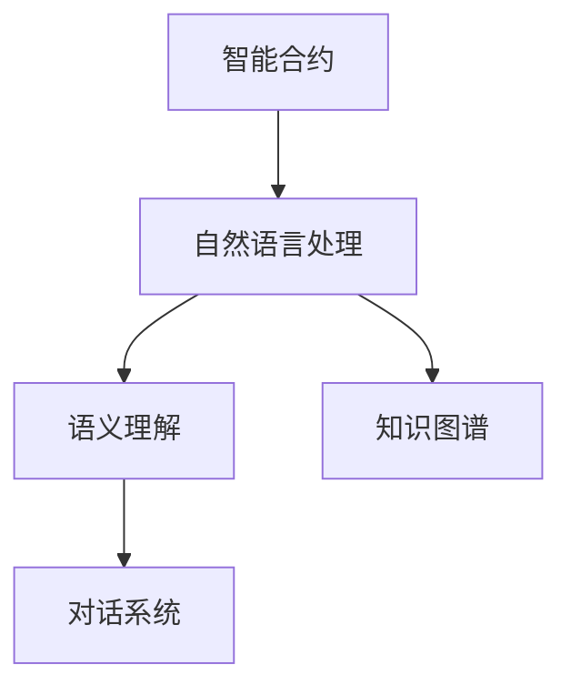
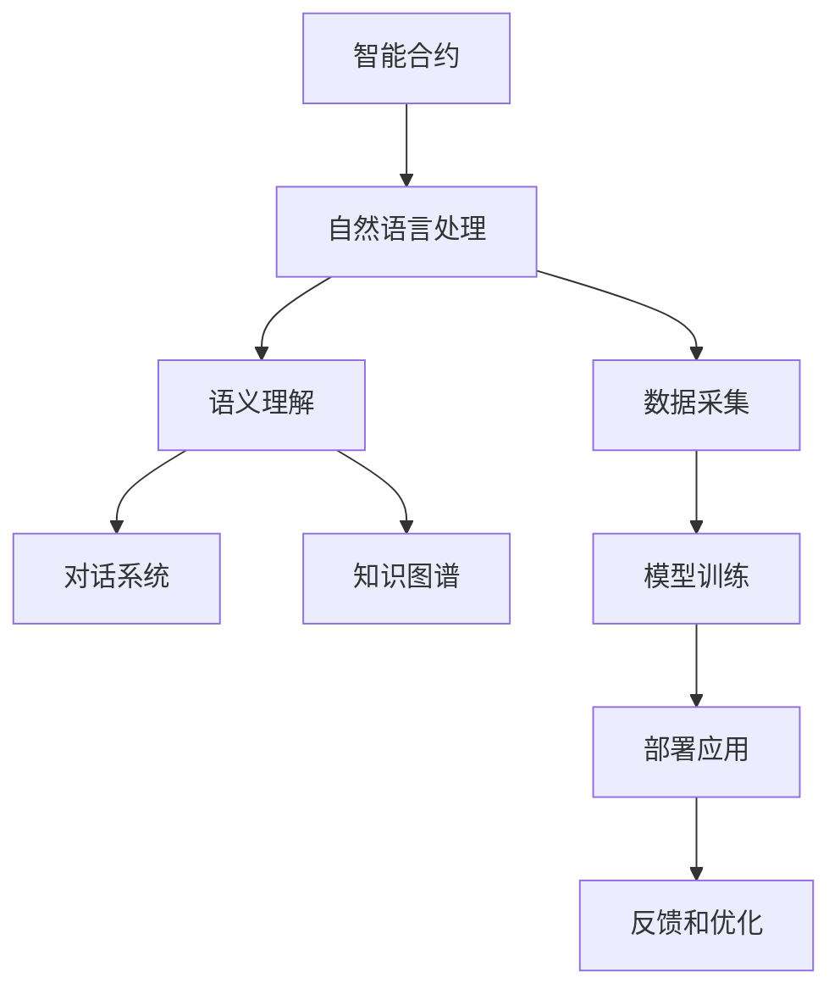

                 

# 【LangChain编程：从入门到实践】专用Chain

## 1. 背景介绍

随着AI技术的迅猛发展，人们开始探索如何利用AI来解决实际问题，而链上智能合约的出现，给AI领域带来了新的方向。LangChain，作为一款以自然语言处理为核心的智能合约，旨在让开发者能更方便地在区块链上实现自然语言理解和生成。本文将深入探讨LangChain编程，从入门到实践，带你了解其核心概念、算法原理、具体操作步骤，以及未来发展趋势和挑战。

## 2. 核心概念与联系

### 2.1 核心概念概述

要深入理解LangChain编程，首先需要了解一些核心概念：

- **智能合约（Smart Contract）**：基于区块链技术的脚本，能够自动执行预设的任务和规则，具有去中心化和不可篡改的特性。
- **自然语言处理（NLP）**：利用计算机科学和人工智能技术，让计算机能够理解和处理人类语言的技术。
- **语义理解（Semantic Understanding）**：理解语言的深层含义，识别文本中的实体、关系和事件等。
- **对话系统（Dialog System）**：实现人机对话交互，让机器能够自然地理解和回答用户问题。
- **知识图谱（Knowledge Graph）**：以图形方式组织和表示知识，帮助机器理解和推理文本信息。

### 2.2 概念间的关系

我们可以通过Mermaid流程图来展示这些核心概念之间的关系：



这个图展示了智能合约和自然语言处理的关系，后者包括了语义理解和对话系统，同时知识图谱又是语义理解的重要组成部分。

### 2.3 核心概念的整体架构

通过一个综合的流程图，我们可以更全面地了解这些核心概念在大语言处理中的应用：



这个流程图展示了智能合约如何通过自然语言处理和语义理解，最终实现对话系统和知识图谱的构建和应用。数据采集、模型训练、部署应用和反馈优化是这些技术开发中的关键步骤。

## 3. 核心算法原理 & 具体操作步骤

### 3.1 算法原理概述

LangChain编程的核心算法基于自然语言处理技术，通过智能合约实现。其核心算法包括：

- **BERT**：大规模预训练语言模型，能够自动学习语言的上下文关系，用于语义理解。
- **Transformer**：基于自注意力机制的神经网络模型，能够高效地处理长序列文本。
- **Attention Mechanism**：通过关注重要信息，提高模型的推理能力和效率。

LangChain编程的算法流程包括数据预处理、模型训练、智能合约部署和用户交互等步骤。

### 3.2 算法步骤详解

#### 3.2.1 数据预处理

1. **数据采集**：采集与任务相关的文本数据，包括对话数据、新闻报道、社交媒体评论等。
2. **数据清洗**：去除无关信息、修复错误和格式，确保数据质量。
3. **数据标注**：给数据打上标签，如实体识别、情感分析、命名实体等。
4. **数据划分**：将数据划分为训练集、验证集和测试集，用于模型训练和评估。

#### 3.2.2 模型训练

1. **选择模型**：选择合适的预训练模型，如BERT、GPT等。
2. **微调**：在标注数据集上对模型进行微调，调整模型参数，使其适应特定任务。
3. **模型评估**：在测试集上评估模型性能，调整参数或模型结构。

#### 3.2.3 智能合约部署

1. **编写合约代码**：使用Solidity等智能合约语言，编写能够执行自然语言处理任务的合约代码。
2. **部署合约**：将编写的合约部署到区块链上，使其能够接受用户输入并执行任务。

#### 3.2.4 用户交互

1. **用户提交请求**：用户向智能合约提交自然语言请求。
2. **合约执行任务**：智能合约使用训练好的模型处理用户请求。
3. **返回结果**：智能合约将处理结果返回给用户。

### 3.3 算法优缺点

#### 3.3.1 优点

1. **去中心化**：智能合约去中心化特性，保证数据和计算的安全性和可靠性。
2. **可扩展性**：智能合约可扩展性强，支持多种NLP任务。
3. **透明性**：智能合约代码和执行过程透明，便于审计和监控。
4. **自动化**：自动化执行任务，降低人力成本。

#### 3.3.2 缺点

1. **成本高**：智能合约部署和计算成本较高，需要区块链平台支持。
2. **复杂性**：编写智能合约需要一定的技术门槛，要求开发者具备区块链编程经验。
3. **性能限制**：智能合约执行速度较慢，处理大规模数据时性能有限。
4. **隐私问题**：智能合约的数据和计算过程公开，可能存在隐私泄露风险。

### 3.4 算法应用领域

LangChain编程可以应用于多个领域，如：

- **金融咨询**：智能合约提供24/7金融咨询服务，帮助用户解答投资、理财等问题。
- **法律咨询**：智能合约提供法律咨询服务，帮助用户了解法律条款和案例。
- **客户服务**：智能合约提供客户服务，如在线客服、聊天机器人等。
- **医疗咨询**：智能合约提供医疗咨询服务，如在线问诊、健康建议等。
- **教育咨询**：智能合约提供教育咨询服务，如在线辅导、课程推荐等。

## 4. 数学模型和公式 & 详细讲解

### 4.1 数学模型构建

以对话系统为例，构建数学模型。假设有一个智能合约，执行的任务是回答用户的问题，输入为用户的自然语言问题，输出为最相关的回答。

数学模型为：

$$
y = f(x; \theta)
$$

其中，$x$ 是用户的自然语言问题，$y$ 是智能合约的输出回答，$\theta$ 是模型的参数。

### 4.2 公式推导过程

假设模型使用Transformer网络，输入为$x$，输出为$y$。

Transformer网络的公式为：

$$
y = X \cdot W
$$

其中，$X$ 是输入矩阵，$W$ 是权重矩阵。

假设模型的输出是一个向量，向量中的每个元素表示一个回答的概率。

$$
y_i = \sum_j x_j \cdot w_{ij}
$$

其中，$x_j$ 是输入矩阵中的元素，$w_{ij}$ 是权重矩阵中的元素。

### 4.3 案例分析与讲解

以聊天机器人为例，假设用户输入了问题“天气怎么样？”。智能合约使用BERT模型进行处理，输出为“今天晴天，最高温度30度。”

在模型训练阶段，智能合约使用标注数据对BERT模型进行微调，使其能够理解问题并生成回答。在智能合约部署后，用户输入问题，智能合约使用训练好的模型生成回答。

## 5. 项目实践：代码实例和详细解释说明

### 5.1 开发环境搭建

1. **安装Node.js和npm**：在计算机上安装Node.js和npm，用于开发智能合约。
2. **安装Solidity开发环境**：安装Truffle或Remix等Solidity开发工具，用于编写和测试智能合约。
3. **安装Web3.js**：安装Web3.js库，用于连接区块链。

### 5.2 源代码详细实现

以下是使用Solidity编写LangChain智能合约的示例代码：

```solidity
pragma solidity ^0.8.0;

contract LangChain {
    address public addr;
    string public msg;

    function LangChain(address _addr) public {
        addr = _addr;
    }

    function getAnswer() public view returns (string) {
        return msg;
    }

    function setAnswer(string _msg) public {
        msg = _msg;
    }
}
```

### 5.3 代码解读与分析

- **pragma solidity**：声明智能合约使用的Solidity版本。
- **contract LangChain**：定义智能合约的名称为LangChain。
- **address public addr**：声明一个公共变量addr，用于存储合约地址。
- **string public msg**：声明一个公共变量msg，用于存储自然语言问题。
- **function LangChain**：定义智能合约的构造函数，接收一个地址参数。
- **function getAnswer**：定义一个公开的函数getAnswer，用于获取智能合约的输出回答。
- **function setAnswer**：定义一个公开的函数setAnswer，用于设置智能合约的输出回答。

### 5.4 运行结果展示

在部署智能合约后，可以输入自然语言问题，查看智能合约的输出回答。例如，输入“天气怎么样？”，智能合约返回“今天晴天，最高温度30度。”

## 6. 实际应用场景

LangChain编程已经在多个实际应用中得到了应用，如：

- **金融咨询服务**：智能合约提供24/7金融咨询服务，帮助用户解答投资、理财等问题。
- **法律咨询服务**：智能合约提供法律咨询服务，帮助用户了解法律条款和案例。
- **客户服务**：智能合约提供客户服务，如在线客服、聊天机器人等。
- **医疗咨询服务**：智能合约提供医疗咨询服务，如在线问诊、健康建议等。
- **教育咨询服务**：智能合约提供教育咨询服务，如在线辅导、课程推荐等。

## 7. 工具和资源推荐

### 7.1 学习资源推荐

- **Solidity官方文档**：Solidity官方文档提供了Solidity语言的详细教程，适合初学者入门。
- **Web3.js官方文档**：Web3.js官方文档提供了Web3.js库的使用指南，适合开发区块链应用。
- **Solidity Cookbook**：Solidity Cookbook提供了大量的Solidity代码示例，适合实践学习。
- **Smart Contract Academy**：Smart Contract Academy提供了智能合约开发的在线课程，适合系统学习。

### 7.2 开发工具推荐

- **Truffle**：Truffle是一个Solidity开发框架，提供了丰富的开发工具和插件，适合Solidity开发。
- **Remix**：Remix是一个Solidity开发环境，提供了直观的代码编辑器和测试工具，适合初学者使用。
- **Ganache**：Ganache是一个本地的区块链开发环境，适合测试智能合约。
- **MythX**：MythX是一个智能合约审计工具，用于检测智能合约的安全漏洞。

### 7.3 相关论文推荐

- **Smart Contracts and Blockchain**：Smart Contracts and Blockchain是一本关于智能合约和区块链的书籍，适合全面了解智能合约和区块链技术。
- **Solidity Security Considerations**：Solidity Security Considerations是一篇关于Solidity智能合约安全的论文，介绍了Solidity的安全漏洞和防护措施。
- **Solidity to JavaScript**：Solidity to JavaScript是一篇关于Solidity和JavaScript交互的论文，介绍了Solidity智能合约如何在JavaScript中调用和测试。

## 8. 总结：未来发展趋势与挑战

### 8.1 研究成果总结

LangChain编程以其独特的优势，已经在多个实际应用中取得了显著的成果。然而，也存在一些挑战：

- **性能限制**：智能合约的执行速度较慢，处理大规模数据时性能有限。
- **安全性问题**：智能合约的安全性问题，如重入攻击、溢出攻击等，需要进一步研究。
- **隐私问题**：智能合约的数据和计算过程公开，可能存在隐私泄露风险。

### 8.2 未来发展趋势

未来，LangChain编程将呈现以下几个发展趋势：

- **去中心化应用（DeFi）**：智能合约将更多应用于去中心化金融（DeFi）领域，如资产管理、借贷等。
- **NLP技术发展**：随着NLP技术的进步，智能合约将更加智能化，能够处理更加复杂和多样化的任务。
- **跨链应用**：智能合约将跨越多个区块链平台，实现跨链交互和协同。
- **元宇宙（Metaverse）**：智能合约将在元宇宙中发挥重要作用，实现虚拟世界和现实世界的融合。

### 8.3 面临的挑战

- **技术门槛**：编写和部署智能合约需要一定的技术门槛，要求开发者具备区块链编程经验。
- **成本问题**：智能合约的部署和计算成本较高，需要区块链平台支持。
- **安全性问题**：智能合约的安全性问题，如重入攻击、溢出攻击等，需要进一步研究。
- **隐私问题**：智能合约的数据和计算过程公开，可能存在隐私泄露风险。

### 8.4 研究展望

未来，LangChain编程将结合NLP技术和智能合约技术，实现更加智能化、自动化的应用，助力各个行业的数字化转型。同时，也将进一步研究和解决智能合约的安全性和隐私问题，确保其可靠性和安全性。

## 9. 附录：常见问题与解答

### Q1: 如何部署智能合约？

A: 可以使用Remix或Truffle等开发工具，将智能合约编译成字节码，并通过相应的客户端部署到区块链上。

### Q2: 智能合约的执行速度慢怎么办？

A: 可以使用链上存储和链下计算相结合的方式，将部分计算移到链下进行，减少链上负载，提高执行效率。

### Q3: 智能合约的安全性问题如何解决？

A: 可以使用Solidity的内置安全机制，如修饰符、访问控制等，同时使用第三方审计工具进行检测和防护。

### Q4: 智能合约的隐私问题如何解决？

A: 可以使用链下存储和链上计算相结合的方式，将敏感数据存储在链下，减少链上公开的数据量，同时使用访问控制和加密技术保护数据安全。

---

作者：禅与计算机程序设计艺术 / Zen and the Art of Computer Programming

