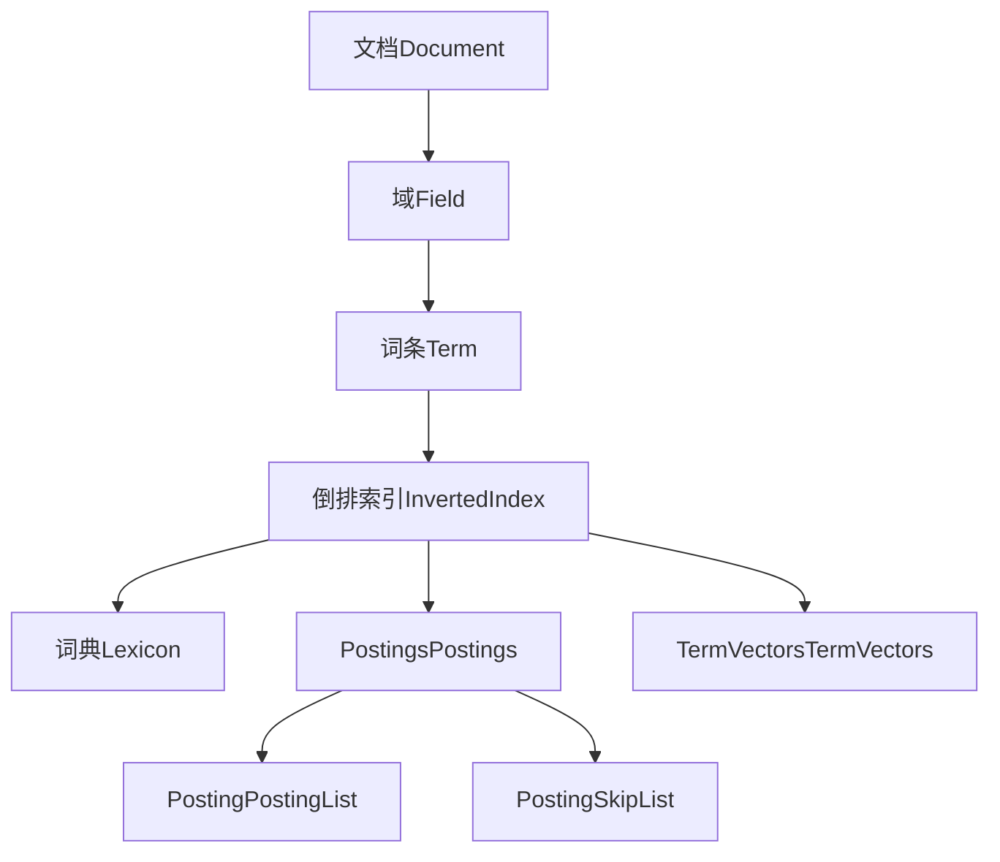
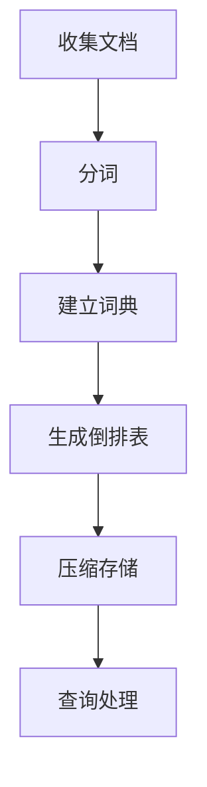

# Lucene索引原理与代码实例讲解

## 1. 背景介绍

### 1.1 问题的由来

在当今信息时代,海量的非结构化数据如网页、文档、邮件等不断产生和累积。如何高效地存储、检索和管理这些数据,成为了一个迫切需要解决的问题。传统的数据库系统在处理结构化数据方面表现出色,但在处理非结构化数据时却显得力不从心。这就催生了一种新型的信息检索技术 —— 全文检索。

全文检索(Full-Text Search)是一种在文本数据集合中查找指定关键词或词组的技术,它能够快速地从海量非结构化数据中找到相关内容。Lucene 就是一个优秀的开源全文检索引擎库,被广泛应用于各种需要添加搜索功能的应用程序中。

### 1.2 研究现状

Lucene 最初由 Doug Cutting 于 1997 年开发,后加入到 Apache 软件基金会,成为其顶级项目之一。经过多年的发展,Lucene 已经成为事实上的全文检索领域标准。它提供了高性能、可扩展的索引和搜索功能,支持多种语言、多种平台,并且具有健壮的可靠性和容错性。

Lucene 的核心是一个倒排索引结构,用于存储和快速查找文档中的词条。它采用多项优化技术,如词条向量、词条位置向量、词条前缀等,以提高索引和搜索的效率。此外,Lucene 还支持各种查询语法、相关性打分、高亮显示、分词器等功能,为全文检索提供了强大的支持。

### 1.3 研究意义

全文检索技术在当代信息时代扮演着越来越重要的角色。掌握 Lucene 的索引原理和实现机制,对于开发人员来说是非常有价值的。本文将深入探讨 Lucene 的内部工作原理,剖析其核心算法和数学模型,并通过代码实例加以说明,旨在帮助读者全面理解和掌握这一领域的核心知识。

### 1.4 本文结构

本文将从以下几个方面全面介绍 Lucene 索引的原理和实现:

1. 核心概念与联系
2. 核心算法原理及具体操作步骤
3. 数学模型和公式详细讲解与案例分析
4. 项目实践:代码实例和详细解释说明
5. 实际应用场景
6. 工具和资源推荐
7. 总结:未来发展趋势与挑战
8. 附录:常见问题与解答

## 2. 核心概念与联系

在深入探讨 Lucene 索引的细节之前,我们需要先了解一些核心概念及它们之间的联系。



1. **文档(Document)**: 被索引和搜索的基本单元,可以是网页、文本文件、PDF 等任何格式的文本内容。

2. **域(Field)**: 文档中的一个逻辑数据块,如标题、正文、作者等。每个域都有自己的分词器、存储方式等属性。

3. **词条(Term)**: 经过分词和规范化处理后的最小单位,通常是一个单词。

4. **倒排索引(Inverted Index)**: Lucene 的核心索引结构,由词典和倒排表两部分组成。

5. **词典(Lexicon)**: 存储所有唯一词条的列表,记录了每个词条的信息,如文档频率等。

6. **倒排表(Postings)**: 记录了每个词条在文档中出现的位置信息,由一系列的倒排列表组成。

7. **倒排列表(Posting List)**: 针对某个词条,记录了它在所有文档中出现的位置和其他信息。

8. **跳表(Skip List)**: 一种辅助数据结构,用于加快倒排列表的遍历速度。

9. **词条向量(Term Vectors)**: 记录了每个词条在文档中的位置、偏移量等详细信息,用于增强搜索质量。

这些概念相互关联、相互作用,共同构建了 Lucene 的索引和搜索机制。接下来我们将深入探讨其核心算法原理。

## 3. 核心算法原理 & 具体操作步骤

### 3.1 算法原理概述

Lucene 索引的核心算法是**倒排索引**,它将文档集合中的词条与其出现的文档位置相关联,从而实现高效的全文检索。倒排索引算法可以概括为以下几个主要步骤:



1. **收集文档**: 从各种数据源获取待索引的文档。

2. **分词**: 将文档内容分割成一系列词条,并进行规范化处理。

3. **建立词典**: 统计所有唯一词条,建立词典,记录词条信息。

4. **生成倒排表**: 为每个词条构建倒排列表,记录其在文档中的位置信息。

5. **压缩存储**: 对倒排索引进行压缩,以节省存储空间。

6. **查询处理**: 根据用户查询,从倒排索引中检索相关文档。

接下来,我们将详细解释每个步骤的具体操作。

### 3.2 算法步骤详解

#### 3.2.1 收集文档

Lucene 可以从多种数据源收集文档,如文件系统、数据库、网络爬虫等。文档可以是任何格式,如 TXT、PDF、HTML、XML 等。Lucene 使用专门的文档读取器(DocumentReader)来解析不同格式的文档。

#### 3.2.2 分词

分词是将文档内容拆分成一系列词条的过程。Lucene 使用分词器(Analyzer)来执行这一任务。分词器由一系列 TokenStream 组成,每个 TokenStream 执行特定的操作,如小写转换、去除标点符号、词干提取等。

```java
Analyzer analyzer = new StandardAnalyzer();
TokenStream tokenStream = analyzer.tokenStream("myfield", new StringReader(text));
```

#### 3.2.3 建立词典

词典是一个有序列表,存储了所有唯一的词条及其元数据,如文档频率、位置信息等。Lucene 使用 FST(Finite State Transducer,有限状态转换器)来高效地存储和查找词条。

```java
TermsEnum termsEnum = indexReader.terms("myfield");
BytesRef bytesRef = null;
while((bytesRef = termsEnum.next()) != null) {
    // 处理词条
}
```

#### 3.2.4 生成倒排表

倒排表是 Lucene 索引的核心部分。它由一系列倒排列表组成,每个倒排列表对应一个词条,记录了该词条在所有文档中的位置信息。

```java
PostingsEnum postingsEnum = termsEnum.postings(null, null);
while (postingsEnum.nextDoc() != DocIdSetIterator.NO_MORE_DOCS) {
    // 处理倒排列表
}
```

#### 3.2.5 压缩存储

为了节省存储空间,Lucene 采用多种压缩技术对倒排索引进行压缩。常用的压缩方式包括:

- **块压缩**: 将倒排列表分成多个块,每个块独立压缩。
- **字节编码**: 使用高效的字节编码方式存储文档 ID 和位置信息。
- **前缀编码**: 利用词条的公共前缀来减小存储开销。

#### 3.2.6 查询处理

当用户发出查询时,Lucene 会从倒排索引中检索相关文档。查询处理的主要步骤包括:

1. **查询解析**: 将查询语句转换为查询树。
2. **权重计算**: 根据查询树计算每个查询子句的权重。
3. **遍历倒排表**: 从倒排表中获取与查询相关的文档 ID。
4. **相关性打分**: 计算每个文档与查询的相关性得分。
5. **结果排序**: 根据得分对结果进行排序。

### 3.3 算法优缺点

#### 优点

1. **高效检索**: 倒排索引结构使得全文检索效率非常高。
2. **灵活查询**: 支持多种查询语法,如布尔查询、短语查询等。
3. **可扩展性强**: 可以通过分布式集群来扩展索引和搜索能力。
4. **容错性好**: 索引结构具有良好的容错性,可以防止数据损坏。

#### 缺点

1. **索引构建耗时**: 对大规模文档集合构建索引需要消耗大量时间和资源。
2. **内存占用较高**: 索引和搜索过程中需要占用较多内存。
3. **实时性略差**: 索引更新存在一定的延迟,不适合实时搜索场景。
4. **复杂性较高**: 算法实现和优化需要较深的专业知识。

### 3.4 算法应用领域

Lucene 的倒排索引算法可以广泛应用于各种需要全文检索功能的场景,包括但不限于:

- 网站搜索引擎
- 企业知识库
- 电子邮件搜索
- 日志分析
- 代码搜索
- 电子商务搜索
- 社交媒体搜索
- ...

## 4. 数学模型和公式 & 详细讲解 & 举例说明

在 Lucene 的索引和搜索过程中,涉及了多种数学模型和公式,用于计算相关性得分、优化查询性能等。接下来,我们将详细讲解其中的一些核心模型和公式。

### 4.1 数学模型构建

#### 4.1.1 布尔模型

布尔模型是最基本的检索模型,它将文档视为一个词条集合,查询也是一个词条集合。文档与查询的相关性由它们的词条集合的交集决定。

设 $Q$ 为查询词条集合, $D$ 为文档词条集合,则:

$$
\begin{align*}
\text{相关性}(Q, D) &= \begin{cases}
1, & \text{if } Q \cap D \neq \emptyset\
0, & \text{if } Q \cap D = \emptyset
\end{cases}\
&= \begin{cases}
1, & \text{文档包含查询中的任意一个词条}\
0, & \text{文档不包含查询中的任何词条}
\end{cases}
\end{align*}
$$

布尔模型虽然简单直观,但存在一些缺陷,如无法体现词条的重要性、无法排序结果等。因此,Lucene 采用了更加复杂的评分模型。

#### 4.1.2 向量空间模型

向量空间模型(Vector Space Model, VSM)是 Lucene 中使用的主要相关性评分模型。它将文档和查询都表示为向量,通过计算它们之间的相似度来确定相关性。

设 $\vec{q}$ 为查询向量, $\vec{d}$ 为文档向量,则它们的相似度可以用余弦相似度公式计算:

$$
\text{sim}(\vec{q}, \vec{d}) = \cos(\theta) = \frac{\vec{q} \cdot \vec{d}}{|\vec{q}||\vec{d}|} = \frac{\sum\limits_{i=1}^{n}{q_i d_i}}{\sqrt{\sum\limits_{i=1}^{n}{q_i^2}}\sqrt{\sum\limits_{i=1}^{n}{d_i^2}}}
$$

其中 $q_i$ 和 $d_i$ 分别表示查询向量和文档向量在第 $i$ 个维度上的值。

为了计算向量的值,Lucene 使用了 TF-IDF 模型。

#### 4.1.3 TF-IDF 模型

TF-IDF(Term Frequency - Inverse Document Frequency)模型是一种常用的加权技术,用于评估一个词条对于文档集合或特定文档的重要程度。

**词条频率(Term Frequency, TF)**: 描述了词条在文档中出现的频率,可以使用原始词频、对数词频或其他变体。

**逆向文档频率(Inverse Document Frequency, IDF)**: 描述了词条在整个文档集合中的普遍重要性,常用公