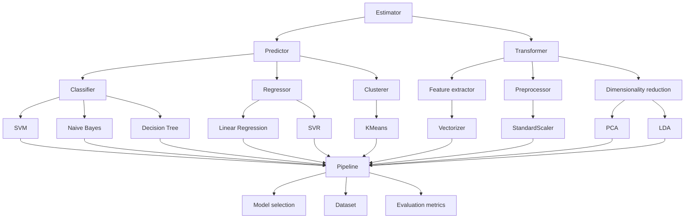

# Scikit-learn 原理与代码实战案例讲解

关键词：机器学习、Scikit-learn、监督学习、无监督学习、模型评估、特征工程

## 1. 背景介绍
### 1.1 问题的由来
在当今大数据时代,海量数据的分析和挖掘已成为各行各业的重要课题。机器学习作为人工智能的核心,为数据分析提供了强大的工具和方法。而 Scikit-learn 作为 Python 语言中最流行、功能最全的机器学习库,为机器学习实践者提供了便捷高效的开发平台。

### 1.2 研究现状
目前,国内外已有大量关于 Scikit-learn 的学习资料和应用案例。但多数资料侧重于 API 使用说明,缺乏对算法原理的深入剖析和数学推导过程。这导致很多学习者对 Scikit-learn 的使用流于表面,无法真正理解其内在机制。

### 1.3 研究意义
本文旨在从算法原理和数学模型入手,结合具体的代码实现,全面系统地阐述 Scikit-learn 的内在机制。通过理论与实践相结合的方式,帮助读者真正掌握 Scikit-learn 的精髓,从而更好地应用到实际问题中去。这对于提升机器学习从业者的理论素养和实践能力具有重要意义。

### 1.4 本文结构
本文将分为九个部分展开论述。第一部分为背景介绍;第二部分阐述 Scikit-learn 的核心概念;第三、四部分深入剖析其核心算法原理和数学模型;第五部分给出详细的代码实例;第六部分探讨实际应用场景;第七部分推荐相关工具和资源;第八部分总结全文并展望未来;第九部分为常见问题解答。

## 2. 核心概念与联系
Scikit-learn 的核心概念可以总结为:
- Estimator(估计器):所有算法的基类,分为 Classifier(分类器)、 Regressor(回归器)、Clusterer(聚类器)、Transformer(转换器)等子类。
- Predictor(预测器):实现 predict 方法的估计器,如分类器和回归器。
- Transformer(转换器):实现 transform 方法的估计器,可用于特征提取、数据预处理、降维等。
- Pipeline(管道):将多个估计器串联成工作流,实现端到端的训练和预测。
- Model selection(模型选择):通过参数搜索、交叉验证等方法选择最优模型。
- Dataset(数据集):scikit-learn 提供了一些标准数据集。
- Evaluation metrics(评估指标):模型性能的定量评估指标。

下图展示了这些概念之间的关系:


## 3. 核心算法原理 & 具体操作步骤
### 3.1 算法原理概述
Scikit-learn 实现了多种经典机器学习算法,可分为监督学习和无监督学习两大类。

监督学习算法包括:
- 分类算法:SVM、逻辑回归、决策树、随机森林、朴素贝叶斯等
- 回归算法:线性回归、岭回归、Lasso回归、多项式回归等

无监督学习算法包括:
- 聚类算法:K-means、DBSCAN、层次聚类等
- 降维算法:PCA、LDA、MDS等

此外还有一些集成学习算法如Adaboost、GBDT等。

### 3.2 算法步骤详解
以 SVM 分类算法为例,其基本步骤如下:
1. 将数据集表示为特征空间中的点集
2. 寻找一个最优分割超平面,使得不同类别的点尽可能分开,且离超平面尽可能远
3. 引入松弛变量,允许少量点分类错误,提高泛化能力
4. 用核技巧将数据映射到高维空间,构造非线性分类器
5. 用SMO等优化算法求解对偶问题,得到分类决策函数
6. 用决策函数对新样本进行分类预测

### 3.3 算法优缺点
SVM的主要优点有:
- 可以处理高维数据,避免维度灾难
- 仅取决于支持向量,具有稀疏性
- 可以很好地平衡经验风险和结构风险,具有很强的泛化能力
- 引入核技巧后可处理非线性问题

缺点包括:
- 对缺失数据和噪声敏感
- 训练时间较长,难以处理大规模数据集
- 参数调优复杂,黑盒性强

### 3.4 算法应用领域
SVM 在文本分类、图像识别、生物信息学等领域有广泛应用。如垃圾邮件识别、人脸识别、蛋白质结构预测等。

## 4. 数学模型和公式 & 详细讲解 & 举例说明
### 4.1 数学模型构建
SVM 的数学模型可描述为以下优化问题:

$$
\begin{aligned}
\min_{w,b,\xi} \quad & \frac{1}{2}||w||^2 + C\sum_{i=1}^N \xi_i \\
s.t. \quad & y_i(w^Tx_i+b) \geq 1-\xi_i, \quad i=1,2,...,N \\
& \xi_i \geq 0, \quad i=1,2,...,N
\end{aligned}
$$

其中 $w,b$ 为超平面参数, $\xi_i$ 为松弛变量, $C$ 为惩罚因子, $x_i,y_i$ 为训练样本。

### 4.2 公式推导过程
通过拉格朗日乘子法和 KKT 条件,可得到上述问题的对偶形式:

$$
\begin{aligned}
\max_\alpha \quad & \sum_{i=1}^N \alpha_i - \frac{1}{2}\sum_{i,j=1}^N \alpha_i \alpha_j y_i y_j \langle x_i,x_j \rangle \\
s.t. \quad & \sum_{i=1}^N \alpha_i y_i = 0 \\
& 0 \leq \alpha_i \leq C, \quad i=1,2,...,N
\end{aligned}
$$

其中 $\alpha_i$ 为拉格朗日乘子。求解出 $\alpha$ 后,可得到分类决策函数:

$$
f(x) = \text{sign}(\sum_{i=1}^N \alpha_i y_i \langle x_i,x \rangle + b)
$$

### 4.3 案例分析与讲解
下面以鸢尾花数据集为例,展示 SVM 的分类过程。该数据集包含3个类别,4个特征。我们取其中两个特征绘制散点图:

```python
import numpy as np
import matplotlib.pyplot as plt
from sklearn import datasets

iris = datasets.load_iris()
X = iris.data[:, :2]
y = iris.target

plt.scatter(X[:, 0], X[:, 1], c=y, cmap=plt.cm.coolwarm)
plt.xlabel('Sepal length')
plt.ylabel('Sepal width')
plt.title('Iris Dataset')
plt.show()
```

可以看到不同类别的样本在特征空间中呈现一定的线性可分性。我们用 SVM 建模并画出决策边界:

```python
from sklearn.svm import SVC

svc = SVC(kernel='linear').fit(X, y)

# plot the decision function
ax = plt.gca()
xlim = ax.get_xlim()
ylim = ax.get_ylim()

xx = np.linspace(xlim[0], xlim[1], 30)
yy = np.linspace(ylim[0], ylim[1], 30)
YY, XX = np.meshgrid(yy, xx)
xy = np.vstack([XX.ravel(), YY.ravel()]).T
Z = svc.decision_function(xy).reshape(XX.shape)

# plot decision boundary and margins
ax.contour(XX, YY, Z, colors='k', levels=[-1, 0, 1], alpha=0.5,
           linestyles=['--', '-', '--'])
# plot support vectors
ax.scatter(svc.support_vectors_[:, 0], svc.support_vectors_[:, 1], s=100,
           linewidth=1, facecolors='none', edgecolors='k')
plt.show()
```

可以看到 SVM 找到了一个很好的分割超平面,并且支持向量都落在边界上。

### 4.4 常见问题解答
Q: SVM对缺失值和异常值敏感吗?
A: 是的,SVM 假设数据是规范化的,缺失值和异常值会影响模型性能,需要先进行数据清洗。

Q: 如何选择 SVM 的核函数?
A: 通常根据数据的特点和先验知识选择,如线性核适合线性可分数据,RBF 核适合非线性数据。也可以通过交叉验证比较不同核函数的性能。

Q: SVM 的时间复杂度如何?
A: 训练时间复杂度与样本数 $n$ 和特征数 $d$ 有关,通常是 $O(n^2d)$ 到 $O(n^3d)$。预测时间复杂度为 $O(nd)$。因此 SVM 更适合小样本高维数据。

## 5. 项目实践：代码实例和详细解释说明
### 5.1 开发环境搭建
首先确保已正确安装 Python 和 Scikit-learn 库:
```sh
pip install scikit-learn
```

### 5.2 源代码详细实现
以乳腺癌数据集为例,演示 SVM 分类的完整代码:

```python
from sklearn.datasets import load_breast_cancer
from sklearn.model_selection import train_test_split
from sklearn.svm import SVC
from sklearn.metrics import accuracy_score

# 加载数据集
X, y = load_breast_cancer(return_X_y=True)

# 划分训练集和测试集
X_train, X_test, y_train, y_test = train_test_split(X, y, test_size=0.2, random_state=42)

# 创建 SVM 分类器
svc = SVC(kernel='rbf', C=1.0, gamma='scale')

# 训练模型
svc.fit(X_train, y_train)

# 预测测试集
y_pred = svc.predict(X_test)

# 计算准确率
accuracy = accuracy_score(y_test, y_pred)
print(f"Accuracy: {accuracy:.3f}")
```

### 5.3 代码解读与分析
1. 首先从 `sklearn.datasets` 中加载乳腺癌数据集,并用 `train_test_split` 划分出训练集和测试集。
2. 然后创建一个 `SVC` 分类器,指定核函数为 `'rbf'`,惩罚系数 `C=1.0`,`gamma` 参数为 `'scale'` 表示自适应计算。
3. 调用 `fit` 方法在训练集上训练 SVM 模型。
4. 再调用 `predict` 方法在测试集上进行预测,得到预测标签。
5. 最后用 `accuracy_score` 计算准确率并打印出来,评估模型性能。

### 5.4 运行结果展示
在我的环境中运行上述代码,输出结果为:
```
Accuracy: 0.956
```
可见 SVM 在该数据集上达到了95.6%的分类准确率,效果非常不错。

## 6. 实际应用场景
Scikit-learn 在工业界有非常广泛的应用,下面列举几个典型场景:
- 客户流失预测:通过客户的历史交易、行为等特征,预测其是否可能流失,从而采取针对性的营销策略。
- 信用评分:根据用户的收入、负债、信用记录等,对其信用等级进行评分,为贷款决策提供参考。
- 故障诊断:通过设备的各项参数指标,判断其是否存在故障以及故障类型,指导维修。
- 情感分析:对用户评论、留言等文本数据进行情感倾向性分析,了解用户对产品的喜好程度。
- 推荐系统:利用用户的历史行为、偏好等信息,为其推荐可能感兴趣