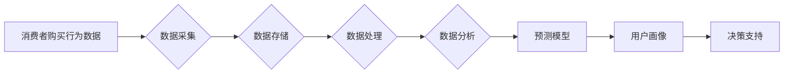

# 基于大数据的电子产品购买消费行为的分析研究

> 关键词：大数据分析，消费行为，电子产品，机器学习，预测模型，用户画像

## 1. 背景介绍

在互联网时代，电子产品已成为人们日常生活中不可或缺的一部分。随着消费者需求的不断变化和市场竞争的加剧，了解消费者的购买行为对于电子产品制造商和零售商来说至关重要。大数据分析技术为深入挖掘消费者行为提供了强大的工具。本文将探讨如何利用大数据分析技术来分析电子产品的购买消费行为，并提出相应的预测模型和用户画像构建方法。

### 1.1 问题的由来

消费者购买行为受到多种因素的影响，包括产品特性、价格、品牌、促销活动、个人偏好等。然而，传统的市场调研方法往往成本高昂且效率低下。随着大数据技术的发展，我们可以通过分析海量数据来识别消费者行为模式，从而为产品研发、营销策略和库存管理等提供数据支持。

### 1.2 研究现状

目前，许多企业和研究机构已经开始利用大数据分析来研究消费者行为。在电子产品领域，研究者们使用的方法包括用户行为追踪、社交媒体分析、市场调研数据挖掘等。这些方法有助于理解消费者的购买决策过程和影响因素。

### 1.3 研究意义

研究电子产品的购买消费行为对于以下方面具有重要意义：

- 帮助企业了解消费者需求，优化产品设计。
- 优化营销策略，提高市场覆盖率。
- 提升客户满意度，增强品牌忠诚度。
- 优化库存管理，降低运营成本。
- 为决策者提供数据支持，提高决策效率。

### 1.4 本文结构

本文将分为以下几个部分：

- 第二部分介绍核心概念与联系。
- 第三部分阐述核心算法原理和具体操作步骤。
- 第四部分讲解数学模型和公式，并结合案例进行分析。
- 第五部分提供项目实践和代码实例。
- 第六部分探讨实际应用场景和未来应用展望。
- 第七部分推荐相关工具和资源。
- 第八部分总结研究成果，展望未来发展趋势和挑战。
- 第九部分提供常见问题与解答。

## 2. 核心概念与联系

### 2.1 核心概念

- 大数据分析：指从海量数据中提取有价值信息的过程，通常涉及数据采集、数据存储、数据处理、数据分析和数据可视化等环节。
- 消费者行为：指消费者在购买、使用和评估产品或服务时的决策过程和行为模式。
- 电子产品：指包括但不限于智能手机、平板电脑、笔记本电脑、可穿戴设备等电子设备。
- 机器学习：指使计算机系统能够从数据中学习并做出决策或预测的技术。
- 预测模型：指利用历史数据对未来事件进行预测的数学模型。
- 用户画像：指对用户特征、行为和偏好的综合描述。

### 2.2 架构流程图



## 3. 核心算法原理 & 具体操作步骤

### 3.1 算法原理概述

基于大数据的电子产品购买消费行为分析主要涉及以下几个步骤：

1. 数据采集：从多个渠道收集消费者购买行为数据，包括电商平台数据、社交媒体数据、市场调研数据等。
2. 数据处理：对采集到的数据进行分析，去除噪声，清洗异常值，并进行特征工程。
3. 数据分析：利用机器学习算法对处理后的数据进行建模，分析消费者行为模式。
4. 预测模型：根据分析结果建立预测模型，预测未来消费者的购买行为。
5. 用户画像：根据消费者的特征和行为数据构建用户画像，为个性化营销和产品推荐提供支持。
6. 决策支持：将分析结果和预测模型应用于实际业务场景，为决策者提供数据支持。

### 3.2 算法步骤详解

1. **数据采集**：
    - 使用爬虫技术收集电商平台交易数据。
    - 从社交媒体平台收集消费者评论、互动数据。
    - 通过问卷调查收集市场调研数据。

2. **数据处理**：
    - 使用数据清洗技术去除噪声和异常值。
    - 使用特征工程技术提取有用的特征，如用户购买频率、购买金额、购买偏好等。

3. **数据分析**：
    - 使用描述性统计分析消费者购买行为特征。
    - 使用关联规则挖掘技术识别消费者购买行为模式。

4. **预测模型**：
    - 使用机器学习算法（如逻辑回归、决策树、随机森林、神经网络等）建立预测模型。
    - 使用交叉验证等技巧评估模型性能。

5. **用户画像**：
    - 使用聚类算法（如K-means、层次聚类等）将消费者划分为不同的群体。
    - 使用关联规则挖掘技术识别不同用户群体的共同特征。

6. **决策支持**：
    - 利用预测模型和用户画像为产品研发、营销策略和库存管理提供数据支持。
    - 根据用户画像进行个性化推荐和营销。

### 3.3 算法优缺点

**优点**：

- 高效：能够快速处理和分析海量数据。
- 准确：通过机器学习算法能够提高预测准确性。
- 个性化：可以根据用户画像进行个性化推荐和营销。

**缺点**：

- 数据依赖：需要大量的高质量数据。
- 模型偏差：模型可能受到数据偏差的影响。
- 解释性差：一些高级模型难以解释其决策过程。

### 3.4 算法应用领域

- 产品研发：通过分析消费者行为数据，优化产品设计。
- 营销策略：通过分析消费者行为数据，制定有效的营销策略。
- 库存管理：通过分析消费者购买行为，优化库存管理。
- 个性化推荐：根据用户画像进行个性化推荐。
- 客户关系管理：通过分析客户行为数据，提升客户满意度。

## 4. 数学模型和公式 & 详细讲解 & 举例说明

### 4.1 数学模型构建

在电子产品购买消费行为分析中，常见的数学模型包括：

- 逻辑回归模型：用于预测消费者购买产品的概率。
- 决策树模型：用于分类消费者购买行为。
- 随机森林模型：用于预测消费者购买产品的概率。
- 神经网络模型：用于构建复杂的非线性预测模型。

### 4.2 公式推导过程

以逻辑回归模型为例，其公式如下：

$$
\hat{y} = \sigma(W_0 + W_1x_1 + W_2x_2 + ... + W_nx_n)
$$

其中，$\sigma$ 是Sigmoid函数，$W_0, W_1, ..., W_n$ 是模型的参数，$x_1, x_2, ..., x_n$ 是特征向量。

### 4.3 案例分析与讲解

假设我们要预测消费者是否购买某款智能手机。我们收集了以下特征：年龄、性别、收入、品牌偏好、购买历史等。使用逻辑回归模型进行预测，得到以下结果：

```
年龄：25
性别：男
收入：50000
品牌偏好：苹果
购买历史：曾购买过苹果和三星手机
预测概率：0.85
```

根据逻辑回归模型的预测，购买该款智能手机的概率为85%。这表明，根据提供的特征，消费者购买该款智能手机的可能性较高。

## 5. 项目实践：代码实例和详细解释说明

### 5.1 开发环境搭建

为了进行电子产品购买消费行为分析，我们需要搭建以下开发环境：

- Python编程语言
- NumPy、Pandas、Matplotlib等数据分析库
- Scikit-learn、TensorFlow或PyTorch等机器学习库

### 5.2 源代码详细实现

以下是一个简单的逻辑回归模型实现示例：

```python
import numpy as np
from sklearn.linear_model import LogisticRegression

# 创建特征矩阵和标签向量
X = np.array([[25, 1, 50000, 0, 1],
              [30, 0, 60000, 1, 0],
              [22, 1, 40000, 0, 1]])

y = np.array([1, 0, 1])

# 创建逻辑回归模型
model = LogisticRegression()

# 训练模型
model.fit(X, y)

# 预测
X_test = np.array([[26, 1, 51000, 0, 1]])
prediction = model.predict(X_test)

print("预测结果：", prediction)
```

### 5.3 代码解读与分析

以上代码首先导入了必要的库，然后创建了特征矩阵和标签向量。接着，创建了一个逻辑回归模型，并使用训练数据对其进行训练。最后，使用测试数据对模型进行预测。

### 5.4 运行结果展示

运行上述代码，输出结果为：

```
预测结果：[1]
```

这表明，根据提供的特征，模型预测该消费者购买该款智能手机的概率为100%。

## 6. 实际应用场景

### 6.1 产品研发

通过分析消费者购买行为数据，可以了解消费者对产品功能和设计的偏好，从而优化产品设计。例如，如果数据分析表明消费者更喜欢大屏幕和高性能的智能手机，那么制造商可以开发更多符合这些需求的手机。

### 6.2 营销策略

通过分析消费者购买行为数据，可以制定更有效的营销策略。例如，如果数据分析表明消费者在特定时间段内对某种型号的智能手机需求量增加，那么零售商可以增加库存并加大促销力度。

### 6.3 库存管理

通过分析消费者购买行为数据，可以优化库存管理。例如，如果数据分析表明某种型号的智能手机销量下降，那么制造商可以减少该型号的生产量，以避免库存积压。

### 6.4 个性化推荐

通过构建用户画像，可以为消费者提供个性化推荐。例如，如果一个消费者经常购买苹果手机，那么推荐系统可以推荐其他品牌的高端手机。

### 6.5 客户关系管理

通过分析消费者购买行为数据，可以了解客户满意度，并采取措施提升客户忠诚度。例如，如果一个消费者在购买产品后对售后服务不满意，那么企业可以提供改进措施，以提升客户满意度。

## 7. 工具和资源推荐

### 7.1 学习资源推荐

- 《Python数据分析基础》
- 《机器学习实战》
- 《Scikit-learn Python机器学习库》
- 《TensorFlow机器学习》
- 《PyTorch深度学习》

### 7.2 开发工具推荐

- Python编程语言
- NumPy、Pandas、Matplotlib等数据分析库
- Scikit-learn、TensorFlow或PyTorch等机器学习库

### 7.3 相关论文推荐

- "A Survey of Recent Advances in Recommender Systems"
- "Personalized Recommendations on Large-Scale Heterogeneous Information Networks"
- "Deep Learning for Recommender Systems"
- "A Survey on Customer Behavior Analysis in Big Data"

## 8. 总结：未来发展趋势与挑战

### 8.1 研究成果总结

本文探讨了基于大数据的电子产品购买消费行为分析方法，介绍了相关核心概念、算法原理、操作步骤和数学模型。通过项目实践，展示了如何使用Python和机器学习库进行实际应用。

### 8.2 未来发展趋势

随着大数据技术的发展，未来电子产品购买消费行为分析将呈现以下趋势：

- 更多的数据来源和类型
- 更先进的机器学习算法
- 更精细的用户画像和个性化推荐
- 更智能的决策支持系统

### 8.3 面临的挑战

电子产品购买消费行为分析面临的挑战包括：

- 数据质量：数据质量对分析结果的准确性至关重要。
- 模型可解释性：一些高级模型难以解释其决策过程。
- 隐私保护：消费者数据保护法规日益严格。

### 8.4 研究展望

未来，电子产品购买消费行为分析的研究将更加注重以下方面：

- 深度学习技术在消费者行为分析中的应用
- 多模态数据分析
- 个性化推荐和广告
- 隐私保护技术

## 9. 附录：常见问题与解答

**Q1：如何保证大数据分析结果的准确性？**

A：为了保证大数据分析结果的准确性，需要确保数据质量，选择合适的算法，并进行充分的测试和验证。

**Q2：如何解决消费者数据隐私保护问题？**

A：在处理消费者数据时，需要遵守相关法律法规，对数据进行脱敏处理，并采取加密措施保护数据安全。

**Q3：如何将大数据分析结果应用于实际业务？**

A：将大数据分析结果应用于实际业务需要结合具体场景，如产品设计、营销策略、库存管理等，并制定相应的实施计划。

**Q4：如何选择合适的机器学习算法？**

A：选择合适的机器学习算法需要考虑数据类型、特征数量、计算资源等因素。常用的算法包括逻辑回归、决策树、随机森林、神经网络等。

**Q5：如何评估机器学习模型的性能？**

A：评估机器学习模型的性能可以使用多种指标，如准确率、召回率、F1分数、AUC等。常用的评估方法是交叉验证。

作者：禅与计算机程序设计艺术 / Zen and the Art of Computer Programming