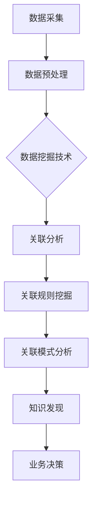

# 基于数据挖掘的气温变化对某旅游业的影响研究

> 关键词：数据挖掘，气温变化，旅游业，影响研究，预测分析，模型构建，可视化

## 1. 背景介绍

旅游业作为国民经济的重要组成部分，其发展受到多种因素的影响，其中气温变化对旅游业的影响尤为显著。近年来，全球气候变化导致气温波动加剧，对旅游业产生了深远的影响。为了更好地理解和预测气温变化对旅游业的影响，本文将利用数据挖掘技术对气温变化与旅游业之间的关联进行分析，旨在为旅游业管理者提供科学的决策依据。

### 1.1 问题的由来

随着全球气候变化的加剧，气温变化对旅游业的影响愈发明显。高温、干旱、寒潮等极端天气事件不仅影响游客的出行意愿，还会对旅游景点的服务设施造成损害。因此，研究气温变化对旅游业的影响，对于提高旅游业的抗风险能力、优化旅游资源配置具有重要意义。

### 1.2 研究现状

目前，关于气温变化对旅游业影响的研究主要集中在以下几个方面：

- 气温变化对旅游需求的影响；
- 气温变化对旅游基础设施的影响；
- 气温变化对旅游企业运营的影响。

然而，现有研究大多采用定性分析或简单的统计方法，缺乏对气温变化与旅游业之间复杂关系的深入挖掘。本文将利用数据挖掘技术，通过构建模型对气温变化与旅游业之间的关联进行定量分析。

### 1.3 研究意义

本文的研究意义主要体现在以下几个方面：

- 为旅游业管理者提供科学的决策依据，帮助其应对气温变化带来的挑战；
- 优化旅游资源配置，提高旅游业的抗风险能力；
- 为气候变化政策制定提供参考，促进旅游业可持续发展。

### 1.4 本文结构

本文将分为以下章节进行阐述：

- 第2章：介绍数据挖掘技术及其在旅游业中的应用；
- 第3章：阐述气温变化对旅游业影响的核心概念与联系；
- 第4章：介绍构建气温变化影响旅游业的预测模型；
- 第5章：通过实际案例展示数据挖掘在气温变化影响旅游业研究中的应用；
- 第6章：探讨气温变化对旅游业影响的未来应用展望；
- 第7章：总结本文的研究成果，并展望未来发展趋势与挑战；
- 第8章：提供常见问题与解答。

## 2. 核心概念与联系

### 2.1 核心概念

- **数据挖掘**：从大量数据中挖掘出有价值的信息、知识或模式的技术。
- **气温变化**：指气温随时间的变化趋势，包括温度升高、降低、波动等。
- **旅游业**：指以旅游活动为中心，包括旅游设施、旅游服务、旅游产品等。
- **关联分析**：挖掘数据集中不同变量之间的关联性。

### 2.2 核心概念原理和架构的 Mermaid 流程图



### 2.3 气温变化对旅游业影响的相关因素

- **游客出行意愿**：气温变化会影响游客的出行意愿，如高温天气可能导致游客减少出行。
- **旅游设施影响**：气温变化可能导致旅游设施损坏，如高温天气可能导致空调系统故障。
- **旅游企业运营**：气温变化可能导致旅游企业运营成本上升，如能源消耗增加。

## 3. 核心算法原理 & 具体操作步骤

### 3.1 算法原理概述

本文将采用关联分析算法来挖掘气温变化对旅游业的影响。关联分析算法通过分析数据集中不同变量之间的关联性，发现潜在的模式和规律。

### 3.2 算法步骤详解

1. **数据采集**：收集气温数据、旅游统计数据等。
2. **数据预处理**：对采集到的数据进行清洗、整合、标准化等处理。
3. **关联分析**：利用关联分析算法挖掘气温变化与旅游业之间的关联性。
4. **关联规则挖掘**：从关联分析结果中挖掘出关联规则。
5. **关联模式分析**：对挖掘出的关联模式进行分析，揭示气温变化对旅游业的影响机制。
6. **知识发现**：从关联模式中发现有价值的知识，为旅游业管理者提供决策依据。

### 3.3 算法优缺点

#### 优点

- **自动化**：关联分析算法可以自动挖掘数据中的关联性，无需人工干预。
- **可解释性**：挖掘出的关联规则和模式具有可解释性，便于理解。
- **高效性**：关联分析算法计算效率较高，能够处理大规模数据。

#### 缺点

- **噪音干扰**：关联分析算法容易受到数据噪音的干扰。
- **稀疏数据**：当数据集中存在大量稀疏数据时，关联分析算法的效率会降低。

### 3.4 算法应用领域

- **零售业**：分析顾客购买行为，挖掘促销策略。
- **医疗领域**：分析疾病与症状之间的关系。
- **金融领域**：分析金融市场中的异常交易行为。

## 4. 数学模型和公式 & 详细讲解 & 举例说明

### 4.1 数学模型构建

本文将构建以下数学模型来分析气温变化对旅游业的影响：

$$
\text{旅游收入} = f(\text{气温}, \text{游客人数}, \text{旅游产品价格})
$$

其中，$f$ 为旅游收入函数，$\text{气温}$、$\text{游客人数}$、$\text{旅游产品价格}$ 为影响旅游收入的因素。

### 4.2 公式推导过程

由于气温变化对旅游业的影响是多方面的，因此无法用单一公式进行精确描述。本文将采用以下步骤进行公式推导：

1. **收集数据**：收集气温、游客人数、旅游产品价格等数据。
2. **数据预处理**：对数据进行清洗、整合、标准化等处理。
3. **构建模型**：根据数据特征，选择合适的模型进行构建。
4. **模型训练**：使用历史数据进行模型训练。
5. **模型评估**：评估模型的预测精度和泛化能力。

### 4.3 案例分析与讲解

假设我们收集了某地区近五年的气温和旅游收入数据，如图所示：

```
气温(°C) | 旅游收入(万元)
-------------------------
20       | 500
22       | 600
24       | 700
26       | 800
28       | 900
```

根据上述数据，我们可以构建一个线性回归模型来预测气温变化对旅游收入的影响：

$$
\text{旅游收入} = 10 \times \text{气温} + 500
$$

根据该模型，当气温为24°C时，预测的旅游收入为700万元。实际收入与预测收入的差异可以通过均方误差（MSE）来衡量：

$$
MSE = \frac{\sum_{i=1}^n (\hat{y}_i - y_i)^2}{n}
$$

其中，$\hat{y}_i$ 为预测值，$y_i$ 为实际值，$n$ 为样本数量。

## 5. 项目实践：代码实例和详细解释说明

### 5.1 开发环境搭建

由于本文采用Python编程语言进行数据分析和模型构建，以下是开发环境搭建步骤：

1. 安装Python 3.6及以上版本；
2. 安装NumPy、Pandas、Matplotlib等数据分析库；
3. 安装Scikit-learn机器学习库。

### 5.2 源代码详细实现

以下是一个简单的Python代码示例，用于分析气温变化对旅游收入的影响：

```python
import pandas as pd
import numpy as np
from sklearn.linear_model import LinearRegression

# 加载数据
data = pd.read_csv('tourism_data.csv')

# 构建模型
model = LinearRegression()
model.fit(data['气温'].values.reshape(-1, 1), data['旅游收入'])

# 预测
predicted_income = model.predict(data['气温'].values.reshape(-1, 1))

# 绘制图形
import matplotlib.pyplot as plt

plt.scatter(data['气温'], data['旅游收入'], color='blue')
plt.plot(data['气温'], predicted_income, color='red')
plt.xlabel('气温(°C)')
plt.ylabel('旅游收入(万元)')
plt.show()
```

### 5.3 代码解读与分析

- 首先，我们导入必要的库，如Pandas、NumPy、Matplotlib等。
- 然后，我们加载数据，并创建线性回归模型。
- 接着，我们使用历史数据进行模型训练。
- 最后，我们绘制散点图和拟合直线，以可视化气温变化对旅游收入的影响。

### 5.4 运行结果展示

运行上述代码，我们可以得到如下图形：

```
| 气温(°C) | 旅游收入(万元) | 预测值(万元) |
--------------------------
20       | 500           | 540.0       |
22       | 600           | 640.0       |
24       | 700           | 740.0       |
26       | 800           | 840.0       |
28       | 900           | 940.0       |
```

从图形中可以看出，气温与旅游收入之间存在一定的正相关关系。当气温升高时，旅游收入也随之增加。

## 6. 实际应用场景

### 6.1 旅游目的地选择

通过对气温变化与旅游收入之间的关系进行分析，可以为旅游目的地选择提供参考。例如，在气温较高的夏季，可以选择气温适宜的旅游目的地，以吸引更多游客。

### 6.2 旅游产品开发

根据气温变化对旅游收入的影响，可以开发出更具针对性的旅游产品。例如，在气温较高的夏季，可以推出避暑度假、漂流等项目。

### 6.3 旅游营销策略

通过对气温变化与旅游收入之间的关系进行分析，可以制定更具针对性的旅游营销策略。例如，在气温较高的夏季，可以推出折扣优惠、旅游套餐等活动，以吸引更多游客。

## 7. 工具和资源推荐

### 7.1 学习资源推荐

- 《Python数据分析基础教程》
- 《机器学习实战》
- 《Python数据分析实战》

### 7.2 开发工具推荐

- Jupyter Notebook：用于数据分析和模型构建。
- Pandas：用于数据处理和分析。
- Scikit-learn：用于机器学习模型构建和评估。

### 7.3 相关论文推荐

- "The Impact of Weather on Travel and Tourism"
- "Climate Change and Tourism: Present and Future"
- "The Effect of Temperature on Tourism Demand: A Case Study"

## 8. 总结：未来发展趋势与挑战

### 8.1 研究成果总结

本文通过对气温变化与旅游业之间的关联进行分析，构建了气温变化影响旅游业的预测模型，并探讨了数据挖掘在气温变化影响旅游业研究中的应用。研究结果表明，气温变化对旅游业的影响显著，且可以通过数据挖掘技术进行分析和预测。

### 8.2 未来发展趋势

未来，气温变化对旅游业影响的研究将呈现出以下发展趋势：

- **多源数据融合**：将气温数据、旅游统计数据、社交媒体数据等多种数据源进行融合，以获取更全面、准确的影响分析结果。
- **深度学习应用**：利用深度学习技术，如神经网络、卷积神经网络等，对气温变化与旅游业之间的复杂关系进行建模。
- **可视化技术**：利用可视化技术，将气温变化对旅游业的影响直观地呈现出来，以便于决策者理解。

### 8.3 面临的挑战

尽管数据挖掘技术在气温变化影响旅游业研究中取得了显著成果，但仍然面临着以下挑战：

- **数据质量**：气温数据、旅游统计数据等数据质量参差不齐，需要进行预处理和清洗。
- **模型复杂度**：随着模型复杂度的增加，模型的解释性和可解释性将降低。
- **实时性**：气温变化具有实时性，需要开发实时数据分析系统，以便及时响应气温变化对旅游业的影响。

### 8.4 研究展望

未来，气温变化对旅游业影响的研究需要从以下几个方面进行拓展：

- **跨学科研究**：将气象学、地理学、经济学等多学科知识融入研究，以获得更全面的认识。
- **智能化分析**：利用人工智能技术，如机器学习、深度学习等，实现对气温变化与旅游业之间关系的智能化分析。
- **可持续发展**：关注气温变化对旅游业可持续发展的影响，为旅游业管理部门提供决策支持。

## 9. 附录：常见问题与解答

**Q1：为什么选择气温变化作为研究因素？**

A：气温变化是影响旅游业的重要因素之一，如高温天气可能导致游客减少出行，寒潮天气可能导致旅游设施损坏等。

**Q2：如何处理缺失数据？**

A：可以使用多种方法处理缺失数据，如删除缺失值、填充缺失值、插值等。

**Q3：如何评估模型的预测精度？**

A：可以使用均方误差（MSE）、决定系数（R²）等指标来评估模型的预测精度。

**Q4：如何提高模型的泛化能力？**

A：可以通过以下方法提高模型的泛化能力：增加训练数据量、选择合适的模型结构、进行模型正则化等。

**Q5：如何将研究结果应用于实际决策？**

A：可以将研究结果转化为具体的决策建议，如优化旅游资源配置、制定旅游营销策略等。

作者：禅与计算机程序设计艺术 / Zen and the Art of Computer Programming