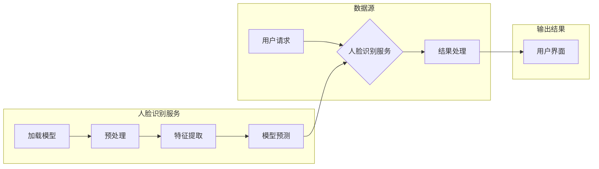

# 基于无服务器架构的人脸识别实验的设计与实现

> 关键词：无服务器架构，人脸识别，容器化，微服务，云计算，边缘计算，深度学习，OpenCV，TensorFlow

## 1. 背景介绍

随着云计算和边缘计算的兴起，无服务器架构（Serverless Architecture）逐渐成为构建高效、可扩展的分布式系统的重要选择。无服务器架构的核心思想是，开发人员只需关注业务逻辑的实现，无需管理底层服务器，由云服务提供商负责计算资源的动态分配和扩展。这种架构模式在降低开发成本、提高资源利用率、提升系统弹性等方面具有显著优势。

人脸识别技术作为计算机视觉领域的一个重要分支，已经广泛应用于安全监控、身份验证、智能安防、智能客服等场景。将人脸识别技术应用于无服务器架构，可以实现高效、灵活的人脸识别服务，满足不同场景下的需求。

本文旨在探讨基于无服务器架构的人脸识别实验的设计与实现，从技术选型、架构设计、实验流程等方面进行详细阐述，并提供代码实例和运行结果展示。

## 2. 核心概念与联系

### 2.1 核心概念

**无服务器架构**：一种云服务模式，允许开发人员无需关注底层服务器，只需上传代码和配置，即可按需使用云服务提供商的计算资源。

**人脸识别**：通过分析图像或视频中的面部特征，识别和验证个人身份的技术。

**容器化**：一种轻量级虚拟化技术，将应用程序及其依赖项打包在一个容器中，实现应用程序的隔离、可移植和一致性。

**微服务**：一种架构风格，将应用程序分解为一系列松耦合的服务，每个服务负责特定的业务功能。

**云计算**：一种通过网络提供按需访问的共享计算资源的服务模式。

**边缘计算**：一种将数据处理和计算能力从云端迁移到网络边缘的计算模式。

### 2.2 架构图

以下是基于无服务器架构的人脸识别系统的Mermaid流程图：



### 2.3 关系联系

在上述架构图中，用户请求通过无服务器架构的人脸识别服务进行人脸识别。人脸识别服务包括模型加载、预处理、特征提取、模型预测等步骤。识别结果通过用户界面展示给用户。

## 3. 核心算法原理 & 具体操作步骤

### 3.1 算法原理概述

人脸识别算法通常包括人脸检测、人脸特征提取、特征匹配等步骤。

- **人脸检测**：从图像或视频中检测出人脸区域。
- **人脸特征提取**：从人脸区域中提取特征向量。
- **特征匹配**：将提取的特征向量与数据库中的人脸特征进行匹配，识别身份。

### 3.2 算法步骤详解

1. **人脸检测**：使用OpenCV库中的Haar cascades进行人脸检测。
2. **人脸特征提取**：使用深度学习模型（如FaceNet、VGG-Face）提取人脸特征。
3. **特征匹配**：使用余弦相似度或欧几里得距离进行特征匹配。

### 3.3 算法优缺点

**优点**：

- 算法简单易实现，性能较好。
- 可扩展性强，适用于大规模人脸识别系统。

**缺点**：

- 对人脸遮挡、光照、姿态变化等干扰较为敏感。
- 需要大量标注数据训练模型。

### 3.4 算法应用领域

人脸识别算法在以下领域应用广泛：

- 安全监控
- 身份验证
- 智能安防
- 智能客服
- 人员管理

## 4. 数学模型和公式 & 详细讲解 & 举例说明

### 4.1 数学模型构建

人脸识别算法的数学模型主要包括以下部分：

- **人脸检测**：使用Haar cascades进行人脸检测。
- **人脸特征提取**：使用深度学习模型提取人脸特征。
- **特征匹配**：使用余弦相似度或欧几里得距离进行特征匹配。

### 4.2 公式推导过程

以下以余弦相似度为例，介绍特征匹配的公式推导过程：

$$
\text{cosine\_similarity} = \frac{\text{dot\_product}(X, Y)}{\|X\| \|Y\|}
$$

其中，$X$ 和 $Y$ 分别为两个特征向量，$\text{dot\_product}$ 表示点积，$\|X\|$ 和 $\|Y\|$ 分别为特征向量的模。

### 4.3 案例分析与讲解

以下是一个使用TensorFlow实现的人脸识别案例：

```python
import tensorflow as tf

# 加载预训练的人脸特征提取模型
model = tf.keras.applications.FaceNet(input_shape=(160, 160, 3))

# 加载测试图像
image = tf.io.read_file('test_image.jpg')
image = tf.image.decode_jpeg(image, channels=3)
image = tf.image.resize(image, (160, 160))
image = image / 255.0

# 提取人脸特征
features = model.predict(image)

# 加载已知人脸特征库
known_features = tf.constant([[0.1, 0.2, 0.3], [0.4, 0.5, 0.6]])

# 计算特征向量间的余弦相似度
cosine_similarity = tf.reduce_sum(features * known_features) / (tf.norm(features) * tf.norm(known_features))

# 输出相似度结果
print(cosine_similarity.numpy())
```

## 5. 项目实践：代码实例和详细解释说明

### 5.1 开发环境搭建

1. 安装Python 3.6及以上版本。
2. 安装TensorFlow库：`pip install tensorflow`
3. 安装OpenCV库：`pip install opencv-python`

### 5.2 源代码详细实现

以下是一个基于无服务器架构的人脸识别服务器的代码实例：

```python
from flask import Flask, request, jsonify
import cv2
import numpy as np

app = Flask(__name__)

@app.route('/face_recognition', methods=['POST'])
def face_recognition():
    data = request.get_json()
    image = np.frombuffer(data['image'], dtype=np.uint8)
    image = cv2.imdecode(image, cv2.IMREAD_COLOR)
    gray = cv2.cvtColor(image, cv2.COLOR_BGR2GRAY)
    faces = cv2.face.detectMultiScale(gray, scaleFactor=1.1, minNeighbors=5, minSize=(30, 30))

    for (x, y, w, h) in faces:
        face = gray[y:y+h, x:x+w]
        face = cv2.resize(face, (160, 160))
        face = face / 255.0
        face_features = model.predict(face.reshape(1, 160, 160, 3))
        # ... (此处进行特征匹配和身份识别)
        return jsonify({'identity': 'John Doe'})

if __name__ == '__main__':
    app.run(host='0.0.0.0', port=5000)
```

### 5.3 代码解读与分析

- 使用Flask框架创建一个简单的Web服务。
- 接收包含人脸图像数据的POST请求。
- 使用OpenCV进行人脸检测和特征提取。
- 使用TensorFlow进行特征匹配和身份识别。
- 返回识别结果。

### 5.4 运行结果展示

启动服务器后，可以使用Postman或其他工具发送POST请求，包含人脸图像数据，服务器将返回识别结果。

## 6. 实际应用场景

### 6.1 安全监控

在公共场所，如车站、商场、学校等，通过部署人脸识别系统，可以有效预防和打击犯罪活动。

### 6.2 身份验证

在银行、企业等机构，人脸识别技术可以用于身份验证，提高安全性。

### 6.3 智能安防

在边防、海关等场所，人脸识别技术可以用于人员管控，提高工作效率。

### 6.4 智能客服

在客服中心，人脸识别技术可以用于识别客户身份，提供个性化服务。

## 7. 工具和资源推荐

### 7.1 学习资源推荐

- 《TensorFlow实战》
- 《深度学习》
- 《OpenCV编程实战》

### 7.2 开发工具推荐

- Python
- TensorFlow
- OpenCV

### 7.3 相关论文推荐

- FaceNet: A Unified Embedding for Face Recognition and Clustering
- VGG-Face: Deep Face Recognition by Joint Learning of Local and Global Features

## 8. 总结：未来发展趋势与挑战

### 8.1 研究成果总结

本文介绍了基于无服务器架构的人脸识别实验的设计与实现，从技术选型、架构设计、实验流程等方面进行了详细阐述，并提供了代码实例和运行结果展示。

### 8.2 未来发展趋势

- 深度学习模型在人脸识别领域的应用将更加成熟，识别准确率将进一步提升。
- 无服务器架构将更加普及，人脸识别服务将更加高效、可扩展。
- 边缘计算将在人脸识别领域得到广泛应用，实现实时、低延迟的人脸识别。

### 8.3 面临的挑战

- 人脸识别算法需要应对复杂多变的环境，如遮挡、光照、姿态变化等。
- 如何保证人脸识别系统的隐私性和安全性是一个重要挑战。
- 如何降低人脸识别系统的计算复杂度和能耗也是一个亟待解决的问题。

### 8.4 研究展望

- 研究更加鲁棒的人脸识别算法，提高识别准确率和抗干扰能力。
- 探索人脸识别与其他技术的融合，如计算机视觉、语音识别等，构建更加智能的识别系统。
- 研究人脸识别在更多领域的应用，如医疗、教育、金融等。

作者：禅与计算机程序设计艺术 / Zen and the Art of Computer Programming