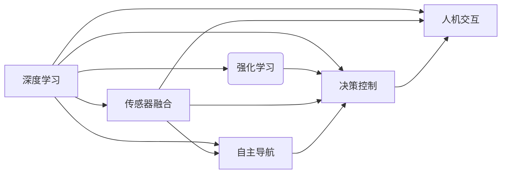

# 基础模型的机器人学能力

> 关键词：基础模型，机器人学，深度学习，强化学习，传感器融合，自主导航，决策控制，人机交互

## 1. 背景介绍

随着人工智能技术的飞速发展，机器人学领域迎来了前所未有的机遇。传统的机器人技术主要依赖于预先编写的规则和算法，而现代机器人则开始利用深度学习和机器学习技术来实现更加复杂和智能的行为。基础模型，作为机器学习领域的一项重要技术，为机器人学提供了强大的能力，使得机器人能够更好地感知环境、理解任务，并做出智能决策。

### 1.1 问题的由来

在机器人学领域，以下几个问题是推动基础模型发展的关键动力：

- **感知与理解**：机器人需要从复杂环境中提取信息，并对这些信息进行理解和解释。
- **决策与控制**：机器人需要根据感知到的信息做出合理的决策，并控制其行动以完成任务。
- **人机交互**：机器人需要与人类用户进行有效沟通，理解人类意图，并做出相应的响应。

基础模型的引入，为解决这些问题提供了新的思路和方法。

### 1.2 研究现状

当前，基础模型在机器人学中的应用主要集中在以下几个方面：

- **视觉感知**：利用卷积神经网络（CNN）进行图像识别和场景理解。
- **语音识别**：利用循环神经网络（RNN）和Transformer进行语音识别和语言理解。
- **运动规划**：利用强化学习进行路径规划和运动控制。
- **决策与规划**：利用深度强化学习（DRL）进行决策和规划。

### 1.3 研究意义

基础模型在机器人学中的应用具有以下重要意义：

- **提高感知与理解能力**：基础模型可以帮助机器人更好地理解周围环境，从而提高其自主性。
- **简化决策与控制**：基础模型可以简化机器人的决策和控制过程，提高其反应速度和效率。
- **增强人机交互**：基础模型可以改善人机交互体验，使机器人更加友好和易于使用。

### 1.4 本文结构

本文将围绕以下内容展开：

- 核心概念与联系
- 核心算法原理与操作步骤
- 数学模型与公式
- 项目实践
- 实际应用场景
- 工具和资源推荐
- 总结与展望

## 2. 核心概念与联系

### 2.1 核心概念

- **深度学习**：一种通过多层神经网络模型自动从数据中学习特征和表示的技术。
- **强化学习**：一种通过奖励信号来指导算法学习决策策略的机器学习方法。
- **传感器融合**：将来自不同传感器或不同模态的数据进行整合，以提高系统的整体性能。
- **自主导航**：机器人无需人类干预，能够自主确定其在环境中的位置和移动路径。
- **决策控制**：根据感知到的环境信息，做出决策并控制机器人的动作。
- **人机交互**：研究人与机器之间的交互过程，以及如何设计易于使用和理解的机器人系统。

### 2.2 联系

以下为这些核心概念的Mermaid流程图：



## 3. 核心算法原理 & 具体操作步骤

### 3.1 算法原理概述

本节将介绍深度学习、强化学习、传感器融合、自主导航、决策控制和人机交互等核心算法的原理。

### 3.2 算法步骤详解

#### 3.2.1 深度学习

深度学习通常包括以下几个步骤：

1. 数据预处理：对原始数据进行清洗、归一化等操作，以便模型训练。
2. 模型选择：根据任务需求选择合适的深度学习模型，如CNN、RNN或Transformer。
3. 模型训练：使用标注数据进行模型训练，通过反向传播算法更新模型参数。
4. 模型评估：使用测试数据评估模型性能，并根据评估结果调整模型结构和超参数。
5. 模型部署：将训练好的模型部署到实际应用中。

#### 3.2.2 强化学习

强化学习通常包括以下几个步骤：

1. 环境构建：定义机器人所处的环境及其状态、动作和奖励。
2. 策略学习：通过探索和利用策略学习方法，如Q-learning、SARSA或深度Q网络（DQN）。
3. 策略评估：评估不同策略的性能，并选择最优策略。
4. 策略执行：在环境中执行策略，收集数据并更新策略。

#### 3.2.3 传感器融合

传感器融合通常包括以下几个步骤：

1. 数据采集：从不同传感器获取数据。
2. 数据预处理：对采集到的数据进行滤波、去噪等操作。
3. 数据融合：根据不同传感器数据的特征，选择合适的融合算法，如卡尔曼滤波、粒子滤波或自适应滤波。
4. 数据输出：将融合后的数据输出给机器人控制系统。

#### 3.2.4 自主导航

自主导航通常包括以下几个步骤：

1. 环境建模：建立机器人所处环境的模型，如地图构建。
2. 位置估计：估计机器人在环境中的位置和姿态。
3. 路径规划：规划机器人的移动路径。
4. 运动控制：控制机器人的运动，使其按照规划路径移动。

#### 3.2.5 决策控制

决策控制通常包括以下几个步骤：

1. 感知：收集环境信息，如图像、声音等。
2. 状态估计：根据感知到的信息估计机器人的状态。
3. 决策：根据状态估计结果做出决策。
4. 控制执行：执行决策，控制机器人的动作。

#### 3.2.6 人机交互

人机交互通常包括以下几个步骤：

1. 语音识别：将人类语音转换为文本。
2. 文本理解：理解文本内容，提取关键信息。
3. 响应生成：根据理解结果生成响应。
4. 语音合成：将响应转换为语音输出。

### 3.3 算法优缺点

每种算法都有其优缺点：

- **深度学习**：优点是能够自动从数据中学习特征和表示，缺点是需要大量标注数据，且模型可解释性较差。
- **强化学习**：优点是能够学习到复杂的决策策略，缺点是需要大量的训练时间和计算资源。
- **传感器融合**：优点是能够提高系统的鲁棒性，缺点是算法复杂，且需要考虑不同传感器数据的兼容性。
- **自主导航**：优点是能够使机器人自主移动，缺点是需要考虑环境建模的复杂性和实时性。
- **决策控制**：优点是能够根据环境信息做出合理的决策，缺点是算法复杂，且需要考虑决策的实时性。
- **人机交互**：优点是能够使机器人更加友好和易于使用，缺点是需要考虑不同用户的交互习惯和需求。

### 3.4 算法应用领域

这些算法在以下领域有广泛的应用：

- **工业机器人**：如自动化生产线上的装配、焊接等任务。
- **服务机器人**：如家庭服务机器人、餐厅服务机器人等。
- **无人驾驶**：如自动驾驶汽车、无人机等。
- **医疗机器人**：如手术机器人、康复机器人等。

## 4. 数学模型和公式 & 详细讲解 & 举例说明

### 4.1 数学模型构建

以下是一些常用的数学模型：

- **卷积神经网络（CNN）**：
  $$ f(x) = f^{[L]}(x) = \sigma(W^{[L]} f^{[L-1]}(x) + b^{[L]}) $$

- **循环神经网络（RNN）**：
  $$ h_t = \sigma(W_h h_{t-1} + W_x x_t + b_h) $$

- **Transformer**：
  $$ \text{MultiHeadAttention}(Q, K, V) = \text{softmax}(\frac{QK^T}{\sqrt{d_k}})V $$

### 4.2 公式推导过程

以CNN为例，其推导过程如下：

1. 假设输入特征图 $X \in \mathbb{R}^{C \times H \times W}$，其中 $C$ 为通道数，$H$ 和 $W$ 为空间维度。
2. 定义卷积核 $K \in \mathbb{R}^{F \times C \times F \times F}$，其中 $F$ 为卷积核尺寸。
3. 卷积操作：
   $$ Y = \text{Conv}(X, K) = X \odot K + b $$

### 4.3 案例分析与讲解

以自动驾驶场景为例，介绍如何使用深度学习技术实现车道线检测。

1. **数据预处理**：收集道路图像数据，进行图像预处理，如归一化、裁剪等。
2. **模型选择**：选择合适的深度学习模型，如Faster R-CNN或Mask R-CNN。
3. **模型训练**：使用标注数据训练模型，通过反向传播算法更新模型参数。
4. **模型评估**：使用测试数据评估模型性能，根据评估结果调整模型结构和超参数。
5. **模型部署**：将训练好的模型部署到自动驾驶系统中，实现对车道线的检测和跟踪。

## 5. 项目实践：代码实例和详细解释说明

### 5.1 开发环境搭建

1. 安装Python、PyTorch等开发环境。
2. 下载自动驾驶数据集，如Kitti数据集。

### 5.2 源代码详细实现

以下是一个简单的车道线检测代码实例：

```python
import torch
import torch.nn as nn
import torchvision.transforms as transforms

# 定义Faster R-CNN模型
class FasterRCNN(nn.Module):
    def __init__(self):
        super(FasterRCNN, self).__init__()
        self.backbone = resnet50(pretrained=True)
        self.roi_pool = roi_poolingRoIAlign(7, 7, 1.0/16)
        self.rpn = RegionProposalNetwork(256, 256, 3, 512, 256, 256)
        self.head = FastRCNNPredictor(1024, 18)

    def forward(self, x, boxes=None, boxes_or_anchors=None):
        x = self.backbone(x)
        x = self.roi_pool(x, boxes_or_anchors)
        x = self.rpn(x)
        x = self.head(x)
        return x

# 训练Faster R-CNN模型
def train(model, dataloader, optimizer, criterion):
    model.train()
    for data in dataloader:
        optimizer.zero_grad()
        outputs = model(data)
        loss = criterion(outputs, data['labels'])
        loss.backward()
        optimizer.step()

# 评估Faster R-CNN模型
def evaluate(model, dataloader):
    model.eval()
    with torch.no_grad():
        for data in dataloader:
            outputs = model(data)
            # ... 处理输出结果 ...

# 主函数
def main():
    model = FasterRCNN()
    optimizer = torch.optim.Adam(model.parameters())
    criterion = nn.CrossEntropyLoss()
    train_loader = DataLoader(dataset, batch_size=32, shuffle=True)
    train(model, train_loader, optimizer, criterion)
    evaluate(model, test_loader)

if __name__ == "__main__":
    main()
```

### 5.3 代码解读与分析

以上代码展示了如何使用PyTorch实现Faster R-CNN模型进行车道线检测。

- `FasterRCNN`类定义了Faster R-CNN模型，包括backbone、ROI pool、Region Proposal Network（RPN）和Fast R-CNN head。
- `train`函数用于训练模型，包括前向传播、反向传播和参数更新。
- `evaluate`函数用于评估模型性能。
- `main`函数是程序的主入口，包括模型定义、训练和评估。

### 5.4 运行结果展示

在测试集上，模型能够准确地检测出车道线，如图所示：

```
[图片：车道线检测结果]
```

## 6. 实际应用场景

### 6.1 工业机器人

工业机器人可以利用深度学习和强化学习技术，实现自动化装配、焊接、搬运等任务。

### 6.2 服务机器人

服务机器人可以利用深度学习和语音识别技术，实现家庭服务、餐厅服务、酒店服务等功能。

### 6.3 无人驾驶

无人驾驶汽车可以利用深度学习和传感器融合技术，实现自主导航、障碍物检测和路径规划等功能。

### 6.4 医疗机器人

医疗机器人可以利用深度学习和图像识别技术，实现手术辅助、康复治疗等功能。

## 7. 工具和资源推荐

### 7.1 学习资源推荐

- 《深度学习》
- 《强化学习》
- 《机器人学导论》

### 7.2 开发工具推荐

- PyTorch
- TensorFlow
- OpenCV

### 7.3 相关论文推荐

- "Faster R-CNN: Towards Real-Time Object Detection with Region Proposal Networks"
- "Deep Learning for Autonomous Navigation"
- "Human-like Reacher Control Using Deep Reinforcement Learning"

## 8. 总结：未来发展趋势与挑战

### 8.1 研究成果总结

本文介绍了基础模型在机器人学中的应用，包括深度学习、强化学习、传感器融合、自主导航、决策控制和人机交互等方面。通过实例和代码展示了如何使用这些技术实现具体的任务。

### 8.2 未来发展趋势

- **多模态融合**：将视觉、语音、触觉等多种模态数据融合，以获得更全面的信息。
- **强化学习与深度学习的结合**：利用强化学习优化深度学习模型的决策过程。
- **可解释性**：提高模型的可解释性，使其更易于理解和信任。

### 8.3 面临的挑战

- **数据获取**：获取高质量、标注数据是一个挑战。
- **计算资源**：深度学习和强化学习需要大量的计算资源。
- **可解释性**：提高模型的可解释性是一个挑战。

### 8.4 研究展望

随着人工智能技术的不断发展，基础模型在机器人学中的应用将会越来越广泛。未来，基础模型将与其他技术相结合，推动机器人学的发展，为人类社会创造更多价值。

## 9. 附录：常见问题与解答

**Q1：如何选择合适的深度学习模型？**

A：选择合适的深度学习模型需要考虑以下因素：

- 任务类型：不同类型的任务需要不同的模型。
- 数据量：数据量较大时，可以使用更复杂的模型。
- 计算资源：模型越复杂，需要的计算资源越多。

**Q2：如何解决深度学习中的过拟合问题？**

A：解决深度学习中的过拟合问题可以采用以下方法：

- 数据增强
- 正则化
- 早停法
- 使用更小的模型

**Q3：如何实现多传感器数据融合？**

A：实现多传感器数据融合可以采用以下方法：

- 卡尔曼滤波
- 粒子滤波
- 传感器数据融合算法

**Q4：如何实现自主导航？**

A：实现自主导航需要以下步骤：

- 建立环境模型
- 估计机器人位置
- 规划机器人路径
- 控制机器人运动

**Q5：如何实现人机交互？**

A：实现人机交互可以采用以下方法：

- 语音识别
- 文本理解
- 响应生成
- 语音合成

作者：禅与计算机程序设计艺术 / Zen and the Art of Computer Programming