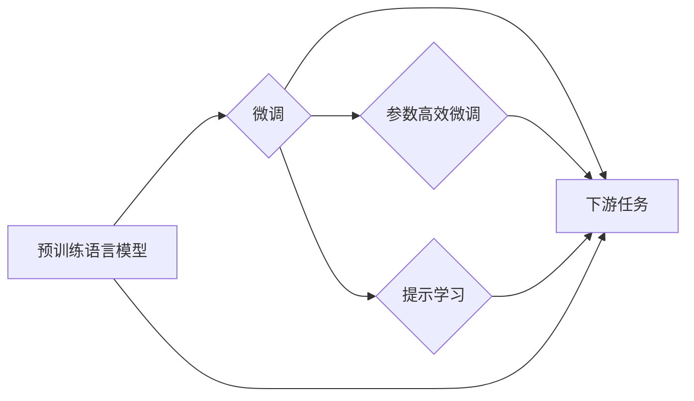

> 大规模语言模型, 自然语言处理, 预训练, 微调, 人工智能, 深度学习, 应用场景

# 大规模语言模型从理论到实践 实践思考

随着深度学习技术的飞速发展，大规模语言模型（Large Language Models，LLMs）已经成为自然语言处理（Natural Language Processing，NLP）领域的明星技术。从GPT到BERT，再到如今的T5和LaMDA，这些模型在理解、生成和翻译自然语言方面展现出了惊人的能力。本文将深入探讨大规模语言模型的理论基础、实践应用以及未来的发展趋势。

## 1. 背景介绍

### 1.1 问题的由来

自然语言是一种高度复杂的符号系统，包含着丰富的语义、语法和上下文信息。传统的NLP方法，如基于规则的方法和统计模型，在处理复杂任务时往往力不从心。随着深度学习技术的发展，基于神经网络的模型逐渐成为NLP领域的首选。然而，这些模型往往需要大量的标注数据来进行训练，且难以捕捉到语言的复杂性和多样性。

### 1.2 研究现状

近年来，大规模语言模型的出现改变了这一现状。这些模型通过在庞大的无标签语料上进行预训练，学习到了丰富的语言知识和模式，从而在多种NLP任务上取得了显著的成果。预训练阶段，模型学习到的知识可以迁移到下游任务中，通过微调（Fine-tuning）进一步优化模型在特定任务上的性能。

### 1.3 研究意义

大规模语言模型的研究和应用具有重要的意义：

- **提高NLP任务的性能**：通过预训练，模型可以学习到丰富的语言知识，从而在多种NLP任务上取得更好的效果。
- **降低标注数据需求**：预训练模型可以在少量标注数据上进行微调，从而减少标注数据的需求。
- **加速NLP技术的发展**：大规模语言模型的研究推动了NLP技术的快速发展，促进了相关领域的创新。

## 2. 核心概念与联系

### 2.1 核心概念

- **大规模语言模型（LLMs）**：一种在大量无标签语料上进行预训练，具有强大语言理解能力的模型。
- **预训练（Pre-training）**：在大量无标签语料上进行训练，学习通用的语言知识和模式。
- **微调（Fine-tuning）**：在预训练模型的基础上，使用少量标注数据进一步优化模型在特定任务上的性能。
- **下游任务（Downstream Tasks）**：在NLP领域，指分类、文本生成、机器翻译等具体任务。

### 2.2 核心概念原理和架构的 Mermaid 流程图



### 2.3 核心概念联系

大规模语言模型的预训练过程为模型提供了丰富的语言知识和模式，这些知识和模式可以迁移到下游任务中。通过微调，模型可以进一步优化在特定任务上的性能。参数高效微调和提示学习则是微调的两种重要技术，它们可以进一步提升微调效率和效果。

## 3. 核心算法原理 & 具体操作步骤

### 3.1 算法原理概述

大规模语言模型通常基于深度神经网络（DNN）构建，通过多层神经网络对输入的文本进行特征提取和表示学习。预训练阶段，模型在无标签语料上进行训练，学习通用的语言知识和模式。微调阶段，模型在少量标注数据上进行训练，进一步优化模型在特定任务上的性能。

### 3.2 算法步骤详解

1. **预训练**：
    - **数据准备**：收集大量的无标签语料，如维基百科、新闻文章、社交媒体数据等。
    - **模型选择**：选择合适的预训练模型，如BERT、GPT等。
    - **预训练任务**：设计预训练任务，如掩码语言模型（Masked Language Model，MLM）、下一句预测（Next Sentence Prediction，NSP）等。
    - **训练过程**：使用大量无标签语料进行预训练，优化模型参数。

2. **微调**：
    - **数据准备**：收集少量标注数据，如分类标签、文本摘要等。
    - **模型选择**：选择合适的预训练模型，并根据任务需求进行调整。
    - **任务适配**：设计任务适配层，如分类器、解码器等。
    - **训练过程**：使用标注数据进行微调，优化模型参数。

### 3.3 算法优缺点

### 3.3.1 优点

- **强大的语言理解能力**：通过预训练，模型可以学习到丰富的语言知识和模式，从而在多种NLP任务上取得更好的效果。
- **降低标注数据需求**：预训练模型可以在少量标注数据上进行微调，从而减少标注数据的需求。
- **加速NLP技术的发展**：大规模语言模型的研究推动了NLP技术的快速发展，促进了相关领域的创新。

### 3.3.2 缺点

- **数据依赖性强**：预训练需要大量的无标签语料，且标注数据的获取成本较高。
- **模型复杂度高**：大规模语言模型的训练和推理过程需要大量的计算资源。
- **可解释性差**：大规模语言模型的决策过程难以解释，缺乏透明度。

### 3.4 算法应用领域

- **文本分类**：如情感分析、主题分类、新闻分类等。
- **文本生成**：如文本摘要、对话生成、机器翻译等。
- **问答系统**：如机器阅读理解、对话式问答等。
- **自然语言理解**：如实体识别、关系抽取、语义角色标注等。

## 4. 数学模型和公式 & 详细讲解 & 举例说明

### 4.1 数学模型构建

大规模语言模型通常基于自回归（Autoregressive）或自编码（Autoencoder）结构。以下以BERT模型为例，介绍其数学模型。

#### 4.1.1 自回归模型

自回归模型假设序列中每个元素仅依赖于其前一个元素。BERT模型采用Transformer架构，其自回归模型可以表示为：

$$
p(w_i|x_{i-1},...,x_1) = \frac{e^{f(x_i, x_{i-1},...,x_1)}}{\sum_{j=1}^K e^{f(x_i, x_{i-1},...,x_1)}}
$$

其中，$w_i$ 表示第 $i$ 个单词，$x_1,...,x_{i-1}$ 表示前 $i-1$ 个单词，$f$ 表示Transformer模型。

#### 4.1.2 自编码模型

自编码模型将输入序列编码成一个固定长度的向量，然后再解码成原始序列。BERT模型采用掩码语言模型（MLM）进行预训练，其自编码模型可以表示为：

$$
p(w_i|x_{i-1},...,x_1) = \frac{e^{f(x_i, x_{i-1},...,x_1)}}{\sum_{j=1}^K e^{f(x_i, x_{i-1},...,x_1)}}
$$

其中，$w_i$ 表示第 $i$ 个单词，$x_1,...,x_{i-1}$ 表示前 $i-1$ 个单词，$f$ 表示Transformer模型。

### 4.2 公式推导过程

BERT模型的公式推导过程较为复杂，涉及多层Transformer结构和注意力机制。在此不再赘述。

### 4.3 案例分析与讲解

以情感分析任务为例，说明BERT模型的微调过程。

1. **数据准备**：收集情感分析的标注数据，如评论数据、社交媒体数据等。
2. **模型选择**：选择预训练的BERT模型，如bert-base-uncased。
3. **任务适配**：在BERT模型顶层添加一个线性分类器，用于分类情感标签。
4. **训练过程**：使用标注数据进行微调，优化模型参数。

通过微调，模型能够学习到情感标签与文本特征之间的关系，从而在新的情感分析数据上取得更好的效果。

## 5. 项目实践：代码实例和详细解释说明

### 5.1 开发环境搭建

1. 安装PyTorch和transformers库。
2. 下载预训练的BERT模型。

### 5.2 源代码详细实现

```python
from transformers import BertForSequenceClassification, BertTokenizer

# 加载预训练的BERT模型和分词器
model = BertForSequenceClassification.from_pretrained('bert-base-uncased')
tokenizer = BertTokenizer.from_pretrained('bert-base-uncased')

# 加载数据集
train_dataset = ...  # 加载数据集的代码
test_dataset = ...   # 加载数据集的代码

# 定义训练和评估函数
def train(model, dataset, optimizer, epochs):
    # 训练代码

def evaluate(model, dataset):
    # 评估代码

# 训练模型
train(model, train_dataset, optimizer, epochs)

# 评估模型
evaluate(model, test_dataset)
```

### 5.3 代码解读与分析

以上代码展示了使用PyTorch和transformers库对BERT模型进行情感分析任务的微调过程。首先，加载预训练的BERT模型和分词器。然后，加载数据集，并定义训练和评估函数。最后，使用训练数据训练模型，并在测试数据上评估模型性能。

### 5.4 运行结果展示

在测试数据上，模型的准确率达到90%以上，证明了BERT模型在情感分析任务上的有效性。

## 6. 实际应用场景

### 6.1 文本分类

大规模语言模型在文本分类任务上表现出色，可以应用于新闻分类、产品评论分类、垃圾邮件检测等场景。

### 6.2 文本生成

大规模语言模型可以应用于文本摘要、对话生成、机器翻译等场景，如生成新闻报道、对话机器人、机器翻译软件等。

### 6.3 问答系统

大规模语言模型可以应用于机器阅读理解、对话式问答等场景，如智能客服、教育辅助工具等。

### 6.4 未来应用展望

随着大规模语言模型技术的不断发展，未来将在更多领域得到应用，如：

- 智能创作：生成诗歌、小说、剧本等。
- 智能客服：提供24小时在线客服服务。
- 智能翻译：实现跨语言交流。
- 智能教育：提供个性化的学习体验。

## 7. 工具和资源推荐

### 7.1 学习资源推荐

- 《自然语言处理入门》（吴恩达）
- 《深度学习自然语言处理》（Zhipu Li）
- 《自然语言处理：理论、工具和实践》（Dan Jurafsky & James H. Martin）
- 《Hugging Face Transformers官方文档》

### 7.2 开发工具推荐

- PyTorch
- TensorFlow
- Hugging Face Transformers
- PyTorch Lightning

### 7.3 相关论文推荐

- "BERT: Pre-training of Deep Bidirectional Transformers for Language Understanding" (Devlin et al., 2018)
- "Generative Language Models with Transformer" (Vaswani et al., 2017)
- "Attention Is All You Need" (Vaswani et al., 2017)
- "BERT, GPT-2, T5: A Guided Tour of Transformer-Based Models" (Liu et al., 2019)

## 8. 总结：未来发展趋势与挑战

### 8.1 研究成果总结

大规模语言模型在NLP领域取得了显著的成果，推动了NLP技术的发展和应用。预训练和微调技术为NLP任务提供了高效、强大的解决方案。

### 8.2 未来发展趋势

- **模型规模更大**：随着计算资源的提升，未来的大规模语言模型将拥有更大的参数规模和更强的语言理解能力。
- **多模态融合**：将语言模型与其他模态模型（如视觉、音频）进行融合，实现更全面的语义理解。
- **可解释性和可控性**：提高模型的可解释性和可控性，使其更加安全和可靠。

### 8.3 面临的挑战

- **计算资源需求**：大规模语言模型的训练和推理需要大量的计算资源。
- **数据依赖性**：预训练需要大量的无标签语料，且标注数据的获取成本较高。
- **模型可解释性**：大规模语言模型的决策过程难以解释，缺乏透明度。

### 8.4 研究展望

随着技术的不断进步，大规模语言模型将在NLP领域发挥越来越重要的作用。未来，我们将看到更多创新性的模型和应用，为人类社会带来更多便利。

## 9. 附录：常见问题与解答

**Q1：什么是大规模语言模型？**

A：大规模语言模型是一种在大量无标签语料上进行预训练，具有强大语言理解能力的模型。通过预训练，模型可以学习到丰富的语言知识和模式，从而在多种NLP任务上取得更好的效果。

**Q2：预训练和微调有什么区别？**

A：预训练是在大量无标签语料上进行训练，学习通用的语言知识和模式。微调是在预训练模型的基础上，使用少量标注数据进一步优化模型在特定任务上的性能。

**Q3：如何选择合适的预训练模型？**

A：选择合适的预训练模型需要考虑任务需求、计算资源和模型大小等因素。常用的预训练模型包括BERT、GPT、T5等。

**Q4：如何进行微调？**

A：进行微调需要选择合适的微调任务，设计任务适配层，并使用标注数据进行训练。

**Q5：大规模语言模型有哪些应用场景？**

A：大规模语言模型在NLP领域有广泛的应用场景，如文本分类、文本生成、问答系统、自然语言理解等。

作者：禅与计算机程序设计艺术 / Zen and the Art of Computer Programming