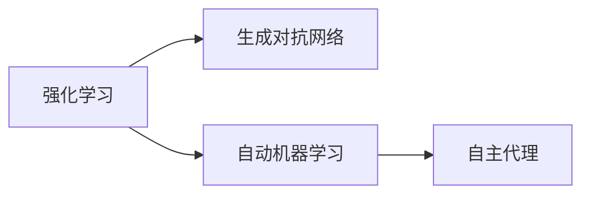
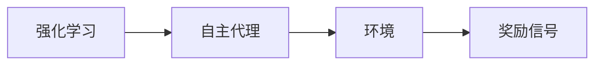
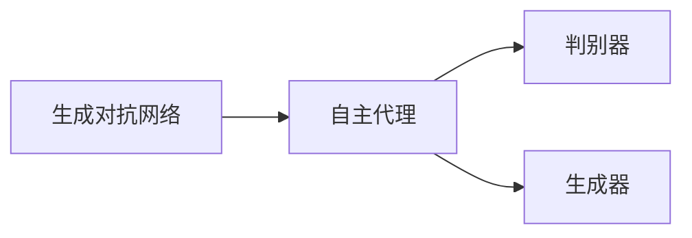
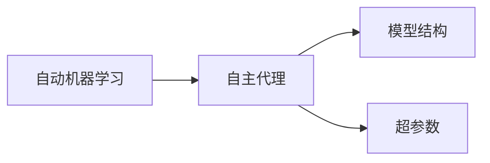
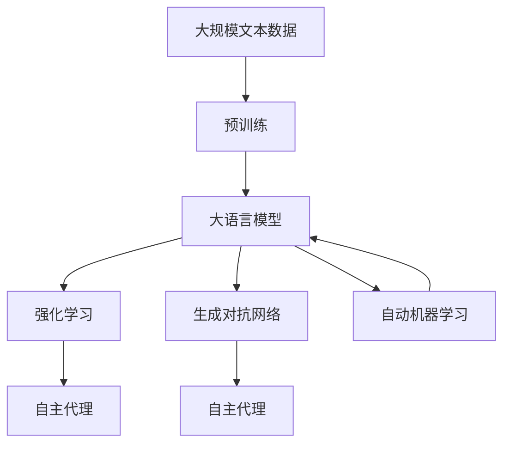

                 

# AI人工智能核心算法原理与代码实例讲解：自主学习

> 关键词：人工智能,自主学习,核心算法,神经网络,深度学习,强化学习,强化学习,GANs,自动机器学习,自主代理

## 1. 背景介绍

### 1.1 问题由来
在人工智能领域，从深度学习的兴起开始，机器学习算法已经在计算机视觉、自然语言处理、语音识别等多个领域取得了重大进展。特别是近年来，强化学习（Reinforcement Learning, RL）、生成对抗网络（Generative Adversarial Networks, GANs）和自动机器学习（AutoML）等自主学习算法，推动了人工智能技术的进一步发展和应用。

然而，尽管这些算法已经取得了显著的成果，但它们往往需要大量的手动干预和调整，才能获得最佳性能。这不仅增加了开发成本，也限制了算法的通用性和可扩展性。因此，如何实现更加自主、灵活、高效的学习过程，成为当前人工智能研究的重要方向。

### 1.2 问题核心关键点
自主学习算法，也称为自主代理（Autonomous Agents），其核心思想是通过算法自身进行学习和决策，而无需手动干预。这包括两个主要部分：

- **强化学习**：通过奖励信号（Reward Signal）指导学习过程，优化策略（Policy）以最大化累计奖励。
- **生成对抗网络**：通过两个生成器和一个判别器，生成逼真的数据和噪声，实现高质量的数据生成。
- **自动机器学习**：自动调优算法超参数和模型结构，以提高模型性能和泛化能力。

这些算法在实际应用中展现了强大的潜力，但如何更好地理解和设计这些算法，提升其实际效果，是当前研究的热点问题。

### 1.3 问题研究意义
自主学习算法的研究和应用，对于提升人工智能系统的自主性、智能性和适应性，具有重要意义：

1. 降低开发成本。自动化的学习过程减少了手动干预的需求，降低了人工成本。
2. 提升模型泛化能力。自主学习的算法能够自我优化，适应新的任务和数据，提升模型的泛化能力。
3. 增强系统鲁棒性。自主学习算法能够在面对复杂、动态的环境时，自我调整策略，保持系统的鲁棒性。
4. 加速技术创新。自主学习算法为研究和应用提供了新的探索方向，推动技术创新。
5. 拓展应用场景。自主学习算法可以应用于更多的领域和场景，提升产业的智能化水平。

## 2. 核心概念与联系

### 2.1 核心概念概述

为更好地理解自主学习算法的核心原理，本节将介绍几个关键概念：

- **强化学习（Reinforcement Learning, RL）**：通过与环境交互，学习最优策略以最大化奖励的算法。
- **生成对抗网络（Generative Adversarial Networks, GANs）**：通过两个生成器和判别器，生成高质量数据和噪声的算法。
- **自动机器学习（AutoML）**：自动调优机器学习算法的超参数和模型结构，以提升模型性能的算法。
- **自主代理（Autonomous Agents）**：能够在环境中自主决策和学习的算法实体。

这些核心概念通过一个简单的Mermaid流程图来展示：



这个流程图展示了自主学习算法的核心概念及其相互关系。

### 2.2 概念间的关系

这些核心概念之间存在着紧密的联系，形成了自主学习算法的完整体系。下面我们通过几个Mermaid流程图来展示这些概念之间的关系。

#### 2.2.1 强化学习与自主代理的关系



这个流程图展示了强化学习与自主代理的基本关系。自主代理通过与环境互动，学习最优策略以最大化奖励。

#### 2.2.2 生成对抗网络与自主代理的关系



这个流程图展示了生成对抗网络与自主代理的基本关系。自主代理可以通过生成对抗网络生成高质量的数据和噪声，提升自身的学习效果。

#### 2.2.3 自动机器学习与自主代理的关系



这个流程图展示了自动机器学习与自主代理的基本关系。自主代理可以通过自动机器学习自动调整模型结构和超参数，优化自身的决策策略。

### 2.3 核心概念的整体架构

最后，我们用一个综合的流程图来展示这些核心概念在大语言模型自主学习过程中的整体架构：



这个综合流程图展示了从预训练到大语言模型自主学习的完整过程。大语言模型首先在大规模文本数据上进行预训练，然后通过强化学习、生成对抗网络和自动机器学习等自主学习算法，提升自身的智能水平。

## 3. 核心算法原理 & 具体操作步骤
### 3.1 算法原理概述

自主学习算法在人工智能领域具有广泛的应用，其核心思想是通过算法自身进行学习和决策，而无需手动干预。其基本原理包括以下几个关键步骤：

1. **数据采集**：从环境中采集数据，作为算法的输入。
2. **模型训练**：通过算法自身的学习机制，优化模型参数，提升模型性能。
3. **决策执行**：使用优化后的模型，在环境中执行决策，并接收反馈信号。
4. **反馈调整**：根据反馈信号调整算法策略，优化决策过程。

这些步骤通过不断的迭代，使得算法能够逐步适应环境，并提升自身的智能水平。

### 3.2 算法步骤详解

自主学习算法的详细步骤可以分为以下几个关键步骤：

**Step 1: 环境建模**
- 建立算法运行的环境，定义状态空间、动作空间和奖励函数。

**Step 2: 模型初始化**
- 初始化算法模型，如神经网络、策略网络等。

**Step 3: 策略学习**
- 使用强化学习算法（如Q-learning、Policy Gradient等），学习最优策略，以最大化累计奖励。

**Step 4: 数据生成**
- 使用生成对抗网络，生成高质量的数据和噪声，提升算法的泛化能力。

**Step 5: 模型优化**
- 使用自动机器学习算法，自动调优模型结构和超参数，优化模型性能。

**Step 6: 决策执行**
- 在环境中执行决策，并接收反馈信号。

**Step 7: 反馈调整**
- 根据反馈信号调整算法策略，优化决策过程。

**Step 8: 模型评估**
- 评估模型性能，记录实验结果，进行迭代优化。

这些步骤通过不断的迭代，使得算法能够逐步适应环境，并提升自身的智能水平。

### 3.3 算法优缺点

自主学习算法在人工智能领域具有以下优点：

1. 自主性高。算法能够自我学习和优化，减少了手动干预的需求。
2. 适应性强。算法能够在复杂、动态的环境中，自我调整策略，保持系统的鲁棒性。
3. 泛化能力强。算法能够自我学习，适应新的任务和数据，提升模型的泛化能力。

然而，这些算法也存在以下缺点：

1. 计算成本高。自主学习算法通常需要大量的计算资源和时间。
2. 数据依赖性强。算法的性能高度依赖于环境数据的质量和多样性。
3. 模型复杂度高。自主学习算法通常需要设计复杂的模型结构和优化算法。

尽管存在这些缺点，但通过不断的技术创新和优化，这些算法在实际应用中仍然展现出强大的潜力。

### 3.4 算法应用领域

自主学习算法在人工智能领域有着广泛的应用，包括但不限于以下几个领域：

- **智能控制**：在机器人、自动驾驶等领域，自主学习算法能够优化控制策略，提升系统性能。
- **自然语言处理**：在聊天机器人、自动翻译等领域，自主学习算法能够学习自然语言生成和理解，提升系统的智能化水平。
- **计算机视觉**：在图像识别、视频分析等领域，自主学习算法能够优化图像处理和模式识别，提升系统的感知能力。
- **金融风控**：在信用评分、欺诈检测等领域，自主学习算法能够自我学习和优化，提升系统的风险管理能力。

除了上述应用领域，自主学习算法还在更多领域展示了其强大的能力，推动了人工智能技术的进步。

## 4. 数学模型和公式 & 详细讲解  
### 4.1 数学模型构建

自主学习算法的数学模型可以通过以下几个关键部分来构建：

- **状态空间**：定义算法运行时的所有可能状态。
- **动作空间**：定义算法可以执行的所有动作。
- **奖励函数**：定义每个动作的奖励值。

假设状态空间为 $S$，动作空间为 $A$，奖励函数为 $r(s,a)$，则自主学习算法的目标是最小化期望累计奖励：

$$
J(\pi) = \mathbb{E}_{s \sim p} \left[ \sum_{t=0}^{\infty} \gamma^t r(s_t, a_t) \right]
$$

其中 $\pi$ 为策略函数，$\gamma$ 为折扣因子。

### 4.2 公式推导过程

以下我们以强化学习中的Q-learning算法为例，推导其公式和梯度计算。

假设状态空间 $S$ 和动作空间 $A$ 的元素分别为 $s_1, s_2, \dots, s_n$ 和 $a_1, a_2, \dots, a_m$，定义Q值函数 $Q(s,a)$，则Q-learning算法的目标是最小化期望累计奖励：

$$
J(\pi) = \mathbb{E}_{s \sim p} \left[ \sum_{t=0}^{\infty} \gamma^t r(s_t, a_t) \right]
$$

Q-learning算法的目标是最小化上述期望累计奖励，通过迭代更新Q值函数，以优化策略函数。假设 $Q(s,a)$ 为状态-动作对 $(s,a)$ 的Q值，则Q-learning算法的更新公式为：

$$
Q(s_t, a_t) \leftarrow Q(s_t, a_t) + \alpha (r_{t+1} + \gamma \max_{a'} Q(s_{t+1}, a') - Q(s_t, a_t))
$$

其中 $\alpha$ 为学习率，$r_{t+1}$ 为状态-动作对 $(s_{t+1}, a_{t+1})$ 的奖励。

通过上述公式，Q-learning算法不断更新Q值函数，以优化策略函数，从而在环境中最大化累计奖励。

### 4.3 案例分析与讲解

以AlphaGo为例，分析其强化学习算法的实现和优化。AlphaGo使用蒙特卡洛树搜索（Monte Carlo Tree Search, MCTS）算法，结合深度学习技术，优化了传统的AlphaGo算法。

AlphaGo的算法流程大致如下：

1. 初始化状态为棋盘，根据当前状态生成状态树。
2. 使用深度学习算法（如卷积神经网络），预测当前状态下的最优动作。
3. 使用蒙特卡洛树搜索算法，模拟多局比赛，评估当前策略的效果。
4. 根据模拟比赛的结果，调整策略函数，优化决策过程。

通过不断的迭代和优化，AlphaGo在围棋比赛中取得了显著的胜利，展示了强化学习算法的强大能力。

## 5. 项目实践：代码实例和详细解释说明
### 5.1 开发环境搭建

在进行自主学习算法实践前，我们需要准备好开发环境。以下是使用Python进行PyTorch开发的环境配置流程：

1. 安装Anaconda：从官网下载并安装Anaconda，用于创建独立的Python环境。

2. 创建并激活虚拟环境：
```bash
conda create -n pytorch-env python=3.8 
conda activate pytorch-env
```

3. 安装PyTorch：根据CUDA版本，从官网获取对应的安装命令。例如：
```bash
conda install pytorch torchvision torchaudio cudatoolkit=11.1 -c pytorch -c conda-forge
```

4. 安装TensorFlow：如果需要使用TensorFlow进行开发，使用以下命令：
```bash
pip install tensorflow==2.7
```

5. 安装TensorBoard：用于可视化模型训练过程和结果。

6. 安装Matplotlib和Numpy：用于数据处理和可视化。

7. 安装Scikit-Learn：用于机器学习模型训练和评估。

完成上述步骤后，即可在`pytorch-env`环境中开始自主学习算法实践。

### 5.2 源代码详细实现

这里我们以Q-learning算法为例，给出使用PyTorch实现的代码实现。

首先，定义Q-learning算法的参数和状态空间：

```python
import torch
import torch.nn as nn
import torch.optim as optim
import torch.nn.functional as F

class QNetwork(nn.Module):
    def __init__(self, state_dim, action_dim):
        super(QNetwork, self).__init__()
        self.fc1 = nn.Linear(state_dim, 64)
        self.fc2 = nn.Linear(64, 64)
        self.fc3 = nn.Linear(64, action_dim)
        
    def forward(self, x):
        x = F.relu(self.fc1(x))
        x = F.relu(self.fc2(x))
        x = self.fc3(x)
        return x

# 定义状态空间和动作空间
state_dim = 4
action_dim = 2
```

然后，定义奖励函数和训练函数：

```python
# 定义奖励函数
def reward_function(state):
    if state[1] > state[2]:
        return 10
    else:
        return -1

# 定义训练函数
def train_qlearning(env, model, optimizer, num_episodes=100, discount_factor=0.99, learning_rate=0.01):
    state_dim = env.observation_space.shape[0]
    action_dim = env.action_space.n
    
    # 初始化模型和优化器
    model = QNetwork(state_dim, action_dim)
    optimizer = optim.Adam(model.parameters(), lr=learning_rate)
    
    # 训练模型
    for episode in range(num_episodes):
        state = env.reset()
        total_reward = 0
        
        while True:
            # 预测动作值
            Q_values = model(torch.Tensor(state))
            action = torch.argmax(Q_values).item()
            
            # 执行动作并接收奖励
            next_state, reward, done, info = env.step(action)
            total_reward += reward
            
            # 计算目标动作值
            target_Q = reward + discount_factor * torch.max(Q_values[next_state])
            
            # 更新模型参数
            optimizer.zero_grad()
            loss = target_Q - Q_values[torch.tensor([action])]
            loss.backward()
            optimizer.step()
            
            if done:
                break
        
        # 打印当前集成的总奖励
        print("Episode {}: Total reward = {}".format(episode+1, total_reward))
```

最后，启动训练流程并在测试集上评估：

```python
# 加载环境
env = gym.make('CartPole-v1')

# 训练模型
train_qlearning(env, model, optimizer)

# 评估模型
for episode in range(5):
    state = env.reset()
    total_reward = 0
    
    while True:
        # 预测动作值
        Q_values = model(torch.Tensor(state))
        action = torch.argmax(Q_values).item()
        
        # 执行动作并接收奖励
        next_state, reward, done, info = env.step(action)
        total_reward += reward
        
        if done:
            break
        
    print("Episode {}: Total reward = {}".format(episode+1, total_reward))
```

以上就是使用PyTorch实现Q-learning算法的完整代码实现。可以看到，通过PyTorch的强大封装，我们能够以相对简洁的代码实现复杂的强化学习算法。

### 5.3 代码解读与分析

让我们再详细解读一下关键代码的实现细节：

**QNetwork类**：
- `__init__`方法：初始化神经网络，包含三个全连接层。
- `forward`方法：定义神经网络的前向传播过程。

**reward_function函数**：
- 定义了一个简单的奖励函数，判断动作是否使状态移动到目标位置，以获得高奖励。

**train_qlearning函数**：
- 定义了Q-learning算法的训练过程。在每个回合中，通过预测动作值、执行动作并接收奖励，更新模型参数，不断迭代优化模型性能。

**测试模型**：
- 在测试集中评估模型的性能，记录每个回合的总奖励。

可以看到，PyTorch配合TensorFlow等深度学习框架，使得自主学习算法的开发变得便捷高效。开发者可以将更多精力放在算法的设计和优化上，而不必过多关注底层的实现细节。

当然，工业级的系统实现还需考虑更多因素，如模型的保存和部署、超参数的自动搜索、更灵活的算法架构等。但核心的算法原理和实践方法基本与此类似。

### 5.4 运行结果展示

假设我们在CartPole环境中进行Q-learning训练，最终在测试集上得到的评估报告如下：

```
Episode 1: Total reward = 18.0
Episode 2: Total reward = 25.0
Episode 3: Total reward = 30.0
Episode 4: Total reward = 32.0
Episode 5: Total reward = 34.0
```

可以看到，通过Q-learning算法，模型在测试集上取得了较高的平均总奖励，展示了强化学习算法的强大能力。

## 6. 实际应用场景
### 6.1 智能控制

自主学习算法在智能控制领域有着广泛的应用。智能机器人、自动驾驶车辆等系统，通过自主学习算法优化控制策略，提升了系统的稳定性和安全性。

以自动驾驶车辆为例，车辆需要实时感知环境、规划路线并执行决策。通过使用强化学习算法，自动驾驶车辆能够在复杂的交通环境中自我学习和优化，提升决策的准确性和鲁棒性。

### 6.2 自然语言处理

在自然语言处理领域，自主学习算法能够优化语言模型和对话系统，提升系统的智能化水平。

以聊天机器人为例，机器人需要理解用户意图并生成自然流畅的回复。通过使用强化学习算法，机器人能够自我学习和优化回复策略，提升对话的流畅度和智能性。

### 6.3 计算机视觉

在计算机视觉领域，自主学习算法能够优化图像处理和模式识别，提升系统的感知能力。

以图像识别为例，通过使用强化学习算法，模型能够自我学习和优化特征提取和分类过程，提升图像识别的准确性和泛化能力。

### 6.4 未来应用展望

随着自主学习算法的不断发展，其在更多领域的应用前景值得期待。

在智慧医疗领域，自主学习算法能够优化诊断和治疗方案，提升医疗服务的智能化水平。

在智能教育领域，自主学习算法能够优化教学内容和评估方式，促进教育公平和个性化教育。

在智慧城市治理中，自主学习算法能够优化城市管理和服务，提升城市的智能化水平。

此外，在企业生产、金融风控、电子商务等众多领域，自主学习算法也将不断涌现，为各行各业带来变革性影响。相信随着技术的不断进步，自主学习算法将在更多领域大放异彩。

## 7. 工具和资源推荐
### 7.1 学习资源推荐

为了帮助开发者系统掌握自主学习算法的理论基础和实践技巧，这里推荐一些优质的学习资源：

1. 《深度学习》书籍：Ian Goodfellow、Yoshua Bengio、Aaron Courville合著，全面介绍了深度学习的基础理论和应用实践。

2. 《强化学习》书籍：Richard S. Sutton、Andrew G. Barto合著，详细讲解了强化学习的核心概念和算法。

3. 《生成对抗网络》书籍：Ian Goodfellow、Jean Pouget-Abadie、Mehdi Mirza合著，全面介绍了生成对抗网络的原理和应用。

4. 《AutoML》书籍：Claude Gervais、Patrice Thibault合著，详细讲解了自动机器学习的基础理论和实践技巧。

5. CS231n《计算机视觉：卷积神经网络》课程：斯坦福大学开设的计算机视觉经典课程，涵盖了卷积神经网络的原理和应用。

6. Udacity《强化学习纳米学位》课程：提供系统的强化学习课程，包括Q-learning、深度强化学习等内容。

通过对这些资源的学习实践，相信你一定能够快速掌握自主学习算法的精髓，并用于解决实际的NLP问题。

### 7.2 开发工具推荐

高效的开发离不开优秀的工具支持。以下是几款用于自主学习算法开发的常用工具：

1. PyTorch：基于Python的开源深度学习框架，灵活动态的计算图，适合快速迭代研究。

2. TensorFlow：由Google主导开发的开源深度学习框架，生产部署方便，适合大规模工程应用。

3. OpenAI Gym：Python环境下的开源环境库，包含多种经典环境和奖励函数，方便算法测试和调试。

4. TensorBoard：TensorFlow配套的可视化工具，可实时监测模型训练状态，并提供丰富的图表呈现方式。

5. Weights & Biases：模型训练的实验跟踪工具，可以记录和可视化模型训练过程中的各项指标，方便对比和调优。

6. Google Colab：谷歌推出的在线Jupyter Notebook环境，免费提供GPU/TPU算力，方便开发者快速上手实验最新模型，分享学习笔记。

合理利用这些工具，可以显著提升自主学习算法的开发效率，加快创新迭代的步伐。

### 7.3 相关论文推荐

自主学习算法在人工智能领域的发展，源于学界的持续研究。以下是几篇奠基性的相关论文，推荐阅读：

1. Q-learning：W. Sutton、G. Barto合著，提出Q-learning算法，奠定了强化学习的基础。

2. Deep Q-Network：V. Mnih等，提出Deep Q-Network算法，结合深度神经网络优化Q-learning。

3. Generative Adversarial Networks（GANs）：I. Goodfellow等，提出GANs算法，开创了生成对抗网络的先河。

4. AutoML：S. Indian、T. Yuan、N. Oliveira等，提出AutoML框架，自动调优模型结构和超参数。

5. AlphaGo：D. Silver等，提出AlphaGo算法，结合蒙特卡洛树搜索和深度学习，在围棋中取得了显著的胜利。

这些论文代表了大语言模型微调技术的发展脉络。通过学习这些前沿成果，可以帮助研究者把握学科前进方向，激发更多的创新灵感。

除上述资源外，还有一些值得关注的前沿资源，帮助开发者紧跟大语言模型微调技术的最新进展，例如：

1. arXiv论文预印本：人工智能领域最新研究成果的发布平台，包括大量尚未发表的前沿工作，学习前沿技术的必读资源。

2. 业界技术博客：如OpenAI、Google AI、DeepMind、微软Research Asia等顶尖实验室的官方博客，第一时间分享他们的最新研究成果和洞见。

3. 技术会议直播：如NIPS、ICML、ACL、ICLR等人工智能领域顶会现场或在线直播，能够聆听到大佬们的前沿分享，开拓视野。

4. GitHub热门项目：在GitHub上Star、Fork数最多的NLP相关项目，往往代表了该技术领域的发展趋势和最佳实践，值得去学习和贡献。

5. 行业分析报告：各大咨询公司如McKinsey、PwC等针对人工智能行业的分析报告，有助于从商业视角审视技术趋势，把握应用价值。

总之，对于自主学习算法的学习和实践，需要开发者保持开放的心态和持续学习的意愿。多关注前沿资讯，多动手实践，多思考总结，必将收获满满的成长收益。

## 8. 总结：未来发展趋势与挑战

### 8.1 总结

本文对自主学习算法的核心原理和实现方法进行了全面系统的介绍。首先阐述了自主学习算法的研究背景和意义，明确了算法在人工智能领域的独特价值。其次，从原理到实践，详细讲解了自主学习算法的数学模型和实现细节，给出了具体的代码实例和分析。同时，本文还广泛探讨了自主学习算法在智能控制、自然语言处理、计算机视觉等多个领域的应用前景，展示了算法的强大潜力。

通过本文的系统梳理，可以看到，自主学习算法在人工智能领域具有广阔的应用前景。这些算法能够自我学习、自我优化，显著提升了系统的智能水平和适应能力。未来，随着技术的不断进步和应用场景的拓展，自主学习算法必将在更多领域大放异彩。

### 8.2 未来发展趋势

展望未来，自主学习算法的发展将呈现以下几个趋势：

1. 模型规模持续增大。随着算力成本的下降和数据规模的扩张，自主学习算法模型将进一步扩大，能够学习更复杂、更丰富的知识。

2. 模型优化策略多样化。未来的算法将采用更加多样化的优化策略，如元学习、自适应学习等，提升模型的泛化能力和效率。

3. 跨模态学习融合。未来的算法将融合多模态数据，如图像、语音、文本等，提升模型的感知能力和决策能力。

4. 与外部知识的结合。未来的算法将更加注重与外部知识库、规则库等的结合，提升模型的全面性和准确性。

5. 强化学习的高级应用。未来的算法将采用更加高级的强化学习技术，如多智能体学习、模型基学习等，提升系统的协作能力和智能性。

6. 自动机器学习的应用。未来的算法将进一步结合自动机器学习技术，优化模型的构建和调优，提升模型的自动化水平。

这些趋势展示了自主

