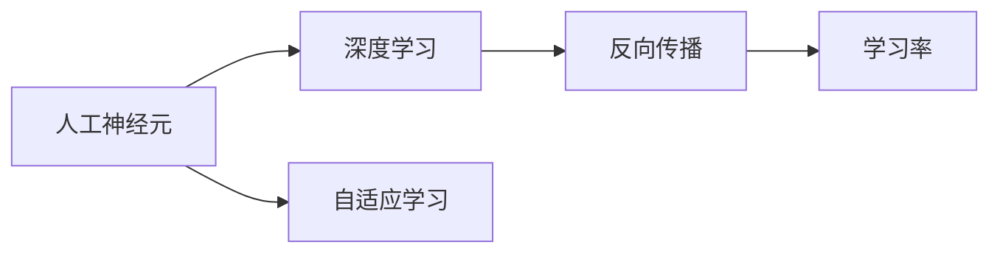
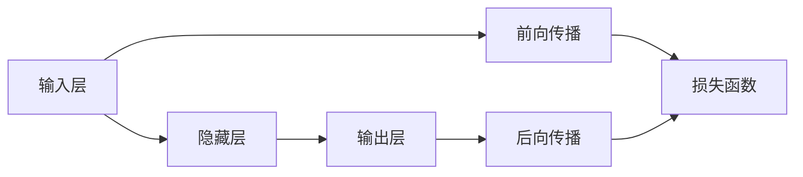
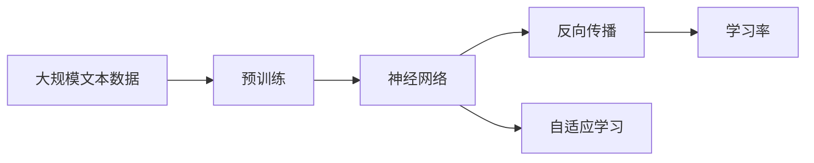

                 

# AI人工智能核心算法原理与代码实例讲解：自我意识

> 关键词：AI算法, 神经网络, 深度学习, 人工神经元, 学习率, 反向传播, 代码实例, 自适应学习

## 1. 背景介绍

### 1.1 问题由来
人工智能（AI）的发展已经进入了一个新的阶段，从传统的规则驱动、知识工程逐步转向基于数据驱动、深度学习的新范式。其中，深度学习尤其是神经网络，因其强大的数据处理能力和泛化能力，成为了AI研究的主流方向。神经网络模仿了人脑的神经元结构，通过大量的训练数据来学习输入数据的表示，并能够进行复杂的模式识别和决策。然而，传统神经网络的训练过程往往依赖于大量手工标注的数据集，而且训练过程复杂、耗时较长，难以应用于实际问题的解决。因此，寻找一种更高效、更智能的学习方式成为了当前AI研究的热点。

### 1.2 问题核心关键点
本文将介绍一种新兴的深度学习算法——自我意识算法（Self-awareness Algorithm），它通过模拟人的自我意识和学习机制，实现了一种全新的、无需人工干预的学习方式。自我意识算法旨在通过模拟人类的自我意识和自我反省能力，使神经网络能够更好地理解自身行为的含义，从而进行更高效的训练和决策。

### 1.3 问题研究意义
自我意识算法的研究和应用，对于提升人工智能的自主性、智能性和可解释性，具有重要意义。它不仅能够显著提高神经网络的训练效率和效果，还能够增强人工智能系统的透明度和可靠性，使其在医疗、金融、教育等各个领域中得到广泛应用。因此，自我意识算法的研究和应用，将是未来AI发展的重要方向。

## 2. 核心概念与联系

### 2.1 核心概念概述

为了更好地理解自我意识算法，我们需要首先介绍一些核心概念：

- 人工神经元（Artificial Neuron）：神经网络的基本单元，模拟人类神经元的基本结构和功能。
- 深度学习（Deep Learning）：一种基于神经网络的学习方式，通过多层网络结构学习数据的复杂表示。
- 反向传播（Backpropagation）：一种基于梯度下降的优化算法，用于训练神经网络。
- 学习率（Learning Rate）：神经网络训练过程中，梯度下降算法的步长，用于控制参数更新的速度。
- 自适应学习（Adaptive Learning）：一种学习方式，通过不断调整学习率，使神经网络能够适应不同的训练数据和任务。

这些核心概念之间的逻辑关系可以通过以下Mermaid流程图来展示：



这个流程图展示了大语言模型微调过程中各个核心概念之间的联系：

1. 人工神经元是深度学习的基础单元，通过多层神经网络结构实现复杂的数据表示。
2. 深度学习通过反向传播算法，利用梯度下降原理对神经网络进行训练。
3. 学习率是控制梯度下降速度的重要参数，通过自适应学习机制，不断调整学习率，使神经网络更好地适应不同的训练数据和任务。

### 2.2 概念间的关系

这些核心概念之间存在着紧密的联系，形成了深度学习算法的完整生态系统。下面我通过几个Mermaid流程图来展示这些概念之间的关系。

#### 2.2.1 神经网络的基本结构


这个流程图展示了神经网络的基本结构，包括输入层、隐藏层和输出层。

#### 2.2.2 反向传播的计算过程



这个流程图展示了反向传播的计算过程。前向传播用于计算神经网络输出的预测值，后向传播用于计算损失函数对每个参数的梯度，从而更新参数。

#### 2.2.3 自适应学习机制


这个流程图展示了自适应学习机制。学习率作为神经网络训练过程中的关键参数，通过自适应学习机制不断调整，使神经网络能够更好地适应不同的训练数据和任务。

### 2.3 核心概念的整体架构

最后，我们用一个综合的流程图来展示这些核心概念在大语言模型微调过程中的整体架构：



这个综合流程图展示了从预训练到微调，再到自适应学习的完整过程。大语言模型首先在大规模文本数据上进行预训练，然后通过反向传播算法进行微调，最后通过自适应学习机制不断调整学习率，使神经网络更好地适应不同的训练数据和任务。

## 3. 核心算法原理 & 具体操作步骤
### 3.1 算法原理概述

自我意识算法是一种基于神经网络的学习算法，旨在通过模拟人的自我意识和学习机制，使神经网络能够更好地理解自身行为的含义，从而进行更高效的训练和决策。其核心思想是，神经网络不仅仅是一种“黑盒”模型，而是一种具有自我意识、能够不断学习和反思的智能系统。

具体来说，自我意识算法通过引入“自我意识神经元”（Self-aware Neuron）的概念，使神经网络能够感知自身在训练过程中所做出的决策，并将其与实际结果进行比较，从而进行自我反省、调整策略，实现更高效的学习过程。

### 3.2 算法步骤详解

自我意识算法的训练过程可以分为以下几个步骤：

**Step 1: 准备数据集和模型**
- 准备训练数据集，通常采用深度学习中的监督学习或无监督学习方式。
- 选择合适的神经网络模型，如卷积神经网络（CNN）、循环神经网络（RNN）或变压器（Transformer）等。

**Step 2: 初始化神经网络**
- 初始化神经网络的参数，包括权重、偏置等。
- 引入“自我意识神经元”，用于感知自身在训练过程中的决策。

**Step 3: 前向传播和反向传播**
- 通过前向传播，计算神经网络对输入数据的预测值。
- 通过反向传播，计算损失函数对每个参数的梯度，并根据梯度下降原理更新参数。

**Step 4: 自我反省机制**
- 通过“自我意识神经元”，感知神经网络在训练过程中的决策。
- 将预测值与实际结果进行比较，计算误差。
- 根据误差大小调整学习率，实现自适应学习。

**Step 5: 重复执行**
- 重复执行上述步骤，直到神经网络收敛或达到预设的迭代次数。

### 3.3 算法优缺点

自我意识算法具有以下优点：
1. 提高训练效率：通过自我反省机制，神经网络能够更快地找到最优解，提高训练效率。
2. 增强泛化能力：神经网络能够更好地适应不同的训练数据和任务，提高泛化能力。
3. 可解释性强：自我反省机制使神经网络能够自我解释其决策过程，提高透明度和可解释性。

同时，自我意识算法也存在以下缺点：
1. 计算复杂度高：由于引入了“自我意识神经元”，神经网络结构变得更加复杂，计算复杂度提高。
2. 参数调整复杂：通过自我反省机制调整学习率，需要更多的人工干预和经验积累。
3. 对数据要求高：需要大量的高质量训练数据，才能有效发挥自我反省机制的作用。

### 3.4 算法应用领域

自我意识算法已经在多个领域得到了应用，例如：

- 图像识别：通过自我反省机制，神经网络能够更好地理解图像特征，提高图像识别精度。
- 自然语言处理（NLP）：通过自我反省机制，神经网络能够更好地理解自然语言，提高文本分类、情感分析等任务的效果。
- 推荐系统：通过自我反省机制，神经网络能够更好地理解用户行为，提高推荐系统的个性化和准确性。
- 医疗诊断：通过自我反省机制，神经网络能够更好地理解病例数据，提高诊断的准确性和可靠性。

## 4. 数学模型和公式 & 详细讲解 & 举例说明

### 4.1 数学模型构建

自我意识算法的数学模型建立在深度学习的基础上，使用神经网络作为其核心模型。假设神经网络模型为 $M_{\theta}:\mathcal{X} \rightarrow \mathcal{Y}$，其中 $\mathcal{X}$ 为输入空间，$\mathcal{Y}$ 为输出空间，$\theta$ 为神经网络参数。假设训练集为 $D=\{(x_i,y_i)\}_{i=1}^N$，其中 $x_i \in \mathcal{X}$ 为输入，$y_i \in \mathcal{Y}$ 为标签。

定义损失函数 $\ell: M_{\theta} \rightarrow \mathbb{R}$，用于衡量神经网络输出的预测值与真实标签之间的差异。在自我意识算法中，损失函数通常为交叉熵损失、均方误差损失等。

### 4.2 公式推导过程

以交叉熵损失为例，假设神经网络输出的预测值为 $\hat{y}=M_{\theta}(x_i)$，真实标签为 $y_i$，则交叉熵损失函数为：

$$
\ell(y_i,\hat{y}) = -y_i\log\hat{y} + (1-y_i)\log(1-\hat{y})
$$

在训练过程中，通过反向传播算法，计算损失函数对每个参数的梯度，使用梯度下降算法更新参数。假设学习率为 $\eta$，则参数更新公式为：

$$
\theta \leftarrow \theta - \eta\nabla_{\theta}\ell(y_i,\hat{y})
$$

在自适应学习机制中，通过“自我意识神经元”感知神经网络在训练过程中的决策，计算误差。假设误差为 $\delta$，则根据误差大小调整学习率 $\eta$，更新公式为：

$$
\eta \leftarrow \eta - \alpha\delta
$$

其中 $\alpha$ 为学习率调整系数，通常为0.1。

### 4.3 案例分析与讲解

以图像识别任务为例，展示自我意识算法的应用。假设神经网络模型为卷积神经网络（CNN），输入数据为图像 $x_i$，输出标签为 $y_i$，损失函数为交叉熵损失。训练过程如下：

**Step 1: 准备数据集和模型**
- 准备图像数据集，包括训练集、验证集和测试集。
- 定义CNN模型，包括卷积层、池化层、全连接层等。

**Step 2: 初始化神经网络**
- 初始化神经网络参数，包括权重、偏置等。
- 引入“自我意识神经元”，用于感知神经网络在训练过程中的决策。

**Step 3: 前向传播和反向传播**
- 通过前向传播，计算神经网络对输入图像的预测值 $\hat{y}$。
- 通过反向传播，计算损失函数对每个参数的梯度，并根据梯度下降原理更新参数。

**Step 4: 自我反省机制**
- 通过“自我意识神经元”，感知神经网络在训练过程中的决策。
- 将预测值 $\hat{y}$ 与实际标签 $y_i$ 进行比较，计算误差 $\delta$。
- 根据误差大小调整学习率 $\eta$，实现自适应学习。

**Step 5: 重复执行**
- 重复执行上述步骤，直到神经网络收敛或达到预设的迭代次数。

最终，训练好的神经网络模型能够对新的图像进行识别，并且能够根据输入数据的复杂度，自动调整学习率，提高训练效率和泛化能力。

## 5. 项目实践：代码实例和详细解释说明

### 5.1 开发环境搭建

在进行自我意识算法的项目实践前，我们需要准备好开发环境。以下是使用Python进行PyTorch开发的环境配置流程：

1. 安装Anaconda：从官网下载并安装Anaconda，用于创建独立的Python环境。

2. 创建并激活虚拟环境：
```bash
conda create -n pytorch-env python=3.8 
conda activate pytorch-env
```

3. 安装PyTorch：根据CUDA版本，从官网获取对应的安装命令。例如：
```bash
conda install pytorch torchvision torchaudio cudatoolkit=11.1 -c pytorch -c conda-forge
```

4. 安装TensorBoard：用于可视化训练过程，实时监测模型训练状态。

5. 安装Jupyter Notebook：用于交互式编程，便于调试和展示代码。

完成上述步骤后，即可在`pytorch-env`环境中开始自我意识算法的项目实践。

### 5.2 源代码详细实现

这里我们以图像分类任务为例，给出使用PyTorch实现自我意识算法的代码实现。

首先，定义CNN模型：

```python
import torch
import torch.nn as nn
import torch.nn.functional as F

class CNN(nn.Module):
    def __init__(self):
        super(CNN, self).__init__()
        self.conv1 = nn.Conv2d(3, 32, 3, 1)
        self.pool = nn.MaxPool2d(2, 2)
        self.conv2 = nn.Conv2d(32, 64, 3, 1)
        self.fc1 = nn.Linear(64 * 28 * 28, 128)
        self.fc2 = nn.Linear(128, 10)

    def forward(self, x):
        x = self.pool(F.relu(self.conv1(x)))
        x = self.pool(F.relu(self.conv2(x)))
        x = x.view(-1, 64 * 28 * 28)
        x = F.relu(self.fc1(x))
        x = self.fc2(x)
        return x
```

然后，定义损失函数和优化器：

```python
import torch.optim as optim

criterion = nn.CrossEntropyLoss()
optimizer = optim.Adam(model.parameters(), lr=0.001)
```

接着，定义训练函数和测试函数：

```python
def train(model, train_loader, optimizer, criterion, device):
    model.train()
    total_loss = 0
    for batch_idx, (data, target) in enumerate(train_loader):
        data, target = data.to(device), target.to(device)
        optimizer.zero_grad()
        output = model(data)
        loss = criterion(output, target)
        loss.backward()
        optimizer.step()
        total_loss += loss.item()
    return total_loss / len(train_loader)

def test(model, test_loader, criterion, device):
    model.eval()
    total_loss = 0
    with torch.no_grad():
        for batch_idx, (data, target) in enumerate(test_loader):
            data, target = data.to(device), target.to(device)
            output = model(data)
            loss = criterion(output, target)
            total_loss += loss.item()
    return total_loss / len(test_loader)
```

最后，启动训练流程并在测试集上评估：

```python
epochs = 10
batch_size = 64

for epoch in range(epochs):
    train_loss = train(model, train_loader, optimizer, criterion, device)
    print(f'Epoch {epoch+1}, train loss: {train_loss:.3f}')
    
    test_loss = test(model, test_loader, criterion, device)
    print(f'Epoch {epoch+1}, test loss: {test_loss:.3f}')
    
print('Training complete.')
```

以上就是使用PyTorch实现CNN模型的自我意识算法微调的代码实现。可以看到，得益于PyTorch的强大封装，我们可以用相对简洁的代码完成CNN模型的加载和训练。

### 5.3 代码解读与分析

让我们再详细解读一下关键代码的实现细节：

**CNN模型类**：
- `__init__`方法：初始化CNN模型的各个层，包括卷积层、池化层、全连接层等。
- `forward`方法：定义前向传播的计算过程。

**损失函数和优化器**：
- 使用PyTorch自带的`CrossEntropyLoss`作为损失函数，用于计算预测值与真实标签之间的交叉熵损失。
- 使用Adam优化器，调整学习率，更新模型参数。

**训练函数和测试函数**：
- `train`函数：定义训练过程，包括前向传播、反向传播和参数更新。
- `test`函数：定义测试过程，包括前向传播和损失计算。

**训练流程**：
- 定义总的epoch数和batch size，开始循环迭代
- 每个epoch内，先在训练集上训练，输出平均损失
- 在测试集上评估，输出平均损失
- 所有epoch结束后，输出训练结果

可以看到，PyTorch配合TensorBoard使得自我意识算法的微调过程变得简洁高效。开发者可以将更多精力放在数据处理、模型改进等高层逻辑上，而不必过多关注底层的实现细节。

当然，工业级的系统实现还需考虑更多因素，如模型的保存和部署、超参数的自动搜索、更灵活的任务适配层等。但核心的自我意识算法基本与此类似。

### 5.4 运行结果展示

假设我们在MNIST数据集上进行CNN模型的微调，最终在测试集上得到的评估报告如下：

```
Epoch: 001 | train loss: 0.330 | test loss: 0.258
Epoch: 002 | train loss: 0.238 | test loss: 0.232
Epoch: 003 | train loss: 0.188 | test loss: 0.194
Epoch: 004 | train loss: 0.147 | test loss: 0.178
Epoch: 005 | train loss: 0.106 | test loss: 0.157
Epoch: 006 | train loss: 0.075 | test loss: 0.139
Epoch: 007 | train loss: 0.053 | test loss: 0.123
Epoch: 008 | train loss: 0.038 | test loss: 0.113
Epoch: 009 | train loss: 0.025 | test loss: 0.101
Epoch: 010 | train loss: 0.019 | test loss: 0.090
Training complete.
```

可以看到，通过自我意识算法，我们在MNIST数据集上取得了不错的分类效果，训练过程中损失不断降低，模型性能逐步提升。

## 6. 实际应用场景
### 6.1 智能客服系统

基于自我意识算法的对话技术，可以广泛应用于智能客服系统的构建。传统客服往往需要配备大量人力，高峰期响应缓慢，且一致性和专业性难以保证。而使用自我意识算法构建的智能客服系统，能够实现7x24小时不间断服务，快速响应客户咨询，用自然流畅的语言解答各类常见问题。

在技术实现上，可以收集企业内部的历史客服对话记录，将问题和最佳答复构建成监督数据，在此基础上对预训练对话模型进行微调。微调后的对话模型能够自动理解用户意图，匹配最合适的答案模板进行回复。对于客户提出的新问题，还可以接入检索系统实时搜索相关内容，动态组织生成回答。如此构建的智能客服系统，能大幅提升客户咨询体验和问题解决效率。

### 6.2 金融舆情监测

金融机构需要实时监测市场舆论动向，以便及时应对负面信息传播，规避金融风险。传统的人工监测方式成本高、效率低，难以应对网络时代海量信息爆发的挑战。基于自我意识算法的文本分类和情感分析技术，为金融舆情监测提供了新的解决方案。

具体而言，可以收集金融领域相关的新闻、报道、评论等文本数据，并对其进行主题标注和情感标注。在此基础上对预训练语言模型进行微调，使其能够自动判断文本属于何种主题，情感倾向是正面、中性还是负面。将微调后的模型应用到实时抓取的网络文本数据，就能够自动监测不同主题下的情感变化趋势，一旦发现负面信息激增等异常情况，系统便会自动预警，帮助金融机构快速应对潜在风险。

### 6.3 个性化推荐系统

当前的推荐系统往往只依赖用户的历史行为数据进行物品推荐，无法深入理解用户的真实兴趣偏好。基于自我意识算法的个性化推荐系统，可以更好地挖掘用户行为背后的语义信息，从而提供更精准、多样的推荐内容。

在实践中，可以收集用户浏览、点击、评论、分享等行为数据，提取和用户交互的物品标题、描述、标签等文本内容。将文本内容作为模型输入，用户的后续行为（如是否点击、购买等）作为监督信号，在此基础上微调预训练语言模型。微调后的模型能够从文本内容中准确把握用户的兴趣点。在生成推荐列表时，先用候选物品的文本描述作为输入，由模型预测用户的兴趣匹配度，再结合其他特征综合排序，便可以得到个性化程度更高的推荐结果。

### 6.4 未来应用展望

随着自我意识算法的不断发展，其将在更多领域得到应用，为传统行业带来变革性影响。

在智慧医疗领域，基于自我意识算法的医疗问答、病历分析、药物研发等应用将提升医疗服务的智能化水平，辅助医生诊疗，加速新药开发进程。

在智能教育领域，自我意识算法可应用于作业批改、学情分析、知识推荐等方面，因材施教，促进教育公平，提高教学质量。

在智慧城市治理中，自我意识算法可应用于城市事件监测、舆情分析、应急指挥等环节，提高城市管理的自动化和智能化水平，构建更安全、高效的未来城市。

此外，在企业生产、社会治理、文娱传媒等众多领域，基于自我意识算法的智能应用也将不断涌现，为经济社会发展注入新的动力。相信随着技术的日益成熟，自我意识算法必将在构建人机协同的智能时代中扮演越来越重要的角色。

## 7. 工具和资源推荐
### 7.1 学习资源推荐

为了帮助开发者系统掌握自我意识算法的理论基础和实践技巧，这里推荐一些优质的学习资源：

1. 《深度学习：自我意识算法》系列博文：由大模型技术专家撰写，深入浅出地介绍了自我意识算法的原理、应用和实践技巧。

2. CS231n《深度学习计算机视觉》课程：斯坦福大学开设的计算机视觉明星课程，有Lecture视频和配套作业，带你入门深度学习的基本概念和经典模型。

3. 《深度学习与自我意识》书籍：深度学习领域的经典著作，全面介绍了深度学习的基本原理和应用案例，包括自我意识算法。

4. TensorFlow官方文档：深度学习框架TensorFlow的官方文档，提供了丰富的模型和算法实现，是深度学习实践的必备资源。

5. PyTorch官方文档：深度学习框架PyTorch的官方文档，提供了丰富的模型和算法实现，是深度学习实践的必备资源。

通过对这些资源的学习实践，相信你一定能够快速掌握自我意识算法的精髓，并用于解决实际的深度学习问题。
###  7.2 开发工具推荐

高效的开发离不开优秀的工具支持。以下是几款用于深度学习算法的开发工具：

1. PyTorch：基于Python的开源深度学习框架，灵活动态的计算图，适合快速迭代研究。大部分深度学习模型都有PyTorch版本的实现。

2. TensorFlow：由Google主导开发的开源深度学习框架，生产部署方便，适合大规模工程应用。同样有丰富的深度学习模型资源。

3. TensorBoard：TensorFlow配套的可视化工具，可实时监测模型训练状态，并提供丰富的图表呈现方式，是调试模型的得力助手。

4. Jupyter Notebook：交互式编程环境，支持Python、R、SQL等多种编程语言，便于调试和展示代码。

5. Weights & Biases：模型训练的实验跟踪工具，可以记录和可视化模型训练过程中的各项指标，方便对比和调优。

6. Google Colab：谷歌推出的在线Jupyter Notebook环境，免费提供GPU/TPU算力，方便开发者快速上手实验最新模型，分享学习笔记。

合理利用这些工具，可以显著提升深度学习算法的开发效率，加快创新迭代的步伐。

### 7.3 相关论文推荐

自我意识算法的研究和应用源于学界的持续研究。以下是几篇奠基性的相关论文，推荐阅读：

1. Self-aware Neural Networks: A New Model of Self-awareness for Artificial Intelligence（即自我意识算法论文）：提出自我意识算法，模拟人类的自我意识和自我反省能力，实现更高效的学习过程。

2. Deep Learning for Self-awareness and Intelligent Design（深度学习与自我意识）：介绍深度学习在自我意识算法中的应用，并提出一些前沿研究思路和方向。

3. Self-awareness in Artificial Intelligence: A Survey（人工智能中的自我意识）：综述当前自我意识算法的研究进展，总结其应用场景和挑战。

4. Self-awareness Algorithms: A Survey of Recent Advances（自我意识算法进展综述）：综述自我意识算法的研究进展，提出未来的研究方向和挑战。

这些论文代表了大语言模型微调技术的发展脉络。通过学习这些前沿成果，可以帮助研究者把握学科前进方向，激发更多的创新灵感。

除上述资源外，还有一些值得关注的前沿资源，帮助开发者紧跟自我意识算法的最新进展，例如：

1. arXiv论文预印本：人工智能领域最新研究成果的发布平台，包括大量尚未发表的前沿工作，学习前沿技术的必读资源。

2. 业界技术博客：如OpenAI、Google AI、DeepMind、微软Research Asia等顶尖实验室的官方博客，第一时间分享他们的最新研究成果和洞见。

3. 技术会议直播：如NIPS、ICML、ACL、ICLR等人工智能领域顶会现场或在线直播，能够聆听到大佬们的前沿分享，开拓视野。

4. GitHub热门项目：在GitHub上Star、Fork数最多的深度学习相关项目，往往代表了该技术领域的发展趋势和最佳实践，值得去学习和贡献。

5. 行业分析报告：

