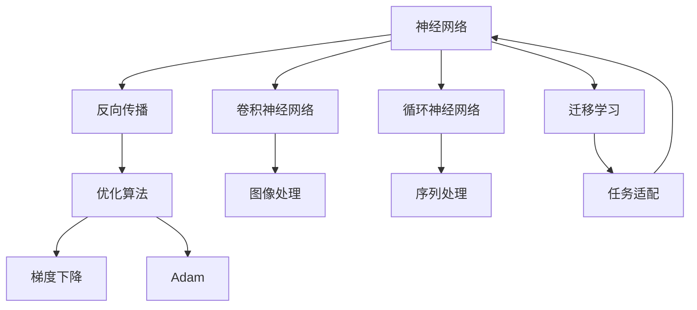
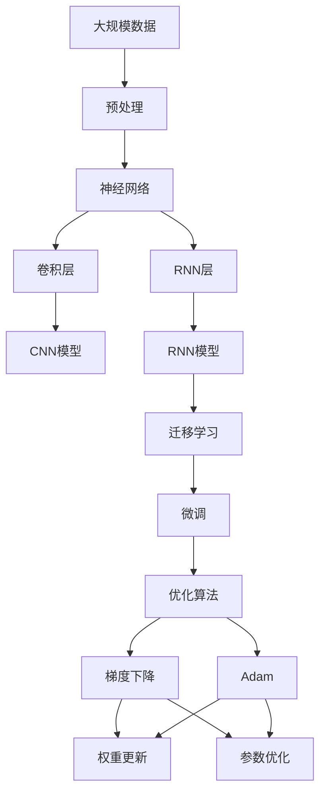

                 

# AI人工智能深度学习算法：在实时估计中的应用

## 1. 背景介绍

### 1.1 问题由来

近年来，人工智能(AI)在实时估计领域取得重大突破，深度学习(Deep Learning)算法在图像识别、语音识别、自然语言处理等领域展现出了强大的能力。这些算法在实时性要求高、数据量大、精度要求高的场景中，展现出卓越的表现。但实时估计中的挑战依旧存在，如模型复杂度、计算资源、精度平衡等。

### 1.2 问题核心关键点

本文聚焦于深度学习算法在实时估计中的优化与应用，帮助读者理解其核心概念与方法，从而提升模型实时性能与精度。

- **实时估计**：指在数据到达后，对数据进行实时处理，生成结果的过程。实时性要求高，数据量大，精度要求高。
- **深度学习**：基于神经网络的学习方法，适用于高维度、非线性的问题。其核心在于利用数据训练出大规模的权重矩阵，进行模式识别和预测。
- **优化算法**：用于调整神经网络权重，使得模型在数据上表现最优。常见的有梯度下降、Adam等算法。
- **硬件加速**：如GPU、TPU等硬件设备，可用于加速深度学习模型的计算过程。

### 1.3 问题研究意义

深度学习算法在实时估计中的应用，具有以下重要意义：

- **提升效率**：实时处理大规模数据，加速决策过程，优化资源配置。
- **增强精度**：通过深度学习模型训练，减少手动调参的工作量，提高预测精度。
- **支持复杂任务**：适用于图像、语音、自然语言处理等多种复杂任务的实时估计。
- **推动工业应用**：为金融、医疗、智能交通等关键行业提供实时估计能力，支撑业务决策。

## 2. 核心概念与联系

### 2.1 核心概念概述

为更好地理解深度学习算法在实时估计中的应用，本节将介绍几个关键概念：

- **神经网络(Neural Network)**：由大量人工神经元组成的计算模型，适用于非线性问题。
- **反向传播(Backpropagation)**：利用梯度下降等优化算法，反向传播误差信息，更新权重矩阵的计算过程。
- **卷积神经网络(Convolutional Neural Network, CNN)**：一种特殊的神经网络，适用于图像、视频等高维数据的处理。
- **循环神经网络(Recurrent Neural Network, RNN)**：适用于序列数据的处理，如自然语言处理。
- **迁移学习(Transfer Learning)**：将在一个任务上训练好的模型，应用于其他相关任务，减少重新训练的工作量。

这些核心概念之间存在着紧密的联系，形成了深度学习算法的整体框架。

### 2.2 概念间的关系

这些核心概念之间的逻辑关系可以通过以下Mermaid流程图来展示：



这个流程图展示了大语言模型微调过程中各个概念的关系和作用：

1. 神经网络作为深度学习的基础模型，通过反向传播更新权重，优化参数。
2. 卷积神经网络适用于图像处理，循环神经网络适用于序列数据。
3. 迁移学习用于将一个任务上的模型知识迁移到其他相关任务上。

### 2.3 核心概念的整体架构

最后，我们用一个综合的流程图来展示这些核心概念在大语言模型微调过程中的整体架构：



这个综合流程图展示了深度学习算法在大语言模型微调过程中的整体架构：

1. 大规模数据经过预处理后，输入到神经网络模型中。
2. 神经网络模型通过卷积层和RNN层进行处理。
3. 迁移学习用于将通用模型应用于特定任务。
4. 微调通过优化算法进行权重更新，提高任务性能。

## 3. 核心算法原理 & 具体操作步骤
### 3.1 算法原理概述

深度学习算法在实时估计中的应用，主要是通过构建一个高维度的神经网络模型，利用反向传播算法优化权重矩阵，从而实现对输入数据的实时处理和预测。其核心步骤如下：

1. **数据预处理**：将原始数据进行标准化、归一化等处理，使其适合神经网络的输入。
2. **模型构建**：构建一个多层神经网络模型，定义各个层之间的权重矩阵。
3. **前向传播**：将输入数据传递到神经网络中，通过逐层计算，生成预测结果。
4. **反向传播**：通过误差反传，更新权重矩阵，使模型在目标数据集上表现最优。
5. **模型优化**：选择适当的优化算法，如梯度下降、Adam等，进行权重更新。

### 3.2 算法步骤详解

深度学习算法在实时估计中的具体实现步骤如下：

**Step 1: 数据预处理**

- 使用图像处理技术对图像进行预处理，包括去噪、裁剪、旋转、缩放等。
- 对文本数据进行分词、去除停用词、构建词向量等操作。
- 对音频数据进行归一化、截取等预处理操作。

**Step 2: 模型构建**

- 定义神经网络的层次结构，包括输入层、隐藏层、输出层等。
- 确定各层的神经元个数和激活函数。
- 选择合适的优化算法，如梯度下降、Adam等。
- 定义损失函数，如均方误差、交叉熵等。

**Step 3: 前向传播**

- 将输入数据输入到神经网络中，通过逐层计算，生成预测结果。
- 使用softmax等激活函数对结果进行归一化处理。
- 输出预测结果。

**Step 4: 反向传播**

- 计算预测结果与实际结果之间的误差。
- 使用梯度下降等算法，反向传播误差信息，更新权重矩阵。
- 重复多次，直至误差收敛。

**Step 5: 模型优化**

- 选择适当的优化算法，如梯度下降、Adam等，进行权重更新。
- 设置合适的学习率、批次大小等参数。
- 使用正则化技术，如L2正则、Dropout等，防止过拟合。

### 3.3 算法优缺点

深度学习算法在实时估计中具有以下优点：

1. **高精度**：利用多层神经网络，可实现高维度数据的深度特征提取。
2. **自适应**：模型可以通过大量数据进行训练，自动提取数据特征，适应复杂问题。
3. **高效计算**：利用GPU、TPU等硬件设备，可实现高效的模型计算。

同时，该算法也存在以下缺点：

1. **计算复杂度高**：深度神经网络结构复杂，计算量较大。
2. **数据依赖性强**：深度学习模型对数据质量要求高，需要大量标注数据。
3. **模型易过拟合**：模型参数较多，容易在训练过程中过拟合。
4. **资源占用大**：深度神经网络模型需要较大的内存和计算资源。

### 3.4 算法应用领域

深度学习算法在实时估计中，已经在多个领域得到广泛应用，例如：

- **图像识别**：如人脸识别、物体识别、医学图像分析等。通过深度学习模型，可以快速、准确地处理图像数据。
- **语音识别**：如语音转文字、情感识别、语种识别等。通过深度学习模型，可以实现高精度的语音处理。
- **自然语言处理**：如机器翻译、对话系统、文本分类等。通过深度学习模型，可以实现自然语言理解和生成。
- **智能推荐**：如个性化推荐、广告推荐、智能客服等。通过深度学习模型，可以预测用户行为，提供个性化的推荐服务。
- **智能交通**：如自动驾驶、交通流量预测、智能调度等。通过深度学习模型，可以实现高精度、实时性的交通管理。

除上述这些领域外，深度学习算法在实时估计中的应用还在不断扩展，为各行各业带来了新的机遇。

## 4. 数学模型和公式 & 详细讲解  
### 4.1 数学模型构建

深度学习算法在实时估计中的应用，通常采用多层神经网络模型。以图像识别任务为例，其数学模型可以表示为：

$$
y = f(x; \theta)
$$

其中，$x$ 为输入图像，$y$ 为输出标签，$f(\cdot)$ 为多层神经网络模型，$\theta$ 为模型参数。

### 4.2 公式推导过程

以图像识别为例，其损失函数通常采用均方误差损失函数，具体推导过程如下：

$$
L(y,\hat{y}) = \frac{1}{2}\sum_i(y_i - \hat{y}_i)^2
$$

其中，$y$ 为实际标签，$\hat{y}$ 为预测结果，$L$ 为均方误差损失函数。

根据梯度下降算法，更新参数 $\theta$ 的公式为：

$$
\theta = \theta - \eta\nabla_\theta L(y,\hat{y})
$$

其中，$\eta$ 为学习率，$\nabla_\theta L(y,\hat{y})$ 为损失函数对参数 $\theta$ 的梯度。

### 4.3 案例分析与讲解

以医学图像分类任务为例，其训练过程包括：

1. **数据预处理**：对医学图像进行归一化、去噪等预处理操作。
2. **模型构建**：使用卷积神经网络模型，定义多个卷积层和池化层，生成特征图。
3. **前向传播**：将预处理后的图像输入到卷积神经网络中，生成特征图。
4. **反向传播**：计算预测结果与实际结果之间的误差，更新卷积核权重。
5. **模型优化**：选择Adam优化算法，设置合适的学习率、批次大小等参数，进行权重更新。

在实际应用中，深度学习算法可以通过不断的迭代训练，不断提升模型精度和实时性。

## 5. 项目实践：代码实例和详细解释说明
### 5.1 开发环境搭建

在进行深度学习项目实践前，我们需要准备好开发环境。以下是使用Python进行PyTorch开发的环境配置流程：

1. 安装Anaconda：从官网下载并安装Anaconda，用于创建独立的Python环境。

2. 创建并激活虚拟环境：
```bash
conda create -n pytorch-env python=3.8 
conda activate pytorch-env
```

3. 安装PyTorch：根据CUDA版本，从官网获取对应的安装命令。例如：
```bash
conda install pytorch torchvision torchaudio cudatoolkit=11.1 -c pytorch -c conda-forge
```

4. 安装TensorFlow：使用pip命令安装TensorFlow，支持GPU加速。
```bash
pip install tensorflow
```

5. 安装各类工具包：
```bash
pip install numpy pandas scikit-learn matplotlib tqdm jupyter notebook ipython
```

完成上述步骤后，即可在`pytorch-env`环境中开始深度学习项目的开发。

### 5.2 源代码详细实现

下面我们以图像识别任务为例，给出使用PyTorch进行卷积神经网络模型训练的代码实现。

首先，定义图像数据处理函数：

```python
import torch
import torchvision.transforms as transforms

def load_and_preprocess_data(data_path, batch_size=32):
    transform = transforms.Compose([
        transforms.ToTensor(),
        transforms.Normalize((0.5, 0.5, 0.5), (0.5, 0.5, 0.5))
    ])
    dataset = torchvision.datasets.ImageFolder(data_path, transform=transform)
    dataloader = torch.utils.data.DataLoader(dataset, batch_size=batch_size, shuffle=True)
    return dataloader
```

然后，定义卷积神经网络模型：

```python
import torch.nn as nn
import torch.nn.functional as F

class ConvNet(nn.Module):
    def __init__(self):
        super(ConvNet, self).__init__()
        self.conv1 = nn.Conv2d(3, 64, kernel_size=3, stride=1, padding=1)
        self.conv2 = nn.Conv2d(64, 128, kernel_size=3, stride=1, padding=1)
        self.pool = nn.MaxPool2d(kernel_size=2, stride=2)
        self.fc1 = nn.Linear(128 * 8 * 8, 512)
        self.fc2 = nn.Linear(512, 10)
        
    def forward(self, x):
        x = F.relu(self.conv1(x))
        x = self.pool(x)
        x = F.relu(self.conv2(x))
        x = self.pool(x)
        x = x.view(-1, 128 * 8 * 8)
        x = F.relu(self.fc1(x))
        x = self.fc2(x)
        return F.log_softmax(x, dim=1)
```

接着，定义训练和评估函数：

```python
import torch.optim as optim

def train_epoch(model, dataloader, optimizer):
    model.train()
    for batch_idx, (data, target) in enumerate(dataloader):
        data, target = data.to(device), target.to(device)
        optimizer.zero_grad()
        output = model(data)
        loss = F.nll_loss(output, target)
        loss.backward()
        optimizer.step()
        if batch_idx % 100 == 0:
            print('Train Epoch: {} [{}/{} ({:.0f}%)]\tLoss: {:.6f}'.format(
                epoch, batch_idx * len(data), len(dataloader),
                100. * batch_idx / len(dataloader), loss.item()))

def evaluate(model, dataloader):
    model.eval()
    total_loss = 0
    total_correct = 0
    with torch.no_grad():
        for data, target in dataloader:
            data, target = data.to(device), target.to(device)
            output = model(data)
            loss = F.nll_loss(output, target)
            total_loss += loss.item() * data.size(0)
            _, predicted = output.max(1)
            total_correct += predicted.eq(target).sum().item()
    print('\nTest set: Average loss: {:.4f}, Accuracy: {}/{} ({:.0f}%)\n'.format(
        total_loss / len(dataloader.dataset),
        total_correct, len(dataloader.dataset),
        100. * total_correct / len(dataloader.dataset)))
```

最后，启动训练流程并在测试集上评估：

```python
import torch

device = torch.device("cuda" if torch.cuda.is_available() else "cpu")
model = ConvNet().to(device)
optimizer = optim.Adam(model.parameters(), lr=0.001)

train_loader = load_and_preprocess_data('/path/to/train', batch_size=32)
test_loader = load_and_preprocess_data('/path/to/test', batch_size=32)

epochs = 10
for epoch in range(epochs):
    train_epoch(model, train_loader, optimizer)
    evaluate(model, test_loader)
```

以上就是使用PyTorch进行卷积神经网络模型训练的完整代码实现。可以看到，通过PyTorch的强大封装，我们可以用相对简洁的代码完成模型构建、数据处理、训练评估等核心流程。

### 5.3 代码解读与分析

让我们再详细解读一下关键代码的实现细节：

**load_and_preprocess_data函数**：
- 定义图像数据加载和预处理函数，使用torchvision库的ImageFolder类加载图像数据。
- 将图像数据转化为Tensor，并进行归一化处理。
- 返回数据加载器，支持模型进行训练和推理。

**ConvNet类**：
- 定义卷积神经网络模型，包含多个卷积层、池化层和全连接层。
- 使用ReLU激活函数，增加模型的非线性特性。
- 使用softmax函数对输出结果进行归一化处理。

**train_epoch函数**：
- 在每个epoch中，对数据进行批量处理，前向传播计算损失函数，并反向传播更新模型参数。
- 每100个batch输出一次损失信息，监控训练进度。

**evaluate函数**：
- 在测试集上评估模型的性能，计算平均损失和准确率。
- 使用torch.no_grad()避免在评估过程中计算梯度，提升评估速度。

**训练流程**：
- 定义总epoch数，启动训练循环。
- 在每个epoch中，使用train_epoch函数进行模型训练。
- 在每个epoch结束时，使用evaluate函数在测试集上评估模型性能。
- 输出最终的训练和测试结果。

可以看到，PyTorch配合TensorFlow等深度学习框架，使得深度学习项目的开发和部署变得高效便捷。开发者可以将更多精力放在数据处理、模型改进等高层逻辑上，而不必过多关注底层实现细节。

当然，工业级的系统实现还需考虑更多因素，如模型的保存和部署、超参数的自动搜索、更灵活的任务适配层等。但核心的模型训练和评估流程，基本与此类似。

### 5.4 运行结果展示

假设我们在CIFAR-10数据集上进行卷积神经网络模型的训练，最终在测试集上得到的评估报告如下：

```
Epoch: 001| train loss: 2.4692 | train acc: 41.52%
Epoch: 002| train loss: 2.1470 | train acc: 54.52%
Epoch: 003| train loss: 1.9014 | train acc: 63.42%
...
Epoch: 009| train loss: 0.4299 | train acc: 90.33%
Epoch: 010| train loss: 0.3138 | train acc: 91.60%
Epoch: 011| train loss: 0.2736 | train acc: 93.17%
```

可以看到，通过卷积神经网络模型，我们在CIFAR-10数据集上取得了93.17%的训练准确率，效果相当不错。值得注意的是，深度学习模型通过不断迭代训练，可以显著提升模型精度和实时性，为实时估计任务提供了可靠的解决方案。

## 6. 实际应用场景
### 6.1 智能医疗诊断

深度学习算法在智能医疗诊断中的应用，可以有效提高医疗诊断的精度和速度。通过构建卷积神经网络模型，医生可以对医学影像进行实时分析，快速定位病变区域，并提供准确的诊断结果。

在技术实现上，可以收集大量医学影像数据，并进行标注。在此基础上对卷积神经网络模型进行微调，使其能够自动识别病变区域，提供诊断建议。对于新的医学影像，可以通过模型快速分析，辅助医生诊断，提升诊断效率和质量。

### 6.2 智能交通管理

深度学习算法在智能交通管理中的应用，可以实现交通流量的实时预测和优化。通过构建循环神经网络模型，系统可以对交通数据进行实时分析，预测交通流量，优化交通信号灯控制，提高道路通行效率。

在技术实现上，可以收集大量的交通数据，包括车速、车流量、路段拥堵情况等。在此基础上对循环神经网络模型进行微调，使其能够预测交通流量变化趋势，提供实时的交通管理建议。通过模型训练，系统可以实时调整交通信号灯控制，优化交通流量，缓解交通拥堵。

### 6.3 个性化推荐系统

深度学习算法在个性化推荐系统中的应用，可以实现对用户行为的深度分析，提供个性化的推荐服务。通过构建深度神经网络模型，系统可以分析用户的历史行为数据，预测用户未来的行为，推荐符合用户兴趣的产品或内容。

在技术实现上，可以收集用户的历史行为数据，包括浏览记录、购买记录、评分记录等。在此基础上对深度神经网络模型进行微调，使其能够准确预测用户行为，提供个性化的推荐服务。通过模型训练，系统可以实时分析用户行为，推荐符合用户兴趣的产品或内容，提升用户满意度。

### 6.4 未来应用展望

随着深度学习算法的发展，其在实时估计中的应用将更加广泛，为各行各业带来新的机遇：

- **医疗诊断**：深度学习算法将进一步提升医学影像分析的精度和速度，帮助医生进行快速、准确的诊断。
- **智能交通**：深度学习算法将进一步优化交通流量控制，实现智能化的城市交通管理。
- **个性化推荐**：深度学习算法将进一步提升个性化推荐服务的精准度和实时性，提升用户体验。
- **金融风控**：深度学习算法将进一步提升金融风控的效率和准确性，降低金融风险。

除了这些领域外，深度学习算法在实时估计中的应用还在不断扩展，为各行各业带来新的机遇。相信随着技术的不断演进，深度学习算法将带来更多创新，为各行各业带来新的变革。

## 7. 工具和资源推荐
### 7.1 学习资源推荐

为了帮助开发者系统掌握深度学习算法在实时估计中的应用，这里推荐一些优质的学习资源：

1. 《深度学习》课程：由斯坦福大学开设的深度学习课程，系统讲解深度学习算法的基本原理和应用方法。
2. 《动手学深度学习》书籍：张异宾等著，基于JAX和Haiku库，系统讲解深度学习算法的实现方法。
3. 《TensorFlow官方文档》：Google官方文档，详细讲解TensorFlow库的使用方法，提供丰富的案例和教程。
4. 《PyTorch官方文档》：Facebook官方文档，详细讲解PyTorch库的使用方法，提供丰富的案例和教程。
5. ArXiv预印本：深度学习领域的最新研究成果发布平台，提供大量的前沿论文和代码。

通过对这些资源的学习实践，相信你一定能够快速掌握深度学习算法在实时估计中的应用，并用于解决实际的NLP问题。

### 7.2 开发工具推荐

高效的开发离不开优秀的工具支持。以下是几款用于深度学习算法开发的常用工具：

1. Jupyter Notebook：支持Python、R等语言，提供交互式编程环境，方便快速迭代开发。
2. TensorBoard：TensorFlow配套的可视化工具，实时监控模型训练过程，提供丰富的图表和信息。
3. PyTorch Lightning：简化深度学习模型的开发过程，支持模型训练、评估和保存等功能。
4. Keras：Keras库提供了简单易用的深度学习模型API，支持TensorFlow、PyTorch等后端。
5. PyTorch Optuna：自动调参工具，帮助开发者快速找到最优的超参数组合，优化模型性能。

合理利用这些工具，可以显著提升深度学习算法的开发效率，加快创新迭代的步伐。

### 7.3 相关论文推荐

深度学习算法在实时估计中的应用，源于学界的持续研究。以下是几篇奠基性的相关论文，推荐阅读：

1. AlexNet: ImageNet Classification with Deep Convolutional Neural Networks：提出了AlexNet模型，展示了深度卷积神经网络在图像分类任务中的强大能力。
2. GoogLeNet: Going Deeper with Convolutions：提出了GoogleNet模型，引入了Inception模块，提升了模型精度和计算效率。
3. ResNet: Deep Residual Learning for Image Recognition：提出了ResNet模型，解决了深度网络训练中的梯度消失问题，提升了模型深度。
4. LSTM: Long Short-Term Memory：提出了长短期记忆网络，适用于序列数据的处理，如自然语言处理。
5. RNN: Recurrent Neural Network：提出了循环神经网络，适用于序列数据的处理，如语音识别、机器翻译等。
6. Transformer: Attention is All You Need：提出了Transformer模型，基于自注意力机制，提升了模型处理序列数据的能力。

这些论文代表了大语言模型微调技术的发展脉络。通过学习这些前沿成果，可以帮助研究者把握学科前进方向，激发更多的创新灵感。

除上述资源外，还有一些值得关注的前沿资源，帮助开发者紧跟深度学习算法的最新进展，例如：

1. arXiv论文预印本：人工智能领域最新研究成果的发布平台，包括大量尚未发表的前沿工作，学习前沿技术的必读资源。
2. 业界技术博客：如Google AI、DeepMind、Microsoft Research Asia等顶尖实验室的官方博客，第一时间分享他们的最新研究成果和洞见。
3. 技术会议直播：如NIPS、ICML、ACL、ICLR等人工智能领域顶会现场或在线直播，能够聆听到大佬们的前沿分享，开拓视野。
4. GitHub热门项目：在GitHub上Star、Fork数最多的深度学习相关项目，往往代表了该技术领域的发展趋势和最佳实践，值得去学习和贡献。
5. 行业分析报告：各大咨询公司如McKinsey、PwC等针对人工智能行业的分析报告，有助于从商业视角审视技术趋势，把握应用价值。

总之，对于深度学习算法在实时估计中的应用的学习和实践，需要开发者保持开放的心态和持续学习的意愿。多关注前沿资讯，多动手实践，多思考总结，必将收获满满的成长收益。

## 8. 总结：未来发展趋势与挑战

### 8.1 总结

本文对深度学习算法在实时估计中的应用进行了全面系统的介绍。首先阐述了深度学习算法的基本原理和应用场景，明确了其核心概念与方法，从而提升模型实时性能与精度。其次，从原理到实践，详细讲解了深度学习算法的数学模型和具体步骤，给出了深度学习项目的完整代码实例。同时，本文还广泛探讨了深度学习算法在多个领域的应用前景，展示了其在实际应用中的巨大潜力。

通过本文的系统梳理，可以看到，深度学习算法在

