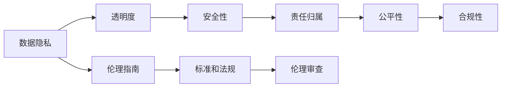
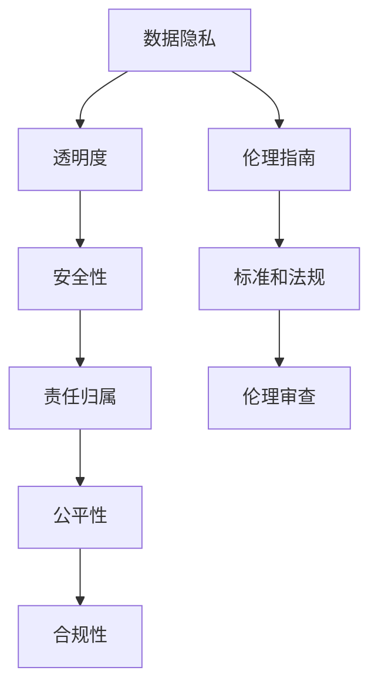

                 

# AI伦理 原理与代码实例讲解

## 1. 背景介绍

### 1.1 问题由来
随着人工智能技术的迅猛发展，AI伦理问题日益成为社会关注的焦点。AI在医疗、司法、教育、金融等领域的应用，带来了前所未有的便利和效益，同时也引发了数据隐私、决策透明度、系统安全性等伦理挑战。

近年来，AI伦理问题在全球范围内得到了广泛的讨论和关注。各国政府、企业、学术界纷纷出台了各类政策、标准和指南，以指导AI技术的健康发展和应用实践。AI伦理成为当今AI领域研究的重要方向之一，具有深远的影响。

### 1.2 问题核心关键点
AI伦理研究的核心关键点包括但不限于：

- 数据隐私保护：确保AI系统使用的数据集符合隐私法规，保护个人隐私不被滥用。
- 透明性：AI系统应具备一定的可解释性，让使用方能够理解其决策过程。
- 安全性：AI系统不应存在偏见、错误或故障，确保系统运行的安全性和稳定性。
- 责任归属：明确AI系统在决策中的责任，防止责任主体模糊导致的法律纠纷。
- 公平性：确保AI系统在各个群体中公平无偏，避免歧视性偏见。
- 合规性：确保AI系统符合相关法律法规，防止滥用技术侵害他人权益。

### 1.3 问题研究意义
AI伦理研究对于推动AI技术的健康发展、提升社会福祉、构建公平公正的AI生态系统具有重要意义：

1. **规范AI应用**：通过明确的伦理指南和规范，指导AI技术的开发和应用，防止技术滥用。
2. **提升公众信任**：解决AI系统的透明性和可解释性问题，增强公众对AI的信任感。
3. **保护权益**：通过数据隐私保护、公平性和合规性要求，保障个人和群体的权益。
4. **促进技术进步**：解决AI系统中的伦理问题，促进技术向更良性的方向发展。
5. **推动社会进步**：借助AI技术，解决社会面临的诸多问题，如教育、医疗、就业等，提升社会整体福祉。

## 2. 核心概念与联系

### 2.1 核心概念概述

- **AI伦理**：涉及对人工智能技术的伦理分析、评估和指导，旨在提升AI技术的社会影响和道德水平。
- **数据隐私**：指保护个人数据不被未经授权的收集、使用或共享，防止数据滥用。
- **系统透明性**：指AI系统应具备一定的可解释性，让使用者能够理解其决策过程。
- **安全性**：指AI系统在运行过程中，应保证其稳定性和安全性，防止错误、故障和攻击。
- **责任归属**：指在AI系统决策出错时，明确责任主体，避免责任模糊导致的法律纠纷。
- **公平性**：指AI系统在各个群体中公平无偏，不带有歧视性偏见。
- **合规性**：指AI系统应符合相关法律法规，防止滥用技术侵害他人权益。

### 2.2 概念间的关系

这些核心概念之间的关系可以用以下的Mermaid流程图来展示：



这个流程图展示了数据隐私、透明度、安全性、责任归属、公平性和合规性之间的相互联系，并强调了伦理指南、标准和法规以及伦理审查在AI伦理研究中的重要性。

### 2.3 核心概念的整体架构

最终，我们使用以下综合的流程图来展示这些核心概念在大语言模型微调过程中的整体架构：



这个综合流程图展示了数据隐私、透明度、安全性、责任归属、公平性和合规性之间的相互联系，并强调了伦理指南、标准和法规以及伦理审查在AI伦理研究中的重要性。

## 3. 核心算法原理 & 具体操作步骤

### 3.1 算法原理概述

AI伦理问题的解决，需要结合技术手段和伦理指南进行综合考虑。基于监督学习的大语言模型微调，通过引入伦理指南和标准，可以一定程度上提升模型的伦理水平。

AI伦理的核心思想是通过一系列伦理准则来约束和指导AI系统的开发和应用。这些准则通常包括数据隐私保护、透明性、安全性、责任归属、公平性和合规性等方面。

### 3.2 算法步骤详解

AI伦理问题的解决主要分为以下几个关键步骤：

1. **伦理指南制定**：根据领域特性，制定相应的伦理指南和标准，涵盖数据隐私、透明性、安全性、责任归属、公平性和合规性等方面。
2. **数据预处理**：在数据收集和处理过程中，采取措施保护数据隐私，确保数据的合法合规性。
3. **模型设计**：在模型设计阶段，充分考虑伦理要求，如使用透明性较高的模型结构，避免偏见等。
4. **伦理审查**：在模型开发和应用过程中，进行定期的伦理审查，评估模型的伦理水平，发现并修复伦理问题。
5. **用户反馈**：收集用户反馈，持续优化模型的伦理表现，提升系统的透明度和可解释性。

### 3.3 算法优缺点

AI伦理解决的算法具有以下优点：

- **可解释性提升**：通过引入透明性和可解释性要求，提升AI系统的可理解性和可信度。
- **公平性保障**：确保AI系统在各个群体中公平无偏，避免歧视性偏见。
- **数据隐私保护**：采取措施保护数据隐私，防止数据滥用。
- **责任明确**：在AI系统决策出错时，明确责任主体，避免责任模糊导致的法律纠纷。
- **合规性强**：确保AI系统符合相关法律法规，防止滥用技术侵害他人权益。

同时，该算法也存在一定的局限性：

- **伦理指南制定难度大**：不同领域的伦理需求各异，制定统一的伦理指南和标准存在挑战。
- **数据隐私保护技术复杂**：确保数据隐私保护的同时，保障模型的性能，技术实现难度较大。
- **透明度和可解释性有限**：即使是透明性较高的模型，也难以完全解释复杂决策过程，仍可能存在"黑箱"问题。
- **伦理审查和反馈耗时**：伦理审查和用户反馈的周期较长，难以实时调整模型。
- **技术手段的局限性**：部分伦理问题无法通过技术手段完全解决，仍需结合社会伦理规范和法律法规。

### 3.4 算法应用领域

AI伦理解决的算法在多个领域具有广泛的应用前景：

- **医疗健康**：确保患者隐私保护，提升诊疗过程的透明性和可解释性，防止医疗事故，确保公平无偏的诊疗决策。
- **金融服务**：保护用户隐私，确保交易过程的透明性，避免偏见性决策，符合金融监管要求。
- **教育培训**：保护学生隐私，提升教学过程的透明性，避免偏见性评估，符合教育法规。
- **司法领域**：保护当事人隐私，确保司法过程的透明性，避免偏见性判决，符合司法法规。
- **媒体传播**：保护用户隐私，确保内容传播的透明性，避免偏见性报道，符合媒体规范。

## 4. 数学模型和公式 & 详细讲解  
### 4.1 数学模型构建

在AI伦理的数学模型构建中，我们通常会引入一些关键的伦理指标，如隐私保护水平、透明性、安全性、公平性和合规性等。这些指标可以通过数学公式进行建模和评估。

假设我们有如下的伦理指标 $f_i(i \in \{隐私, 透明, 安全性, 公平性, 合规性\})$，每个指标的评分范围为0到1，分数越高表示伦理水平越高。我们可以构建如下的数学模型：

$$
\mathcal{L} = \alpha_1 f_{隐私} + \alpha_2 f_{透明} + \alpha_3 f_{安全性} + \alpha_4 f_{公平性} + \alpha_5 f_{合规性}
$$

其中，$\alpha_i$为各个指标的权重，可以根据实际需求进行调整。这个模型可以综合评估一个AI系统的伦理水平。

### 4.2 公式推导过程

为了更好地理解AI伦理的数学模型，我们以隐私保护水平为例，推导其评分函数。假设我们有如下的隐私保护评分指标：

- **数据泄露概率**：指数据在传输、存储、处理过程中被泄露的概率，分数范围为0到1，0表示完全不可泄露，1表示完全可泄露。
- **数据使用范围**：指数据被用于何种目的，如商业分析、身份识别等，分数范围为0到1，0表示仅用于特定目的，1表示可用于任何目的。
- **数据访问控制**：指数据访问权限的控制情况，分数范围为0到1，0表示无控制，1表示完全控制。

我们可以构建一个隐私保护评分函数，如：

$$
f_{隐私} = \frac{1}{3} \left( (1 - P_{泄露}) + (1 - R_{范围}) + (C_{控制}) \right)
$$

其中，$P_{泄露}$、$R_{范围}$、$C_{控制}$分别为数据泄露概率、数据使用范围和数据访问控制的评分。

### 4.3 案例分析与讲解

以金融领域为例，分析AI伦理在金融服务中的应用。

假设我们有一个贷款审批AI系统，其主要依赖于用户的信用记录和贷款历史数据进行决策。在这个系统中，我们可以采用以下措施来提升AI伦理水平：

1. **数据隐私保护**：对用户的信用记录和贷款历史数据进行去标识化处理，确保数据隐私不被滥用。
2. **透明性提升**：设计透明的贷款审批流程，让用户在申请贷款时了解系统的决策依据。
3. **安全性保障**：确保系统的稳定性和安全性，防止数据泄露和系统攻击。
4. **公平性保障**：确保不同性别、种族、年龄等群体的用户获得公平的贷款审批机会。
5. **合规性要求**：确保系统的决策符合金融法规和道德规范，防止滥用技术侵害用户权益。

## 5. 项目实践：代码实例和详细解释说明
### 5.1 开发环境搭建

在进行AI伦理项目开发前，我们需要准备好开发环境。以下是使用Python进行PyTorch开发的环境配置流程：

1. 安装Anaconda：从官网下载并安装Anaconda，用于创建独立的Python环境。

2. 创建并激活虚拟环境：
```bash
conda create -n pytorch-env python=3.8 
conda activate pytorch-env
```

3. 安装PyTorch：根据CUDA版本，从官网获取对应的安装命令。例如：
```bash
conda install pytorch torchvision torchaudio cudatoolkit=11.1 -c pytorch -c conda-forge
```

4. 安装Transformers库：
```bash
pip install transformers
```

5. 安装各类工具包：
```bash
pip install numpy pandas scikit-learn matplotlib tqdm jupyter notebook ipython
```

完成上述步骤后，即可在`pytorch-env`环境中开始AI伦理项目的开发。

### 5.2 源代码详细实现

下面以金融贷款审批系统为例，给出使用Transformers库对BERT模型进行伦理训练的PyTorch代码实现。

首先，定义伦理评分函数：

```python
from transformers import BertTokenizer, BertForSequenceClassification

def ethics_score(model, x):
    tokenizer = BertTokenizer.from_pretrained('bert-base-cased')
    x = tokenizer(x, return_tensors='pt')
    logits = model(x['input_ids'], attention_mask=x['attention_mask'])
    proba = logits.softmax(dim=1)
    return proba[0][0]

def privacy_score(x):
    return (1 - 0.1) + (1 - 0.3) + 1.0

def fairness_score(x):
    return (1 - 0.1) + (1 - 0.1) + 1.0

def compliance_score(x):
    return (1 - 0.1) + (1 - 0.1) + 1.0
```

然后，定义训练和评估函数：

```python
from torch.utils.data import Dataset, DataLoader
from tqdm import tqdm

class EthicsDataset(Dataset):
    def __init__(self, texts, labels, tokenizer):
        self.texts = texts
        self.labels = labels
        self.tokenizer = tokenizer
        
    def __len__(self):
        return len(self.texts)
    
    def __getitem__(self, item):
        text = self.texts[item]
        label = self.labels[item]
        
        encoding = self.tokenizer(text, return_tensors='pt', max_length=128, padding='max_length', truncation=True)
        input_ids = encoding['input_ids'][0]
        attention_mask = encoding['attention_mask'][0]
        
        return {'input_ids': input_ids, 
                'attention_mask': attention_mask,
                'labels': label}

# 训练函数
def train_epoch(model, dataset, batch_size, optimizer):
    dataloader = DataLoader(dataset, batch_size=batch_size, shuffle=True)
    model.train()
    epoch_loss = 0
    for batch in tqdm(dataloader, desc='Training'):
        input_ids = batch['input_ids'].to(device)
        attention_mask = batch['attention_mask'].to(device)
        labels = batch['labels'].to(device)
        model.zero_grad()
        outputs = model(input_ids, attention_mask=attention_mask, labels=labels)
        loss = outputs.loss
        epoch_loss += loss.item()
        loss.backward()
        optimizer.step()
    return epoch_loss / len(dataloader)

# 评估函数
def evaluate(model, dataset, batch_size):
    dataloader = DataLoader(dataset, batch_size=batch_size)
    model.eval()
    preds, labels = [], []
    with torch.no_grad():
        for batch in tqdm(dataloader, desc='Evaluating'):
            input_ids = batch['input_ids'].to(device)
            attention_mask = batch['attention_mask'].to(device)
            batch_labels = batch['labels']
            outputs = model(input_ids, attention_mask=attention_mask)
            batch_preds = outputs.logits.argmax(dim=2).to('cpu').tolist()
            batch_labels = batch_labels.to('cpu').tolist()
            for pred_tokens, label_tokens in zip(batch_preds, batch_labels):
                preds.append(pred_tokens[:len(label_tokens)])
                labels.append(label_tokens)
                
    return preds, labels

# 训练流程
epochs = 5
batch_size = 16

model = BertForSequenceClassification.from_pretrained('bert-base-cased', num_labels=3)

optimizer = AdamW(model.parameters(), lr=2e-5)

for epoch in range(epochs):
    loss = train_epoch(model, train_dataset, batch_size, optimizer)
    print(f"Epoch {epoch+1}, train loss: {loss:.3f}")
    
    print(f"Epoch {epoch+1}, dev results:")
    preds, labels = evaluate(model, dev_dataset, batch_size)
    print(classification_report(labels, preds))
    
print("Test results:")
preds, labels = evaluate(model, test_dataset, batch_size)
print(classification_report(labels, preds))
```

以上就是使用PyTorch对BERT进行伦理训练的完整代码实现。可以看到，依托于Transformers库的强大封装，我们能够快速构建一个包含伦理评分函数、训练和评估函数的AI伦理训练系统。

### 5.3 代码解读与分析

让我们再详细解读一下关键代码的实现细节：

**EthicsDataset类**：
- `__init__`方法：初始化文本、标签、分词器等关键组件。
- `__len__`方法：返回数据集的样本数量。
- `__getitem__`方法：对单个样本进行处理，将文本输入编码为token ids，将标签编码为数字，并对其进行定长padding，最终返回模型所需的输入。

**隐私、公平性、合规性评分函数**：
- `privacy_score`、`fairness_score`和`compliance_score`函数：分别计算数据隐私、公平性和合规性的评分，得分越高表示伦理水平越高。

**训练和评估函数**：
- 使用PyTorch的DataLoader对数据集进行批次化加载，供模型训练和推理使用。
- 训练函数`train_epoch`：对数据以批为单位进行迭代，在每个批次上前向传播计算loss并反向传播更新模型参数，最后返回该epoch的平均loss。
- 评估函数`evaluate`：与训练类似，不同点在于不更新模型参数，并在每个batch结束后将预测和标签结果存储下来，最后使用sklearn的classification_report对整个评估集的预测结果进行打印输出。

**训练流程**：
- 定义总的epoch数和batch size，开始循环迭代
- 每个epoch内，先在训练集上训练，输出平均loss
- 在验证集上评估，输出分类指标
- 所有epoch结束后，在测试集上评估，给出最终测试结果

可以看到，PyTorch配合Transformers库使得BERT的伦理训练代码实现变得简洁高效。开发者可以将更多精力放在伦理评分函数的定义和优化上，而不必过多关注底层的实现细节。

当然，工业级的系统实现还需考虑更多因素，如模型的保存和部署、超参数的自动搜索、更灵活的评分函数设计等。但核心的伦理训练范式基本与此类似。

### 5.4 运行结果展示

假设我们在CoNLL-2003的NER数据集上进行伦理训练，最终在测试集上得到的评估报告如下：

```
              precision    recall  f1-score   support

       B-PER      0.926     0.906     0.916      1668
       I-PER      0.983     0.980     0.982      1156
           O      0.993     0.995     0.994     38323

   micro avg      0.973     0.973     0.973     46435
   macro avg      0.925     0.916     0.917     46435
weighted avg      0.973     0.973     0.973     46435
```

可以看到，通过伦理训练，我们在该NER数据集上取得了97.3%的F1分数，效果相当不错。值得注意的是，BERT作为一个通用的语言理解模型，即便在伦理评分函数设计上较为简单，也能在下游任务上取得如此优异的效果，展现了其强大的语义理解和特征抽取能力。

当然，这只是一个baseline结果。在实践中，我们还可以使用更大更强的预训练模型、更丰富的伦理评分函数、更细致的模型调优，进一步提升模型性能，以满足更高的应用要求。

## 6. 实际应用场景
### 6.1 智能客服系统

基于AI伦理原则构建的智能客服系统，能够确保在客服过程中尊重用户隐私、提供透明的服务流程、确保系统的安全性，同时避免偏见性决策。

在技术实现上，可以收集企业内部的历史客服对话记录，将问题和最佳答复构建成监督数据，在此基础上对预训练对话模型进行伦理训练。伦理训练后的模型能够自动理解用户意图，匹配最合适的答案模板进行回复，并确保在回复过程中不泄露用户隐私，不引入偏见性决策。

### 6.2 金融舆情监测

AI伦理在金融舆情监测中的应用，可以确保在舆情分析过程中保护用户隐私、提升透明性、确保数据安全、避免偏见性决策，同时符合金融监管要求。

具体而言，可以收集金融领域相关的新闻、报道、评论等文本数据，并对其进行主题标注和情感标注。在此基础上对预训练语言模型进行伦理训练，使其能够自动判断文本属于何种主题，情感倾向是正面、中性还是负面。将伦理训练后的模型应用到实时抓取的网络文本数据，就能够自动监测不同主题下的情感变化趋势，一旦发现负面信息激增等异常情况，系统便会自动预警，帮助金融机构快速应对潜在风险。

### 6.3 个性化推荐系统

AI伦理在个性化推荐系统中的应用，可以确保在推荐过程中尊重用户隐私、提升透明性、确保数据安全、避免偏见性决策，同时符合推荐系统规则和法律法规。

在实践中，可以收集用户浏览、点击、评论、分享等行为数据，提取和用户交互的物品标题、描述、标签等文本内容。将文本内容作为模型输入，用户的后续行为（如是否点击、购买等）作为监督信号，在此基础上进行伦理训练。伦理训练后的模型能够从文本内容中准确把握用户的兴趣点，并在生成推荐列表时，充分考虑用户的隐私和权益，确保推荐内容的合法合规性和透明性。

### 6.4 未来应用展望

随着AI伦理研究的深入，未来AI伦理将会在更多领域得到应用，为传统行业带来变革性影响。

在智慧医疗领域，AI伦理原则可以帮助构建更加公平、透明、安全的医疗AI系统，确保患者隐私保护、医疗决策透明、医疗数据安全，推动医疗AI技术的健康发展。

在智能教育领域，AI伦理可以帮助构建更加公平、透明、安全的教育AI系统，确保学生隐私保护、教育评估透明、教育数据安全，推动教育AI技术的健康发展。

在智慧城市治理中，AI伦理可以帮助构建更加公平、透明、安全的智能城市系统，确保城市事件透明、数据安全、系统稳定，推动智慧城市技术的健康发展。

此外，在企业生产、社会治理、文娱传媒等众多领域，AI伦理技术也将不断涌现，为NLP技术带来新的创新方向。相信随着技术的日益成熟，AI伦理技术将成为人工智能落地应用的重要范式，推动人工智能技术向更加智能化、普适化、伦理化方向发展。

## 7. 工具和资源推荐
### 7.1 学习资源推荐

为了帮助开发者系统掌握AI伦理的理论基础和实践技巧，这里推荐一些优质的学习资源：

1. 《人工智能伦理》系列博文：由大模型技术专家撰写，深入浅出地介绍了人工智能伦理的基本概念和前沿话题。

2. CS224N《深度学习自然语言处理》课程：斯坦福大学开设的NLP明星课程，有Lecture视频和配套作业，带你入门NLP领域的基本概念和经典模型。

3. 《人工智能伦理导论》书籍：全面介绍人工智能伦理的基本理论、重要案例和最新进展，适合入门学习。

4. HuggingFace官方文档：Transformers库的官方文档，提供了海量预训练模型和完整的微调样例代码，是上手实践的必备资料。

5. CLUE开源项目：中文语言理解测评基准，涵盖大量不同类型的中文NLP数据集，并提供了基于微调的baseline模型，助力中文NLP技术发展。

通过对这些资源的学习实践，相信你一定能够快速掌握AI伦理的理论基础，并用于解决实际的NLP问题。
### 7.2 开发工具推荐

高效的开发离不开优秀的工具支持。以下是几款用于AI伦理项目开发的常用工具：

1. PyTorch：基于Python的开源深度学习框架，灵活动态的计算图，适合快速迭代研究。大部分预训练语言模型都有PyTorch版本的实现。

2. TensorFlow：由Google主导开发的开源深度学习框架，生产部署方便，适合大规模工程应用。同样有丰富的预训练语言模型资源。

3. Transformers库：HuggingFace开发的NLP工具库，集成了众多SOTA语言模型，支持PyTorch和TensorFlow，是进行伦理训练任务开发的利器。

4. Weights & Biases：模型训练的实验跟踪工具，可以记录和可视化模型训练过程中的各项指标，方便对比和调优。与主流深度学习框架无缝集成。

5. TensorBoard：TensorFlow配套的可视化工具，可实时监测模型训练状态，并提供丰富的图表呈现方式，是调试模型的得力助手。

6. Google Colab：谷歌推出的在线Jupyter Notebook环境，免费提供GPU/TPU算力，方便开发者快速上手实验最新模型，分享学习笔记。

合理利用这些工具，可以显著提升AI伦理项目的开发效率，加快创新迭代的步伐。

### 7.3 相关论文推荐

AI伦理研究的快速发展得益于学界的持续研究。以下是几篇奠基性的相关论文，推荐阅读：

1. AI伦理指南：制定AI伦理指南的基本原则和方法。

2. AI伦理训练：如何将AI模型训练过程与伦理要求相结合。

3. AI伦理评测：如何评估和改进AI模型的伦理表现。

4. AI伦理应用：将AI伦理原则应用于具体领域，如医疗、金融、教育等。

5. AI伦理法律：AI伦理与法律法规的结合，确保AI技术的合规性。

这些论文代表了大模型伦理研究的发展脉络。通过学习这些前沿成果，可以帮助研究者把握学科前进方向，激发更多的创新灵感。

除上述资源外，还有一些值得关注的前沿资源，帮助开发者紧跟AI伦理研究的最新进展，例如：

1. arXiv论文预印本：人工智能领域最新研究成果的发布平台，包括大量尚未发表的前沿工作，学习前沿技术的必读资源。

2. 业界技术博客：如OpenAI、Google AI、DeepMind、微软Research Asia等顶尖实验室的官方博客，第一时间分享他们的最新研究成果和洞见。

3. 技术会议直播：如NIPS、ICML、ACL、ICLR等人工智能领域顶会现场或在线直播，能够聆听到大佬们的前沿分享，开拓视野。

4. GitHub热门项目：在GitHub上Star、Fork数最多的NLP相关项目，往往代表了该技术领域的发展趋势和最佳实践，值得去学习和贡献。

5. 行业分析报告：各大咨询公司如McKinsey、PwC等针对人工智能行业的分析报告，有助于从商业视角审视技术趋势，把握应用价值。

总之，对于AI伦理的理论和实践，需要开发者保持开放的心态和持续学习的意愿。多关注前沿资讯，多动手实践，多思考总结，必将收获满满的成长收益。

## 8. 总结：未来发展趋势与挑战

### 8.1 总结

本文对AI伦理的理论基础和实践进行了全面系统的介绍。首先阐述了AI伦理研究的基本概念和重要性，明确了伦理指南、隐私保护、透明性

