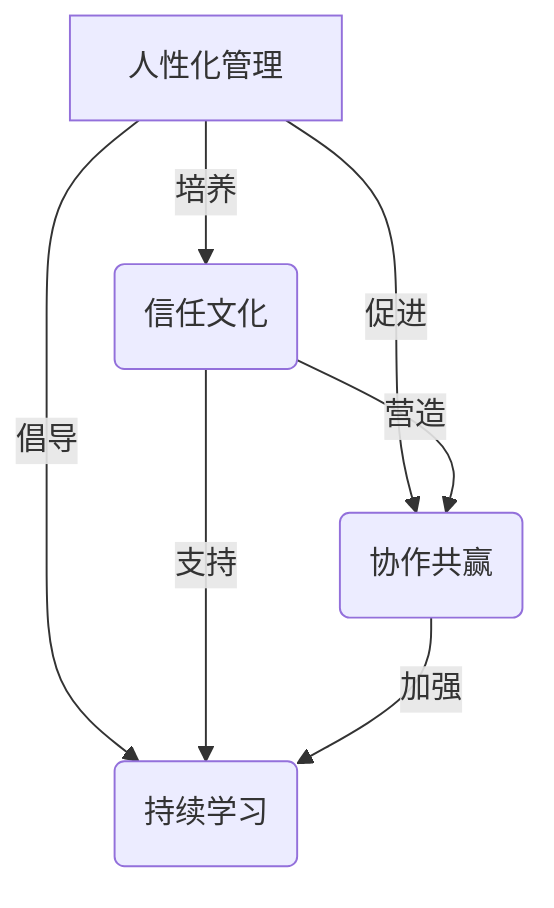

# 管理之道：激发人性的善意和潜能

## 1. 背景介绍

### 1.1 问题的由来

在当今瞬息万变的商业环境中，组织面临着前所未有的挑战。全球化、技术创新和不断变化的客户需求,都要求企业具有卓越的适应能力和创新能力。然而,传统的管理模式往往过于僵化,难以激发员工的主动性和创造力,导致组织缺乏灵活性和应变能力。

因此,如何建立一种新型的管理理念和方法,充分发挥人性的善意和潜能,成为当前企业管理的核心课题。这不仅关系到企业的生存和发展,更关乎人类社会的可持续发展。

### 1.2 研究现状

近年来,一些先进的管理思想和实践开始受到关注,如卓有成效的管理(Management 3.0)、敏捷管理、设计思维等。这些新兴理念强调以人为本、尊重个体、培养协作、鼓励创新等核心价值观。

同时,一些知名企业也在积极探索和实践新型管理模式。例如,谷歌的"20%自由时间"政策、Netflix的"无等级"组织结构、Zappos的"全员主人翁"理念等,都体现了对人性潜能的重视和信任。

然而,这些新型管理理念和实践尚未形成系统化的理论体系,在实际应用中也面临诸多挑战。如何将这些先进思想有机融合,并与传统管理理论相结合,构建一种全新的管理范式,是当前亟待解决的问题。

### 1.3 研究意义

建立一种新型的管理理念和方法,不仅有助于企业提高效率和创新能力,更能促进员工的全面发展和自我实现。通过激发人性的善意和潜能,企业可以营造一种积极向上、相互信任、勇于创新的氛围,从而获得持久的竞争优势。

同时,这种新型管理模式也将对社会产生深远影响。它有助于构建一种更加人性化、可持续发展的组织形态,促进人与自然、人与社会的和谐共存。因此,探索管理之道,激发人性的善意和潜能,不仅是企业发展的需求,更是人类文明进步的必由之路。

### 1.4 本文结构

本文将系统阐述一种新型的管理理念和方法,旨在激发人性的善意和潜能,推动组织的可持续发展。全文共分为八个部分:

1. 背景介绍:阐述研究的背景和意义。
2. 核心概念与联系:介绍新型管理理念的核心概念及其相互关系。
3. 核心算法原理与具体操作步骤:探讨新型管理模式的基本原理和实施路径。
4. 数学模型和公式详细讲解举例说明:构建相关数学模型,并通过案例分析加以说明。
5. 项目实践:代码实例和详细解释说明:提供实际应用案例,并对关键代码进行解读。
6. 实际应用场景:分析新型管理模式在不同行业和领域的应用前景。
7. 工具和资源推荐:介绍相关学习资源、开发工具和参考文献。
8. 总结:未来发展趋势与挑战:总结研究成果,并展望未来发展方向和面临的挑战。

## 2. 核心概念与联系

新型管理理念的核心概念包括人性化管理、信任文化、协作共赢和持续学习等,它们相互关联、相辅相成,共同构成了一个有机的理论体系。

1. **人性化管理**是新型管理理念的核心,强调以人为本,尊重个体差异,关注员工的全面发展。它要求管理者摒弃传统的命令控制模式,转而采取启发式领导,激发员工的主动性和创造力。

2. **信任文化**是人性化管理的基础,它倡导在组织内部建立相互信任、包容失败的氛围。只有当员工感受到足够的信任和尊重时,才能真正发挥出自身的潜能。

3. **协作共赢**强调团队合作和利益共享,鼓励员工之间的相互支持和知识分享。通过协作,可以实现1+1>2的效果,促进组织的整体发展。

4. **持续学习**则是组织保持活力和创新能力的关键。新型管理模式倡导建立学习型组织,鼓励员工不断学习、探索和创新,与时俱进。

上述四个核心概念相互依存、环环相扣,共同构成了新型管理理念的基础框架。人性化管理是出发点,信任文化为其奠定基础,协作共赢则是实现途径,而持续学习则是不断完善和发展的动力源泉。

## 3. 核心算法原理与具体操作步骤

### 3.1 算法原理概述

新型管理模式的核心算法原理可概括为"以人为本、信任驱动、协作共赢、持续迭代"。

1. **以人为本**,充分尊重和关注员工的个体需求,为其提供全面发展的空间和机会。
2. **信任驱动**,在组织内部营造相互信任的氛围,授权员工自主决策,包容失败并从中学习。
3. **协作共赢**,鼓励员工之间的合作与知识分享,实现团队整体绩效的最大化。
4. **持续迭代**,倡导学习型组织理念,不断探索创新,与时俱进。

该算法原理旨在最大限度地激发员工的主动性和创造力,促进组织的可持续发展。

### 3.2 算法步骤详解

1. **建立人性化的组织文化**。从组织最高层开始,树立以人为本的价值观,尊重每一位员工的个体差异和发展需求。制定相应的人力资源政策,为员工提供全面发展的机会和空间。

2. **培养信任文化**。管理者要以身作则,真诚地信任和赞赏员工。建立包容失败的机制,鼓励员工大胆尝试和创新。授予员工一定的自主决策权,避免过度监控和限制。

3. **构建协作共赢的机制**。打破部门墙,促进跨团队协作。建立知识共享平台,鼓励员工互相学习和支持。制定合理的绩效考核和激励机制,实现利益共享。

4. **倡导持续学习**。将组织建设成学习型组织,鼓励员工不断学习新知识、探索新方法。定期组织培训和交流活动,促进知识传播和创新思维的碰撞。

5. **迭代优化**。持续收集员工反馈,评估管理模式的实施效果。及时调整和完善相关政策,与时俱进。

该算法强调渐进式改革,从文化层面入手,逐步建立新型管理体系。它需要管理者的耐心和决心,也需要员工的积极参与和配合。只有通过持续的努力和迭代,才能真正激发人性的善意和潜能,推动组织的可持续发展。

### 3.3 算法优缺点

**优点:**

1. **人性化**,充分尊重和关注员工的个体需求,有利于调动员工的积极性和创造力。
2. **灵活高效**,授权决策、鼓励创新,有助于提高组织的应变能力和效率。
3. **促进协作**,跨团队合作和知识共享,实现1+1>2的效果。
4. **可持续发展**,持续学习和迭代优化,与时俱进,保持组织的活力。

**缺点:**

1. **转型阻力**,传统管理思维根深蒂固,员工和管理者都可能存在一定的观念障碍。
2. **制度建设滞后**,缺乏相应的制度保障,容易流于形式主义。
3. **效率短期下降**,授权决策和创新尝试可能会在短期内影响效率。
4. **风险控制难度加大**,过于开放和自由可能带来一定的管理风险。

总的来说,该算法的优点在于其人性化、灵活高效和可持续发展等特点,有利于激发员工的潜能,提高组织的竞争力。但在实施过程中也需要注意克服各种潜在的阻力和风险,并通过不断的迭代优化来完善管理体系。

### 3.4 算法应用领域

新型管理模式的应用领域是广泛的,包括但不限于:

1. **科技公司**:科技行业瞬息万变,创新是生命线。该管理模式有利于激发员工的创造力,保持公司的持续创新能力。
2. **创意产业**:设计、广告、媒体等创意产业高度依赖人的创造力。该模式有利于释放员工的创意潜能。
3. **咨询服务业**:咨询公司的核心资产是人力资本。该模式有助于吸引和留住优秀人才,提高服务质量。
4. **教育培训机构**:教育事业本身就是一种人性化的事业。该模式有利于营造良好的教学氛围,促进师生共同成长。
5. **非营利组织**:非营利组织往往依赖志愿者和捐助者的支持。该模式有利于凝聚人心,实现组织的可持续发展。

总之,任何重视人力资本、追求创新发展的组织,都可以借鉴和应用这种新型管理理念和方法,激发员工的善意和潜能,实现组织的可持续发展。

## 4. 数学模型和公式详细讲解举例说明

为了更好地理解和应用新型管理模式,我们可以构建相关的数学模型,并通过案例分析加以说明。

### 4.1 数学模型构建

我们将组织的绩效表示为一个函数$f$,它取决于以下几个核心因素:

- $x$:人性化管理程度
- $y$:信任文化程度
- $z$:协作共赢程度
- $w$:持续学习程度

则组织绩效函数可表示为:

$$f(x,y,z,w)=ax+by+cz+dw+e$$

其中,各个变量的系数$a,b,c,d$反映了相应因素对绩效的影响程度,$e$为常数项。

我们的目标是最大化组织绩效函数$f$,即:

$$\max\limits_{x,y,z,w} f(x,y,z,w)=ax+by+cz+dw+e$$

subject to:
$$\begin{cases}
x+y+z+w \leq 1\
x,y,z,w \geq 0
\end{cases}$$

上述约束条件表示,组织的资源是有限的,各个因素的投入程度之和不能超过1,且每个因素的投入都应该是非负的。

通过求解这个最优化问题,我们可以得到各个因素的最佳投入比例,从而实现组织绩效的最大化。

### 4.2 公式推导过程

我们可以使用拉格朗日乘数法来求解上述最优化问题。首先构建拉格朗日函数:

$$L(x,y,z,w,\lambda,\mu,\nu,\rho)=ax+by+cz+dw+e-\lambda(x+y+z+w-1)-\mu x-\nu y-\rho z$$

其中,$\lambda,\mu,\nu,\rho$是拉格朗日乘数。

接下来,我们对$L$分别求$x,y,z,w,\lambda,\mu,\nu,\rho$的偏导数,并令其等于0,可得:

$$\begin{cases}
\frac{\partial L}{\partial x}=a-\lambda-\mu=0\
\frac{\partial L}{\partial y}=b-\lambda-\nu=0\
\frac{\partial L}{\partial z}=c-\lambda-\rho=0\
\frac{\partial L}{\partial w}=d-\lambda=0\
\frac{\partial L}{\partial \lambda}=x+y+z+w-1=0\
\mu x=0\
\nu y=0\
\rho z=0
\end{cases}$$

由于$\mu,\nu,\rho \geq 0$,所以根据对偶理论,至少有一个$x,y,z$等于0。不失