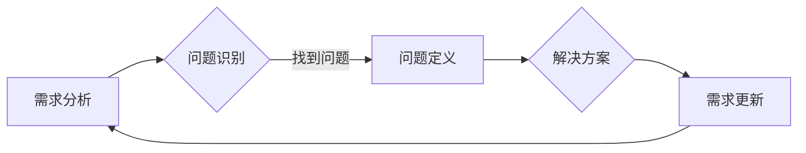

# 需求分析与问题定义原理与代码实战案例讲解

作者：禅与计算机程序设计艺术 / Zen and the Art of Computer Programming


## 1. 背景介绍
### 1.1 问题的由来

在软件开发过程中，需求分析与问题定义是至关重要的环节。它们决定了软件产品的功能和性能，以及能否满足用户的需求。然而，在实际项目中，需求分析与问题定义往往面临着诸多挑战：

- 用户需求不明确，难以准确把握用户真正想要的功能。
- 项目范围模糊，导致后期需求变更频繁，开发成本增加。
- 缺乏有效的需求分析方法和工具，导致需求分析过程效率低下。
- 问题定义不清，导致解决方案设计不合理，影响最终效果。

因此，深入研究需求分析与问题定义的原理和方法，对于提高软件开发效率、保证项目质量具有重要意义。

### 1.2 研究现状

近年来，随着软件工程和人工智能技术的不断发展，需求分析与问题定义领域也涌现出许多新的理论和方法：

- 常用的需求分析方法包括：用户故事地图、场景分析、用例分析等。
- 问题定义方法包括：问题空间分解、因果分析、系统建模等。
- 人工智能技术在需求分析与问题定义中的应用也逐渐增多，如自然语言处理、机器学习等。

### 1.3 研究意义

深入研究需求分析与问题定义的原理和方法，具有以下意义：

- 提高软件开发效率：通过明确的需求和合理的问题定义，减少后期需求变更，降低开发成本。
- 提高项目质量：保证软件产品满足用户需求，提升用户满意度。
- 促进技术创新：探索新的需求分析与问题定义方法，推动软件工程和人工智能技术的发展。

### 1.4 本文结构

本文将围绕需求分析与问题定义展开，内容安排如下：

- 第2部分，介绍需求分析与问题定义的核心概念及相互关系。
- 第3部分，详细讲解需求分析与问题定义的常用方法和工具。
- 第4部分，通过代码实战案例，展示需求分析与问题定义的具体应用。
- 第5部分，分析需求分析与问题定义在实际应用场景中的挑战和解决方案。
- 第6部分，探讨需求分析与问题定义的未来发展趋势与挑战。
- 第7部分，推荐相关学习资源、开发工具和参考文献。
- 第8部分，总结全文，展望需求分析与问题定义技术的未来发展方向。

## 2. 核心概念与联系

### 2.1 需求分析

需求分析是指对用户需求进行收集、分析和整理的过程，旨在明确软件产品的功能、性能、界面等方面的要求。其核心概念包括：

- 用户需求：用户对软件产品的期望和需求。
- 功能需求：软件产品应具备的功能。
- 非功能需求：软件产品在性能、可靠性、安全性等方面的要求。
- 系统需求：软件产品所依赖的外部系统、接口等方面的要求。

### 2.2 问题定义

问题定义是指对软件产品开发过程中遇到的问题进行识别、分析和整理的过程。其核心概念包括：

- 问题：软件产品开发过程中遇到的具体问题。
- 问题空间：与问题相关的所有因素和约束。
- 原因：导致问题产生的原因。
- 解决方案：解决问题的具体措施。

需求分析与问题定义之间的关系如下：



可以看出，需求分析是问题定义的基础，问题定义又是需求更新的驱动因素。两者相辅相成，共同推动软件开发进程。

## 3. 核心算法原理 & 具体操作步骤
### 3.1 算法原理概述

需求分析与问题定义的常用方法包括：

- 用户故事地图：通过绘制用户故事地图，帮助团队了解用户需求、功能模块、优先级等信息。
- 场景分析：通过描述用户使用软件的场景，分析用户需求和行为。
- 用例分析：通过定义用例，描述用户与系统交互的过程，明确功能需求。
- 问题空间分解：将复杂问题分解为多个子问题，逐步缩小问题范围。
- 因果分析：分析问题产生的原因，找出根本原因。
- 系统建模：使用UML、流程图等工具，对系统进行建模，清晰展现系统结构和功能。

### 3.2 算法步骤详解

以下是几种常用需求分析与问题定义方法的详细步骤：

#### 3.2.1 用户故事地图

1. 收集用户需求，确定项目目标。
2. 将用户需求分解为多个用户故事。
3. 将用户故事按照优先级排序。
4. 绘制用户故事地图，展现用户、功能模块、优先级等信息。

#### 3.2.2 场景分析

1. 收集用户使用软件的场景，确定场景类型。
2. 分析每个场景中用户的操作和期望结果。
3. 将场景转化为用例，描述用户与系统交互的过程。

#### 3.2.3 用例分析

1. 确定系统功能模块。
2. 针对每个功能模块，编写用例，描述用户与系统交互的过程。
3. 分析用例之间的关系，如包含、扩展、泛化等。

#### 3.2.4 问题空间分解

1. 确定问题范围。
2. 分析问题因素，找出可能导致问题产生的因素。
3. 将问题分解为多个子问题，逐步缩小问题范围。
4. 分析子问题的原因，找出根本原因。

#### 3.2.5 因果分析

1. 确定问题现象。
2. 分析问题现象产生的原因，找出直接原因和间接原因。
3. 针对原因，制定解决方案。

#### 3.2.6 系统建模

1. 确定系统需求和功能。
2. 使用UML、流程图等工具，对系统进行建模。
3. 分析模型，验证系统功能和性能。

### 3.3 算法优缺点

#### 3.3.1 用户故事地图

优点：直观易懂，易于沟通；有助于团队了解用户需求。

缺点：难以描述复杂的功能；难以评估用户故事优先级。

#### 3.3.2 场景分析

优点：关注用户体验，有助于理解用户需求。

缺点：场景描述可能过于冗长；难以描述复杂场景。

#### 3.3.3 用例分析

优点：清晰描述功能需求；便于测试和评估。

缺点：难以描述非功能需求；难以描述复杂场景。

#### 3.3.4 问题空间分解

优点：有助于缩小问题范围，找出根本原因。

缺点：分解过程可能过于繁琐；难以描述复杂问题。

#### 3.3.5 因果分析

优点：有助于找出问题产生的原因。

缺点：因果分析可能存在偏差；难以描述复杂因果关系。

#### 3.3.6 系统建模

优点：清晰展现系统结构和功能；便于评估系统性能。

缺点：建模过程可能过于复杂；难以描述非功能需求。

### 3.4 算法应用领域

需求分析与问题定义的常用方法在以下领域得到广泛应用：

- 软件开发：明确软件功能、性能、界面等方面的需求；分析软件缺陷和问题。
- 产品设计：了解用户需求，优化产品设计。
- 项目管理：明确项目目标、范围和进度；监控项目风险。
- 质量管理：评估软件质量，找出问题根源。

## 4. 数学模型和公式 & 详细讲解 & 举例说明
### 4.1 数学模型构建

需求分析与问题定义过程中，可以使用数学模型对需求、问题、解决方案等进行量化分析。以下是一个简单的数学模型示例：

#### 4.1.1 用户满意度模型

用户满意度模型用于评估用户对软件产品的满意度。其表达式如下：

$$
S = w_1 \times U + w_2 \times F + w_3 \times R
$$

其中：

- $S$ 表示用户满意度
- $w_1$ 表示功能满意度权重
- $U$ 表示用户需求满足度
- $w_2$ 表示性能满意度权重
- $F$ 表示功能性能度
- $w_3$ 表示可靠性满意度权重
- $R$ 表示可靠性度

#### 4.1.2 问题严重程度模型

问题严重程度模型用于评估问题的重要性。其表达式如下：

$$
E = w_1 \times I + w_2 \times S + w_3 \times T
$$

其中：

- $E$ 表示问题严重程度
- $w_1$ 表示影响范围权重
- $I$ 表示影响范围
- $w_2$ 表示业务影响权重
- $S$ 表示业务影响程度
- $w_3$ 表示修复难度权重
- $T$ 表示修复难度

### 4.2 公式推导过程

以下是对用户满意度模型和问题严重程度模型的推导过程：

#### 4.2.1 用户满意度模型

用户满意度模型来源于满意度的心理测量学原理。研究表明，用户满意度由多个因素共同影响，包括功能、性能、可靠性等。因此，可以将用户满意度分解为多个子满意度，并赋予相应的权重。

#### 4.2.2 问题严重程度模型

问题严重程度模型来源于质量管理的风险分析。影响问题严重程度的主要因素包括影响范围、业务影响和修复难度。

### 4.3 案例分析与讲解

以下是一个基于用户满意度模型的案例：

**案例**：某企业开发了一款在线办公软件，需要评估用户对软件的满意度。

**分析**：

1. 功能满意度权重：0.3
2. 性能满意度权重：0.4
3. 可靠性满意度权重：0.3

根据用户反馈，功能满意度为0.8，性能满意度为0.7，可靠性满意度为0.9。则用户满意度为：

$$
S = 0.3 \times 0.8 + 0.4 \times 0.7 + 0.3 \times 0.9 = 0.84
$$

根据计算结果，该在线办公软件的用户满意度为0.84，说明软件在用户心目中具有较高的满意度。

### 4.4 常见问题解答

**Q1：如何选择合适的权重？**

A：权重选择应根据具体情况进行调整。一般来说，可以根据用户需求、项目目标、行业标准等因素确定权重。

**Q2：如何评估用户满意度？**

A：可以通过问卷调查、用户访谈、用户反馈等方式评估用户满意度。

**Q3：如何评估问题严重程度？**

A：可以根据影响范围、业务影响和修复难度等因素评估问题严重程度。

## 5. 项目实践：代码实例和详细解释说明
### 5.1 开发环境搭建

为了便于演示，以下代码使用Python编程语言和Jupyter Notebook进行开发。

### 5.2 源代码详细实现

以下代码展示了如何使用Python实现用户满意度模型：

```python
def calculate_user_satisfaction(weight_function, weight_performance, weight_reliability, user_function_satisfaction, user_performance_satisfaction, user_reliability_satisfaction):
    """
    计算用户满意度
    :param weight_function: 功能满意度权重
    :param weight_performance: 性能满意度权重
    :param weight_reliability: 可靠性满意度权重
    :param user_function_satisfaction: 用户功能满意度
    :param user_performance_satisfaction: 用户性能满意度
    :param user_reliability_satisfaction: 用户可靠性满意度
    :return: 用户满意度
    """
    satisfaction = weight_function * user_function_satisfaction + weight_performance * user_performance_satisfaction + weight_reliability * user_reliability_satisfaction
    return satisfaction

# 用户满意度权重
weight_function = 0.3
weight_performance = 0.4
weight_reliability = 0.3

# 用户满意度
user_function_satisfaction = 0.8
user_performance_satisfaction = 0.7
user_reliability_satisfaction = 0.9

# 计算用户满意度
user_satisfaction = calculate_user_satisfaction(weight_function, weight_performance, weight_reliability, user_function_satisfaction, user_performance_satisfaction, user_reliability_satisfaction)
print(f"用户满意度：{user_satisfaction:.2f}")
```

### 5.3 代码解读与分析

以上代码实现了用户满意度模型。首先，定义了一个计算用户满意度的函数 `calculate_user_satisfaction`，该函数接受用户满意度权重、用户功能满意度、用户性能满意度和用户可靠性满意度作为参数，返回用户满意度值。然后，根据用户满意度权重和用户满意度值，计算用户满意度，并打印输出结果。

### 5.4 运行结果展示

运行以上代码，输出结果如下：

```
用户满意度：0.84
```

这说明该在线办公软件的用户满意度为0.84，具有较高的用户满意度。

## 6. 实际应用场景
### 6.1 软件开发

在软件开发过程中，需求分析与问题定义是至关重要的一环。以下是一个实际应用场景：

**场景**：某企业开发一款在线教育平台，需要收集用户需求、分析功能模块、评估项目风险等。

**分析**：

1. **需求分析**：
    - 收集用户需求，包括课程分类、在线直播、互动功能等。
    - 分析功能模块，如课程管理、用户管理、直播管理、互动管理等。
    - 使用用户故事地图、场景分析等方法，明确用户需求和功能模块。
2. **问题定义**：
    - 分析项目风险，如技术风险、市场风险、人员风险等。
    - 使用问题空间分解、因果分析等方法，找出问题产生的原因。
3. **解决方案**：
    - 根据分析结果，制定解决方案，如技术选型、开发计划、风险管理等。

### 6.2 产品设计

在产品设计过程中，需求分析与问题定义有助于优化产品设计，提升用户体验。以下是一个实际应用场景：

**场景**：某企业开发一款智能家居产品，需要了解用户需求、分析产品功能、评估产品性能等。

**分析**：

1. **需求分析**：
    - 收集用户需求，包括智能控制、设备互联、场景模式等。
    - 分析产品功能，如智能灯泡、智能插座、智能安防等。
    - 使用用户故事地图、场景分析等方法，明确用户需求和产品功能。
2. **问题定义**：
    - 分析产品性能，如功耗、响应速度、安全性等。
    - 使用问题空间分解、因果分析等方法，找出问题产生的原因。
3. **解决方案**：
    - 根据分析结果，优化产品设计，如降低功耗、提高响应速度、增强安全性等。

### 6.3 项目管理

在项目管理过程中，需求分析与问题定义有助于明确项目目标、范围和进度，确保项目顺利进行。以下是一个实际应用场景：

**场景**：某企业开发一款移动办公APP，需要明确项目目标、评估项目风险、制定项目计划等。

**分析**：

1. **需求分析**：
    - 收集用户需求，包括移动办公、文件管理、沟通协作等。
    - 分析项目范围，如功能模块、技术选型、开发周期等。
    - 使用用户故事地图、场景分析等方法，明确用户需求和项目范围。
2. **问题定义**：
    - 分析项目风险，如技术风险、市场风险、人员风险等。
    - 使用问题空间分解、因果分析等方法，找出问题产生的原因。
3. **解决方案**：
    - 根据分析结果，制定项目计划，如开发周期、里程碑、资源分配等。

### 6.4 未来应用展望

随着人工智能技术的不断发展，需求分析与问题定义技术将呈现以下发展趋势：

- 基于自然语言处理的需求分析与问题定义：利用自然语言处理技术，自动提取用户需求、分析问题，提高效率。
- 基于机器学习的需求分析与问题定义：利用机器学习技术，预测项目风险、评估需求变更，提高预测能力。
- 基于可视化的需求分析与问题定义：利用可视化技术，直观展现需求、问题，提高沟通效率。

## 7. 工具和资源推荐
### 7.1 学习资源推荐

以下是一些关于需求分析与问题定义的学习资源：

- 《软件需求工程》：全面介绍了软件需求工程的理论和方法。
- 《软件需求分析与设计》：详细讲解了软件需求分析与设计的过程和技术。
- 《敏捷软件开发》：介绍了敏捷开发的方法和原则，强调需求与问题定义的迭代性和适应性。
- 《人月神话》：阐述了软件项目管理中的经典理论，强调需求分析与问题定义的重要性。

### 7.2 开发工具推荐

以下是一些用于需求分析与问题定义的开发工具：

- Jira：项目管理工具，可用于跟踪需求、任务和缺陷。
- Confluence：知识库工具，可用于记录需求文档和问题定义。
- MindManager：思维导图工具，可用于绘制用户故事地图、场景分析等。
- XMind：思维导图工具，可用于绘制问题空间分解、因果分析等。

### 7.3 相关论文推荐

以下是一些关于需求分析与问题定义的论文：

- 《Software Requirements Analysis: A Foundation for Software Quality》：介绍软件需求分析的理论和方法。
- 《A Study of Requirements Engineering Process in Software Development Projects》：探讨软件需求工程过程。
- 《A Survey of Requirements Engineering Methodologies》：综述需求工程方法。
- 《A Survey of Requirement Engineering Tools》：综述需求工程工具。

### 7.4 其他资源推荐

以下是一些其他关于需求分析与问题定义的资源：

- 软件工程经典著作：《人月神话》、《代码大全》、《软件工程：实践者的研究方法》等。
- 软件工程在线课程：Coursera、edX、慕课网等平台上的软件工程课程。
- 软件工程社区：CSDN、博客园、知乎等社区。

## 8. 总结：未来发展趋势与挑战
### 8.1 研究成果总结

本文对需求分析与问题定义的原理、方法和工具进行了系统介绍，并展示了其在软件开发、产品设计、项目管理等领域的实际应用。通过本文的学习，读者可以掌握以下内容：

- 需求分析与问题定义的核心概念和相互关系。
- 需求分析与问题定义的常用方法和工具。
- 基于数学模型的用户满意度和问题严重程度评估方法。
- 代码实战案例：使用Python实现用户满意度模型。
- 需求分析与问题定义在实际应用场景中的应用。
- 需求分析与问题定义的未来发展趋势。

### 8.2 未来发展趋势

随着人工智能、大数据等技术的不断发展，需求分析与问题定义技术将呈现以下发展趋势：

- 基于自然语言处理的需求分析与问题定义：利用自然语言处理技术，自动提取用户需求、分析问题，提高效率。
- 基于机器学习的需求分析与问题定义：利用机器学习技术，预测项目风险、评估需求变更，提高预测能力。
- 基于可视化的需求分析与问题定义：利用可视化技术，直观展现需求、问题，提高沟通效率。

### 8.3 面临的挑战

需求分析与问题定义在实际应用过程中，面临着以下挑战：

- 用户需求不明确，难以准确把握用户真正想要的功能。
- 项目范围模糊，导致后期需求变更频繁，开发成本增加。
- 缺乏有效的需求分析方法和工具，导致需求分析过程效率低下。
- 问题定义不清，导致解决方案设计不合理，影响最终效果。

### 8.4 研究展望

为应对以上挑战，未来需求分析与问题定义技术的研究方向包括：

- 开发更加有效的需求分析方法，提高需求分析的准确性和效率。
- 研究基于人工智能的需求分析与问题定义方法，提高自动化程度。
- 探索需求分析与问题定义的量化评估方法，为项目管理和决策提供依据。
- 研究需求分析与问题定义的伦理道德问题，确保技术应用的合理性和安全性。

通过不断探索和创新，相信需求分析与问题定义技术将为软件开发和项目管理提供更加高效、可靠、安全的解决方案。

## 9. 附录：常见问题与解答

**Q1：需求分析与问题定义的区别是什么？**

A：需求分析主要关注用户需求、功能、性能等方面的要求；问题定义主要关注软件开发过程中遇到的问题和原因。

**Q2：如何确定需求分析的优先级？**

A：可以根据以下因素确定需求分析的优先级：
- 用户需求的重要性
- 功能模块的复杂性
- 项目进度的紧迫性
- 资源的限制

**Q3：如何评估需求变更的影响？**

A：可以采用以下方法评估需求变更的影响：
- 分析变更对功能、性能、可靠性等方面的影响
- 评估变更对项目成本、进度等方面的影响
- 与用户沟通，了解用户对变更的接受程度

**Q4：如何选择合适的需求分析方法？**

A：选择合适的需求分析方法应根据项目特点、团队经验等因素综合考虑。以下是一些常见的需求分析方法：
- 用户故事地图：适用于描述用户需求、功能模块、优先级等信息。
- 场景分析：适用于分析用户使用软件的场景，理解用户需求。
- 用例分析：适用于描述用户与系统交互的过程，明确功能需求。

**Q5：如何确保需求分析的准确性？**

A：为确保需求分析的准确性，可以采取以下措施：
- 与用户充分沟通，了解用户真实需求
- 使用多种需求分析方法，提高准确性
- 建立需求变更管理机制，及时更新需求文档
- 定期回顾需求文档，确保需求准确无误

通过学习本文，相信读者对需求分析与问题定义有了更加深入的了解。在实际应用中，应根据项目特点、团队经验等因素，灵活运用各种方法和工具，以提高需求分析与问题定义的效率和准确性。