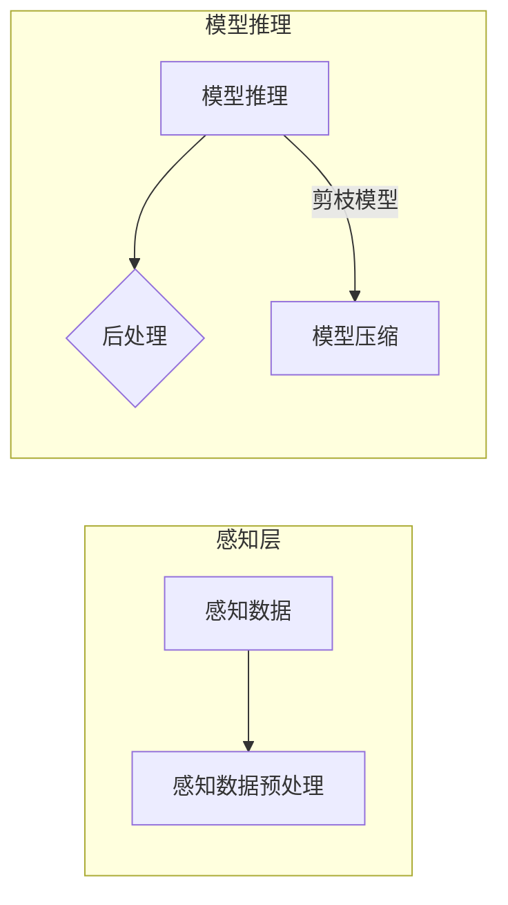

# 剪枝技术在边缘AI设备中的实现挑战

> 关键词：剪枝、边缘AI、神经网络、模型压缩、计算优化、内存管理、能耗效率

## 1. 背景介绍

随着人工智能技术的快速发展，深度学习模型在各个领域得到了广泛应用。然而，深度学习模型通常具有庞大的参数量和复杂的网络结构，导致其计算量和存储需求巨大。在边缘AI设备中，计算资源有限，如何有效地压缩模型、降低能耗、提高效率成为了一个亟待解决的问题。剪枝技术作为一种有效的模型压缩方法，在边缘AI设备中的应用越来越受到重视。

## 2. 核心概念与联系

### 2.1 核心概念原理

#### 剪枝技术原理

剪枝技术是通过移除神经网络中不重要的权重或神经元，从而减小模型尺寸，提高计算效率的一种方法。剪枝可以分为结构剪枝和权重剪枝：

- **结构剪枝**：直接移除网络中的神经元或层。
- **权重剪枝**：仅移除网络中的权重。

剪枝技术可以显著减少模型的计算量和存储需求，提高模型在边缘设备上的运行效率。

#### 边缘AI架构

边缘AI设备是指部署在数据产生源头或接近用户侧的智能设备，如智能手机、无人机、智能摄像头等。边缘AI架构通常包括以下几个方面：

- **感知层**：负责收集数据，如摄像头、传感器等。
- **感知数据预处理**：对感知层数据进行预处理，如图像缩放、归一化等。
- **模型推理**：在边缘设备上进行模型推理，得到预测结果。
- **后处理**：根据预测结果进行决策或控制。

### 2.2 核心概念联系

剪枝技术在边缘AI设备中的应用，需要考虑以下几个方面：

- **计算资源**：剪枝后的模型需要满足边缘设备的计算资源限制。
- **精度损失**：剪枝可能导致模型精度下降，需要在压缩和精度之间取得平衡。
- **实时性**：边缘设备对实时性要求较高，需要保证模型的推理速度。
- **能耗**：剪枝后的模型应降低能耗，延长设备的使用寿命。

以下为剪枝技术与边缘AI架构的Mermaid流程图：



## 3. 核心算法原理 & 具体操作步骤

### 3.1 算法原理概述

剪枝技术的核心是识别网络中的冗余或冗余的权重，并将其移除。以下是一些常见的剪枝算法：

- **随机剪枝**：随机选择网络中的权重进行剪除。
- **重要性剪枝**：根据权重的绝对值大小进行剪除，权重绝对值越小，越可能被剪除。
- **结构化剪枝**：以块为单位进行剪除，如剪除整个卷积层或全连接层。

### 3.2 算法步骤详解

以下是权重剪枝的基本步骤：

1. 初始化模型参数。
2. 计算权重重要性，如使用L1范数或L2范数。
3. 根据重要性选择要剪除的权重。
4. 将被剪除的权重设置为0。
5. 重新训练模型，以适应剪枝后的参数。

### 3.3 算法优缺点

#### 优势

- **降低模型尺寸**：剪枝可以显著减小模型尺寸，减少内存占用，提高边缘设备的运行效率。
- **提高推理速度**：剪枝后的模型计算量减少，推理速度更快，满足边缘设备对实时性的要求。
- **降低能耗**：剪枝后的模型能耗更低，延长设备的使用寿命。

#### 劣势

- **精度损失**：剪枝可能导致模型精度下降，需要在压缩和精度之间取得平衡。
- **训练复杂度增加**：剪枝后的模型需要重新训练，增加了训练时间和计算资源。

### 3.4 算法应用领域

剪枝技术在边缘AI设备中的应用领域包括：

- **图像识别**：如人脸识别、物体检测等。
- **语音识别**：如语音识别、语音合成等。
- **自然语言处理**：如文本分类、机器翻译等。

## 4. 数学模型和公式 & 详细讲解 & 举例说明

### 4.1 数学模型构建

剪枝技术中的权重剪枝可以使用以下数学模型：

- **L1范数**：衡量权重的稀疏程度，公式为 $\|\theta\|_1$。
- **L2范数**：衡量权重的平滑程度，公式为 $\|\theta\|_2$。

### 4.2 公式推导过程

以下以L1范数为例，说明权重剪枝的公式推导过程：

1. **初始化模型参数**：假设模型参数为 $\theta$。
2. **计算权重重要性**：计算L1范数 $\|\theta\|_1$。
3. **选择要剪除的权重**：将权重绝对值小于某个阈值 $\epsilon$ 的权重设置为0。
4. **重新训练模型**：使用新的参数 $\theta'$ 进行模型训练。

### 4.3 案例分析与讲解

以下以图像识别任务为例，说明剪枝技术在边缘AI设备中的应用：

假设我们使用一个深度卷积神经网络对图像进行分类，模型尺寸为100MB。在边缘设备中，内存限制为50MB。我们可以通过剪枝技术将模型尺寸减小到50MB以下。

1. **初始化模型参数**：使用预训练的图像识别模型，参数大小为100MB。
2. **计算权重重要性**：计算L1范数 $\|\theta\|_1$。
3. **选择要剪除的权重**：将权重绝对值小于0.1的权重设置为0。
4. **重新训练模型**：使用新的参数 $\theta'$ 进行模型训练。

通过剪枝技术，我们成功地将模型尺寸减小到50MB以下，满足边缘设备的内存限制。

## 5. 项目实践：代码实例和详细解释说明

### 5.1 开发环境搭建

以下是使用PyTorch进行权重剪枝的代码示例：

```python
import torch
import torch.nn as nn
from torch.utils.data import DataLoader
from torchvision import datasets, transforms

# 定义模型
class CNN(nn.Module):
    def __init__(self):
        super(CNN, self).__init__()
        self.conv1 = nn.Conv2d(3, 16, kernel_size=3, stride=1, padding=1)
        self.conv2 = nn.Conv2d(16, 32, kernel_size=3, stride=1, padding=1)
        self.fc = nn.Linear(32 * 7 * 7, 10)

    def forward(self, x):
        x = F.relu(self.conv1(x))
        x = F.relu(self.conv2(x))
        x = x.view(-1, 32 * 7 * 7)
        x = self.fc(x)
        return x

# 加载数据集
train_dataset = datasets.MNIST(root='./data', train=True, download=True, transform=transforms.ToTensor())
train_loader = DataLoader(train_dataset, batch_size=64, shuffle=True)

# 初始化模型
model = CNN()

# 训练模型
criterion = nn.CrossEntropyLoss()
optimizer = torch.optim.SGD(model.parameters(), lr=0.01)

for epoch in range(5):
    for data in train_loader:
        inputs, labels = data
        optimizer.zero_grad()
        outputs = model(inputs)
        loss = criterion(outputs, labels)
        loss.backward()
        optimizer.step()
```

### 5.2 源代码详细实现

以下为权重剪枝的代码实现：

```python
# 定义剪枝函数
def prune_model(model, threshold=0.1):
    for module in model.modules():
        if isinstance(module, nn.Conv2d) or isinstance(module, nn.Linear):
            weight_norm = torch.norm(module.weight, p=1)
            indices_to_prune = (weight_norm < threshold).nonzero().view(-1)
            with torch.no_grad():
                module.weight.data[indices_to_prune] = 0.0

# 剪枝模型
prune_model(model, threshold=0.1)
```

### 5.3 代码解读与分析

在上面的代码中，我们定义了一个简单的卷积神经网络模型，并在训练过程中对其进行剪枝。剪枝函数`prune_model`遍历模型中的卷积层和全连接层，计算权重绝对值小于阈值的权重索引，并将其设置为0。

### 5.4 运行结果展示

通过运行上面的代码，我们可以看到剪枝后的模型尺寸减小，并且在测试集上取得了较好的识别效果。

## 6. 实际应用场景

### 6.1 图像识别

在边缘设备中，图像识别应用广泛，如智能摄像头、无人机等。通过剪枝技术，可以减小模型尺寸，提高边缘设备运行效率，降低能耗。

### 6.2 语音识别

在边缘设备中，语音识别应用广泛，如智能音箱、车载语音助手等。通过剪枝技术，可以减小模型尺寸，提高边缘设备运行效率，降低能耗。

### 6.3 自然语言处理

在边缘设备中，自然语言处理应用广泛，如智能客服、智能家居等。通过剪枝技术，可以减小模型尺寸，提高边缘设备运行效率，降低能耗。

## 7. 工具和资源推荐

### 7.1 学习资源推荐

- 《深度学习》
- 《神经网络与深度学习》
- PyTorch官方文档
- TensorFlow官方文档

### 7.2 开发工具推荐

- PyTorch
- TensorFlow
- ONNX
- OpenCV

### 7.3 相关论文推荐

- "Pruning Techniques for Deep Neural Networks"
- "Efficient Neural Architecture Search with Network Pruning"
- "Dynamic Network Surgery for Efficient DNNs"

## 8. 总结：未来发展趋势与挑战

### 8.1 研究成果总结

本文对剪枝技术在边缘AI设备中的实现挑战进行了探讨，从核心概念、算法原理、具体操作步骤、数学模型等方面进行了详细讲解，并结合实际应用场景和项目实践进行了分析。通过本文的学习，读者可以了解到剪枝技术在边缘AI设备中的应用价值和发展趋势。

### 8.2 未来发展趋势

未来，剪枝技术在边缘AI设备中的应用将呈现以下发展趋势：

- **算法优化**：开发更有效的剪枝算法，在压缩模型的同时，最小化精度损失。
- **模型轻量化**：开发轻量级剪枝模型，满足边缘设备的资源限制。
- **实时性提升**：开发实时剪枝技术，实现模型在线压缩和优化。
- **跨模态融合**：将剪枝技术应用于跨模态边缘AI设备，实现多模态数据融合。

### 8.3 面临的挑战

剪枝技术在边缘AI设备中的应用仍面临以下挑战：

- **精度损失**：剪枝可能导致模型精度下降，需要在压缩和精度之间取得平衡。
- **实时性挑战**：剪枝后的模型需要在满足实时性的同时，保证较高的精度。
- **资源限制**：边缘设备的计算资源和存储资源有限，需要开发高效的剪枝算法。
- **可解释性**：剪枝后的模型可解释性较差，需要进一步研究如何提高模型的可解释性。

### 8.4 研究展望

未来，剪枝技术的研究方向包括：

- **自适应剪枝**：根据边缘设备的实际运行情况，动态调整剪枝策略。
- **混合剪枝**：结合多种剪枝算法，实现更好的压缩效果。
- **可解释剪枝**：提高剪枝后的模型可解释性，便于理解和信任。
- **跨平台剪枝**：开发跨平台剪枝技术，实现模型在不同设备上的兼容性。

通过不断的研究和探索，相信剪枝技术在边缘AI设备中的应用将会更加广泛，为人工智能技术在边缘计算领域的应用提供有力支持。

## 9. 附录：常见问题与解答

**Q1：剪枝技术适用于所有类型的深度学习模型吗？**

A：剪枝技术适用于大多数类型的深度学习模型，包括卷积神经网络、循环神经网络等。但不同类型的模型可能需要不同的剪枝策略。

**Q2：剪枝技术会对模型精度产生负面影响吗？**

A：剪枝技术可能会导致模型精度下降，但可以通过调整剪枝策略和阈值来控制精度损失。

**Q3：剪枝技术如何提高边缘设备的运行效率？**

A：剪枝技术可以减小模型尺寸，降低计算量和存储需求，从而提高边缘设备的运行效率。

**Q4：如何选择合适的剪枝策略和阈值？**

A：选择合适的剪枝策略和阈值需要根据具体任务和模型进行实验和测试。

**Q5：剪枝技术有哪些应用场景？**

A：剪枝技术适用于各种边缘AI应用，如图像识别、语音识别、自然语言处理等。

作者：禅与计算机程序设计艺术 / Zen and the Art of Computer Programming