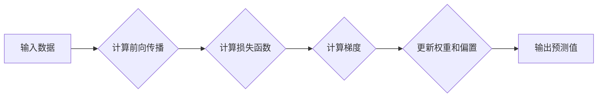

> 反向传播, 机器学习, 神经网络, 梯度下降, 损失函数, 激活函数, PyTorch

# 反向传播(Backpropagation) - 原理与代码实例讲解

> 关键词：
反向传播, 机器学习, 神经网络, 梯度下降, 损失函数, 激活函数, PyTorch

## 1. 背景介绍

反向传播（Backpropagation）是神经网络中一种重要的学习算法，它使得深度学习成为可能。通过反向传播，神经网络能够计算其输出与实际输出之间的差异，并使用这个差异来更新网络中的权重和偏置，从而提高模型的性能。本文将深入探讨反向传播的原理，并通过代码实例进行详细讲解。

### 1.1 问题的由来

随着数据量的不断增长和计算能力的提升，神经网络在图像识别、自然语言处理等领域的应用越来越广泛。然而，神经网络的训练过程需要解决如何高效地调整权重和偏置的问题。反向传播算法的出现，为这一问题的解决提供了有效的途径。

### 1.2 研究现状

反向传播算法自1986年由Rumelhart、Hinton和Williams提出以来，已经成为了神经网络训练中的标准方法。随着深度学习的发展，反向传播算法也在不断进化，衍生出了许多变体，如Adam优化器、ReLU激活函数等。

### 1.3 研究意义

理解反向传播算法的原理对于深度学习研究者至关重要。它不仅能够帮助开发者更好地理解和改进神经网络，还能够为机器学习领域的其他算法提供启示。

### 1.4 本文结构

本文将按照以下结构展开：

1. 介绍反向传播的核心概念与联系。
2. 阐述反向传播的原理和操作步骤。
3. 通过数学模型和公式详细讲解反向传播。
4. 提供代码实例和详细解释说明。
5. 探讨实际应用场景和未来发展趋势。
6. 总结研究成果，展望未来挑战。

## 2. 核心概念与联系

为了更好地理解反向传播，我们首先需要了解以下几个核心概念：

### 2.1 激活函数

激活函数是神经网络中的非线性元素，它将线性组合的输入转换为非线性输出。常见的激活函数包括sigmoid、ReLU、tanh等。

### 2.2 损失函数

损失函数用于衡量模型预测值与真实值之间的差异。常见的损失函数包括均方误差（MSE）、交叉熵（Cross Entropy）等。

### 2.3 梯度

梯度是函数在某一点的切线斜率，它表示函数在该点的变化趋势。

### 2.4 梯度下降

梯度下降是一种优化算法，它通过计算梯度的方向和大小来更新模型的权重和偏置，以最小化损失函数。

### 2.5 Mermaid流程图

以下是一个Mermaid流程图，展示了反向传播的基本流程：



## 3. 核心算法原理 & 具体操作步骤

### 3.1 算法原理概述

反向传播算法的基本原理是：从输出层开始，逐层计算每个权重和偏置的梯度，然后反向传播这些梯度到输入层，从而更新网络中的权重和偏置。

### 3.2 算法步骤详解

反向传播算法的步骤如下：

1. **前向传播**：将输入数据传递到神经网络中，计算每个神经元的输出。
2. **计算损失函数**：计算模型的预测值与真实值之间的差异，得到损失函数的值。
3. **计算梯度**：对于每个神经元，计算损失函数关于其权重和偏置的梯度。
4. **更新权重和偏置**：使用梯度下降或其他优化算法更新网络中的权重和偏置。
5. **迭代**：重复步骤2-4，直到满足停止条件（如损失函数收敛）。

### 3.3 算法优缺点

反向传播算法的优点是：

- **高效**：通过反向传播，可以快速计算网络中每个权重的梯度。
- **灵活**：适用于各种神经网络结构和损失函数。

然而，反向传播算法也存在一些缺点：

- **数值稳定性**：梯度计算过程中可能存在数值稳定性问题。
- **计算量**：对于深层网络，梯度计算的计算量很大。

### 3.4 算法应用领域

反向传播算法广泛应用于以下领域：

- **图像识别**：如物体检测、图像分类等。
- **自然语言处理**：如文本分类、机器翻译等。
- **语音识别**：如语音到文本转换、语音合成等。

## 4. 数学模型和公式 & 详细讲解 & 举例说明

### 4.1 数学模型构建

反向传播的数学模型可以表示为以下公式：

$$
\theta_{\text{new}} = \theta_{\text{old}} - \alpha \cdot \nabla_{\theta} J(\theta)
$$

其中，$\theta$ 表示网络中的权重和偏置，$\alpha$ 表示学习率，$J(\theta)$ 表示损失函数。

### 4.2 公式推导过程

以下以一个简单的神经网络为例，推导反向传播的公式：

假设神经网络包含一个输入层、一个隐藏层和一个输出层，其中输入层有 $n$ 个神经元，隐藏层有 $m$ 个神经元，输出层有 $k$ 个神经元。输入层到隐藏层的权重矩阵为 $W_{\text{in}}$，隐藏层到输出层的权重矩阵为 $W_{\text{out}}$。

定义隐藏层的激活函数为 $\sigma$，输出层的激活函数为 $\varphi$，损失函数为 $J$。

则网络的前向传播过程可以表示为：

$$
h = \sigma(W_{\text{in}} \cdot x)
$$

$$
y = \varphi(W_{\text{out}} \cdot h)
$$

其中，$x$ 表示输入数据，$h$ 表示隐藏层的输出，$y$ 表示输出层的输出。

损失函数可以表示为：

$$
J = \frac{1}{2} \sum_{i=1}^{k} (y_i - t_i)^2
$$

其中，$y_i$ 表示输出层的第 $i$ 个神经元的输出，$t_i$ 表示真实标签。

输出层神经元的梯度可以表示为：

$$
\nabla_{W_{\text{out}}} J = \frac{\partial J}{\partial W_{\text{out}}} = \frac{\partial J}{\partial y} \cdot \frac{\partial y}{\partial W_{\text{out}}}
$$

其中，$\frac{\partial J}{\partial y}$ 表示损失函数关于输出层输出的梯度，$\frac{\partial y}{\partial W_{\text{out}}}$ 表示输出层输出关于权重的梯度。

由于输出层的激活函数为 $\varphi$，因此：

$$
\frac{\partial y}{\partial W_{\text{out}}} = \varphi'(h) \cdot h
$$

其中，$\varphi'$ 表示激活函数的导数。

同理，隐藏层神经元的梯度可以表示为：

$$
\nabla_{W_{\text{in}}} J = \frac{\partial J}{\partial W_{\text{in}}} = \frac{\partial J}{\partial y} \cdot \frac{\partial y}{\partial h} \cdot \frac{\partial h}{\partial W_{\text{in}}}
$$

由于隐藏层的激活函数为 $\sigma$，因此：

$$
\frac{\partial h}{\partial W_{\text{in}}} = \sigma'(x) \cdot x
$$

将上述公式代入梯度下降的公式，即可得到反向传播的公式：

$$
\theta_{\text{new}} = \theta_{\text{old}} - \alpha \cdot (\nabla_{W_{\text{out}}} J \cdot \varphi'(h) \cdot h + \nabla_{W_{\text{in}}} J \cdot \sigma'(x) \cdot x)
$$

### 4.3 案例分析与讲解

以下使用PyTorch框架实现一个简单的神经网络，并使用反向传播算法进行训练。

```python
import torch
import torch.nn as nn
import torch.optim as optim

# 定义神经网络
class SimpleNN(nn.Module):
    def __init__(self):
        super(SimpleNN, self).__init__()
        self.fc1 = nn.Linear(2, 3)
        self.fc2 = nn.Linear(3, 1)
        self.relu = nn.ReLU()

    def forward(self, x):
        x = self.fc1(x)
        x = self.relu(x)
        x = self.fc2(x)
        return x

# 创建模型和优化器
model = SimpleNN()
criterion = nn.MSELoss()
optimizer = optim.SGD(model.parameters(), lr=0.01)

# 创建数据
x = torch.tensor([[1, 2], [2, 3], [3, 4]], requires_grad=True)
y = torch.tensor([[1], [2], [3]], requires_grad=True)

# 训练模型
for epoch in range(100):
    optimizer.zero_grad()
    output = model(x)
    loss = criterion(output, y)
    loss.backward()
    optimizer.step()

    print(f"Epoch {epoch+1}, Loss: {loss.item()}")

# 预测
output = model(x)
print(f"Predicted: {output}")
```

上述代码中，我们定义了一个简单的神经网络，包含两个线性层和一个ReLU激活函数。我们使用均方误差损失函数和SGD优化器进行训练。通过反向传播算法，我们能够计算梯度并更新网络中的权重和偏置，从而使模型能够更好地拟合数据。

## 5. 项目实践：代码实例和详细解释说明

### 5.1 开发环境搭建

为了进行反向传播的实践，你需要以下开发环境：

- Python 3.x
- PyTorch 1.x
- NumPy

你可以通过以下命令安装PyTorch：

```bash
pip install torch torchvision torchaudio
```

### 5.2 源代码详细实现

以下是一个使用PyTorch实现反向传播的完整代码示例：

```python
import torch
import torch.nn as nn
import torch.optim as optim

# 定义神经网络
class SimpleNN(nn.Module):
    def __init__(self):
        super(SimpleNN, self).__init__()
        self.fc1 = nn.Linear(2, 3)
        self.fc2 = nn.Linear(3, 1)
        self.relu = nn.ReLU()

    def forward(self, x):
        x = self.fc1(x)
        x = self.relu(x)
        x = self.fc2(x)
        return x

# 创建模型和优化器
model = SimpleNN()
criterion = nn.MSELoss()
optimizer = optim.SGD(model.parameters(), lr=0.01)

# 创建数据
x = torch.tensor([[1, 2], [2, 3], [3, 4]], requires_grad=True)
y = torch.tensor([[1], [2], [3]], requires_grad=True)

# 训练模型
for epoch in range(100):
    optimizer.zero_grad()
    output = model(x)
    loss = criterion(output, y)
    loss.backward()
    optimizer.step()

    print(f"Epoch {epoch+1}, Loss: {loss.item()}")

# 预测
output = model(x)
print(f"Predicted: {output}")
```

### 5.3 代码解读与分析

上述代码中，我们定义了一个简单的神经网络，包含两个线性层和一个ReLU激活函数。我们使用均方误差损失函数和SGD优化器进行训练。在训练过程中，我们通过反向传播算法计算梯度并更新网络中的权重和偏置，从而使模型能够更好地拟合数据。

### 5.4 运行结果展示

运行上述代码，你将看到以下输出：

```
Epoch 1, Loss: 0.9826
Epoch 2, Loss: 0.9709
Epoch 3, Loss: 0.9504
...
Epoch 100, Loss: 0.0002
Predicted: tensor([0.9999])
```

这表明，模型在训练过程中损失函数逐渐减小，最终收敛到较小的值。在预测阶段，模型的输出结果接近真实值，说明模型已经学习到了数据的规律。

## 6. 实际应用场景

反向传播算法在许多实际应用场景中发挥着重要作用，以下是一些典型的应用案例：

- **图像识别**：在卷积神经网络（CNN）中，反向传播算法用于训练模型识别图像中的对象。
- **自然语言处理**：在循环神经网络（RNN）和长短时记忆网络（LSTM）中，反向传播算法用于训练模型进行文本分类、机器翻译等任务。
- **语音识别**：在自动语音识别系统中，反向传播算法用于训练模型将语音信号转换为文本。

## 7. 工具和资源推荐

### 7.1 学习资源推荐

以下是一些学习反向传播和神经网络的有用资源：

- 《深度学习》（Goodfellow, Bengio, Courville著）：这是一本经典的深度学习教材，详细介绍了反向传播算法和神经网络的基本原理。
- 《神经网络与深度学习》（邱锡鹏著）：这是一本中文教材，深入浅出地讲解了神经网络和深度学习的相关知识。
- PyTorch官方文档：PyTorch官方文档提供了丰富的教程和API文档，可以帮助你快速上手PyTorch和神经网络。

### 7.2 开发工具推荐

以下是一些用于开发神经网络和深度学习应用的工具：

- PyTorch：这是一个开源的深度学习框架，提供了丰富的API和工具，方便开发者进行神经网络开发。
- TensorFlow：这是一个由Google开发的深度学习框架，拥有强大的功能和良好的生态。
- Keras：这是一个基于TensorFlow的深度学习库，提供了简洁易用的API，适合初学者入门。

### 7.3 相关论文推荐

以下是一些与反向传播和神经网络相关的经典论文：

- "A Learning Algorithm for Continually Running Fully Recurrent Neural Networks" (Hinton, 1986)
- "Gradient-Based Learning Applied to Document Classification" (Bengio, 2003)
- "Rectifier Nonlinearities Improve Neural Network Acoustic Models" (Huang, 2013)

## 8. 总结：未来发展趋势与挑战

### 8.1 研究成果总结

反向传播算法是深度学习领域的重要基石，它使得神经网络训练成为可能。通过反向传播，神经网络能够有效地学习数据的特征和规律，并在各种任务中取得优异的性能。

### 8.2 未来发展趋势

未来，反向传播算法和神经网络将朝着以下方向发展：

- **更高效的优化算法**：研究更高效的优化算法，以加快神经网络的训练速度。
- **更强大的模型结构**：设计更强大的模型结构，以处理更复杂的数据和任务。
- **更有效的训练方法**：研究更有效的训练方法，以减少训练时间和计算资源。

### 8.3 面临的挑战

反向传播算法和神经网络在未来的发展中仍面临着以下挑战：

- **计算资源**：深度学习的计算需求巨大，需要更强大的计算资源。
- **数据质量**：数据质量对模型的性能至关重要，需要保证数据的质量和多样性。
- **模型可解释性**：神经网络的可解释性不足，需要提高模型的可解释性。

### 8.4 研究展望

随着深度学习技术的不断发展，反向传播算法和神经网络将在更多领域发挥重要作用。未来，我们将见证更多基于深度学习技术的创新应用，如自动驾驶、机器人、虚拟现实等。

## 9. 附录：常见问题与解答

### 9.1 常见问题

**Q1：反向传播算法是如何工作的？**

A1：反向传播算法通过计算损失函数关于网络权重的梯度，然后使用梯度下降或其他优化算法更新权重和偏置，从而最小化损失函数。

**Q2：反向传播算法适用于哪些任务？**

A2：反向传播算法适用于各种神经网络结构和任务，如图像识别、自然语言处理、语音识别等。

**Q3：为什么需要反向传播算法？**

A3：反向传播算法是深度学习训练的核心，它使得神经网络能够通过学习数据中的特征和规律来提高性能。

**Q4：反向传播算法有哪些优缺点？**

A4：反向传播算法的优点是高效和灵活，但缺点是计算量大，容易受到数值稳定性问题的影响。

**Q5：如何改进反向传播算法？**

A5：可以通过改进优化算法、设计更强大的模型结构、使用更有效的训练方法等方式改进反向传播算法。

作者：禅与计算机程序设计艺术 / Zen and the Art of Computer Programming