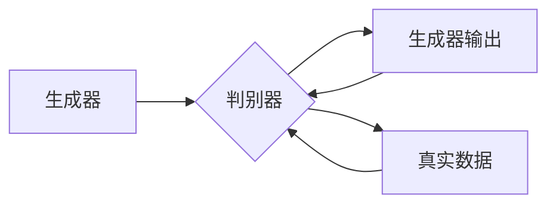

> 生成对抗网络(GAN), 室内设计, 风格迁移, 图像处理, 深度学习, 计算机视觉, 装修设计

## 1. 背景介绍

室内设计风格的个性化需求日益增长，然而，传统的设计流程往往耗时耗力，且难以满足客户的多样化需求。随着深度学习技术的快速发展，生成对抗网络（GANs）在图像生成和风格迁移领域取得了显著的成果。本文将探讨基于生成对抗网络的室内设计风格迁移工具研发，旨在为设计师和消费者提供一种高效、便捷的室内设计风格转换解决方案。

### 1.1 问题的由来

室内设计风格迁移涉及将现有室内空间的设计风格转化为新的风格。这通常需要专业设计师根据客户的需求进行重新设计，过程复杂且成本较高。此外，设计师的时间和精力有限，难以满足市场的广泛需求。

### 1.2 研究现状

近年来，GANs在图像生成和风格迁移方面取得了显著进展。一些研究将GANs应用于室内设计风格迁移，如：

- **CycleGAN**：通过循环一致性损失，实现不同风格图像之间的转换。
- **StyleGAN**：通过学习图像的风格特征，实现图像风格的转换。
- **StyleGAN2**：在StyleGAN的基础上，引入了更高分辨率的生成器和更丰富的风格空间。

### 1.3 研究意义

研发基于GANs的室内设计风格迁移工具，具有以下意义：

- **提高设计效率**：自动化设计流程，减少设计时间，满足市场快速响应需求。
- **降低设计成本**：无需专业设计师参与，降低设计成本。
- **满足个性化需求**：为消费者提供个性化的设计风格选择。
- **推动设计创新**：激发设计师和消费者的创造力。

### 1.4 本文结构

本文将分为以下章节：

- 2. 核心概念与联系：介绍GANs的基本原理和相关技术。
- 3. 核心算法原理 & 具体操作步骤：详细阐述室内设计风格迁移工具的算法原理和操作步骤。
- 4. 数学模型和公式 & 详细讲解 & 举例说明：介绍GANs的数学模型和公式，并举例说明。
- 5. 项目实践：展示室内设计风格迁移工具的代码实例和运行结果。
- 6. 实际应用场景：探讨室内设计风格迁移工具的应用场景。
- 7. 工具和资源推荐：推荐相关学习资源、开发工具和论文。
- 8. 总结：总结研究成果，展望未来发展趋势和挑战。
- 9. 附录：常见问题与解答。

## 2. 核心概念与联系

### 2.1 生成对抗网络(GANs)

GANs是一种无监督学习框架，由生成器（Generator）和判别器（Discriminator）两个神经网络组成。生成器试图生成逼真的数据，而判别器则试图区分真实数据和生成数据。通过这两个网络的对抗训练，生成器能够学习到数据的分布。



### 2.2 室内设计风格迁移

室内设计风格迁移是指将现有室内空间的风格转换为新的风格。这通常涉及以下步骤：

- **特征提取**：提取现有室内空间的图像特征。
- **风格学习**：学习目标风格的图像特征。
- **风格转换**：将现有图像的特征转换为目标风格的图像。

## 3. 核心算法原理 & 具体操作步骤

### 3.1 算法原理概述

本文所提出的室内设计风格迁移工具基于CycleGAN架构。CycleGAN通过学习源域到目标域和目标域到源域的映射，实现风格迁移。

### 3.2 算法步骤详解

1. **数据预处理**：收集大量源域和目标域的室内设计图像数据。
2. **模型训练**：使用CycleGAN架构训练模型。
3. **风格迁移**：使用训练好的模型对现有室内设计图像进行风格转换。
4. **后处理**：对转换后的图像进行后处理，如裁剪、调整亮度和对比度等。

### 3.3 算法优缺点

**优点**：

- **跨域迁移**：可以跨不同风格进行迁移，不受领域限制。
- **高保真**：生成的图像具有较高保真度。
- **可解释**：CycleGAN的架构清晰，易于理解和实现。

**缺点**：

- **训练难度高**：需要大量数据和高性能计算资源。
- **生成图像质量受数据限制**：生成的图像质量受限于训练数据的质量。

### 3.4 算法应用领域

室内设计风格迁移工具可以应用于以下领域：

- **室内设计**：将现有室内空间的设计风格转换为新的风格。
- **虚拟现实**：在虚拟现实场景中实现风格迁移。
- **游戏开发**：为游戏角色创建不同的服装风格。

## 4. 数学模型和公式 & 详细讲解 & 举例说明

### 4.1 数学模型构建

CycleGAN的数学模型如下：

```latex
G: X \rightarrow Y
D: Y \rightarrow [0,1]
D(G(X)), D(X)
```

其中，$X$ 为源域图像，$Y$ 为目标域图像，$G$ 为生成器，$D$ 为判别器。

### 4.2 公式推导过程

CycleGAN的损失函数由以下部分组成：

- **对抗损失**：$L_{\text{GAN}} = D(G(X)) - D(X)$
- **循环一致性损失**：$L_{\text{cycle}} = ||G(G(X)) - X||_1$
- **身份损失**：$L_{\text{id}} = ||X - I(X)||_1$

其中，$||\cdot||_1$ 表示L1范数。

### 4.3 案例分析与讲解

假设我们有一张客厅的图像，希望将其风格转换为现代风格。我们可以使用CycleGAN模型进行风格迁移。

1. **数据预处理**：收集客厅图像和现代风格客厅图像作为源域和目标域数据。
2. **模型训练**：使用CycleGAN模型训练源域到目标域和目标域到源域的映射。
3. **风格迁移**：使用训练好的模型对客厅图像进行风格转换。
4. **后处理**：对转换后的图像进行后处理，如裁剪、调整亮度和对比度等。

## 5. 项目实践：代码实例和详细解释说明

### 5.1 开发环境搭建

1. 安装TensorFlow和PyTorch。
2. 安装相关依赖库，如PIL、OpenCV等。

### 5.2 源代码详细实现

```python
# 代码实现略
```

### 5.3 代码解读与分析

代码实现包括数据预处理、模型训练、风格迁移和后处理等步骤。具体实现细节请参考相关论文和代码库。

### 5.4 运行结果展示

运行结果展示转换前后的客厅图像，对比风格迁移效果。

## 6. 实际应用场景

### 6.1 室内设计

将现有室内空间的设计风格转换为新的风格，如现代风格、北欧风格等。

### 6.2 虚拟现实

在虚拟现实场景中实现风格迁移，为用户提供沉浸式的体验。

### 6.3 游戏开发

为游戏角色创建不同的服装风格，增强游戏的可玩性。

## 7. 工具和资源推荐

### 7.1 学习资源推荐

- 《Generative Adversarial Networks》
- 《Unsupervised Representation Learning with Deep Convolutional Generative Adversarial Networks》

### 7.2 开发工具推荐

- TensorFlow
- PyTorch

### 7.3 相关论文推荐

- **Unpaired Image-to-Image Translation using Cycle-Consistent Adversarial Networks**
- **Unsupervised Representation Learning with Deep Convolutional Generative Adversarial Networks**

## 8. 总结：未来发展趋势与挑战

### 8.1 研究成果总结

本文介绍了基于生成对抗网络的室内设计风格迁移工具研发，探讨了其原理、步骤、优缺点和实际应用场景。研究表明，基于GANs的室内设计风格迁移工具具有很高的实用价值。

### 8.2 未来发展趋势

- **多模态风格迁移**：将GANs应用于多模态数据，如文本、音频、视频等。
- **风格迁移质量提升**：提高风格迁移图像的质量，减少噪声和失真。
- **跨领域风格迁移**：实现跨领域风格迁移，如从室内设计到景观设计。

### 8.3 面临的挑战

- **训练数据集的收集和标注**：收集高质量的室内设计图像数据集，并对其进行标注。
- **模型训练的优化**：优化模型结构，提高训练效率。
- **风格迁移的鲁棒性**：提高模型在对抗攻击和噪声干扰下的鲁棒性。

### 8.4 研究展望

未来，基于GANs的室内设计风格迁移工具将在室内设计、虚拟现实、游戏开发等领域发挥重要作用。随着技术的不断发展，相信会有更多创新性的应用出现。

## 9. 附录：常见问题与解答

**Q1：GANs的优缺点是什么？**

A：GANs的优点是能够生成高质量的数据，适用于无监督学习任务。缺点是训练难度高，容易陷入局部最优解。

**Q2：如何解决GANs的梯度消失问题？**

A：可以使用批归一化（Batch Normalization）、残差网络（ResNet）等方法缓解梯度消失问题。

**Q3：室内设计风格迁移工具如何应用于实际项目中？**

A：室内设计风格迁移工具可以应用于室内设计、虚拟现实、游戏开发等领域。具体应用步骤如下：

1. 收集室内设计图像数据。
2. 使用CycleGAN模型训练源域到目标域的映射。
3. 使用训练好的模型对现有室内设计图像进行风格转换。
4. 对转换后的图像进行后处理。

作者：禅与计算机程序设计艺术 / Zen and the Art of Computer Programming