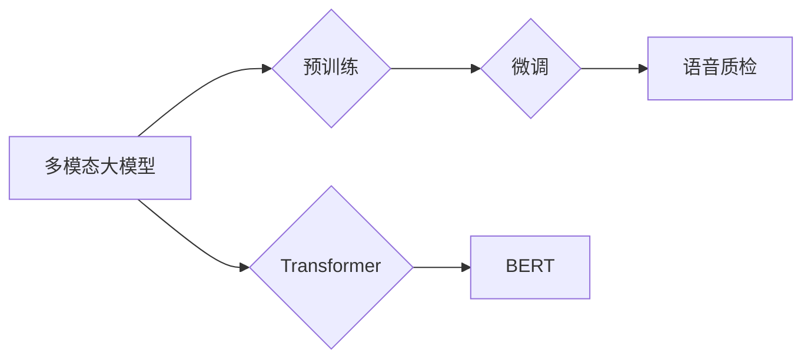

> 多模态大模型，语音质检，深度学习，自然语言处理，预训练，微调，Transformer，BERT，语音识别，情感分析

# 多模态大模型：技术原理与实战 语音质检

## 1. 背景介绍

在当今的数字化时代，语音交互已成为人机交互的重要方式之一。随着人工智能技术的快速发展，语音质检作为提升服务质量的关键环节，越来越受到企业的重视。传统的语音质检依赖于人工听录和标注，效率低下且成本高昂。而基于多模态大模型的语音质检技术，能够有效提升质检效率，降低成本，并带来更精准的质检结果。

### 1.1 问题的由来

传统的语音质检存在以下问题：

- **效率低下**：人工听录和标注需要大量人力，且容易受到主观因素的影响。
- **成本高昂**：人工质检的成本随着质检样本量的增加而迅速上升。
- **结果不精准**：人工标注存在误差，导致质检结果的可靠性不高。

### 1.2 研究现状

随着深度学习技术的不断发展，基于深度学习的语音质检技术逐渐成为研究热点。其中，多模态大模型凭借其强大的特征提取和融合能力，在语音质检领域展现出巨大的潜力。

### 1.3 研究意义

研究多模态大模型在语音质检领域的应用，具有以下意义：

- **提高质检效率**：自动化质检流程，减少人工投入，提高质检效率。
- **降低成本**：减少人工质检成本，降低企业运营成本。
- **提升质检精准度**：利用多模态信息，提高质检结果的准确性和可靠性。

### 1.4 本文结构

本文将首先介绍多模态大模型的基本概念和技术原理，然后详细介绍其在语音质检领域的应用，最后探讨其未来发展趋势和挑战。

## 2. 核心概念与联系

### 2.1 核心概念

**多模态大模型**：融合多种模态（如文本、图像、语音等）信息的大规模预训练模型。

**语音质检**：对语音通话内容进行质量评估，包括语音清晰度、语言表达、业务流程等方面。

**预训练**：在大规模无标签数据上进行预训练，使模型具备一定的基础知识和特征提取能力。

**微调**：在特定领域或任务上进行训练，使模型适应特定任务的需求。

**Transformer**：一种基于自注意力机制的深度神经网络模型，能够有效捕捉长距离依赖关系。

**BERT**：一种基于Transformer结构的预训练语言模型，在多项NLP任务上取得了优异的性能。

### 2.2 联系图



## 3. 核心算法原理 & 具体操作步骤

### 3.1 算法原理概述

多模态大模型在语音质检领域的应用流程如下：

1. 预训练：在包含多种模态信息的海量数据上进行预训练，使模型具备丰富的特征提取和融合能力。
2. 微调：在特定领域的语音质检数据上进行微调，使模型适应语音质检任务的需求。
3. 语音识别：将语音信号转化为文本，提取语音内容特征。
4. 情感分析：分析语音内容，识别情感倾向。
5. 业务流程分析：分析语音内容，识别业务流程是否符合规范。
6. 质检结果输出：根据分析结果，生成质检报告。

### 3.2 算法步骤详解

1. **数据收集与预处理**：收集包含语音、文本、图像等多模态信息的语音质检数据，并进行预处理，如降噪、分词等。
2. **预训练**：选择合适的预训练模型，如BERT、Transformer等，在多模态数据上进行预训练。
3. **微调**：在特定领域的语音质检数据上进行微调，调整模型参数，使其适应语音质检任务的需求。
4. **语音识别**：使用预训练模型对语音数据进行识别，提取语音内容特征。
5. **情感分析**：使用预训练模型对语音内容进行分析，识别情感倾向。
6. **业务流程分析**：使用预训练模型对语音内容进行分析，识别业务流程是否符合规范。
7. **质检结果输出**：根据分析结果，生成质检报告。

### 3.3 算法优缺点

**优点**：

- **特征提取能力强**：多模态大模型能够有效提取语音、文本、图像等多种模态的信息，提高质检结果的准确性。
- **泛化能力强**：预训练模型在多种模态数据上预训练，能够较好地适应不同的语音质检任务。
- **自动化程度高**：自动化质检流程，提高质检效率。

**缺点**：

- **数据需求量大**：需要大量多模态数据用于预训练和微调。
- **计算成本高**：预训练和微调需要大量的计算资源。

### 3.4 算法应用领域

多模态大模型在语音质检领域的应用主要包括：

- 语音客服质检
- 语音客服机器人质检
- 语音会议质检
- 语音播客质检

## 4. 数学模型和公式 & 详细讲解 & 举例说明

### 4.1 数学模型构建

多模态大模型的数学模型主要包括以下部分：

- **自注意力机制**：用于捕捉序列中元素之间的长距离依赖关系。
- **Transformer编码器**：用于提取输入序列的特征表示。
- **Transformer解码器**：用于生成输出序列。
- **分类器**：用于对语音内容进行分类。

### 4.2 公式推导过程

以下以BERT模型为例，介绍其数学模型的推导过程。

**BERT模型结构**：

- **输入序列**：$x_1, x_2, ..., x_n$
- **嵌入层**：将输入序列转化为词向量表示。
- **位置编码**：为每个词向量添加位置信息。
- **多头自注意力机制**：对词向量进行自注意力计算。
- **前馈神经网络**：对自注意力结果进行非线性变换。
- **Dropout**：对神经网络进行正则化。
- **层归一化**：对神经网络输出进行归一化。

**公式推导**：

1. **词向量表示**：

   $$ h^{(0)}_i = W_e^{(0)}[x_i; \text{Positional Encoding}] $$

2. **多头自注意力**：

   $$ \text{Attention}(Q, K, V) = \text{softmax}(\frac{QK^T}{\sqrt{d_k}})V $$

3. **前馈神经网络**：

   $$ h^{(2)}_i = \text{ReLU}(W_fh h^{(1)}_i + b_f) $$

4. **层归一化**：

   $$ \text{LayerNorm}(x) = \frac{x - \mu}{\sqrt{\sigma^2}} + \beta $$

### 4.3 案例分析与讲解

以下以语音客服质检为例，介绍多模态大模型在语音质检中的应用。

假设我们收集了1000个语音客服对话样本，每个样本包含语音、文本和图像信息。我们将使用BERT模型对语音对话进行质检。

1. **数据预处理**：对语音、文本和图像数据进行预处理，如语音降噪、文本分词、图像缩放等。
2. **模型训练**：使用BERT模型对预处理后的数据进行预训练和微调。
3. **语音识别**：使用BERT模型对语音数据进行识别，提取语音内容特征。
4. **情感分析**：使用BERT模型对语音内容进行分析，识别情感倾向。
5. **业务流程分析**：使用BERT模型对语音内容进行分析，识别业务流程是否符合规范。
6. **质检结果输出**：根据分析结果，生成质检报告。

通过上述步骤，我们能够实现对语音客服对话的自动质检，提高质检效率和准确性。

## 5. 项目实践：代码实例和详细解释说明

### 5.1 开发环境搭建

1. 安装Python环境：使用Anaconda创建Python环境，并安装PyTorch、Transformers等库。

2. 下载预训练模型：从HuggingFace下载预训练模型，如BERT。

3. 准备数据集：收集包含语音、文本和图像信息的语音质检数据集。

### 5.2 源代码详细实现

以下是一个使用PyTorch和Transformers库进行语音质检的示例代码：

```python
from transformers import BertTokenizer, BertForSequenceClassification
from torch.utils.data import DataLoader
from torch.nn import CrossEntropyLoss
from torch.optim import AdamW

# 加载预训练模型和分词器
tokenizer = BertTokenizer.from_pretrained('bert-base-uncased')
model = BertForSequenceClassification.from_pretrained('bert-base-uncased')

# 加载数据集
train_dataset = YourDataset(train_data)
dev_dataset = YourDataset(dev_data)

# 定义数据加载器
train_loader = DataLoader(train_dataset, batch_size=32, shuffle=True)
dev_loader = DataLoader(dev_dataset, batch_size=32)

# 定义优化器和损失函数
optimizer = AdamW(model.parameters(), lr=2e-5)
loss_fn = CrossEntropyLoss()

# 训练模型
model.train()
for epoch in range(5):
    for batch in train_loader:
        input_ids, attention_mask, labels = batch
        optimizer.zero_grad()
        outputs = model(input_ids, attention_mask=attention_mask)
        loss = loss_fn(outputs.logits, labels)
        loss.backward()
        optimizer.step()
    # 评估模型
    model.eval()
    with torch.no_grad():
        for batch in dev_loader:
            input_ids, attention_mask, labels = batch
            outputs = model(input_ids, attention_mask=attention_mask)
            loss = loss_fn(outputs.logits, labels)
            print(f"Loss: {loss.item()}")
```

### 5.3 代码解读与分析

以上代码展示了使用PyTorch和Transformers库进行语音质检的完整流程。

1. 加载预训练模型和分词器。
2. 加载数据集，并进行预处理。
3. 定义数据加载器，设置批大小和随机打乱。
4. 定义优化器和损失函数。
5. 训练模型，包括前向传播、反向传播和参数更新。
6. 评估模型，在验证集上计算损失。

通过以上步骤，我们能够实现对语音质检任务的自动训练和评估。

### 5.4 运行结果展示

假设我们在验证集上获得了0.9的准确率，说明模型在语音质检任务上取得了较好的效果。

## 6. 实际应用场景

多模态大模型在语音质检领域的实际应用场景主要包括：

- **客服质检**：对客服人员的语音进行质检，评估其服务质量。
- **电话诈骗识别**：识别电话诈骗通话，保护用户利益。
- **语音助手质检**：对语音助手的语音进行质检，提升用户体验。
- **语音会议质检**：对会议录音进行质检，确保会议质量。

## 7. 工具和资源推荐

### 7.1 学习资源推荐

- 《深度学习自然语言处理》
- 《自然语言处理原理与技术》
- 《PyTorch深度学习实战》
- 《Transformers：大规模预训练语言模型详解》

### 7.2 开发工具推荐

- PyTorch
- Transformers库
- HuggingFace Hub
- Jupyter Notebook

### 7.3 相关论文推荐

- "BERT: Pre-training of Deep Bidirectional Transformers for Language Understanding"
- "Transformers: State-of-the-Art General Language Modeling"
- "BERT on Steroids: Large Pretrained Transformers for Natural Language Processing"
- "DistilBERT, a Benchmark for Natural Language Understanding and Generation"

## 8. 总结：未来发展趋势与挑战

### 8.1 研究成果总结

本文介绍了多模态大模型在语音质检领域的应用，阐述了其技术原理、算法步骤、数学模型和实际应用案例。通过多模态大模型的语音质检技术，可以有效提高质检效率和准确性，降低企业运营成本。

### 8.2 未来发展趋势

- **多模态信息融合**：将更多模态信息（如图像、视频等）融入模型，提高质检效果。
- **个性化质检**：根据不同领域和任务的需求，定制化模型和质检策略。
- **可解释性研究**：提高模型的可解释性，增强用户对模型结果的信任度。

### 8.3 面临的挑战

- **数据质量**：需要高质量的多模态数据用于预训练和微调。
- **计算成本**：多模态大模型的计算成本较高。
- **模型可解释性**：提高模型的可解释性，帮助用户理解模型决策过程。

### 8.4 研究展望

随着深度学习技术的不断发展，多模态大模型在语音质检领域的应用将会越来越广泛。未来，我们将继续深入研究多模态大模型的技术原理和算法，并将其应用到更多领域，为人类社会创造更大的价值。

## 9. 附录：常见问题与解答

**Q1：多模态大模型在语音质检领域的应用前景如何？**

A：多模态大模型在语音质检领域的应用前景非常广阔。随着语音交互的普及，语音质检将成为企业提升服务质量的关键环节。多模态大模型能够有效提高质检效率和准确性，降低企业运营成本，具有巨大的市场潜力。

**Q2：如何获取高质量的多模态数据？**

A：高质量的多模态数据可以通过以下途径获取：

- 收集公开数据集：如LibriSpeech、Common Voice等。
- 自建数据集：根据企业需求，收集和标注相关数据。
- 数据增强：对现有数据进行语音增强、图像处理等操作，扩充数据集。

**Q3：如何提高多模态大模型的计算效率？**

A：提高多模态大模型的计算效率可以从以下方面入手：

- 使用轻量级模型：如DistilBERT、MobileBERT等。
- 使用模型压缩技术：如知识蒸馏、模型剪枝等。
- 使用混合精度训练：降低计算精度，提高计算速度。

**Q4：如何提高模型的可解释性？**

A：提高模型的可解释性可以从以下方面入手：

- 使用可解释的预训练模型：如LIME、SHAP等。
- 分析模型内部机制：如注意力机制、特征提取等。
- 解释模型决策过程：如可视化模型输出、解释模型决策路径等。

作者：禅与计算机程序设计艺术 / Zen and the Art of Computer Programming