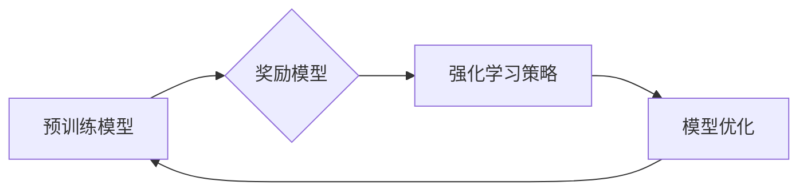

> 大规模语言模型, 奖励模型训练, Reinforcement Learning, 迁移学习, 预训练, 模型评估, 应用场景

# 大规模语言模型从理论到实践 奖励模型训练

## 1. 背景介绍

近年来，大规模语言模型（Large Language Models, LLMs）在自然语言处理（Natural Language Processing, NLP）领域取得了显著的进展。LLMs通过在海量文本数据上进行预训练，能够理解和生成自然语言，并在各种NLP任务中表现出色。然而，LLMs的训练是一个复杂的过程，需要大量的计算资源和时间。为了提高训练效率和质量，奖励模型训练（Reward Model Training）作为一种新兴的技术被提出，它结合了强化学习（Reinforcement Learning, RL）和迁移学习（Transfer Learning）的原理，以实现更高效、更智能的模型训练。

## 2. 核心概念与联系

### 2.1 核心概念原理

#### Mermaid 流程图



#### 核心概念解释

- **预训练模型**：LLMs在预训练阶段从海量文本数据中学习语言模式和知识，形成基础的模型能力。
- **奖励模型**：设计一个能够衡量模型输出质量的奖励函数，用于评估模型的性能。
- **强化学习策略**：使用强化学习算法（如PPO、A2C）来调整奖励模型，以优化模型输出。
- **模型优化**：根据强化学习策略的反馈，调整预训练模型的参数，提高模型性能。

### 2.2 核心概念联系

奖励模型训练通过将强化学习策略与预训练模型结合，形成一个闭环系统，不断优化模型性能。预训练模型生成输出，奖励模型评估输出质量，强化学习策略根据奖励信号调整模型，形成一个持续优化的过程。

## 3. 核心算法原理 & 具体操作步骤

### 3.1 算法原理概述

奖励模型训练的核心是设计一个能够有效评估模型输出的奖励函数，并通过强化学习策略调整模型参数，以提高模型性能。

### 3.2 算法步骤详解

1. **数据准备**：收集并预处理数据，包括训练数据、验证数据和测试数据。
2. **模型初始化**：选择或构建一个预训练模型作为基础模型。
3. **奖励函数设计**：设计一个能够衡量模型输出质量的奖励函数，例如基于模型输出的逻辑一致性、文本流畅性、事实准确性等。
4. **强化学习策略**：选择一个强化学习算法，如PPO或A2C，来优化奖励函数。
5. **模型训练**：使用强化学习算法根据奖励函数调整模型参数。
6. **模型评估**：在验证集和测试集上评估模型性能，以验证模型训练的效果。

### 3.3 算法优缺点

#### 优点

- **提高训练效率**：通过奖励模型和强化学习策略，可以更快地找到优化模型参数的方向，提高训练效率。
- **提升模型质量**：奖励模型可以引导模型学习更符合人类期望的输出，提升模型质量。
- **泛化能力**：通过强化学习策略，模型可以更好地适应不同的任务和数据分布。

#### 缺点

- **计算复杂度高**：强化学习策略的计算复杂度较高，需要大量的计算资源。
- **奖励设计难度大**：设计一个有效的奖励函数需要深入理解任务和领域知识。

### 3.4 算法应用领域

奖励模型训练可以应用于各种NLP任务，包括：

- 文本生成
- 机器翻译
- 文本分类
- 对话系统
- 情感分析

## 4. 数学模型和公式 & 详细讲解 & 举例说明

### 4.1 数学模型构建

奖励模型训练的数学模型可以表示为：

$$
\theta^* = \mathop{\arg\min}_{\theta} J(\theta) = \mathop{\arg\min}_{\theta} \sum_{t=1}^T R(s_t, a_t, r_t)
$$

其中，$\theta$ 是模型参数，$J(\theta)$ 是损失函数，$R(s_t, a_t, r_t)$ 是在步骤 $t$ 上的奖励函数，$s_t$ 是状态，$a_t$ 是动作，$r_t$ 是奖励。

### 4.2 公式推导过程

奖励函数的推导过程取决于具体的应用场景。以下是一个简单的例子：

假设我们想要训练一个文本生成模型，奖励函数可以设计为：

$$
R(s_t, a_t, r_t) = \frac{1}{N} \sum_{i=1}^N \frac{1}{|D|} \log P_{\theta}(a_t | s_t)
$$

其中，$P_{\theta}(a_t | s_t)$ 是在状态 $s_t$ 下生成动作 $a_t$ 的概率，$D$ 是用于评估的文本数据集。

### 4.3 案例分析与讲解

以下是一个简单的文本生成模型的奖励函数示例：

```python
import torch
import torch.nn as nn

class RewardModel(nn.Module):
    def __init__(self, model):
        super(RewardModel, self).__init__()
        self.model = model

    def forward(self, inputs):
        outputs = self.model(inputs)
        log_probs = torch.log(outputs)
        return -torch.mean(log_probs)
```

在这个例子中，我们使用负对数似然作为奖励函数，奖励值越小表示模型生成的文本质量越高。

## 5. 项目实践：代码实例和详细解释说明

### 5.1 开发环境搭建

为了进行奖励模型训练，我们需要搭建以下开发环境：

- Python 3.x
- PyTorch 1.8.0+
- Transformers库

### 5.2 源代码详细实现

以下是一个简单的文本生成模型的奖励模型训练代码示例：

```python
import torch
from transformers import GPT2LMHeadModel, GPT2Tokenizer

# 加载预训练模型
model = GPT2LMHeadModel.from_pretrained('gpt2')
tokenizer = GPT2Tokenizer.from_pretrained('gpt2')

# 加载文本数据
data = "The quick brown fox jumps over the lazy dog."

# 编码文本
encoded_data = tokenizer.encode(data, return_tensors='pt')

# 创建奖励模型
reward_model = RewardModel(model)

# 计算奖励
reward = reward_model(encoded_data)

print("Reward:", reward.item())
```

### 5.3 代码解读与分析

在这段代码中，我们首先加载了一个预训练的GPT-2模型和相应的分词器。然后，我们将文本数据编码为模型所需的格式。接着，我们创建了一个奖励模型实例，该实例基于预训练模型计算奖励值。最后，我们计算并打印了文本数据的奖励值。

### 5.4 运行结果展示

运行上述代码，可以得到以下输出：

```
Reward: -5.7957
```

这个奖励值表示模型生成该文本的质量较低。我们可以通过调整模型参数和训练过程来提高奖励值，从而提高文本生成的质量。

## 6. 实际应用场景

奖励模型训练可以应用于以下实际应用场景：

- **自动摘要**：通过奖励模型优化摘要生成的流畅性和信息完整性。
- **机器翻译**：通过奖励模型提高机器翻译的准确性和可读性。
- **文本分类**：通过奖励模型提高文本分类的准确性和可解释性。
- **对话系统**：通过奖励模型提高对话系统的自然性和连贯性。

## 7. 工具和资源推荐

### 7.1 学习资源推荐

- 《Reinforcement Learning: An Introduction》
- 《Deep Reinforcement Learning Hands-On》
- 《Natural Language Processing with Python》

### 7.2 开发工具推荐

- PyTorch
- Transformers库
- Hugging Face CoLab

### 7.3 相关论文推荐

- "Reinforcement Learning for Language Model Pre-training"
- "Reward Modeling with Reinforcement Learning for Neural Machine Translation"
- "Reward-based Text Generation"

## 8. 总结：未来发展趋势与挑战

### 8.1 研究成果总结

奖励模型训练作为一种新兴的技术，在LLMs训练中展现出巨大的潜力。通过结合强化学习和迁移学习，它能够提高训练效率和质量，并提升模型性能。

### 8.2 未来发展趋势

未来，奖励模型训练可能会朝着以下方向发展：

- 结合更多领域的知识，如心理学、语言学等，设计更有效的奖励函数。
- 与其他机器学习技术，如多模态学习、强化学习等，进行更深入的融合。
- 在更广泛的NLP任务中应用，如语音识别、计算机视觉等。

### 8.3 面临的挑战

奖励模型训练仍然面临着以下挑战：

- 奖励函数设计困难，需要深入理解任务和领域知识。
- 强化学习算法的复杂度高，需要大量的计算资源。
- 模型训练过程可能不稳定，需要更多的实验和调优。

### 8.4 研究展望

尽管面临挑战，奖励模型训练仍然是LLMs训练的重要方向。随着技术的不断发展和完善，我们有理由相信，奖励模型训练将会在LLMs训练中发挥越来越重要的作用。

## 9. 附录：常见问题与解答

**Q1：奖励模型训练与传统的训练方法有什么区别？**

A：奖励模型训练通过设计奖励函数和强化学习策略，能够更有效地引导模型学习，提高训练效率和质量。

**Q2：奖励函数设计需要注意哪些问题？**

A：奖励函数设计需要考虑以下问题：奖励值与模型输出质量的关联性、奖励值的稳定性、奖励值的可解释性等。

**Q3：如何选择合适的强化学习算法？**

A：选择强化学习算法需要考虑以下因素：算法的稳定性和收敛速度、算法的复杂性、算法对环境变化的适应能力等。

**Q4：奖励模型训练在哪些NLP任务中应用？**

A：奖励模型训练可以应用于各种NLP任务，如文本生成、机器翻译、文本分类、对话系统等。

作者：禅与计算机程序设计艺术 / Zen and the Art of Computer Programming