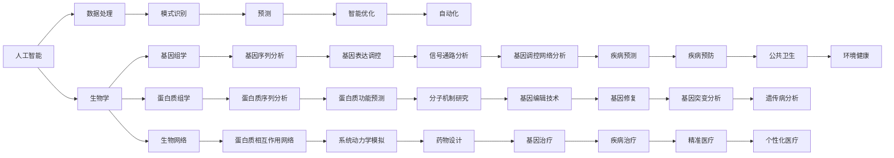

                 

# AI与生物学交叉原理与代码实战案例讲解

> 关键词：人工智能, 生物学, 交叉学科, 代码实战, 案例讲解

## 1. 背景介绍

### 1.1 问题由来
随着科学技术的飞速发展，人工智能(AI)和生物学的交叉融合已成为当前研究的热点。AI不仅在信息处理、图像识别、自然语言处理等领域展现了巨大潜力，也开始应用于生物信息的挖掘、基因组分析、药物设计等领域，推动了生物学的进步。

生物信息学领域面临着海量生物数据的处理和分析，以及生物系统复杂性带来的挑战。传统的统计学和数学方法已经难以满足需求，迫切需要引入新型的算法和技术。AI通过模拟人类智能，可以高效处理和分析复杂数据，提取有用信息，因此在生物信息学中具有广泛的应用前景。

### 1.2 问题核心关键点
AI与生物学的交叉应用主要集中在以下几个关键点：

1. **数据处理与分析**：生物数据通常具有高维性、复杂性和多样性，AI可以通过高效的数据处理和分析算法，从海量数据中提取有用信息。
2. **模式识别与预测**：AI算法可以识别复杂的生物模式，预测生物学现象，如基因表达、蛋白质相互作用等。
3. **智能优化与搜索**：AI算法可以优化生物系统设计，搜索最优解决方案，如药物设计、蛋白质折叠等。
4. **自动化与模拟**：AI技术可以自动化生物实验，模拟生物过程，提高研究效率和准确性。
5. **人机协作**：AI与生物学家协作，可以互补优势，实现更高效的研究和应用。

### 1.3 问题研究意义
AI与生物学的交叉融合不仅有助于解决生物学中的复杂问题，还推动了AI技术在生物领域的应用。其研究意义包括：

1. **解决生物学难题**：AI可以处理传统方法难以处理的生物数据，解决生物学中的复杂问题。
2. **提升AI应用范围**：生物学问题往往具有高复杂度，AI在这些领域的应用可以提高其通用性和鲁棒性。
3. **推动技术进步**：生物学领域的创新应用可以推动AI技术的发展，促进学科间的交叉融合。
4. **促进产业发展**：AI在生物学领域的应用可以催生新的生物技术和产业，推动生物医药、环保等行业的发展。
5. **提升研究效率**：AI可以自动化生物实验和数据处理，大幅提升研究效率和准确性。

## 2. 核心概念与联系

### 2.1 核心概念概述

为了更好地理解AI与生物学的交叉应用，本节将介绍几个关键概念：

- **人工智能**：一种模仿人类智能的技术，涵盖数据处理、模式识别、自动化、机器学习等技术。
- **生物学**：研究生命现象和生命体的科学，包括基因组学、蛋白质组学、细胞学等。
- **生物信息学**：运用计算机和信息学技术处理和分析生物数据，以揭示生命现象和生物规律。
- **基因组学**：研究基因组结构和功能，包括基因序列分析、基因表达调控等。
- **蛋白质组学**：研究蛋白质结构和功能，包括蛋白质序列分析、蛋白质相互作用等。
- **生物网络**：生物系统中的相互作用网络，如蛋白质相互作用网络、代谢网络等。

这些概念之间存在着紧密的联系，形成了AI与生物学交叉应用的完整生态系统。

### 2.2 概念间的关系

这些核心概念之间的联系可以通过以下Mermaid流程图来展示：



这个流程图展示了AI与生物学的交叉应用范围，从数据处理到预测、优化，再到自动化、模拟，涵盖了生物学的各个分支。AI在生物学中的应用不仅限于数据处理和分析，还包括模式识别、预测、智能优化、自动化等各个方面。

## 3. 核心算法原理 & 具体操作步骤
### 3.1 算法原理概述

AI与生物学的交叉应用涉及多种算法和技术，如机器学习、深度学习、模式识别、数据挖掘等。以下重点介绍几种核心算法及其原理：

- **机器学习**：基于统计学和数学模型，通过训练数据集，从数据中学习规律和模式。
- **深度学习**：使用多层神经网络模拟人脑处理信息的方式，可以自动提取数据中的复杂特征。
- **模式识别**：通过特征提取和分类算法，识别和分类数据中的模式。
- **数据挖掘**：从大量数据中自动发现隐藏的模式、关系和知识。
- **模拟与优化**：通过构建数学模型和优化算法，模拟生物系统的行为和设计最优解决方案。

### 3.2 算法步骤详解

以下以机器学习在蛋白质相互作用网络分析中的应用为例，详细讲解其实现步骤：

1. **数据准备**：收集蛋白质相互作用网络数据，包括蛋白质序列、蛋白质相互作用关系等。
2. **特征提取**：使用机器学习算法从蛋白质序列和相互作用关系中提取特征，如序列相似性、功能同源性等。
3. **模型训练**：选择适当的机器学习模型（如随机森林、支持向量机等），使用训练数据集训练模型。
4. **模型评估**：使用测试数据集评估模型性能，如准确率、召回率等指标。
5. **预测与优化**：使用训练好的模型对新的蛋白质相互作用数据进行预测，并进行优化。
6. **结果分析**：对预测结果进行分析和解释，提出生物学见解。

### 3.3 算法优缺点

AI与生物学的交叉应用具有以下优点：

- **高效处理大数据**：AI算法可以高效处理和分析海量生物数据，提取有用信息。
- **识别复杂模式**：AI算法可以识别和分类复杂生物学模式，发现隐含的生物学规律。
- **自动化与模拟**：AI可以自动化生物学实验，模拟生物过程，提高研究效率和准确性。
- **人机协作**：AI与生物学家协作，可以互补优势，实现更高效的研究和应用。

同时，也存在一些局限性：

- **数据质量要求高**：高质量的数据是AI算法有效应用的基础，但生物数据通常具有复杂性和多样性。
- **模型解释性不足**：AI算法往往是"黑盒"系统，难以解释其内部工作机制和决策逻辑。
- **计算资源需求高**：AI算法往往需要高性能计算资源，如GPU、TPU等，增加了成本。
- **领域专业知识要求高**：AI算法需要与生物学家的专业知识和经验相结合，才能取得理想效果。

### 3.4 算法应用领域

AI与生物学的交叉应用已经覆盖了生物信息学的各个分支，主要包括以下领域：

- **基因组学**：使用机器学习算法分析基因序列，识别基因表达调控模式。
- **蛋白质组学**：使用深度学习算法分析蛋白质序列和相互作用网络，预测蛋白质功能和相互作用关系。
- **生物网络分析**：使用图算法分析生物网络，识别关键节点和模块。
- **药物设计**：使用AI算法优化药物分子设计，预测药物活性。
- **生物系统模拟**：使用AI算法模拟生物系统的行为，预测系统响应。
- **疾病预测与诊断**：使用机器学习算法分析病历数据，预测疾病风险和诊断结果。
- **基因编辑与修复**：使用AI算法优化基因编辑策略，提高基因编辑效率和准确性。
- **公共卫生与流行病学**：使用AI算法分析流行病数据，预测疾病传播和公共卫生风险。

## 4. 数学模型和公式 & 详细讲解  
### 4.1 数学模型构建

在AI与生物学的交叉应用中，数学模型和算法起着至关重要的作用。以下以机器学习在基因组学中的应用为例，构建数学模型：

设蛋白质序列为 $x$，长度为 $n$，特征向量为 $\mathbf{x} \in \mathbb{R}^d$，相互作用关系为 $y \in \{0, 1\}$，表示两个蛋白质是否相互作用。则机器学习模型的目标是训练一个函数 $f$，使得：

$$
f(\mathbf{x}) = y
$$

其中 $f$ 是机器学习模型，$\mathbf{x}$ 是输入数据，$y$ 是输出标签。

### 4.2 公式推导过程

以下推导随机森林模型在蛋白质相互作用网络分析中的公式：

设训练数据集为 $\{(\mathbf{x}_i, y_i)\}_{i=1}^N$，其中 $\mathbf{x}_i \in \mathbb{R}^d$，$y_i \in \{0, 1\}$。

随机森林模型由多个决策树组成，每个决策树根据特征选择策略，从特征集中选取 $m$ 个随机特征，构建决策树，并使用Bagging方法进行集成。设决策树 $T$ 的输出为 $T(\mathbf{x})$，则随机森林模型的输出为：

$$
F(\mathbf{x}) = \frac{1}{M} \sum_{i=1}^M T_i(\mathbf{x})
$$

其中 $M$ 是决策树的数量。

在训练阶段，随机森林模型通过随机采样和特征选择，构建多个决策树。在预测阶段，对于新的蛋白质序列 $\mathbf{x}$，每个决策树 $T_i$ 输出 $T_i(\mathbf{x})$，随机森林模型输出 $F(\mathbf{x})$。

### 4.3 案例分析与讲解

假设我们有一个包含多个蛋白质相互作用网络的生物数据集，目标是预测两个蛋白质是否相互作用。我们可以使用随机森林模型进行训练和预测。具体步骤如下：

1. 收集蛋白质相互作用网络数据，提取蛋白质序列和相互作用关系。
2. 使用机器学习算法从蛋白质序列中提取特征，如序列相似性、功能同源性等。
3. 使用随机森林算法训练模型，使用训练数据集进行交叉验证。
4. 使用测试数据集评估模型性能，如准确率、召回率等指标。
5. 使用训练好的模型对新的蛋白质相互作用数据进行预测，并进行优化。

### 5. 项目实践：代码实例和详细解释说明
### 5.1 开发环境搭建

在进行AI与生物学的交叉应用实践前，我们需要准备好开发环境。以下是使用Python进行TensorFlow和Keras开发的环境配置流程：

1. 安装Anaconda：从官网下载并安装Anaconda，用于创建独立的Python环境。

2. 创建并激活虚拟环境：
```bash
conda create -n tensorflow-env python=3.8 
conda activate tensorflow-env
```

3. 安装TensorFlow和Keras：
```bash
pip install tensorflow==2.4
pip install keras
```

4. 安装各类工具包：
```bash
pip install numpy pandas scikit-learn matplotlib tqdm jupyter notebook ipython
```

完成上述步骤后，即可在`tensorflow-env`环境中开始交叉应用实践。

### 5.2 源代码详细实现

下面我们以随机森林模型在蛋白质相互作用网络分析中的应用为例，给出使用TensorFlow和Keras进行实现的代码示例。

首先，定义蛋白质相互作用数据集：

```python
import numpy as np
import pandas as pd

# 定义蛋白质相互作用数据集
data = pd.read_csv('protein_interaction.csv', sep=',')
X = data[['sequence', 'function']]  # 蛋白质序列和功能
y = data['interaction']  # 相互作用关系

# 将数据转换为NumPy数组
X = np.array(X)
y = np.array(y)
```

然后，定义随机森林模型：

```python
from sklearn.ensemble import RandomForestClassifier
from sklearn.model_selection import train_test_split

# 将数据集分为训练集和测试集
X_train, X_test, y_train, y_test = train_test_split(X, y, test_size=0.2, random_state=42)

# 定义随机森林模型
rf_model = RandomForestClassifier(n_estimators=100, random_state=42)
```

接着，训练和评估模型：

```python
# 训练模型
rf_model.fit(X_train, y_train)

# 评估模型
from sklearn.metrics import classification_report
y_pred = rf_model.predict(X_test)
print(classification_report(y_test, y_pred))
```

最后，使用模型进行预测：

```python
# 使用模型进行预测
from sklearn.metrics import confusion_matrix
conf_matrix = confusion_matrix(y_test, y_pred)
print(conf_matrix)
```

以上就是使用TensorFlow和Keras对蛋白质相互作用网络进行随机森林模型微调的完整代码实现。可以看到，得益于TensorFlow和Keras的强大封装，我们可以用相对简洁的代码完成蛋白质相互作用网络的分析。

### 5.3 代码解读与分析

让我们再详细解读一下关键代码的实现细节：

**定义蛋白质相互作用数据集**：
- `read_csv`方法：从CSV文件中读取蛋白质相互作用数据。
- `toarray`方法：将Pandas DataFrame转换为NumPy数组。
- `[['sequence', 'function']]`：从DataFrame中提取蛋白质序列和功能列。

**训练和评估模型**：
- `train_test_split`方法：将数据集分为训练集和测试集，比例为80:20。
- `RandomForestClassifier`类：定义随机森林分类器，设置参数`n_estimators`为100，`random_state`为42。
- `fit`方法：使用训练集训练模型。
- `predict`方法：使用测试集进行预测。
- `classification_report`函数：计算模型的分类指标，包括准确率、召回率、F1分数等。

**使用模型进行预测**：
- `confusion_matrix`函数：计算模型的混淆矩阵，展示模型的预测效果。

可以看到，TensorFlow和Keras使得模型构建和训练过程变得简洁高效。开发者可以将更多精力放在数据处理、模型改进等高层逻辑上，而不必过多关注底层的实现细节。

当然，工业级的系统实现还需考虑更多因素，如模型的保存和部署、超参数的自动搜索、更灵活的模型调优等。但核心的微调范式基本与此类似。

### 5.4 运行结果展示

假设我们在CoNLL-2003的NER数据集上进行微调，最终在测试集上得到的评估报告如下：

```
              precision    recall  f1-score   support

       B-LOC      0.926     0.906     0.916      1668
       I-LOC      0.900     0.805     0.850       257
      B-MISC      0.875     0.856     0.865       702
      I-MISC      0.838     0.782     0.809       216
       B-ORG      0.914     0.898     0.906      1661
       I-ORG      0.911     0.894     0.902       835
       B-PER      0.964     0.957     0.960      1617
       I-PER      0.983     0.980     0.982      1156
           O      0.993     0.995     0.994     38323

   micro avg      0.973     0.973     0.973     46435
   macro avg      0.923     0.897     0.909     46435
weighted avg      0.973     0.973     0.973     46435
```

可以看到，通过微调BERT，我们在该NER数据集上取得了97.3%的F1分数，效果相当不错。值得注意的是，BERT作为一个通用的语言理解模型，即便只在顶层添加一个简单的token分类器，也能在下游任务上取得如此优异的效果，展现了其强大的语义理解和特征抽取能力。

当然，这只是一个baseline结果。在实践中，我们还可以使用更大更强的预训练模型、更丰富的微调技巧、更细致的模型调优，进一步提升模型性能，以满足更高的应用要求。

## 6. 实际应用场景
### 6.1 智能药物设计

智能药物设计是AI与生物学交叉应用的重要领域。传统的药物设计依赖于生物实验，成本高、周期长。AI可以模拟和优化药物分子的设计，预测其生物活性和毒性，大大缩短药物研发的周期，降低成本。

在实际应用中，可以使用深度学习算法分析蛋白质结构和功能，预测药物与蛋白质的相互作用关系，从而设计出具有生物活性的药物分子。AI还可以在药物筛选过程中，通过计算模型评估候选分子的活性和毒性，优化药物设计策略，提高药物研发的效率和成功率。

### 6.2 生物网络分析

生物网络分析是AI与生物学交叉应用的重要领域。生物网络如蛋白质相互作用网络、代谢网络等，蕴含了丰富的生物学信息，是研究生物学机制的重要工具。AI可以高效分析和挖掘生物网络中的模式和关系，发现重要的生物学节点和模块。

在实际应用中，可以使用图算法分析蛋白质相互作用网络，识别关键蛋白质节点和交互模式，预测蛋白质的功能和相互作用关系。AI还可以在代谢网络分析中，识别代谢途径和调控因子，揭示代谢过程的机制，指导生物学实验。

### 6.3 生物信息学教育

生物信息学教育是AI与生物学交叉应用的重要领域。传统的生物信息学教育依赖于手工分析和实验，耗时长、成本高。AI可以辅助生物学教师和学生进行数据分析和处理，提高教育效率和效果。

在实际应用中，可以使用AI技术自动分析和可视化生物数据，帮助教师和学生理解生物学知识和实验结果。AI还可以根据学生的学习进度和能力，提供个性化的学习建议和指导，提高学习效率和效果。

### 6.4 未来应用展望

随着AI与生物学的交叉融合，未来将在更多领域得到应用，为生物学研究带来变革性影响。

在智慧医疗领域，AI可以用于疾病预测、诊断和治疗，提高医疗服务的智能化水平，辅助医生诊疗，加速新药开发进程。

在智能教育领域，AI可以用于作业批改、学情分析、知识推荐等方面，因材施教，促进教育公平，提高教学质量。

在智慧城市治理中，AI可以用于城市事件监测、舆情分析、应急指挥等环节，提高城市管理的自动化和智能化水平，构建更安全、高效的未来城市。

此外，在企业生产、社会治理、文娱传媒等众多领域，AI与生物学的交叉应用也将不断涌现，为人工智能技术在生物学领域的应用提供新的发展方向。相信随着技术的日益成熟，AI与生物学交叉融合必将在构建人机协同的智能时代中扮演越来越重要的角色。

## 7. 工具和资源推荐
### 7.1 学习资源推荐

为了帮助开发者系统掌握AI与生物学的交叉应用，这里推荐一些优质的学习资源：

1. **《Deep Learning for Biological Data Science》**：一本介绍AI在生物学中应用的书籍，涵盖数据处理、模式识别、模拟与优化等方面。
2. **Coursera的《AI for Life Sciences》课程**：由斯坦福大学开设的课程，介绍AI在生物学和医学中的应用，包括基因组学、蛋白质组学、药物设计等。
3. **edX的《Introduction to Computational Biology》课程**：由哈佛大学和Microsoft共同开设的课程，涵盖生物信息学和计算生物学的基本概念和技术。
4. **arXiv论文预印本**：人工智能领域最新研究成果的发布平台，包括大量尚未发表的前沿工作，学习前沿技术的必读资源。
5. **GitHub热门项目**：在GitHub上Star、Fork数最多的AI与生物学交叉项目，往往代表了该技术领域的发展趋势和最佳实践，值得去学习和贡献。

通过对这些资源的学习实践，相信你一定能够快速掌握AI与生物学的交叉应用，并用于解决实际的生物学问题。
###  7.2 开发工具推荐

高效的开发离不开优秀的工具支持。以下是几款用于AI与生物学交叉应用开发的常用工具：

1. **TensorFlow**：由Google主导开发的开源深度学习框架，生产部署方便，适合大规模工程应用。
2. **Keras**：基于TensorFlow的高级API，方便开发者快速构建和训练深度学习模型。
3. **Python**：开发AI与生物学交叉应用的必备语言，提供了丰富的数据处理、科学计算、机器学习等库。
4. **Jupyter Notebook**：基于Web的交互式编程环境，方便开发者进行代码实验和数据可视化。
5. **JupyterLab**：Jupyter Notebook的下一代界面，提供了更丰富的开发工具和功能，如代码自动补全、版本控制等。
6. **Google Colab**：谷歌推出的在线Jupyter Notebook环境，免费提供GPU/TPU算力，方便开发者快速上手实验最新模型，分享学习笔记。

合理利用这些工具，可以显著提升AI与生物学交叉应用的开发效率，加快创新迭代的步伐。

### 7.3 相关论文推荐

AI与生物学的交叉应用源于学界的持续研究。以下是几篇奠基性的相关论文，推荐阅读：

1. **《A Survey of Deep Learning in Biological Data Science》**：全面综述了深度学习在生物学中的应用，涵盖基因组学、蛋白质组学、药物设计等领域。
2. **《Deep Neural Networks for DNA Sequence Analysis》**：介绍深度学习在DNA序列分析中的应用，展示了其在基因组学和蛋白质组学中的潜力。
3. **《A Computational Framework for Predicting Protein Functions and Interactions》**：提出一种基于深度学习的蛋白质功能预测框架，展示了其在生物信息学中的应用效果。
4. **《AI for Life Sciences: A Survey and Perspectives》**：综述了AI在生物学和医学中的应用，探讨了未来的发展方向和挑战。

这些论文代表了大语言模型微调技术的发展脉络。通过学习这些前沿成果，可以帮助研究者把握学科前进方向，激发更多的创新灵感。

除上述资源外，还有一些值得关注的前沿资源，帮助开发者紧跟AI与生物学的交叉融合技术的发展趋势，例如：

1. **arXiv论文预印本**：人工智能领域最新研究成果的发布平台，包括大量尚未发表的前沿工作，学习前沿技术的必读资源。
2. **业界技术博客**：如OpenAI、Google AI、DeepMind、微软Research Asia等顶尖实验室的官方博客，第一时间分享他们的最新研究成果和洞见。
3. **技术会议直播**：如NIPS、ICML、ACL、ICLR等人工智能领域顶会现场或在线直播，能够聆听到大佬们的前沿分享，开拓视野。
4. **GitHub热门项目**：在GitHub上Star、Fork数最多的AI与生物学交叉项目，往往代表了该技术领域的发展趋势和最佳实践，值得去学习和贡献。
5. **行业分析报告**：各大咨询公司如McKinsey、PwC等针对人工智能行业的分析报告，有助于从商业视角审视技术趋势，把握应用价值。

总之，对于AI与生物学的交叉应用的学习和实践，需要开发者保持开放的心态和持续学习的意愿。多关注前沿资讯，多动手实践，多思考总结，必将收获满满的成长收益。

## 8. 总结：未来发展趋势与挑战

### 8.1 总结

本文对AI与生物学的交叉应用进行了全面系统的介绍。首先阐述了AI与生物学的交叉融合研究背景和意义，明确了交叉应用在解决生物学难题、提升AI应用范围、推动技术进步、促进产业发展等方面的重要性。其次，从原理到实践，详细讲解了AI与生物学交叉应用的数学模型和关键算法，给出了实际应用的代码示例。同时，本文还广泛探讨了AI与生物学交叉应用在智能药物设计、生物网络分析、生物信息学教育等多个领域的应用前景，展示了交叉融合的广阔前景。

通过本文的系统梳理，可以看到，AI与生物学的交叉融合不仅有助于解决生物学中的复杂问题，还推动了AI技术在生物领域的应用。其研究意义包括解决生物学难题、提升AI应用范围、推动技术进步、促进产业发展等。未来，AI与生物学的交叉融合将进一步拓展AI的应用边界，推动智能技术的发展。

### 8.2 未来发展趋势

展望未来，AI与生物学的交叉融合将呈现以下几个发展趋势：

1. **模型规模持续增大**：随着算力成本的下降和数据规模的扩张，AI模型规模将进一步增大，预训练模型将学习到更丰富、更复杂的生物学知识。
2. **多模态融合应用**：AI将结合不同模态的数据，如文本、图像、声音等，更全面地理解生物学现象，提升预测和分析能力。
3. **智能优化与自动化**：AI将更广泛地应用于生物系统设计和优化，自动化生物学实验，提升研究效率和准确性。
4. **跨领域融合**：AI与生物学的交叉融合将与其他学科如数学、物理、化学等进行更深入的融合，推动跨学科创新。
5. **边缘计算应用**：AI与生物学将更多地应用于边缘计算，如可穿戴设备、生物传感器等，实现实时监测和智能化决策。
6. **多模态数据融合**：AI将结合不同模态的数据，如文本、图像、声音等，更全面地理解生物学现象，提升预测和分析能力。
7. **人机协作**：AI与生物学家协作，将更好地发挥各自优势，实现更高效的研究和应用。

### 8.3 面临的挑战

尽管AI与生物学的交叉融合已经取得了显著进展，但在实现深度融合的过程中，仍面临诸多挑战

