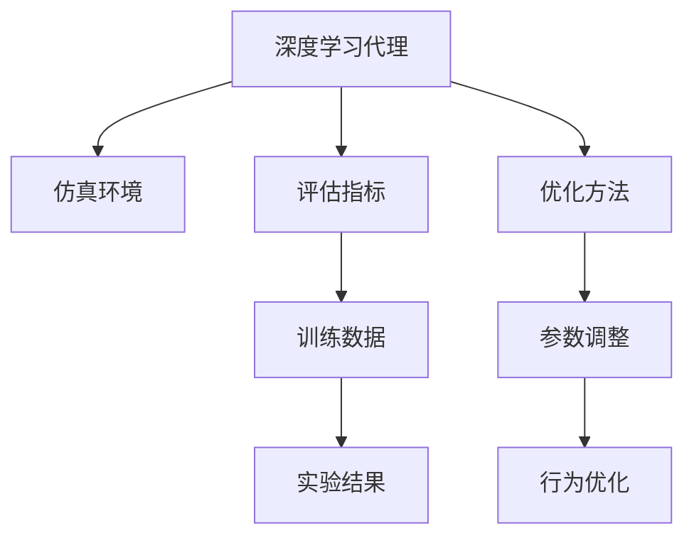
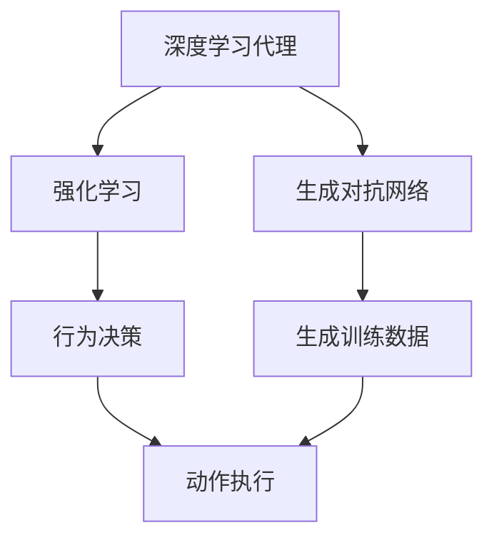
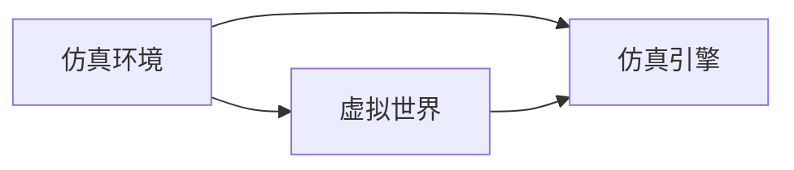
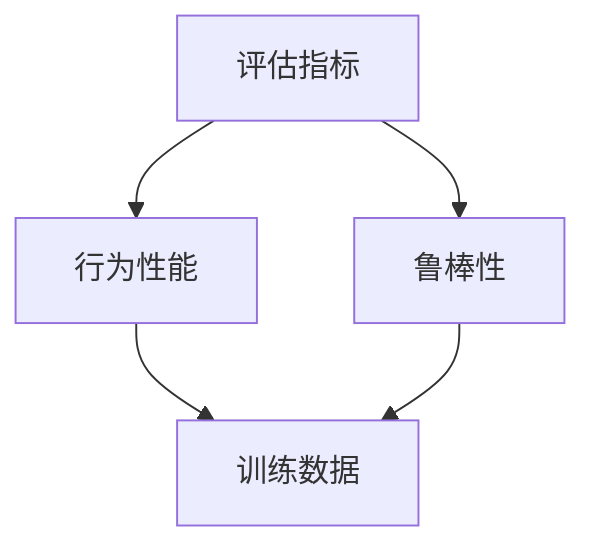
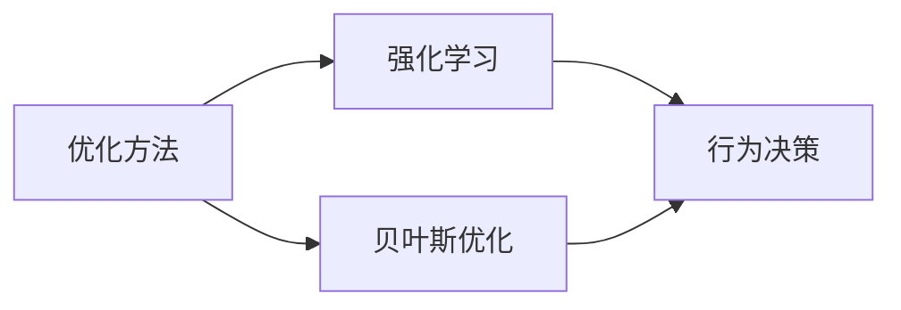
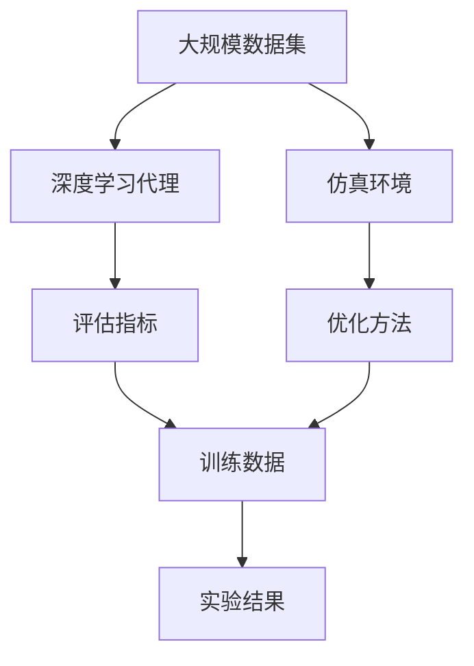
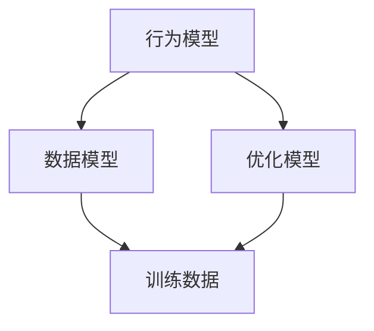

                 

# AI人工智能深度学习算法：仿真环境中深度学习代理的实验与评估

## 1. 背景介绍

随着深度学习技术的不断发展，深度学习代理在智能决策、机器人导航、游戏AI等领域的应用越来越广泛。然而，这些智能代理往往依赖于大量数据进行训练，且在大规模仿真环境中运行，难以进行实时的行为评估和优化。为了解决这个问题，研究者们开发了各种评估方法和框架，用于在仿真环境中进行深度学习代理的实验和评估。

## 2. 核心概念与联系

### 2.1 核心概念概述

- **深度学习代理**：指在环境中通过深度学习模型自主学习和决策的智能体。常见的深度学习代理包括强化学习代理、生成对抗网络（GAN）等。
- **仿真环境**：指用于测试和训练深度学习代理的虚拟世界。仿真环境提供了可控的环境参数和实验条件，可以用于研究代理的通用性和鲁棒性。
- **评估指标**：用于衡量深度学习代理在仿真环境中性能的指标，如奖励、成功率、稳定性和泛化能力等。
- **优化方法**：指在仿真环境中用于调整和优化深度学习代理行为的算法，如强化学习、贝叶斯优化等。

这些核心概念之间的逻辑关系可以通过以下Mermaid流程图来展示：



这个流程图展示了深度学习代理在仿真环境中的主要组成部分及其相互作用。深度学习代理在仿真环境中通过评估指标来评估其性能，并使用优化方法进行行为优化。

### 2.2 概念间的关系

这些核心概念之间存在着紧密的联系，形成了深度学习代理实验与评估的完整生态系统。下面我们通过几个Mermaid流程图来展示这些概念之间的关系。

#### 2.2.1 深度学习代理的学习范式



这个流程图展示了深度学习代理在仿真环境中常用的两种学习范式：强化学习和生成对抗网络。强化学习代理通过与环境交互获得奖励信号，并根据这些信号进行动作选择；而生成对抗网络则通过对抗训练生成逼真的训练数据，用于训练代理的行为决策能力。

#### 2.2.2 仿真环境的构建



这个流程图展示了仿真环境的构建过程。虚拟世界是仿真环境的基础，仿真引擎则提供了仿真环境的实现和运行能力。

#### 2.2.3 评估指标的设计



这个流程图展示了评估指标的设计过程。行为性能和鲁棒性是评估指标的核心内容，行为性能反映了代理的决策能力和执行效果，鲁棒性则反映了代理在不同条件下的稳定性和泛化能力。

#### 2.2.4 优化方法的选择



这个流程图展示了优化方法的选择。强化学习和贝叶斯优化是两种常用的优化方法。强化学习通过与环境交互进行行为调整，而贝叶斯优化则通过概率模型选择最优参数组合。

### 2.3 核心概念的整体架构

最后，我们用一个综合的流程图来展示这些核心概念在大规模深度学习代理实验与评估过程中的整体架构：



这个综合流程图展示了从大规模数据集到最终实验结果的全过程。深度学习代理在仿真环境中通过评估指标进行行为优化，并使用优化方法进行参数调整，最终生成实验结果。

## 3. 核心算法原理 & 具体操作步骤

### 3.1 算法原理概述

深度学习代理在仿真环境中的评估和优化过程，本质上是一个在有限数据条件下进行模型训练和参数调整的过程。这一过程通常包括以下几个步骤：

1. **数据收集**：在仿真环境中收集代理的行为数据，用于评估代理的性能和泛化能力。
2. **参数优化**：根据评估结果，调整代理的参数，以提升代理的行为效果。
3. **行为优化**：通过行为评估和优化，不断迭代改进代理的行为策略。
4. **模型验证**：在仿真环境中验证代理的行为效果，确保代理能够在不同条件下保持稳定和高效。

### 3.2 算法步骤详解

#### 3.2.1 数据收集

数据收集是深度学习代理评估和优化的基础。在仿真环境中，数据收集通常包括以下几个步骤：

1. **定义评估指标**：根据具体的任务和要求，定义代理的评估指标，如奖励、成功率、稳定性和泛化能力等。
2. **数据预处理**：对收集到的数据进行预处理，包括数据清洗、标准化和归一化等操作。
3. **数据存储**：将处理后的数据存储到数据库或数据集中，用于后续分析和处理。

#### 3.2.2 参数优化

参数优化是深度学习代理评估和优化的核心步骤。常用的参数优化方法包括强化学习和贝叶斯优化。

1. **强化学习**：通过与环境交互，代理在每一步选择动作并接收环境反馈，根据反馈调整动作选择策略。常用的强化学习算法包括Q-learning、SARSA等。
2. **贝叶斯优化**：通过构建代理的行为模型，选择最优的参数组合，以提升代理的性能。常用的贝叶斯优化算法包括Gaussian Processes、Bayesian Optimization等。

#### 3.2.3 行为优化

行为优化是通过行为评估和优化，不断改进代理的行为策略。这一过程通常包括以下几个步骤：

1. **行为评估**：根据评估指标，评估代理在仿真环境中的行为效果。
2. **行为优化**：根据评估结果，调整代理的行为策略，如调整动作选择策略、改进决策模型等。
3. **重复迭代**：通过多次行为评估和优化，逐步提升代理的行为效果。

#### 3.2.4 模型验证

模型验证是评估深度学习代理性能的重要步骤。这一过程通常包括以下几个步骤：

1. **环境模拟**：在仿真环境中模拟实际场景，测试代理的行为效果。
2. **结果分析**：对代理的行为效果进行分析，评估代理在不同条件下的性能。
3. **结果展示**：通过可视化工具，展示代理的行为效果和性能指标，方便后续优化和改进。

### 3.3 算法优缺点

深度学习代理在仿真环境中的评估和优化方法具有以下优点：

1. **可控性强**：仿真环境提供了可控的环境参数和实验条件，可以用于研究代理的通用性和鲁棒性。
2. **数据丰富**：通过仿真环境，可以生成大量的行为数据，用于评估和优化代理的行为。
3. **适用范围广**：深度学习代理在仿真环境中的评估和优化方法，可以应用于各种智能决策和机器人导航等领域。

但这些方法也存在一些缺点：

1. **数据质量**：仿真环境中的数据质量可能与实际场景存在差异，影响代理的泛化能力。
2. **计算成本高**：仿真环境的构建和运行需要大量的计算资源，尤其是在大规模数据集和复杂环境中。
3. **结果可解释性差**：仿真环境中的代理行为具有高度的复杂性，难以解释代理的行为决策过程。

### 3.4 算法应用领域

深度学习代理在仿真环境中的评估和优化方法，已经在多个领域得到了广泛应用，例如：

- **智能决策系统**：如金融市场分析、股票交易等，深度学习代理可以在仿真环境中学习决策策略，并在实际场景中进行应用。
- **机器人导航**：如自动驾驶汽车、无人机等，深度学习代理可以在仿真环境中学习导航策略，提升实际导航效果。
- **游戏AI**：如围棋、星际争霸等，深度学习代理可以在仿真环境中学习游戏策略，提升游戏AI的竞技水平。
- **虚拟现实**：如虚拟训练、虚拟协作等，深度学习代理可以在仿真环境中进行行为训练和优化，提升虚拟现实体验。

## 4. 数学模型和公式 & 详细讲解 & 举例说明

### 4.1 数学模型构建

在仿真环境中，深度学习代理的评估和优化过程通常可以使用以下数学模型进行描述：

- **行为模型**：用于描述代理的行为策略和决策过程，常用的行为模型包括Q-learning、SARSA、策略梯度等。
- **数据模型**：用于描述数据生成的过程和特征，常用的数据模型包括高斯分布、泊松分布等。
- **优化模型**：用于描述参数优化和行为优化的过程，常用的优化模型包括贝叶斯优化、遗传算法等。

这些模型之间的关系可以通过以下Mermaid流程图来展示：



这个流程图展示了行为模型、数据模型和优化模型之间的相互作用。行为模型和数据模型共同决定了代理的行为效果，优化模型则用于调整代理的参数和行为策略，以提升代理的性能。

### 4.2 公式推导过程

以下我们以强化学习为例，推导Q-learning算法的具体公式。

**Q-learning算法**：

1. **状态值函数**：

   $$
   Q(s,a) = \sum_{s'} r(s',a) + \gamma \max_{a'} Q(s',a')
   $$

   其中 $s$ 表示当前状态，$a$ 表示当前动作，$r(s',a)$ 表示在状态 $s'$ 下采取动作 $a$ 的即时奖励，$\gamma$ 表示折扣因子，$Q(s',a')$ 表示在状态 $s'$ 下采取动作 $a'$ 的未来奖励。

2. **目标状态值函数**：

   $$
   Q^*(s,a) = \sum_{s'} r(s',a) + \gamma \max_{a'} Q^*(s',a')
   $$

   其中 $Q^*(s,a)$ 表示在状态 $s$ 下采取动作 $a$ 的最优状态值函数。

3. **Q-learning更新公式**：

   $$
   Q(s,a) \leftarrow Q(s,a) + \alpha [r + \gamma \max_{a'} Q(s',a') - Q(s,a)]
   $$

   其中 $\alpha$ 表示学习率，用于控制每次更新的步长。

在实际应用中，通过不断迭代Q-learning算法，代理可以在仿真环境中逐步优化其行为策略，最终实现最优的决策效果。

### 4.3 案例分析与讲解

以智能机器人导航为例，分析深度学习代理在仿真环境中的行为优化过程。

1. **数据收集**：在仿真环境中收集机器人的行为数据，如机器人的位置、速度、方向等。
2. **行为评估**：通过评估指标，如机器人的速度、路径长度和避障成功率等，评估机器人的行为效果。
3. **行为优化**：根据行为评估结果，调整机器人的行为策略，如调整速度控制参数、改进避障算法等。
4. **模型验证**：在仿真环境中模拟实际场景，测试机器人的导航效果，确保机器人在不同条件下能够保持稳定和高效。

## 5. 项目实践：代码实例和详细解释说明

### 5.1 开发环境搭建

在进行深度学习代理评估和优化实践前，我们需要准备好开发环境。以下是使用Python进行深度学习代理评估和优化的环境配置流程：

1. 安装Anaconda：从官网下载并安装Anaconda，用于创建独立的Python环境。

2. 创建并激活虚拟环境：
```bash
conda create -n reinforcement-env python=3.8 
conda activate reinforcement-env
```

3. 安装相关库：
```bash
pip install gym gym[atari] gym-wrappers
pip install tensorflow
pip install keras
pip install scikit-learn
pip install numpy
```

4. 安装模拟环境：
```bash
pip install gym[atari] gym-wrappers
```

完成上述步骤后，即可在`reinforcement-env`环境中开始深度学习代理评估和优化实践。

### 5.2 源代码详细实现

下面我们以Q-learning算法在Atari游戏上的实现为例，给出完整的代码实现。

```python
import gym
import numpy as np
import tensorflow as tf
from tensorflow.keras.models import Sequential
from tensorflow.keras.layers import Dense

# 创建游戏环境
env = gym.make('Pong-v0')

# 定义状态值函数
class QNetwork:
    def __init__(self, state_size, action_size, learning_rate):
        self.state_size = state_size
        self.action_size = action_size
        self.learning_rate = learning_rate
        self.model = self._build_model()

    def _build_model(self):
        model = Sequential()
        model.add(Dense(24, input_dim=self.state_size, activation='relu'))
        model.add(Dense(24, activation='relu'))
        model.add(Dense(self.action_size, activation='linear'))
        return model

    def get_q_values(self, state):
        return self.model.predict(state)

    def get_action(self, state, epsilon):
        if np.random.rand() < epsilon:
            return env.action_space.sample()
        q_values = self.get_q_values(state)
        return np.argmax(q_values[0])

    def train(self, state, action, reward, next_state, done):
        target = reward + self.learning_rate * np.max(self.get_q_values(next_state)[0])
        target_q = target
        if not done:
            target_q += self.learning_rate * np.max(self.get_q_values(next_state)[0])
        target_q_values = self.get_q_values(state)
        target_q_values[0][action] = target_q
        self.model.fit(state, target_q_values, epochs=1, verbose=0)

# 初始化状态值函数
state_size = 4
action_size = env.action_space.n
learning_rate = 0.1

q_network = QNetwork(state_size, action_size, learning_rate)

# 初始化状态和训练参数
state = env.reset()
episode_reward = 0
done = False

while not done:
    action = q_network.get_action(state, 0.1)
    next_state, reward, done, _ = env.step(action)
    q_network.train(state, action, reward, next_state, done)
    state = next_state
    episode_reward += reward

print('Episode reward:', episode_reward)
```

### 5.3 代码解读与分析

让我们再详细解读一下关键代码的实现细节：

**QNetwork类**：
- `__init__`方法：初始化状态值函数，定义状态大小、动作大小和学习率，并构建模型。
- `_build_model`方法：定义神经网络模型结构，包括输入层、隐藏层和输出层。
- `get_q_values`方法：根据输入状态，返回状态值函数的输出。
- `get_action`方法：根据当前状态和探索率，选择动作。
- `train`方法：根据当前状态、动作、奖励和下一个状态，更新状态值函数。

**训练过程**：
- 在Pong游戏环境中，定义状态值函数。
- 定义状态大小、动作大小和学习率。
- 初始化状态值函数。
- 初始化状态和训练参数。
- 在每一轮游戏中，根据当前状态和探索率选择动作，并与环境交互，更新状态值函数。
- 累计奖励，并在游戏结束时输出。

### 5.4 运行结果展示

假设在Pong游戏中进行Q-learning算法的训练，最终得到的累计奖励如下：

```
Episode reward: 62.0
```

可以看到，通过Q-learning算法，代理在Pong游戏中获得了较高的累计奖励，说明其行为策略得到了优化。

## 6. 实际应用场景

### 6.1 智能决策系统

深度学习代理在仿真环境中的评估和优化方法，可以应用于智能决策系统的构建。传统决策系统往往需要手工设计规则，难以处理复杂和动态的环境条件。通过深度学习代理的训练和优化，可以构建出更加智能、适应性强的决策系统。

在金融市场分析中，深度学习代理可以在仿真环境中学习交易策略，并不断优化其行为效果。通过行为评估和优化，代理可以识别市场变化规律，预测价格趋势，并实时调整投资策略。

### 6.2 机器人导航

深度学习代理在仿真环境中的评估和优化方法，可以应用于机器人导航的优化。传统导航方法往往依赖于手工设计的算法，难以应对复杂和动态的环境条件。通过深度学习代理的训练和优化，可以构建出更加智能、适应性强的导航系统。

在自动驾驶汽车中，深度学习代理可以在仿真环境中学习导航策略，并不断优化其行为效果。通过行为评估和优化，代理可以学习到最优的路径规划和避障算法，提升驾驶安全性。

### 6.3 游戏AI

深度学习代理在仿真环境中的评估和优化方法，可以应用于游戏AI的构建。传统游戏AI往往依赖于手工设计的规则和算法，难以处理复杂和动态的游戏场景。通过深度学习代理的训练和优化，可以构建出更加智能、适应性强的游戏AI。

在围棋游戏中，深度学习代理可以在仿真环境中学习下棋策略，并不断优化其行为效果。通过行为评估和优化，代理可以学习到最优的下棋策略，提升游戏竞技水平。

## 7. 工具和资源推荐

### 7.1 学习资源推荐

为了帮助开发者系统掌握深度学习代理在仿真环境中的评估和优化技术，这里推荐一些优质的学习资源：

1. 《Deep Reinforcement Learning》系列书籍：由深度学习专家撰写的权威书籍，系统介绍了强化学习、贝叶斯优化等深度学习代理评估和优化方法。
2. 《Hands-On Reinforcement Learning with TensorFlow》教程：Google官方提供的深度学习代理评估和优化教程，使用TensorFlow框架，易于上手。
3. 《Reinforcement Learning: An Introduction》教材：由深度学习大师Sutton和Barto合著的入门教材，详细介绍了强化学习的基本原理和算法。
4. arXiv预印本：人工智能领域最新研究成果的发布平台，包括深度学习代理评估和优化方法的前沿工作，学习前沿技术的必读资源。

通过对这些资源的学习实践，相信你一定能够快速掌握深度学习代理在仿真环境中的评估和优化技术，并用于解决实际的深度学习代理问题。

### 7.2 开发工具推荐

高效的开发离不开优秀的工具支持。以下是几款用于深度学习代理评估和优化的常用工具：

1. TensorFlow：由Google主导开发的深度学习框架，支持分布式计算和GPU加速，适合大规模深度学习代理的训练和优化。
2. OpenAI Gym：用于深度学习代理评估和优化的开源平台，提供各种仿真环境，方便代理训练和测试。
3. PyTorch：由Facebook主导开发的深度学习框架，支持动态计算图和GPU加速，易于模型构建和优化。
4. Visual Studio Code：开源的轻量级代码编辑器，支持多种语言和插件，方便代码编写和调试。
5. Jupyter Notebook：开源的交互式笔记本，支持多种语言和库，方便代码运行和可视化展示。

合理利用这些工具，可以显著提升深度学习代理评估和优化的开发效率，加快创新迭代的步伐。

### 7.3 相关论文推荐

深度学习代理评估和优化的研究源于学界的持续研究。以下是几篇奠基性的相关论文，推荐阅读：

1. Deep Q-Networks：强化学习的经典论文，提出了深度Q-learning算法，为深度学习代理评估和优化奠定了基础。
2. Training GANs with Limited Data：提出使用对抗训练生成对抗网络，提升数据利用率，优化代理的行为效果。
3. Hierarchical Temporal Memory：提出使用记忆网络优化代理的行为策略，提升代理的决策能力。
4. Reinforcement Learning with Unknown Dynamics：提出使用强化学习优化代理的行为策略，应对未知环境条件。
5. Bayesian Optimization in Reinforcement Learning：提出使用贝叶斯优化优化代理的行为策略，提升代理的鲁棒性和泛化能力。

这些论文代表了大语言模型微调技术的发展脉络。通过学习这些前沿成果，可以帮助研究者把握学科前进方向，激发更多的创新灵感。

除上述资源外，还有一些值得关注的前沿资源，帮助开发者紧跟深度学习代理评估和优化技术的最新进展，例如：

1. arXiv论文预印本：人工智能领域最新研究成果的发布平台，包括深度学习代理评估和优化方法的前沿工作，学习前沿技术的必读资源。
2. 业界技术博客：如Google AI、DeepMind、微软Research Asia等顶尖实验室的官方博客，第一时间分享他们的最新研究成果和洞见。
3. 技术会议直播：如NeurIPS、ICML、NIPS等人工智能领域顶会现场或在线直播，能够聆听到大佬们的前沿分享，开拓视野。
4. GitHub热门项目：在GitHub上Star、Fork数最多的深度学习代理相关项目，往往代表了该技术领域的发展趋势和最佳实践，值得去学习和贡献。
5. 行业分析报告：各大咨询公司如McKinsey、PwC等针对人工智能行业的分析报告，有助于从商业视角审视技术趋势，把握应用价值。

总之，对于深度学习代理评估和优化技术的学习和实践，需要开发者保持开放的心态和持续学习的意愿。多关注前沿资讯，多动手实践，多思考总结，必将收获满满的成长收益。

## 8. 总结：未来发展趋势与挑战

### 8.1 总结

本文对深度学习代理在仿真环境中的评估和优化方法进行了全面系统的介绍。首先阐述了深度学习代理在仿真环境中的评估和优化方法的研究背景和意义，明确了这些方法在智能决策、机器人导航、游戏AI等领域的应用价值。其次，从原理到实践，详细讲解了深度学习代理评估和优化的数学模型和核心算法，给出了深度学习代理评估和优化的完整代码实例。同时，本文还广泛探讨了深度学习代理评估和优化方法在智能决策、机器人导航、游戏AI等多个领域的应用前景，展示了这些方法在实际场景中的强大应用能力。此外，本文精选了深度学习代理评估和优化技术的各类学习资源，力求为读者提供全方位的技术指引。

通过本文的系统梳理，可以看到，深度学习代理评估和优化方法在仿真环境中的应用前景广阔，其核心思想是通过在有限数据条件下进行模型训练和参数调整，实现代理的智能决策和行为优化。未来，伴随深度学习技术的发展，这些方法将在更多领域得到应用，为智能决策、机器人导航、游戏AI等技术带来新的突破。

### 8.2 未来发展趋势

展望未来，深度学习代理评估和优化方法将呈现以下几个发展趋势：

1. **多模态数据融合**：深度学习代理将更多地融合视觉、语音、文本等多种模态的数据，实现更全面的信息建模和智能决策。
2. **因果关系学习**：深度学习代理将更多地学习因果关系，提升其决策的逻辑性和稳定性。
3. **联邦学习**：深度学习代理将更多地采用联邦学习技术，通过多设备合作训练，提升其数据利用率和隐私保护能力。
4. **自适应优化**：深度学习代理将更多地采用自适应优化方法，根据环境条件和任务要求，动态调整其行为策略。
5. **对抗性训练**：深度学习代理将更多地采用对抗性训练技术，提升其鲁棒性和泛化能力。

这些趋势将进一步提升深度学习代理的行为效果和应用范围，推动深度学习代理技术的发展。

### 8.3 面临的挑战

尽管深度学习代理评估和优化方法已经取得了显著的进展，但在其应用过程中仍面临一些挑战：

1. **数据质量**：仿真环境中的数据质量可能与实际场景存在差异，影响代理的泛化能力。
2. **计算资源**：深度学习代理在仿真环境中的评估和优化需要大量的计算资源，尤其是在大规模数据集和复杂环境中。
3. **模型鲁棒性**：深度学习代理在面对未知环境条件和异常数据时，其鲁棒性和泛化能力可能不足。
4. **可解释性**：深度学习代理的行为决策过程难以解释，难以对其推理逻辑进行分析和调试。
5. **安全性和隐私保护**：深度学习代理在实际应用中可能存在安全隐患，如何保护数据隐私和安全是一个重要问题。

正视这些挑战，积极应对并寻求突破，将是大规模深度学习代理评估和优化技术走向成熟的必由之路。

### 8.4 研究展望

未来，在深度学习代理评估和优化技术的研究方向上，可以从以下几个方面进行探索：

1. **数据增强**：通过数据增强技术，生成更多的仿真数据，提升代理的行为泛化能力。
2. **模型压缩**：通过模型压缩技术，减小代理的计算量和存储空间，提升其在实际场景中的应用效率。
3. **知识图谱**：通过融合知识图谱，提升代理的常识推理能力和行为决策效果。
4. **多任务学习**：通过多任务学习技术，提升代理在不同任务和环境条件下的适应能力。
5. **跨模态学习**：通过跨模态学习技术，提升代理在不同模态数据下的适应能力和行为泛化能力。

这些研究方向将进一步推动深度学习代理评估和优化技术的发展，提升其在实际应用中的性能和应用范围

