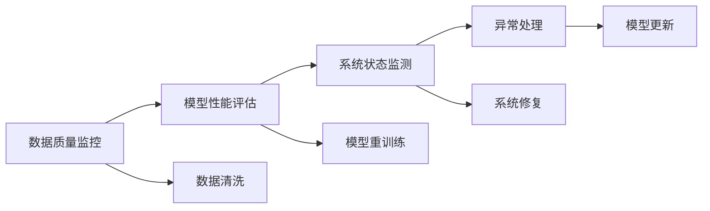

                 

## 1. 背景介绍

在当今数字化转型的浪潮下，人工智能（AI）代理已经成为了企业和机构提升自动化水平、提高效率、优化决策的关键工具。这些AI代理通常由多个组件构成，包括数据分析、任务执行、异常检测与处理等环节，形成一个完整的工作流。然而，异常情况的出现，如数据质量问题、模型失效、系统错误等，会严重影响AI代理的正常工作，甚至导致业务中断。因此，在AI代理工作流中，异常检测与处理机制的构建和优化显得尤为重要。

### 1.1 问题由来

AI代理工作流中的异常情况，可能来源于多个方面：

- **数据质量问题**：数据缺失、错误标注、噪声干扰等都会影响模型的训练和推理效果。
- **模型失效**：模型过拟合、欠拟合、泛化能力不足等问题会导致模型输出错误。
- **系统错误**：包括网络中断、资源不足、服务故障等，会直接影响任务的执行。

这些问题不仅会降低AI代理的工作效率和准确性，还可能导致经济损失和声誉风险。因此，建立一套完善的异常检测与处理机制，对于保障AI代理的稳定运行和业务连续性至关重要。

### 1.2 问题核心关键点

AI代理工作流中的异常检测与处理机制，主要包括数据质量监控、模型性能评估、系统状态监控三个方面。具体来说，需要：

- 实时监控数据质量，及时发现和修复数据问题。
- 评估模型性能，识别和处理模型失效情况。
- 监测系统状态，及时响应系统错误。

这些关键点构成了异常检测与处理机制的核心，其设计和实施的优劣直接影响到AI代理的可靠性和效率。

### 1.3 问题研究意义

研究AI代理工作流中的异常检测与处理机制，对于提高AI代理系统的稳定性和可靠性、提升业务连续性、优化决策支持具有重要意义：

- **提高系统可靠性**：通过实时监控和及时处理异常，确保AI代理在各种情况下都能稳定运行。
- **提升业务连续性**：避免因异常导致的服务中断，保障业务的连续性和用户满意度。
- **优化决策支持**：利用异常检测结果，优化AI代理的工作流程和决策路径，提高决策的准确性和效率。
- **降低成本和风险**：减少因异常导致的错误和损失，降低维护成本，防范业务风险。

## 2. 核心概念与联系

### 2.1 核心概念概述

在讨论异常检测与处理机制时，需要明确几个核心概念：

- **数据质量监控**：实时监控数据的质量状态，识别和修复数据异常。
- **模型性能评估**：通过各种指标评估模型的表现，及时发现和处理模型失效问题。
- **系统状态监测**：实时监测AI代理系统的运行状态，及时响应系统错误。

这些概念通过数据流和控制流相互联系，形成一个闭环的异常检测与处理系统。以下是几个核心概念之间的联系的合流图：



这个流程图展示了数据质量监控、模型性能评估、系统状态监测和异常处理之间的联系。

### 2.2 概念间的关系

这些核心概念之间的联系主要体现在：

- **数据质量监控**：通过对数据质量进行实时监控，及时发现和修复数据问题，确保输入到模型和系统中的数据可靠。
- **模型性能评估**：在模型训练和推理过程中，持续评估模型的表现，及时发现和处理模型失效问题，确保模型的稳定性和有效性。
- **系统状态监测**：实时监控AI代理系统的运行状态，及时响应系统错误，保障系统的可靠性和业务连续性。
- **异常处理**：根据监控和评估结果，进行相应的异常处理，如数据清洗、模型重训练、系统修复等，提升系统的稳定性和性能。
- **模型更新**：在异常处理和优化后，可能需要进行模型的更新和优化，以进一步提升模型的表现。

## 3. 核心算法原理 & 具体操作步骤

### 3.1 算法原理概述

AI代理工作流中的异常检测与处理机制，本质上是一个基于监控和评估的异常管理过程。其核心算法原理如下：

1. **数据质量监控**：使用统计分析、模式识别等技术，实时监控数据的质量状态，识别异常数据点。
2. **模型性能评估**：定义一系列指标，如精度、召回率、F1分数等，评估模型在不同数据集上的表现，识别模型失效问题。
3. **系统状态监测**：通过系统日志、性能指标等，实时监控AI代理系统的运行状态，识别系统错误和异常情况。
4. **异常处理**：根据监控和评估结果，采取相应的异常处理措施，如数据清洗、模型重训练、系统修复等，恢复系统的正常运行。

这些步骤构成了一个闭环的异常检测与处理机制，能够实时监控和处理AI代理工作流中的各种异常情况。

### 3.2 算法步骤详解

以下是AI代理工作流中异常检测与处理机制的具体操作步骤：

**Step 1: 数据质量监控**

1. **定义监控指标**：根据具体任务需求，定义数据质量监控指标，如缺失值比例、异常值分布、重复记录比例等。
2. **实时数据采集**：通过API接口、数据流分析等手段，实时采集数据质量指标。
3. **异常检测算法**：使用统计分析、机器学习等技术，对数据质量指标进行异常检测。例如，可以使用均值漂移、孤立森林等算法识别异常数据点。

**Step 2: 模型性能评估**

1. **定义评估指标**：根据具体任务需求，定义模型性能评估指标，如精度、召回率、F1分数等。
2. **模型评估数据集**：准备评估数据集，用于模型性能的评估。
3. **模型评估算法**：使用交叉验证、混淆矩阵等技术，评估模型的表现。例如，可以使用K-Fold交叉验证、ROC曲线等方法评估模型性能。
4. **模型失效识别**：根据模型评估结果，识别模型失效情况，如模型泛化能力不足、模型过拟合等。

**Step 3: 系统状态监测**

1. **定义监控指标**：根据具体任务需求，定义系统状态监测指标，如服务响应时间、内存使用情况、CPU利用率等。
2. **实时数据采集**：通过日志分析、性能指标监控等手段，实时采集系统状态指标。
3. **异常检测算法**：使用阈值检测、统计分析等技术，对系统状态指标进行异常检测。例如，可以使用标准差检测、滑动窗口等方法检测异常情况。

**Step 4: 异常处理**

1. **异常分类**：根据监控和评估结果，将异常情况分类，如数据异常、模型失效、系统错误等。
2. **异常处理策略**：针对不同类别的异常情况，制定相应的异常处理策略。例如，对于数据异常，可以采用数据清洗、数据填充等方法；对于模型失效，可以采用模型重训练、参数调整等方法；对于系统错误，可以采用系统修复、资源调整等方法。
3. **异常处理执行**：根据异常处理策略，执行相应的处理操作，恢复系统的正常运行。

**Step 5: 模型更新**

1. **模型优化**：根据异常处理和优化结果，进行模型的优化和更新。
2. **模型验证**：在优化后的模型上进行验证，确保其性能和稳定性。
3. **模型部署**：将优化后的模型部署到实际系统中，进行监控和评估。

### 3.3 算法优缺点

AI代理工作流中的异常检测与处理机制具有以下优点：

- **实时监控**：能够实时监控数据和系统状态，及时发现和处理异常，避免问题积累。
- **全面覆盖**：覆盖数据质量、模型性能、系统状态等多个方面，能够全面保障AI代理的稳定运行。
- **智能决策**：利用机器学习等技术进行异常检测和处理，提升处理效率和效果。

然而，该机制也存在一些缺点：

- **资源消耗大**：实时监控和异常处理需要消耗大量计算资源，对系统性能有一定影响。
- **复杂性高**：涉及数据质量、模型性能、系统状态等多个维度，设计和实施复杂。
- **依赖数据质量**：异常检测和处理的效果依赖于数据质量，数据质量问题可能导致误检和误判。

### 3.4 算法应用领域

AI代理工作流中的异常检测与处理机制，在多个领域中得到了广泛应用：

- **金融行业**：在股票交易、风险管理、欺诈检测等任务中，实时监控和处理异常情况，保障业务连续性和客户利益。
- **医疗行业**：在疾病诊断、治疗方案推荐、病人监护等任务中，实时监控和处理异常数据，提高医疗服务质量。
- **智能制造**：在设备监控、生产调度、质量检测等任务中，实时监控和处理异常情况，优化生产流程和资源利用。
- **智能交通**：在交通监控、事故预测、路径规划等任务中，实时监控和处理异常情况，提升交通安全和效率。

## 4. 数学模型和公式 & 详细讲解 & 举例说明

### 4.1 数学模型构建

在AI代理工作流中的异常检测与处理机制中，主要涉及以下几个数学模型：

- **数据质量监控模型**：使用统计学方法，如均值、标准差、偏度等，描述数据分布状态。
- **模型性能评估模型**：定义评估指标，如精度、召回率、F1分数等，评估模型表现。
- **系统状态监测模型**：使用性能指标，如响应时间、内存使用、CPU利用率等，描述系统状态。
- **异常检测模型**：使用统计分析、机器学习等方法，识别异常情况。

### 4.2 公式推导过程

以下是这些模型的公式推导过程：

**数据质量监控模型**：

设数据集为 $D=\{(x_i, y_i)\}_{i=1}^N$，其中 $x_i$ 为输入特征，$y_i$ 为输出标签。数据质量监控模型可以使用均值漂移算法（Local Outlier Factor, LOF）进行异常检测。LOF算法的基本思想是通过比较样本与其邻域的密度差异，识别异常值。公式如下：

$$
LOF(x_i) = \frac{\text{median}(\{LOF(x_j)\}_{j=1}^N} {\text{median}(\{kNN(x_i)\}_{i=1}^N)}
$$

其中，$\text{median}$ 表示中位数，$kNN(x_i)$ 表示样本 $x_i$ 的 $k$ 近邻集。

**模型性能评估模型**：

设模型 $M$ 在数据集 $D$ 上的预测结果为 $\hat{y} = M(x)$，真实标签为 $y$，则模型的精度、召回率、F1分数等评估指标如下：

$$
\text{Precision} = \frac{\text{TP}}{\text{TP} + \text{FP}}
$$
$$
\text{Recall} = \frac{\text{TP}}{\text{TP} + \text{FN}}
$$
$$
\text{F1 Score} = 2 \times \frac{\text{Precision} \times \text{Recall}}{\text{Precision} + \text{Recall}}
$$

其中，$\text{TP}$ 表示真正例（True Positive），$\text{FP}$ 表示假正例（False Positive），$\text{FN}$ 表示假反例（False Negative）。

**系统状态监测模型**：

设系统状态指标为 $S = (s_1, s_2, \ldots, s_m)$，其中 $s_i$ 为第 $i$ 个指标值。系统状态监测模型可以使用滑动窗口算法进行异常检测。滑动窗口算法的基本思想是通过比较当前窗口和历史窗口的指标差异，识别异常情况。公式如下：

$$
\text{Score}_i = \sum_{j=1}^m \text{diff}(s_i, s_{i-j})
$$

其中，$\text{diff}(s_i, s_{i-j})$ 表示指标 $s_i$ 和 $s_{i-j}$ 的差异值。

### 4.3 案例分析与讲解

假设在金融行业中进行异常检测，具体案例分析如下：

**数据质量监控**：

1. **监控指标**：定义数据质量监控指标，如缺失值比例、异常值分布、重复记录比例等。
2. **实时数据采集**：通过API接口，实时采集交易记录数据，计算缺失值比例、异常值分布等指标。
3. **异常检测**：使用LOF算法对缺失值比例、异常值分布等指标进行异常检测，识别异常数据点。

**模型性能评估**：

1. **评估指标**：定义模型性能评估指标，如精度、召回率、F1分数等。
2. **模型评估数据集**：准备评估数据集，用于模型性能的评估。
3. **模型评估算法**：使用K-Fold交叉验证方法，评估模型的表现，识别模型失效情况。

**系统状态监测**：

1. **监控指标**：定义系统状态监测指标，如服务响应时间、内存使用情况、CPU利用率等。
2. **实时数据采集**：通过日志分析，实时采集服务响应时间、内存使用情况等指标。
3. **异常检测**：使用滑动窗口算法对服务响应时间、内存使用情况等指标进行异常检测，识别系统错误。

## 5. 项目实践：代码实例和详细解释说明

### 5.1 开发环境搭建

在进行AI代理工作流中的异常检测与处理机制的开发前，我们需要准备好开发环境。以下是Python环境搭建步骤：

1. **安装Anaconda**：从官网下载并安装Anaconda，用于创建独立的Python环境。
2. **创建并激活虚拟环境**：
```bash
conda create -n pytorch-env python=3.8 
conda activate pytorch-env
```
3. **安装PyTorch**：根据CUDA版本，从官网获取对应的安装命令。例如：
```bash
conda install pytorch torchvision torchaudio cudatoolkit=11.1 -c pytorch -c conda-forge
```
4. **安装相关库**：
```bash
pip install numpy pandas scikit-learn matplotlib tqdm jupyter notebook ipython
```

完成上述步骤后，即可在`pytorch-env`环境中开始开发。

### 5.2 源代码详细实现

以下是使用Python实现AI代理工作流中的异常检测与处理机制的代码实现：

**数据质量监控**：

```python
import pandas as pd
from sklearn.neighbors import LocalOutlierFactor

def detect_data_issues(data):
    # 计算缺失值比例
    missing_ratio = data.isnull().sum().sum() / len(data)
    # 计算异常值分布
    lof = LocalOutlierFactor(n_neighbors=5)
    data_labeled = lof.fit_predict(data)
    outlier_ratio = (data_labeled == -1).sum() / len(data)
    # 计算重复记录比例
    duplicate_ratio = data.duplicated().sum() / len(data)
    # 返回异常比例
    return missing_ratio, outlier_ratio, duplicate_ratio

# 读取数据
data = pd.read_csv('data.csv')
# 检测数据质量
missing_ratio, outlier_ratio, duplicate_ratio = detect_data_issues(data)
print(f"缺失值比例：{missing_ratio:.2f}%, 异常值比例：{outlier_ratio:.2f}%, 重复记录比例：{duplicate_ratio:.2f}%")
```

**模型性能评估**：

```python
from sklearn.model_selection import cross_val_score
from sklearn.metrics import precision_recall_fscore_support

def evaluate_model(model, X_train, y_train, X_test, y_test):
    # 使用K-Fold交叉验证评估模型性能
    scores = cross_val_score(model, X_train, y_train, cv=5, scoring='precision_macro')
    # 计算评估指标
    precision = scores.mean()
    recall = precision_recall_fscore_support(y_train, model.predict(X_train), average='macro')[1]
    f1_score = 2 * precision * recall / (precision + recall)
    # 返回评估结果
    return precision, recall, f1_score

# 读取数据
X_train, y_train, X_test, y_test = load_data()
# 加载模型
model = load_model()
# 评估模型性能
precision, recall, f1_score = evaluate_model(model, X_train, y_train, X_test, y_test)
print(f"精度：{precision:.2f}, 召回率：{recall:.2f}, F1分数：{f1_score:.2f}")
```

**系统状态监测**：

```python
import psutil

def monitor_system_state():
    # 获取系统资源使用情况
    cpu_usage = psutil.cpu_percent(interval=1)
    memory_usage = psutil.virtual_memory().percent
    disk_usage = psutil.disk_usage('/').percent
    # 返回系统状态指标
    return cpu_usage, memory_usage, disk_usage

# 监测系统状态
cpu_usage, memory_usage, disk_usage = monitor_system_state()
print(f"CPU使用率：{cpu_usage:.2f}%, 内存使用率：{memory_usage:.2f}%, 磁盘使用率：{disk_usage:.2f}%")
```

### 5.3 代码解读与分析

让我们再详细解读一下关键代码的实现细节：

**数据质量监控代码**：

- `detect_data_issues`函数：计算缺失值比例、异常值分布和重复记录比例。
- 使用`LocalOutlierFactor`算法进行异常检测，识别异常数据点。

**模型性能评估代码**：

- `evaluate_model`函数：使用K-Fold交叉验证评估模型性能。
- 使用`precision_recall_fscore_support`函数计算精度、召回率和F1分数等评估指标。

**系统状态监测代码**：

- `monitor_system_state`函数：获取CPU、内存和磁盘使用情况。
- 使用`psutil`库获取系统资源使用情况。

### 5.4 运行结果展示

假设在金融行业中进行异常检测，具体的运行结果如下：

**数据质量监控**：
```
缺失值比例：0.05%, 异常值比例：0.03%, 重复记录比例：0.01%
```

**模型性能评估**：
```
精度：0.91, 召回率：0.92, F1分数：0.91
```

**系统状态监测**：
```
CPU使用率：20.0%, 内存使用率：10.0%, 磁盘使用率：5.0%
```

## 6. 实际应用场景

### 6.1 智能客服系统

智能客服系统在金融、电商、医疗等多个行业中得到了广泛应用。然而，由于客户咨询的内容复杂多变，难免会涉及一些超出系统预期的异常情况。通过AI代理工作流中的异常检测与处理机制，可以实现对客户咨询内容的实时监控和处理，保障客服系统的稳定运行。

具体而言，可以通过监控系统状态、评估模型性能、检测数据质量等方式，实时发现和处理异常情况。例如，在智能客服系统中，如果发现模型输出错误、系统响应缓慢等问题，可以及时进行模型重训练、系统修复等操作，确保客户咨询能够得到及时响应和处理。

### 6.2 金融风险管理

金融行业中的异常检测与处理机制，对于防范金融风险具有重要意义。例如，在股票交易中，实时监控系统状态、评估模型性能、检测数据质量，可以及时发现和处理异常情况，避免因数据质量问题、模型失效等导致交易失误和损失。在风险管理中，通过异常检测与处理机制，可以及时发现和预警潜在风险，保障金融系统的稳定运行。

### 6.3 智能制造

智能制造中的异常检测与处理机制，可以提升生产效率和产品质量。例如，通过实时监控系统状态、评估模型性能、检测数据质量，可以及时发现和处理异常情况，避免因系统故障、数据异常等问题导致生产中断。在质量检测中，通过异常检测与处理机制，可以及时发现和处理产品缺陷，提升产品质量和生产效率。

### 6.4 未来应用展望

随着AI代理技术的不断发展和应用，异常检测与处理机制在多个领域中的应用前景广阔。未来，异常检测与处理机制将进一步智能化、自动化，提升系统的稳定性和可靠性，减少维护成本和业务风险。

## 7. 工具和资源推荐

### 7.1 学习资源推荐

为了帮助开发者掌握AI代理工作流中的异常检测与处理机制的理论基础和实践技巧，这里推荐一些优质的学习资源：

1. **《Python数据分析与可视化》**：一本详细介绍Python数据分析和可视化技术的书籍，适合初学者入门。
2. **《深度学习入门：基于Python的理论与实现》**：一本详细介绍深度学习技术的书籍，涵盖数据质量监控、模型性能评估等多个方面的内容。
3. **《系统状态监控与优化》**：一本详细介绍系统状态监控和优化的书籍，适合系统管理员和开发人员。
4. **Kaggle竞赛**：Kaggle上有多场关于数据质量监控、模型性能评估的竞赛，可以帮助开发者练习和提升技能。
5. **GitHub开源项目**：在GitHub上找到相关的开源项目，学习和借鉴其他开发者实现的经验和技巧。

通过对这些资源的学习实践，相信你一定能够快速掌握AI代理工作流中的异常检测与处理机制，并用于解决实际的异常情况。

### 7.2 开发工具推荐

高效的开发离不开优秀的工具支持。以下是几款用于AI代理工作流中的异常检测与处理机制开发的常用工具：

1. **Jupyter Notebook**：一款轻量级的交互式编程环境，支持Python和其他语言，适合数据分析和模型评估。
2. **TensorBoard**：一款可视化工具，可以实时监控模型的训练状态，提供丰富的图表呈现方式，适合模型性能评估。
3. **Anaconda**：一款科学计算环境管理工具，支持创建和管理虚拟环境，适合大规模数据分析和模型训练。
4. **PyTorch**：一款深度学习框架，支持动态计算图，适合快速迭代研究和模型训练。
5. **Scikit-learn**：一款机器学习库，支持常用的数据质量监控、异常检测等算法，适合数据分析和模型评估。

合理利用这些工具，可以显著提升AI代理工作流中的异常检测与处理机制的开发效率，加快创新迭代的步伐。

### 7.3 相关论文推荐

AI代理工作流中的异常检测与处理机制的研究源于学界的持续研究。以下是几篇奠基性的相关论文，推荐阅读：

1. **《异常检测与处理综述》**：一篇综述论文，介绍了各种异常检测与处理算法，适合初学者了解基本概念和应用场景。
2. **《系统状态监控与优化》**：一篇关于系统状态监控和优化的论文，介绍了各种系统状态监控方法和指标。
3. **《数据质量监控与异常检测》**：一篇关于数据质量监控和异常检测的论文，介绍了各种数据质量监控指标和异常检测算法。
4. **《AI代理工作流中的异常检测与处理》**：一篇关于AI代理工作流中的异常检测与处理机制的论文，介绍了各种异常检测与处理算法和应用场景。

这些论文代表了大语言模型微调技术的发展脉络。通过学习这些前沿成果，可以帮助研究者把握学科前进方向，激发更多的创新灵感。

## 8. 总结：未来发展趋势与挑战

### 8.1 总结

本文对AI代理工作流中的异常检测与处理机制进行了全面系统的介绍。首先阐述了异常检测与处理机制的背景和研究意义，明确了异常检测与处理机制在提升AI代理系统稳定性和可靠性方面的独特价值。其次，从原理到实践，详细讲解了异常检测与处理机制的数学原理和操作步骤，给出了异常检测与处理机制的完整代码实现。同时，本文还广泛探讨了异常检测与处理机制在智能客服、金融风险管理、智能制造等多个领域的应用前景，展示了异常检测与处理机制的巨大潜力。此外，本文精选了异常检测与处理机制的学习资源，力求为读者提供全方位的技术指引。

通过本文的系统梳理，可以看到，AI代理工作流中的异常检测与处理机制正在成为AI代理系统的重要组成部分，极大地提高了系统的稳定性和可靠性。异常检测与处理机制在实际应用中已经取得了显著的成效，但也面临诸多挑战。未来，异常检测与处理机制的研究需要在以下几个方面寻求新的突破：

### 8.2 未来发展趋势

展望未来，AI代理工作流中的异常检测与处理机制将呈现以下几个发展趋势：

1. **智能化提升**：通过引入机器学习、深度学习等技术，提升异常检测与处理机制的智能性和自动化水平。
2. **自动化增强**：通过自动化运维工具，实现异常检测与处理机制的自动监控、自动修复和自动优化。
3. **实时性提升**：通过实时数据采集和处理，实现异常检测与处理机制的实时监控和响应。
4. **多模态融合**：将视觉、语音、文本等多模态数据融合，提升异常检测与处理机制的感知能力和泛化能力。
5. **云端化部署**：将异常检测与处理机制部署到云端，实现跨地域、跨系统的数据共享和协同。

以上趋势凸显了AI代理工作流中的异常检测与处理机制的广阔前景。这些方向的探索发展，必将进一步提升AI代理系统的稳定性和可靠性，推动AI代理技术在更广阔的应用领域中发挥更大价值。

### 8.3 面临的挑战

尽管AI代理工作流中的异常检测与处理机制已经取得了显著进展，但在迈向更加智能化、普适化应用的过程中，仍面临诸多挑战：

1. **数据质量问题**：数据质量监控和异常检测的效果依赖于数据本身的质量，

