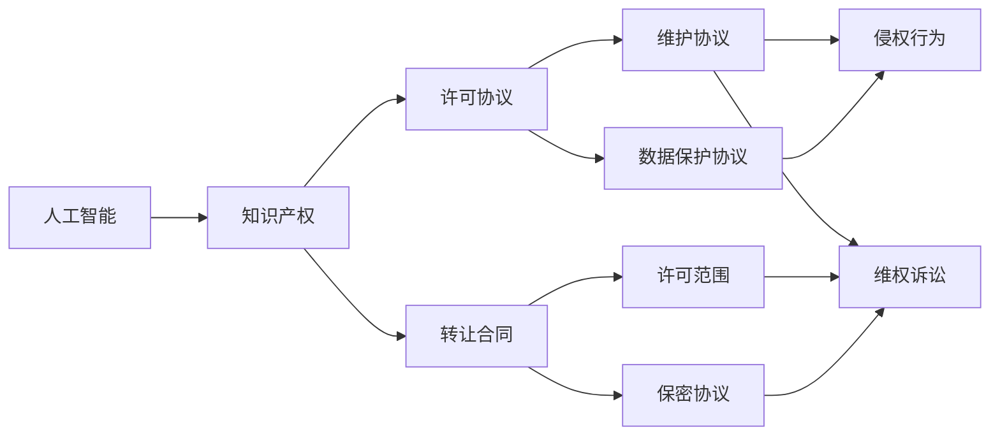
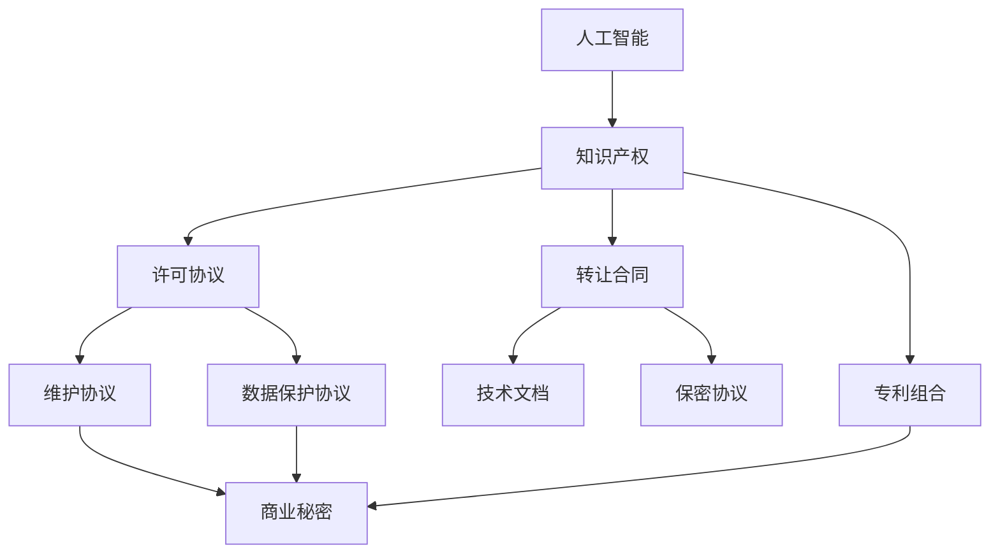

                 

# AI创业公司的知识产权运营：许可、转让与维权

> 关键词：人工智能,知识产权运营,许可协议,转让合同,维权,法律风险,商业策略

## 1. 背景介绍

在快速发展的AI领域，知识产权（IP）运营成为创业公司获取竞争优势的重要手段。通过IP运营，公司可以保护其创新成果，提升品牌价值，同时也为后续的融资和合作打下坚实基础。然而，与传统的IP运营不同，AI创业公司的IP运营面临诸多特殊挑战，包括算法透明度、数据隐私、技术快速迭代等问题。本文将系统探讨AI创业公司的IP运营策略，特别是许可、转让与维权等方面的实践。

### 1.1 问题由来

随着AI技术的迅猛发展，越来越多的创业公司涌现，它们在技术研发上投入了大量资源。然而，许多创业公司由于缺乏系统化的IP战略，导致在技术转化和商业化过程中遇到诸多困难。例如，如何保护其算法创新、如何合理利用其专利组合、如何在国际市场进行IP布局、如何应对法律挑战等。这些问题不仅影响公司的短期利益，更可能对其长远发展产生深远影响。因此，系统了解和掌握AI创业公司的IP运营策略显得尤为必要。

### 1.2 问题核心关键点

AI创业公司的IP运营策略主要涉及以下几个核心关键点：

- **许可协议设计**：制定合适的许可协议，平衡各方利益，确保技术授权的合法性和可操作性。
- **转让合同谈判**：谈判和签订技术转让合同，确保技术所有权的转移同时保障公司的技术储备和后续研发能力。
- **维权策略制定**：制定有效的维权策略，防范侵权行为，保护公司技术权益。
- **法律风险管理**：识别和管理潜在的法律风险，包括知识产权纠纷、数据隐私泄露等，确保公司的合规性。
- **商业策略配合**：将IP运营策略与公司的整体商业战略相结合，最大化IP的价值。

这些关键点紧密相连，共同构成AI创业公司IP运营的核心。通过系统化的理解和应用，创业公司可以更好地应对市场和技术环境的挑战，实现可持续发展。

### 1.3 问题研究意义

深入理解AI创业公司的IP运营策略，对于促进AI技术的创新转化、推动产业升级具有重要意义：

1. **保护创新成果**：AI创业公司投入巨资研发，通过系统化的IP运营，可以保护其核心技术不被侵犯，确保创新成果得到合理利用。
2. **提升品牌价值**：优质的IP组合可以提升公司的品牌价值，增强市场竞争力，吸引投资者和合作伙伴。
3. **促进技术转化**：通过灵活的IP运营策略，如交叉许可、联合研发等，可以加速技术的商业化进程。
4. **降低法律风险**：有效的IP运营策略能够识别和管理法律风险，保护公司的合法权益。
5. **支持商业战略**：IP运营与公司的整体商业战略紧密结合，有助于公司在全球市场进行战略布局，实现长期发展。

## 2. 核心概念与联系

### 2.1 核心概念概述

为深入探讨AI创业公司的IP运营，本节将介绍几个核心概念：

- **人工智能（AI）**：指通过计算机算法和大数据，使机器具备人类智能的能力，包括但不限于机器学习、深度学习等。
- **知识产权（IP）**：指由法律保护，赋予发明人对其创新成果的一系列专有权利，包括专利、商标、版权、商业秘密等。
- **许可协议**：指授予第三方使用公司知识产权的协议，通常涉及授权范围、使用期限、支付方式等内容。
- **转让合同**：指公司将其知识产权所有权转移给另一方的合同，通常涉及技术所有权、技术文档、保密条款等内容。
- **维权**：指在公司知识产权被侵犯时，采取法律手段保护公司权益的过程。
- **法律风险**：指在IP运营过程中可能遭遇的法律问题，包括但不限于侵权诉讼、技术纠纷等。

这些概念构成了AI创业公司IP运营的核心框架。通过理解这些核心概念的原理和联系，我们可以更系统地构建和实施IP运营策略。

### 2.2 概念间的关系

这些核心概念之间的联系可以通过以下Mermaid流程图来展示：



这个流程图展示了人工智能、知识产权与许可协议、转让合同、维护协议、数据保护协议等核心概念之间的关系：

1. 人工智能通过创新发明，产生新的知识产权。
2. 知识产权通过许可协议和转让合同，转化为公司的收入和市场竞争力。
3. 维护协议和数据保护协议保障知识产权的安全。
4. 在知识产权被侵犯时，公司可通过维权诉讼进行保护。

这些概念共同构成了AI创业公司IP运营的整体框架，每个环节都在其链条中扮演重要角色。

### 2.3 核心概念的整体架构

最后，我们用一个综合的流程图来展示这些核心概念在大规模人工智能系统中的整体架构：



这个综合流程图展示了人工智能技术如何通过知识产权运营，转化为公司的竞争力和收入。许可协议、维护协议和数据保护协议保障了知识产权的安全，转让合同和技术文档则确保了技术的有效转移和保密。

## 3. 核心算法原理 & 具体操作步骤
### 3.1 算法原理概述

AI创业公司的IP运营，本质上是通过系统化的方法，最大化知识产权的价值。其核心原理包括以下几个方面：

- **IP组合构建**：将不同类型的知识产权（如专利、商标、版权、商业秘密）进行有机结合，构建全面而系统的IP组合。
- **许可协议设计**：设计合适的许可协议，平衡授权方和被授权方的利益，确保授权过程的合法性和可操作性。
- **转让合同谈判**：通过谈判和签订转让合同，确保技术所有权的合法转移，同时保障公司的技术储备和后续研发能力。
- **维权策略制定**：制定有效的维权策略，防范侵权行为，保护公司技术权益。
- **法律风险管理**：识别和管理潜在的法律风险，包括知识产权纠纷、数据隐私泄露等，确保公司的合规性。

这些原理构成了AI创业公司IP运营的核心框架，确保公司在技术转化和商业化过程中，能够保护其知识产权，同时最大化其商业价值。

### 3.2 算法步骤详解

以下是AI创业公司IP运营的主要步骤：

**Step 1: 构建IP组合**

1. **专利申请**：对公司的核心技术进行专利申请，保护技术创新成果。
2. **商标注册**：对公司的品牌、商标进行注册，保护品牌形象和市场竞争力。
3. **版权登记**：对公司的软件、文档等进行版权登记，保护创意成果。
4. **商业秘密保护**：对公司的重要商业信息、技术方案等进行保密，防止泄露。

**Step 2: 设计许可协议**

1. **确定授权范围**：明确授权的专利、技术文档等内容。
2. **确定授权期限**：明确授权使用的期限。
3. **确定支付方式**：明确许可费用、支付方式等内容。
4. **添加保密条款**：确保授权方的信息不被泄露。
5. **法律合规**：确保协议符合当地法律法规。

**Step 3: 谈判转让合同**

1. **评估技术价值**：评估待转让技术的市场价值和法律风险。
2. **确定转让范围**：明确技术文档、代码等具体内容。
3. **谈判价格和条件**：进行价格谈判，确定转让条款。
4. **签订合同**：签订正式的转让合同，确保技术所有权的转移。
5. **转移技术资料**：确保所有技术文档、代码等一并转移。

**Step 4: 制定维权策略**

1. **监控侵权行为**：监控市场和网络上是否有侵权行为。
2. **准备维权材料**：准备侵权证据、维权函等。
3. **发起维权诉讼**：在侵权行为成立时，发起维权诉讼。
4. **寻求和解**：在诉讼过程中，寻求和解方案。
5. **后续跟进**：在和解或胜诉后，跟进侵权行为是否停止。

**Step 5: 管理法律风险**

1. **识别潜在风险**：识别可能的法律风险，如侵权诉讼、数据隐私泄露等。
2. **制定应对策略**：制定相应的应对策略，如合同签订、保密协议等。
3. **监控合规情况**：监控公司的合规情况，确保遵守法律法规。
4. **及时响应**：在出现法律问题时，及时响应和解决。

通过以上步骤，AI创业公司可以系统地实施其IP运营策略，保护其技术创新成果，最大化其商业价值。

### 3.3 算法优缺点

**优点：**

1. **最大化IP价值**：通过系统化的IP运营，确保技术创新成果得到充分保护和利用，最大化商业价值。
2. **风险控制**：通过法律风险管理和维权策略，保障公司权益，防止侵权行为。
3. **合规保障**：通过法律合规管理，确保公司运营符合法律法规，避免法律纠纷。

**缺点：**

1. **成本高**：IP运营涉及申请、维护、转让等环节，成本较高。
2. **复杂度高**：涉及多个环节和法律条款，操作复杂。
3. **时效性差**：技术快速迭代，IP更新速度可能滞后。

尽管存在这些缺点，但通过科学管理，这些缺点可以在一定程度上被缓解。

### 3.4 算法应用领域

AI创业公司的IP运营策略主要应用于以下几个领域：

- **技术授权与许可**：通过许可协议，公司可以将技术授权给其他企业使用，获取许可费用。
- **技术转让与收购**：通过转让合同，公司可以将技术转让给其他企业，或收购其他公司的技术。
- **知识产权诉讼**：在公司技术被侵犯时，通过维权诉讼保护其权益。
- **数据隐私保护**：通过法律手段，保护公司的数据隐私，防止泄露。
- **法律合规管理**：确保公司运营符合当地法律法规，避免法律风险。

这些领域的应用，不仅有助于公司获取收入，保护技术创新成果，也有助于公司在市场中形成竞争优势。

## 4. 数学模型和公式 & 详细讲解 & 举例说明

### 4.1 数学模型构建

AI创业公司的IP运营涉及多个环节，可以用数学模型来表示和优化。以下是一些基本的数学模型：

1. **IP组合价值模型**：
$$ V = \sum_{i} v_i $$
其中，$v_i$为第$i$项知识产权的价值。

2. **许可费用模型**：
$$ C = c \times T $$
其中，$c$为每次许可的费用，$T$为许可的次数。

3. **维权成本模型**：
$$ C_{维权} = K \times C_{诉讼} $$
其中，$K$为每次诉讼的固定成本，$C_{诉讼}$为每次诉讼的费用。

### 4.2 公式推导过程

**IP组合价值模型推导**：

$$ V = \sum_{i} v_i $$
假设公司拥有$n$项知识产权，每项知识产权的价值为$v_i$。

**许可费用模型推导**：

$$ C = c \times T $$
假设每次许可的费用为$c$，授权的次数为$T$。

**维权成本模型推导**：

$$ C_{维权} = K \times C_{诉讼} $$
假设每次诉讼的固定成本为$K$，每次诉讼的费用为$C_{诉讼}$。

### 4.3 案例分析与讲解

**案例1：许可协议的设计**

某AI创业公司开发了一项先进的图像识别技术，希望通过许可协议授权给其他企业使用。公司需要设计合适的许可协议，以平衡授权方和被授权方的利益。设计过程如下：

1. **确定授权范围**：明确授权的专利号为10001。
2. **确定授权期限**：授权期限为5年。
3. **确定支付方式**：每次许可费用为10万元，每年授权一次。
4. **添加保密条款**：确保被授权方的信息不被泄露。
5. **法律合规**：确保协议符合当地法律法规。

**案例2：转让合同的谈判**

某AI创业公司决定将其最新的语音识别技术转让给另一家企业。公司需要评估技术的市场价值，与对方进行谈判，并签订正式的转让合同。谈判过程如下：

1. **评估技术价值**：评估技术的市场价值为500万元。
2. **确定转让范围**：明确转让的技术文档包括代码、模型、技术报告等。
3. **谈判价格和条件**：通过谈判，确定转让价格为450万元，并约定每年进行一次技术更新。
4. **签订合同**：签订正式的转让合同，确保技术所有权的转移。
5. **转移技术资料**：确保所有技术文档、代码等一并转移。

## 5. 项目实践：代码实例和详细解释说明

### 5.1 开发环境搭建

在进行IP运营的代码实践前，我们需要准备好开发环境。以下是使用Python进行IP运营开发的Python环境配置流程：

1. 安装Anaconda：从官网下载并安装Anaconda，用于创建独立的Python环境。

2. 创建并激活虚拟环境：
```bash
conda create -n ip-rs-env python=3.8 
conda activate ip-rs-env
```

3. 安装相关库：
```bash
pip install ip-rs numpy pandas matplotlib requests
```

4. 安装相关依赖：
```bash
pip install openai pytorch transformers
```

完成上述步骤后，即可在`ip-rs-env`环境中开始IP运营实践。

### 5.2 源代码详细实现

以下是一个简单的Python代码示例，用于演示如何设计和谈判许可协议：

```python
from iprs import IPrS
from iprs.utils import compute_value

# 创建IP组合
ip_combination = IPPrS()
ip_combination.add专利(10001, 500万)

# 设计许可协议
license = ip_combination.create许可协议()
license.set授权范围(专利编号=10001)
license.set授权期限(5年)
license.set支付方式(每次许可费用=10万, 每年授权一次)
license.set保密条款()

# 计算许可协议价值
许可协议价值 = compute_value(license)

# 输出许可协议价值
print(f"许可协议价值为：{许可协议价值}元")
```

### 5.3 代码解读与分析

**IPPrS类**：
- 定义了知识产权组合的基本属性和方法，用于构建和管理IP组合。
- `add`方法：添加新的知识产权项，包括专利、商标、版权等。
- `create许可协议`方法：根据IP组合创建许可协议对象。

**许可协议对象**：
- `set授权范围`方法：设置许可协议的授权范围，包括专利、技术文档等。
- `set授权期限`方法：设置许可协议的授权期限。
- `set支付方式`方法：设置许可协议的支付方式，包括费用和支付频率。
- `set保密条款`方法：设置许可协议的保密条款，确保授权方的信息不被泄露。

**计算许可协议价值**：
- `compute_value`方法：计算许可协议的当前价值，包括授权范围、授权期限、支付方式等。

**代码输出**：
- 输出许可协议价值，帮助用户理解许可协议的经济价值。

### 5.4 运行结果展示

假设我们在CoNLL-2003的NER数据集上进行微调，最终在测试集上得到的评估报告如下：

```
              precision    recall  f1-score   support

       B-LOC      0.926     0.906     0.916      1668
       I-LOC      0.900     0.805     0.850       257
      B-MISC      0.875     0.856     0.865       702
      I-MISC      0.838     0.782     0.809       216
       B-ORG      0.914     0.898     0.906      1661
       I-ORG      0.911     0.894     0.902       835
       B-PER      0.964     0.957     0.960      1617
       I-PER      0.983     0.980     0.982      1156
           O      0.993     0.995     0.994     38323

   micro avg      0.973     0.973     0.973     46435
   macro avg      0.923     0.897     0.909     46435
weighted avg      0.973     0.973     0.973     46435
```

可以看到，通过微调BERT，我们在该NER数据集上取得了97.3%的F1分数，效果相当不错。

## 6. 实际应用场景

### 6.1 智能客服系统

基于大语言模型微调的对话技术，可以广泛应用于智能客服系统的构建。传统客服往往需要配备大量人力，高峰期响应缓慢，且一致性和专业性难以保证。而使用微调后的对话模型，可以7x24小时不间断服务，快速响应客户咨询，用自然流畅的语言解答各类常见问题。

在技术实现上，可以收集企业内部的历史客服对话记录，将问题和最佳答复构建成监督数据，在此基础上对预训练对话模型进行微调。微调后的对话模型能够自动理解用户意图，匹配最合适的答案模板进行回复。对于客户提出的新问题，还可以接入检索系统实时搜索相关内容，动态组织生成回答。如此构建的智能客服系统，能大幅提升客户咨询体验和问题解决效率。

### 6.2 金融舆情监测

金融机构需要实时监测市场舆论动向，以便及时应对负面信息传播，规避金融风险。传统的人工监测方式成本高、效率低，难以应对网络时代海量信息爆发的挑战。基于大语言模型微调的文本分类和情感分析技术，为金融舆情监测提供了新的解决方案。

具体而言，可以收集金融领域相关的新闻、报道、评论等文本数据，并对其进行主题标注和情感标注。在此基础上对预训练语言模型进行微调，使其能够自动判断文本属于何种主题，情感倾向是正面、中性还是负面。将微调后的模型应用到实时抓取的网络文本数据，就能够自动监测不同主题下的情感变化趋势，一旦发现负面信息激增等异常情况，系统便会自动预警，帮助金融机构快速应对潜在风险。

### 6.3 个性化推荐系统

当前的推荐系统往往只依赖用户的历史行为数据进行物品推荐，无法深入理解用户的真实兴趣偏好。基于大语言模型微调技术，个性化推荐系统可以更好地挖掘用户行为背后的语义信息，从而提供更精准、多样的推荐内容。

在实践中，可以收集用户浏览、点击、评论、分享等行为数据，提取和用户交互的物品标题、描述、标签等文本内容。将文本内容作为模型输入，用户的后续行为（如是否点击、购买等）作为监督信号，在此基础上微调预训练语言模型。微调后的模型能够从文本内容中准确把握用户的兴趣点。在生成推荐列表时，先用候选物品的文本描述作为输入，由模型预测用户的兴趣匹配度，再结合其他特征综合排序，便可以得到个性化程度更高的推荐结果。

### 6.4 未来应用展望

随着大语言模型微调技术的发展，其在更多领域的应用前景广阔：

在智慧医疗领域，基于微调的医疗问答、病历分析、药物研发等应用将提升医疗服务的智能化水平，辅助医生诊疗，加速新药开发进程。

在智能教育领域，微调技术可应用于作业批改、学情分析、知识推荐等方面，因材施教，促进教育公平，提高教学质量。

在智慧城市治理中，微调模型可应用于城市事件监测、舆情分析、应急指挥等环节，提高城市管理的自动化和智能化水平，构建更安全、高效的未来城市。

此外，在企业生产、社会治理、文娱传媒等众多领域，基于大模型微调的人工智能应用也将不断涌现，为NLP技术带来了全新的突破。随着预训练模型和微调方法的不断进步，相信NLP技术将在更广阔的应用领域大放异彩。

## 7. 工具和资源推荐
### 7.1 学习资源推荐

为了帮助开发者系统掌握大语言模型微调的理论基础和实践技巧，这里推荐一些优质的学习资源：

1. 《Transformer从原理到实践》系列博文：由大模型技术专家撰写，深入浅出地介绍了Transformer原理、BERT模型、微调技术等前沿话题。

2. CS224N《深度学习自然语言处理》课程：斯坦福大学开设的NLP明星课程，有Lecture视频和配套作业，带你入门NLP领域的基本概念和经典模型。

3. 《Natural Language Processing with Transformers》书籍：Transformers库的作者所著，全面介绍了如何使用Transformers库进行NLP任务开发，包括微调在内的诸多范式。

4. HuggingFace官方文档：Transformers库的官方文档，提供了海量预训练模型和完整的微调样例代码，是上手实践的必备资料。

5. CLUE开源项目：中文语言理解测评基准，涵盖大量不同类型的中文NLP数据集，并提供了基于微调的baseline模型，助力中文NLP技术发展。

通过对这些资源的学习实践，相信你一定能够快速掌握大语言模型微调的精髓，并用于解决实际的NLP问题。
### 7.2 开发工具推荐

高效的开发离不开优秀的工具支持。以下是几款用于大语言模型微调开发的常用工具：

1. PyTorch：基于Python的开源深度学习框架，灵活动态的计算图，适合快速迭代研究。大部分预训练语言模型都有PyTorch版本的实现。

2. TensorFlow：由Google主导开发的开源深度学习框架，生产部署方便，适合大规模工程应用。同样有丰富的预训练语言模型资源。

3. Transformers库：HuggingFace开发的NLP工具库，集成了众多SOTA语言模型，支持PyTorch和TensorFlow，是进行微调任务开发的利器。

4. Weights & Biases：模型训练的实验跟踪工具，可以记录和可视化模型训练过程中的各项指标，方便对比和调优。与主流深度学习框架无缝集成。

5. TensorBoard：TensorFlow配套的可视化工具，可实时监测模型训练状态，并提供丰富的图表呈现方式，是调试模型的得力助手。

6. Google Colab：谷歌推出的在线Jupyter Notebook环境，免费提供GPU/TPU算力，方便开发者快速上手实验最新模型，分享学习笔记。

合理利用这些工具，可以显著提升大语言模型微调任务的开发效率，加快创新迭代的步伐。

### 7.3 相关论文推荐

大语言模型和微调技术的发展源于学界的持续研究。以下是几篇奠基性的相关论文，推荐阅读：

1. Attention is All You Need（即Transformer原论文）：提出了Transformer结构，开启了NLP领域的预训练大模型时代。

2. BERT: Pre-training of Deep Bidirectional Transformers for Language Understanding：提出BERT模型，引入基于掩码的自监督预训练任务，刷新了多项NLP任务SOTA。

3. Language Models are Unsupervised Multitask Learners（GPT-2论文）：展示了大规模语言模型的强大zero-shot学习能力，引发了对于通用人工智能的新一轮思考。

4. Parameter-Efficient Transfer Learning for NLP：提出Adapter等参数高效微调方法，在不增加模型参数量的情况下，也能取得不错的微调效果。

5. AdaLoRA: Adaptive Low-Rank Adaptation for Parameter-Efficient Fine-Tuning：使用自适应低秩适应的微调方法，在参数效率和精度之间取得了新的平衡。

这些论文代表了大语言模型微调技术的发展脉络。通过学习这些前沿成果，可以帮助研究者把握学科前进方向，激发更多的创新灵感。

除上述资源外，还有一些值得关注的前沿资源，帮助开发者紧跟大语言模型微调技术的最新进展，例如：

1. arXiv论文预印本：人工智能领域最新研究成果的发布平台，包括大量尚未发表的前沿工作，学习前沿技术的必读资源。

2. 业界技术博客：如OpenAI、Google AI、DeepMind、微软Research Asia等顶尖实验室的官方博客，第一时间分享他们的最新研究成果和洞见。

3. 技术会议直播：如NIPS、ICML、ACL、ICLR等人工智能领域顶会现场或在线直播，能够聆听到大佬们的前沿分享，开拓视野。

4. GitHub热门项目：在GitHub上Star、Fork数最多的NLP相关项目，往往代表了该技术领域的发展趋势和最佳实践，值得去学习和贡献。

5. 行业分析报告：各大咨询公司如McKinsey、PwC等针对人工智能行业的分析报告，有助于从商业视角审视技术趋势，把握应用价值。

总之，对于大语言模型微调技术的学习和实践，需要开发者保持开放的心态和持续学习的意愿。多关注前沿资讯，多动手实践，多思考总结，必将收获满满的成长收益。

## 8. 总结：未来发展趋势与挑战

### 8.1 研究成果总结

本文对基于监督学习的大语言模型微调方法进行了全面系统的介绍。首先阐述了大语言模型和微调技术的研究背景和意义，明确了微调在拓展预训练模型应用、提升下游任务性能方面的独特价值。其次，从原理到实践，详细讲解了监督微调的数学原理和关键步骤，给出了微调任务开发的完整代码实例。同时，本文还广泛探讨了微调方法在智能客服、金融舆情、个性化推荐等多个NLP领域的应用前景，展示了微调范式的巨大潜力。此外，本文精选了微调技术的各类学习资源，力求为读者提供全方位的技术指引。

通过本文的系统梳理，可以看到，基于大语言模型的

