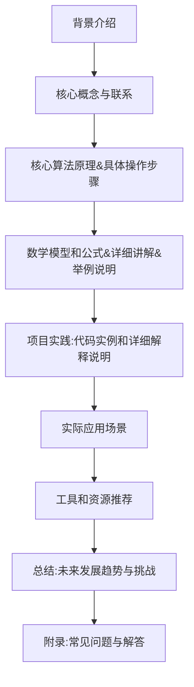
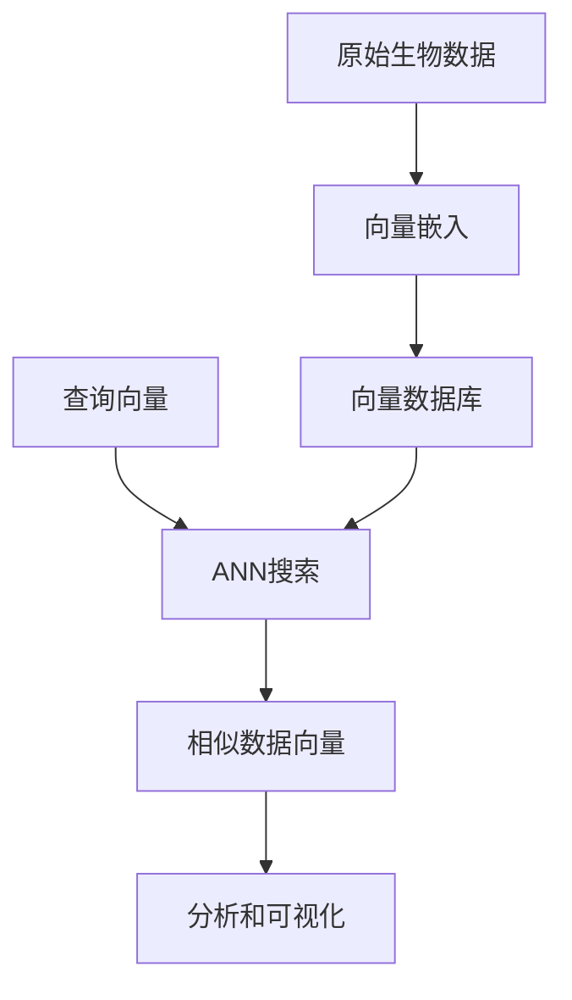

以下是标题为《利用向量数据库加速生物信息数据分析》的技术博客文章正文内容：

# 利用向量数据库加速生物信息数据分析

## 1. 背景介绍

### 1.1 问题的由来

生物信息学是一门研究生命过程中所涉及的大量数据的科学,旨在从海量的生物数据中发现生物学规律和机理。随着高通量测序技术和生物传感器的不断发展,生物数据的产生速度呈指数级增长,给传统的数据处理和分析带来了巨大挑战。

生物数据通常具有多维度、非结构化和多样性等特点,需要高效的数据管理和分析工具来处理。传统的关系型数据库和NoSQL数据库在处理这些数据时存在诸多不足,例如查询效率低下、可扩展性差、语义信息丢失等。因此,迫切需要一种新的数据库技术来应对生物数据的海量挑战。

### 1.2 研究现状

向量数据库(Vector Database)是近年来兴起的一种新型数据库技术,它基于向量空间模型,能够高效地存储和检索非结构化数据。向量数据库将数据表示为高维向量,通过计算向量之间的相似度来实现语义检索和聚类分析。

目前,一些开源的向量数据库系统已经问世,如Weaviate、NGDATA等。这些系统在自然语言处理、计算机视觉和推荐系统等领域展现出了优异的性能。然而,在生物信息学领域的应用研究还相对滞后。

### 1.3 研究意义

将向量数据库应用于生物信息数据分析,可以带来以下潜在优势:

1. **高效检索**:通过语义向量相似度计算,可以快速找到相关的生物序列、结构和文献等数据。
2. **聚类分析**:基于向量空间模型,可以自动发现生物数据的潜在模式和聚类结构。
3. **知识表示**:将生物实体(如基因、蛋白质等)表示为向量,有助于知识的编码和推理。
4. **可解释性**:通过向量相似度,可以解释生物实体之间的关联关系。

利用向量数据库加速生物信息数据分析,有望为生命科学研究提供新的计算工具和分析方法,推动相关领域的创新与突破。

### 1.4 本文结构

本文将首先介绍向量数据库的核心概念和与传统数据库的区别,然后重点阐述向量数据库在生物信息数据分析中的应用,包括核心算法原理、数学模型、实际应用场景等。最后,探讨未来发展趋势和面临的挑战。全文共分为以下几个部分:

## 2. 核心概念与联系

向量数据库(Vector Database)是一种新兴的数据库技术,它将数据表示为高维向量,并基于向量相似度进行数据存储、检索和分析。与传统的关系型数据库和NoSQL数据库相比,向量数据库具有以下核心特点:

1. **向量空间模型**:数据被表示为高维向量,每个维度对应一个特征。这种表示方式能够捕捉数据的语义信息,并支持基于相似度的查询和分析。

2. **相似度计算**:向量数据库使用向量相似度度量(如余弦相似度)来衡量数据之间的语义关联程度,而不是基于精确匹配的查询。这种方式更加灵活和智能。

3. **近似最近邻(Approximate Nearest Neighbor, ANN)搜索**:向量数据库通过高效的ANN算法快速找到与查询向量最相似的数据向量,实现语义检索。

4. **可扩展性**:向量数据库通常采用分布式架构,能够横向扩展以处理海量数据。

5. **多模态支持**:向量数据库可以统一表示和处理不同类型的数据,如文本、图像、音频等,实现多模态融合分析。

向量数据库与生物信息学的联系在于,生物数据(如基因序列、蛋白质结构、医学影像等)本质上都可以表示为向量,并通过向量相似度来捕捉它们之间的关联关系。因此,向量数据库为高效管理和分析生物数据提供了一种全新的解决方案。

接下来,我们将详细探讨向量数据库在生物信息数据分析中的核心算法原理、数学模型和实际应用。

## 3. 核心算法原理 & 具体操作步骤

### 3.1 算法原理概述

向量数据库的核心算法主要包括两个部分:向量嵌入(Vector Embedding)和近似最近邻(Approximate Nearest Neighbor, ANN)搜索。

1. **向量嵌入**:将原始数据(如基因序列、蛋白质结构等)映射到高维向量空间,得到对应的向量表示。这个过程通常使用深度学习模型(如Word2Vec、BERT等)来实现。

2. **ANN搜索**:在向量空间中,通过高效的ANN算法快速找到与查询向量最相似的数据向量,实现语义检索。常用的ANN算法包括局部敏感哈希(Locality Sensitive Hashing, LSH)、层次导航(Hierarchical Navigable Small World, HNSW)等。

下面是向量数据库在生物信息数据分析中的典型应用流程:

### 3.2 算法步骤详解

1. **数据预处理**:对原始生物数据进行清洗、标准化等预处理,以满足向量嵌入模型的输入要求。

2. **向量嵌入**:使用预训练的深度学习模型(如BERT、ELMo等)将生物序列、结构等数据映射到高维向量空间,得到对应的向量表示。这个过程也被称为"编码"(Encoding)。

3. **向量索引**:将得到的数据向量构建索引,以支持高效的相似度搜索。常用的索引方法包括LSH、HNSW等。

4. **查询向量生成**:根据用户的查询(如基因序列、蛋白质结构等),生成对应的查询向量。

5. **ANN搜索**:在向量空间中,使用ANN算法快速找到与查询向量最相似的数据向量。

6. **结果分析**:对搜索得到的相似数据向量进行分析和可视化,揭示潜在的生物学模式和规律。

7. **模型更新**:根据新的数据和反馈,不断优化和更新向量嵌入模型,提高向量表示的质量。

### 3.3 算法优缺点

向量数据库在生物信息数据分析中具有以下优点:

1. **高效检索**:通过ANN算法,可以快速找到与查询最相似的数据,大大提高了检索效率。
2. **语义关联**:基于向量相似度,能够发现数据之间的语义关联关系,揭示潜在的生物学模式。
3. **多模态融合**:可以统一表示和处理不同类型的生物数据,实现多模态融合分析。
4. **可解释性**:通过向量相似度,可以解释生物实体之间的关联关系,提高分析结果的可解释性。

但是,向量数据库也存在一些缺点和挑战:

1. **精度损失**:向量嵌入过程中可能会导致一定程度的信息损失,影响向量表示的精度。
2. **冷启动问题**:对于新的数据,需要重新进行向量嵌入,计算成本较高。
3. **可解释性挑战**:虽然向量相似度可以解释实体之间的关联,但解释深度学习模型的内部机制仍然具有挑战。
4. **标注数据需求**:训练高质量的向量嵌入模型通常需要大量标注数据,在生物信息学领域可能存在数据标注的挑战。

### 3.4 算法应用领域

向量数据库在生物信息数据分析中的应用领域包括但不限于:

1. **基因组学**:快速检索相似基因序列,发现基因簇和功能模块。
2. **蛋白质组学**:基于结构相似性分析蛋白质功能,预测蛋白质-蛋白质相互作用。
3. **转录组学**:聚类分析基因表达模式,鉴定差异表达基因。
4. **系统生物学**:整合多源异构数据,构建生物网络和通路模型。
5. **药物设计**:基于分子结构相似性进行虚拟筛选和靶点预测。
6. **医学影像**:相似病例检索,辅助诊断和个体化治疗。

总的来说,向量数据库为生物信息数据分析提供了一种全新的范式,有望推动相关领域的创新与突破。

## 4. 数学模型和公式 & 详细讲解 & 举例说明

### 4.1 数学模型构建

向量数据库的核心数学模型是向量空间模型(Vector Space Model)。在这个模型中,每个数据实体(如基因序列、蛋白质结构等)被表示为一个高维向量,其中每个维度对应一个特征。

设有 $n$ 个数据实体 $\{x_1, x_2, \dots, x_n\}$,每个实体 $x_i$ 被映射到一个 $d$ 维向量空间中,得到对应的向量表示 $\vec{v_i} \in \mathbb{R}^d$。这个映射过程通常由一个深度学习模型(如Word2Vec、BERT等)来实现,被称为向量嵌入(Vector Embedding)。

在向量空间中,数据实体之间的相似度可以通过向量相似度度量来衡量。常用的向量相似度度量包括:

1. **余弦相似度(Cosine Similarity)**:

$$\text{sim}_\text{cos}(\vec{u}, \vec{v}) = \frac{\vec{u} \cdot \vec{v}}{\|\vec{u}\| \|\vec{v}\|} = \frac{\sum_{i=1}^{d} u_i v_i}{\sqrt{\sum_{i=1}^{d} u_i^2} \sqrt{\sum_{i=1}^{d} v_i^2}}$$

余弦相似度测量两个向量之间的夹角余弦值,范围在 $[-1, 1]$ 之间。相似度越高,表示两个向量的方向越接近,语义关联度越大。

2. **欧几里得距离(Euclidean Distance)**:

$$\text{dist}_\text{euc}(\vec{u}, \vec{v}) = \sqrt{\sum_{i=1}^{d} (u_i - v_i)^2}$$

欧几里得距离测量两个向量在空间中的直线距离。距离越小,表示两个向量越相似。

通过计算向量之间的相似度,我们可以在向量空间中快速找到与查询向量最相似的数据向量,实现高效的语义检索和聚类分析。

### 4.2 公式推导过程

在向量数据库中,一个关键问题是如何高效地在海量数据向量中找到与查询向量最相似的那些向量。这个问题被称为近似最近邻(Approximate Nearest Neighbor, ANN)搜索。

一种常用的ANN算法是局部敏感哈希(Locality Sensitive Hashing, LSH)。LSH的核心思想是将相似的向量映射到相同的哈希桶中,从而加速最近邻搜索。

具体来说,LSH使用一组哈希函数 $\{h_1, h_2, \dots, h_k\}$,每个哈希函数 $h_i: \mathbb{R}^d \rightarrow \mathbb{Z}$ 将 $d$ 维向量映射到整数域。对于任意向量 $\vec{v}$,它的哈希值为:

$$g(\vec{v}) = (h_1