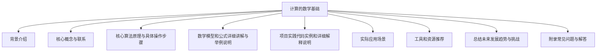

# 计算：第二部分 计算的数学基础

## 1. 背景介绍

### 1.1 问题的由来

计算机科学作为一门年轻的学科,其发展离不开数学的支撑。从最初的布尔代数和逻辑电路,到现代的密码学、人工智能和量子计算,数学一直是推动计算理论和实践发展的根本动力。然而,随着计算机系统日益复杂,传统的数学工具已经不能完全满足我们对计算的需求。因此,探索计算的数学基础,建立一套适合计算需求的数学理论体系,成为当代计算机科学家和数学家共同的使命。

### 1.2 研究现状

计算的数学基础是近年来计算机科学和数学交叉领域的一个热点研究方向。国内外学者从不同角度对这一问题进行了深入探讨,取得了一些重要进展。例如,图灵奖得主、计算机科学家斯科特·阿伦斯(Scott Aaronson)提出了"量子计算的数学基础",将量子力学与计算理论相结合;著名数学家格雷戈里·切特维尔特(Gregory Chaitin)则从算法信息理论的角度阐述了"计算的元数学基础"。

然而,由于计算的复杂性和多样性,现有的数学工具仍然无法完全描述和解释所有的计算现象。因此,建立一个统一的、具有普适性的"计算数学"理论体系,仍然是一个巨大的挑战。

### 1.3 研究意义

探索计算的数学基础,对于推动计算机科学的发展具有重要意义:

1. 理论支撑:为计算提供坚实的数学理论基础,有助于我们更好地理解和描述计算过程,指导计算实践。

2. 新范式:有望开辟计算理论和实践的新范式,突破当前计算模型的局限性,实现计算的质的飞跃。

3. 跨学科融合:促进计算机科学与数学、物理学等学科的深度融合,产生新的研究方向和应用领域。

4. 算法优化:有助于设计和优化更高效、更准确的算法,提高计算的性能和可靠性。

5. 安全保障:为密码学、量子计算等关键计算领域提供坚实的数学理论支持,增强计算系统的安全性。

### 1.4 本文结构

本文将从计算的数学基础这一主题出发,系统地阐述相关的核心概念、算法原理、数学模型,并结合实际应用案例,探讨计算数学的发展现状、挑战和前景。文章主要包括以下几个部分:

## 2. 核心概念与联系

探索计算的数学基础,需要对一些核心概念有深入的理解。这些概念不仅来自计算机科学,也源于数学、物理学等相关学科,它们相互关联、相辅相成,共同构成了计算数学的理论框架。

### 2.1 计算理论

计算理论是计算机科学的理论基础,主要研究计算的本质、计算能力的极限以及不同计算模型之间的关系等问题。它为计算的数学基础奠定了坚实的理论基础。

#### 2.1.1 图灵机

图灵机是计算理论的核心概念之一。它是一种抽象的计算模型,用于研究计算的本质和极限。图灵机的数学定义为:

$$
M = (Q, \Gamma, b, \Sigma, \delta, q_0, F)
$$

其中:
- $Q$是有限状态集合
- $\Gamma$是带字母表(包含输入字母和辅助字母)
- $b \in \Gamma - \Sigma$是带的空白符号
- $\Sigma \subseteq \Gamma$是输入字母表
- $\delta: Q \times \Gamma \rightarrow Q \times \Gamma \times \{L, R\}$是转移函数
- $q_0 \in Q$是初始状态
- $F \subseteq Q$是接受状态集合

图灵机的重要性在于,它为研究计算的本质和极限提供了一个统一的数学模型,并且被证明是具有"普遍性"的,即任何可计算函数都可以由图灵机计算。

#### 2.1.2 停机问题

停机问题是计算理论中的一个著名难题,由图灵在1936年提出。它问题的本质是:是否存在一个算法,可以判断任意一个程序及其输入数据,该程序是否会终止运行。

停机问题的重要性在于,它揭示了计算的内在局限性。图灵证明了停机问题是不可判定的,即不存在一个通用的算法可以解决所有情况下的停机问题。这一结果对于计算理论和人工智能的发展产生了深远的影响。

### 2.2 算法信息理论

算法信息理论是一门新兴的交叉学科,它将信息论与算法理论相结合,研究信息的计算复杂性及其在计算中的作用。

#### 2.2.1 算法概率

算法概率是算法信息理论的核心概念之一。它定义为:

$$
P(x) = 2^{-K(x)}
$$

其中,K(x)表示x的算法信息复杂度,即以二进制编码表示x所需的最短程序的长度。

算法概率为我们提供了一种全新的视角来看待概率,即将概率解释为一个对象被最短程序生成的可能性。这种观点不仅有助于深化我们对概率的理解,而且为研究概率与计算之间的关系提供了新的思路。

#### 2.2.2 算法无穷

算法无穷是另一个重要概念,它描述了一个对象的算法信息复杂度可能是无穷大的情况。形式上,如果对于任意整数n,都存在一个长度至少为n的二进制串x,使得K(x) ≥ n,那么我们就说存在算法无穷。

算法无穷的存在说明,在计算世界中存在着本质上无法被任何有限程序完全捕获和表示的对象。这一结论对于理解计算的局限性和发展新的计算模型具有重要意义。

### 2.3 量子计算

量子计算是一种全新的计算范式,它利用量子力学的原理来执行计算操作。量子计算不仅在理论上具有重大意义,而且在实际应用中也展现出巨大的潜力,如量子密码学、量子机器学习等。

#### 2.3.1 量子态

量子态是量子计算的基本概念,它是量子系统的一种数学表示形式。一个n量子位的量子态可以用一个长度为$2^n$的复数向量表示:

$$
|\psi\rangle = \sum_{i=0}^{2^n-1} \alpha_i |i\rangle
$$

其中,每个$\alpha_i$是一个复数,模方之和为1,表示对应基态的概率幅。量子态的独特之处在于,它可以表示经典计算中不存在的叠加态,从而赋予量子计算以强大的并行计算能力。

#### 2.3.2 量子算法

量子算法是在量子计算机上运行的算法,它利用了量子力学的特性,如量子叠加和量子纠缆等,从而在某些问题上展现出了优于经典算法的计算效率。

著名的量子算法有:

- 量子傅里叶变换
- 量子相位估计
- Shor's算法(用于高效分解大整数)
- Grover's算法(用于无结构搜索问题)

量子算法为我们展示了一种全新的计算方式,它不仅挑战了我们对计算的传统认知,而且为解决一些经典计算机难以解决的问题提供了新的途径。

### 2.4 计算复杂性理论

计算复杂性理论是计算机科学的一个重要分支,它研究问题的本质难度及求解所需的计算资源。这一理论为我们理解计算的本质局限性提供了重要工具。

#### 2.4.1 P和NP

P和NP是计算复杂性理论中最著名的两个复杂度类。P类问题指在确定性图灵机上可以在多项式时间内解决的问题,而NP类则包括所有可以在非确定性图灵机上在多项式时间验证解的问题。

P与NP的关系是计算复杂性理论中最为困难和有影响力的公开问题之一。如果P=NP,那么所有的NP问题都可以在多项式时间内被解决,这将产生深远的影响;反之,如果P≠NP,那么就存在一些NP问题是本质上更加困难的。目前,大多数学者倾向于后一种观点。

#### 2.4.2 NP完全性

NP完全性是NP类问题中最困难的一类问题。一个问题如果是NP完全的,那么它不仅属于NP类,而且任何其他NP类问题都可以在多项式时间内约化为它。

NP完全性的重要意义在于,一旦发现了任何一个NP完全问题的多项式时间算法,那么所有的NP问题都可以在多项式时间内被解决。反之,如果证明了任何一个NP完全问题不存在多项式时间算法,那么除非P=NP,否则所有的NP完全问题都不存在多项式时间算法。

### 2.5 其他相关概念

除了上述核心概念之外,探索计算的数学基础还需要借助其他一些相关概念,例如:

- 形式语言与自动机理论
- 计算几何与拓扑
- 组合数学
- 密码学
- 博弈论
- ...

这些概念虽然来自不同的学科领域,但都为计算的数学基础提供了重要的理论支持和工具。只有将它们有机地结合起来,才能构建一个完整的计算数学理论体系。

上述这些核心概念相互关联、相辅相成,共同奠定了计算的数学基础。掌握和理解它们,是我们探索这一领域的重要前提。

## 3. 核心算法原理与具体操作步骤

在计算的数学基础中,算法无疑扮演着至关重要的角色。算法不仅是计算的具体实现,更是将抽象的数学理论与实践相结合的纽带。本节将重点介绍一些核心算法的基本原理及具体操作步骤。

### 3.1 算法原理概述

#### 3.1.1 基于图灵机的算法

图灵机作为最通用的计算模型,为设计算法奠定了理论基础。基于图灵机的算法通常遵循以下基本原理:

1. 有限控制:算法由有限个状态控制,每个状态对应特定的操作。
2. 数据存储:利用无限长度的带(tape)来存储输入和中间计算结果。
3. 确定性:给定当前状态和带符号,算法的下一步操作是确定的。
4. 终止性:算法在有限步骤后必须停止,并进入接受或拒绝状态。

符合这些原理的算法都可以在图灵机上执行,从而保证了算法的可计算性。

#### 3.1.2 基于量子计算的算法

量子算法则利用了量子力学的特性,如量子叠加和量子纠缆等,展现出优于经典算法的计算效率。它们的基本原理包括:

1. 量子并行性:利用量子态的叠加性质,可以同时对所有可能的输入进行操作。
2. 量子傋里叶变换:是量子算法的核心子程序,可以高效地实现傋里叶变换。
3. 量子相位估计:通过控制相位漂移来估计一个量子态的期望值。
4. 量子查找:Grover算法利用量子叠加态加速无结构搜索。

量子算法为我们开辟了全新的计算范式,但同时也面临着诸多挑战,如去相干、噪声等。

#### 3.1.3 其他算法范式