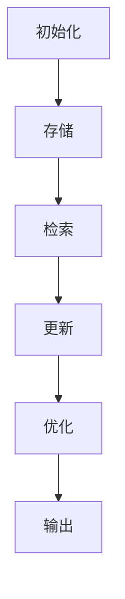

# 【LangChain编程：从入门到实践】自定义记忆组件

## 1. 背景介绍

### 1.1 问题的由来

在当今的人工智能时代，构建智能系统已经成为一项关键的任务。然而,传统的人工智能系统通常缺乏持久的记忆能力,无法有效地跟踪和利用过去的对话和上下文信息。这种局限性严重影响了系统的性能和用户体验,尤其是在需要长期交互和决策的场景中。

为了解决这一问题,研究人员提出了记忆增强的人工智能系统,旨在赋予系统持久的记忆能力。其中,LangChain是一个强大的Python库,专门用于构建记忆增强的人工智能应用程序。然而,LangChain默认提供的记忆组件可能无法满足特定场景的需求,因此自定义记忆组件成为了一个迫切的需求。

### 1.2 研究现状

目前,已有一些研究致力于探索记忆增强的人工智能系统。一些著名的工作包括:

- **记忆网络(Memory Networks)**: 这是一种基于神经网络的记忆增强模型,可以通过读取和写入外部存储器来学习和存储信息。
- **动态记忆网络(Dynamic Memory Networks)**: 这是一种改进的记忆网络模型,可以更好地处理输入序列和问题,并产生更准确的答案。
- **端到端记忆网络(End-to-End Memory Networks)**: 这种模型将记忆网络与序列到序列模型相结合,可以直接从原始输入中学习和存储信息。

然而,这些模型通常专注于特定的任务或领域,并且需要大量的训练数据和计算资源。因此,构建一种通用的、可扩展的记忆增强系统仍然是一个挑战。

### 1.3 研究意义

自定义记忆组件对于构建高性能的人工智能系统具有重要意义:

1. **提高系统性能**: 通过自定义记忆组件,可以有效地存储和利用过去的对话和上下文信息,从而提高系统的决策能力和响应质量。
2. **增强用户体验**: 记忆增强的人工智能系统可以更好地理解用户的意图和需求,提供更加个性化和连贯的交互体验。
3. **支持复杂场景**: 自定义记忆组件可以针对特定的应用场景进行优化,从而更好地满足复杂任务的需求。
4. **促进人工智能发展**: 研究和开发自定义记忆组件有助于推进人工智能技术的进步,为构建更智能、更人性化的系统奠定基础。

### 1.4 本文结构

本文将详细介绍如何使用LangChain库自定义记忆组件。文章的主要结构如下:

1. 背景介绍
2. 核心概念与联系
3. 核心算法原理与具体操作步骤
4. 数学模型和公式详细讲解与举例说明
5. 项目实践:代码实例和详细解释说明
6. 实际应用场景
7. 工具和资源推荐
8. 总结:未来发展趋势与挑战
9. 附录:常见问题与解答

## 2. 核心概念与联系

在深入探讨自定义记忆组件之前,我们需要了解一些核心概念和它们之间的联系。

### 2.1 LangChain

LangChain是一个Python库,旨在构建应用程序以与大型语言模型(如GPT-3)进行交互。它提供了一种模块化的方式来组合不同的组件,如提示模板、记忆组件、代理等,从而构建复杂的人工智能系统。

### 2.2 记忆组件

记忆组件是LangChain中的一个关键概念,用于存储和检索与当前对话或任务相关的信息。它可以被视为系统的"记忆库",用于跟踪和利用过去的上下文信息。LangChain提供了一些预定义的记忆组件,如`ConversationBufferMemory`和`ConversationBufferWindowMemory`。

### 2.3 自定义记忆组件

虽然LangChain提供了一些预定义的记忆组件,但它们可能无法满足特定场景的需求。因此,自定义记忆组件成为了一个重要的需求。自定义记忆组件允许开发人员根据特定的任务和数据结构设计和实现自己的记忆存储和检索机制。

### 2.4 记忆增强的人工智能系统

记忆增强的人工智能系统是指具有持久记忆能力的系统,能够有效地存储和利用过去的对话和上下文信息。通过将自定义记忆组件集成到LangChain中,我们可以构建这种记忆增强的人工智能系统,提高系统的性能和用户体验。

### 2.5 核心算法和数学模型

自定义记忆组件通常需要基于特定的算法和数学模型来实现。这些算法和模型决定了记忆组件的存储、检索和更新机制,以及它们的性能和效率。在后续章节中,我们将详细探讨相关的算法原理和数学模型。

## 3. 核心算法原理与具体操作步骤

### 3.1 算法原理概述

自定义记忆组件的核心算法原理通常涉及以下几个方面:

1. **数据结构**: 选择合适的数据结构来存储记忆信息,如列表、字典、树或图等。
2. **存储机制**: 设计存储机制,将新的对话和上下文信息添加到记忆库中。
3. **检索机制**: 实现检索机制,根据当前的上下文信息从记忆库中查找相关的记忆。
4. **更新机制**: 开发更新机制,根据新的对话和上下文信息更新记忆库中的内容。
5. **优化策略**: 采用适当的优化策略,如缓存、压缩或清理机制,以提高记忆组件的性能和效率。

### 3.2 算法步骤详解

以下是自定义记忆组件算法的具体步骤:

1. **初始化**: 创建记忆组件的实例,并初始化必要的数据结构和参数。

2. **存储**: 当有新的对话或上下文信息时,将其存储到记忆库中。这可能涉及到数据预处理、索引构建或其他操作。

3. **检索**: 根据当前的上下文信息,从记忆库中检索相关的记忆。这可能需要进行相似性匹配、排序或过滤操作。

4. **更新**: 根据新的对话或上下文信息,更新记忆库中的内容。这可能需要合并、替换或删除现有的记忆。

5. **优化**: 根据需要,执行优化策略,如缓存、压缩或清理操作,以提高记忆组件的性能和效率。

6. **输出**: 将检索到的相关记忆返回给调用方,供进一步处理或决策。

以上步骤可以根据具体的算法和实现方式进行调整和扩展。

### 3.3 算法优缺点

自定义记忆组件算法具有以下优点:

- **灵活性**: 可以根据特定的需求和场景设计和实现记忆组件,提供更高的灵活性。
- **可扩展性**: 通过选择合适的数据结构和算法,记忆组件可以支持大规模的数据存储和高效的检索操作。
- **性能优化**: 可以采用各种优化策略,如缓存、压缩或清理机制,提高记忆组件的性能和效率。

然而,自定义记忆组件算法也存在一些缺点:

- **开发复杂性**: 设计和实现自定义记忆组件算法需要深入的算法和数据结构知识,开发过程可能较为复杂。
- **测试和调试**: 测试和调试自定义记忆组件算法可能需要大量的工作,以确保其正确性和稳定性。
- **维护成本**: 随着时间的推移,自定义记忆组件可能需要进行维护和升级,以适应新的需求或解决新的问题。

### 3.4 算法应用领域

自定义记忆组件算法可以应用于各种领域,包括但不限于:

- **对话系统**: 在对话系统中,记忆组件可以用于存储和利用过去的对话历史,提高系统的响应质量和连贯性。
- **决策支持系统**: 在决策支持系统中,记忆组件可以用于存储和检索相关的历史数据和知识,为决策过程提供支持。
- **个性化推荐系统**: 在个性化推荐系统中,记忆组件可以用于存储和利用用户的历史偏好和行为,从而提供更加个性化的推荐。
- **智能助手**: 在智能助手系统中,记忆组件可以用于存储和利用用户的个人信息和历史交互,提供更加人性化的服务。
- **知识管理系统**: 在知识管理系统中,记忆组件可以用于存储和检索各种形式的知识和信息,支持知识共享和利用。

## 4. 数学模型和公式详细讲解与举例说明

### 4.1 数学模型构建

在设计自定义记忆组件算法时,我们可以借助数学模型来描述和优化记忆存储、检索和更新过程。以下是一些常见的数学模型:

1. **向量空间模型(Vector Space Model)**: 将文本表示为向量,并在向量空间中进行相似性计算和排序。这种模型可用于记忆检索和相似性匹配。

2. **概率模型(Probabilistic Model)**: 使用概率理论和统计方法来建模记忆存储和检索过程,例如使用贝叶斯定理或马尔可夫模型。

3. **图模型(Graph Model)**: 将记忆信息表示为图结构,利用图理论和算法进行存储、检索和更新操作。

4. **神经网络模型(Neural Network Model)**: 使用神经网络模型来学习记忆表示和检索策略,例如记忆网络(Memory Networks)或动态记忆网络(Dynamic Memory Networks)。

5. **信息检索模型(Information Retrieval Model)**: 借鉴信息检索领域的模型和技术,如TF-IDF、BM25或语言模型,用于记忆检索和排序。

这些数学模型可以根据具体的应用场景和需求进行选择和组合。下面,我们将详细讨论一些常见的数学模型和公式。

### 4.2 公式推导过程

#### 4.2.1 向量空间模型

在向量空间模型中,我们将文本表示为向量,并使用余弦相似度来衡量两个向量之间的相似性。

设有两个向量 $\vec{a}$ 和 $\vec{b}$,它们的余弦相似度可以计算如下:

$$\text{cosine\_similarity}(\vec{a}, \vec{b}) = \frac{\vec{a} \cdot \vec{b}}{\|\vec{a}\| \|\vec{b}\|}$$

其中 $\vec{a} \cdot \vec{b}$ 表示两个向量的点积,而 $\|\vec{a}\|$ 和 $\|\vec{b}\|$ 分别表示向量 $\vec{a}$ 和 $\vec{b}$ 的范数(通常使用欧几里得范数)。

余弦相似度的取值范围为 $[-1, 1]$,值越接近 1,表示两个向量越相似。在记忆检索中,我们可以计算当前上下文向量与记忆库中每个记忆向量的余弦相似度,并选择相似度最高的记忆作为检索结果。

#### 4.2.2 概率模型

在概率模型中,我们可以使用贝叶斯定理来计算给定上下文下某个记忆的概率。

设 $C$ 表示当前上下文,而 $M$ 表示某个记忆,我们可以计算 $P(M|C)$,即给定上下文 $C$ 时记忆 $M$ 出现的概率:

$$P(M|C) = \frac{P(C|M)P(M)}{P(C)}$$

其中,$P(C|M)$ 表示给定记忆 $M$ 时上下文 $C$ 出现的概率,而 $P(M)$ 和 $P(C)$ 分别表示记忆 $M$ 和上下文 $C$ 的先验概率。