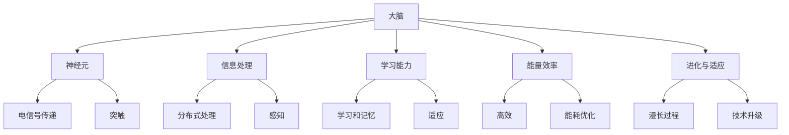

                 

# 大脑与超级计算机的比较

## 1. 背景介绍

### 1.1 问题由来

随着人工智能技术的迅猛发展，计算机和大脑之间的关系引起了越来越多的关注。如何理解这两者的异同，以及如何借鉴大脑的原理来设计更高效的计算机系统，成为科研和工程领域的热点话题。本文将通过对比大脑和超级计算机，探索这一问题的答案。

### 1.2 问题核心关键点

1. **结构和功能**：大脑和超级计算机在结构和功能上有哪些相似之处和差异？
2. **信息处理**：两者如何处理信息和进行计算？
3. **学习能力**：大脑和超级计算机的学习机制有何不同？
4. **能量效率**：大脑和超级计算机在能量使用上的表现如何？
5. **进化与适应**：大脑的进化过程与超级计算机的升级有何不同？

### 1.3 问题研究意义

1. **理论意义**：理解大脑和超级计算机的关系，有助于深入探索认知科学和人工智能的边界。
2. **实践意义**：借鉴大脑的原理，设计更高效、更节能的超级计算机，推动人工智能技术的实际应用。
3. **跨学科意义**：促进认知科学、神经科学、计算机科学等多学科的交叉研究，推动科学前沿的突破。

## 2. 核心概念与联系

### 2.1 核心概念概述

- **大脑**：人类或动物的大脑是由数十亿个神经元组成的网络，负责感知、思考、记忆和行为。
- **超级计算机**：高性能计算机系统，能够在短时间内处理大规模的数据和复杂的计算任务。
- **神经网络**：一种模拟大脑神经元网络的计算模型，用于机器学习和深度学习。

### 2.2 概念间的关系

- **结构和功能**：大脑和超级计算机在结构和功能上有着相似的分布式结构，但大脑的神经元之间通过电信号传递信息，而超级计算机通过电信号或光信号处理数据。
- **信息处理**：两者在信息处理方式上类似，都是通过分布式处理来加速计算，但大脑的信息处理机制更加复杂和精细。
- **学习能力**：大脑通过学习和记忆来适应环境，而超级计算机通过算法和模型来处理任务。
- **能量效率**：大脑在处理信息时相对高效，而超级计算机在能耗上还面临许多挑战。
- **进化与适应**：大脑的进化是一个漫长而复杂的过程，而超级计算机的升级通常由工程师设计和构建。

这些概念之间的逻辑关系可以通过以下Mermaid流程图来展示：



这个流程图展示了大脑和超级计算机在结构和功能、信息处理、学习能力、能量效率和进化适应等方面的关系。

## 3. 核心算法原理 & 具体操作步骤

### 3.1 算法原理概述

大脑和超级计算机在信息处理和计算方面有着相似的原理，都是通过分布式处理来加速任务完成。但大脑的信息处理机制更加复杂和精细，而超级计算机的计算速度和存储能力更强。

### 3.2 算法步骤详解

1. **数据获取与预处理**：从各种传感器获取数据，并进行清洗和标准化。
2. **特征提取与表示**：将数据转换为适合算法处理的特征向量。
3. **模型训练与优化**：使用神经网络模型进行训练，优化参数以提高预测准确性。
4. **模型评估与验证**：在验证集上评估模型性能，确保模型泛化能力强。
5. **模型部署与应用**：将训练好的模型部署到实际系统中，用于数据处理和决策支持。

### 3.3 算法优缺点

**优点**：
- **分布式处理**：能够高效处理大规模数据。
- **高度可定制**：可以根据具体任务设计模型结构和算法。

**缺点**：
- **能耗高**：超级计算机需要大量的电力和冷却系统。
- **复杂度高**：设计、调试和维护超级计算机系统复杂。

### 3.4 算法应用领域

- **医疗诊断**：使用深度学习模型分析医疗影像和基因数据，辅助诊断和治疗。
- **金融预测**：使用神经网络模型预测股票市场和汇率变化，支持投资决策。
- **自动驾驶**：使用传感器数据和深度学习模型进行目标检测和路径规划，实现自动驾驶。
- **智能推荐**：使用协同过滤和深度学习模型，提供个性化推荐服务。

## 4. 数学模型和公式 & 详细讲解 & 举例说明

### 4.1 数学模型构建

在深度学习中，通常使用神经网络模型来模拟大脑的信息处理机制。神经网络由多个神经元（节点）组成，每个神经元接收输入信号，进行加权求和和非线性变换，输出新的信号。

### 4.2 公式推导过程

假设有一个简单的神经网络模型，包含一个输入层、一个隐藏层和一个输出层。输入层有 $n$ 个神经元，隐藏层有 $m$ 个神经元，输出层有 $k$ 个神经元。输入 $x$ 经过线性变换 $w$ 和激活函数 $f$ 后，得到隐藏层输出 $h$。隐藏层输出 $h$ 经过线性变换 $w'$ 和激活函数 $f'$ 后，得到输出 $y$。

$$
h = f(w^T x + b)
$$
$$
y = f'(w'^T h + b')
$$

其中，$w$ 和 $w'$ 是权重矩阵，$b$ 和 $b'$ 是偏置项，$f$ 和 $f'$ 是激活函数。

### 4.3 案例分析与讲解

以图像分类为例，使用卷积神经网络（CNN）模型进行图像识别。CNN 通过卷积层、池化层和全连接层等组件，逐层提取图像特征，最终输出分类结果。

1. **卷积层**：通过卷积操作提取图像局部特征。
2. **池化层**：通过池化操作减小特征图尺寸，提高计算效率。
3. **全连接层**：将特征图转换为高维特征向量，使用softmax函数输出分类概率。

以下是使用 PyTorch 实现卷积神经网络模型的代码示例：

```python
import torch
import torch.nn as nn
import torchvision.transforms as transforms
import torchvision.datasets as datasets

class Net(nn.Module):
    def __init__(self):
        super(Net, self).__init__()
        self.conv1 = nn.Conv2d(3, 6, 5)
        self.pool = nn.MaxPool2d(2, 2)
        self.conv2 = nn.Conv2d(6, 16, 5)
        self.fc1 = nn.Linear(16 * 5 * 5, 120)
        self.fc2 = nn.Linear(120, 84)
        self.fc3 = nn.Linear(84, 10)

    def forward(self, x):
        x = self.pool(torch.relu(self.conv1(x)))
        x = self.pool(torch.relu(self.conv2(x)))
        x = x.view(-1, 16 * 5 * 5)
        x = torch.relu(self.fc1(x))
        x = torch.relu(self.fc2(x))
        x = self.fc3(x)
        return x

# 加载 MNIST 数据集
train_dataset = datasets.MNIST(root='./data', train=True, transform=transforms.ToTensor(), download=True)
test_dataset = datasets.MNIST(root='./data', train=False, transform=transforms.ToTensor(), download=True)

# 定义模型
net = Net()

# 定义优化器和损失函数
criterion = nn.CrossEntropyLoss()
optimizer = torch.optim.SGD(net.parameters(), lr=0.001, momentum=0.9)

# 训练模型
for epoch in range(10):
    running_loss = 0.0
    for i, data in enumerate(train_loader, 0):
        inputs, labels = data
        optimizer.zero_grad()
        outputs = net(inputs)
        loss = criterion(outputs, labels)
        loss.backward()
        optimizer.step()
```

## 5. 项目实践：代码实例和详细解释说明

### 5.1 开发环境搭建

1. 安装 Python 环境：使用 Anaconda 或 Miniconda 安装 Python 和相关依赖。
2. 安装 PyTorch：使用 pip 安装 PyTorch 和 torchvision。
3. 准备数据集：使用 MNIST 数据集作为训练集。
4. 搭建模型：定义卷积神经网络模型。
5. 训练模型：使用交叉熵损失函数和 SGD 优化器进行训练。

### 5.2 源代码详细实现

以下是使用 PyTorch 实现卷积神经网络模型的代码：

```python
import torch
import torch.nn as nn
import torchvision.transforms as transforms
import torchvision.datasets as datasets

class Net(nn.Module):
    def __init__(self):
        super(Net, self).__init__()
        self.conv1 = nn.Conv2d(3, 6, 5)
        self.pool = nn.MaxPool2d(2, 2)
        self.conv2 = nn.Conv2d(6, 16, 5)
        self.fc1 = nn.Linear(16 * 5 * 5, 120)
        self.fc2 = nn.Linear(120, 84)
        self.fc3 = nn.Linear(84, 10)

    def forward(self, x):
        x = self.pool(torch.relu(self.conv1(x)))
        x = self.pool(torch.relu(self.conv2(x)))
        x = x.view(-1, 16 * 5 * 5)
        x = torch.relu(self.fc1(x))
        x = torch.relu(self.fc2(x))
        x = self.fc3(x)
        return x

# 加载 MNIST 数据集
train_dataset = datasets.MNIST(root='./data', train=True, transform=transforms.ToTensor(), download=True)
test_dataset = datasets.MNIST(root='./data', train=False, transform=transforms.ToTensor(), download=True)

# 定义模型
net = Net()

# 定义优化器和损失函数
criterion = nn.CrossEntropyLoss()
optimizer = torch.optim.SGD(net.parameters(), lr=0.001, momentum=0.9)

# 训练模型
for epoch in range(10):
    running_loss = 0.0
    for i, data in enumerate(train_loader, 0):
        inputs, labels = data
        optimizer.zero_grad()
        outputs = net(inputs)
        loss = criterion(outputs, labels)
        loss.backward()
        optimizer.step()
```

### 5.3 代码解读与分析

- **定义模型**：使用 PyTorch 定义卷积神经网络模型。
- **加载数据集**：使用 MNIST 数据集作为训练集。
- **定义优化器和损失函数**：使用 SGD 优化器和交叉熵损失函数。
- **训练模型**：循环迭代训练过程，不断更新模型参数以最小化损失函数。

### 5.4 运行结果展示

训练结束后，在测试集上评估模型的性能：

```python
correct = 0
total = 0
with torch.no_grad():
    for data in test_loader:
        images, labels = data
        outputs = net(images)
        _, predicted = torch.max(outputs.data, 1)
        total += labels.size(0)
        correct += (predicted == labels).sum().item()

print('Accuracy of the network on the 10000 test images: %d %%' % (100 * correct / total))
```

## 6. 实际应用场景

### 6.1 医疗诊断

使用深度学习模型分析医疗影像和基因数据，辅助诊断和治疗。例如，使用卷积神经网络对医学影像进行分类和分割，快速诊断肿瘤和病变。

### 6.2 金融预测

使用神经网络模型预测股票市场和汇率变化，支持投资决策。例如，使用 LSTM 网络对历史数据进行时间序列预测，预测股票价格和波动。

### 6.3 自动驾驶

使用传感器数据和深度学习模型进行目标检测和路径规划，实现自动驾驶。例如，使用卷积神经网络对图像进行行人检测，使用 LSTM 网络进行路径规划。

### 6.4 智能推荐

使用协同过滤和深度学习模型，提供个性化推荐服务。例如，使用神经网络模型分析用户行为和兴趣，生成个性化推荐列表。

## 7. 工具和资源推荐

### 7.1 学习资源推荐

- **《深度学习》一书**：Ian Goodfellow 著，全面介绍深度学习的理论和方法。
- **Coursera《深度学习专项课程》**：Andrew Ng 主讲，系统讲解深度学习基础和应用。
- **Kaggle 竞赛平台**：提供大量数据集和挑战，锻炼深度学习实践能力。

### 7.2 开发工具推荐

- **PyTorch**：开源深度学习框架，提供高效的张量操作和 GPU 加速。
- **TensorFlow**：Google 开源的深度学习框架，支持分布式计算和大规模训练。
- **MXNet**：Apache 开源的深度学习框架，支持多种编程语言和分布式训练。

### 7.3 相关论文推荐

- **《深度学习》论文**：Ian Goodfellow 等著，介绍深度学习的基本理论和算法。
- **《卷积神经网络》论文**：Yann LeCun 等著，介绍卷积神经网络的结构和应用。
- **《循环神经网络》论文**：Sepp Hochreiter 等著，介绍循环神经网络的结构和应用。

## 8. 总结：未来发展趋势与挑战

### 8.1 研究成果总结

本文通过对比大脑和超级计算机，探讨了它们在结构和功能、信息处理、学习能力、能量效率和进化适应等方面的异同。通过深入分析，发现两者在某些方面有着惊人的相似之处，但在处理复杂任务和应用场景时，还存在一定的差距。

### 8.2 未来发展趋势

1. **更高效的计算模型**：未来将开发更高效的计算模型，如类脑计算和量子计算，以应对大规模数据和复杂任务。
2. **更智能的深度学习模型**：未来将开发更智能的深度学习模型，如类脑神经网络和自适应网络，以提高模型的泛化能力和学习效率。
3. **更节能的计算系统**：未来将开发更节能的计算系统，如低功耗芯片和量子计算机，以降低能源消耗和运行成本。

### 8.3 面临的挑战

1. **计算资源不足**：目前超级计算机的计算能力还无法满足大规模数据的处理需求。
2. **算法复杂度高**：深度学习模型的训练和优化算法复杂，需要大量的计算资源和时间。
3. **数据质量和多样性**：大规模数据集的获取和标注困难，影响模型的训练效果和泛化能力。
4. **模型可解释性不足**：深度学习模型的决策过程缺乏可解释性，难以理解和调试。
5. **伦理和隐私问题**：深度学习模型的应用可能带来伦理和隐私问题，需要规范和监管。

### 8.4 研究展望

1. **跨学科研究**：促进认知科学、神经科学、计算机科学等多学科的交叉研究，推动科学前沿的突破。
2. **类脑计算研究**：研究类脑计算模型和算法，开发更高效、更智能的计算系统。
3. **深度学习优化**：优化深度学习模型和算法，提高模型的泛化能力和计算效率。
4. **伦理和隐私保护**：制定深度学习模型的伦理和隐私保护规范，确保其安全、可靠、可解释。

总之，未来需要在多个维度上进行深入研究和探索，才能更好地理解大脑和超级计算机的关系，推动人工智能技术的实际应用。只有勇于创新、敢于突破，才能不断拓展人工智能技术的边界，让智能技术更好地造福人类社会。

## 9. 附录：常见问题与解答

**Q1：深度学习模型和大脑的神经网络有何不同？**

A: 深度学习模型和大脑的神经网络在结构和功能上有一些相似之处，如分布式处理、非线性变换等。但大脑的神经网络更加复杂，能够处理更加多样化的信息，具有更高的学习能力和适应性。

**Q2：如何训练一个高效的深度学习模型？**

A: 训练一个高效的深度学习模型需要以下几个步骤：
1. 数据预处理：清洗和标准化数据集。
2. 模型设计：选择合适的模型结构和算法。
3. 参数初始化：随机初始化模型参数。
4. 训练过程：使用训练集进行迭代优化，更新模型参数。
5. 模型评估：在验证集上评估模型性能，选择最优模型。

**Q3：深度学习模型的计算资源需求有哪些？**

A: 深度学习模型的计算资源需求主要包括以下几个方面：
1. GPU 资源：深度学习模型通常需要高性能 GPU 进行加速计算。
2. 内存资源：深度学习模型需要大量的内存空间存储数据和中间结果。
3. 存储资源：深度学习模型需要大量的存储空间存储模型参数和训练数据。

**Q4：深度学习模型在实际应用中有哪些限制？**

A: 深度学习模型在实际应用中存在以下限制：
1. 数据质量和多样性：深度学习模型依赖大量高质量数据进行训练，数据不足可能导致模型泛化能力差。
2. 模型可解释性不足：深度学习模型的决策过程缺乏可解释性，难以理解和调试。
3. 计算资源需求高：深度学习模型需要大量的计算资源和时间进行训练和优化。
4. 伦理和隐私问题：深度学习模型的应用可能带来伦理和隐私问题，需要规范和监管。

总之，深度学习模型在实际应用中需要考虑多个因素，需要不断的优化和改进，才能更好地发挥其优势，服务于实际需求。

