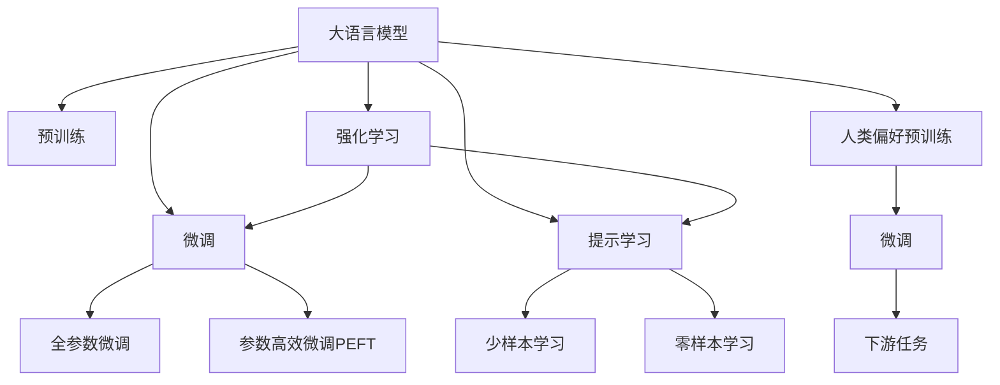
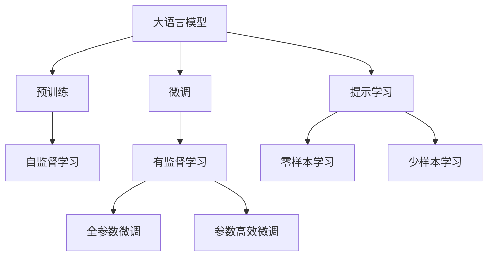
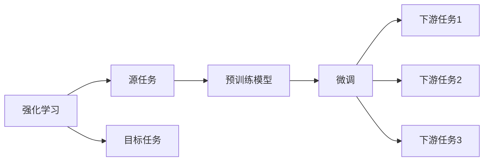
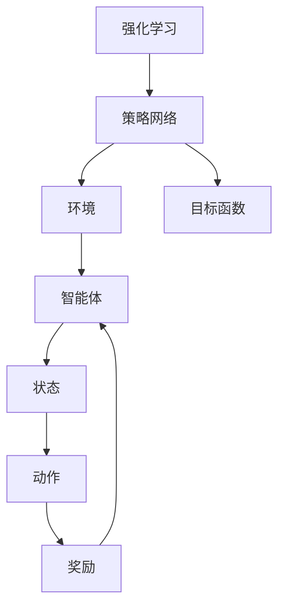
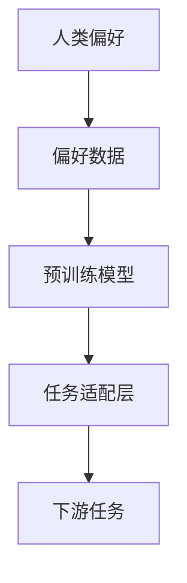
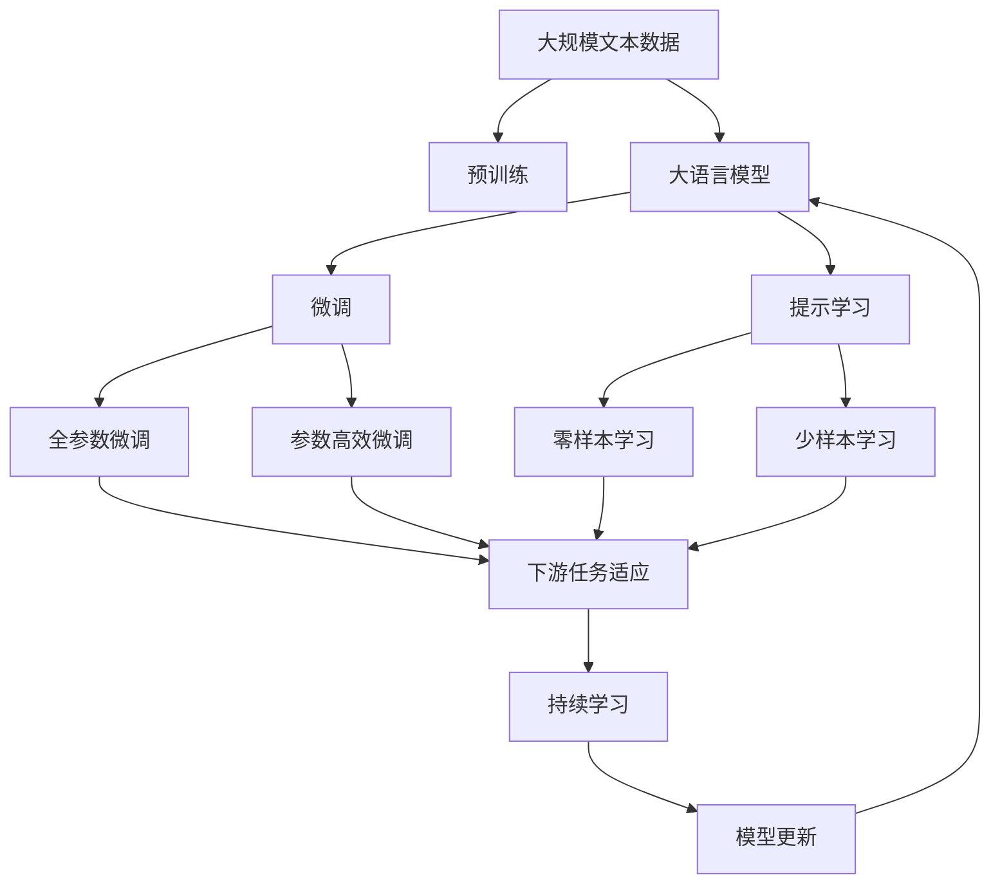

                 

# 大语言模型原理基础与前沿 基于强化学习的微调和基于人类偏好的预训练

> 关键词：大语言模型,强化学习,微调,预训练,人类偏好,Transformer,BERT,预训练,下游任务,参数高效微调,自然语言处理(NLP)

## 1. 背景介绍

### 1.1 问题由来
近年来，深度学习技术在自然语言处理(Natural Language Processing, NLP)领域取得了显著的突破，尤其是基于Transformer架构的大语言模型(Large Language Models, LLMs)，如BERT、GPT等，已经成为NLP研究的焦点。这些大语言模型通过在大量的无标签文本数据上进行预训练，学习到了丰富的语言知识，能够执行各种复杂的语言任务，如文本分类、命名实体识别、情感分析等。

然而，这些通用的大语言模型在特定领域的应用效果并不理想。由于通用大模型往往预训练在大规模且广泛的语料上，其学到的知识可能与特定领域的语境不符，导致在特定任务上的性能较差。为了提升模型在特定领域的应用效果，研究人员提出了一种新的微调方法，即基于强化学习的微调(Reinforcement Learning Based Fine-tuning, RL-Fine-tuning)和基于人类偏好的预训练(Human Preference Based Pre-training)。

### 1.2 问题核心关键点
基于强化学习的微调和基于人类偏好的预训练这两种方法，旨在将大语言模型进一步适应特定领域的任务，提升其在特定任务上的性能。这种方法通过在预训练和微调过程中引入外部奖励或偏好信息，使得模型在执行特定任务时，能够更好地满足人类的期望，从而获得更优的性能。

具体来说，基于强化学习的微调通过设计合适的奖励函数，鼓励模型在特定任务上的行为，从而在微调过程中学习到更合适的行为策略；基于人类偏好的预训练则是通过在设计预训练任务时引入人类对特定语言的偏好，让模型在预训练过程中学习到更多的语言知识和特征。

这些方法相比传统的微调和预训练方法，具有更高的灵活性和适应性，能够更好地满足特定任务的需求，因此在实际应用中具有更广泛的应用前景。

### 1.3 问题研究意义
研究大语言模型的基于强化学习的微调和基于人类偏好的预训练方法，对于提升大语言模型在特定领域的应用效果，加速NLP技术的产业化进程，具有重要的意义：

1. **降低应用开发成本**：通过微调和预训练方法，可以显著减少从头开发所需的数据、计算和人力等成本投入。
2. **提升模型效果**：微调和预训练方法使得通用大模型更好地适应特定任务，在应用场景中取得更优表现。
3. **加速开发进度**：standing on the shoulders of giants，微调和预训练方法促进了对预训练-微调的深入研究，催生了新研究方向。
4. **带来技术创新**：微调和预训练方法催生了提示学习、少样本学习等新研究方向，为NLP技术带来了新的突破。
5. **赋能产业升级**：微调和预训练方法使得NLP技术更容易被各行各业所采用，为传统行业数字化转型升级提供新的技术路径。

## 2. 核心概念与联系

### 2.1 核心概念概述

为更好地理解基于强化学习的微调和基于人类偏好的预训练方法，本节将介绍几个密切相关的核心概念：

- 大语言模型(Large Language Model, LLM)：以自回归(如GPT)或自编码(如BERT)模型为代表的大规模预训练语言模型。通过在大规模无标签文本语料上进行预训练，学习通用的语言表示，具备强大的语言理解和生成能力。

- 预训练(Pre-training)：指在大规模无标签文本语料上，通过自监督学习任务训练通用语言模型的过程。常见的预训练任务包括言语建模、遮挡语言模型等。预训练使得模型学习到语言的通用表示。

- 微调(Fine-tuning)：指在预训练模型的基础上，使用下游任务的少量标注数据，通过有监督学习优化模型在该任务上的性能。通常只需要调整顶层分类器或解码器，并以较小的学习率更新全部或部分的模型参数。

- 强化学习(Reinforcement Learning, RL)：一种通过与环境交互，使得智能体学习最优行为策略的机器学习方法。强化学习的目标是最大化累积奖励，通过奖惩机制引导智能体的行为。

- 人类偏好(Human Preference)：指人类对特定语言和行为的主观偏好和期望。在预训练和微调过程中，通过引入人类偏好信息，可以引导模型学习到更符合人类期望的语言知识和行为策略。

- 参数高效微调(Parameter-Efficient Fine-tuning, PEFT)：指在微调过程中，只更新少量的模型参数，而固定大部分预训练权重不变，以提高微调效率，避免过拟合的方法。

- 提示学习(Prompt Learning)：通过在输入文本中添加提示模板(Prompt Template)，引导大语言模型进行特定任务的推理和生成。可以在不更新模型参数的情况下，实现零样本或少样本学习。

- 少样本学习(Few-shot Learning)：指在只有少量标注样本的情况下，模型能够快速适应新任务的学习方法。在大语言模型中，通常通过在输入中提供少量示例来实现，无需更新模型参数。

- 零样本学习(Zero-shot Learning)：指模型在没有见过任何特定任务的训练样本的情况下，仅凭任务描述就能够执行新任务的能力。大语言模型通过预训练获得的广泛知识，使其能够理解任务指令并生成相应输出。

- 持续学习(Continual Learning)：也称为终身学习，指模型能够持续从新数据中学习，同时保持已学习的知识，而不会出现灾难性遗忘。这对于保持大语言模型的时效性和适应性至关重要。

这些核心概念之间的逻辑关系可以通过以下Mermaid流程图来展示：



这个流程图展示了大语言模型的核心概念及其之间的关系：

1. 大语言模型通过预训练获得基础能力。
2. 微调是对预训练模型进行任务特定的优化，可以分为全参数微调和参数高效微调（PEFT）。
3. 提示学习是一种不更新模型参数的方法，可以实现零样本和少样本学习。
4. 强化学习可以指导模型学习符合人类偏好的行为策略。
5. 人类偏好预训练可以引导模型学习符合人类偏好的语言知识。
6. 持续学习旨在使模型能够不断学习新知识，同时避免遗忘旧知识。

这些概念共同构成了大语言模型的学习和应用框架，使其能够在各种场景下发挥强大的语言理解和生成能力。通过理解这些核心概念，我们可以更好地把握大语言模型的工作原理和优化方向。

### 2.2 概念间的关系

这些核心概念之间存在着紧密的联系，形成了大语言模型微调的整体生态系统。下面我们通过几个Mermaid流程图来展示这些概念之间的关系。

#### 2.2.1 大语言模型的学习范式



这个流程图展示了大语言模型的三种主要学习范式：预训练、微调和提示学习。预训练主要采用自监督学习方法，而微调则是有监督学习的过程。提示学习可以实现零样本和少样本学习。微调又可以分为全参数微调和参数高效微调两种方式。

#### 2.2.2 强化学习与微调的关系



这个流程图展示了强化学习的基本原理，以及它与微调的关系。强化学习涉及源任务和目标任务，预训练模型在源任务上学习，然后通过微调适应各种下游任务（目标任务）。

#### 2.2.3 强化学习与微调的具体实现



这个流程图展示了强化学习的基本流程，包括策略网络、环境、智能体、状态、动作和奖励等要素。强化学习的目标是通过策略网络，根据环境反馈，优化智能体的行为策略，以最大化累积奖励。

#### 2.2.4 人类偏好预训练的具体实现



这个流程图展示了基于人类偏好的预训练过程。通过收集人类对特定语言的偏好数据，在预训练过程中引入这些偏好信息，使得模型能够学习到更符合人类期望的语言知识和特征。

### 2.3 核心概念的整体架构

最后，我们用一个综合的流程图来展示这些核心概念在大语言模型微调过程中的整体架构：



这个综合流程图展示了从预训练到微调，再到持续学习的完整过程。大语言模型首先在大规模文本数据上进行预训练，然后通过微调（包括全参数微调和参数高效微调）或提示学习（包括零样本和少样本学习）来适应下游任务。最后，通过持续学习技术，模型可以不断更新和适应新的任务和数据。 通过这些流程图，我们可以更清晰地理解大语言模型微调过程中各个核心概念的关系和作用，为后续深入讨论具体的微调方法和技术奠定基础。

## 3. 核心算法原理 & 具体操作步骤
### 3.1 算法原理概述

基于强化学习的微调和基于人类偏好的预训练方法，本质上是一种有监督的细粒度迁移学习过程。其核心思想是：将大语言模型视作一个智能体，通过与环境（即下游任务）的交互，学习最优的行为策略；同时，在预训练过程中引入人类对特定语言的偏好信息，引导模型学习到更符合人类期望的语言知识和特征。

形式化地，假设预训练语言模型为 $M_{\theta}$，其中 $\theta$ 为预训练得到的模型参数。给定下游任务 $T$ 的标注数据集 $D=\{(x_i, y_i)\}_{i=1}^N$，微调的目标是找到新的模型参数 $\hat{\theta}$，使得：

$$
\hat{\theta}=\mathop{\arg\min}_{\theta} \mathcal{L}(M_{\theta},D)
$$

其中 $\mathcal{L}$ 为针对任务 $T$ 设计的损失函数，用于衡量模型预测输出与真实标签之间的差异。常见的损失函数包括交叉熵损失、均方误差损失等。

在基于强化学习的微调中，通过设计合适的奖励函数 $R(\theta, D)$，使得模型在特定任务上的行为策略能够最大化累积奖励。具体来说，微调过程不断更新模型参数 $\theta$，使得：

$$
\theta \leftarrow \theta - \eta \nabla_{\theta} \mathcal{L}(M_{\theta}, D) - \eta \nabla_{\theta} R(\theta, D)
$$

其中 $\eta$ 为学习率，$\nabla_{\theta} \mathcal{L}(M_{\theta}, D)$ 为损失函数对参数 $\theta$ 的梯度，$\nabla_{\theta} R(\theta, D)$ 为奖励函数对参数 $\theta$ 的梯度。通过这种有监督的微调方法，模型能够在特定任务上学习到最优的行为策略，从而提升性能。

在基于人类偏好的预训练中，通过设计预训练任务时引入人类对特定语言的偏好信息，使得模型在预训练过程中学习到更符合人类期望的语言知识和特征。具体来说，预训练任务可以包括：

$$
\min_{\theta} \mathcal{L}(M_{\theta}, D_{pre-train}) + \lambda \sum_{i=1}^N r_i(y_i, M_{\theta}(x_i))
$$

其中 $\mathcal{L}$ 为预训练损失函数，$D_{pre-train}$ 为预训练数据集，$r_i(y_i, M_{\theta}(x_i))$ 为偏好奖励函数，$y_i$ 为标签，$M_{\theta}(x_i)$ 为模型在输入 $x_i$ 上的输出。通过这种方式，模型在预训练过程中会尽可能地学习到符合人类偏好的语言知识和特征，从而在微调过程中更容易适应特定任务。

### 3.2 算法步骤详解

基于强化学习的微调和基于人类偏好的预训练方法的一般流程如下：

**Step 1: 准备预训练模型和数据集**
- 选择合适的预训练语言模型 $M_{\theta}$ 作为初始化参数，如 BERT、GPT 等。
- 准备下游任务 $T$ 的标注数据集 $D$，划分为训练集、验证集和测试集。一般要求标注数据与预训练数据的分布不要差异过大。

**Step 2: 设计奖励函数和偏好奖励函数**
- 根据下游任务类型，设计合适的奖励函数 $R(\theta, D)$，鼓励模型在特定任务上的行为策略。例如，对于情感分析任务，可以设计一个奖励函数，奖励模型对正确情感的预测概率。
- 根据人类对特定语言的偏好，设计偏好奖励函数 $r_i(y_i, M_{\theta}(x_i))$，引导模型学习到符合人类期望的语言知识和特征。例如，可以通过人工标注的方式，为每条文本数据指定一个偏好标签，奖励模型生成符合偏好的输出。

**Step 3: 设置微调超参数**
- 选择合适的优化算法及其参数，如 AdamW、SGD 等，设置学习率、批大小、迭代轮数等。
- 设置正则化技术及强度，包括权重衰减、Dropout、Early Stopping 等。
- 确定冻结预训练参数的策略，如仅微调顶层，或全部参数都参与微调。

**Step 4: 执行梯度训练**
- 将训练集数据分批次输入模型，前向传播计算损失函数和奖励函数。
- 反向传播计算参数梯度，根据设定的优化算法和学习率更新模型参数。
- 周期性在验证集上评估模型性能，根据性能指标决定是否触发 Early Stopping。
- 重复上述步骤直到满足预设的迭代轮数或 Early Stopping 条件。

**Step 5: 测试和部署**
- 在测试集上评估微调后模型 $M_{\hat{\theta}}$ 的性能，对比微调前后的精度提升。
- 使用微调后的模型对新样本进行推理预测，集成到实际的应用系统中。
- 持续收集新的数据，定期重新微调模型，以适应数据分布的变化。

以上是基于强化学习和人类偏好的预训练方法的一般流程。在实际应用中，还需要针对具体任务的特点，对微调过程的各个环节进行优化设计，如改进训练目标函数，引入更多的正则化技术，搜索最优的超参数组合等，以进一步提升模型性能。

### 3.3 算法优缺点

基于强化学习的微调和基于人类偏好的预训练方法具有以下优点：
1. 简单高效。只需准备少量标注数据，即可对预训练模型进行快速适配，获得较大的性能提升。
2. 通用适用。适用于各种NLP下游任务，包括分类、匹配、生成等，设计简单的任务适配层即可实现微调。
3. 参数高效。利用参数高效微调技术，在固定大部分预训练参数的情况下，仍可取得不错的提升。
4. 效果显著。在学术界和工业界的诸多任务上，基于微调的方法已经刷新了最先进的性能指标。
5. 适应性强。通过引入人类偏好信息，使得模型能够更好地适应特定领域的语言特征和行为习惯。

同时，该方法也存在一定的局限性：
1. 依赖标注数据。微调的效果很大程度上取决于标注数据的质量和数量，获取高质量标注数据的成本较高。
2. 迁移能力有限。当目标任务与预训练数据的分布差异较大时，微调的性能提升有限。
3. 负面效果传递。预训练模型的固有偏见、有害信息等，可能通过微调传递到下游任务，造成负面影响。
4. 可解释性不足。微调模型的决策过程通常缺乏可解释性，难以对其推理逻辑进行分析和调试。

尽管存在这些局限性，但就目前而言，基于强化学习和人类偏好的预训练方法仍是大语言模型应用的重要范式。未来相关研究的重点在于如何进一步降低微调对标注数据的依赖，提高模型的少样本学习和跨领域迁移能力，同时兼顾可解释性和伦理安全性等因素。

### 3.4 算法应用领域

基于大语言模型微调和预训练的方法，在NLP领域已经得到了广泛的应用，覆盖了几乎所有常见任务，例如：

- 文本分类：如情感分析、主题分类、意图识别等。通过微调使模型学习文本-标签映射。
- 命名实体识别：识别文本中的人名、地名、机构名等特定实体。通过微调使模型掌握实体边界和类型。
- 关系抽取：从文本中抽取实体之间的语义关系。通过微调使模型学习实体-关系三元组。
- 问答系统：对自然语言问题给出答案。将问题-答案对作为微调数据，训练模型学习匹配答案。
- 机器翻译：将源语言文本翻译成目标语言。通过微调使模型学习语言-语言映射。
- 文本摘要：将长文本压缩成简短摘要。将文章-摘要对作为微调数据，使模型学习抓取要点。
- 对话系统：使机器能够与人自然对话。将多轮对话历史作为上下文，微调模型进行回复生成。

除了上述这些经典任务外，基于强化学习和人类偏好的预训练方法也被创新性地应用到更多场景中，如可控文本生成、常识推理、代码生成、数据增强等，为NLP技术带来了全新的突破。随着预训练模型和微调方法的不断进步，相信NLP技术将在更广阔的应用领域大放异彩。

## 4. 数学模型和公式 & 详细讲解  
### 4.1 数学模型构建

本节将使用数学语言对基于强化学习和人类偏好的预训练方法进行更加严格的刻画。

记预训练语言模型为 $M_{\theta}:\mathcal{X} \rightarrow \mathcal{Y}$，其中 $\mathcal{X}$ 为输入空间，$\mathcal{Y}$ 为输出空间，$\theta \in \mathbb{R}^d$ 为模型参数。假设微调任务的训练集为 $D=\{(x_i, y_i)\}_{i=1}^N, x_i \in \mathcal{X}, y_i \in \mathcal{Y}$。

定义模型 $M_{\theta}$ 在输入 $x$ 上的输出为 $\hat{y}=M_{\theta}(x) \in [0,1]$，表示样本属于正类的概率。真实标签 $y \in \{0,1\}$。则二分类交叉熵损失函数定义为：

$$
\ell(M_{\theta}(x),y) = -[y\log \hat{y} + (1-y)\log (1-\hat{y})]
$$

其梯度计算公式为：

$$
\nabla_{\theta} \ell(M_{\theta}(x),y) = -y\nabla_{\theta}\log \hat{y} + (1-y)\nabla_{\theta}\log (1-\hat{y})
$$

在基于强化学习的微调中，设计合适的奖励函数 $R(\theta, D)$，通过梯度下降等优化算法，最小化损失函数和奖励函数的联合：

$$
\theta \leftarrow \theta - \eta \nabla_{\theta}\mathcal{L}(M_{\theta}, D) - \eta \nabla_{\theta}R(\theta, D)
$$

其中 $\eta$ 为学习率，$\mathcal{L}$ 为损失函数，$R$ 为奖励函数。

在基于人类偏好的预训练中，引入偏好奖励函数 $r_i(y_i, M_{\theta}(x_i))$，通过梯度下降等优化算法，最小化预训练损失函数和偏好奖励函数的联合：

$$
\theta \leftarrow \theta - \eta \nabla_{\theta}\mathcal{L}(M_{\theta}, D_{pre-train}) - \eta \nabla_{\theta}\sum_{i=1}^N r_i(y_i, M_{\theta}(x_i))
$$

其中 $\eta$ 为学习率，$\mathcal{L}$ 为预训练损失函数，$D_{pre-train}$ 为预训练数据集，$r_i$ 为偏好奖励函数。

### 4.2 公式推导过程

以下我们以情感分析任务为例，推导交叉熵损失函数及其梯度的计算公式。

假设模型 $M_{\theta}$ 在输入 $x$ 上的输出为 $\hat{y}=M_{\theta}(x) \in [0,1]$，表示样本属于正类的概率。真实标签 $y \in \{0,1\}$。则二分类交叉熵损失函数定义为：

$$
\ell(M_{\theta}(x),y) = -[y\log \hat{y} + (1-y)\log (1-\hat{y})]
$$

其梯度计算公式为：

$$
\nabla_{\theta} \ell(M_{\theta}(x),y) = -y\nabla_{\theta}\log \hat{y} + (1-y)\nabla_{\theta}\log (1-\hat{y})
$$

在基于强化学习的微调中，假设设计了一个奖励函数 $R(\theta, D)=\sum_{i=1}^N \delta_i(y_i, M_{\theta}(x_i))$，其中 $\delta_i(y_i, M_{\theta}(x_i))$ 为单个样本的奖励函数，可以是一个简单的二元判断，表示模型输出与真实标签的差异。

对于情感分析任务，可以设计一个简单的奖励函数 $\delta_i(y_i, M_{\theta}(x_i))=1-\lvert y_i-\hat{y}_i \rvert$，鼓励模型输出与真实标签尽可能接近。

通过梯度下降等优化算法，最小化损失函数和奖励函数的联合，更新模型参数 $\theta$：

$$
\theta \leftarrow \theta - \eta \nabla_{\theta}\mathcal{L}(M_{\theta}, D) - \eta \nabla_{\theta}\sum_{i=1}^N \delta_i(y_i, M_{\theta}(x_i))
$$

在基于人类偏好的预训练中，假设设计了一个偏好奖励函数 $r_i(y_i, M_{\theta}(x_i))=\lambda_i \delta_i(y_i, M_{\theta}(x_i))$，其中 $\lambda_i$ 为每个样本的权重，用于引导模型学习到更符合人类期望的语言知识和特征。

对于情感分析任务，可以通过人工标注的方式，为每条文本数据指定一个偏好标签，设计偏好奖励函数 $r_i(y_i, M_{\theta}(x_i))=\lambda_i(1-\lvert y_i-\hat{y}_i \rvert)$，其中 $\lambda_i$ 为偏好权重，表示人类对模型输出的偏好程度。

通过梯度下降等优化算法，最小化预训练损失函数和偏好奖励函数的联合，更新模型参数 $\theta$：

$$
\theta \leftarrow \theta - \eta \nabla_{\theta}\mathcal{L}(M_{\theta}, D_{pre-train}) - \eta \nabla_{\theta}\sum_{i=1}^N \lambda_i \delta_i(y_i, M_{\theta}(x_i))
$$

在实际应用中，偏好奖励函数的设计需要根据具体任务的特点进行优化设计，如引入更多的惩罚项，或者使用更加复杂的奖励函数，以提高模型在特定任务上的性能。

## 5. 项目实践：代码实例和详细解释说明
### 5.1 开发环境搭建

在进行微调实践前，我们需要准备好开发环境。以下是使用Python进行PyTorch开发的环境配置流程：

1. 安装Anaconda：从官网下载并安装Anaconda，用于创建独立的Python环境。

2. 创建并激活虚拟环境：
```bash
conda create -n pytorch-env python=3.8 
conda activate

