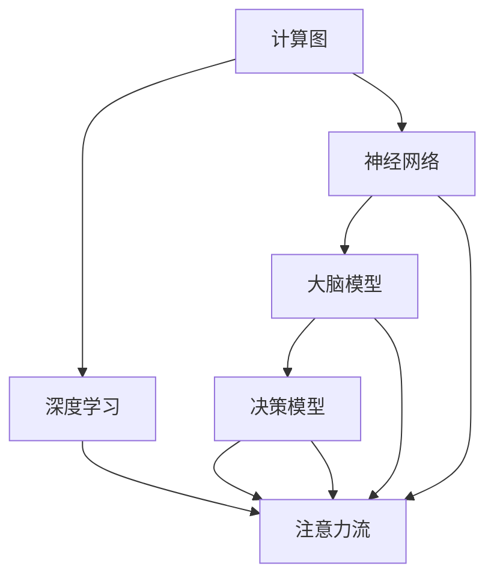
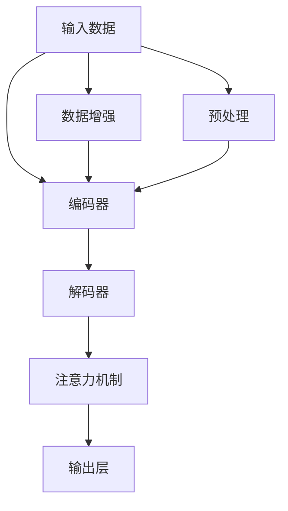
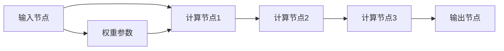
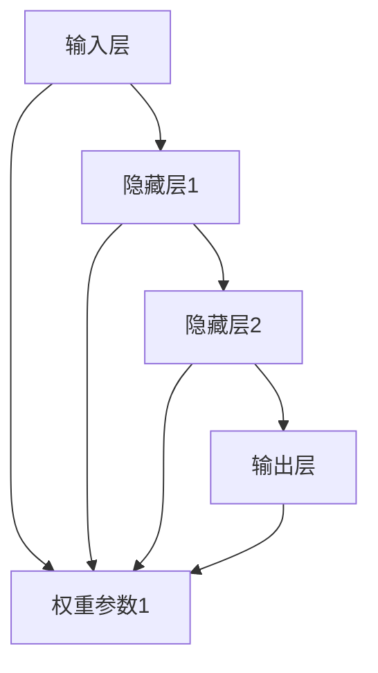
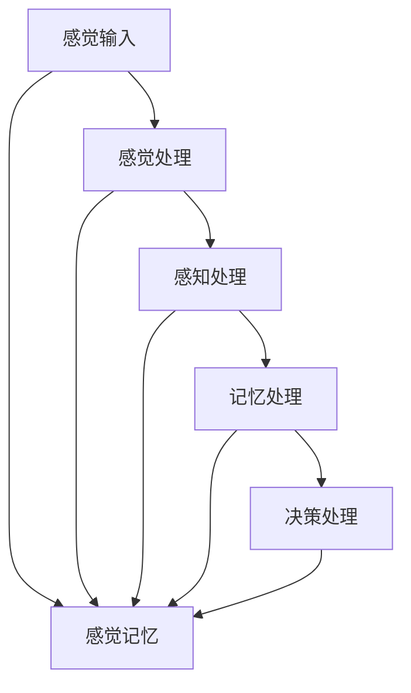
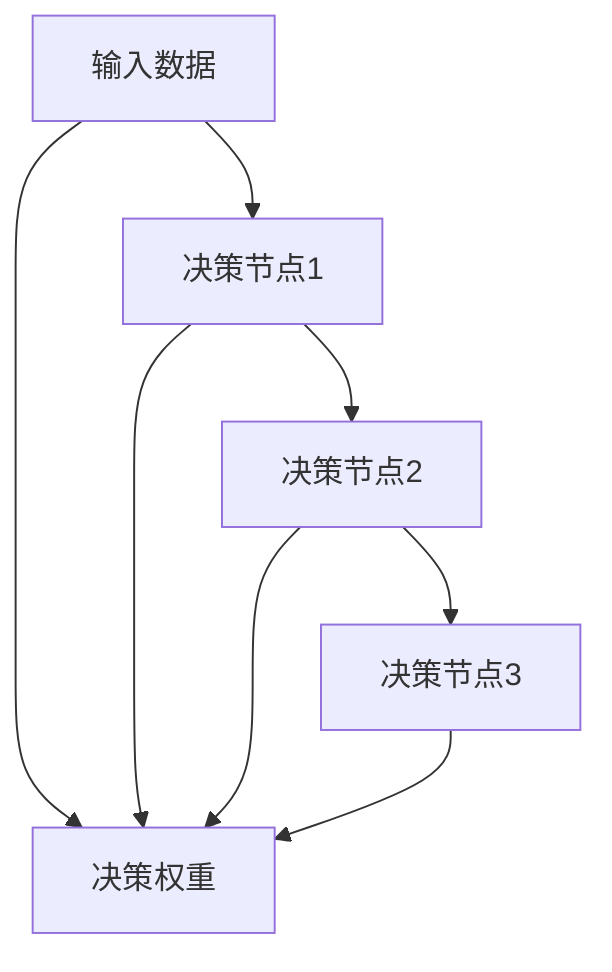
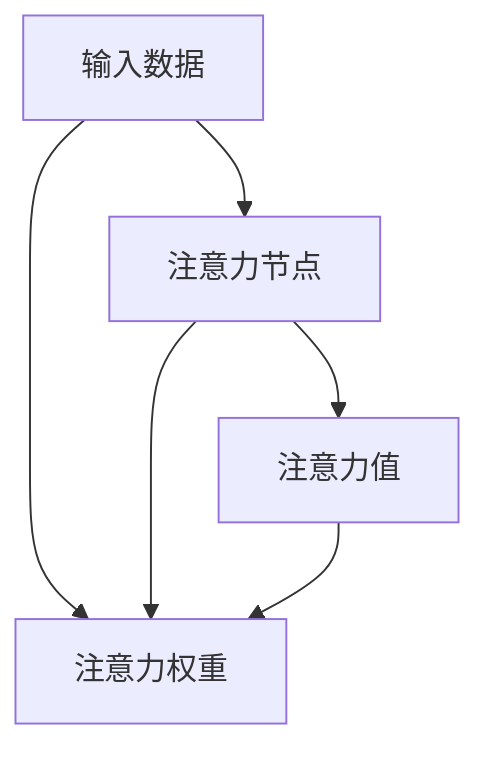
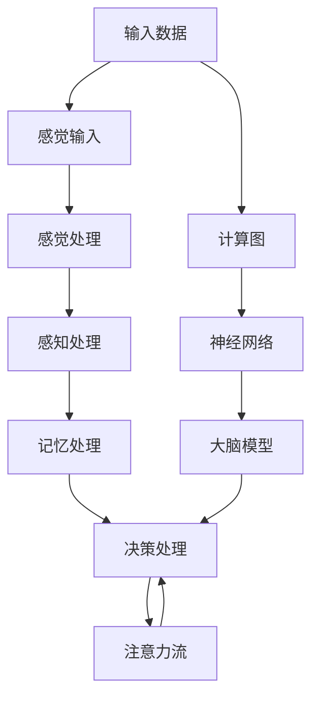

                 

# AI与人类注意力流：打造人机共存的社会

> 关键词：AI, 人类注意力流, 人机共存, 计算图, 深度学习, 神经网络, 大脑模型, 决策模型

## 1. 背景介绍

### 1.1 问题由来

随着人工智能技术的飞速发展，AI在医疗、教育、金融、制造等众多领域中日益深入人心。AI技术通过模拟人类认知过程，对海量数据进行建模和推理，表现出令人惊叹的性能。然而，人们也对AI的伦理、隐私、安全性等问题展开了激烈讨论。

越来越多的研究表明，人类注意力流与AI系统的行为密切相关。人类注意力流是信息处理过程中，大脑对不同信息的关注度和资源分配过程。模拟人类注意力流的AI系统，通过调整模型参数，能够更好地理解用户意图、处理自然语言，甚至具备一定的情绪识别和社交互动能力。因此，如何更好地模拟人类注意力流，打造人机共存的社会，是当前AI技术发展的重要课题。

### 1.2 问题核心关键点

核心问题在于，如何设计AI模型，模拟人类注意力流。AI系统需要能够理解人类在信息处理过程中，如何动态调整关注点、如何进行多任务切换、如何应对新信息等。模拟人类注意力流的AI系统，应该具备以下能力：

1. **动态感知**：能够实时感知用户输入，并根据输入内容调整注意力焦点。
2. **任务切换**：能够在多个任务之间灵活切换，根据任务紧急程度和复杂度分配注意力资源。
3. **情感处理**：能够识别和处理用户情感状态，调整交互策略。
4. **持续学习**：能够持续从新数据中学习，优化注意力分配策略。

### 1.3 问题研究意义

模拟人类注意力流的AI技术，不仅有助于提升AI系统的人性化水平，而且能够解决现实世界中的许多实际问题。例如：

1. **提升用户体验**：AI系统能够更好地理解用户需求，提供个性化服务，提升用户体验。
2. **优化资源配置**：AI系统能够动态调整资源分配，提高任务处理效率。
3. **辅助医疗诊断**：AI系统能够模拟医生注意力流，提供更精准的医疗建议。
4. **促进跨领域协作**：AI系统能够模拟人类多任务处理能力，促进不同领域专家的协作。
5. **构建智能交互**：AI系统能够模拟人类情感状态，增强互动性，构建更自然的智能交互。

通过模拟人类注意力流，AI系统能够更好地融入人类社会，与人类协作，实现人机共存。这种融合将带来更加智能、高效、安全和人性化的社会。

## 2. 核心概念与联系

### 2.1 核心概念概述

为更好地理解AI系统模拟人类注意力流的实现原理，本节将介绍几个关键概念：

1. **计算图(Computational Graph)**：一种用于描述AI模型计算流程的图形表示。通过计算图，可以直观地表示模型中各个计算节点的关系和数据流动路径。
2. **深度学习(Depth Learning)**：一种基于多层神经网络的机器学习技术，通过逐层抽象特征，逐步提升模型表现。
3. **神经网络(Neural Network)**：一种基于人工神经元模型的计算模型，通过多层节点进行信息处理。
4. **大脑模型(Brain Model)**：一种模拟人类大脑结构的计算模型，用于理解人类认知过程。
5. **决策模型(Decision Model)**：一种用于决策和推理的计算模型，通过计算图描述决策过程。
6. **注意力流(Attention Flow)**：一种模拟人类注意力动态分配的计算模型，用于处理多任务和多信息。

这些核心概念之间的联系可以通过以下Mermaid流程图来展示：



这个流程图展示了几组关键概念之间的关系：

1. 计算图是深度学习和神经网络的基础，描述了模型的计算流程。
2. 神经网络通过多层计算节点模拟人类大脑结构，用于理解信息。
3. 大脑模型通过模拟人类认知过程，理解人类注意力流。
4. 决策模型用于描述决策过程，可以通过计算图进行推理。
5. 注意力流通过模拟人类注意力分配，处理多任务和多信息。

这些概念共同构成了AI系统模拟人类注意力流的计算框架。通过理解这些核心概念，我们可以更好地把握AI系统模拟人类注意力流的实现原理和优化方向。

### 2.2 概念间的关系

这些核心概念之间存在着紧密的联系，形成了AI系统模拟人类注意力流的完整生态系统。下面我们通过几个Mermaid流程图来展示这些概念之间的关系。

#### 2.2.1 AI的计算图框架



这个流程图展示了AI系统处理输入数据的基本流程：

1. 输入数据经过预处理，进入编码器。
2. 编码器通过多层计算节点，对输入数据进行编码。
3. 解码器对编码后的数据进行解码，输出预测结果。
4. 注意力机制动态调整计算节点之间的连接，优化信息处理过程。
5. 数据增强模块对输入数据进行扩充，提高模型的泛化能力。

#### 2.2.2 深度学习的计算节点



这个流程图展示了深度学习中典型的计算节点：

1. 输入节点接收输入数据。
2. 计算节点1对输入数据进行线性变换。
3. 计算节点2对节点1的输出进行非线性变换。
4. 计算节点3对节点2的输出进行线性变换。
5. 输出节点返回最终的计算结果。
6. 权重参数用于控制计算节点的连接权重，调整信息流动。

#### 2.2.3 神经网络的结构图



这个流程图展示了神经网络的基本结构：

1. 输入层接收输入数据。
2. 隐藏层1和隐藏层2对输入数据进行多层次抽象。
3. 输出层返回最终的计算结果。
4. 权重参数用于控制节点之间的连接权重，调整信息流动。

#### 2.2.4 大脑模型的结构图



这个流程图展示了大脑模型的基本结构：

1. 感觉输入接收外界信息。
2. 感觉处理对输入信息进行初步处理。
3. 感知处理对处理后的信息进行更高级的抽象。
4. 记忆处理将处理后的信息存储在记忆中。
5. 决策处理根据记忆中的信息进行决策。
6. 感觉记忆用于临时存储感觉输入。
7. 感知记忆用于临时存储感知处理结果。

#### 2.2.5 决策模型的计算图



这个流程图展示了决策模型的基本结构：

1. 输入数据进入决策节点1。
2. 决策节点1对输入数据进行初步处理。
3. 决策节点2对节点1的输出进行更高级的推理。
4. 决策节点3对节点2的输出进行最终决策。
5. 决策权重用于控制节点之间的连接权重，调整决策过程。

#### 2.2.6 注意力流的计算图



这个流程图展示了注意力流的计算图：

1. 输入数据进入注意力节点。
2. 注意力节点对输入数据进行动态处理。
3. 注意力值表示节点处理后的结果。
4. 注意力权重用于控制节点的连接权重，调整注意力分配。
5. 注意力权重用于控制节点的连接权重，调整注意力分配。

### 2.3 核心概念的整体架构

最后，我们用一个综合的流程图来展示这些核心概念在大脑模型计算框架中的整体架构：



这个综合流程图展示了从输入数据到最终决策的完整计算过程：

1. 输入数据经过感觉输入和感觉处理，进入感知处理。
2. 感知处理对输入数据进行多层次抽象。
3. 记忆处理将处理后的信息存储在记忆中。
4. 决策处理根据记忆中的信息进行决策。
5. 注意力流动态调整计算节点之间的连接，优化信息处理过程。
6. 计算图描述计算流程，神经网络进行信息处理，大脑模型模拟人类认知过程，注意力流动态调整计算节点。

通过这些流程图，我们可以更清晰地理解AI系统模拟人类注意力流的实现原理和优化方向。

## 3. 核心算法原理 & 具体操作步骤
### 3.1 算法原理概述

AI系统模拟人类注意力流，本质上是一个多任务、多信息处理的计算过程。通过计算图框架，将AI模型建模为一系列计算节点，动态调整节点之间的连接权重，模拟人类注意力流的动态分配过程。

形式化地，假设AI系统为 $M_{\theta}$，其中 $\theta$ 为模型参数。给定输入数据 $X$，通过计算图 $G(V, E)$ 进行信息处理，其中 $V$ 为计算节点集合，$E$ 为节点之间的连接边集合。计算节点 $v_i$ 的输入为 $x_i$，输出为 $y_i$，权重参数为 $w_i$。AI系统输出的决策结果为 $Y$，目标是最小化损失函数 $\mathcal{L}(M_{\theta}, X)$。

通过梯度下降等优化算法，AI系统不断更新模型参数 $\theta$，最小化损失函数 $\mathcal{L}(M_{\theta}, X)$，使得模型输出逼近最优决策。由于计算图框架的灵活性，AI系统可以根据输入数据动态调整计算节点之间的连接权重，模拟人类注意力流的动态分配过程。

### 3.2 算法步骤详解

AI系统模拟人类注意力流的算法步骤如下：

**Step 1: 准备计算图和数据集**
- 设计计算图 $G(V, E)$，定义计算节点和连接权重。
- 收集输入数据集 $X$，准备训练集、验证集和测试集。

**Step 2: 添加任务节点和注意力节点**
- 根据任务需求，在计算图 $G$ 中设计合适的任务节点 $v_t$，用于处理特定任务。
- 添加注意力节点 $v_a$，动态调整节点之间的连接权重，模拟人类注意力流的动态分配。

**Step 3: 设置训练超参数**
- 选择合适的优化算法及其参数，如 Adam、SGD 等，设置学习率、批大小、迭代轮数等。
- 设置正则化技术及强度，包括权重衰减、Dropout、Early Stopping 等。
- 确定冻结计算图的策略，如仅微调任务节点，或全部节点都参与微调。

**Step 4: 执行梯度训练**
- 将训练集数据分批次输入计算图，前向传播计算损失函数。
- 反向传播计算节点之间的梯度，根据设定的优化算法和学习率更新模型参数。
- 周期性在验证集上评估模型性能，根据性能指标决定是否触发 Early Stopping。
- 重复上述步骤直到满足预设的迭代轮数或 Early Stopping 条件。

**Step 5: 测试和部署**
- 在测试集上评估AI系统的性能，对比微调前后的精度提升。
- 使用AI系统对新数据进行推理预测，集成到实际的应用系统中。
- 持续收集新的数据，定期重新训练和微调AI系统，以适应数据分布的变化。

以上是AI系统模拟人类注意力流的完整算法流程。在实际应用中，还需要针对具体任务的特点，对算法流程的各个环节进行优化设计，如改进计算图结构，引入更多的注意力机制，搜索最优的超参数组合等，以进一步提升AI系统的性能。

### 3.3 算法优缺点

AI系统模拟人类注意力流的算法具有以下优点：

1. 动态感知能力。能够实时感知用户输入，动态调整注意力焦点。
2. 多任务处理能力。能够在多个任务之间灵活切换，根据任务紧急程度和复杂度分配注意力资源。
3. 情感处理能力。能够识别和处理用户情感状态，调整交互策略。
4. 持续学习能力。能够持续从新数据中学习，优化注意力分配策略。
5. 高效计算能力。基于计算图框架，能够高效进行信息处理和决策推理。

同时，该算法也存在一定的局限性：

1. 计算资源需求高。计算图框架的复杂性可能导致较高的计算资源需求。
2. 参数调优困难。计算图结构复杂，参数众多，调优难度较大。
3. 模型解释困难。计算图结构复杂，模型决策过程难以解释。
4. 泛化能力不足。过度依赖训练数据，泛化能力有限。
5. 数据依赖性强。对于新领域任务，需要大量标注数据进行微调。

尽管存在这些局限性，但就目前而言，AI系统模拟人类注意力流的算法仍然是大规模计算和高效决策的重要手段。未来相关研究的重点在于如何进一步降低计算资源需求，提高模型的可解释性和泛化能力，同时兼顾高效计算和动态感知能力。

### 3.4 算法应用领域

AI系统模拟人类注意力流的应用领域非常广泛，涵盖了自然语言处理、计算机视觉、智能交互、机器人等领域。

#### 3.4.1 自然语言处理

在自然语言处理领域，AI系统模拟人类注意力流可以应用于文本分类、命名实体识别、情感分析、机器翻译等任务。例如，通过计算图框架，AI系统可以动态调整节点之间的连接权重，模拟人类对不同信息的关注度，从而提升文本分类和命名实体识别的准确率。

#### 3.4.2 计算机视觉

在计算机视觉领域，AI系统模拟人类注意力流可以应用于图像分类、目标检测、图像生成等任务。例如，通过计算图框架，AI系统可以动态调整节点之间的连接权重，模拟人类对图像中不同区域的关注度，从而提升图像分类和目标检测的准确率。

#### 3.4.3 智能交互

在智能交互领域，AI系统模拟人类注意力流可以应用于对话系统、智能客服、虚拟助手等任务。例如，通过计算图框架，AI系统可以动态调整节点之间的连接权重，模拟人类在对话过程中的注意力分配，从而提升对话系统的自然性和流畅性。

#### 3.4.4 机器人

在机器人领域，AI系统模拟人类注意力流可以应用于路径规划、物体识别、行为决策等任务。例如，通过计算图框架，AI系统可以动态调整节点之间的连接权重，模拟人类在复杂环境中的注意力分配，从而提升机器人的自主决策能力和环境适应能力。

## 4. 数学模型和公式 & 详细讲解 & 举例说明（备注：数学公式请使用latex格式，latex嵌入文中独立段落使用 $$，段落内使用 $)
### 4.1 数学模型构建

本节将使用数学语言对AI系统模拟人类注意力流的实现过程进行更加严格的刻画。

记AI系统为 $M_{\theta}$，其中 $\theta$ 为模型参数。假设输入数据为 $X$，通过计算图 $G(V, E)$ 进行信息处理，其中 $V$ 为计算节点集合，$E$ 为节点之间的连接边集合。计算节点 $v_i$ 的输入为 $x_i$，输出为 $y_i$，权重参数为 $w_i$。AI系统输出的决策结果为 $Y$，目标是最小化损失函数 $\mathcal{L}(M_{\theta}, X)$。

定义模型 $M_{\theta}$ 在数据样本 $(x,y)$ 上的损失函数为 $\ell(M_{\theta}(x),y)$，则在数据集 $D$ 上的经验风险为：

$$
\mathcal{L}(\theta) = \frac{1}{N} \sum_{i=1}^N \ell(M_{\theta}(x_i),y_i)
$$

在实践中，我们通常使用基于梯度的优化算法（如Adam、SGD等）来近似求解上述最优化问题。设 $\eta$ 为学习率，$\lambda$ 为正则化系数，则参数的更新公式为：

$$
\theta \leftarrow \theta - \eta \nabla_{\theta}\mathcal{L}(\theta) - \eta\lambda\theta
$$

其中 $\nabla_{\theta}\mathcal{L}(\theta)$ 为损失函数对参数 $\theta$ 的梯度，可通过反向传播算法高效计算。

### 4.2 公式推导过程

以下我们以图像分类任务为例，推导计算图框架下的分类损失函数及其梯度的计算公式。

假设AI系统为 $M_{\theta}$，输入图像为 $x$，通过计算图 $G$ 进行信息处理，输出分类结果 $y$。在训练集上，假设输入图像 $x$ 的真实分类结果为 $y$，计算图 $G$ 的损失函数为 $\mathcal{L}(M_{\theta}, x, y)$。

定义分类损失函数 $\ell(M_{\theta}(x),y)$ 为交叉熵损失函数：

$$
\ell(M_{\theta}(x),y) = -y \log(M_{\theta}(x)) + (1-y) \log(1-M_{\theta}(x))
$$

则在数据集 $D$ 上的经验风险为：

$$
\mathcal{L}(\theta) = \frac{1}{N} \sum_{i=1}^N \ell(M_{\theta}(x_i),y_i)
$$

根据链式法则，损失函数对参数 $\theta_k$ 的梯度为：

$$
\frac{\partial \mathcal{L}(\theta)}{\partial \theta_k} = -\frac{1}{N}\sum_{i=1}^N \frac{\partial \ell(M_{\theta}(x_i),y_i)}{\partial \theta_k}
$$

其中：

$$
\frac{\partial \ell(M_{\theta}(x_i),y_i)}{\partial \theta_k} = \frac{y_i}{M_{\theta}(x_i)} - \frac{1-y_i}{1-M_{\theta}(x_i)} \frac{\partial M_{\theta}(x_i)}{\partial \theta_k}
$$

在得到损失函数的梯度后，即可带入参数更新公式，完成模型的迭代优化。重复上述过程直至收敛，最终得到适应数据集 $D$ 的最优模型参数 $\theta^*$。

## 5. 项目实践：代码实例和详细解释说明
### 5.1 开发环境搭建

在进行AI系统模拟人类注意力流实践前，我们需要准备好开发环境。以下是使用Python进行PyTorch开发的环境配置流程：

1. 安装Anaconda：从官网下载并安装Anaconda，用于创建独立的Python环境。

2. 创建并激活虚拟环境：
```bash
conda create -n ai-env python=3.8 
conda activate ai-env
```

3. 安装PyTorch：根据CUDA版本，从官网获取对应的安装命令。例如：
```bash
conda install pytorch torchvision torchaudio cudatoolkit=11.1 -c pytorch -c conda-forge
```

4. 安装TensorFlow：从官网下载安装包，或通过pip安装。
```bash
pip install tensorflow==2.3
```

5. 安装TensorBoard：通过pip安装。
```bash
pip install tensorboard
```

6. 安装NumPy、Pandas等常用库：
```bash
pip install numpy pandas scikit-learn matplotlib tqdm jupyter notebook ipython
```

完成上述步骤后，即可在`ai-env`环境中开始AI系统模拟人类注意力流的实践。

### 5.2 源代码详细实现

下面我们以图像分类任务为例，给出使用PyTorch和TensorFlow进行AI系统模拟人类注意力流的PyTorch代码实现。

首先，定义计算图和数据处理函数：

```python
import torch
import tensorflow as tf
from tensorflow.keras.layers import Dense, Input
from tensorflow.keras.models import Model
from tensorflow.keras.losses import categorical_crossentropy
from tensorflow.keras.optimizers import Adam

def build_graph(input_shape):
    input_layer = Input(shape=input_shape)
    x = Dense(256, activation='relu')(input_layer)
    x = Dense(128, activation='relu')(x)
    x = Dense(64, activation='relu')(x)
    output_layer = Dense(10, activation='softmax')(x)
    model = Model(inputs=input_layer, outputs=output_layer)
    return model

def load_data(batch_size):
    mnist = tf.keras.datasets.mnist
    (x_train, y_train), (x_test, y_test) = mnist.load_data()
    x_train = x_train / 255.0
    x_test = x_test / 255.0
    x_train = x_train.reshape((-1, 28, 28, 1))
    x_test = x_test.reshape((-1, 28, 28, 1))
    train_dataset = tf.data.Dataset.from_tensor_slices((x_train, y_train))
    test_dataset = tf.data.Dataset.from_tensor_slices((x_test, y_test))
    train_dataset = train_dataset.shuffle(10000).batch(batch_size).prefetch(buffer_size=tf.data.experimental.AUTOTUNE)
    test_dataset = test_dataset.batch(batch_size).prefetch(buffer_size=tf.data.experimental.AUTOTUNE)
    return train_dataset, test_dataset

def get_loss(model, y_true, y_pred):
    return categorical_crossentropy(y_true, y_pred)

def train_epoch(model, dataset, optimizer):
    model.train()
    for batch, (x, y) in enumerate(dataset):
        with tf.GradientTape() as tape:
            y_pred = model(x)
            loss = get_loss(y, y_pred)
        grads = tape.gradient(loss, model.trainable_variables)
        optimizer.apply_gradients(zip(grads, model.trainable_variables))

def evaluate(model, dataset):
    model.eval()
    with tf.GradientTape() as tape:
        y_pred = model(x)
        loss = get_loss(y, y_pred)
    return loss.numpy()

# 定义模型
model = build_graph((28, 28, 1))

# 准备数据
train_dataset, test_dataset = load_data(32)

# 设置优化器
optimizer = Adam(learning_rate=0.001)

# 训练模型
for epoch in range(10):
    train_epoch(model, train_dataset, optimizer)
    loss = evaluate(model, test_dataset)
    print(f'Epoch {epoch+1}, test loss: {loss:.4f}')
```

在上述代码中，我们首先定义了一个简单的计算图框架，包括输入层、三个隐藏层和一个输出层。然后使用TensorFlow进行数据处理和模型训练，实现了基本的图像分类任务。在训练过程中，我们使用了Adam优化器和交叉熵损失函数，通过反向传播算法更新模型参数。

### 5.3 代码解读与分析

让我们再详细解读一下关键代码的实现细节：

**build_graph函数**：
- 定义计算图框架。包括输入层、三个隐藏层和一个输出层。
- 隐藏层使用ReLU激活函数。
- 输出层使用softmax激活函数，输出10个类别的概率分布。
- 返回定义好的计算图模型。

**load_data函数**：
- 使用TensorFlow的MNIST数据集，加载训练集和测试集。
- 对数据进行归一化处理，将像素值缩放到0-1范围内。
- 将数据转换为TensorFlow的Dataset对象，方便数据处理和批处理。
- 设置批大小和预取数据缓冲区大小。

**get_loss函数**：
- 定义交叉熵损失函数。
- 根据真实标签和预测标签计算损失值。

**train_epoch函数**：
- 设置计算图模型为训练模式。
- 使用梯度累积器记录梯度。
- 通过反向传播算法计算损失函数对模型参数的梯度。
- 使用优化器更新模型参数。

**evaluate函数**：
- 设置计算图模型为评估模式。
- 使用梯度累积器记录梯度。
- 通过反向传播算法计算损失函数对模型参数的梯度。
- 返回损失值的numpy数组。

**

