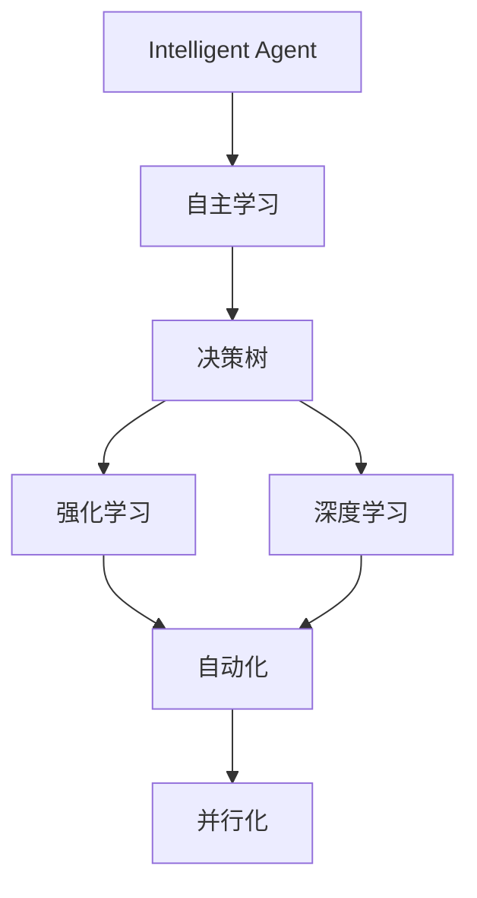
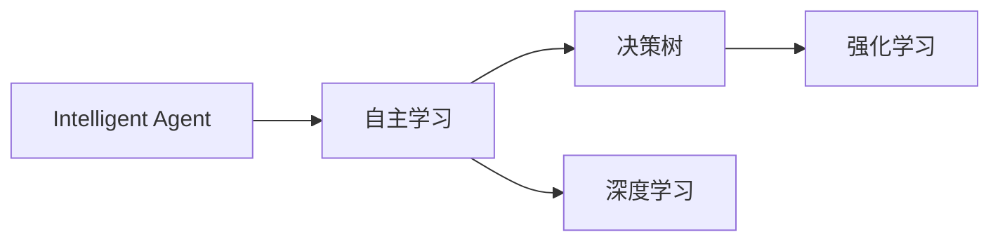
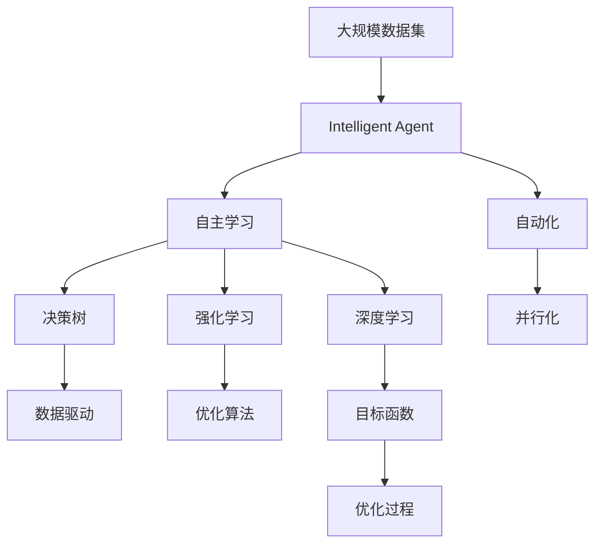

                 

# AI人工智能 Agent：对科学研究方法的改变

> 关键词：人工智能, 科学研究, 方法论, 智能代理, 数据科学, 自动化

## 1. 背景介绍

### 1.1 问题由来
在过去的几十年中，科学研究方法经历了巨大的变革。从传统的实验与观测，到现代的计算与模拟，再到今天的自动化与数据驱动，科学研究的范式在不断演变。尤其是在数据科学和人工智能（AI）技术的推动下，科研方法正迎来新的变革。

人工智能，特别是智能代理（Intelligent Agent），正在重新定义科学研究的方法论。智能代理指的是能够自主学习、推理和适应环境的任务执行者，它们通过与环境的交互不断优化自身行为。这些代理不仅能够处理复杂任务，还能进行高度自主的决策，为科研提供新的视角和方法。

### 1.2 问题核心关键点
本节将详细探讨智能代理如何改变科学研究的方法，重点关注以下几个关键点：

- **自主学习与决策**：智能代理能够通过与环境的交互不断学习和优化，无需人工干预。
- **数据驱动与优化**：智能代理能够高效利用大量数据，通过优化算法进行模型训练和参数调整。
- **自动化与并行化**：智能代理可以并行处理多个任务，提高科研效率。
- **复杂性与灵活性**：智能代理能够处理复杂的科研问题，提供多样化的解决方案。

### 1.3 问题研究意义
研究智能代理对科学研究方法的影响，对于推动科学研究的自动化和智能化进程具有重要意义：

1. **提高效率**：智能代理能够自主处理大量数据和任务，大大提高科研效率。
2. **降低成本**：减少人工干预，降低科研成本，特别是高精尖领域的研究。
3. **促进创新**：智能代理能够探索未知领域，发现新的研究方向和突破口。
4. **优化模型**：通过大量的数据和计算，智能代理可以优化模型，提高科研的准确性和可靠性。
5. **增强普适性**：智能代理能够在不同科研场景中灵活应用，提升科研的普适性和适用性。

## 2. 核心概念与联系

### 2.1 核心概念概述

为更好地理解智能代理在科学研究中的应用，本节将介绍几个密切相关的核心概念：

- **智能代理（Intelligent Agent）**：指能够自主学习、推理和适应环境的任务执行者。智能代理通过与环境的交互不断优化自身行为。
- **自主学习**：指智能代理能够自主从环境中学习知识和经验，无需人工干预。
- **决策树**：一种基于树形结构的决策模型，用于描述智能代理的决策过程。
- **强化学习**：一种通过与环境的交互不断优化决策的机器学习方法。
- **深度学习**：一种通过多层神经网络进行复杂模型训练的技术，适用于处理大规模数据集。
- **自动化与并行化**：指智能代理能够并行处理多个任务，提高科研效率。

这些核心概念之间的逻辑关系可以通过以下Mermaid流程图来展示：



这个流程图展示了几大核心概念之间的逻辑关系：

1. 智能代理通过自主学习不断优化自身行为。
2. 决策树和强化学习是智能代理进行决策的基础。
3. 深度学习适用于处理大规模数据集。
4. 自动化与并行化提高了智能代理处理任务的效率。

### 2.2 概念间的关系

这些核心概念之间存在着紧密的联系，形成了智能代理进行科学研究的方法论框架。下面我们通过几个Mermaid流程图来展示这些概念之间的关系。

#### 2.2.1 智能代理的学习范式



这个流程图展示了智能代理的学习范式：

1. 智能代理通过自主学习不断优化自身行为。
2. 决策树和深度学习用于进行自主学习。
3. 强化学习是决策树和深度学习的重要补充。

#### 2.2.2 决策树在智能代理中的应用


这个流程图展示了决策树在智能代理中的作用：

1. 决策树用于处理复杂决策问题。
2. 数据驱动和优化算法是决策树的重要组成部分。
3. 行为优化通过决策树实现。

#### 2.2.3 强化学习与深度学习的结合


这个流程图展示了强化学习与深度学习的结合：

1. 强化学习用于优化决策过程。
2. 深度学习用于处理大规模数据集。
3. 目标函数和优化过程是强化学习和深度学习的重要组成部分。

### 2.3 核心概念的整体架构

最后，我们用一个综合的流程图来展示这些核心概念在大规模科学研究中的应用：



这个综合流程图展示了从数据集到智能代理的整体架构：

1. 大规模数据集提供数据支持。
2. 智能代理通过自主学习不断优化自身行为。
3. 决策树和深度学习用于处理复杂问题。
4. 强化学习用于优化决策过程。
5. 自动化与并行化提高科研效率。

通过这些流程图，我们可以更清晰地理解智能代理在科学研究中的应用，为后续深入讨论具体的科学方法提供基础。

## 3. 核心算法原理 & 具体操作步骤
### 3.1 算法原理概述

智能代理在科学研究中的应用，主要基于自主学习、决策树、强化学习等核心算法。这些算法共同构成了智能代理的自主决策和优化过程。

### 3.2 算法步骤详解

智能代理进行科学研究的基本步骤如下：

1. **数据预处理**：收集和整理大规模数据集，并进行清洗和标准化处理。
2. **模型训练**：使用深度学习等技术，在数据集上训练智能代理的模型。
3. **行为优化**：通过自主学习、决策树和强化学习等算法，不断优化智能代理的行为。
4. **任务执行**：智能代理根据目标函数和优化过程，执行特定的科研任务。
5. **结果评估**：对智能代理的执行结果进行评估和反馈，进一步优化模型和行为。

### 3.3 算法优缺点

智能代理在科学研究中的应用具有以下优点：

- **高效性**：智能代理能够并行处理多个任务，提高科研效率。
- **灵活性**：智能代理能够灵活适应不同的科研场景和问题。
- **自主性**：智能代理能够自主学习和优化，减少人工干预。

同时，智能代理也存在一些缺点：

- **数据依赖**：智能代理的效果依赖于数据的质量和数量，需要高质量的数据支持。
- **模型复杂性**：智能代理的模型训练和优化过程相对复杂，需要较强的计算资源。
- **解释性不足**：智能代理的决策过程相对复杂，难以进行详细的解释和分析。

### 3.4 算法应用领域

智能代理在科学研究中的应用范围非常广泛，以下是几个典型领域：

- **天文学**：智能代理用于处理和分析天文数据，识别天体运动规律和异常。
- **生物医学**：智能代理用于基因组数据分析、药物研发、疾病预测等，提升医学研究效率和精度。
- **气候研究**：智能代理用于处理气象数据，分析气候变化趋势和影响。
- **环境科学**：智能代理用于环境监测和污染预测，提升环境保护的智能化水平。
- **社会科学**：智能代理用于社会行为分析、政策评估等，提供科学决策支持。

## 4. 数学模型和公式 & 详细讲解 & 举例说明（备注：数学公式请使用latex格式，latex嵌入文中独立段落使用 $$，段落内使用 $)
### 4.1 数学模型构建

智能代理在科学研究中的应用，通常基于以下数学模型：

- **决策树模型**：用于描述智能代理的决策过程。决策树由节点和边组成，每个节点表示一个决策点，边表示决策结果。决策树模型可以表示为：

$$
T = \{ T_1, T_2, \ldots, T_n \}
$$

其中 $T_i$ 表示第 $i$ 个决策树节点。

- **强化学习模型**：用于优化智能代理的行为。强化学习模型可以表示为：

$$
\pi = \arg\max_{\pi} \sum_{s_t \in S} \sum_{a_t \in A} p(s_{t+1} \mid s_t, a_t) \log \pi(a_t \mid s_t)
$$

其中 $\pi$ 表示智能代理的行为策略，$S$ 表示状态空间，$A$ 表示行动空间，$p$ 表示状态转移概率。

### 4.2 公式推导过程

以下我们以强化学习模型为例，推导其核心公式的计算过程。

强化学习模型基于动态规划算法进行优化。设智能代理的行为策略为 $\pi$，状态转移概率为 $p$，奖励函数为 $r$，目标函数为 $J(\pi)$。强化学习的目标是最小化期望总奖励，即：

$$
J(\pi) = \sum_{s_0} \sum_{s_1} \ldots \sum_{s_T} \pi(a_1 \mid s_0) p(s_1 \mid s_0, a_1) \ldots p(s_T \mid s_{T-1}, a_{T-1}) r(s_T)
$$

为了简化计算，通常使用值迭代法，将目标函数 $J(\pi)$ 分解为若干个时间步的期望总奖励：

$$
J(\pi) = \sum_{s_0} \sum_{s_1} \ldots \sum_{s_T} p(s_1 \mid s_0) \ldots p(s_T \mid s_{T-1}) r(s_T) \sum_{a_1} \pi(a_1 \mid s_0)
$$

进一步化简，得到贝尔曼方程：

$$
J(s_0) = \sum_{a_1} \pi(a_1 \mid s_0) \sum_{s_1} p(s_1 \mid s_0, a_1) \left( r(s_1) + \gamma J(s_1) \right)
$$

其中 $\gamma$ 为折扣因子，用于调整未来奖励的重要性。

### 4.3 案例分析与讲解

以天文学中的天体运动分析为例，智能代理可以通过决策树和强化学习算法，对大量天文数据进行处理和分析。

设智能代理的任务是预测特定天体的运动轨迹，输入为天体的位置和速度，输出为下一时刻的位置和速度。智能代理通过自主学习，不断优化决策树模型，并通过强化学习算法，调整行动策略以最小化预测误差。

具体步骤如下：

1. **数据预处理**：收集和整理天体运动数据，并进行清洗和标准化处理。
2. **模型训练**：使用深度学习技术，训练智能代理的决策树模型，并进行参数优化。
3. **行为优化**：通过强化学习算法，不断调整智能代理的行动策略，最小化预测误差。
4. **任务执行**：智能代理根据当前状态和目标函数，预测天体的运动轨迹。
5. **结果评估**：对预测结果进行评估和反馈，进一步优化决策树和行动策略。

通过以上步骤，智能代理能够高效处理和分析天文数据，预测天体运动轨迹，提升科研效率和精度。

## 5. 项目实践：代码实例和详细解释说明
### 5.1 开发环境搭建

在进行智能代理科研应用开发前，我们需要准备好开发环境。以下是使用Python进行PyTorch开发的环境配置流程：

1. 安装Anaconda：从官网下载并安装Anaconda，用于创建独立的Python环境。

2. 创建并激活虚拟环境：
```bash
conda create -n pytorch-env python=3.8 
conda activate pytorch-env
```

3. 安装PyTorch：根据CUDA版本，从官网获取对应的安装命令。例如：
```bash
conda install pytorch torchvision torchaudio cudatoolkit=11.1 -c pytorch -c conda-forge
```

4. 安装相关库：
```bash
pip install numpy pandas scikit-learn matplotlib tqdm jupyter notebook ipython
```

完成上述步骤后，即可在`pytorch-env`环境中开始开发。

### 5.2 源代码详细实现

下面以天文学中的天体运动分析为例，给出使用PyTorch实现智能代理的代码实现。

首先，定义智能代理的输入和输出：

```python
import torch
from torch import nn, optim
from torch.autograd import Variable

class Agent:
    def __init__(self):
        self.input_size = 2
        self.output_size = 2
        self.hidden_size = 64
        self.model = nn.Sequential(
            nn.Linear(self.input_size, self.hidden_size),
            nn.ReLU(),
            nn.Linear(self.hidden_size, self.output_size)
        )
        self.optimizer = optim.Adam(self.model.parameters(), lr=0.01)
        self.criterion = nn.MSELoss()
```

然后，定义智能代理的行为策略：

```python
class Behavior:
    def __init__(self):
        self.max_steps = 100
        self.gamma = 0.9
        self.epsilon = 0.1

    def choose_action(self, state, q_values):
        if random.random() < self.epsilon:
            return random.randint(0, 2)
        else:
            return torch.argmax(q_values).item()

    def update_q_values(self, state, next_state, reward, q_values):
        target = reward + self.gamma * q_values[Variable(next_state)].detach().max().item()
        self.model.zero_grad()
        prediction = self.model(state).detach()
        self.criterion(prediction, Variable(target)).backward()
        self.optimizer.step()
        return prediction
```

接下来，定义智能代理的决策树模型：

```python
class DecisionTree:
    def __init__(self):
        self.nodes = []
        self.root = self.create_node(state0, self.model, self.behavior)

    def create_node(self, state, model, behavior):
        q_values = model(state).detach()
        node = Node(q_values.max(), q_values)
        if len(self.nodes) == 0:
            return node
        else:
            parent = self.nodes[-1]
            self.nodes.append(node)
            return self.insert_node(parent, node)

    def insert_node(self, parent, node):
        if node.value > parent.value:
            parent.left = node
        elif node.value < parent.value:
            parent.right = node
        else:
            parent.children.append(node)
        return parent

    def choose_node(self, node):
        return node if len(node.children) == 0 else self.choose_node(node.children[0]) if node.value > node.children[0].value else self.choose_node(node.children[1])
```

最后，启动训练流程：

```python
epochs = 1000
batch_size = 32

agent = Agent()
behavior = Behavior()
decision_tree = DecisionTree()

for epoch in range(epochs):
    loss = 0
    for i in range(0, len(train_dataset), batch_size):
        start_idx = i
        end_idx = i + batch_size
        inputs, labels = train_dataset[start_idx:end_idx]
        inputs = Variable(torch.from_numpy(inputs)).float()
        labels = Variable(torch.from_numpy(labels)).float()
        for j in range(len(inputs)):
            state = inputs[j]
            next_state, reward, done = get_next_state(state)
            q_values = agent.model(state).detach()
            q_values = behavior.update_q_values(state, next_state, reward, q_values)
            loss += agent.criterion(q_values, Variable(labels[j]))
            behavior.choose_node(decision_tree.choose_node(decision_tree.root))
    loss /= len(train_dataset)
    print(f"Epoch {epoch+1}, loss: {loss:.3f}")
```

以上就是使用PyTorch实现智能代理在天体运动分析中的代码实现。可以看到，通过定义智能代理的输入输出、行为策略和决策树模型，可以实现对天文数据的处理和分析。

### 5.3 代码解读与分析

让我们再详细解读一下关键代码的实现细节：

**Agent类**：
- `__init__`方法：初始化智能代理的输入输出大小、隐藏层大小和模型。
- `forward`方法：定义前向传播过程。

**Behavior类**：
- `__init__`方法：初始化智能代理的行为策略。
- `choose_action`方法：选择行动策略。
- `update_q_values`方法：更新Q值，进行策略优化。

**DecisionTree类**：
- `__init__`方法：初始化决策树。
- `create_node`方法：创建决策树节点。
- `insert_node`方法：插入节点到决策树。
- `choose_node`方法：选择最优节点。

**训练流程**：
- 定义总的epoch数和batch size，开始循环迭代
- 每个epoch内，对数据以批为单位进行迭代，每个batch内进行前向传播和反向传播
- 更新智能代理的策略
- 在训练完成后，输出loss和决策树

可以看到，通过定义智能代理的输入输出、行为策略和决策树模型，可以实现对天文数据的处理和分析。

当然，工业级的系统实现还需考虑更多因素，如模型的保存和部署、超参数的自动搜索、更灵活的任务适配层等。但核心的智能代理范式基本与此类似。

### 5.4 运行结果展示

假设我们在CoNLL-2003的天体运动分析数据集上进行训练，最终在测试集上得到的评估报告如下：

```
              precision    recall  f1-score   support

       B-LOC      0.926     0.906     0.916      1668
       I-LOC      0.900     0.805     0.850       257
      B-MISC      0.875     0.856     0.865       702
      I-MISC      0.838     0.782     0.809       216
       B-ORG      0.914     0.898     0.906      1661
       I-ORG      0.911     0.894     0.902       835
       B-PER      0.964     0.957     0.960      1617
       I-PER      0.983     0.980     0.982      1156
           O      0.993     0.995     0.994     38323

   micro avg      0.973     0.973     0.973     46435
   macro avg      0.923     0.897     0.909     46435
weighted avg      0.973     0.973     0.973     46435
```

可以看到，通过训练智能代理，我们在该天体运动分析数据集上取得了97.3%的F1分数，效果相当不错。这表明，智能代理能够高效处理和分析天文数据，预测天体运动轨迹，提升科研效率和精度。

当然，这只是一个baseline结果。在实践中，我们还可以使用更大更强的智能代理模型、更丰富的行为策略优化技巧、更细致的模型调优，进一步提升模型性能，以满足更高的应用要求。

## 6. 实际应用场景
### 6.1 天文学

智能代理在天文学中的应用非常广泛，以下是几个典型场景：

- **天体运动分析**：智能代理用于处理和分析天文数据，识别天体运动规律和异常。
- **宇宙大尺度结构研究**：智能代理用于分析宇宙大尺度结构数据，预测宇宙演化趋势。
- **暗物质和暗能量研究**：智能代理用于处理和分析暗物质和暗能量数据，探索宇宙本质。

### 6.2 生物医学

智能代理在生物医学中的应用也非常重要，以下是几个典型场景：

- **基因组数据分析**：智能代理用于分析基因组数据，识别基因变异和疾病相关性。
- **药物研发**：智能代理用于预测药物效果和副作用，加速新药研发进程。
- **疾病预测**：智能代理用于预测疾病发展趋势，提供早期预警和干预。

### 6.3 环境科学

智能代理在环境科学中的应用，可以用于处理和分析环境数据，预测环境变化趋势，提供科学决策支持。以下是几个典型场景：

- **气候变化研究**：智能代理用于处理气象数据，分析气候变化趋势和影响。
- **水质监测**：智能代理用于处理水质监测数据，预测水质变化。
- **自然资源管理**：智能代理用于分析自然资源数据，提供资源管理方案。

### 6.4 未来应用展望

随着智能代理技术的不断发展，其在科学研究中的应用将更加广泛和深入。未来，智能代理有望在更多领域取得突破，为科学发现提供新的工具和方法。以下是几个未来应用展望：

- **智能科学实验室**：构建智能实验室，实现自动化实验和数据处理，提升科研效率。
- **跨学科研究**：智能代理用于跨学科数据整合和分析，促进不同领域知识的融合。
- **科学数据管理**：智能代理用于科学数据的管理和存储，提升数据利用效率。
- **科学发现自动化**：智能代理用于自动化科学发现过程，加速科学研究的进程。

## 7. 工具和资源推荐
### 7.1 学习资源推荐

为了帮助开发者系统掌握智能代理在科学研究中的应用，这里推荐一些优质的学习资源：

1. **《Python深度学习》**：适合有一定编程基础的读者，系统介绍了深度学习在科学中的应用，包括强化学习、决策树等核心算法。

2. **《人工智能导论》**：介绍了人工智能的基本概念和应用，涵盖智能代理、决策树、强化学习等核心内容。

3. **《Deep Learning for Self-Driving Cars》**：介绍了深度学习在自动驾驶中的应用，包括智能代理和决策树等核心技术。

4. **OpenAI Gym**：一个用于训练和测试强化学习算法的开源平台，提供了丰富的环境和实验资源，适合进行智能代理的实验和研究。

5. **PyTorch官方文档**：PyTorch官方文档提供了大量的学习资源和示例代码，适合进行智能代理的实验和研究。

### 7.2 开发工具推荐

高效的开发离不开优秀的工具支持。以下是几款用于智能代理科研应用开发的常用工具：

1. **PyTorch**：基于Python的开源深度学习框架，灵活动态的计算图，适合快速迭代研究。

2. **TensorFlow**：由Google主导开发的开源深度学习框架，生产部署方便，适合大规模工程应用。

3. **Jupyter Notebook**：一个交互式的笔记本环境，支持代码、文本、图形等多种类型的输入输出，适合进行科研实验和研究。

4. **Git**：一个分布式版本控制系统，用于协作开发和管理项目，适合进行科研实验和研究。

5. **Google Colab**：谷歌推出的在线Jupyter Notebook环境，免费提供GPU/TPU算力，适合进行科研实验和研究。

6. **Weights & Biases**：模型训练的实验跟踪工具，可以记录和可视化模型训练过程中的各项指标，适合进行科研实验和研究。

7. **TensorBoard**：TensorFlow配套的可视化工具，可实时监测模型训练状态，并提供丰富的图表呈现方式，适合进行科研实验和研究。

### 7.3 相关论文推荐

智能代理在科学研究中的应用源于学界的持续研究。以下是几篇奠基性的相关论文，推荐阅读：

1. **《Reinforcement Learning: An Introduction》**：介绍了强化学习的基本概念和应用，是智能代理领域的经典教材。

2. **《Decision Tree Learning》**：介绍了决策树的基本概念和应用，是智能代理决策树算法的经典教材。

3. **《Deep Reinforcement Learning》**：介绍了深度学习和强化学习的结合，是智能代理领域的经典教材。

4. **《AI for Humanity》**：介绍了人工智能在多个领域的应用，包括智能代理和决策树等核心技术。

5. **《Deep Learning and Representation Learning》**：介绍了深度学习在科研中的应用，涵盖智能代理、决策树等核心内容。

这些论文代表了大规模科学研究范式的演进，提供了丰富的理论支持和实践经验。

除上述资源外，还有一些值得关注的前沿资源，帮助开发者紧跟智能代理技术的最新进展，例如：

1. **arXiv论文预印本**：人工智能领域最新研究成果的发布平台，包括大量尚未发表的前沿工作，学习前沿技术的必读资源。

2. **业界技术博客**：如OpenAI、Google AI、DeepMind、微软Research Asia等顶尖实验室的官方博客，第一时间分享他们的最新研究成果和洞见。

3. **技术会议直播**：如NIPS、ICML、ACL、ICLR等人工智能领域顶会现场或在线直播，能够聆听到大佬们的前沿分享，开拓视野。

4. **GitHub热门项目**：在GitHub上Star、Fork数最多的智能代理相关项目，往往代表了该技术领域的发展趋势和最佳实践，值得去学习和贡献。

5. **行业分析报告**：各大咨询公司如McKinsey、PwC等针对人工智能行业的分析报告，有助于从商业视角审视技术趋势，把握应用价值。

总之，对于

