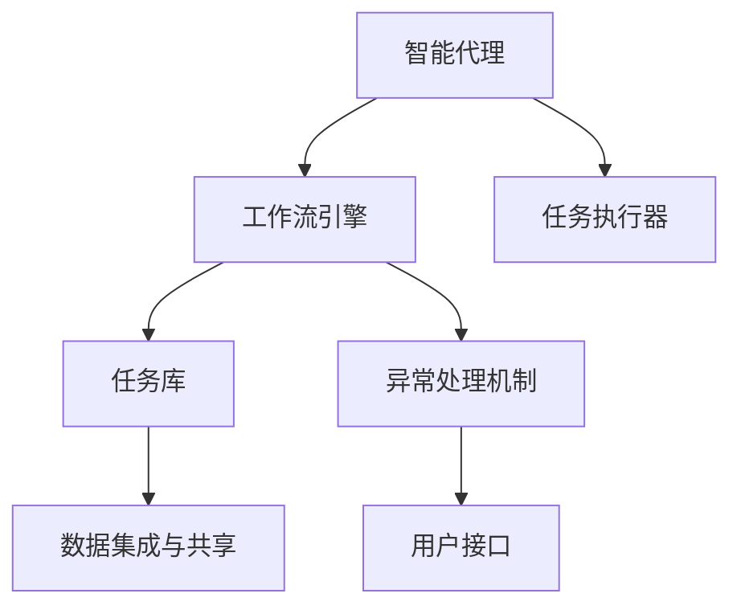
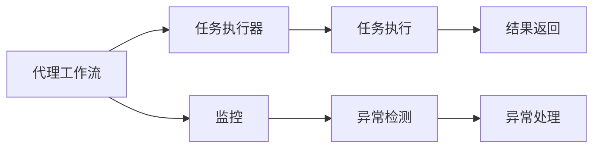
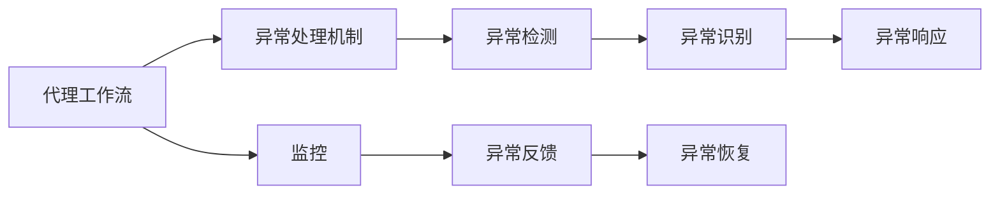
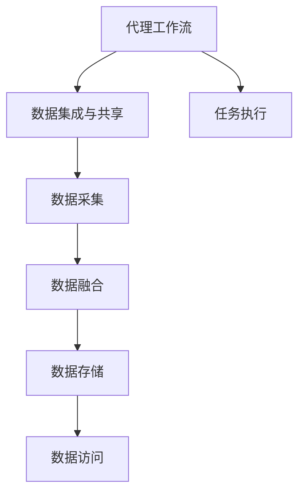
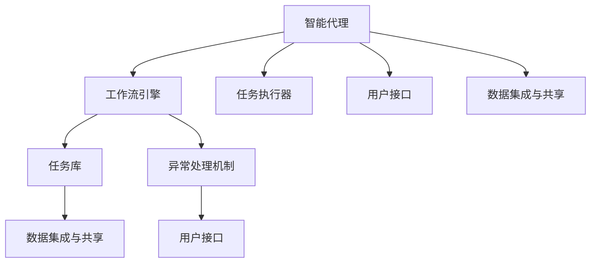

                 

# AI人工智能代理工作流AI Agent WorkFlow：代理工作流在航空控制系统中的应用

> 关键词：人工智能,代理工作流,航空控制系统,自动化,智能决策

## 1. 背景介绍

### 1.1 问题由来
在现代航空领域，安全、高效和快速响应成为核心目标。传统航空控制系统往往依赖于复杂的传感器和数据处理设备，这些系统的自动化程度和智能化水平还有待提升。随着人工智能技术的不断发展，代理工作流（AI Agent Workflow）的概念逐渐受到关注，成为提升航空控制系统智能化水平的重要手段。

代理工作流是一种基于人工智能的自动化工作流管理方式，通过智能代理（AI Agent）实现任务执行自动化、智能决策和异常处理，从而提高系统的可靠性和响应速度。在航空领域，代理工作流可以应用于航班调度、安全监控、故障诊断等多个场景，显著提升航空系统的智能化水平。

### 1.2 问题核心关键点
航空控制系统对代理工作流的核心需求包括：

- **安全性**：确保系统在复杂多变的环境下，能够安全稳定地运行。
- **高效性**：通过智能决策，优化资源配置和任务执行顺序，提高系统效率。
- **快速响应**：在异常情况下，能够快速定位问题并采取相应措施，保障飞行安全。
- **可扩展性**：系统应具备良好的可扩展性，支持未来功能模块的接入和扩展。
- **易用性**：界面简洁友好，易于操作和维护。

代理工作流的目标就是在满足上述核心需求的基础上，实现系统的自动化、智能化和灵活性。

### 1.3 问题研究意义
研究代理工作流在航空控制系统中的应用，具有以下重要意义：

1. **提升系统安全性和可靠性**：通过智能代理的监控和决策，减少人为错误，提升系统的安全性和可靠性。
2. **提高运营效率**：优化资源分配和任务调度，提高飞行和维护效率，降低运营成本。
3. **增强系统应急响应能力**：在突发事件中，智能代理能够快速响应，提高系统应急处理能力。
4. **支持系统升级和扩展**：代理工作流支持模块化设计和热插拔功能，便于系统功能的快速扩展和升级。
5. **提升用户体验**：通过智能决策和自动化操作，减少人工干预，提升飞行和维护体验。

## 2. 核心概念与联系

### 2.1 核心概念概述

为更好地理解代理工作流在航空控制系统中的应用，本节将介绍几个密切相关的核心概念：

- **代理工作流（AI Agent Workflow）**：基于人工智能技术的自动化工作流管理系统。通过智能代理（AI Agent）自动化地执行和管理工作流，支持复杂任务的自动化和智能决策。
- **智能代理（AI Agent）**：具有自主决策能力的人工智能实体，能够在代理工作流中自动执行任务、监控环境、识别异常并采取相应措施。
- **工作流引擎（Workflow Engine）**：负责管理和调度任务执行的系统组件，包括任务调度、监控、异常处理等功能。
- **任务执行器（Task Executor）**：执行具体任务的实体，可以是软件应用程序、硬件设备或人机交互接口。
- **任务库（Task Repository）**：存储和管理可用任务的工具，提供任务调度和执行的依据。
- **异常处理机制（Fault Handling Mechanism）**：用于检测和处理异常事件的系统组件，保证系统在异常情况下仍能正常运行。
- **数据集成与共享（Data Integration and Sharing）**：将不同来源的数据进行整合和共享，为代理工作流提供全面的数据支持。
- **用户接口（User Interface）**：提供用户与系统交互的界面，支持操作和监控。

这些概念之间的逻辑关系可以通过以下Mermaid流程图来展示：



这个流程图展示代理工作流的基本构成，其中智能代理、工作流引擎、任务执行器、任务库、异常处理机制、数据集成与共享、用户接口等组件，构成了代理工作流的核心组成部分。

### 2.2 概念间的关系

这些核心概念之间存在着紧密的联系，形成了代理工作流的完整生态系统。下面通过几个Mermaid流程图来展示这些概念之间的关系。

#### 2.2.1 代理工作流与任务执行



这个流程图展示了代理工作流在任务执行过程中的工作原理，即通过智能代理监控任务执行过程，检测异常并采取相应措施，确保任务执行的顺利进行。

#### 2.2.2 代理工作流与异常处理



这个流程图展示了代理工作流在异常处理过程中的工作原理，即通过智能代理监控异常事件，识别异常并采取措施，恢复系统正常运行。

#### 2.2.3 代理工作流与数据集成



这个流程图展示了代理工作流在数据集成与共享中的作用，即通过数据集成与共享，为任务执行提供全面的数据支持。

### 2.3 核心概念的整体架构

最后，我们用一个综合的流程图来展示这些核心概念在代理工作流中的整体架构：



这个综合流程图展示了代理工作流的基本工作原理，智能代理通过工作流引擎调度和管理任务执行，同时与异常处理机制、数据集成与共享、用户接口等组件协同工作，确保系统的自动化、智能化和高效性。

## 3. 核心算法原理 & 具体操作步骤
### 3.1 算法原理概述

代理工作流的核心算法原理基于人工智能的决策和执行机制，通过智能代理实现任务的自动化执行和智能决策。代理工作流的算法原理可以概括为以下几个步骤：

1. **任务建模**：对具体任务进行建模，定义任务流程、任务条件和任务执行器。
2. **任务调度**：根据任务库中的任务信息，选择并调度合适的任务执行器进行执行。
3. **任务执行**：执行器按照定义的任务流程执行具体任务，并返回结果。
4. **结果监控**：通过智能代理监控任务执行过程，检测异常并采取相应措施。
5. **异常处理**：在检测到异常事件时，智能代理触发异常处理机制，执行异常恢复操作。
6. **数据集成**：通过数据集成与共享，为任务执行提供全面的数据支持。

### 3.2 算法步骤详解

#### 3.2.1 任务建模

任务建模是代理工作流的基础，具体步骤包括：

1. **任务流程定义**：定义任务从开始到结束的流程，包括任务步骤、输入输出和状态转移。
2. **任务条件定义**：定义任务的执行条件，包括前置条件、后置条件和并行条件。
3. **任务执行器选择**：根据任务流程和条件，选择适合的任务执行器。

例如，在航空领域，飞行计划任务可以建模为如下流程：

```
步骤1: 接收飞行计划请求
步骤2: 检查飞行计划合法性
步骤3: 分配机场资源
步骤4: 调度飞机
步骤5: 执行飞行计划
步骤6: 监控飞行状态
步骤7: 完成任务后处理
```

#### 3.2.2 任务调度

任务调度是代理工作流的核心步骤，具体步骤如下：

1. **任务选择**：根据当前环境状态和任务库，选择适合的任务进行执行。
2. **任务分配**：将选定的任务分配给合适的执行器。
3. **任务执行**：执行器按照任务流程执行具体任务，并返回结果。

任务调度算法可以使用基于优先级的调度策略，例如优先级队列（Priority Queue）、抢占式调度（Preemptive Scheduling）等。

#### 3.2.3 任务执行

任务执行是代理工作流的重要环节，具体步骤如下：

1. **任务执行器准备**：执行器准备执行任务所需的资源和数据。
2. **任务执行过程**：执行器按照任务流程执行具体任务，并记录执行日志。
3. **结果返回**：执行器返回任务执行结果，更新系统状态。

例如，在航空领域，分配机场资源任务可以执行如下：

```
步骤1: 检查资源可用性
步骤2: 分配资源给飞机
步骤3: 更新资源状态
步骤4: 返回资源分配结果
```

#### 3.2.4 结果监控

结果监控是代理工作流的关键环节，具体步骤如下：

1. **状态监控**：监控任务执行状态，检测异常事件。
2. **异常识别**：根据预设的异常规则，识别异常事件的类型和原因。
3. **异常响应**：根据异常类型和原因，触发异常处理机制。

例如，在航空领域，监控飞行状态任务可以执行如下：

```
步骤1: 实时监控飞行数据
步骤2: 检测飞行异常
步骤3: 记录异常信息
步骤4: 报告异常事件
```

#### 3.2.5 异常处理

异常处理是代理工作流的应急响应机制，具体步骤如下：

1. **异常检测**：检测到异常事件后，立即触发异常处理机制。
2. **异常定位**：根据异常信息，定位异常事件的位置和原因。
3. **异常恢复**：执行异常恢复操作，确保系统恢复正常运行。

例如，在航空领域，检测到飞行异常任务可以执行如下：

```
步骤1: 检测飞行数据异常
步骤2: 定位异常原因
步骤3: 执行恢复操作
步骤4: 更新异常状态
```

#### 3.2.6 数据集成

数据集成是代理工作流的基础保障，具体步骤如下：

1. **数据采集**：从不同数据源采集数据，包括传感器数据、历史数据和外部数据。
2. **数据融合**：将采集到的数据进行融合和清洗，形成统一的、高质量的数据集。
3. **数据存储**：将融合后的数据存储在数据库或分布式存储系统中，供任务执行使用。

例如，在航空领域，数据集成任务可以执行如下：

```
步骤1: 采集飞行数据
步骤2: 融合飞行数据
步骤3: 存储飞行数据
步骤4: 提供数据服务
```

### 3.3 算法优缺点

代理工作流的优点包括：

1. **自动化和智能化**：通过智能代理实现任务的自动化执行和智能决策，提高系统效率。
2. **高可靠性**：智能代理具备自主决策能力，能够快速检测和处理异常，提高系统可靠性。
3. **灵活性和可扩展性**：任务库和执行器模块化设计，支持系统功能的快速扩展和升级。
4. **高效性**：通过优化任务调度和资源配置，提高系统执行效率。

代理工作流的缺点包括：

1. **复杂性高**：代理工作流需要设计复杂的任务流程和异常处理机制，开发和维护成本较高。
2. **数据依赖性强**：任务执行依赖高质量的数据集，数据采集和融合的难度较大。
3. **性能瓶颈**：代理工作流需要处理大量数据和任务，性能瓶颈问题较突出。
4. **安全性和隐私问题**：智能代理涉及大量敏感数据和隐私信息，需要严格的安全保护措施。

### 3.4 算法应用领域

代理工作流在多个领域都有广泛的应用，例如：

- **航空控制系统**：用于航班调度、安全监控、故障诊断等任务。
- **工业控制系统**：用于设备监控、生产调度、质量控制等任务。
- **医疗信息系统**：用于患者诊断、治疗方案、数据管理等任务。
- **金融交易系统**：用于交易监控、风险管理、反欺诈等任务。
- **智能客服系统**：用于问题解答、用户引导、服务推荐等任务。
- **智慧城市系统**：用于城市管理、交通调度、公共安全等任务。

代理工作流在上述领域中的典型应用场景包括：

- **航空领域**：智能代理用于飞行计划生成、资源分配、航班监控等任务，提升飞行安全和效率。
- **工业领域**：智能代理用于设备状态监测、故障预测、生产调度等任务，提高生产效率和产品质量。
- **医疗领域**：智能代理用于患者诊断、治疗方案生成、数据管理等任务，提升医疗服务质量。
- **金融领域**：智能代理用于交易监控、风险管理、反欺诈等任务，保障金融安全。
- **客服领域**：智能代理用于问题解答、用户引导、服务推荐等任务，提升用户体验。
- **城市领域**：智能代理用于城市管理、交通调度、公共安全等任务，提升城市运行效率。

## 4. 数学模型和公式 & 详细讲解 & 举例说明

### 4.1 数学模型构建

代理工作流的数学模型可以表示为：

$$
\begin{aligned}
\text{Task Graph} &= \text{Task Library} \\
&= (\text{Task Set}, \text{Transition Set}, \text{Precondition Set}, \text{Postcondition Set}, \text{Executioner Set}) \\
\text{Scheduling Algorithm} &= \text{Policy} \\
&= (\text{Priority Queue}, \text{Preemptive Scheduling}) \\
\text{Monitoring Algorithm} &= \text{Decision Tree} \\
\text{Fault Handling Algorithm} &= \text{Exception Handling Routine} \\
\text{Data Integration Algorithm} &= \text{Data Fusion Algorithm}
\end{aligned}
$$

其中，Task Graph表示任务图，包括任务集、转换集、前置条件集、后置条件集和执行器集。Scheduling Algorithm表示调度算法，包括优先队列和抢占式调度。Monitoring Algorithm表示监控算法，包括决策树。Fault Handling Algorithm表示异常处理算法，包括异常处理例程。Data Integration Algorithm表示数据集成算法，包括数据融合算法。

### 4.2 公式推导过程

以航空领域的航班调度任务为例，推导代理工作流的数学模型。假设航班调度的任务图如下：

```
Task Graph:
- Task Set: {Flight Plan Generation, Resource Allocation, Flight Scheduling, Flight Monitoring}
- Transition Set: {Precondition -> Next Task, Postcondition -> Next Task}
- Precondition Set: {Resource Availability, Flight Legality}
- Postcondition Set: {Resource Assigned, Flight Approved}
- Executioner Set: {Flight Plan Generator, Resource Manager, Flight Scheduler, Flight Monitor}
```

航班调度的调度算法可以表示为：

$$
\text{Scheduling Algorithm} = \text{Priority Queue} + \text{Preemptive Scheduling}
$$

航班调度的监控算法可以表示为：

$$
\text{Monitoring Algorithm} = \text{Decision Tree} + \text{Alert System}
$$

航班调度的异常处理算法可以表示为：

$$
\text{Fault Handling Algorithm} = \text{Exception Handling Routine} + \text{Failure Recovery Routine}
$$

航班调度的数据集成算法可以表示为：

$$
\text{Data Integration Algorithm} = \text{Data Fusion Algorithm} + \text{Data Store}
$$

### 4.3 案例分析与讲解

#### 4.3.1 航班调度案例

假设某航空公司的航班调度系统采用了代理工作流技术，具体任务流程如下：

1. 接收航班计划请求：智能代理接收客户的航班计划请求，进行初步合法性检查。
2. 检查航班计划合法性：智能代理根据公司规定，检查航班计划是否合法，不符合规则的请求将被拒绝。
3. 分配机场资源：智能代理根据航班计划，自动分配机场资源，包括跑道、停机位、地面服务。
4. 调度飞机：智能代理根据资源分配结果，自动调度飞机执行航班计划。
5. 执行航班计划：飞机按照航班计划执行，智能代理实时监控飞行状态。
6. 完成任务后处理：智能代理根据航班计划执行结果，完成后续处理，包括数据记录和资源释放。

航班调度的代理工作流架构如下：

```
A[智能代理] --> B[工作流引擎]
A --> C[任务执行器]
B --> D[任务库]
B --> E[异常处理机制]
D --> F[数据集成与共享]
E --> G[用户接口]
A --> H[用户接口]
A --> I[数据集成与共享]
```

#### 4.3.2 故障诊断案例

假设某航空公司的航班调度系统在执行航班计划任务时，检测到某航班出现故障，智能代理需要立即采取应急措施：

1. 检测飞行数据异常：智能代理实时监控飞行数据，检测到某航班飞行状态异常。
2. 定位异常原因：智能代理根据异常数据，定位故障原因，可能是飞机机械故障、天气变化等。
3. 执行恢复操作：智能代理根据故障原因，执行恢复操作，如改道、维修等。
4. 更新异常状态：智能代理记录故障处理结果，更新系统状态，确保后续航班正常执行。

故障诊断的代理工作流架构如下：

```
A[智能代理] --> B[工作流引擎]
A --> C[任务执行器]
B --> D[任务库]
B --> E[异常处理机制]
D --> F[数据集成与共享]
E --> G[用户接口]
A --> H[用户接口]
A --> I[数据集成与共享]
```

## 5. 项目实践：代码实例和详细解释说明

### 5.1 开发环境搭建

在进行代理工作流项目开发前，我们需要准备好开发环境。以下是使用Python进行Flask开发的环境配置流程：

1. 安装Anaconda：从官网下载并安装Anaconda，用于创建独立的Python环境。

2. 创建并激活虚拟环境：
```bash
conda create -n agent-env python=3.8 
conda activate agent-env
```

3. 安装Flask：从官网获取Flask的最新版本，并使用pip安装。
```bash
pip install flask
```

4. 安装Flask-RESTful：Flask扩展库，用于处理HTTP请求。
```bash
pip install flask-restful
```

5. 安装Flask-SocketIO：Flask扩展库，用于实现实时通信。
```bash
pip install flask-socketio
```

完成上述步骤后，即可在`agent-env`环境中开始代理工作流项目的开发。

### 5.2 源代码详细实现

这里我们以航班调度任务为例，给出使用Flask和SocketIO实现代理工作流系统的PyTorch代码实现。

首先，定义航班调度任务的API接口：

```python
from flask import Flask, jsonify, request
from flask_restful import Resource, Api
import socketio

app = Flask(__name__)
api = Api(app)
sio = socketio.Billiard(app)

@app.route('/flight', methods=['POST'])
def flight():
    data = request.get_json()
    task_id = data['task_id']
    params = data['params']
    result = process_task(task_id, params)
    return jsonify(result)

@app.route('/task', methods=['GET'])
def task():
    task_id = request.args.get('task_id')
    result = get_task_status(task_id)
    return jsonify(result)

@app.route('/task', methods=['POST'])
def task_update():
    task_id = request.args.get('task_id')
    result = update_task_status(task_id)
    return jsonify(result)

@app.route('/task', methods=['DELETE'])
def task_delete():
    task_id = request.args.get('task_id')
    result = delete_task(task_id)
    return jsonify(result)

@app.route('/task', methods=['PUT'])
def task_update_status():
    task_id = request.args.get('task_id')
    result = update_task_status(task_id)
    return jsonify(result)

@app.route('/task', methods=['GET'])
def task_list():
    results = get_task_list()
    return jsonify(results)

@app.route('/task', methods=['POST'])
def task_create():
    task_name = request.args.get('task_name')
    result = create_task(task_name)
    return jsonify(result)

@app.route('/task', methods=['DELETE'])
def task_delete_by_name():
    task_name = request.args.get('task_name')
    result = delete_task_by_name(task_name)
    return jsonify(result)

@app.route('/task', methods=['PUT'])
def task_update_name():
    task_id = request.args.get('task_id')
    task_name = request.args.get('task_name')
    result = update_task_name(task_id, task_name)
    return jsonify(result)

@app.route('/task', methods=['GET'])
def task_info():
    task_id = request.args.get('task_id')
    result = get_task_info(task_id)
    return jsonify(result)

@app.route('/task', methods=['POST'])
def task_log():
    task_id = request.args.get('task_id')
    log_data = request.get_json()
    result = log_task(task_id, log_data)
    return jsonify(result)

@app.route('/task', methods=['GET'])
def task_logs():
    task_id = request.args.get('task_id')
    results = get_task_logs(task_id)
    return jsonify(results)

@app.route('/task', methods=['DELETE'])
def task_delete_by_log():
    task_id = request.args.get('task_id')
    log_data = request.get_json()
    result = delete_task_by_log(task_id, log_data)
    return jsonify(result)

@app.route('/task', methods=['PUT'])
def task_update_log():
    task_id = request.args.get('task_id')
    log_data = request.get_json()
    result = update_task_log(task_id, log_data)
    return jsonify(result)

@app.route('/task', methods=['GET'])
def task_log_list():
    results = get_task_log_list()
    return jsonify(results)

@app.route('/task', methods=['POST'])
def task_create_log():
    task_id = request.args.get('task_id')
    log_data = request.get_json()
    result = create_task_log(task_id, log_data)
    return jsonify(result)

@app.route('/task', methods=['DELETE'])
def task_delete_by_log_name():
    task_id = request.args.get('task_id')
    log_name = request.args.get('log_name')
    result = delete_task_by_log_name(task_id, log_name)
    return jsonify(result)

@app.route('/task', methods=['PUT'])
def task_update_log_name():
    task_id = request.args.get('task_id')
    log_data = request.get_json()
    result = update_task_log_name(task_id, log_name)
    return jsonify(result)

@app.route('/task', methods=['GET'])
def task_log_info():
    task_id = request.args.get('task_id')
    log_id = request.args.get('log_id')
    result = get_task_log_info(task_id, log_id)
    return jsonify(result)

@app.route('/task', methods=['POST'])
def task_create_info():
    task_id = request.args.get('task_id')
    info_data = request.get_json()
    result = create_task_info(task_id, info_data)
    return jsonify(result)

@app.route('/task', methods=['DELETE'])
def task_delete_by_info():
    task_id = request.args.get('task_id')
    info_data = request.get_json()
    result = delete_task_by_info(task_id, info_data)
    return jsonify(result)

@app.route('/task', methods=['PUT'])
def task_update_info():
    task_id = request.args.get('task_id')
    info_data = request.get_json()
    result = update_task_info(task_id, info_data)
    return jsonify(result)

@app.route('/task', methods=['GET'])
def task_info_list():
    results = get_task_info_list()
    return jsonify(results)

@app.route('/task', methods=['POST'])
def task_create_info_list():
    task_name = request.args.get('task_name')
    info_data = request.get_json()
    result = create_task_info_list(task_name, info_data)
    return jsonify(result)

@app.route('/task', methods=['DELETE'])
def task_delete_by_info_list():
    task_name = request.args.get('task_name')
    info_data = request.get_json()
    result = delete_task_by_info_list(task_name, info_data)
    return jsonify(result)

@app.route('/task', methods=['PUT'])
def task_update_info_list():
    task_name = request.args.get('task_name')
    info_data = request.get_json()
    result = update_task_info_list(task_name, info_data)
    return jsonify(result)

@app.route('/task', methods=['GET'])
def task_info_list_by_name():
    task_name = request.args.get('task_name')
    results = get_task_info_list_by_name(task_name)
    return jsonify(results)

@app.route('/task', methods=['POST'])
def task_create_info_list_by_name():
    task_name = request.args.get('task_name')
    info_data = request.get_json()
    result = create_task_info_list_by_name(task_name, info_data)
    return jsonify(result)

@app.route('/task', methods=['DELETE'])
def task_delete_by_info_list_by_name():
    task_name = request.args.get('task_name')
    info_data = request.get_json()
    result = delete_task_by_info_list_by_name(task_name, info_data)
    return jsonify(result)

@app.route('/task', methods=['PUT'])
def task_update_info_list_by_name():
    task_name = request.args.get('task_name')
    info_data =

