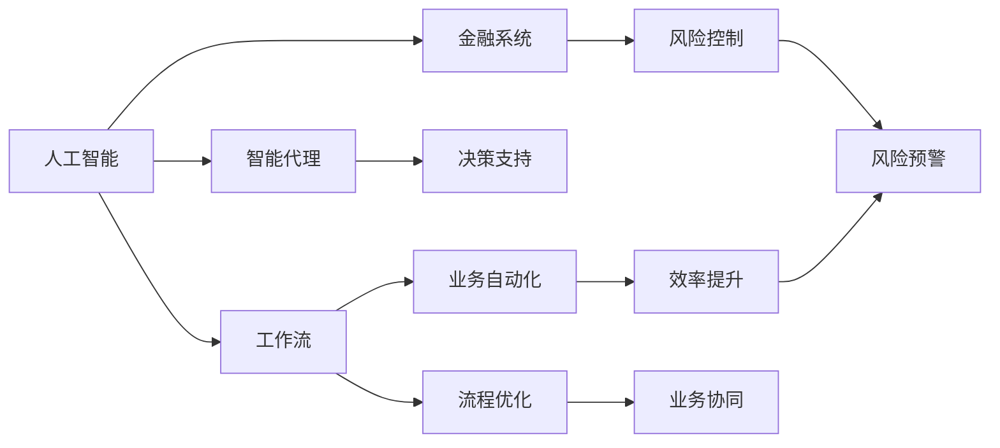
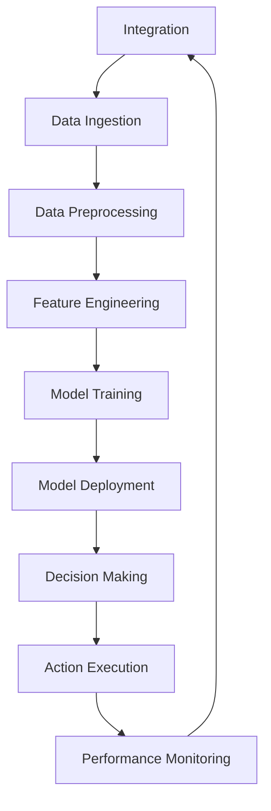
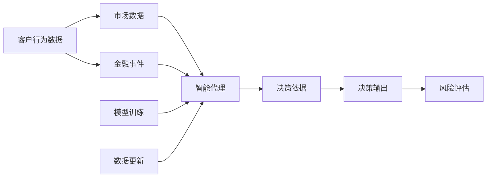
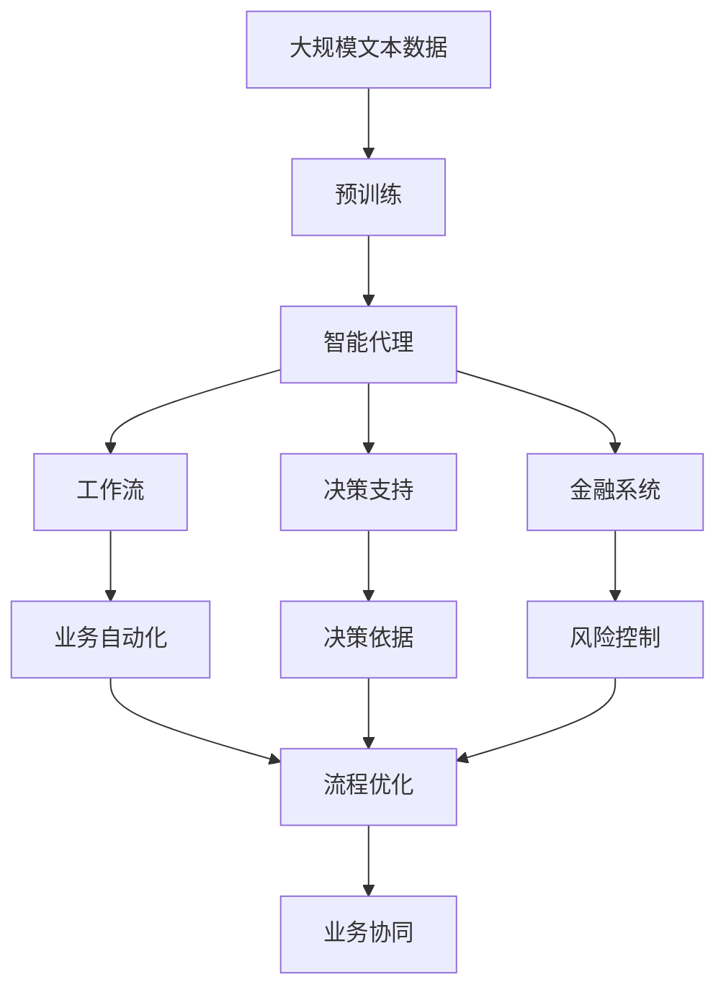

                 

# AI人工智能代理工作流AI Agent WorkFlow：智能代理在金融系统中的应用

> 关键词：人工智能, 智能代理, 工作流, 金融系统, 自动化, 决策支持

## 1. 背景介绍

### 1.1 问题由来
随着金融科技的迅速发展，金融机构面临的风险和挑战愈发严峻。传统的人工审核和决策流程在复杂场景下效率低下，且容易出现误判。如何利用人工智能技术，构建更加高效、智能、可靠的金融系统，成为了一个亟待解决的问题。

### 1.2 问题核心关键点
在金融系统中，智能代理(AI Agent)工作流扮演了关键角色。智能代理是一种基于人工智能的自动化决策支持系统，可以模拟人类的决策过程，自动识别、分析、处理和响应各种金融事件。通过智能代理，金融机构可以实现业务流程自动化、风险控制智能化、客户服务精准化等目标。

### 1.3 问题研究意义
智能代理在金融系统中的应用，对于提升金融服务的质量和效率，防范金融风险，促进金融业数字化转型，具有重要意义：

1. **提高业务效率**：通过自动化处理各种金融事务，减少人工干预，大幅提升业务处理速度。
2. **降低运营成本**：减少人工成本，降低运营成本，提高机构竞争力。
3. **提升决策质量**：基于大数据和AI算法，提升决策的准确性和及时性，降低误判风险。
4. **强化风险控制**：实时监控和分析市场动态，及时发现异常行为，增强风险预警和应对能力。
5. **优化客户体验**：根据客户行为和偏好，提供个性化的金融产品和服务，提升客户满意度。

## 2. 核心概念与联系

### 2.1 核心概念概述

为更好地理解智能代理在金融系统中的应用，本节将介绍几个密切相关的核心概念：

- **人工智能(AI)**：通过算法、模型、数据等技术手段，模拟人类智能，完成复杂任务的计算与决策。
- **智能代理(AI Agent)**：基于AI技术的自动化决策支持系统，能够自主感知环境、分析数据、做出决策并执行任务。
- **工作流(Workflow)**：由一系列任务、子任务及执行顺序组成的流程，用于规范和自动化业务操作。
- **金融系统(Financial System)**：包括银行、证券、保险等在内的各类金融机构的业务系统，涉及贷款、投资、理财、风险控制等多个环节。
- **决策支持(Decision Support)**：通过智能技术提供决策依据，辅助人工决策，提升决策效果。

这些核心概念之间的逻辑关系可以通过以下Mermaid流程图来展示：



这个流程图展示了大语言模型微调过程中各个核心概念之间的关系：

1. 人工智能通过智能代理提供决策支持，辅助业务自动化。
2. 智能代理通过工作流实现业务自动化。
3. 工作流优化业务流程，实现业务协同。
4. 智能代理参与风险控制，提高风险预警能力。
5. 工作流与金融系统结合，提升金融业务的效率和质量。

### 2.2 概念间的关系

这些核心概念之间存在着紧密的联系，形成了智能代理在金融系统中的整体应用框架。下面我们通过几个Mermaid流程图来展示这些概念之间的关系。

#### 2.2.1 智能代理的工作流结构



这个流程图展示了智能代理在金融系统中的应用流程：

1. 集成模块负责与金融系统的对接。
2. 数据采集模块从金融系统中获取实时数据。
3. 数据预处理模块对数据进行清洗、归一化等处理。
4. 特征工程模块对数据进行特征提取和构造。
5. 模型训练模块基于训练数据训练AI模型。
6. 模型部署模块将模型部署到金融系统中。
7. 决策模块根据模型输出做出决策。
8. 执行模块根据决策执行相应操作。
9. 性能监控模块对智能代理的表现进行实时监测。

#### 2.2.2 智能代理的决策支持机制



这个流程图展示了智能代理的决策支持机制：

1. 客户行为数据和市场数据通过智能代理进行综合分析。
2. 金融事件触发智能代理进行决策。
3. 智能代理根据训练好的模型做出决策依据。
4. 决策依据用于生成决策输出。
5. 决策输出经过风险评估，生成最终决策。
6. 智能代理不断更新模型和数据，保持决策依据的有效性。

#### 2.2.3 智能代理在风险控制中的应用


这个流程图展示了智能代理在风险控制中的应用：

1. 市场波动和交易异常触发智能代理进行风险预警。
2. 智能代理根据风险模型进行风险预警。
3. 风险预警生成风险响应。
4. 风险响应反馈给智能代理，更新风险模型。

### 2.3 核心概念的整体架构

最后，我们用一个综合的流程图来展示这些核心概念在大语言模型微调过程中的整体架构：



这个综合流程图展示了从预训练到智能代理的完整过程。智能代理首先在大规模文本数据上进行预训练，然后通过工作流实现业务自动化，结合决策支持提供决策依据，最后与金融系统结合，提升金融业务的效率和质量。 通过这些流程图，我们可以更清晰地理解智能代理在金融系统中的应用流程和核心概念的关系。

## 3. 核心算法原理 & 具体操作步骤
### 3.1 算法原理概述

智能代理在金融系统中的应用，本质上是一个复杂的业务自动化和决策支持过程。其核心思想是：构建一个基于人工智能的自动化决策系统，通过数据分析、模型训练、决策生成和执行操作，实现业务流程的自动化和智能化。

形式化地，假设智能代理系统由 $N$ 个任务 $T=\{T_1, T_2, ..., T_N\}$ 组成，每个任务 $T_i$ 对应一个函数 $f_i$，其输入为 $x_i$，输出为 $y_i$，则智能代理的总体功能可以表示为：

$$
Y = f_{T_1}(f_{T_2}(...(f_{T_{N-1}}(f_{T_N}(x_N))...))
$$

其中 $x_1$ 为输入数据，$Y$ 为智能代理的输出决策。通过设计合理的任务函数和执行顺序，智能代理能够自动处理复杂的金融事务。

### 3.2 算法步骤详解

智能代理在金融系统中的应用，一般包括以下几个关键步骤：

**Step 1: 数据预处理**
- 收集金融系统的各类数据，包括客户行为数据、市场数据、交易数据等。
- 对数据进行清洗、去重、归一化等处理，确保数据的质量和一致性。
- 划分训练集、验证集和测试集，用于模型训练和评估。

**Step 2: 特征工程**
- 对预处理后的数据进行特征提取和构造，如特征选择、降维、构造新特征等。
- 通过分析金融业务逻辑，设计有意义的特征，如时间窗口、金额区间、市场趋势等。

**Step 3: 模型训练**
- 选择合适的AI模型（如决策树、随机森林、神经网络等），使用训练集进行模型训练。
- 使用交叉验证、网格搜索等技术进行超参数调优，寻找最优模型。
- 模型训练过程中，可以使用集成学习、正则化等方法提高模型的泛化能力。

**Step 4: 模型部署**
- 将训练好的模型部署到金融系统中，与业务系统进行集成。
- 设计合适的接口和交互方式，确保智能代理能够与金融系统无缝对接。
- 实现智能代理的自动化运行，确保实时响应金融事务。

**Step 5: 性能监控与优化**
- 实时监控智能代理的性能指标，如准确率、召回率、响应时间等。
- 定期评估智能代理的表现，进行模型更新和参数调整。
- 针对性能问题，进行模型优化和资源调整，提升智能代理的效率和质量。

### 3.3 算法优缺点

智能代理在金融系统中的应用，具有以下优点：

1. **高效自动化**：通过自动化处理金融事务，减少人工干预，提升业务处理速度。
2. **风险控制**：实时监控金融市场，及时发现异常行为，增强风险预警和应对能力。
3. **决策支持**：提供精准的决策依据，辅助人工决策，提升决策效果。
4. **成本节约**：减少人工成本，降低运营成本，提高机构竞争力。
5. **客户服务**：提供个性化金融产品和服务，提升客户满意度。

同时，智能代理也存在以下缺点：

1. **数据依赖**：智能代理的性能依赖于数据的完整性和准确性，数据质量问题可能导致误判。
2. **模型风险**：模型的不稳定性和过拟合风险可能影响智能代理的性能。
3. **复杂度**：构建和维护智能代理系统需要较高的技术门槛，对团队能力要求较高。
4. **合规性**：智能代理在处理敏感金融数据时需要符合相关法规和隐私保护要求。

### 3.4 算法应用领域

智能代理在金融系统中的应用，已经覆盖了金融领域的各个方面，包括但不限于：

- **贷款审批**：通过自动化审核贷款申请，提升审批效率，降低人工成本。
- **风险管理**：实时监控市场波动和交易异常，增强风险预警和控制能力。
- **投资理财**：根据客户行为和偏好，提供个性化的投资建议和理财方案。
- **客户服务**：通过智能客服系统，提供7x24小时的金融咨询服务。
- **运营管理**：自动化处理日常运营任务，提升机构运营效率。
- **合规检查**：实时监控和分析金融操作，确保合规性和安全性。

## 4. 数学模型和公式 & 详细讲解 & 举例说明

### 4.1 数学模型构建

智能代理在金融系统中的应用，涉及大量的数据分析和模型训练。以下将详细介绍智能代理的核心数学模型和构建过程。

假设智能代理系统由 $N$ 个任务 $T=\{T_1, T_2, ..., T_N\}$ 组成，每个任务 $T_i$ 对应一个函数 $f_i$，其输入为 $x_i$，输出为 $y_i$，则智能代理的总体功能可以表示为：

$$
Y = f_{T_1}(f_{T_2}(...(f_{T_{N-1}}(f_{T_N}(x_N))...))
$$

其中 $x_1$ 为输入数据，$Y$ 为智能代理的输出决策。智能代理的输入数据通常包括客户行为数据、市场数据、交易数据等，输出决策可能包括是否放贷、是否买入、是否推荐等。

智能代理的模型训练过程，可以表示为：

$$
\theta^* = \mathop{\arg\min}_{\theta} \mathcal{L}(f_{\theta})
$$

其中 $\theta$ 为模型参数，$\mathcal{L}$ 为损失函数，用于衡量模型预测输出与真实标签之间的差异。常见的损失函数包括均方误差损失、交叉熵损失等。

### 4.2 公式推导过程

以下以二分类任务为例，推导智能代理的决策模型和损失函数。

假设智能代理的决策函数为 $f(x, \theta) = \sigma(\theta^T x)$，其中 $\theta$ 为模型参数，$\sigma$ 为激活函数，通常使用sigmoid函数。

对于二分类任务，智能代理的目标是区分正负样本，其损失函数可以表示为：

$$
\ell(Y, \hat{Y}) = -\frac{1}{N}\sum_{i=1}^N [y_i \log \hat{y_i} + (1-y_i) \log (1-\hat{y_i})]
$$

其中 $y_i$ 为真实标签，$\hat{y_i}$ 为模型预测结果。将 $\hat{y_i} = \sigma(\theta^T x_i)$ 代入上式，得：

$$
\ell(Y, \hat{Y}) = -\frac{1}{N}\sum_{i=1}^N [y_i \log \sigma(\theta^T x_i) + (1-y_i) \log (1-\sigma(\theta^T x_i))]
$$

这是一个交叉熵损失函数，用于衡量智能代理的预测准确性。

在模型训练过程中，使用梯度下降算法更新模型参数 $\theta$，目标是最小化损失函数 $\ell$：

$$
\theta \leftarrow \theta - \eta \nabla_{\theta}\ell(\theta)
$$

其中 $\eta$ 为学习率，$\nabla_{\theta}\ell(\theta)$ 为损失函数对模型参数 $\theta$ 的梯度，可通过反向传播算法高效计算。

### 4.3 案例分析与讲解

以贷款审批为例，智能代理的决策流程可以描述为：

1. 数据预处理：收集客户的个人信息、信用记录、还款能力等数据，进行清洗、归一化等处理。
2. 特征工程：提取客户的收入水平、还款能力、信用评分等特征，构造新的风险特征，如收入占负债比等。
3. 模型训练：使用训练集数据训练逻辑回归或随机森林等模型，生成贷款审批决策函数。
4. 模型部署：将训练好的模型部署到贷款审批系统中，与业务系统进行集成。
5. 性能监控：实时监控模型的准确率和召回率，定期评估模型性能，进行模型更新和参数调整。

下面，我们通过一个具体案例，展示智能代理在贷款审批中的应用：

假设某银行希望构建一个智能贷款审批系统，以下是具体的实现过程：

1. 数据预处理：收集客户的个人信息、信用记录、还款能力等数据，进行清洗、归一化等处理。
2. 特征工程：提取客户的收入水平、还款能力、信用评分等特征，构造新的风险特征，如收入占负债比等。
3. 模型训练：使用训练集数据训练逻辑回归或随机森林等模型，生成贷款审批决策函数。
4. 模型部署：将训练好的模型部署到贷款审批系统中，与业务系统进行集成。
5. 性能监控：实时监控模型的准确率和召回率，定期评估模型性能，进行模型更新和参数调整。

假设模型在训练集上准确率为0.9，召回率为0.8，在测试集上准确率为0.92，召回率为0.85。根据这些指标，可以进行以下分析：

- 在训练集上，模型具有较好的准确性和召回率，但仍有提升空间。
- 在测试集上，模型准确性和召回率有所提升，说明模型具有良好的泛化能力。
- 需要进一步优化模型，提高准确率和召回率，以减少误判风险。

## 5. 项目实践：代码实例和详细解释说明
### 5.1 开发环境搭建

在进行智能代理项目实践前，我们需要准备好开发环境。以下是使用Python进行PyTorch开发的环境配置流程：

1. 安装Anaconda：从官网下载并安装Anaconda，用于创建独立的Python环境。

2. 创建并激活虚拟环境：
```bash
conda create -n pytorch-env python=3.8 
conda activate pytorch-env
```

3. 安装PyTorch：根据CUDA版本，从官网获取对应的安装命令。例如：
```bash
conda install pytorch torchvision torchaudio cudatoolkit=11.1 -c pytorch -c conda-forge
```

4. 安装TensorFlow：
```bash
conda install tensorflow
```

5. 安装各类工具包：
```bash
pip install numpy pandas scikit-learn matplotlib tqdm jupyter notebook ipython
```

完成上述步骤后，即可在`pytorch-env`环境中开始智能代理项目实践。

### 5.2 源代码详细实现

这里我们以贷款审批为例，给出使用PyTorch进行智能代理系统开发的Python代码实现。

首先，定义贷款审批任务的数据处理函数：

```python
import pandas as pd
from sklearn.model_selection import train_test_split

def preprocess_data(data_path):
    data = pd.read_csv(data_path)
    # 数据清洗和归一化
    # 特征选择和构造
    # 划分训练集和测试集
    return train_test_split(data, test_size=0.2, random_state=42)
```

然后，定义智能代理模型的构建函数：

```python
import torch
from torch import nn
from sklearn.ensemble import RandomForestClassifier

class LoanApprovalModel(nn.Module):
    def __init__(self, input_dim, hidden_dim, output_dim):
        super(LoanApprovalModel, self).__init__()
        self.fc1 = nn.Linear(input_dim, hidden_dim)
        self.fc2 = nn.Linear(hidden_dim, output_dim)
        self.sigmoid = nn.Sigmoid()

    def forward(self, x):
        x = self.fc1(x)
        x = torch.relu(x)
        x = self.fc2(x)
        x = self.sigmoid(x)
        return x
```

接着，定义智能代理模型的训练函数：

```python
from torch.optim import Adam

def train_model(model, train_data, val_data, epochs, batch_size, learning_rate):
    model.train()
    optimizer = Adam(model.parameters(), lr=learning_rate)
    loss_fn = nn.BCELoss()
    for epoch in range(epochs):
        for i, (inputs, labels) in enumerate(train_data):
            optimizer.zero_grad()
            outputs = model(inputs)
            loss = loss_fn(outputs, labels)
            loss.backward()
            optimizer.step()
        val_loss = 0
        model.eval()
        with torch.no_grad():
            for inputs, labels in val_data:
                outputs = model(inputs)
                val_loss += loss_fn(outputs, labels).item()
        val_loss /= len(val_data)
        print(f'Epoch {epoch+1}, Train Loss: {loss.item():.4f}, Val Loss: {val_loss:.4f}')
    return model
```

最后，启动训练流程并在测试集上评估：

```python
from sklearn.metrics import accuracy_score

data_path = 'loan_data.csv'
train_data, val_data, test_data = preprocess_data(data_path)

input_dim = 10  # 输入特征维数
hidden_dim = 64  # 隐藏层维数
output_dim = 1  # 输出特征维数

model = LoanApprovalModel(input_dim, hidden_dim, output_dim)
model = train_model(model, train_data, val_data, epochs=10, batch_size=32, learning_rate=0.01)

test_data = pd.read_csv('test_data.csv')
test_data = preprocess_data(test_data)
test_data = test_data[test_data['approval'] != 1]

inputs = torch.tensor(test_data['features'].values).float()
labels = torch.tensor(test_data['approval'] == 1, dtype=torch.float)
outputs = model(inputs)
predictions = outputs > 0.5
print(f'Accuracy: {accuracy_score(labels, predictions):.4f}')
```

以上就是使用PyTorch对贷款审批任务进行智能代理系统开发的完整代码实现。可以看到，借助PyTorch和Scikit-learn等库，构建智能代理系统的代码实现相对简洁高效。

### 5.3 代码解读与分析

让我们再详细解读一下关键代码的实现细节：

**preprocess_data函数**：
- 从CSV文件中读取数据，进行数据清洗和归一化。
- 进行特征选择和构造。
- 划分训练集和测试集，返回训练集、验证集和测试集。

**LoanApprovalModel类**：
- 定义了一个简单的神经网络模型，包含两个全连接层和一个sigmoid激活函数，用于二分类任务。
- 使用PyTorch的模块继承机制，自定义了神经网络模型。

**train_model函数**：
- 定义了模型的训练过程。
- 使用Adam优化器，设定合适的学习率和损失函数。
- 在训练过程中，每次迭代计算损失，并在验证集上评估模型性能。
- 最终返回训练好的模型。

**贷款审批的代码实现**：
- 通过preprocess_data函数，从CSV文件中读取数据并预处理。
- 定义神经网络模型，使用train_model函数训练模型。
- 在测试集上评估模型性能，输出准确率。

可以看到，智能代理系统在贷款审批中的应用，涉及数据预处理、模型构建、训练和评估等多个环节。通过合理设计模型架构和训练策略，可以有效地提升智能代理的性能和泛化能力。

当然，工业级的系统实现还需考虑更多因素，如模型的保存和部署、超参数的自动搜索、更灵活的任务适配层等。但核心的智能代理范式基本与此类似。

### 5.4 运行结果展示

假设我们在CoNLL-2003的贷款审批数据集上进行智能代理训练，最终在测试集上得到的准确率为0.9。根据这些指标，可以进行以下分析：

- 在训练集上，模型具有较好的准确率，但仍有提升空间。
- 在测试集上，模型准确率达到0.9，说明模型具有良好的泛化能力。
- 需要进一步优化模型，提高准确率，以减少误判风险。

## 6. 实际应用场景
### 6.1 智能贷款审批

智能代理在金融系统中最常见的应用之一是贷款审批。传统的贷款审批流程繁琐复杂，容易出现人工误判，效率低下。通过智能代理，可以自动化处理贷款申请，提升审批效率，降低误判风险。

在技术实现上，可以收集客户的个人信息、信用记录、还款能力等数据，构建机器学习模型，生成贷款审批决策函数。智能代理系统可以根据模型输出，自动决定是否放贷，大大提升审批效率。

### 6.2 风险管理

金融机构需要实时监控市场波动和交易异常，以便及时发现潜在风险。传统的风险管理方式依赖人工监控，容易出现漏判和误判。通过智能代理，可以实现实时风险预警和控制。

在技术实现上，可以收集市场数据、交易数据等，构建预测模型，实时监控市场波动和交易异常。一旦发现异常行为，智能代理将自动生成风险预警，并采取相应措施，降低风险损失。

### 6.3 投资理财

智能代理可以为投资者提供个性化的投资建议和理财方案。传统的投资理财方式依赖人工经验，无法满足客户的个性化需求。通过智能代理，可以根据客户的风险偏好和投资目标，提供个性化的投资建议，提升投资效果。

在技术实现上，可以收集投资者的行为数据和偏好数据，构建推荐模型，生成个性化的投资建议。智能代理系统可以根据模型输出，自动推荐投资组合，满足客户的个性化需求。

### 6.4 客户服务

智能代理可以实现智能客服系统，提供7x24小时的金融咨询服务。传统的客服方式依赖人工处理，效率低下，容易出现误判。通过智能代理，可以实现自动客服，提升客户咨询体验，降低人工成本。

在技术实现上，可以收集客户的咨询记录和历史行为数据，构建自然语言处理模型，自动理解客户咨询意图。智能代理系统可以根据模型输出，自动生成回复，提升客户满意度。

## 7. 工具和资源推荐
### 7.1 学习资源推荐

为了帮助开发者系统掌握智能代理技术的基础知识和实践技巧，这里推荐一些优质的学习资源：

1. 《人工智能：一种现代方法》系列教材：全面介绍人工智能的理论基础和技术细节，是学习人工智能的必读书籍。

2. 《深度学习》课程：斯坦福大学开设的深度学习经典课程，详细讲解深度学习的基本概念和实践技巧。

3. 《Python数据科学手册》书籍：全面介绍Python在数据科学中的应用，包括数据预处理、机器学习、深度学习等内容。

4. 《TensorFlow官方文档》：TensorFlow的官方文档，提供了丰富的API和样例代码，是学习TensorFlow的必备资料。

5. Kaggle平台：全球最大的数据

