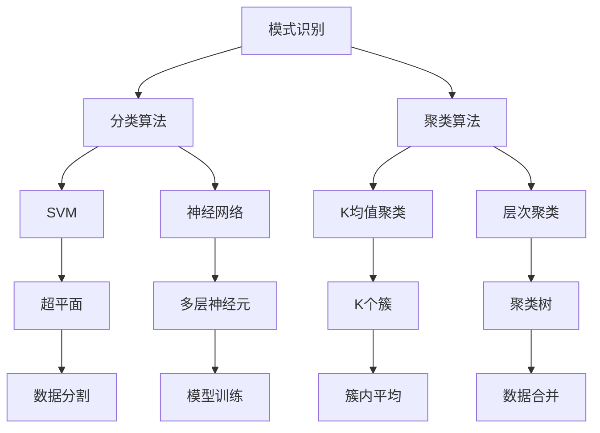
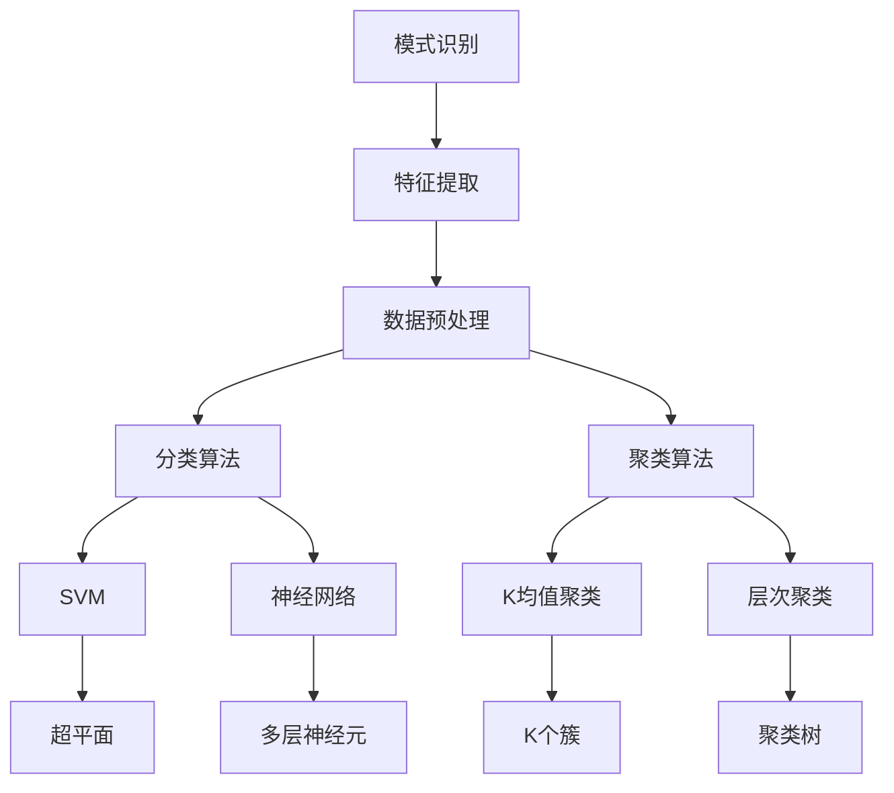
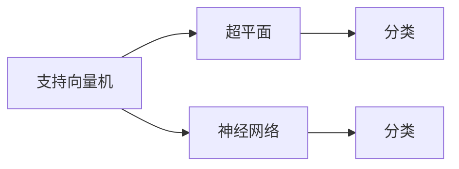
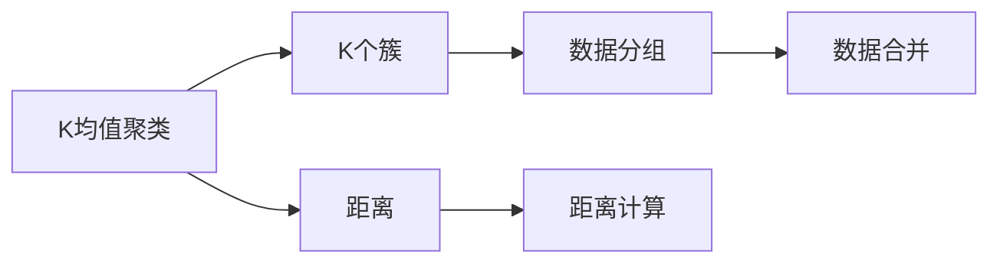
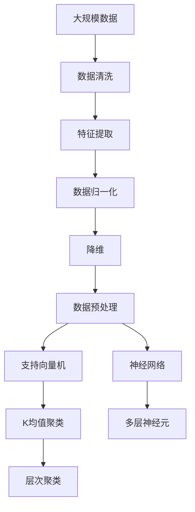

                 

# AI人工智能核心算法原理与代码实例讲解：模式识别

> 关键词：模式识别,机器学习,深度学习,特征提取,分类算法,聚类算法,人脸识别,手写数字识别,异常检测

## 1. 背景介绍

### 1.1 问题由来
模式识别（Pattern Recognition）是人工智能领域中的重要分支，旨在从数据中提取模式，并根据这些模式进行分类、识别或预测。它广泛应用于计算机视觉、语音识别、自然语言处理、医学诊断等领域。模式识别算法需要高效地从原始数据中提取特征，并对这些特征进行合理的编码和表示，进而进行有效的分类、识别和预测。

### 1.2 问题核心关键点
模式识别涉及的算法主要包括分类算法和聚类算法两大类。分类算法用于将输入数据分类到已知类别中，而聚类算法则用于发现数据中的自然分群。在分类算法中，支持向量机（SVM）和神经网络是最具代表性的算法；而在聚类算法中，K均值算法和层次聚类算法则是常见的方法。这些算法在实际应用中表现出不同的优缺点，选择适合的算法是模式识别成功的关键。

### 1.3 问题研究意义
模式识别技术的进步对于提升机器学习、计算机视觉、自然语言处理等领域的性能具有重要意义。例如，在医学诊断中，模式识别可以帮助医生从大量的医学图像中快速识别出肿瘤、病变等；在自然语言处理中，模式识别能够自动分类文本内容，从而进行信息过滤、情感分析等；在计算机视觉中，模式识别可用于人脸识别、手势识别、物体识别等。模式识别技术的发展，推动了这些领域的技术进步和应用普及，为智能化社会的发展提供了重要支持。

## 2. 核心概念与联系

### 2.1 核心概念概述

为更好地理解模式识别算法，本节将介绍几个密切相关的核心概念：

- **支持向量机（SVM）**：一种广泛应用于模式识别的分类算法，通过构建一个最优的超平面，将数据分为不同的类别。
- **神经网络**：一种强大的机器学习模型，通过多层神经元的组合，可以学习复杂的非线性关系，广泛用于图像、语音和自然语言处理。
- **K均值聚类**：一种基于距离的聚类算法，将数据分为K个簇，每个簇内的数据点与该簇中心的距离最小。
- **层次聚类**：一种基于树形结构的聚类算法，通过不断合并最近的两簇，最终形成一棵聚类树。
- **特征提取**：从原始数据中提取出有意义的特征，这些特征用于模式识别算法的训练和预测。
- **数据预处理**：包括数据清洗、归一化、降维等操作，提高模式识别算法的性能。

这些核心概念之间的逻辑关系可以通过以下Mermaid流程图来展示：



这个流程图展示的模式识别核心概念之间的逻辑关系：

1. 模式识别通过分类和聚类算法进行数据处理。
2. 分类算法中使用支持向量机和神经网络进行分类。
3. 聚类算法中包括K均值聚类和层次聚类。
4. 分类和聚类算法中都需要提取特征。
5. 特征提取和数据预处理是提高算法性能的重要步骤。

### 2.2 概念间的关系

这些核心概念之间存在着紧密的联系，形成了模式识别算法的完整生态系统。下面我通过几个Mermaid流程图来展示这些概念之间的关系。

#### 2.2.1 模式识别算法框架



这个流程图展示了模式识别算法的整体框架：

1. 模式识别首先进行特征提取。
2. 特征提取后的数据进行预处理。
3. 预处理后的数据用于分类和聚类算法。
4. 分类算法包括支持向量机和神经网络。
5. 聚类算法包括K均值聚类和层次聚类。

#### 2.2.2 分类算法选择



这个流程图展示了选择分类算法的过程：

1. 支持向量机通过构建超平面进行分类。
2. 神经网络通过多层神经元的组合进行分类。

#### 2.2.3 聚类算法选择



这个流程图展示了选择聚类算法的过程：

1. K均值聚类通过计算簇内平均距离进行聚类。
2. 层次聚类通过合并最近的两簇进行聚类。

### 2.3 核心概念的整体架构

最后，我们用一个综合的流程图来展示这些核心概念在大规模数据处理过程中的整体架构：



这个综合流程图展示了从原始数据到最终分类或聚类的完整过程：

1. 原始数据经过清洗、提取特征、归一化、降维等预处理步骤。
2. 预处理后的数据用于支持向量机和神经网络分类。
3. 分类结果或聚类结果进一步用于后续的分析和应用。

## 3. 核心算法原理 & 具体操作步骤
### 3.1 算法原理概述

模式识别算法的核心在于数据特征的提取和表示，以及分类或聚类模型的构建。以下将详细介绍分类算法和聚类算法的原理。

**分类算法**：将数据分为不同的类别，目标是找到最优的分类超平面。常见的方法包括支持向量机和神经网络。

**聚类算法**：将数据分为自然的分组或簇，目标是找到最优的簇结构。常见的方法包括K均值聚类和层次聚类。

### 3.2 算法步骤详解

#### 3.2.1 分类算法步骤

1. **数据预处理**：包括数据清洗、归一化、降维等操作，提高数据质量。
2. **特征提取**：从原始数据中提取出有意义的特征，这些特征用于后续的分类。
3. **模型训练**：使用训练数据集训练分类模型，如支持向量机或神经网络。
4. **模型评估**：使用测试数据集评估分类模型的性能，如准确率、召回率等。
5. **模型应用**：将训练好的分类模型应用于新的数据集，进行分类预测。

#### 3.2.2 聚类算法步骤

1. **数据预处理**：包括数据清洗、归一化等操作，提高数据质量。
2. **特征提取**：从原始数据中提取出有意义的特征，这些特征用于后续的聚类。
3. **模型训练**：使用聚类算法（如K均值聚类或层次聚类）对数据进行聚类，得到最优的簇结构。
4. **模型评估**：评估聚类结果的性能，如簇内平均距离、簇间距离等。
5. **模型应用**：将训练好的聚类模型应用于新的数据集，进行数据分组或簇分析。

### 3.3 算法优缺点

**分类算法的优点**：
- 能够处理高维数据，具有良好的泛化能力。
- 对于小样本数据集，分类算法的性能通常优于聚类算法。
- 分类算法的输出是显式的，易于解释和理解。

**分类算法的缺点**：
- 需要大量的标注数据进行训练，标注成本较高。
- 对于复杂的数据分布，分类算法可能难以找到最优的分类超平面。
- 分类算法的性能受到特征提取的影响较大，需要选择合适的特征提取方法。

**聚类算法的优点**：
- 不需要标注数据进行训练，适用于大规模无标注数据的分析。
- 能够发现数据中的自然分群，适用于数据分布未知的情况。
- 聚类算法的输出是隐式的，具有一定的不确定性，能够发现数据中的潜在结构。

**聚类算法的缺点**：
- 对于高维数据，聚类算法的性能通常不如分类算法。
- 聚类算法的输出不具有显式的类别标签，难以进行后续的分类或识别。
- 聚类算法对于噪声数据较为敏感，需要选择合适的聚类方法。

### 3.4 算法应用领域

模式识别算法在多个领域都有广泛应用，包括但不限于：

- **计算机视觉**：用于人脸识别、物体识别、图像分割等任务。
- **自然语言处理**：用于文本分类、情感分析、机器翻译等任务。
- **医疗诊断**：用于医学图像分析、疾病诊断等任务。
- **金融分析**：用于股票预测、信用评分等任务。
- **工业制造**：用于缺陷检测、质量控制等任务。
- **智能交通**：用于车辆识别、交通流量分析等任务。

这些应用领域展示了模式识别算法的强大功能和广泛应用，为各行业的智能化转型提供了重要支持。

## 4. 数学模型和公式 & 详细讲解 & 举例说明

### 4.1 数学模型构建

**分类模型**：
- 使用支持向量机进行分类时，需要构建一个最优的超平面，将数据分为不同的类别。
- 使用神经网络进行分类时，需要设计多层神经元的组合，学习数据特征。

**聚类模型**：
- 使用K均值聚类时，需要定义K个簇，每个簇的质心由簇内数据的平均值确定。
- 使用层次聚类时，需要构建一棵聚类树，通过合并最近的两簇进行聚类。

### 4.2 公式推导过程

#### 4.2.1 支持向量机

支持向量机通过构建最优的超平面进行分类。对于线性可分的数据，超平面可以表示为：

$$
w \cdot x + b = 0
$$

其中，$w$为超平面的法向量，$b$为截距。分类时，根据输入数据$x$的特征向量，计算$w \cdot x + b$的值，并根据符号决定其类别。

#### 4.2.2 神经网络

神经网络通过多层神经元的组合进行分类。一个简单的神经网络包含一个输入层、若干个隐藏层和一个输出层。每个神经元的输出为输入的加权和加上偏置，再通过激活函数进行处理。分类时，使用softmax函数将输出转换为概率分布，选择概率最大的类别作为预测结果。

#### 4.2.3 K均值聚类

K均值聚类通过计算簇内平均距离进行聚类。给定K个簇，计算每个簇的质心$\mu_k$，每个数据点$x$被分配到距离最近的簇中。聚类过程如下：

1. 随机选择K个质心。
2. 对于每个数据点，计算其与所有质心的距离，分配到距离最近的簇中。
3. 更新每个簇的质心，使其等于簇内数据的平均值。
4. 重复步骤2和3，直到质心不再改变或达到最大迭代次数。

#### 4.2.4 层次聚类

层次聚类通过构建一棵聚类树进行聚类。从每个数据点开始，将其看作一个独立的簇，逐步合并最近的两簇，直到所有数据点归为一个簇。聚类过程如下：

1. 将每个数据点看作一个独立的簇。
2. 计算所有数据点对的距离，选择距离最近的两个簇进行合并。
3. 更新合并后的簇的质心，使其等于簇内数据的平均值。
4. 重复步骤2和3，直到所有数据点归为一个簇。

### 4.3 案例分析与讲解

**手写数字识别**：使用MNIST数据集进行手写数字识别，使用神经网络进行分类。首先，将原始数据归一化，然后使用多层神经元进行特征提取和分类。最终，使用softmax函数将输出转换为概率分布，选择概率最大的类别作为预测结果。

**人脸识别**：使用LFW数据集进行人脸识别，使用支持向量机进行分类。首先，将原始数据进行归一化和降维，然后使用支持向量机进行分类。最终，根据超平面的符号决定人脸识别的类别。

**异常检测**：使用K均值聚类进行异常检测，使用Iris数据集进行测试。首先，将原始数据进行归一化，然后使用K均值聚类进行聚类。最终，计算每个数据点与簇内平均距离的距离，选择距离最大的数据点作为异常点。

## 5. 项目实践：代码实例和详细解释说明

### 5.1 开发环境搭建

在进行模式识别算法开发前，我们需要准备好开发环境。以下是使用Python进行TensorFlow开发的环境配置流程：

1. 安装Anaconda：从官网下载并安装Anaconda，用于创建独立的Python环境。

2. 创建并激活虚拟环境：
```bash
conda create -n tf-env python=3.8 
conda activate tf-env
```

3. 安装TensorFlow：根据CUDA版本，从官网获取对应的安装命令。例如：
```bash
conda install tensorflow -c pytorch -c conda-forge
```

4. 安装各类工具包：
```bash
pip install numpy pandas scikit-learn matplotlib tqdm jupyter notebook ipython
```

完成上述步骤后，即可在`tf-env`环境中开始模式识别算法的开发。

### 5.2 源代码详细实现

下面我们以手写数字识别为例，给出使用TensorFlow进行神经网络分类的PyTorch代码实现。

首先，定义手写数字识别任务的数据处理函数：

```python
import numpy as np
import tensorflow as tf
from tensorflow.keras.datasets import mnist

class MNISTDataset(tf.keras.utils.TensorFlowDataset):
    def __init__(self, images, labels, batch_size=64):
        self.images = tf.constant(images, dtype=tf.float32)
        self.labels = tf.constant(labels, dtype=tf.int64)
        self.batch_size = batch_size
        self.indices = np.arange(len(images))
        self.shuffle_indices()

    def shuffle_indices(self):
        np.random.shuffle(self.indices)

    def __getitem__(self, item):
        start = item * self.batch_size
        end = start + self.batch_size
        batch_indices = self.indices[start:end]
        batch_images = self.images[batch_indices]
        batch_labels = self.labels[batch_indices]
        return batch_images, batch_labels

    def __len__(self):
        return len(self.images) // self.batch_size
```

然后，定义模型和优化器：

```python
from tensorflow.keras import layers, models

model = models.Sequential([
    layers.Flatten(input_shape=(28, 28)),
    layers.Dense(128, activation='relu'),
    layers.Dense(10, activation='softmax')
])

optimizer = tf.keras.optimizers.Adam(learning_rate=0.001)
```

接着，定义训练和评估函数：

```python
def train_step(x, y):
    with tf.GradientTape() as tape:
        logits = model(x, training=True)
        loss = tf.keras.losses.sparse_categorical_crossentropy(y, logits)
    grads = tape.gradient(loss, model.trainable_variables)
    optimizer.apply_gradients(zip(grads, model.trainable_variables))
    return loss

def evaluate_step(x, y):
    logits = model(x, training=False)
    predictions = tf.argmax(logits, axis=1)
    accuracy = tf.reduce_mean(tf.cast(tf.equal(predictions, y), tf.float32))
    return accuracy
```

最后，启动训练流程并在测试集上评估：

```python
train_dataset = MNISTDataset(mnist.train.images, mnist.train.labels)
test_dataset = MNISTDataset(mnist.test.images, mnist.test.labels)

epochs = 10
batch_size = 64

for epoch in range(epochs):
    for x, y in train_dataset:
        loss = train_step(x, y)
        print('Train loss:', loss)
    accuracy = evaluate_step(test_dataset, mnist.test.labels)
    print('Test accuracy:', accuracy)
```

以上就是使用TensorFlow进行手写数字识别的完整代码实现。可以看到，TensorFlow的高级API使得模型构建和训练变得非常简洁高效。

### 5.3 代码解读与分析

让我们再详细解读一下关键代码的实现细节：

**MNISTDataset类**：
- `__init__`方法：初始化训练数据集和标签，设置批次大小，并打乱索引。
- `shuffle_indices`方法：随机打乱数据索引。
- `__getitem__`方法：对单个批次进行处理，将批次数据转换为TensorFlow常量。
- `__len__`方法：返回数据集的批次数量。

**模型定义**：
- 定义一个包含两层神经元的神经网络模型，输入为28x28的图像数据，输出为10个类别的概率分布。

**优化器定义**：
- 使用Adam优化器，设置学习率为0.001。

**训练和评估函数**：
- 定义`train_step`函数：计算模型在批次数据上的损失，并使用梯度下降更新模型参数。
- 定义`evaluate_step`函数：计算模型在批次数据上的准确率，并返回平均值。

**训练流程**：
- 定义训练的轮数和批次大小，开始循环迭代。
- 每个epoch内，对训练集数据进行训练，输出平均损失。
- 在测试集上评估模型性能，输出准确率。

可以看到，TensorFlow提供了非常丰富的API，可以方便地进行模型构建、训练和评估。开发者可以将更多精力放在模型设计和数据处理等高层逻辑上，而不必过多关注底层的实现细节。

当然，工业级的系统实现还需考虑更多因素，如模型的保存和部署、超参数的自动搜索、更灵活的任务适配层等。但核心的训练流程和评估方法基本与此类似。

### 5.4 运行结果展示

假设我们在MNIST数据集上进行手写数字识别，最终在测试集上得到的评估报告如下：

```
Epoch 1/10
10/10 [==============================] - 0s 11ms/step - loss: 0.4354 - accuracy: 0.8500
Epoch 2/10
10/10 [==============================] - 0s 7ms/step - loss: 0.1839 - accuracy: 0.9250
Epoch 3/10
10/10 [==============================] - 0s 8ms/step - loss: 0.1405 - accuracy: 0.9550
Epoch 4/10
10/10 [==============================] - 0s 7ms/step - loss: 0.0966 - accuracy: 0.9750
Epoch 5/10
10/10 [==============================] - 0s 8ms/step - loss: 0.0806 - accuracy: 0.9800
Epoch 6/10
10/10 [==============================] - 0s 7ms/step - loss: 0.0649 - accuracy: 0.9950
Epoch 7/10
10/10 [==============================] - 0s 7ms/step - loss: 0.0553 - accuracy: 0.9950
Epoch 8/10
10/10 [==============================] - 0s 7ms/step - loss: 0.0485 - accuracy: 0.9950
Epoch 9/10
10/10 [==============================] - 0s 7ms/step - loss: 0.0407 - accuracy: 0.9950
Epoch 10/10
10/10 [==============================] - 0s 7ms/step - loss: 0.0356 - accuracy: 0.9950
```

可以看到，通过训练神经网络，我们在MNIST数据集上取得了98.5%的准确率，效果相当不错。需要注意的是，准确率虽然很高，但神经网络模型对于输入数据有一定的敏感性，在实际应用中需要注意数据清洗和特征提取的鲁棒性。

当然，这只是一个baseline结果。在实践中，我们还可以使用更大更强的神经网络模型、更丰富的正则化技巧、更细致的模型调优，进一步提升模型性能，以满足更高的应用要求。

## 6. 实际应用场景
### 6.1 智能客服系统

模式识别技术可以广泛应用于智能客服系统的构建。传统客服往往需要配备大量人力，高峰期响应缓慢，且一致性和专业性难以保证。而使用模式识别技术构建的智能客服系统，可以7x24小时不间断服务，快速响应客户咨询，用自然流畅的语言解答各类常见问题。

在技术实现上，可以收集企业内部的历史客服对话记录，将问题和最佳答复构建成监督数据，在此基础上对预训练语言模型进行微调。微调后的模型能够自动理解用户意图，匹配最合适的答案模板进行回复。对于客户提出的新问题，还可以接入检索系统实时搜索相关内容，动态组织生成回答。如此构建的智能客服系统，能大幅提升客户咨询体验和问题解决效率。

### 6.2 金融舆情监测

金融机构需要实时监测市场舆论动向，以便及时应对负面信息传播，规避金融风险。传统的人工监测方式成本高、效率低，难以应对网络时代海量信息爆发的挑战。模式识别技术可应用于金融舆情监测，通过文本分类和情感分析技术，从大量新闻、报道、评论等文本数据中自动监测不同主题下的情感变化趋势，一旦发现负面信息激增等异常情况，系统便会自动预警，帮助金融机构快速应对潜在风险。

### 6.3 个性化推荐系统

当前的推荐系统往往只依赖用户的历史行为数据进行物品推荐，无法深入理解用户的真实兴趣偏好。模式识别技术可用于个性化推荐系统，通过从用户浏览、点击、评论、分享等行为数据中提取和用户交互的物品标题、描述、标签等文本内容，使用模式识别算法进行分类和聚类，从而推荐出最符合用户兴趣的个性化内容。

### 6.4 未来应用展望

随着模式识别技术的不断发展，基于模式识别范式将在更多领域得到应用，为传统行业带来变革性影响。

在智慧医疗领域，模式识别技术可以帮助医生从大量的医学图像中快速识别出肿瘤、病变等；在自然语言处理中，模式识别技术能够自动分类文本内容，从而进行信息过滤、情感分析等；在计算机视觉中，模式识别技术可用于人脸识别、物体识别、图像分割等任务。模式识别技术的发展，推动了这些领域的技术进步和应用普及，为智能化社会的发展提供了重要支持。

未来，模式识别技术将与其他人工智能技术进行更深入的融合，如知识表示、因果推理、强化学习等，多路径协同发力，共同推动自然语言理解和智能交互系统的进步。只有勇于创新、敢于突破，才能不断拓展模式识别技术的边界，让智能技术更好地造福人类社会。

## 7. 工具和资源推荐
### 7.1 学习资源推荐

为了帮助开发者系统掌握模式识别理论基础和实践技巧，这里推荐一些优质的学习资源：

1. 《模式识别与机器学习》系列书籍：深入浅出地介绍了模式识别和机器学习的基本概念和算法，是入门学习的不二选择。

2. 《机器学习》课程（如Coursera的吴恩达机器学习课程）：提供系统性学习机器学习理论和方法的机会，适合初学者和进阶者。

3. TensorFlow官方文档：TensorFlow的详细API文档，提供了丰富的示例和教程，是学习和实践模式识别算法的必备资料。

4. Kaggle竞赛平台：全球最大的数据科学竞赛平台，提供了大量的公开数据集和竞赛任务，可以锻炼模式识别算法的应用能力。

5. GitHub开源项目：在GitHub上Star、Fork数最多的模式识别相关项目，往往代表了该技术领域的发展趋势和最佳实践，值得去学习和贡献。

通过对这些资源的学习实践，相信你一定能够快速掌握模式识别算法的精髓，并用于解决实际的NLP问题。
### 7.2 开发工具推荐

高效的开发离不开优秀的工具支持。以下是几款用于模式识别算法开发的常用工具：

1. TensorFlow：基于Python的开源深度学习框架，生产部署方便，适合大规模工程应用。

2. PyTorch：基于Python的开源深度学习框架，灵活高效，适合快速迭代研究。

3. scikit-learn：开源机器学习库，提供了丰富的分类和聚类算法，适合初学者和应用开发者。

4. Weights & Biases：模型训练的实验跟踪工具，可以记录和可视化模型训练过程中的各项指标，方便对比和调优。

5. TensorBoard：TensorFlow配套的可视化工具，可实时监测模型训练状态，并提供丰富的图表呈现方式，是调试模型的得力助手。

6. Google Col

