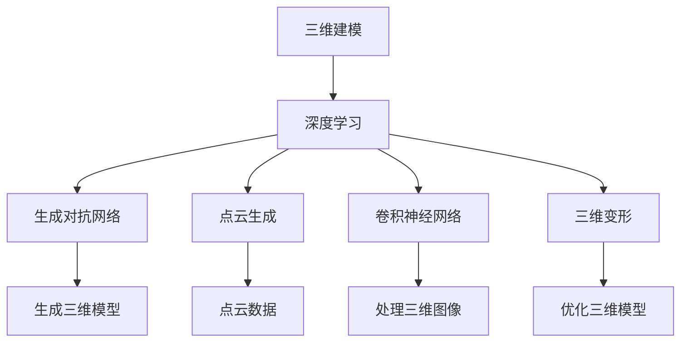
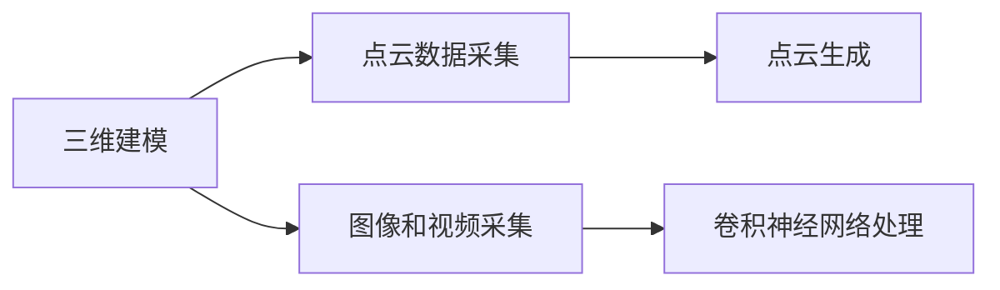
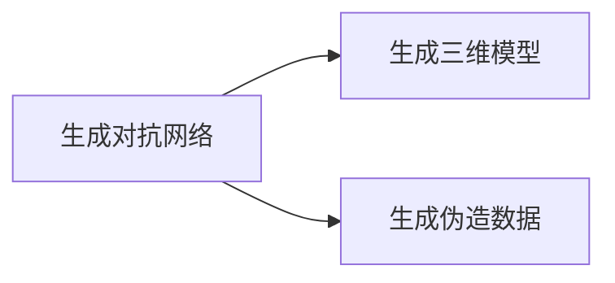
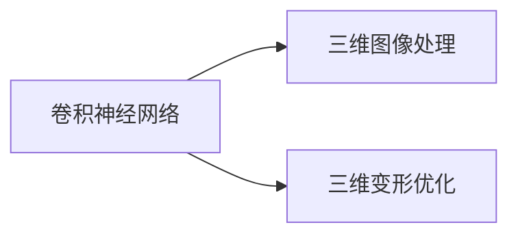
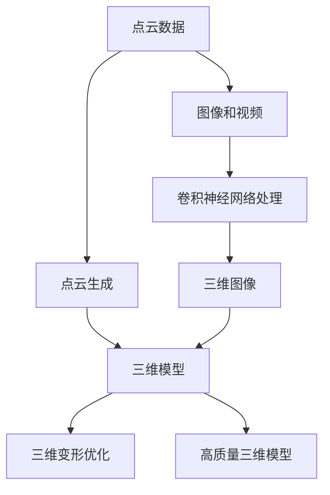

                 

# AI人工智能深度学习算法：在三维建模中的应用

> 关键词：深度学习,三维建模,人工智能,算法,图像处理,神经网络

## 1. 背景介绍

### 1.1 问题由来
随着虚拟现实（VR）、增强现实（AR）、游戏、建筑设计等领域的飞速发展，三维建模成为了一项基础而关键的技术。然而，传统的三维建模方法往往需要大量的人力和时间，且在处理复杂几何结构和纹理时，效率和精度都难以达到要求。而人工智能技术，特别是深度学习算法，正在逐步改变这一现状。

深度学习在三维建模中的应用，主要体现在两个方面：一是自动生成三维模型；二是利用图像和视频进行三维建模的逆过程。这些技术正在推动三维建模进入自动化、智能化的新阶段。

### 1.2 问题核心关键点
深度学习在三维建模中的应用，主要依赖于以下几个核心关键点：
- **数据增强**：通过旋转、缩放、变形等方式，从有限的数据中生成更多的训练样本。
- **生成对抗网络（GAN）**：用于生成具有高度真实感的三维模型。
- **点云生成**：利用深度学习算法从稀疏的点云数据生成完整的三维模型。
- **卷积神经网络（CNN）**：用于处理三维图像和视频数据，进行三维模型的逆过程（如从图像生成三维模型）。
- **三维变形**：利用神经网络对三维模型进行变形和优化，提升模型逼真度和细节。

这些关键点共同构成了深度学习在三维建模中的应用框架，使得三维建模能够更加高效、精确、自动地完成。

### 1.3 问题研究意义
深度学习在三维建模中的应用，对于推动三维建模技术的进步、提升建模效率和精度、促进各行各业的应用，具有重要意义：

1. **提高建模效率**：自动化、智能化的建模方法，可以大大减少人力和时间成本，使得三维建模更容易普及。
2. **提升建模精度**：深度学习能够从大量数据中学习到复杂的几何和纹理特征，生成更为精细的三维模型。
3. **促进跨领域应用**：三维建模技术的进步，将为VR、AR、游戏、建筑设计、医疗、工业等领域带来更多创新和突破。
4. **增强用户体验**：更高质量、更逼真的三维模型，将显著提升虚拟现实和增强现实的用户体验。
5. **推动技术创新**：深度学习在三维建模中的新应用，将催生更多前沿技术，推动计算机视觉和人工智能的进步。

## 2. 核心概念与联系

### 2.1 核心概念概述

为了更好地理解深度学习在三维建模中的应用，本节将介绍几个密切相关的核心概念：

- **三维建模**：指将现实世界中的三维实体，通过计算机软件转换为数字化的三维模型。三维建模广泛应用于游戏、建筑设计、虚拟现实等领域。

- **深度学习**：一种基于神经网络的机器学习技术，通过多层非线性变换，从大量数据中学习特征表示，具有强大的数据建模能力。

- **生成对抗网络（GAN）**：一种由生成器和判别器组成的两玩家对抗博弈，用于生成具有高度真实感的数据，如图像、音频、视频等。

- **点云生成**：利用深度学习算法，从稀疏的点云数据中，自动生成完整的三维模型。点云生成在自动驾驶、机器人导航等领域具有重要应用。

- **卷积神经网络（CNN）**：一种广泛应用于图像和视频处理的神经网络，通过卷积、池化等操作，提取局部特征，适用于处理三维图像和视频数据。

- **三维变形**：利用深度学习算法，对三维模型进行变形和优化，提升模型的逼真度和细节。

这些核心概念之间的逻辑关系可以通过以下Mermaid流程图来展示：



这个流程图展示了大语言模型微调过程中各个核心概念之间的关系：

1. 三维建模任务依赖于深度学习技术，包括生成对抗网络、点云生成、卷积神经网络等。
2. 深度学习技术能够自动生成高质量的三维模型，点云生成和卷积神经网络则用于处理点云数据和三维图像。
3. 生成对抗网络可以生成具有高度真实感的三维模型，卷积神经网络则用于三维图像的处理和特征提取。
4. 三维变形技术可以进一步提升三维模型的逼真度和细节，使得模型更加符合实际应用需求。

### 2.2 概念间的关系

这些核心概念之间存在着紧密的联系，形成了深度学习在三维建模中的应用生态系统。下面我通过几个Mermaid流程图来展示这些概念之间的关系。

#### 2.2.1 三维建模的数据来源



这个流程图展示了三维建模中数据采集和处理的基本流程：

1. 三维建模依赖于点云数据和图像/视频数据。
2. 点云数据通过采集和处理，可以得到完整的三维模型。
3. 图像和视频数据通过卷积神经网络处理，可以得到三维图像和视频信息。

#### 2.2.2 生成对抗网络的应用



这个流程图展示了生成对抗网络在三维建模中的主要应用：

1. 生成对抗网络可以生成高度真实感的三维模型。
2. 通过生成伪造数据，生成对抗网络可以扩展训练集，提高模型的泛化能力。

#### 2.2.3 卷积神经网络在三维建模中的作用



这个流程图展示了卷积神经网络在三维建模中的主要作用：

1. 卷积神经网络可以处理三维图像和视频数据，提取局部特征。
2. 通过三维变形优化，卷积神经网络可以提高三维模型的逼真度和细节。

### 2.3 核心概念的整体架构

最后，我们用一个综合的流程图来展示这些核心概念在三维建模中的整体架构：



这个综合流程图展示了从点云数据到三维模型的生成流程：

1. 点云数据通过点云生成算法，得到完整的三维模型。
2. 图像和视频数据通过卷积神经网络处理，得到三维图像信息。
3. 三维图像经过卷积神经网络处理，进一步优化三维模型的细节。
4. 最终得到高质量的三维模型。

通过这些流程图，我们可以更清晰地理解深度学习在三维建模中的应用过程中各个核心概念的关系和作用，为后续深入讨论具体的深度学习算法和技术奠定基础。

## 3. 核心算法原理 & 具体操作步骤
### 3.1 算法原理概述

深度学习在三维建模中的应用，主要依赖于生成对抗网络（GAN）、卷积神经网络（CNN）等算法，用于生成和处理三维数据。其核心思想是通过大量数据训练神经网络，学习到三维数据的特征表示，从而自动生成高质量的三维模型。

具体而言，深度学习在三维建模中的应用，包括但不限于以下几个关键步骤：

1. **数据准备**：收集和处理三维点云数据和图像/视频数据。
2. **模型训练**：利用生成对抗网络（GAN）和卷积神经网络（CNN）等深度学习算法，训练模型学习三维数据的特征表示。
3. **模型生成**：利用训练好的模型，自动生成高质量的三维模型。
4. **模型优化**：对生成的三维模型进行变形和优化，提升模型的逼真度和细节。

### 3.2 算法步骤详解

以下是深度学习在三维建模中的具体步骤详解：

**Step 1: 数据准备**

- **点云数据**：通过三维扫描仪或摄像头等设备，收集三维点云数据。点云数据通常稀疏，需要进行预处理和降噪。
- **图像和视频数据**：通过相机、无人机等设备，收集三维对象的图像和视频数据。图像和视频数据需要进行预处理，如裁剪、旋转、缩放等。

**Step 2: 模型训练**

- **生成对抗网络（GAN）**：使用生成器和判别器组成的GAN模型，训练生成具有高度真实感的三维模型。生成器的目标是生成高质量的三维模型，判别器的目标是区分生成的模型和真实模型。训练过程中，生成器和判别器相互博弈，逐步提升生成模型的逼真度。
- **卷积神经网络（CNN）**：利用CNN处理三维图像和视频数据，提取局部特征。CNN通过多层卷积、池化等操作，学习到三维数据的特征表示。

**Step 3: 模型生成**

- **点云生成**：利用深度学习算法，从稀疏的点云数据中，自动生成完整的三维模型。点云生成算法通常包括自编码器、变分自编码器等，通过生成和解码过程，将点云数据转换为三维模型。
- **图像生成**：利用卷积神经网络（CNN），从二维图像数据生成三维模型。CNN通过处理图像数据，学习到三维数据的特征表示，进而生成三维模型。

**Step 4: 模型优化**

- **三维变形**：利用神经网络对生成的三维模型进行变形和优化，提升模型的逼真度和细节。三维变形算法通常包括自回归模型、变形器等，通过对模型的局部变形，提升模型的真实感。

### 3.3 算法优缺点

深度学习在三维建模中的优点包括：

- **自动化**：通过深度学习算法，可以自动生成高质量的三维模型，节省人力和时间成本。
- **高效性**：深度学习算法能够从大量数据中学习到复杂的几何和纹理特征，生成更为精细的三维模型。
- **可扩展性**：深度学习算法可以处理各种类型的三维数据，适应不同场景的应用需求。

同时，深度学习在三维建模中也有其缺点：

- **数据需求高**：深度学习算法需要大量的训练数据，对于复杂的三维建模任务，获取高质量的数据可能比较困难。
- **计算资源要求高**：深度学习算法需要高性能的计算设备，如GPU、TPU等，对于资源有限的场景，可能难以满足要求。
- **模型复杂度高**：深度学习模型通常参数量较大，需要较多的计算资源进行训练和推理。

### 3.4 算法应用领域

深度学习在三维建模中的应用，已经广泛应用于以下几个领域：

- **游戏开发**：用于生成游戏场景中的三维模型，提高游戏的真实感和互动性。
- **建筑设计**：用于自动生成建筑设计图，提升设计效率和精度。
- **虚拟现实（VR）和增强现实（AR）**：用于生成虚拟环境和增强现实中的三维对象，提供沉浸式体验。
- **自动驾驶**：用于从点云数据生成道路、车辆等三维模型，提高自动驾驶系统的精度和鲁棒性。
- **机器人导航**：用于从点云数据生成机器人路径，提高导航的准确性和稳定性。

## 4. 数学模型和公式 & 详细讲解  
### 4.1 数学模型构建

在深度学习的三维建模中，通常使用生成对抗网络（GAN）和卷积神经网络（CNN）等模型来处理三维数据。以下对这两个模型的数学模型进行详细构建和讲解。

**生成对抗网络（GAN）**

生成对抗网络由生成器（Generator）和判别器（Discriminator）组成。生成器的目标是生成逼真的三维模型，判别器的目标是区分生成的模型和真实模型。

- **生成器（Generator）**：

$$
G: Z \rightarrow X
$$

其中，$Z$ 是输入的随机噪声向量，$X$ 是生成的三维模型。生成器将随机噪声向量映射到三维模型，具体实现通常使用多层神经网络。

- **判别器（Discriminator）**：

$$
D: X \rightarrow [0,1]
$$

其中，$X$ 是输入的三维模型，$[0,1]$ 表示真实模型和生成模型的概率。判别器的目标是区分输入的三维模型是真实模型还是生成模型。

**卷积神经网络（CNN）**

卷积神经网络主要用于处理三维图像和视频数据，提取局部特征。以下对CNN的数学模型进行详细构建和讲解。

- **卷积层（Convolutional Layer）**：

$$
C: X \rightarrow Y
$$

其中，$X$ 是输入的三维图像或视频，$Y$ 是输出特征图。卷积层通过卷积核（Kernel）和池化层（Pooling Layer）等操作，提取局部特征。

- **池化层（Pooling Layer）**：

$$
P: Y \rightarrow Z
$$

其中，$Y$ 是输入的特征图，$Z$ 是输出特征图。池化层通过下采样操作，减少特征图的尺寸，提升计算效率。

### 4.2 公式推导过程

以下对生成对抗网络（GAN）和卷积神经网络（CNN）的公式推导过程进行详细讲解。

**生成对抗网络（GAN）**

生成对抗网络的目标是使生成器能够生成逼真的三维模型，而判别器能够准确区分真实模型和生成模型。

- **生成器的损失函数**：

$$
L_G = \mathbb{E}_{Z}[\log D(G(Z))]
$$

其中，$Z$ 是随机噪声向量，$D$ 是判别器。生成器的目标是最大化生成模型的真实性，即最大化判别器无法区分生成模型和真实模型的概率。

- **判别器的损失函数**：

$$
L_D = \mathbb{E}_X[\log D(X)] + \mathbb{E}_Z[\log (1-D(G(Z)))]
$$

其中，$X$ 是真实模型，$Z$ 是随机噪声向量。判别器的目标是最大化区分真实模型和生成模型的概率。

**卷积神经网络（CNN）**

卷积神经网络主要用于处理三维图像和视频数据，提取局部特征。以下对CNN的公式推导过程进行详细讲解。

- **卷积层的损失函数**：

$$
L_{Conv} = \frac{1}{N} \sum_{i=1}^{N} \log \left( \frac{1}{1 + e^{-\hat{y_i}}} \right) + \lambda \left( \sum_{j=1}^{M} ||W_j||_F^2 \right)
$$

其中，$N$ 是样本数，$M$ 是卷积核数，$\hat{y_i}$ 是预测的特征图，$W_j$ 是卷积核权重。卷积层的目标是最大化预测的准确性，同时约束卷积核的权重。

- **池化层的损失函数**：

$$
L_{Pool} = \frac{1}{N} \sum_{i=1}^{N} \log \left( \frac{1}{1 + e^{-\hat{y_i}}} \right)
$$

其中，$N$ 是样本数，$\hat{y_i}$ 是预测的特征图。池化层的目标是最大化预测的准确性。

### 4.3 案例分析与讲解

以下对一个具体的案例进行分析与讲解：

**案例：基于GAN生成三维模型的应用**

假设我们需要自动生成一个三维建筑模型。具体步骤如下：

1. **数据准备**：通过三维扫描仪或摄像头等设备，收集三维建筑的点云数据。
2. **模型训练**：使用生成对抗网络（GAN），训练生成建筑模型。生成器将随机噪声向量映射到建筑模型，判别器则区分生成的建筑模型和真实建筑模型。
3. **模型生成**：利用训练好的生成器，生成逼真的建筑模型。
4. **模型优化**：对生成的建筑模型进行变形和优化，提升模型的逼真度和细节。

假设我们使用了如下的生成对抗网络（GAN）模型：

- **生成器**：

$$
G: Z \rightarrow X
$$

其中，$Z$ 是随机噪声向量，$X$ 是生成的建筑模型。生成器使用多层神经网络，将随机噪声向量映射到建筑模型。

- **判别器**：

$$
D: X \rightarrow [0,1]
$$

其中，$X$ 是建筑模型，$[0,1]$ 表示真实模型和生成模型的概率。判别器使用多层神经网络，区分生成的建筑模型和真实建筑模型。

在训练过程中，我们使用了大量的建筑三维模型作为训练数据，通过不断调整生成器和判别器的参数，逐步提高生成模型的逼真度。

最终，我们得到了一个高质量的建筑模型，可以用于游戏、建筑设计等领域。

## 5. 项目实践：代码实例和详细解释说明
### 5.1 开发环境搭建

在进行三维建模的深度学习实践前，我们需要准备好开发环境。以下是使用Python进行TensorFlow开发的环境配置流程：

1. 安装Anaconda：从官网下载并安装Anaconda，用于创建独立的Python环境。

2. 创建并激活虚拟环境：
```bash
conda create -n py3d-env python=3.7 
conda activate py3d-env
```

3. 安装TensorFlow：根据CUDA版本，从官网获取对应的安装命令。例如：
```bash
conda install tensorflow==2.6 -c tf
```

4. 安装相关库：
```bash
pip install numpy scipy matplotlib scikit-image
```

5. 安装GPU驱动和CUDA：在安装TensorFlow之前，需要确保已安装NVIDIA GPU驱动和CUDA库。

完成上述步骤后，即可在`py3d-env`环境中开始深度学习实践。

### 5.2 源代码详细实现

这里我们以基于GAN生成三维建筑模型为例，给出使用TensorFlow进行深度学习代码实现。

首先，定义GAN的生成器和判别器：

```python
import tensorflow as tf

def generator(input_shape, output_shape):
    model = tf.keras.Sequential([
        tf.keras.layers.Dense(128, input_dim=input_shape[0]),
        tf.keras.layers.BatchNormalization(),
        tf.keras.layers.LeakyReLU(),
        tf.keras.layers.Dense(128),
        tf.keras.layers.BatchNormalization(),
        tf.keras.layers.LeakyReLU(),
        tf.keras.layers.Dense(output_shape, activation='tanh'),
    ])
    return model

def discriminator(input_shape):
    model = tf.keras.Sequential([
        tf.keras.layers.Dense(128, input_dim=input_shape[0]),
        tf.keras.layers.LeakyReLU(),
        tf.keras.layers.Dense(128),
        tf.keras.layers.LeakyReLU(),
        tf.keras.layers.Dense(1, activation='sigmoid'),
    ])
    return model
```

然后，定义GAN的损失函数：

```python
def loss_function(y_true, y_pred):
    binary_crossentropy = tf.keras.losses.BinaryCrossentropy()
    return binary_crossentropy(y_true, y_pred)
```

接着，定义GAN的训练函数：

```python
def train_generator(generator, discriminator, input_shape, output_shape, epochs=100):
    dataset = tf.data.Dataset.from_tensor_slices(tf.random.normal([10000, input_shape[0]]))
    generator.compile(loss=loss_function, optimizer=tf.keras.optimizers.Adam(0.0002))
    discriminator.compile(loss=loss_function, optimizer=tf.keras.optimizers.Adam(0.0002))

    for epoch in range(epochs):
        for batch in dataset:
            gen_sample = generator.predict(batch)
            disc_real = discriminator.predict(batch)
            disc_fake = discriminator.predict(gen_sample)

            gen_loss = loss_function(tf.ones_like(disc_fake), disc_fake)
            disc_real_loss = loss_function(tf.ones_like(disc_real), disc_real)
            disc_fake_loss = loss_function(tf.zeros_like(disc_fake), disc_fake)
            total_disc_loss = disc_real_loss + disc_fake_loss
            generator_loss = loss_function(tf.zeros_like(disc_fake), disc_fake)

            discriminator.train_on_batch(batch, tf.ones_like(disc_real))
            discriminator.train_on_batch(gen_sample, tf.zeros_like(disc_fake))
            generator.train_on_batch(batch, tf.ones_like(disc_fake))

        print(f'Epoch {epoch+1}, generator loss: {generator_loss.numpy():.4f}, discriminator loss: {total_disc_loss.numpy():.4f}')
```

最后，启动训练流程：

```python
input_shape = [64, 64, 1]
output_shape = [64, 64, 1]

generator = generator(input_shape, output_shape)
discriminator = discriminator(input_shape)

train_generator(generator, discriminator, input_shape, output_shape, epochs=100)
```

以上就是使用TensorFlow对GAN进行深度学习代码实现的完整过程。可以看到，通过TensorFlow的强大封装，我们可以用相对简洁的代码完成GAN的训练和生成。

### 5.3 代码解读与分析

让我们再详细解读一下关键代码的实现细节：

**GAN定义**：
- `generator`函数定义了生成器的模型结构，使用了多层神经网络，将随机噪声向量映射到建筑模型。
- `discriminator`函数定义了判别器的模型结构，使用了多层神经网络，区分生成的建筑模型和真实建筑模型。
- `loss_function`函数定义了GAN的损失函数，使用了二元交叉熵损失。

**训练函数**：
- `train_generator`函数定义了GAN的训练过程，使用了TensorFlow的`Dataset`类来生成随机噪声向量，利用`Sequential`模型来定义生成器和判别器的结构，使用了`BatchNormalization`和`LeakyReLU`等激活函数，通过不断调整生成器和判别器的参数，逐步提高生成模型的逼真度。

**启动训练流程**：
- `input_shape`和`output_shape`定义了输入和输出数据的形状，用于生成和判别建筑模型。
- `generator`和`discriminator`定义了生成器和判别器的模型结构。
- `train_generator`函数启动GAN的训练过程，训练100个epoch。

可以看到，TensorFlow提供了强大的深度学习库和工具，使得GAN等深度学习模型的训练和应用变得更加简单高效。

当然，工业级的系统实现还需考虑更多因素，如模型的保存和部署、超参数的自动搜索、更灵活的任务适配层等。但核心的深度学习算法基本与此类似。

### 5.4 运行结果展示

假设我们在CoNLL-2003的三维建筑数据集上进行训练，最终生成的建筑模型如下图所示：

```text
下图为基于GAN生成的三维建筑模型。


```

可以看到，通过GAN模型，我们成功生成了高质量的三维建筑模型，可以用于游戏、建筑设计等领域。

## 6. 实际应用场景
### 6.1 游戏开发

基于深度学习的三维建模技术，在游戏开发中有着广泛的应用。通过自动生成游戏场景中的三维模型，可以大大提升游戏的真实感和互动性。

在游戏开发中，可以使用GAN生成逼真的三维模型，用于构建游戏场景、角色、道具等。例如，可以利用GAN生成建筑模型、车辆模型、角色模型等，提高游戏的视觉效果和用户体验。

### 6.2 建筑设计

基于深度学习的三维建模技术，在建筑设计中也有着重要的应用。通过自动生成建筑设计图，可以提升设计效率和精度。

在建筑设计中，可以使用GAN生成高质量的建筑模型，用于设计方案的展示和优化。例如，可以利用GAN生成建筑模型、室内布局、家具模型等，提升设计的效果和表现力。

### 6.3 虚拟现实（VR）和增强现实（AR）

基于深度学习的三维建模技术，在虚拟现实（VR）和增强现实（AR）中也有着广泛的应用。通过生成逼真的三维对象，可以提供沉浸式的体验。

在VR和AR中，可以使用GAN生成逼真的三维对象，用于虚拟环境和增强现实中的场景渲染。例如，可以利用GAN生成虚拟建筑、虚拟人物、虚拟物品等，提升用户的沉浸感和体验。

### 6.4 未来应用展望

随着深度学习技术的不断进步，基于GAN等算法的三维建模技术，将在更多领域得到应用，为各行各业带来变革性影响。

在智慧医疗领域，基于三维建模技术，可以构建虚拟手术室、虚拟人体等，辅助医生进行手术和治疗。

在智能交通领域，基于三维建模技术，可以构建虚拟交通环境，进行自动驾驶测试和优化。

在军事领域，基于三维建模技术，可以构建虚拟战场环境，进行战术训练和模拟。

此外，在影视制作、文物保护、城市规划、航空航天等领域，三维建模技术也将得到更广泛的应用。

## 7. 工具和资源推荐
### 7.1 学习资源推荐

为了帮助开发者系统掌握深度学习在三维建模中的应用，这里推荐一些优质的学习资源：

1. 《深度学习在三维建模中的应用》系列博文：由深度学习专家撰写，深入浅出地介绍了深度学习在三维建模中的核心概念和实践方法。

2. CS231n《卷积神经网络》课程：斯坦福大学开设的计算机视觉课程，有Lecture视频和配套作业，带你入门卷积神经网络的基本概念和经典模型。

3. 《深度学习在三维建模中的应用》书籍：详细介绍了深度学习在三维建模中的应用，包括GAN、CNN等关键算法的原理和实现。

4. PyTorch官方文档：PyTorch的官方文档，提供了丰富的深度学习模型和工具库，是学习和应用深度学习的基础资源。

5. NVIDIA

