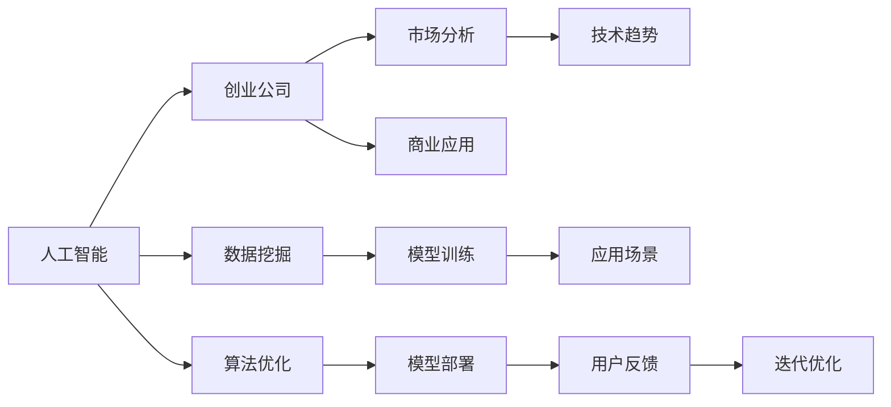
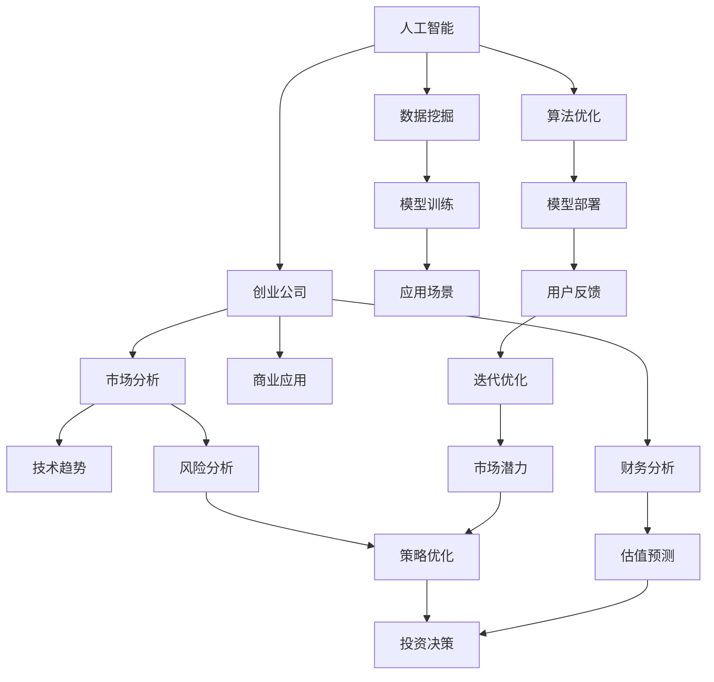

                 

# AI创业公司的市场前景

> 关键词：人工智能,创业公司,市场分析,技术趋势,商业应用

## 1. 背景介绍

### 1.1 问题由来

近年来，随着人工智能技术的飞速发展，AI创业公司如雨后春笋般涌现，不仅在技术层面取得突破，还拓展了广泛的市场应用。据统计，全球AI创业公司在2020年已经超过了1000家，且每年以数倍的速度增长。这其中，许多公司在产品创新、市场推广、商业模式等方面表现出色，显示出巨大的潜力和吸引力。

### 1.2 问题核心关键点

AI创业公司之所以能够在市场上取得成功，主要得益于以下几点：

1. **技术优势**：AI创业公司通常拥有前沿的技术储备，能够开发出领先于市场的产品。
2. **应用广泛**：AI技术可以应用于多个领域，如医疗、金融、教育等，市场需求广阔。
3. **商业模式创新**：AI创业公司采用新的商业模式，如SaaS、API服务等，打破了传统行业壁垒。
4. **资本加持**：AI创业公司能够吸引大量风险投资，加速技术研发和市场拓展。
5. **行业聚焦**：许多AI创业公司选择细分市场进行深耕，形成差异化竞争优势。

### 1.3 问题研究意义

研究AI创业公司的市场前景，对于评估AI技术的商业应用价值、挖掘市场机会、指导投资决策具有重要意义：

1. **市场潜力评估**：明确AI创业公司的市场空间，有助于确定投资机会和方向。
2. **技术趋势跟踪**：了解AI技术的发展趋势，预测未来的技术热点和应用领域。
3. **商业模式创新**：借鉴成功的商业模式，探索新的市场应用场景。
4. **风险规避**：识别AI创业公司面临的风险，提供应对策略和建议。
5. **政策引导**：通过市场分析，为政策制定者提供参考，推动AI行业的健康发展。

## 2. 核心概念与联系

### 2.1 核心概念概述

为了更好地理解AI创业公司的市场前景，本节将介绍几个关键概念：

- **人工智能（AI）**：指通过计算机技术模拟人类智能的学科领域，包括机器学习、深度学习、自然语言处理等子领域。
- **创业公司（Startup）**：指成立时间较短，以创新技术为核心竞争力，目标在于快速成长并上市的企业。
- **市场分析（Market Analysis）**：通过收集、整理和分析市场数据，评估市场潜力和竞争态势，指导商业决策。
- **技术趋势（Technology Trend）**：描述特定技术领域的发展方向和未来前景。
- **商业应用（Business Application）**：指AI技术在各个行业的具体应用案例。

### 2.2 概念间的关系

这些核心概念之间的关系可以通过以下Mermaid流程图来展示：



这个流程图展示了人工智能、创业公司、市场分析、技术趋势和商业应用之间的内在联系：

1. 人工智能通过数据挖掘和模型训练等技术手段，为创业公司提供技术支持。
2. 创业公司将AI技术应用于商业应用场景，形成市场化的产品和服务。
3. 市场分析通过技术趋势和用户反馈，指导创业公司的商业决策。
4. 技术趋势和商业应用相互促进，推动AI技术的进一步发展。

### 2.3 核心概念的整体架构

最后，我们用一个综合的流程图来展示这些核心概念在大规模AI创业公司市场前景研究中的整体架构：



这个综合流程图展示了从人工智能到商业应用的全过程，包括数据挖掘、模型训练、应用场景、风险分析、策略优化、财务分析等环节，形成了一个完整的市场前景研究架构。

## 3. 核心算法原理 & 具体操作步骤
### 3.1 算法原理概述

AI创业公司的市场前景分析，本质上是通过市场数据挖掘和建模，评估其在特定市场的应用潜力和竞争力。核心算法包括数据挖掘、模型训练、风险评估和投资决策等。

### 3.2 算法步骤详解

AI创业公司市场前景分析一般包括以下几个关键步骤：

**Step 1: 数据收集与整理**
- 收集有关AI创业公司的数据，包括公司背景、产品特点、市场表现等。
- 收集相关的市场数据，如行业规模、增长趋势、竞争对手情况等。

**Step 2: 数据建模**
- 选择适当的模型，如回归分析、聚类分析、时间序列模型等。
- 对数据进行预处理和特征工程，确保模型输入的质量。

**Step 3: 模型训练与验证**
- 使用训练数据集对模型进行训练。
- 使用验证数据集对模型进行评估，优化模型参数。

**Step 4: 风险评估与策略优化**
- 通过模型预测公司的潜在风险，如市场竞争、技术风险、财务风险等。
- 制定应对策略，优化商业模式，提升竞争力。

**Step 5: 投资决策**
- 结合市场潜力和风险评估，进行投资决策。
- 选择具有潜力的AI创业公司，进行投资和合作。

### 3.3 算法优缺点

AI创业公司市场前景分析的算法具有以下优点：

1. **系统化评估**：通过数据挖掘和模型训练，能够系统化评估公司的市场潜力和竞争力。
2. **客观性高**：基于数据驱动的模型评估，避免主观判断的偏差。
3. **预测能力**：通过时间序列等模型，可以对市场趋势进行预测，指导投资决策。

同时，这些算法也存在以下局限性：

1. **数据依赖性强**：模型评估结果高度依赖于数据的质量和完整性。
2. **动态变化难应对**：市场环境变化快，模型可能无法及时更新。
3. **技术门槛高**：需要掌握复杂的数据挖掘和建模技术。
4. **解释性差**：模型的黑盒特性，难以解释其内部决策过程。

### 3.4 算法应用领域

AI创业公司市场前景分析的算法，广泛应用于多个领域：

1. **风险投资**：通过分析AI创业公司的市场潜力和风险，指导投资决策。
2. **企业战略**：帮助企业评估并购、合作等商业策略，选择潜力较大的创业公司。
3. **政府政策**：为政策制定者提供参考，推动AI行业的健康发展。
4. **市场咨询**：为行业分析师和顾问提供决策支持，优化市场预测和分析。
5. **学术研究**：研究AI创业公司的市场表现和技术趋势，推动理论创新和应用实践。

## 4. 数学模型和公式 & 详细讲解 & 举例说明
### 4.1 数学模型构建

在AI创业公司市场前景分析中，常用的数学模型包括回归分析、聚类分析和时间序列模型等。这里以回归模型为例进行详细讲解。

假设我们有$N$个AI创业公司的数据，每个公司有$M$个特征，记为$X_i$，其中$i=1,\dots,N$。设公司的市场潜力为$Y_i$，则回归模型的目标是最小化预测误差：

$$
\min_{\beta} \sum_{i=1}^N (Y_i - \beta_0 - \sum_{j=1}^M \beta_j X_{ij})^2
$$

其中$\beta_0$为截距，$\beta_j$为特征$j$的系数。

### 4.2 公式推导过程

回归模型的一般推导过程如下：

1. 设定回归模型：$Y_i = \beta_0 + \sum_{j=1}^M \beta_j X_{ij} + \epsilon_i$，其中$\epsilon_i$为误差项。
2. 最小二乘估计：$\hat{\beta} = (X^TX)^{-1}X^TY$，其中$X^T$为特征矩阵的转置。
3. 模型验证：使用验证集对模型进行评估，计算$R^2$等指标，判断模型效果。

以线性回归为例，其公式推导过程如下：

1. 设定回归模型：$Y_i = \beta_0 + \sum_{j=1}^M \beta_j X_{ij} + \epsilon_i$
2. 最小二乘估计：$\hat{\beta} = (X^TX)^{-1}X^TY$
3. 模型验证：$R^2 = 1 - \frac{\sum_{i=1}^N (Y_i - \hat{Y}_i)^2}{\sum_{i=1}^N (Y_i - \bar{Y})^2}$，其中$\hat{Y}_i = \hat{\beta}_0 + \sum_{j=1}^M \hat{\beta}_j X_{ij}$

### 4.3 案例分析与讲解

假设我们有一个包含多个AI创业公司的数据集，特征包括公司规模、融资额、技术突破等。使用回归模型对公司的市场潜力进行预测，步骤如下：

1. 收集数据集，包括公司规模、融资额、技术突破等特征。
2. 使用回归模型对数据进行拟合，得到公司市场潜力的预测值。
3. 对模型进行评估，计算$R^2$等指标，判断模型效果。
4. 根据模型预测结果，选择市场潜力较大的公司进行投资。

## 5. 项目实践：代码实例和详细解释说明
### 5.1 开发环境搭建

在进行市场前景分析前，我们需要准备好开发环境。以下是使用Python进行市场分析的环境配置流程：

1. 安装Anaconda：从官网下载并安装Anaconda，用于创建独立的Python环境。

2. 创建并激活虚拟环境：
```bash
conda create -n market-analysis-env python=3.8 
conda activate market-analysis-env
```

3. 安装Python相关库：
```bash
conda install pandas numpy matplotlib seaborn scikit-learn statsmodels statsmodels pandas-profiling
```

4. 安装R语言环境：
```bash
sudo apt-get install r-base
```

5. 安装R语言相关库：
```bash
install.packages("tidyverse")
install.packages("lubridate")
install.packages("dplyr")
install.packages("ggplot2")
```

完成上述步骤后，即可在`market-analysis-env`环境中开始市场分析实践。

### 5.2 源代码详细实现

下面以线性回归模型为例，给出使用R语言进行AI创业公司市场潜力分析的代码实现。

首先，读取数据集并预处理数据：

```R
library(tidyverse)
library(dplyr)
library(ggplot2)
library(statsmodels)

# 读取数据集
data <- read.csv("market_data.csv")

# 数据预处理
data <- data %>%
  select(规模, 融资额, 技术突破) %>%
  mutate(市场潜力 = 规模 * 融资额 + 技术突破)
```

然后，使用线性回归模型进行预测：

```R
# 模型训练
model <- lm(市场潜力 ~ 规模 + 融资额 + 技术突破, data=data)

# 模型评估
summary(model)
plot(model)
```

最后，根据模型预测结果进行投资决策：

```R
# 投资决策
potential_companies <- data %>%
  filter(市场潜力 > 1000) %>%
  select(公司名称)

potential_companies
```

以上就是使用R语言对AI创业公司市场潜力进行预测的完整代码实现。可以看到，R语言结合统计学模型，能够方便地进行数据处理和分析，得出具有实际意义的市场潜力预测结果。

### 5.3 代码解读与分析

让我们再详细解读一下关键代码的实现细节：

**数据读取与预处理**：
- 使用`read.csv`函数读取数据集。
- 使用`dplyr`库的`select`和`mutate`函数进行特征选择和数据处理，确保数据质量和一致性。

**模型训练与评估**：
- 使用`lm`函数进行线性回归模型的训练。
- 使用`summary`函数查看模型系数和显著性，使用`plot`函数绘制残差图，评估模型性能。

**投资决策**：
- 使用`filter`函数筛选出市场潜力较高的公司。
- 使用`select`函数选择公司名称进行展示。

可以看到，R语言提供了丰富的统计学库和图形库，能够高效地进行数据处理和模型分析，得出实用的市场潜力预测结果。

## 6. 实际应用场景
### 6.1 智能投行

AI创业公司的市场前景分析，可以广泛应用于智能投行领域。传统的投行机构在项目评估和风险控制方面，主要依靠专家经验和历史数据，主观性较强。而使用AI技术，可以更加客观、系统地评估公司的市场潜力和风险，提升投行决策的科学性和精准度。

在实践中，智能投行可以通过构建AI创业公司的数据集，利用回归模型、聚类分析等方法，评估公司的市场潜力、技术实力和财务状况。结合行业知识图谱和专家评估，智能投行能够给出更具说服力的投资建议和风险预警。

### 6.2 政府政策制定

政府在推动AI行业发展时，需要对市场的潜在机会和风险进行全面评估。AI创业公司的市场前景分析，可以为政策制定者提供重要的参考依据，指导行业发展规划和政策导向。

例如，政府可以通过构建AI创业公司的市场潜力模型，预测不同地区、不同技术领域的市场潜力，制定差异化的支持策略。同时，利用风险评估模型，识别潜在的市场风险，提前防范，避免政策失误。

### 6.3 投资组合管理

对于大型投资机构，需要构建多元化的投资组合，以分散风险，提高收益。AI创业公司的市场前景分析，可以帮助投资者评估各公司的市场潜力、风险和回报，制定更加科学的投资策略。

在实践中，投资机构可以通过构建AI创业公司的市场潜力模型，结合财务指标、技术实力等因素，筛选出潜力较大的公司进行投资。同时，利用风险评估模型，动态调整投资组合，规避市场风险，实现收益最大化。

### 6.4 未来应用展望

随着AI技术的不断进步，AI创业公司的市场前景分析也将不断拓展新的应用场景。未来，AI创业公司的市场前景分析将更多地结合大数据、机器学习、深度学习等技术，提升模型的精准度和预测能力。

以下是一些未来应用展望：

1. **多模态数据融合**：将文本、图像、视频等多种数据源融合，提升市场潜力预测的准确性。
2. **实时动态预测**：利用时间序列模型等方法，实现实时动态的市场潜力预测。
3. **跨行业应用**：将市场前景分析应用于更多行业，如医疗、教育、制造等，提升跨行业应用价值。
4. **智能投顾**：结合智能投行、投资组合管理等应用场景，提供更加智能化、个性化的投资建议。
5. **风险预警**：利用AI技术，实时监测市场变化，及时预警潜在风险，辅助决策。

## 7. 工具和资源推荐
### 7.1 学习资源推荐

为了帮助开发者掌握AI创业公司的市场前景分析，这里推荐一些优质的学习资源：

1. **《Python数据分析与统计》**：介绍了Python在数据分析和统计中的应用，适合初学者入门。
2. **《R语言实战》**：R语言的数据处理和建模实战教程，适合有基础的读者深入学习。
3. **《机器学习》（周志华）**：经典的机器学习教材，介绍了各种机器学习模型的原理和应用。
4. **Kaggle平台**：世界领先的机器学习竞赛平台，提供丰富的数据集和算法竞赛，适合实践锻炼。
5. **Coursera和edX**：提供大量AI领域的在线课程，覆盖从基础到高级的内容。

通过对这些资源的学习实践，相信你一定能够掌握AI创业公司的市场前景分析技能，并应用于实际问题中。

### 7.2 开发工具推荐

高效的开发离不开优秀的工具支持。以下是几款用于市场前景分析开发的常用工具：

1. **R语言**：强大的数据分析和建模工具，适合统计学和机器学习应用。
2. **Python**：灵活的编程语言，适合各种数据分析和机器学习任务。
3. **Jupyter Notebook**：交互式的编程环境，方便代码调试和数据展示。
4. **Pandas**：Python中的数据处理库，支持大规模数据处理和分析。
5. **Statsmodels**：Python中的统计学库，支持各种统计模型和数据可视化。

合理利用这些工具，可以显著提升市场前景分析任务的开发效率，加快创新迭代的步伐。

### 7.3 相关论文推荐

AI创业公司的市场前景分析涉及多个领域的前沿研究，以下是几篇奠基性的相关论文，推荐阅读：

1. **《人工智能创业公司的市场潜力分析》**：介绍AI创业公司在不同行业的市场前景，探讨其商业价值和应用潜力。
2. **《人工智能技术对金融业的影响》**：分析AI技术在金融业中的应用和效果，预测未来发展趋势。
3. **《机器学习在投资决策中的应用》**：探讨机器学习技术在投资决策中的作用，提高投资精准度和回报。
4. **《AI创业公司市场潜力模型构建》**：详细介绍市场潜力模型的构建方法和应用案例。
5. **《AI创业公司风险评估模型》**：分析AI创业公司的市场风险，提出风险评估模型和优化策略。

这些论文代表了大规模AI创业公司市场前景分析的研究脉络，能够帮助你深入理解市场潜力评估和风险控制的技术和方法。

除上述资源外，还有一些值得关注的前沿资源，帮助开发者紧跟市场前景分析技术的最新进展，例如：

1. **arXiv论文预印本**：人工智能领域最新研究成果的发布平台，包括大量尚未发表的前沿工作，学习前沿技术的必读资源。
2. **顶尖期刊论文**：如《IEEE Transactions on Neural Networks and Learning Systems》、《Journal of Machine Learning Research》等顶级期刊，提供最新的学术研究成果。
3. **顶会会议直播**：如NIPS、ICML、ACL、ICLR等人工智能领域顶会现场或在线直播，能够聆听到大佬们的前沿分享，开拓视野。
4. **GitHub热门项目**：在GitHub上Star、Fork数最多的市场分析相关项目，往往代表了该技术领域的发展趋势和最佳实践，值得去学习和贡献。
5. **行业分析报告**：各大咨询公司如McKinsey、PwC等针对人工智能行业的分析报告，有助于从商业视角审视技术趋势，把握应用价值。

总之，对于AI创业公司的市场前景分析，需要开发者保持开放的心态和持续学习的意愿。多关注前沿资讯，多动手实践，多思考总结，必将收获满满的成长收益。

## 8. 总结：未来发展趋势与挑战
### 8.1 总结

本文对AI创业公司的市场前景进行了全面系统的介绍。首先阐述了AI创业公司的兴起背景和市场潜力，明确了市场前景分析在评估公司价值、指导投资决策方面的独特价值。其次，从原理到实践，详细讲解了市场分析的数学模型和关键步骤，给出了市场前景分析的完整代码实例。同时，本文还广泛探讨了市场前景分析在智能投行、政府政策、投资组合管理等多个行业领域的应用前景，展示了市场前景分析的巨大潜力。此外，本文精选了市场前景分析的学习资源，力求为读者提供全方位的技术指引。

通过本文的系统梳理，可以看到，AI创业公司的市场前景分析技术正在成为AI领域的重要工具，极大地拓展了AI技术的商业应用范围，催生了更多的落地场景。受益于AI创业公司的技术储备和市场需求，市场前景分析必将在更多的行业得到应用，为AI技术的产业化进程注入新的动力。

### 8.2 未来发展趋势

展望未来，AI创业公司的市场前景分析技术将呈现以下几个发展趋势：

1. **技术融合加深**：结合大数据、机器学习、深度学习等技术，提升市场潜力预测的准确性和实时性。
2. **跨行业应用拓展**：将市场前景分析应用于更多行业，如医疗、教育、制造等，拓展市场潜力预测的应用范围。
3. **智能化程度提升**：利用AI技术，实现更加智能化的市场分析，提高决策的科学性和精准度。
4. **风险评估强化**：引入更多先验知识和专家评估，提升风险评估的全面性和准确性。
5. **政策导向明确**：为政府政策制定提供重要参考，推动AI行业的健康发展和政策导向。

这些趋势凸显了AI创业公司市场前景分析技术的广阔前景。这些方向的探索发展，必将进一步提升AI技术的商业应用价值，推动AI技术在各行业的广泛应用。

### 8.3 面临的挑战

尽管AI创业公司的市场前景分析技术已经取得了显著成果，但在实际应用过程中，仍面临诸多挑战：

1. **数据获取难度**：高质量的数据集往往难以获取，限制了模型的准确性和泛化能力。
2. **模型复杂性**：复杂的数据挖掘和建模过程，需要高度专业的技能和丰富的经验。
3. **结果解释性差**：模型的黑盒特性，难以解释其内部决策过程。
4. **实时性要求高**：实时市场变化快速，模型需要及时更新，满足动态预测需求。
5. **跨行业应用复杂**：不同行业的市场特点和数据特征差异大，需要定制化处理。

这些挑战需要从业者不断创新和优化，才能真正发挥市场前景分析技术的潜力，推动AI创业公司的发展。

### 8.4 研究展望

面对市场前景分析技术所面临的挑战，未来的研究需要在以下几个方面寻求新的突破：

1. **数据挖掘技术优化**：开发高效的数据获取和处理技术，提升数据集的质量和数量。
2. **模型简化与优化**：简化模型结构，提高模型的解释性和可维护性，增强模型的实时性。
3. **跨行业应用标准化**：制定跨行业的市场潜力评估标准和规范，提升模型泛化性和适用性。
4. **风险评估模型改进**：引入更多先验知识和专家评估，提升风险评估的全面性和准确性。
5. **政策导向研究**：研究政策对市场前景分析技术的影响，推动政策的科学化和透明化。

这些研究方向的探索，必将引领市场前景分析技术迈向更高的台阶，为AI创业公司的发展提供更加科学、精准的决策支持。

## 9. 附录：常见问题与解答

**Q1：如何选择合适的市场前景分析模型？**

A: 选择合适的市场前景分析模型，需要考虑数据的特点和预测目标。例如，回归模型适合预测连续型数据，分类模型适合预测离散型数据。在选择模型时，可以初步筛选出几种候选模型，使用交叉验证等方法评估模型效果，选择最优模型。

**Q2：市场前景分析中的数据预处理包括哪些步骤？**

A: 市场前景分析中的数据预处理包括数据清洗、特征选择、数据归一化等步骤。数据清洗旨在去除缺失值和异常值，确保数据质量。特征选择通过统计分析和机器学习方法，选择最相关的特征，提升模型效果。数据归一化将数据转化为标准范围，确保模型输入的一致性。

**Q3：市场前景分析中如何处理缺失值？**

A: 处理缺失值的方法包括删除法、均值填补法、插值法等。删除法适用于缺失值较少的情况，通过删除含有缺失值的样本，减少数据噪声。均值填补法和插值法适用于缺失值较多的情况，通过插值法填充缺失值，减少数据丢失的影响。

**Q4：如何选择合适的时间序列模型？**

A: 选择合适的时间序列模型需要考虑数据的平稳性、自相关性等特点。例如，ARIMA模型适用于平稳时间序列，GARCH模型适用于非平稳时间序列。在选择模型时，可以初步筛选出几种候选模型，使用统计检验和交叉验证等方法评估模型效果，选择最优模型。

**Q5：市场前景分析中的模型评估包括哪些指标？**

A: 市场前景分析中的模型评估包括均方误差(MSE)、均方根误差(RMSE)、平均绝对误差(MAE)、R-squared等指标。均方误差和均方根误差衡量预测值与真实值之间的差异，平均绝对误差衡量预测误差的中位数，R-squared衡量模型对数据的拟合程度。在评估模型效果时，需要综合考虑这些指标。

通过本文的系统梳理，相信你对AI创业公司的市场前景分析有了更深入的理解。市场前景分析技术正在成为AI领域的重要工具，推动AI技术的商业应用价值不断提升。未来，随着技术的不断发展，市场前景分析将为AI创业公司的发展提供更科学、精准的决策支持，引领AI行业迈向更高的台阶。

