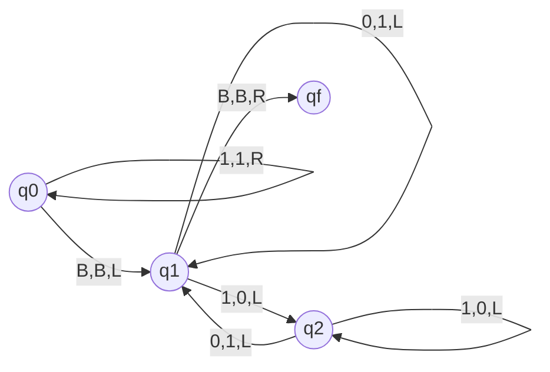

# 计算：第一部分 计算的诞生

作者：禅与计算机程序设计艺术 / Zen and the Art of Computer Programming

## 1. 背景介绍
### 1.1 问题的由来
计算是人类文明进步的重要推动力之一。从古代的算盘到现代的计算机，人类一直在不断探索更高效、更精确的计算方法。计算的发展历程反映了人类智慧的进步，也深刻影响着社会的方方面面。

### 1.2 研究现状
目前，计算已经渗透到科学、工程、商业、艺术等各个领域。现代计算机的出现极大地提高了计算效率，推动了人工智能、大数据、云计算等前沿技术的发展。同时，计算理论也在不断深化，图灵机、λ演算等计算模型为计算机科学奠定了坚实的理论基础。

### 1.3 研究意义
深入研究计算的起源与发展，有助于我们更好地理解计算的本质，把握计算技术的发展脉络，探索计算的未来趋势。这不仅具有重要的理论意义，也对计算机科学与技术的发展具有重要的指导作用。

### 1.4 本文结构
本文将从以下几个方面探讨计算的诞生：
- 核心概念与联系
- 核心算法原理与具体操作步骤
- 数学模型和公式详细讲解与举例说明
- 项目实践：代码实例和详细解释说明
- 实际应用场景
- 工具和资源推荐
- 未来发展趋势与挑战
- 常见问题与解答

## 2. 核心概念与联系
计算的核心概念包括：
- 信息：计算的对象，可以是数字、符号、图像等各种形式的数据。
- 算法：对信息进行处理和操作的具体步骤和规则。
- 计算模型：对计算过程的抽象和形式化描述，如图灵机、λ演算等。
- 计算复杂度：衡量算法效率的重要指标，反映了算法的时间和空间开销。
- 可计算性：判断一个问题是否可以通过算法解决。

这些概念之间紧密关联，共同构成了计算理论的基础。信息是计算的原料，算法是实现计算的方法，计算模型为算法提供了理论框架，计算复杂度和可计算性则反映了计算的效率和限制。

## 3. 核心算法原理 & 具体操作步骤
### 3.1 算法原理概述
算法是计算的灵魂，它定义了对信息进行处理和操作的具体步骤。一个好的算法应该具备正确性、可读性、健壮性、高效性等特点。算法设计需要考虑问题的输入、输出、约束条件等因素，通过抽象、分解、递归、迭代等方法，将复杂问题转化为可计算的步骤。

### 3.2 算法步骤详解
以经典的二分查找算法为例，其具体步骤如下：
1. 将待查找的目标值 target 与有序数组的中间元素 mid 进行比较。
2. 如果 target == mid，则找到目标值，算法结束。
3. 如果 target < mid，则在数组左半部分继续查找。
4. 如果 target > mid，则在数组右半部分继续查找。
5. 重复步骤 1-4，直到找到目标值或确定目标值不存在。

### 3.3 算法优缺点
二分查找算法的优点是效率高，时间复杂度为 $O(\log n)$。但它要求数组必须是有序的，否则无法正确工作。同时，对于小规模数据，二分查找的优势并不明显。

### 3.4 算法应用领域
二分查找广泛应用于各种需要快速查找的场景，如在有序数组、数据库索引、文件目录等中查找特定元素。很多高级算法如二叉搜索树、哈希表的设计也借鉴了二分查找的思想。

## 4. 数学模型和公式 & 详细讲解 & 举例说明
### 4.1 数学模型构建
图灵机是计算理论中最重要的数学模型之一。一个图灵机可以表示为一个七元组：
$$M = (Q, \Sigma, \Gamma, \delta, q_0, B, F)$$
其中：
- $Q$ 是有限状态集合
- $\Sigma$ 是输入符号集合
- $\Gamma$ 是磁带符号集合，$\Sigma \subseteq \Gamma$
- $\delta$ 是状态转移函数
- $q_0 \in Q$ 是初始状态
- $B \in \Gamma - \Sigma$ 是空白符
- $F \subseteq Q$ 是终止状态集合

### 4.2 公式推导过程
图灵机的状态转移函数 $\delta$ 可以表示为：
$$\delta: Q \times \Gamma \rightarrow Q \times \Gamma \times \{L, R\}$$
其中 $L$ 表示磁头向左移动，$R$ 表示磁头向右移动。给定当前状态和磁头所指符号，$\delta$ 函数决定图灵机的下一状态、磁头写入的符号以及磁头移动方向。

### 4.3 案例分析与讲解
以一个简单的二进制加法图灵机为例，其状态转移图如下：



该图灵机从左到右扫描两个用 B 隔开的二进制数，逐位相加并将结果写回磁带。当磁头返回起点并读到空白符 B 时，计算结束。

### 4.4 常见问题解答
- Q: 图灵机能计算哪些函数？
- A: 图灵机能够计算所有图灵可计算的函数，即算法可以解决的问题。

- Q: 图灵机的计算能力与现代计算机相比如何？
- A: 图灵机是一种理论模型，它的计算能力与现代计算机等价。任何可以用算法解决的问题都可以通过图灵机计算。

## 5. 项目实践：代码实例和详细解释说明
### 5.1 开发环境搭建
本节将使用 Python 语言实现一个简单的二分查找算法。首先需要安装 Python 开发环境，可以从官网下载适合自己操作系统的 Python 版本。

### 5.2 源代码详细实现
```python
def binary_search(arr, target):
    left, right = 0, len(arr) - 1

    while left <= right:
        mid = (left + right) // 2
        if arr[mid] == target:
            return mid
        elif arr[mid] < target:
            left = mid + 1
        else:
            right = mid - 1

    return -1
```

### 5.3 代码解读与分析
- 函数 `binary_search` 接受两个参数：有序数组 `arr` 和目标值 `target`。
- 初始化左右指针 `left` 和 `right`，分别指向数组的起点和终点。
- 当 `left <= right` 时，进入循环：
  - 计算中点位置 `mid`。
  - 如果 `arr[mid] == target`，找到目标值，返回其下标。
  - 如果 `arr[mid] < target`，说明目标值在右半部分，将 `left` 更新为 `mid + 1`。
  - 如果 `arr[mid] > target`，说明目标值在左半部分，将 `right` 更新为 `mid - 1`。
- 如果循环结束还没有找到目标值，说明目标值不存在，返回 -1。

### 5.4 运行结果展示
测试代码：
```python
arr = [1, 3, 5, 7, 9, 11, 13, 15]
print(binary_search(arr, 7))  # 输出 3
print(binary_search(arr, 4))  # 输出 -1
```

运行结果：
```
3
-1
```

## 6. 实际应用场景
计算无处不在，从科学研究到工程设计，从商业决策到日常生活，计算的应用领域十分广泛。
- 在科学研究中，计算机模拟和数值计算已经成为研究的重要手段，如分子动力学模拟、天气预报等。
- 在工程设计中，计算机辅助设计 (CAD) 和计算机辅助制造 (CAM) 极大地提高了设计和生产效率。
- 在商业领域，大数据分析、推荐系统等技术都离不开高效的计算。
- 在日常生活中，智能手机、导航系统、数字助理等设备背后也都依赖于复杂的计算。

### 6.4 未来应用展望
随着计算能力的不断提升和算法的持续创新，计算技术必将在更多领域发挥重要作用。人工智能、量子计算、生物信息学等前沿领域都对计算提出了新的挑战和机遇。未来，计算将与各个行业深度融合，推动生产力的跨越式发展。

## 7. 工具和资源推荐
### 7.1 学习资源推荐
- 《算法导论》：算法领域的经典教材，全面系统地介绍了各种算法设计和分析技术。
- 《计算机程序的构造和解释》：计算机科学的入门教材，深入探讨了计算的本质和编程的艺术。
- Coursera 上的算法课程：如普林斯顿大学的 Algorithms 课程，讲解深入浅出，配有编程作业。

### 7.2 开发工具推荐
- Python：简单易学且功能强大的编程语言，适合算法原型的快速实现和验证。
- C++：高效的系统级语言，常用于对性能要求较高的算法实现。
- MATLAB：科学计算和数值分析的利器，提供了丰富的数学库函数。

### 7.3 相关论文推荐
- Turing, A. M. (1937). On computable numbers, with an application to the Entscheidungsproblem. Proceedings of the London mathematical society, 2(1), 230-265.
- Knuth, D. E. (1997). The art of computer programming (Vol. 3). Pearson Education.
- Cormen, T. H., Leiserson, C. E., Rivest, R. L., & Stein, C. (2009). Introduction to algorithms. MIT press.

### 7.4 其他资源推荐
- GitHub：全球最大的开源社区，可以找到大量优秀的算法实现和学习资源。
- Stack Overflow：程序员的问答社区，可以快速获得算法实现中遇到的问题的解答。
- LeetCode：在线编程练习平台，提供了大量算法题目，可以用于练手和面试准备。

## 8. 总结：未来发展趋势与挑战
### 8.1 研究成果总结
本文系统地探讨了计算的起源与发展，从核心概念出发，详细讲解了算法原理和数学模型，并通过代码实例和实际应用场景，展示了计算在各个领域的重要作用。计算理论为计算机科学奠定了坚实的理论基础，推动了计算技术的飞速发展。

### 8.2 未来发展趋势
未来，计算技术将向以下方向发展：
- 人工智能：机器学习、深度学习等技术将使计算机具备更强的感知、理解和决策能力。
- 量子计算：利用量子力学原理进行计算，有望在密码学、优化等领域取得重大突破。
- 生物信息学：利用计算方法分析生物大数据，推动精准医疗和药物开发。
- 云计算和边缘计算：通过分布式计算架构，提供更高效、更智能的计算服务。

### 8.3 面临的挑战
计算技术的发展也面临着诸多挑战：
- 算法的可解释性：随着算法复杂度的提高，如何让算法变得更加透明和可解释成为一大挑战。
- 数据的安全与隐私：在数据驱动的时代，如何保护个人隐私和数据安全是亟待解决的问题。
- 计算资源的优化配置：如何在有限的计算资源下，最大化计算性能和效率，需要更智能的调度算法。
- 人才培养：培养高素质的计算机科学人才，需要教育体