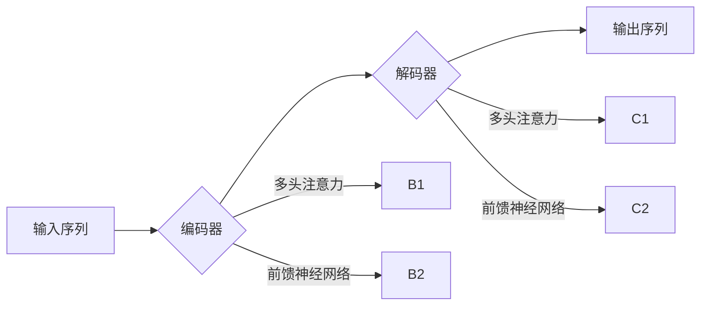

## Transformer大模型实战 Transformer 概览

> 关键词：Transformer, 大模型, 自然语言处理, 机器翻译, 文本生成, 注意力机制,  BERT, GPT

### 1. 背景介绍

近年来，深度学习在人工智能领域取得了突破性进展，其中自然语言处理 (NLP) 领域尤为突出。传统的基于循环神经网络 (RNN) 的模型在处理长文本序列时存在效率低下和梯度消失等问题。为了解决这些问题，谷歌于 2017 年提出了 Transformer 模型，并通过在机器翻译任务上的出色表现迅速引起了业界关注。

Transformer 模型的核心创新在于引入了**注意力机制**，它能够有效地捕捉文本序列中不同词之间的依赖关系，从而实现更准确、更有效的文本理解和生成。由于其强大的性能和灵活的架构，Transformer 模型在各种 NLP 任务中取得了显著的成果，例如机器翻译、文本摘要、问答系统、文本分类等。

随着深度学习技术的不断发展，Transformer 模型也得到了进一步的改进和扩展。例如，BERT、GPT 等大型语言模型都是基于 Transformer 架构构建的，它们拥有数十亿甚至数百亿的参数，能够处理更复杂的任务，并展现出更强大的语言理解和生成能力。

### 2. 核心概念与联系

Transformer 模型的核心概念包括：

* **注意力机制 (Attention Mechanism):**  注意力机制是 Transformer 模型的核心创新，它允许模型关注输入序列中与当前任务最相关的部分，从而提高模型的准确性和效率。
* **编码器-解码器结构 (Encoder-Decoder Structure):** Transformer 模型采用编码器-解码器结构，其中编码器负责将输入序列编码成上下文表示，解码器则根据编码后的表示生成输出序列。
* **多头注意力 (Multi-Head Attention):** 多头注意力机制通过并行执行多个注意力头，能够捕捉不同层次的语义信息，从而提高模型的表达能力。
* **前馈神经网络 (Feed-Forward Network):**  前馈神经网络用于对编码器和解码器中的每个隐藏状态进行非线性变换，从而进一步丰富模型的表达能力。

**Transformer 模型架构流程图:**



### 3. 核心算法原理 & 具体操作步骤

#### 3.1  算法原理概述

Transformer 模型的核心算法是**注意力机制**。注意力机制允许模型在处理文本序列时，根据每个词语的语义和上下文关系，分配不同的权重，从而更加关注重要的信息。

#### 3.2  算法步骤详解

1. **计算查询 (Query)、键 (Key) 和值 (Value) 向量:**  对于每个词语，将其嵌入到一个向量空间中，并分别计算出查询向量、键向量和值向量。
2. **计算注意力分数:**  使用查询向量和键向量的点积计算注意力分数，表示每个词语对当前词语的 relevance。
3. **归一化注意力分数:**  对注意力分数进行 softmax 操作，将其转换为概率分布，表示每个词语对当前词语的关注程度。
4. **计算加权和:**  使用注意力概率分布对值向量进行加权和，得到上下文表示。

#### 3.3  算法优缺点

**优点:**

* 能够有效地捕捉文本序列中不同词之间的依赖关系。
* 训练速度更快，并能处理更长的文本序列。
* 具有较强的泛化能力，能够应用于多种 NLP 任务。

**缺点:**

* 计算复杂度较高，需要大量的计算资源。
* 对训练数据要求较高，需要大量的标注数据进行训练。

#### 3.4  算法应用领域

注意力机制在 NLP 领域有着广泛的应用，例如：

* **机器翻译:**  捕捉源语言和目标语言之间的语义关系，提高翻译质量。
* **文本摘要:**  识别文本中最关键的信息，生成简洁的摘要。
* **问答系统:**  理解问题和上下文，找到最合适的答案。
* **文本分类:**  根据文本内容进行分类，例如情感分析、主题分类等。

### 4. 数学模型和公式 & 详细讲解 & 举例说明

#### 4.1  数学模型构建

Transformer 模型的数学模型主要包括以下几个部分:

* **词嵌入 (Word Embedding):** 将每个词语映射到一个低维向量空间中，表示词语的语义信息。
* **多头注意力 (Multi-Head Attention):**  通过并行执行多个注意力头，捕捉不同层次的语义信息。
* **前馈神经网络 (Feed-Forward Network):** 对每个隐藏状态进行非线性变换，进一步丰富模型的表达能力。

#### 4.2  公式推导过程

**注意力机制公式:**

$$
Attention(Q, K, V) = softmax(\frac{QK^T}{\sqrt{d_k}})V
$$

其中:

* $Q$：查询向量
* $K$：键向量
* $V$：值向量
* $d_k$：键向量的维度
* $softmax$：softmax 函数

**多头注意力公式:**

$$
MultiHead(Q, K, V) = Concat(head_1, head_2,..., head_h)W^O
$$

其中:

* $head_i$：第 $i$ 个注意力头的输出
* $h$：注意力头的数量
* $W^O$：最终输出层的权重矩阵

#### 4.3  案例分析与讲解

假设我们有一个句子 "The cat sat on the mat"，我们想要计算 "sat" 这个词语对整个句子的注意力分数。

1. 将每个词语嵌入到一个向量空间中，得到查询向量、键向量和值向量。
2. 计算 "sat" 的查询向量与所有词语的键向量的点积，得到注意力分数。
3. 对注意力分数进行 softmax 操作，将其转换为概率分布。
4. 使用概率分布对所有词语的值向量进行加权和，得到 "sat" 对整个句子的上下文表示。

### 5. 项目实践：代码实例和详细解释说明

#### 5.1  开发环境搭建

* Python 3.6+
* PyTorch 或 TensorFlow
* CUDA 和 cuDNN (可选，用于 GPU 加速)

#### 5.2  源代码详细实现

```python
import torch
import torch.nn as nn

class MultiHeadAttention(nn.Module):
    def __init__(self, embed_dim, num_heads):
        super(MultiHeadAttention, self).__init__()
        self.embed_dim = embed_dim
        self.num_heads = num_heads
        self.head_dim = embed_dim // num_heads

        assert self.head_dim * num_heads == embed_dim, "Embed dim must be divisible by num_heads"

        self.query = nn.Linear(embed_dim, embed_dim)
        self.key = nn.Linear(embed_dim, embed_dim)
        self.value = nn.Linear(embed_dim, embed_dim)
        self.fc_out = nn.Linear(embed_dim, embed_dim)

    def forward(self, query, key, value, mask=None):
        batch_size = query.size(0)

        # Linear projections
        Q = self.query(query).view(batch_size, -1, self.num_heads, self.head_dim).transpose(1, 2)
        K = self.key(key).view(batch_size, -1, self.num_heads, self.head_dim).transpose(1, 2)
        V = self.value(value).view(batch_size, -1, self.num_heads, self.head_dim).transpose(1, 2)

        # Scaled dot-product attention
        scores = torch.matmul(Q, K.transpose(-2, -1)) / torch.sqrt(torch.tensor(self.head_dim, dtype=torch.float))
        if mask is not None:
            scores = scores.masked_fill(mask == 0, -1e9)
        attention = torch.softmax(scores, dim=-1)

        # Weighted sum of values
        context = torch.matmul(attention, V)

        # Concatenate heads and project
        context = context.transpose(1, 2).contiguous().view(batch_size, -1, self.embed_dim)
        output = self.fc_out(context)

        return output
```

#### 5.3  代码解读与分析

* `MultiHeadAttention` 类定义了多头注意力机制。
* `__init__` 方法初始化模型参数，包括嵌入维度、注意力头数量等。
* `forward` 方法实现多头注意力的计算过程，包括线性投影、缩放点积注意力、加权和、拼接头和最终投影等步骤。

#### 5.4  运行结果展示

运行上述代码可以实现多头注意力的计算，并输出上下文表示。

### 6. 实际应用场景

Transformer 模型在各种 NLP 任务中都有着广泛的应用，例如：

* **机器翻译:**  Google Translate 使用 Transformer 模型实现机器翻译，显著提高了翻译质量。
* **文本摘要:**  BART 和 T5 等模型使用 Transformer 架构进行文本摘要，能够生成简洁准确的摘要。
* **问答系统:**  BERT 和 XLNet 等模型使用 Transformer 架构进行问答系统，能够理解问题和上下文，找到最合适的答案。
* **文本分类:**  RoBERTa 和 DistilBERT 等模型使用 Transformer 架构进行文本分类，能够准确地识别文本的类别。

### 6.4  未来应用展望

Transformer 模型在未来将继续在 NLP 领域发挥重要作用，并拓展到其他领域，例如：

* **代码生成:**  使用 Transformer 模型生成代码，提高软件开发效率。
* **图像理解:**  将 Transformer 架构应用于图像理解任务，例如图像分类、目标检测等。
* **语音识别:**  使用 Transformer 模型进行语音识别，提高识别准确率。

### 7. 工具和资源推荐

#### 7.1  学习资源推荐

* **论文:**  "Attention Is All You Need" (Vaswani et al., 2017)
* **博客:**  Jay Alammar's Blog (https://jalammar.github.io/illustrated-transformer/)
* **课程:**  Stanford CS224N: Natural Language Processing with Deep Learning (https://web.stanford.edu/class/cs224n/)

#### 7.2  开发工具推荐

* **PyTorch:**  https://pytorch.org/
* **TensorFlow:**  https://www.tensorflow.org/

#### 7.3  相关论文推荐

* **BERT:**  "BERT: Pre-training of Deep Bidirectional Transformers for Language Understanding" (Devlin et al., 2018)
* **GPT:**  "Attention Is All You Need" (Vaswani et al., 2017)
* **T5:**  "Exploring the Limits of Transfer Learning with a Unified Text-to-Text Transformer" (Raffel et al., 2019)

### 8. 总结：未来发展趋势与挑战

#### 8.1  研究成果总结

Transformer 模型在 NLP 领域取得了显著的成果，其强大的性能和灵活的架构使其成为 NLP 研究和应用的热门方向。

#### 8.2  未来发展趋势

* **模型规模:**  未来 Transformer 模型的规模将继续扩大，拥有更多的参数，从而提高模型的表达能力和泛化能力。
* **效率优化:**  研究人员将继续探索 Transformer 模型的效率优化方法，例如模型压缩、并行训练等，使其能够在更低资源环境下运行。
* **跨模态应用:**  将 Transformer 架构应用于跨模态任务，例如文本-图像、文本-音频等，实现更全面的信息理解和生成。

