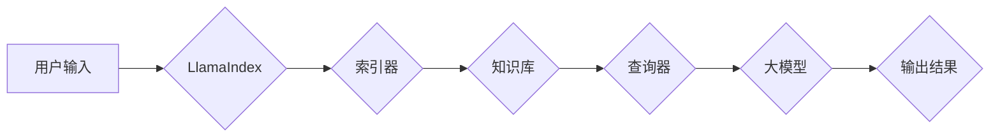

## 【大模型应用开发 动手做AI Agent】简单的LlamaIndex开发示例

> 关键词：大模型、LlamaIndex、AI Agent、知识库、应用开发、Python

## 1. 背景介绍

近年来，大模型在自然语言处理、图像识别、代码生成等领域取得了突破性进展，展现出强大的应用潜力。然而，大模型的知识储备主要来自训练数据，缺乏对外部知识的实时更新和特定领域知识的深度理解。为了解决这一问题，知识增强技术应运而生，其中LlamaIndex作为一种开源的工具，为将大模型与外部知识库连接提供了便捷的途径。

LlamaIndex通过构建知识图谱、索引文档和数据源，使大模型能够访问和利用外部知识，从而提升其推理能力、回答问题准确性和应用场景的扩展性。本文将以简单的LlamaIndex开发示例，带领读者了解其核心概念、工作原理和应用实践，并探讨其在AI Agent开发中的重要意义。

## 2. 核心概念与联系

LlamaIndex的核心概念是将大模型与外部知识库连接起来，形成一个知识增强系统。该系统主要包含以下几个关键部分：

* **大模型:** LlamaIndex支持多种大模型，例如OpenAI的GPT系列、Meta的LLaMA等。大模型负责理解用户输入、生成文本和执行任务。
* **知识库:** LlamaIndex可以连接各种类型的知识库，例如文本文件、数据库、API等。知识库提供大模型所需的外部知识。
* **索引器:** LlamaIndex提供多种索引器，用于将知识库中的数据转换为大模型可理解的格式。
* **查询器:** LlamaIndex提供查询器，用于根据用户输入，从知识库中检索相关信息并返回给大模型。

**LlamaIndex 架构流程图:**



## 3. 核心算法原理 & 具体操作步骤

### 3.1  算法原理概述

LlamaIndex的核心算法原理是基于**向量检索**和**知识图谱构建**。

* **向量检索:** LlamaIndex将知识库中的数据转换为向量，并使用向量相似度计算来检索相关信息。
* **知识图谱构建:** LlamaIndex可以将知识库中的数据构建成知识图谱，以便大模型更好地理解和推理知识关系。

### 3.2  算法步骤详解

1. **数据预处理:** 将知识库中的数据进行清洗、格式化和分词等预处理操作。
2. **向量化:** 使用预训练的语言模型将数据转换为向量表示。
3. **索引构建:** 将向量数据存储在索引库中，例如Faiss、Annoy等。
4. **查询:** 根据用户输入，将输入文本转换为向量，并使用向量相似度计算从索引库中检索相关向量。
5. **结果返回:** 将检索到的相关向量对应的知识信息返回给大模型。

### 3.3  算法优缺点

**优点:**

* **高效:** 向量检索算法能够快速检索相关信息。
* **灵活:** 支持多种类型的知识库和数据源。
* **可扩展:** 可以根据需要扩展知识库规模和数据类型。

**缺点:**

* **向量化质量:** 向量化质量直接影响检索结果的准确性。
* **索引库维护:** 索引库需要定期维护和更新。
* **知识图谱构建:** 构建高质量的知识图谱需要专业知识和技术。

### 3.4  算法应用领域

LlamaIndex的应用领域非常广泛，例如：

* **问答系统:** 构建能够回答用户问题的智能问答系统。
* **搜索引擎:** 增强搜索引擎的知识理解能力，提供更精准的搜索结果。
* **聊天机器人:** 使聊天机器人能够访问外部知识，提供更自然和有意义的对话体验。
* **内容创作:** 帮助用户生成更丰富和有深度的内容。

## 4. 数学模型和公式 & 详细讲解 & 举例说明

### 4.1  数学模型构建

LlamaIndex的核心数学模型是基于**余弦相似度**的向量检索模型。

**余弦相似度公式:**

$$
\text{相似度} = \frac{\mathbf{a} \cdot \mathbf{b}}{\|\mathbf{a}\| \|\mathbf{b}\|}
$$

其中:

* $\mathbf{a}$ 和 $\mathbf{b}$ 是两个向量的表示。
* $\mathbf{a} \cdot \mathbf{b}$ 是两个向量的点积。
* $\|\mathbf{a}\|$ 和 $\|\mathbf{b}\|$ 是两个向量的模长。

### 4.2  公式推导过程

余弦相似度计算公式的推导过程如下:

1. **点积:** 点积表示两个向量在同一方向上的投影长度。
2. **模长:** 模长表示向量的长度。
3. **相似度:** 余弦相似度等于两个向量的点积除以它们的模长乘积，它衡量了两个向量方向上的相似程度。

### 4.3  案例分析与讲解

假设我们有一个知识库，其中包含以下数据:

* 文档1: "苹果是一种水果，颜色是红色的。"
* 文档2: "香蕉是一种水果，颜色是黄色的。"

我们将这两个文档转换为向量表示，假设向量 $\mathbf{a}$ 代表文档1，向量 $\mathbf{b}$ 代表文档2。

如果用户输入 "水果是什么颜色"，我们将该输入转换为向量 $\mathbf{c}$。

然后，我们可以使用余弦相似度计算 $\mathbf{a}$ 和 $\mathbf{c}$ 的相似度，以及 $\mathbf{b}$ 和 $\mathbf{c}$ 的相似度。

如果 $\mathbf{a}$ 和 $\mathbf{c}$ 的相似度更高，则说明文档1与用户输入更相关，LlamaIndex将返回文档1的内容。

## 5. 项目实践：代码实例和详细解释说明

### 5.1  开发环境搭建

1. 安装Python 3.7或更高版本。
2. 安装必要的库，例如LlamaIndex、Transformers、Faiss等。

```bash
pip install llama-index transformers faiss-cpu
```

### 5.2  源代码详细实现

```python
from llama_index import SimpleDirectoryReader, VectorStoreIndex,  
from llama_index.llms import OpenAI
from llama_index.tools import create_and_save_index

# 读取数据
reader = SimpleDirectoryReader("data/documents")

# 创建向量存储索引
llm = OpenAI(temperature=0)
index = VectorStoreIndex.from_documents(documents=reader.load_data(), llm=llm)

# 保存索引
create_and_save_index(index, "my_index")
```

### 5.3  代码解读与分析

1. **数据读取:** 使用`SimpleDirectoryReader`类读取本地文件中的数据。
2. **向量存储索引:** 使用`VectorStoreIndex`类创建向量存储索引，并使用`OpenAI`类作为语言模型进行向量化。
3. **索引保存:** 使用`create_and_save_index`函数将索引保存到本地文件。

### 5.4  运行结果展示

运行上述代码后，将创建一个名为"my_index"的索引文件，该文件包含了数据文件中的文本内容的向量表示。

## 6. 实际应用场景

LlamaIndex在实际应用场景中具有广泛的应用前景，例如:

* **智能客服:** 将知识库中的常见问题解答和产品信息与聊天机器人结合，提供更智能和高效的客服服务。
* **个性化推荐:** 根据用户的兴趣和历史行为，从知识库中推荐相关产品或内容。
* **代码生成:** 将代码库和技术文档与代码生成模型结合，帮助开发者更快更高效地编写代码。

### 6.4  未来应用展望

随着大模型和知识图谱技术的不断发展，LlamaIndex的应用场景将更加广泛，例如:

* **跨语言理解:** 支持多语言知识库和查询，实现跨语言的知识共享和应用。
* **实时知识更新:** 将实时数据源与知识库连接，实现知识库的动态更新和维护。
* **联邦学习:** 将多个用户的知识库进行联邦学习，构建更庞大、更全面的知识图谱。

## 7. 工具和资源推荐

### 7.1  学习资源推荐

* LlamaIndex官方文档: https://www. llama-index.io/docs/
* LlamaIndex GitHub仓库: https://github.com/jerryjliu/llama-index

### 7.2  开发工具推荐

* Python: https://www.python.org/
* Transformers: https://huggingface.co/docs/transformers/index
* Faiss: https://github.com/facebookresearch/faiss

### 7.3  相关论文推荐

* **LlamaIndex: A Framework for Building Powerful AI Agents with Large Language Models**
* **Knowledge-Enhanced Language Models: A Survey**

## 8. 总结：未来发展趋势与挑战

### 8.1  研究成果总结

LlamaIndex为将大模型与外部知识库连接提供了便捷的工具，推动了AI Agent的开发和应用。

### 8.2  未来发展趋势

未来，LlamaIndex将朝着以下方向发展:

* **更强大的知识图谱构建能力:** 支持更复杂的关系和推理，构建更全面的知识图谱。
* **更灵活的索引策略:** 支持多种类型的索引算法和数据结构，提高检索效率和准确性。
* **更完善的应用生态:** 吸引更多开发者加入，构建更丰富的AI Agent应用场景。

### 8.3  面临的挑战

LlamaIndex也面临一些挑战:

* **知识库质量:** 知识库的质量直接影响AI Agent的性能，需要不断完善和更新知识库。
* **数据安全:** 处理用户数据需要保证数据安全和隐私保护。
* **模型可解释性:** AI Agent的决策过程需要更加透明和可解释。

### 8.4  研究展望

未来，我们将继续研究LlamaIndex的应用场景和技术发展，探索大模型与知识库的深度融合，推动AI Agent技术的发展和应用。

## 9. 附录：常见问题与解答

**Q1: LlamaIndex支持哪些类型的知识库？**

**A1:** LlamaIndex支持多种类型的知识库，例如文本文件、数据库、API等。

**Q2: 如何选择合适的索引算法？**

**A2:** 选择合适的索引算法取决于知识库的大小、数据类型和检索需求。

**Q3: 如何保证AI Agent的安全性？**

**A3:** 处理用户数据需要保证数据安全和隐私保护，可以使用加密、匿名化等技术。


作者：禅与计算机程序设计艺术 / Zen and the Art of Computer Programming 
