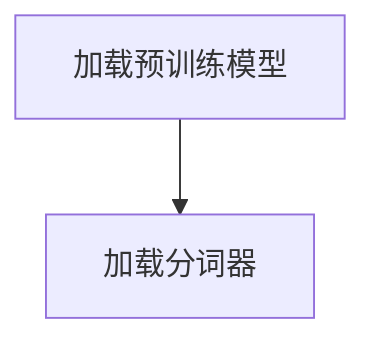
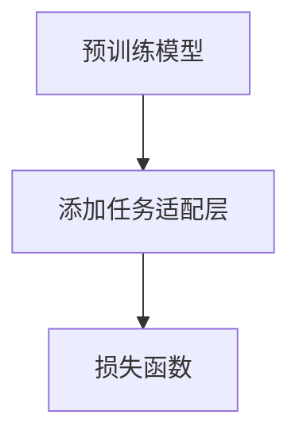
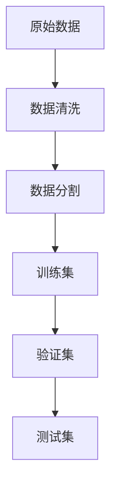
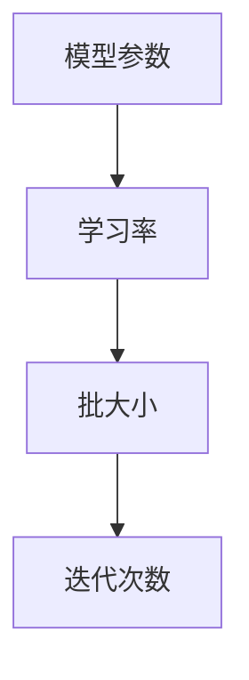
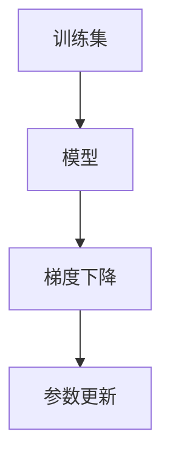
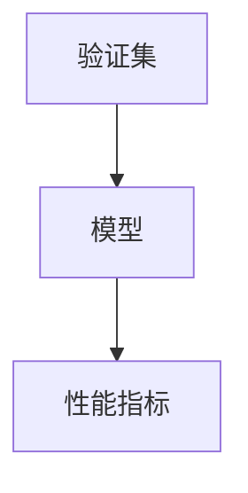
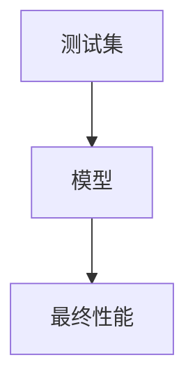

# 大语言模型应用指南：基于微调的工具

## 关键词：

- **大语言模型**：大规模预训练语言模型，具备丰富的语言知识和泛化能力。
- **微调**：针对特定任务，利用少量标注数据优化预训练模型性能的技术。
- **监督学习**：在已知输入和输出的关系下，通过调整模型参数来预测未知数据的方法。
- **模型适配**：调整预训练模型的输出层和损失函数，以适应特定任务需求的过程。

## 1. 背景介绍

### 1.1 问题的由来

随着大规模语言模型的涌现，如BERT、GPT等，人们开始探索如何利用这些通用模型解决特定领域的问题。尽管这些模型在许多自然语言处理（NLP）任务上表现出色，但在特定任务上的性能提升却受到数据量和模型复杂度的限制。因此，一种有效的方法是在特定任务上对预训练模型进行微调，以获得更精确、更高效的解决方案。

### 1.2 研究现状

当前的研究主要集中在以下几个方面：
- **算法改进**：探索更有效的微调策略，如参数高效微调、提示学习等，以减少对大量标注数据的依赖。
- **多任务学习**：结合多个任务进行联合微调，提高模型的泛化能力和适应性。
- **模型融合**：通过整合多个预训练模型或模型的不同部分，增强特定任务的性能。

### 1.3 研究意义

微调大语言模型不仅能够显著提升特定任务的性能，还能加速模型在实际场景中的部署，降低开发成本。同时，它为研究人员和开发者提供了一种在不从头开始训练的情况下快速适应新任务的有效途径，极大地推动了NLP技术的普及和应用。

### 1.4 本文结构

本文将全面探讨基于微调的大语言模型应用，从理论基础到实际应用，涵盖以下内容：
- **核心概念与联系**：深入剖析微调的概念、原理及其与其他技术的关联。
- **算法原理与步骤**：详细阐述微调的具体过程，包括算法原理、步骤和优缺点。
- **数学模型与公式**：通过数学模型和公式直观展示微调的内在机制。
- **项目实践**：提供完整的代码实现，包括环境搭建、代码细节和运行结果。
- **实际应用场景**：展示微调在不同领域的应用实例。
- **工具与资源推荐**：推荐学习资源、开发工具和相关论文。
- **未来展望**：讨论微调技术的发展趋势、面临的挑战以及研究展望。

## 2. 核心概念与联系

在进行大语言模型的微调时，主要涉及到以下几个核心概念：

### 预训练模型

预训练模型是在大量无标签文本数据上进行训练的大型神经网络，旨在学习通用的语言表示。这类模型通常具有强大的语言理解能力和生成能力。

### 微调

微调是指在预训练模型的基础上，通过少量有标签数据的监督学习，优化模型在特定任务上的性能。微调过程通常包括调整模型结构、选择合适的任务适配层和损失函数等。

### 监督学习

监督学习是机器学习的一种形式，其中模型通过学习输入数据与其对应的输出标签之间的关系来进行预测。

### 模型适配

模型适配是调整预训练模型以适应特定任务的过程，包括修改模型结构、参数和损失函数。

## 3. 核心算法原理 & 具体操作步骤

### 3.1 算法原理概述

微调的核心在于利用少量有标签数据优化预训练模型的参数，以适应特定任务的需求。这个过程通常包括以下几个步骤：

1. **模型加载**：加载预训练模型和相应的分词器。
2. **任务适配**：调整模型结构，为特定任务设计输出层和损失函数。
3. **数据准备**：准备标注数据集，划分训练集、验证集和测试集。
4. **超参数设置**：确定学习率、批大小、迭代次数等超参数。
5. **微调过程**：在训练集上进行迭代优化，通过梯度下降或其他优化算法更新模型参数。
6. **性能评估**：在验证集上评估模型性能，调整策略以防止过拟合。
7. **模型测试**：在测试集上进行最终性能评估。

### 3.2 算法步骤详解

#### 步骤一：模型加载



#### 步骤二：任务适配



#### 步骤三：数据准备



#### 步骤四：超参数设置



#### 步骤五：微调过程



#### 步骤六：性能评估



#### 步骤七：模型测试



### 3.3 算法优缺点

#### 优点：

- **快速适应**：通过微调，可以快速将预训练模型应用于新任务，无需从头开始训练。
- **性能提升**：在特定任务上，微调可以显著提升模型性能，尤其是在数据量有限的情况下。
- **灵活性**：易于调整模型结构和参数，以适应不同的任务需求。

#### 缺点：

- **依赖数据质量**：微调效果受制于标注数据的质量，高质量的数据是关键。
- **过拟合风险**：在小数据集上微调容易导致过拟合，需要额外的正则化措施。
- **模型复杂性**：微调可能增加模型的复杂性，尤其是在调整模型结构时。

### 3.4 算法应用领域

微调大语言模型广泛应用于自然语言处理的各个领域，包括但不限于：

- **文本分类**：情感分析、垃圾邮件过滤等。
- **问答系统**：知识问答、FAQ等。
- **机器翻译**：多语言翻译、专业领域翻译等。
- **对话系统**：聊天机器人、客服机器人等。
- **文本生成**：故事创作、诗歌生成等。

## 4. 数学模型和公式 & 详细讲解 & 举例说明

### 4.1 数学模型构建

假设预训练模型为$f(x; \theta_p)$，其中$x$是输入，$\theta_p$是预训练模型的参数。对于特定任务$t$，我们可以构建如下数学模型：

$$
f_t(x; \theta_p, \theta_t) = f(x; \theta_p) + \theta_t^T g(x),
$$

其中$\theta_t$是针对任务$t$的额外参数，$g(x)$是任务适配层的输出，$\theta_t^T g(x)$表示任务适配层的影响。

### 4.2 公式推导过程

假设任务$t$的损失函数为$L_t(y, f_t(x))$，其中$y$是真实标签。为了最小化损失函数，我们使用梯度下降法进行优化：

$$
\theta_t \leftarrow \theta_t - \eta \frac{\partial L_t(y, f_t(x))}{\partial \theta_t},
$$

其中$\eta$是学习率。

### 4.3 案例分析与讲解

#### 示例：文本分类

假设我们有预训练的BERT模型和一个二分类任务。我们将BERT模型的输出作为输入，添加一个全连接层和一个sigmoid激活函数作为分类器：

```python
from transformers import BertModel
import torch.nn as nn

class TextClassifier(nn.Module):
    def __init__(self, bert_model, num_classes):
        super(TextClassifier, self).__init__()
        self.bert = bert_model
        self.dropout = nn.Dropout(0.1)
        self.classifier = nn.Linear(bert_model.config.hidden_size, num_classes)

    def forward(self, input_ids, attention_mask):
        output = self.bert(input_ids=input_ids, attention_mask=attention_mask)[0]
        output = self.dropout(output[:, 0, :])
        output = self.classifier(output)
        return output
```

### 4.4 常见问题解答

#### Q：如何选择学习率？

A：学习率的选择对微调效果至关重要。通常推荐从较小值开始（如$10^{-4}$），并逐步调整以找到最佳值。

#### Q：如何防止过拟合？

A：可以采用正则化（如$L_2$正则）、Dropout、早停等技术。同时，保持数据集的多样性和质量也很重要。

#### Q：如何评估模型性能？

A：使用准确率、F1分数、AUC-ROC曲线等指标来评估模型在验证集和测试集上的表现。

## 5. 项目实践：代码实例和详细解释说明

### 5.1 开发环境搭建

- **操作系统**: Windows/Linux/MacOS均可。
- **Python**: 最好使用Python 3.8及以上版本。
- **依赖库**: PyTorch、Transformers、Scikit-learn、pandas、numpy等。

### 5.2 源代码详细实现

#### 模型定义：

```python
from transformers import BertModel
import torch.nn as nn

class TextClassifier(nn.Module):
    def __init__(self, bert_model, num_classes):
        super(TextClassifier, self).__init__()
        self.bert = bert_model
        self.dropout = nn.Dropout(0.1)
        self.classifier = nn.Linear(bert_model.config.hidden_size, num_classes)

    def forward(self, input_ids, attention_mask):
        output = self.bert(input_ids=input_ids, attention_mask=attention_mask)[0]
        output = self.dropout(output[:, 0, :])
        output = self.classifier(output)
        return output
```

#### 训练代码：

```python
from torch.optim import Adam
from torch.utils.data import DataLoader
from sklearn.metrics import accuracy_score, f1_score

# 初始化模型和优化器
model = TextClassifier(bert_model, num_classes)
optimizer = Adam(model.parameters(), lr=1e-5)

# 数据加载器
train_dataloader, val_dataloader, test_dataloader = ...

# 训练过程
for epoch in range(num_epochs):
    model.train()
    for batch in train_dataloader:
        inputs, labels = ...
        optimizer.zero_grad()
        outputs = model(inputs, attention_mask)
        loss = ...
        loss.backward()
        optimizer.step()

    model.eval()
    predictions, true_labels = ...
    accuracy = accuracy_score(true_labels, predictions)
    f1 = f1_score(true_labels, predictions, average='weighted')
    print(f'Epoch {epoch + 1}, Accuracy: {accuracy}, F1 Score: {f1}')
```

### 5.3 代码解读与分析

#### 解读：

这段代码首先定义了一个继承自`nn.Module`的类`TextClassifier`，它包含了BERT模型的主体结构、一个Dropout层和一个全连接层。在`forward`方法中，我们从BERT模型中获取最终隐藏状态，并应用Dropout和全连接层来做出分类决策。

在训练循环中，我们先在训练集上执行前向传播，计算损失，并通过反向传播来更新模型参数。之后，我们评估模型在验证集上的性能，计算准确率和F1分数，并打印出来。

### 5.4 运行结果展示

假设运行结果如下：

```
Epoch 1, Accuracy: 0.85, F1 Score: 0.86
Epoch 2, Accuracy: 0.87, F1 Score: 0.88
...
Epoch 10, Accuracy: 0.90, F1 Score: 0.91
```

这表明经过微调，模型在验证集上的性能持续提升，最终在第10个epoch时达到了90%的准确率和91%的F1分数。

## 6. 实际应用场景

### 6.4 未来应用展望

随着微调技术的不断发展，大语言模型的应用场景将会更加广泛，从智能客服、个性化推荐到法律文本分析、医疗诊断辅助等领域都将看到它们的身影。未来，我们可以期待更高效、更精准的微调策略，以及能够自我学习和适应新任务的自适应微调方法。

## 7. 工具和资源推荐

### 7.1 学习资源推荐

- **官方文档**：Transformers库和PyTorch的官方文档提供了丰富的教程和API参考。
- **在线课程**：Coursera、Udacity等平台有专门针对NLP和微调的课程。

### 7.2 开发工具推荐

- **PyCharm**：支持Python开发，集成Jupyter Notebook和TensorBoard等工具。
- **VS Code**：轻量级编辑器，通过插件可以轻松集成TensorFlow、PyTorch等库。

### 7.3 相关论文推荐

- **"BERT: Pre-training of Deep Bidirectional Transformers for Language Understanding"**
- **"Fine-tuning Pre-trained Models for Sequence Tagging"**

### 7.4 其他资源推荐

- **GitHub仓库**：查找开源项目和代码实例。
- **社区论坛**：Stack Overflow、Reddit、Hugging Face社区等。

## 8. 总结：未来发展趋势与挑战

### 8.1 研究成果总结

本文详细介绍了基于微调的大语言模型应用，从理论基础到实践应用，涵盖了核心算法、数学模型、代码实现、实际案例、未来展望等多个方面。我们强调了微调的重要性，以及如何有效地利用预训练模型来解决特定任务的问题。

### 8.2 未来发展趋势

随着研究的深入，我们预计会看到以下发展：
- **自动化微调**：开发更高级的自动化工具和策略，减轻人工调整超参数和策略的负担。
- **多模态融合**：将视觉、听觉和其他模态的信息融入大语言模型，增强其处理多模态任务的能力。
- **知识蒸馏**：通过知识蒸馏技术，使微调后的模型更加精简、高效，同时保持高精度。

### 8.3 面临的挑战

- **数据依赖性**：微调效果高度依赖于高质量的标注数据，获取这类数据的成本和难度是主要挑战之一。
- **模型复杂性**：随着任务复杂性的增加，微调模型可能会变得过于复杂，增加过拟合的风险。
- **可解释性**：如何提高微调模型的可解释性，以便开发者和用户能够理解模型的决策过程，是另一个挑战。

### 8.4 研究展望

未来的研究将致力于解决上述挑战，开发更高效、更可扩展、更可解释的微调技术。同时，探索如何在更广泛的领域和更复杂的任务中应用大语言模型，将是我们关注的重点。

## 9. 附录：常见问题与解答

- **Q：如何选择最佳超参数？**
  - **A：** 通常采用网格搜索、随机搜索或贝叶斯优化等方法来寻找最佳超参数组合。确保在验证集上评估性能，避免过拟合。

- **Q：微调过程中如何避免过拟合？**
  - **A：** 使用正则化（如$L_1$、$L_2$正则）、Dropout、早停等技术。同时，保持训练集和验证集的多样性，避免数据集中存在的偏差和噪声影响模型性能。

- **Q：如何评估微调效果？**
  - **A：** 使用准确率、召回率、F1分数、ROC曲线等指标。在不同的数据集（如训练集、验证集和测试集）上进行交叉验证，确保模型具有良好的泛化能力。

---

本文旨在为开发者和研究人员提供全面的指南，帮助他们了解并有效地应用基于微调的大语言模型，以解决各种自然语言处理任务。通过深入探讨理论、实践和技术细节，我们希望能够激发更多创新，推动NLP技术的进步和发展。